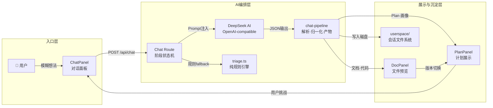
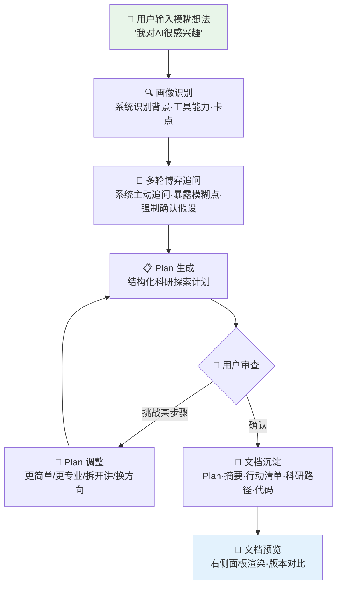

本页是「科研课题分诊台」项目的总入口文档。你将了解这个项目**为什么存在**、**解决什么问题**、**核心价值主张**，以及它的**技术形态与架构全景**。本文档面向首次接触本项目的开发者，帮助你快速建立对产品定位与系统架构的全局认知。

Sources: [README.md](README.md#L1-L4), [人人都能做科研_mvp_prd_审查版.md](人人都能做科研_mvp_prd_审查版.md#L1-L13)

---

## 1. 产品一句话定义

**「人人都能做科研」**是一款面向非专业科研人群的 **AI 科研启蒙与路径引导平台**。它通过傻瓜式对话、多轮追问、用户画像识别、结构化 Plan 展示和文档预览，帮助用户从"我对科研感兴趣但不知道怎么开始"进入"我知道自己是谁、适合做什么、下一步该怎么走"的状态。系统对外的产品名称是**「科研课题分诊台」**，这个名字精确地描述了它的核心功能：像医院分诊台一样，先判断你是谁、你卡在哪，再引导你走向合适的路径。

Sources: [人人都能做科研_mvp_prd_审查版.md](人人都能做科研_mvp_prd_审查版.md#L169-L172), [src/app/page.tsx](src/app/page.tsx#L7-L10)

---

## 2. 产品定位：不是什么，是什么

理解本产品的第一步是理解它**不是什么**。它**不是**专业科研论文工具，**不是**通用 AI 聊天机器人，也**不是**代码生成器或数据采集平台。它是一个面向普通人的**科研入口**——用普通人熟悉的交互方式（聊天、选择按钮、查看文档），承载科研式的问题拆解、路径规划和持续引导。用户不需要一开始就理解"研究问题""论文""实验""变量""综述"等概念，系统会通过对话逐步识别用户状态，用适合用户水平的语言进行引导。

Sources: [人人都能做科研_mvp_prd_审查版.md](人人都能做科研_mvp_prd_审查版.md#L174-L181)

### 2.1 三层能力定位

| 层次 | 职责 | 对应技术 |
|------|------|----------|
| **科研任务入口层** | 接收用户模糊想法，识别画像，暴露模糊点，引导收敛 | 对话阶段状态机 + 用户画像记忆系统 |
| **AI 编排层** | 多段式 Prompt 工作流，生成结构化 Plan，解析与归一化 AI 输出 | `/api/chat` 端点 + `chat-pipeline.ts` + `skills/*.md` |
| **结果展示层** | Plan 展示与博弈调整、文档预览、版本对比、文件沉淀 | SidePanel + PlanPanel + DocPanel + userspace 文件系统 |

这个三层架构可以用一个 Mermaid 图来直观表达：



Sources: [README.md](README.md#L8-L14), [Research-Triage/README.md](Research-Triage/README.md#L7-L15), [Research-Triage/ARCHITECTURE.md](Research-Triage/ARCHITECTURE.md#L16-L18)

---

## 3. 核心价值：为什么需要这个产品

产品的核心价值主张集中在四个维度：

**① 降低科研入口门槛。** 传统科研训练默认用户已身处专业体系（学校、实验室、导师制度），但大量普通人并不在此体系内。本产品让非专业用户也能开始理解和尝试科研思维——提出问题、搜集信息、验证假设、形成解释、记录过程、分享结果，这些能力不应只属于专业机构。

**② 把模糊兴趣转化为可执行路径。** 用户不需要一开始就提出标准的科研问题。一句"我对 AI 很感兴趣，但我什么都不懂"就足以触发系统的分诊流程。系统会帮助用户将生活观察、模糊兴趣或任务压力拆解为一个明确的、可操作的科研探索路径。

**③ 根据用户画像调整解释方式。** 不同年龄、教育背景、工具能力和认知起点的用户，应得到截然不同的表达方式和行动建议。系统维护 10 维度的用户画像（年龄段、教育水平、工具能力、AI 熟悉程度、科研理解程度、兴趣方向、当前卡点、可投入设备、可投入时间、偏好解释风格），并以**置信度驱动**的机制逐步确立画像。

**④ 用结构化 Plan 替代泛泛回答。** 产品输出不应停留在普通聊天回答层面，而应生成结构化、可审查、可调整、可对比版本的计划文档，并沉淀为可预览的 Markdown 文件。

Sources: [人人都能做科研_mvp_prd_审查版.md](人人都能做科研_mvp_prd_审查版.md#L184-L198), [人人都能做科研_mvp_prd_审查版.md](人人都能做科研_mvp_prd_审查版.md#L224-L262)

---

## 4. 目标用户与核心痛点

### 4.1 MVP 核心用户

MVP 版本优先服务**Z 世代普通用户 / 科研新手 / 对 AI 和科技有兴趣但没有系统科研训练的人**。选择这个用户群的原因是：该用户对 AI 和对话式产品接受度高，其工具基础足够支撑 Web 产品验证，科研基础不足导致痛点明显，语言风格和使用习惯容易建模，且可作为后续扩展到其他人群的中间基准。

Sources: [人人都能做科研_mvp_prd_审查版.md](人人都能做科研_mvp_prd_审查版.md#L283-L293)

### 4.2 长期用户扩展方向

| 用户类型 | 核心特征 | 核心需求 |
|----------|----------|----------|
| 小学生 / 中学生 | 好奇心强，知识体系弱 | 通俗解释、简单实验、兴趣引导 |
| Z 世代普通用户（MVP） | 熟悉互联网，科研训练不足 | 用熟悉语言理解科研路径 |
| 本科生 / 科研新手 | 有学习能力，不会拆课题 | 选题、综述、实验和行动路径 |
| 中老年用户 | 只会基础手机操作 | 低门槛、强引导、少术语 |
| 非技术背景用户 | 对 AI 感兴趣，不懂工具 | 工具翻译、步骤拆解、陪伴式引导 |

Sources: [人人都能做科研_mvp_prd_审查版.md](人人都能做科研_mvp_prd_审查版.md#L373-L381)

### 4.3 五大核心痛点

1. **不知道如何进入科研**——有兴趣不知道从哪开始，有问题不知道怎么研究，有任务不知道如何拆解
2. **不知道如何使用基础工具**——会微信和短视频，不会设计问题、追问 AI、整理文档、构建计划
3. **不知道如何表达真实需求**——无法准确说出"我是谁、我懂多少、我想做什么、我卡在哪里"
4. **不知道如何利用 AI 深入探索**——只会问一句话，不会限制输出、要求拆解、验证结果
5. **需要清晰可读可执行的结果**——不需要 Markdown 源码和后端推理痕迹，需要看得懂的下一步

Sources: [人人都能做科研_mvp_prd_审查版.md](人人都能做科研_mvp_prd_审查版.md#L462-L540)

---

## 5. 核心闭环：用户旅程全景

MVP 只验证一个核心闭环。以下 Mermaid 流程图展示了用户从输入模糊想法到获得可执行成果的完整旅程：



这个闭环的每个阶段都由后端 `/api/chat` 端点通过**对话阶段状态机**（`greeting → profiling → clarifying → planning → reviewing`）驱动。每个阶段有明确的输入输出协议和允许的产物类型。

Sources: [人人都能做科研_mvp_prd_审查版.md](人人都能做科研_mvp_prd_审查版.md#L200-L219), [Research-Triage/ARCHITECTURE.md](Research-Triage/ARCHITECTURE.md#L88-L104)

---

## 6. 设计理念：五大核心原则

| 原则 | 含义 | 工程体现 |
|------|------|----------|
| **科研平权** | 科研不应是少数专业人士的特权，每个人都应有进入科研思维的入口 | 产品面向非专业用户，系统内嵌科学方法论 Skills |
| **极客精神** | Geek for fun / sharing / future / everyone | 产品定位鼓励从好奇心出发，强调分享和面向未来 |
| **傻瓜式交互，科研式内核** | 外层像聊天、像选择按钮；内层严谨地判断用户、拆解问题、生成计划 | ChatPanel + ChoiceButtons 驱动交互，chat-prompts 注入严谨科研流程 |
| **先引导，再输出** | 用户目标不清楚时先追问，画像不清楚时先识别，路径不清楚时先生成可讨论的 Plan | 阶段状态机强制推进，Plan 生成前置检查清单 9 项 |
| **先跑通单一画像，再扩展泛化** | MVP 只做 Z 世代科研新手画像，后续再扩展 | 用户画像 5 种类型（A-E），MVP 聚焦验证核心闭环 |

Sources: [人人都能做科研_mvp_prd_审查版.md](人人都能做科研_mvp_prd_审查版.md#L297-L367)

---

## 7. 技术形态：工程实现概览

### 7.1 技术栈

| 层 | 选型 | 说明 |
|----|------|------|
| 框架 | Next.js 16 (App Router) | 前端页面 + 后端 Route Handlers 一体化 |
| 语言 | TypeScript 5.9 | 前后端共享类型定义 |
| UI | React 19 | 客户端状态使用 `useState` + `sessionStorage` |
| AI 调用 | 裸 `fetch` → DeepSeek API | 绕过 SDK 兼容问题，直接调用 OpenAI-compatible 接口 |
| Markdown 渲染 | `marked` | Plan/文档预览 |
| 校验 | Zod 4.x | 前后端共用 schema |
| 测试 | Vitest 4.x | 契约测试、Pipeline 解析测试、Userspace 测试 |
| 部署 | Vercel（优先） | Next.js 原生支持 |

Sources: [ARCHITECTURE.md](ARCHITECTURE.md#L8-L19), [Research-Triage/ARCHITECTURE.md](Research-Triage/ARCHITECTURE.md#L21-L31)

### 7.2 两代管线的关系

本仓库包含**两代管线**，它们共存于同一个 Git 仓库中：

| 维度 | 根目录旧管线 | Research-Triage 新管线 |
|------|-------------|----------------------|
| **入口 API** | `POST /api/triage`（多端点表单式） | `POST /api/chat`（单端点对话式） |
| **前端形态** | 多页面（`/intake`、`/result`、`/route-plan`） | 单页工作台三区布局 |
| **分诊方式** | 表单收集 → 规则引擎 `triage.ts` | 多轮对话 → AI 编排 + 规则 fallback |
| **产物存储** | 无持久化 | `userspace/{sessionId}/` 文件系统 |
| **AI 集成** | `ai-triage.ts`（多轮独立 API 调用） | `chat-prompts.ts` + `chat-pipeline.ts`（阶段式编排） |
| **状态管理** | 无会话恢复 | 内存 Map + `sessionStorage` |
| **当前状态** | 部分文件保留作为 fallback 参考 | **当前主链路**，Phase 1-4 已完成整合 |

根目录保留了 `src/lib/triage.ts` 及其测试，作为新管线 AI 调用失败时的**规则 fallback 基础模块**。旧的 `/api/triage`、`/api/generate-answer`、`/api/recommend-service` 等端点和对应前端组件已在 Research-Triage 子项目中清理。

Sources: [README.md](README.md#L106-L123), [Research-Triage/ARCHITECTURE.md](Research-Triage/ARCHITECTURE.md#L208-L232)

---

## 8. 安全边界：产品不做什么

本产品有明确的伦理红线。系统在 `triage.ts` 中内置了安全模式检测，会拦截"代写论文""伪造数据""捏造实验""规避学术审查""绕过查重""包过答辩"等违规请求。产品首页也明确声明：**这不是代写工具，也不帮助伪造实验或数据。它只做理解课题、压缩目标、规划真实交付和整理汇报口径。**

Sources: [src/lib/triage.ts](src/lib/triage.ts#L13-L26), [src/app/page.tsx](src/app/page.tsx#L42-L45)

MVP 阶段**明确不做**的事项包括：完整科研论文写作、真实科研数据库系统、复杂实验设计平台、导师端或机构端后台、全年龄段同时泛化、用户登录、多设备同步、文件上传、真实学生实验数据采集、自动生成完整论文、后台人工审核系统。

Sources: [人人都能做科研_mvp_prd_审查版.md](人人都能做科研_mvp_prd_审查版.md#L636-L648), [Research-Triage/ARCHITECTURE.md](Research-Triage/ARCHITECTURE.md#L251-L262)

---

## 9. 项目目录结构一览

以下树形图展示了 Research-Triage（当前主链路）的核心目录结构：

```text
Research-Triage/
├── src/
│   ├── app/
│   │   ├── page.tsx                    # 唯一主工作台入口
│   │   ├── layout.tsx                  # 全局布局
│   │   ├── api/
│   │   │   ├── chat/route.ts           # 主对话端点（核心）
│   │   │   └── userspace/[sessionId]/  # 文件预览与下载
│   │   ├── intake/page.tsx             # 兼容跳转 → /
│   │   ├── result/page.tsx             # 兼容跳转 → /
│   │   └── route-plan/page.tsx         # 兼容跳转 → /
│   ├── components/
│   │   ├── chat-panel.tsx              # 对话面板
│   │   ├── chat-input.tsx              # 输入框
│   │   ├── choice-buttons.tsx          # 结构化选项按钮
│   │   ├── side-panel.tsx              # 右侧工作区
│   │   ├── plan-panel.tsx              # Plan 展示
│   │   ├── plan-history-panel.tsx      # 版本对比
│   │   ├── file-list.tsx               # 文件列表
│   │   └── doc-panel.tsx              # 文档预览
│   └── lib/
│       ├── ai-provider.ts              # AI 调用封装
│       ├── chat-prompts.ts             # 阶段 Prompt
│       ├── chat-pipeline.ts            # JSON 解析·Plan 归一化·产物生成
│       ├── memory.ts                   # 用户画像记忆
│       ├── skills.ts                   # Skills 方法论加载
│       ├── userspace.ts                # 会话文件存储
│       ├── triage.ts                   # 规则 fallback 引擎
│       └── triage-types.ts             # 共享类型定义
├── skills/                             # 科学方法论 Skills 文件
├── prompt_templates/                   # 七阶段 Prompt 模板（根目录旧管线）
└── 人人都能做科研_mvp_prd_审查版.md     # 产品 PRD
```

Sources: [Research-Triage/README.md](Research-Triage/README.md#L35-L67), [Research-Triage/ARCHITECTURE.md](Research-Triage/ARCHITECTURE.md#L35-L60)

---

## 10. 下一步阅读建议

现在你已经了解了产品的定位、价值和整体架构，建议按以下顺序继续深入：

1. **搭建环境** → [快速启动：环境搭建、依赖安装与本地运行](2-kuai-su-qi-dong-huan-jing-da-jian-yi-lai-an-zhuang-yu-ben-di-yun-xing)
2. **理解两代管线** → [项目结构总览：根目录旧管线与 Research-Triage 演进关系](3-xiang-mu-jie-gou-zong-lan-gen-mu-lu-jiu-guan-xian-yu-research-triage-yan-jin-guan-xi)
3. **深入架构** → [整体架构：单页工作台三区布局与数据流](6-zheng-ti-jia-gou-dan-ye-gong-zuo-tai-san-qu-bu-ju-yu-shu-ju-liu)
4. **理解核心引擎** → [对话阶段状态机：greeting → profiling → clarifying → planning → reviewing](7-dui-hua-jie-duan-zhuang-tai-ji-greeting-profiling-clarifying-planning-reviewing)