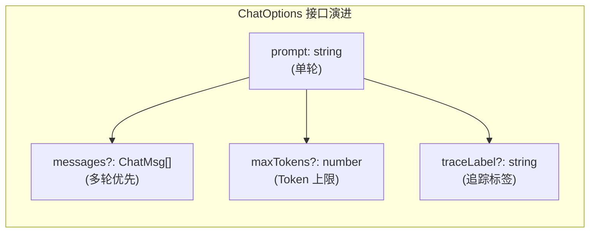
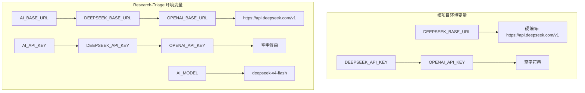
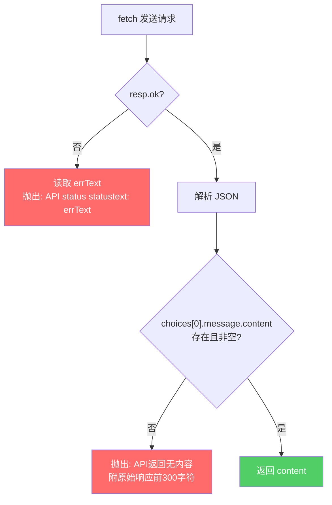
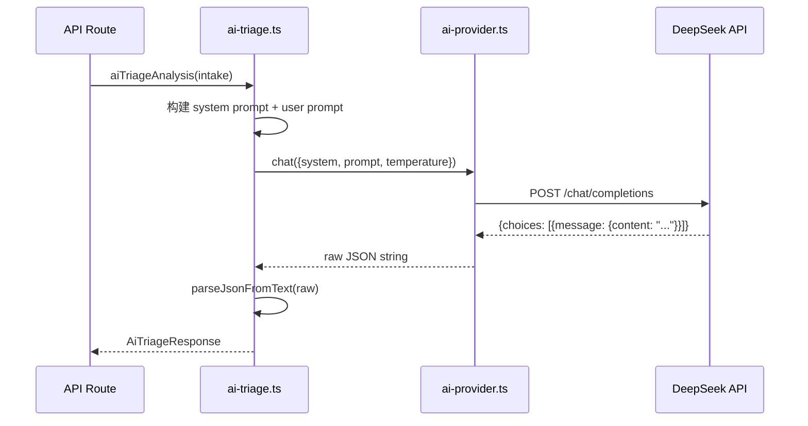

本文聚焦于项目中 `ai-provider.ts` 模块的核心设计决策——**为何放弃 Vercel AI SDK 的 `@ai-sdk/openai` 封装，转而使用原生 `fetch` 直接调用 OpenAI 兼容的 `/chat/completions` 端点**。我们将从架构动机、接口契约、错误处理策略、以及根项目与 Research-Triage 两个版本的演进对比四个维度进行完整解析。

Sources: [ai-provider.ts](src/lib/ai-provider.ts#L1-L56)

## 设计动机：为何绕过 AI SDK

根项目的 `package.json` 中确实声明了 `@ai-sdk/openai@^3.0.55` 和 `ai@^6.0.172` 两个依赖，但源码中**没有任何一行实际 import 它们**——`ai-provider.ts` 开头的注释直截了当地说明了原因：`Bypasses @ai-sdk/openai entirely to avoid compatibility issues`。

这一决策的背后有三重考量：

| 维度 | AI SDK 封装 | 裸 fetch 方案 |
|------|------------|--------------|
| **兼容性** | 依赖 SDK 版本与模型 ID 映射，DeepSeek 模型名（如 `deepseek-v4-flash`）可能不被识别 | 直接发送 `model` 字符串到 API，完全由后端决定有效性 |
| **调试透明度** | SDK 内部对请求/响应做了多层转换，出错时堆栈深、难定位 | 一行 `console.log` 即可看到完整 URL 和模型参数 |
| **依赖稳定性** | Hackathon 场景下 SDK 版本迭代频繁，破坏性变更风险高 | `fetch` 是 Web 标准接口，零额外依赖、永不过时 |

在 Hackathon 这种时间敏感的开发场景中，**可控性优先于抽象优雅**——当你凌晨三点调试 DeepSeek API 返回空内容时，你希望看到的是原始 JSON 响应体，而不是被 SDK 吞掉后抛出的一层嵌套一层的不透明错误。

Sources: [package.json](package.json#L12-L19), [ai-provider.ts](src/lib/ai-provider.ts#L1-L4)

## 接口契约：ChatOptions 与返回值设计

### 根项目（单轮简化版）

根项目的 `ai-provider.ts` 提供了一个极简的 `ChatOptions` 接口，专为一问一答的单轮交互设计：

```typescript
interface ChatOptions {
  model?: string;        // 默认 deepseek-v4-flash
  temperature?: number;  // 默认 0.3
  system?: string;       // 可选 system prompt
  prompt: string;        // 必填用户消息
}

export async function chat(opts: ChatOptions): Promise<string>
```

这个设计的核心特征是 **返回 `Promise<string>`**——调用方直接拿到纯文本内容，无需关心响应结构。对于 `ai-triage.ts` 中"发送 prompt → 获取 JSON 文本 → 手动解析"的工作模式，这个薄封装恰到好处。

Sources: [ai-provider.ts](src/lib/ai-provider.ts#L11-L54)

### Research-Triage（多轮增强版）

Research-Triage 版本在此基础上做了三个维度的增强，使其能支撑完整的对话状态机：



关键差异体现在 `messages` 字段的引入——当 `messages` 存在时，它会**覆盖** `prompt`/`system` 的单轮拼接逻辑，允许调用方传入完整的多轮对话历史。返回值也从裸 `string` 升级为 `{ content: string }` 结构体，为后续扩展（如返回 token 用量）预留空间。

| 特性 | 根项目 | Research-Triage |
|------|--------|-----------------|
| 单轮调用 | ✅ `prompt` + `system` | ✅ 向后兼容 |
| 多轮对话 | ❌ | ✅ `messages` 数组 |
| Token 上限控制 | ❌ | ✅ `maxTokens` |
| 调用追踪 | 简单 console.log | ✅ `traceLabel` + 延迟计时 |
| 返回值类型 | `string` | `{ content: string }` |
| API Key 缺失校验 | 静默（空字符串） | ✅ 抛出明确错误 |

Sources: [Research-Triage ai-provider.ts](Research-Triage/src/lib/ai-provider.ts#L36-L116)

## 环境变量与 Provider 切换机制

两个版本都遵循 **"仅改 `.env`，不动代码"** 的切换原则，但 Research-Triage 版本的 fallback 链更长，适配更广泛的部署场景：



Research-Triage 新增的 `AI_BASE_URL`、`AI_API_KEY`、`AI_MODEL` 三个**Provider 无关**变量名是关键设计——当你需要从 DeepSeek 切换到 Moonshot、智谱 GLM 或本地 vLLM 时，只需修改这三个通用变量，而不会与特定 Provider 的遗留变量产生语义混淆。URL 拼接时还做了尾部斜杠清理（`BASE.replace(/\/$/, "")`），避免 `//chat/completions` 这类低级错误。

根项目则保持了 Hackathon 的简洁风格：硬编码两个模型常量 `DEFAULT_MODEL` 和 `PRO_MODEL`，通过 `as const` 确保类型字面量推断，在调用处直接 `opts.model ?? DEFAULT_MODEL` 完成回退。

Sources: [ai-provider.ts](src/lib/ai-provider.ts#L5-L9), [Research-Triage ai-provider.ts](Research-Triage/src/lib/ai-provider.ts#L19-L31)

## 请求构建与响应解析

### 请求体构造

核心请求体严格遵循 OpenAI `/chat/completions` 规范——`model`、`temperature`、`messages` 三要素：

```typescript
const body = {
  model: opts.model ?? DEFAULT_MODEL,
  temperature: opts.temperature ?? 0.3,
  messages: [
    ...(opts.system ? [{ role: "system", content: opts.system }] : []),
    { role: "user", content: opts.prompt },
  ] as Array<{ role: string; content: string }>,
};
```

这里有一个容易被忽略的细节：`system` 消息是**条件性插入**的。当 `opts.system` 为空字符串或 `undefined` 时，`messages` 数组中只有一条 `user` 消息。这避免了向 API 发送空内容的 `system` 角色消息，某些 Provider 对空 system 消息的容错行为不一致。

Sources: [ai-provider.ts](src/lib/ai-provider.ts#L18-L26)

### 响应安全提取

响应解析采用了**防御式链式可选访问**模式：

```typescript
const json = (await resp.json()) as {
  choices?: Array<{ message?: { content?: string } }>;
};

const content = json.choices?.[0]?.message?.content;
if (!content) {
  throw new Error(`API返回无内容。原始响应: ${JSON.stringify(json).slice(0, 300)}`);
}
```

三层可选链（`choices?` → `[0]` → `message?` → `content?`）确保即使 API 返回结构不完全符合预期（例如 `choices` 为空数组、`message` 为 `null`），也不会触发运行时 TypeError。`slice(0, 300)` 截断原始响应是为了在错误日志中提供足够诊断信息的同时，避免日志爆炸。

Sources: [ai-provider.ts](src/lib/ai-provider.ts#L45-L55)

## 错误处理策略

`ai-provider.ts` 的错误处理遵循 **"快速失败、信息丰富"** 原则，在两个检查点设置防线：



**第一道防线——HTTP 状态码**：当 API 返回 4xx/5xx 时，`resp.text()` 读取错误体并截断至 300 字符。注意 `.catch(() => "")` 的兜底——如果连错误响应体都读不出来（网络中断等极端情况），也不会让错误处理本身抛出异常。

**第二道防线——内容有效性**：即使 HTTP 200，DeepSeek 可能在极端情况下返回空 `choices` 或空 `content`。此时的错误消息包含原始 JSON 的前 300 字符，让开发者能直接看到 API 实际返回了什么。

Research-Triage 版本在此基础上增加了**延迟计时日志**，为性能监控提供了基础数据：

```
[chat] success sid=abc12345 phase=profiling step=primary latencyMs=2340 contentChars=892
```

Sources: [ai-provider.ts](src/lib/ai-provider.ts#L40-L55), [Research-Triage ai-provider.ts](Research-Triage/src/lib/ai-provider.ts#L89-L115)

## 上层调用模式：从 Provider 到业务逻辑

`ai-provider.ts` 作为底层传输层，被 `ai-triage.ts` 消费。后者为每个业务场景构建专用的 system prompt，然后通过 `chat()` 获取 JSON 文本并用 `parseJsonFromText()` 解析：



值得注意的是 `aiGenerateAnswer` 函数使用了 `Promise.all` **并行发起两个 chat 请求**——一个生成回答，一个做质量检查。这意味着 `ai-provider.ts` 的无状态设计（每次调用独立、无共享状态）天然支持并发，两个请求互不干扰。

Sources: [ai-triage.ts](src/lib/ai-triage.ts#L50-L133), [triage route](src/app/api/triage/route.ts#L23-L24), [generate-answer route](src/app/api/generate-answer/route.ts#L34-L37)

## 调试验证脚本：从 SDK 测试到裸 fetch 测试

项目中保留了两个阶段的测试脚本，恰好映射了从 SDK 到裸 fetch 的演进路径：

| 脚本 | 方式 | 目的 |
|------|------|------|
| `scripts/test-deepseek.ts` | `@ai-sdk/openai` + `ai.generateText` | 早期 SDK 验证，确认 API Key 和连通性 |
| `scripts/test-deepseek-simple.js` | `@ai-sdk/openai` + `ai.generateText` | 根项目版 SDK 测试 |
| `Research-Triage/scripts/test-deepseek-simple.js` | 裸 `fetch` | 新管线验证，直接调用 `/chat/completions` |

Research-Triage 版本的测试脚本就是 `ai-provider.ts` 的最小化原型——相同的 URL 拼接、相同的 header 结构、相同的 `choices[0].message.content` 提取逻辑。这种"脚本先行、模块后置"的开发模式在 Hackathon 中非常高效：先用 30 行脚本验证 API 可达，再将其提炼为可复用的模块。

Sources: [test-deepseek.ts](scripts/test-deepseek.ts#L1-L31), [test-deepseek-simple.js](scripts/test-deepseek-simple.js#L1-L28), [Research-Triage test script](Research-Triage/scripts/test-deepseek-simple.js#L1-L48)

## 架构定位与边界

在整体架构中，`ai-provider.ts` 是**唯一与外部 AI API 交互的模块**。它不关心业务语义（分诊、回答生成、服务推荐），不处理 JSON 解析，不维护会话状态——它的职责边界就是：**给定消息，返回文本**。

这种"薄到几乎透明"的适配层设计，使得上层可以自由选择解析策略（`ai-triage.ts` 的简单 `parseJsonFromText` 或 `chat-pipeline.ts` 的多层容错解析），而无需担心底层传输细节泄漏到业务逻辑中。

下一步建议阅读 [Chat Pipeline：AI JSON 输出解析、Plan 归一化与产物生成](12-chat-pipeline-ai-json-shu-chu-jie-xi-plan-gui-yi-hua-yu-chan-wu-sheng-cheng)，了解 Research-Triage 如何在上层构建更复杂的多轮对话管道和 JSON 解析容错机制；或阅读 [AI 调用失败的降级与冗余机制](17-ai-diao-yong-shi-bai-de-jiang-ji-yu-rong-yu-ji-zhi)，了解当 `chat()` 抛出异常时系统如何优雅降级。