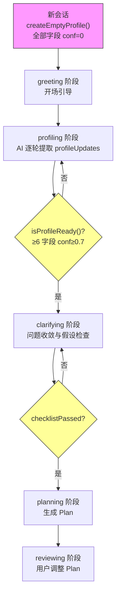

用户画像记忆系统是「科研课题分诊台」从"一次性表单分诊"跃迁为"多轮对话式理解"的核心枢纽。它不再依赖用户填写固定选项来判定画像，而是通过 **置信度字段逐轮递增** 的方式，让 AI 在自然对话中逐步"博弈式"地逼近用户的真实特征——每一次用户回复都是一枚证据筹码，每一次 AI 推断都是一场置信度博弈。当足够多的字段达到可靠阈值后，系统自动推动对话进入下一阶段。本文将深入解析这套机制的数据结构、状态流转、AI 协作协议与持久化恢复策略。

Sources: [memory.ts](Research-Triage/src/lib/memory.ts#L1-L94), [triage-types.ts](Research-Triage/src/lib/triage-types.ts#L121-L133)

## 设计动机：从静态分类到动态博弈

根项目的旧管线 [triage.ts](src/lib/triage.ts#L71-L103) 采用纯规则匹配：根据 `backgroundLevel`、`deadline` 等表单字段的组合硬编码判定用户属于五类画像之一。这种方式有两个结构性缺陷——**信息一次性消耗**（用户填完表单后无法补充或修正）和 **分类边界刚性**（规则优先级固定，无法处理矛盾信号）。

新管线引入了一套完全不同的哲学：画像不是"判定"出来的，而是"收敛"出来的。系统在 `memory.ts` 中定义了 10 个独立的画像字段，每个字段各自维护置信度、来源标签和更新时间。AI 在每次对话中从用户语句中提取任意数量的字段并附带主观置信度评分，用户通过点击结构化选项隐式确认或修正这些推断。这种设计将画像确立从"单次判定"变成了"多轮博弈"——AI 持续下注（推断），用户持续验证（选择或纠正），直到系统认为画像足够可靠。

Sources: [triage.ts](src/lib/triage.ts#L71-L103), [memory.ts](Research-Triage/src/lib/memory.ts#L1-L35)

## 核心数据模型：ProfileField 与 UserProfileMemory

整个画像系统的基石是 `ProfileField` 类型，它为每一个画像维度赋予三层元信息：

| 属性 | 类型 | 含义 |
|------|------|------|
| `value` | `string` | 字段当前值（如"本科生"、"有一定基础"） |
| `confidence` | `number` | 置信度，范围 0.0–1.0 |
| `source` | `"inferred" \| "deduced" \| "user_confirmed"` | 信息来源标签 |
| `updatedAt` | `number` | 最后更新的时间戳 |

`UserProfileMemory` 是 `Record<keyof UserProfileState, ProfileField>`，即 10 个字段各自独立持有一个 `ProfileField` 实例。这 10 个字段在 [triage-types.ts](Research-Triage/src/lib/triage-types.ts#L122-L133) 中定义如下：

| 字段名 | 中文含义 | 示例值 |
|--------|----------|--------|
| `ageOrGeneration` | 年龄段/时代背景 | "00后大学生" |
| `educationLevel` | 教育水平 | "本科在读" |
| `toolAbility` | 工具使用能力 | "会用 Python 基础语法" |
| `aiFamiliarity` | AI 熟悉程度 | "用过 ChatGPT 问问题" |
| `researchFamiliarity` | 科研理解程度 | "完全不了解科研流程" |
| `interestArea` | 兴趣方向 | "机器学习与数据分析" |
| `currentBlocker` | 当前卡点 | "不知道怎么选题" |
| `deviceAvailable` | 可投入设备 | "只有一台笔记本" |
| `timeAvailable` | 可投入时间 | "每周大约 5 小时" |
| `explanationPreference` | 偏好解释风格 | "用比喻和类比来解释" |

每个新会话通过 `createEmptyProfile()` 初始化，所有字段置信度归零、值为空字符串、来源标记为 `"inferred"`。这意味着系统从"对用户一无所知"开始，通过对话逐步积累证据。

Sources: [memory.ts](Research-Triage/src/lib/memory.ts#L3-L35), [triage-types.ts](Research-Triage/src/lib/triage-types.ts#L122-L133)

## 置信度语义：四级阈值与阶段门控

置信度不是模糊的"感觉"，而是有明确语义的数值刻度，直接驱动系统的阶段推进决策。系统在 `memory.ts` 和 `chat-prompts.ts` 中定义了三级关键阈值：

| 置信度范围 | 语义 | 来源标签 | 前端展示 | 系统行为 |
|-----------|------|---------|---------|---------|
| **1.0** | 用户明确说了 | `user_confirmed` | ● 已确认 | 作为 Plan 基础的可靠字段 |
| **0.7–0.99** | AI 从用户暗示推断 | `deduced` | ◉ 推断中 | 计入"可靠字段"，满足阶段推进条件 |
| **0.3–0.69** | AI 猜测 | `inferred` | ○ 猜测中 | 计入"已识别字段"，但不参与阶段推进 |
| **0–0.29** | 无信号 | `inferred` | 不展示 | 系统将继续通过提问获取 |

系统提供了两个关键的过滤函数来基于这些阈值做决策：`getDetectedFields()` 返回置信度 ≥ 0.3 的字段列表（用于展示和持久化判断），`getReliableFields()` 返回置信度 ≥ 0.7 的字段列表（用于阶段推进判断）。而 `isProfileReady()` 的门控条件是 **≥ 6 个字段达到 0.7 置信度**——这是从 profiling 阶段进入 clarifying 阶段的硬性门槛。

Sources: [memory.ts](Research-Triage/src/lib/memory.ts#L50-L63), [chat-prompts.ts](Research-Triage/src/lib/chat-prompts.ts#L5-L21)

## 博弈式提取协议：AI 的 profileUpdates 输出格式

画像字段不是通过表单收集的，而是通过 AI 在对话中逐步提取的。这体现在 `PROFILING_INSTRUCTION` 中定义的 JSON 输出协议——AI 在每一轮回复中必须输出 `profileUpdates` 数组，其中每个条目包含 `field`（字段名）、`value`（推断值）和 `confidence`（主观置信度）。

AI 对置信度的赋值遵循明确指令：
- **0.3**：猜测级别，信息模糊或间接推断
- **0.5**：AI 推断级别，有合理线索但未获确认
- **0.7**：用户暗示级别，用户间接表达了相关信息
- **1.0**：用户明确说了，信息直接且无歧义

这套协议的关键设计原则是"不确定就不填"——`profileUpdates` 可以为空数组，AI 不需要每轮都提取所有字段。宁可留到下一轮通过 questions 追问，也不应填充低质量猜测。这构成了一种"博弈均衡"：AI 每轮根据已有信息决定是否下注（提取字段+赋置信度），系统根据累积结果决定是否推进阶段。

Sources: [chat-prompts.ts](Research-Triage/src/lib/chat-prompts.ts#L66-L112)

## 状态上下文注入：让 AI 感知当前画像进度

AI 要做出高质量的推断，必须知道"已经知道了什么"。`buildStateContext()` 函数在每轮对话构建系统提示时，将当前画像状态注入为结构化上下文：

```
## 当前状态
- 对话阶段：profiling
- 画像就绪：否（可靠字段：3个，需>=6）
- 已确认画像：interestArea=机器学习 | currentBlocker=不知道怎么选题 | ...
- 研究方向：机器学习
- 当前卡点：不知道怎么选题
```

这个上下文告诉 AI 三个关键信息：(1) 当前处于哪个阶段，(2) 还需要多少字段才能推进，(3) 哪些字段已经可靠、哪些仍需追问。AI 据此生成更精准的 `questions` 选项和更有针对性的 `profileUpdates`。

Sources: [chat-prompts.ts](Research-Triage/src/lib/chat-prompts.ts#L5-L21)

## 会话内画像生命周期：从创建到阶段推进



在 `/api/chat` 路由中，每轮对话的处理流程如下：用户消息进入后，系统先从内存中的会话存储取出 `session.memory`，构建包含当前画像状态的系统提示，调用 AI 获取回复。如果 AI 返回的 JSON 中包含 `profileUpdates` 数组，系统逐条应用更新——根据置信度值映射来源标签（`conf >= 1.0` → `user_confirmed`，`conf >= 0.7` → `deduced`，否则 → `inferred`），通过 `updateField()` 不可变地更新对应字段。

应用完画像更新后，如果存在任何已识别字段（conf ≥ 0.3），系统立即将画像序列化为 Markdown 并通过 `saveProfile()` 持久化到 userspace 文件系统。随后通过 `getNextPhase()` 判断是否满足阶段推进条件：`profiling` 阶段下如果 `isProfileReady()` 返回 `true`（≥ 6 个可靠字段），阶段自动切换到 `clarifying`。

Sources: [route.ts](Research-Triage/src/app/api/chat/route.ts#L297-L327), [chat-pipeline.ts](Research-Triage/src/lib/chat-pipeline.ts#L629-L647)

## 画像持久化与磁盘恢复

画像数据不仅在内存中维护，还通过 userspace 文件系统持久化为 `profile.md`。`profileToMarkdown()` 函数将 `UserProfileMemory` 转换为带置信度图标的 Markdown 文档：

```markdown
# 用户画像

- ✅ **兴趣方向**: 机器学习与数据分析
- 🔍 **当前卡点**: 不知道怎么选题
- ❓ **可用设备**: （未识别）
```

当服务端重启或会话从内存中丢失时，`/api/chat` 的会话恢复逻辑会从磁盘读取 `profile.md`，通过正则解析每行中的字段标签和值，并根据图标类型重建置信度：✅ 对应 `user_confirmed` / conf 1.0，🔍 对应 `deduced` / conf 0.7。恢复后，如果画像已就绪则阶段设为 `clarifying`，如果存在历史 Plan 则直接跳到 `reviewing`。

Sources: [memory.ts](Research-Triage/src/lib/memory.ts#L73-L93), [route.ts](Research-Triage/src/app/api/chat/route.ts#L85-L155), [userspace.ts](Research-Triage/src/lib/userspace.ts#L155-L168)

## 前端置信度可视化：三级徽章系统

`SidePanel` 组件将画像的置信度信息以视觉化方式呈现给用户。每个已识别字段旁会显示一个置信度徽章，帮助用户直观了解系统对自己的理解程度：

| 徽章 | 置信度 | 含义 | 用户行动 |
|------|--------|------|---------|
| ● | ≥ 1.0 | 已确认 | 无需操作，系统已确信 |
| ◉ | 0.7–0.99 | 推断中 | 可通过后续对话隐式确认或修正 |
| ○ | 0.3–0.69 | 猜测中 | 系统可能在后续轮次追问以提升置信度 |

下方还附有图例说明（`● 已确认 / ◉ 推断中 / ○ 猜测中`），使用户理解这些徽章的含义。当画像尚无任何已识别字段时，面板显示提示文本"对话几轮后，系统会在这里展示对你的理解"，为用户建立正确预期。

Sources: [side-panel.tsx](Research-Triage/src/components/side-panel.tsx#L34-L94)

## API 响应中的画像数据结构

每轮 `/api/chat` 的响应中，画像数据以两个并行字段返回：

```typescript
{
  profile: {                    // UserProfileState — 扁平键值对
    ageOrGeneration: "00后大学生",
    interestArea: "机器学习",
    currentBlocker: "不知道怎么选题",
    // ... 其余字段可能为空字符串
  },
  profileConfidence: {          // 各字段的置信度数值
    ageOrGeneration: 0.7,
    interestArea: 1.0,
    currentBlocker: 0.7,
    // ...
  }
}
```

`profile` 是 `UserProfileMemory` 通过 `toAPIState()` 展平后的结果（只包含值，不含置信度和来源），`profileConfidence` 则是单独提取的置信度映射。前端据此决定每个字段的展示样式和徽章等级。这两个字段仅在有已识别字段（conf ≥ 0.3）时才会包含在响应中。

Sources: [route.ts](Research-Triage/src/app/api/chat/route.ts#L319-L327), [route.ts](Research-Triage/src/app/api/chat/route.ts#L462-L486), [memory.ts](Research-Triage/src/lib/memory.ts#L66-L70)

## 旧管线对比：规则引擎 vs 置信度记忆

为了更清晰地理解新系统的演进价值，以下对比根项目旧管线与新管线的画像确立方式：

| 维度 | 旧管线 [triage.ts](src/lib/triage.ts#L71-L103) | 新管线 [memory.ts](Research-Triage/src/lib/memory.ts#L1-L94) |
|------|------|------|
| 输入方式 | 一次性表单（5 个固定枚举字段） | 多轮自然对话（10 个灵活字段） |
| 画像数量 | 5 种预设画像类别 | 10 维独立字段的组合画像 |
| 分类机制 | 规则优先级链（焦虑 > 科研 > 小白 > ...） | 置信度累积 + 阈值门控 |
| 信息修正 | 不支持，提交后固定 | 每轮可更新任意字段 |
| 置信度 | 无（要么判定要么不判定） | 0.0–1.0 连续值，三级语义 |
| 来源追踪 | 无 | `inferred` / `deduced` / `user_confirmed` |
| 持久化 | sessionStorage（前端） | userspace 文件系统（服务端磁盘） |
| 阶段推进 | 无（一次输出全部分诊结果） | `isProfileReady()` → 6/10 可靠字段 |

旧管线的 `classifyUserProfile()` 本质上是一个硬编码的 if-else 决策树：先检查焦虑信号，再检查科研能力，然后按基础水平递降匹配。新管线则将画像建立为一个可观测、可追踪、可恢复的渐进式过程——每一步都有据可查，每一次更新都可回溯。

Sources: [triage.ts](src/lib/triage.ts#L71-L103), [memory.ts](Research-Triage/src/lib/memory.ts#L1-L94)

## 延伸阅读

- **阶段状态机的完整流转**：画像就绪只是阶段推进的一个节点，完整的状态机逻辑参见 [对话阶段状态机：greeting → profiling → clarifying → planning → reviewing](7-dui-hua-jie-duan-zhuang-tai-ji-greeting-profiling-clarifying-planning-reviewing)
- **AI 输出解析与 Plan 归一化**：画像确立后如何进入 Plan 生成阶段，参见 [Chat Pipeline：AI JSON 输出解析、Plan 归一化与产物生成](12-chat-pipeline-ai-json-shu-chu-jie-xi-plan-gui-hua-yu-chan-wu-sheng-cheng)
- **画像持久化的文件系统支撑**：userspace 目录结构和版本管理细节，参见 [Userspace 文件系统：会话产物持久化与版本管理](14-userspace-wen-jian-xi-tong-hui-hua-chan-wu-chi-jiu-hua-yu-ban-ben-guan-li)
- **阶段指令的 Prompt 工程**：每个阶段如何通过不同的系统提示驱动 AI 行为，参见 [阶段 Prompt 工程与 chat-prompts 阶段指令设计](13-jie-duan-prompt-gong-cheng-yu-chat-prompts-jie-duan-zhi-ling-she-ji)