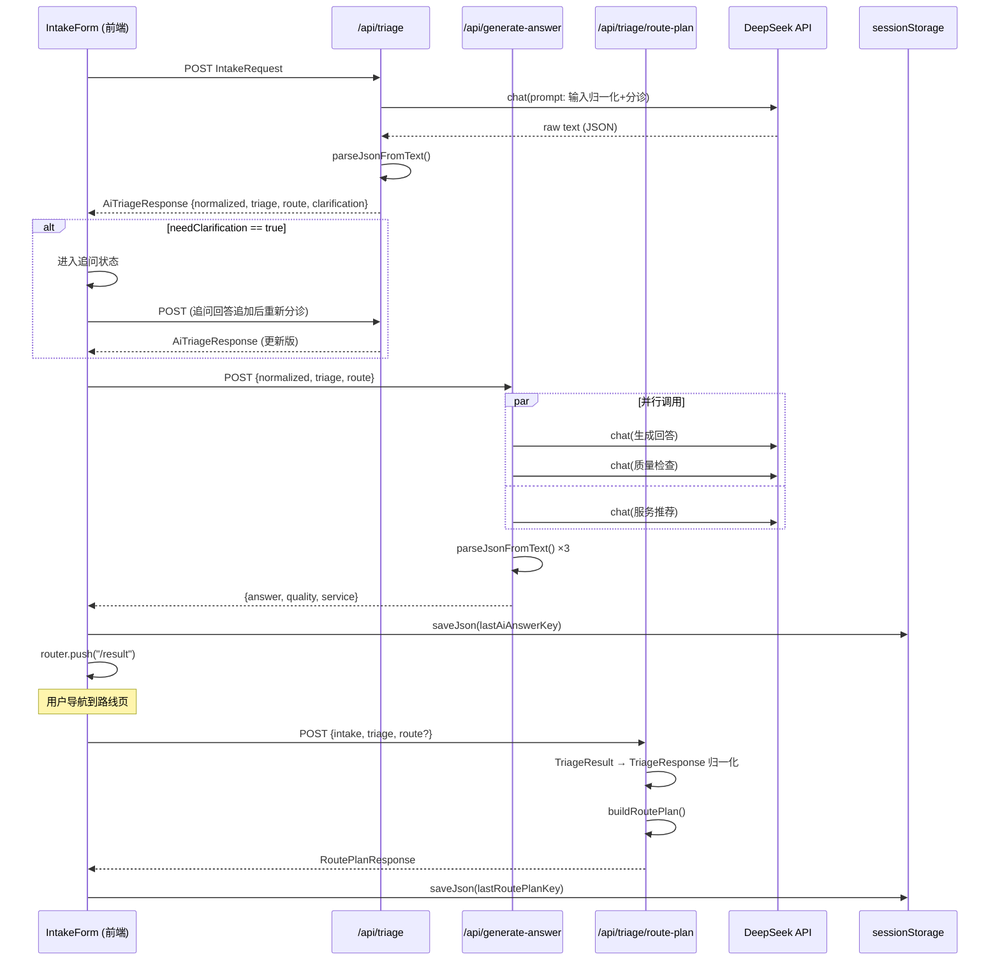
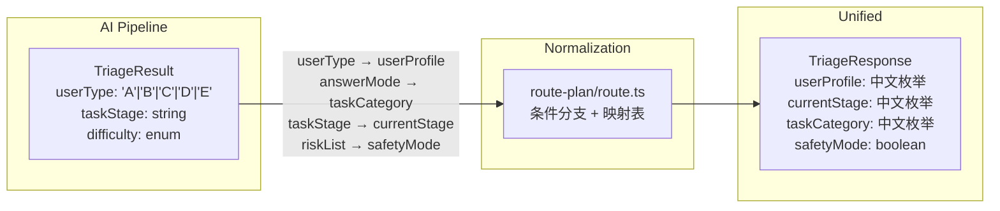

本文档深入剖析 **Chat Pipeline** 的核心数据加工链路——从 DeepSeek API 返回的原始文本如何被解析为结构化 JSON，经过 Plan 归一化后最终生成用户可见的产物（分诊结果、个性化回答、完整路线计划）。这条管线是连接 AI 推理层与前端展示层的唯一桥梁，理解它的设计哲学与防御性编码策略，是二次开发或排查管线异常的前提。

Sources: [ai-triage.ts](src/lib/ai-triage.ts#L1-L151), [route-plan.ts](src/lib/route-plan.ts#L1-L19), [route-plan/route.ts](src/app/api/triage/route-plan/route.ts#L1-L52)

## 管线全景：三阶段异步数据流

整条 Chat Pipeline 由三个顺序执行的阶段组成，每个阶段对应一个独立的 API 端点和一组类型契约。前端 `IntakeForm` 组件作为管线调度者，按用户交互状态依次触发这些阶段。



**阶段一（`/api/triage`）** 完成输入归一化与分诊判定，返回 `AiTriageResponse`。**阶段二（`/api/generate-answer`）** 接收阶段一的产物，并行发起三路 AI 调用（回答生成 + 质量检查 + 服务推荐），返回 `GenerateAnswerResponse`。**阶段三（`/api/triage/route-plan`）** 纯本地计算，不调用 AI，通过归一化后的分诊数据构建完整的阶段路线图。

Sources: [intake-form.tsx](src/components/intake-form.tsx#L73-L204), [route.ts (triage)](src/app/api/triage/route.ts#L1-L40), [route.ts (generate-answer)](src/app/api/generate-answer/route.ts#L26-L43)

## JSON 解析引擎：三层防御性提取

AI 模型输出不保证返回纯 JSON。实际场景中可能包含 markdown 代码围栏、前导解释文字、或尾随注释。`parseJsonFromText` 函数采用**三层递进策略**处理这些变体，确保管线在最大范围内兼容非标准输出。

| 层级 | 策略 | 匹配目标 | 典型场景 |
|------|------|---------|---------|
| 第一层 | 直接 `JSON.parse(text)` | 纯 JSON 文本 | 理想情况，模型精确遵循指令 |
| 第二层 | 正则提取 ` ```json ... ``` ` 围栏 | Markdown 代码块包裹的 JSON | 模型"解释完再输出"的常见行为 |
| 第三层 | `indexOf("{")` 到 `lastIndexOf("}")` 切片 | JSON 被前后文字夹裹 | 模型在 JSON 前后添加说明文字 |

三层策略的执行顺序是**性能优先的短路设计**：第一层 `JSON.parse` 的时间复杂度为 O(n)，远低于正则匹配。只有当直接解析失败时才逐层升级。每层失败都被 `try-catch` 静默吞没，最终在三层全部失败时抛出包含原始文本前 500 字的诊断性错误，供开发者在日志中定位问题。

Sources: [ai-triage.ts](src/lib/ai-triage.ts#L21-L42)

### raw text 日志与诊断信息

函数入口处有一条 `console.log("[ai-triage] raw (first 200):", text.slice(0, 200))` 日志，设计意图是让开发者在管线异常时能快速确认 AI 的原始输出是否包含有效 JSON 片段。在最终抛出的错误信息中，`text.slice(0, 500)` 提供了更充足的上下文，避免只看到截断后的无意义片段。

Sources: [ai-triage.ts](src/lib/ai-triage.ts#L22), [ai-triage.ts](src/lib/ai-triage.ts#L39-L41)

## 输入归一化：从表单枚举到 AI 语义结构

阶段一的 Prompt 要求 AI 将 `IntakeRequest` 的六个枚举字段 + 自由文本课题描述，转化为一组**语义化的结构化字段**。这个转化不是简单的字段重映射，而是 AI 对用户真实情境的深层理解。

| IntakeRequest 原始字段 | NormalizedInput 归一化字段 | 变化说明 |
|------------------------|---------------------------|---------|
| `topicText` (自由文本) | `topic` (一句话描述) | AI 提炼核心课题 |
| `taskType` (8 种枚举) | `taskType` (自由字符串) | 保留但允许 AI 补充修饰 |
| `deadline` (4 档枚举) | `deadline` (自由字符串) | 允许更精确的时间描述 |
| `backgroundLevel` (5 档枚举) | `userBackground` (自由字符串) | AI 综合判断后的画像 |
| `currentBlocker` (8 种枚举) | `painPoint` (自由字符串) | 从"选哪个卡点"到"痛点描述" |
| `goalType` (5 种枚举) | `targetOutput` (自由字符串) | 从抽象目标到具体期望 |
| — | `missingFields` (字符串数组) | **新增字段**：标识信息缺口 |

`missingFields` 是归一化阶段的关键产物。当用户输入信息严重不足时，AI 会填充此字段，驱动前端的 `clarification` 分支——`IntakeForm` 检测到 `needClarification === true` 后切换到追问状态，收集补充回答后**重新调用 `/api/triage`** 端点，将追问结果追加到 `topicText` 末尾再次走完整管线。

Sources: [ai-triage.ts](src/lib/ai-triage.ts#L50-L101), [triage-types.ts](src/lib/triage-types.ts#L137-L145), [intake-form.tsx](src/components/intake-form.tsx#L110-L168)

## 分诊判定：A-E 用户类型与路由模式

归一化完成后，同一个 AI 调用同时产出了分诊判定（`triage`）和回答路由（`route`），二者构成了后续所有管线分支的决策基础。

### 用户类型编码体系

AI 管线使用 A-E 字母编码标识用户类型，与规则管线的中文枚举（`UserProfile`）通过 `userTypeMap` 双向映射：

| AI 编码 | 中文标签 | 典型特征 |
|---------|---------|---------|
| A | 完全小白型 | 无任何基础，课题需要"翻译成人话" |
| B | 基础薄弱型 | 有一定基础但缺少顺序和抓手 |
| C | 普通项目型 | 以可交付成果为核心，优先做 MVP |
| D | 科研能力型 | 具备推进能力，重点压缩风险 |
| E | 焦虑决策型 | 需要兜底方案，先最低可行版本 |

`TriageResult` 中还包含 `secondaryType`（次级类型）和 `confidence`（置信度 0.0-1.0），为未来的精细化路由预留了决策空间。当前管线仅消费 `userType` 主类型，但类型契约已经为多标签分类做好了准备。

Sources: [triage-types.ts](src/lib/triage-types.ts#L148-L174), [ai-triage.ts](src/lib/ai-triage.ts#L85-L91)

### 回答路由模式

`route.answerMode` 决定了阶段二生成回答的策略基调，共有五种模式：

| 模式 | 适用类型 | 输出特征 |
|------|---------|---------|
| `plain_explain` | A (小白) | 弱术语、强解释 |
| `execution_focused` | B (基础薄弱) | 可执行步骤序列 |
| `mvp_planning` | C (普通项目) | MVP 交付物导向 |
| `research_review` | D (科研能力) | 方法论审查与边界确认 |
| `anxiety_reduction` | E (焦虑决策) | 兜底优先、逐步扩展 |

每种模式都携带 `mustInclude`（必须包含的要点）和 `mustAvoid`（禁止项）两个约束数组，这些约束在阶段二的 Prompt 中被直接注入，形成对 AI 输出的**硬性约束层**。

Sources: [triage-types.ts](src/lib/triage-types.ts#L182-L191), [ai-triage.ts](src/lib/ai-triage.ts#L89)

## Plan 归一化：AI 管线与规则管线的类型桥接

这是管线中最关键的架构适配点。阶段三 `/api/triage/route-plan` 端点需要同时支持两种输入格式：**AI 管线的 `TriageResult`** 和**规则管线的 `TriageResponse`**。这两个类型虽然语义高度重叠，但字段命名和结构存在系统性差异。



### 归一化的四个映射操作

端点通过 `"userType" in body.triage && !("userProfile" in body.triage)` 条件判断输入来源，进入 AI 管线的归一化分支后执行以下四个映射：

**1. userType → userProfile**：使用 `userTypeMap` 将字母编码转为中文标签。例如 `A → "完全小白型"`。

**2. answerMode → taskCategory**：`answerToCategory` 映射表将路由模式转为任务分类。注意这个映射并非一一对应：`research_review` 和 `execution_focused` 都映射到 `"技术路线"`，而 `plain_explain` 映射到 `"课题理解"`。

**3. taskStage → currentStage**：直接类型断言，因为 AI 输出的 `taskStage` 值（如 `"课题理解期"`）恰好匹配 `TriageResponse.currentStage` 的枚举值。

**4. riskList → safetyMode**：通过检查 `riskList` 中是否包含 `"学术诚信"`、`"代写"` 或 `"伪造"` 关键词来推导 `safetyMode` 布尔值。规则管线中 `safetyMode` 由独立的模式匹配函数 `detectSafetyMode` 计算，此处采用了一种简化但语义等价的近似实现。

归一化后还需要补充 `plainExplanation`、`minimumPath`、`recommendedService`、`serviceReason` 四个字段——这些在 AI 管线中被拆分到 `route` 和后续阶段，因此用空字符串和空数组占位，确保 `buildRoutePlan` 函数的类型签名匹配。

Sources: [route-plan/route.ts](src/app/api/triage/route-plan/route.ts#L7-L51), [triage-types.ts](src/lib/triage-types.ts#L97-L108), [triage-types.ts](src/lib/triage-types.ts#L150-L164)

## 产物生成：RoutePlan 的五模块构建

归一化完成后，`buildRoutePlan` 接收统一的 `IntakeRequest` + `TriageResponse` 输入，纯同步执行五个子构建函数，输出 `RoutePlanResponse`。整个过程不调用 AI，完全依赖预定义的业务逻辑映射表。

| 模块 | 构建函数 | 核心逻辑 | 返回类型 |
|------|---------|---------|---------|
| 总览 | `buildOverview` | 按 userProfile 选择开场语 + 任务类型 + 阶段 | `string` |
| 交付物 | `buildDeliverables` | 按 taskCategory 选择基础清单 + 条件追加 | `string[]` |
| 阶段步骤 | `buildRouteSteps` | deadline 紧/松 + safetyMode 三路分支 | `{phase, tasks}[]` |
| 兜底方案 | `buildFallbackPlan` | 按任务类型 + 用户类型 + 截止条件组合 | `string[]` |
| 老师话术 | `buildTeacherTalkingPoints` | 按 currentStage 选择沟通模板 | `string[]` |

### 阶段步骤的分支策略

`buildRouteSteps` 是最复杂的构建函数，拥有三条互斥分支：

**安全模式分支**（`safetyMode === true`）：只生成两阶段（"今天" + "接下来"），内容严格聚焦合规交付，不包含任何可能导致学术诚信风险的步骤。

**紧急截止分支**（`deadline === "3 天内" || "1 周内"`）：生成三阶段紧凑计划（"今天" → "明天" → "交付前"），每个阶段只有两个核心任务，且针对 `taskCategory` 做差异化处理（如 `项目Demo` 优先跑通主链路，其他类别优先补齐证据）。

**常规分支**：四阶段标准计划（"今天" → "3 天内" → "1 周内" → "交付前"），每个阶段的任务内容完全由 `taskCategory` 决定，通过 `getCategoryFirstDayTasks` / `getCategoryThreeDayTasks` / `getCategoryOneWeekTasks` 三个映射表精确匹配。

Sources: [route-plan.ts](src/lib/route-plan.ts#L9-L20), [route-plan.ts](src/lib/route-plan.ts#L93-L186)

### 交付物清单的条件追加机制

`buildDeliverables` 在基础清单之上通过两个条件追加规则实现上下文感知：

| 条件 | 追加项 | 触发场景 |
|------|--------|---------|
| `taskType === "毕设" \|\| "大创"` | "项目报告结构草稿" | 学术性项目需要报告产出 |
| `deadline === "3 天内" \|\| "1 周内"` | "紧急版本：只保留核心可展示部分" | 时间紧迫时强制聚焦 |

这种"基础模板 + 条件叠加"的设计模式确保了每个用户看到的交付物清单既包含通用必要项，又包含针对其具体情境的定制追加项，同时避免了复杂的分支组合爆炸。

Sources: [route-plan.ts](src/lib/route-plan.ts#L38-L91)

## 阶段二的并行调用与质量守卫

阶段二 `/api/generate-answer` 是管线中唯一使用 `Promise.all` 并行调度的环节。三个 AI 调用同时发起，互不依赖：

1. **回答生成**（`temperature: 0.5`）：较高的温度允许生成更具个性化的内容，受 `mustInclude` 和 `mustAvoid` 约束
2. **质量检查**（`temperature: 0.1`）：极低温度确保检查结果稳定可复现，返回 `QualityCheck` 结构
3. **服务推荐**（`temperature: 0.3`）：独立的推荐调用，根据用户类型和风险等级匹配服务包

`QualityCheck` 类型包含 8 个布尔维度和一个 `revisionInstruction` 字符串。当前管线将质量检查结果**透传给前端**但不做自动修订循环——这是一个有意为之的 MVP 决策。如果检查未通过（`pass === false`），前端可以展示 `revisionInstruction` 供用户参考，但不会自动触发重新生成。

Sources: [ai-triage.ts](src/lib/ai-triage.ts#L103-L133), [generate-answer/route.ts](src/app/api/generate-answer/route.ts#L34-L37), [triage-types.ts](src/lib/triage-types.ts#L201-L211)

## 容错与降级策略

### 端点级降级

`/api/triage` 端点在 AI 调用失败时会**回退到规则引擎** `triageIntake()`。这个降级路径在 `catch` 块中实现，确保即使 DeepSeek API 完全不可用，用户仍能获得基于纯规则的分诊结果。降级响应通过 `_fallback: true` 标记，前端据此可以提示用户"当前结果基于规则引擎"。

Sources: [route.ts (triage)](src/app/api/triage/route.ts#L25-L38)

### 前端双管线渲染

`ResultView` 组件通过 `hasAi` 标志决定渲染 AI 管线结果还是规则管线结果。当 `aiTriage` 和 `aiAnswer` 都存在时渲染 AI 视图（包含个性化回答、风险补充、兜底方案、沟通话术、服务推荐等卡片），否则渲染规则引擎视图（包含课题人话解释、最低可行路径等）。两种视图共享同一套 `sessionStorage` 持久化键空间，通过 `loadJson` 按 key 读取各自的数据。

Sources: [result-view.tsx](src/components/result-view.tsx#L55-L88), [storage.ts](src/lib/storage.ts#L1-L7)

### Zod Schema 入口校验

`/api/triage` 和 `/api/generate-answer` 端点都使用 Zod Schema 对请求体做 `safeParse`，校验失败时返回 400 状态码和具体字段错误信息。这不仅防止了无效数据进入 AI 调用链，还在前端 `IntakeForm` 的表单校验逻辑中复用了同一套 `intakeSchema`，实现了前后端**契约一致性**。

Sources: [route.ts (triage)](src/app/api/triage/route.ts#L12-L20), [generate-answer/route.ts](src/app/api/generate-answer/route.ts#L7-L24)

## 管线类型契约速查

以下是管线中流转的核心类型及其归属阶段：

| 类型 | 产出阶段 | 核心字段 | 消费者 |
|------|---------|---------|--------|
| `NormalizedInput` | 阶段一 | topic, painPoint, missingFields | 阶段二、服务推荐 |
| `TriageResult` | 阶段一 | userType(A-E), confidence, riskList | 阶段二、阶段三 |
| `ClarificationDecision` | 阶段一 | needClarification, questions | IntakeForm (追问状态) |
| `AnswerRoute` | 阶段一 | answerMode, mustInclude, mustAvoid | 阶段二 (Prompt 约束) |
| `GeneratedAnswer` | 阶段二 | answerText, nextSteps, downgradePlan, teacherScript | ResultView |
| `QualityCheck` | 阶段二 | pass, tooComplex, revisionInstruction | 前端 (可选修订提示) |
| `ServiceRecommendation` | 阶段二 | recommendedService, reason, cta | ResultView |
| `RoutePlanResponse` | 阶段三 | overview, deliverables, routeSteps, fallbackPlan | RoutePlanView |

Sources: [triage-types.ts](src/lib/triage-types.ts#L134-L233)

## 延伸阅读

- 管线的阶段 Prompt 设计细节见 [阶段 Prompt 工程与 chat-prompts 阶段指令设计](13-jie-duan-prompt-gong-cheng-yu-chat-prompts-jie-duan-zhi-ling-she-ji)
- AI Provider 底层的裸 fetch 实现与模型选择见 [AI Provider 适配层：裸 fetch 调用 DeepSeek API 的设计考量](10-ai-provider-gua-pei-ceng-luo-fetch-diao-yong-deepseek-api-de-she-ji-kao-liang)
- 规则引擎的分类逻辑与 AI 管线的对比见 [规则分诊引擎 triage.ts：用户分类、任务分类与风险评估](15-gui-ze-fen-zhen-yin-qing-triage-ts-yong-hu-fen-lei-ren-wu-fen-lei-yu-feng-xian-ping-gu)
- 前端如何消费管线产物见 [SidePanel：画像展示、Plan 面板与文件预览的右侧工作区](19-sidepanel-hua-xiang-zhan-shi-plan-mian-ban-yu-wen-jian-yu-lan-de-you-ce-gong-zuo-qu)
- 会话数据的持久化策略见 [前端会话持久化：sessionStorage 状态恢复与快照机制](21-qian-duan-hui-hua-chi-jiu-hua-sessionstorage-zhuang-tai-hui-fu-yu-kuai-zhao-ji-zhi)