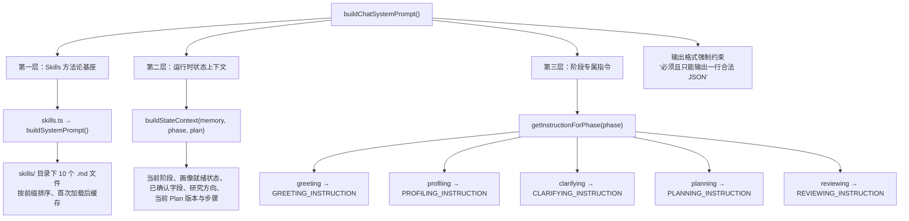
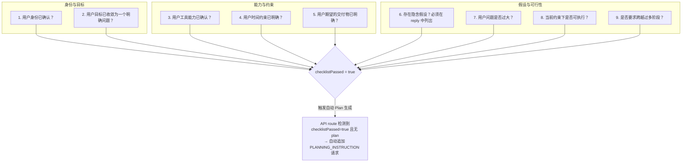
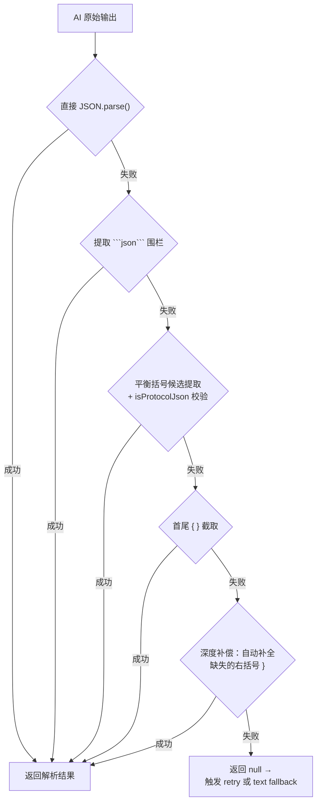

本文档深入解析 `Research-Triage/src/lib/chat-prompts.ts` 中的**阶段指令系统**——它是整个对话状态机与 AI 模型之间的契约层。每一轮对话中，系统根据当前阶段动态组装 System Prompt，由 Skills 方法论基座、运行时状态上下文和阶段专属指令三段拼装而成。理解这套 Prompt 工程设计，是掌握系统"如何让 AI 在正确时机做正确事"的关键入口。

Sources: [chat-prompts.ts](Research-Triage/src/lib/chat-prompts.ts#L1-L41)

## 整体架构：三层拼装的 System Prompt

`buildChatSystemPrompt()` 是整个 Prompt 工程的核心入口，它将三个独立层次拼接为一条完整的 System Prompt：



**第一层**由 `skills.ts` 的 `buildSystemPrompt()` 加载 `skills/` 目录下所有 `.md` 文件，为每个阶段注入科学方法论五步强制约束、问题拆解框架、假设验证规则和安全边界。这一层对所有阶段恒定不变，是 AI 行为的"宪法"。

Sources: [skills.ts](Research-Triage/src/lib/skills.ts#L40-L44)

**第二层**由 `buildStateContext()` 函数动态生成，它读取当前用户画像的可靠字段数、研究方向、当前卡点，以及 Plan 的版本号和步骤列表，将这些运行时数据以结构化文本注入 Prompt。这使得 AI 在每一轮对话中都能"看到"系统对用户的当前理解程度——例如 `画像就绪：否（可靠字段：3个，需>=6）` 这一信息直接约束了 AI 不应在画像未就绪时生成 Plan。

Sources: [chat-prompts.ts](Research-Triage/src/lib/chat-prompts.ts#L5-L21)

**第三层**是阶段专属指令，通过 `getInstructionForPhase()` 调度，五个阶段各有独立的 JSON Schema 定义、字段约束和输出规则。下面逐阶段详述。

Sources: [chat-prompts.ts](Research-Triage/src/lib/chat-prompts.ts#L195-L201)

## 状态上下文注入：buildStateContext() 的信息密度

`buildStateContext()` 在每轮 Prompt 中注入以下关键信息，让 AI 始终感知"此刻系统掌握了多少用户数据"：

| 注入字段 | 数据来源 | 控制作用 |
|---------|---------|---------|
| `对话阶段` | 当前 `Phase` 枚举值 | 确认 AI 当前应扮演的角色定位 |
| `画像就绪` | `isProfileReady(memory)` — 需 ≥6 个 `confidence ≥ 0.7` 的字段 | 防止 AI 在画像不足时跳到 Plan 生成 |
| `已确认画像` | `getReliableFields(memory)` 遍历所有字段 | 让 AI 知道哪些信息已确认、避免重复追问 |
| `研究方向` | `memory.interestArea.value` | 话题引导的锚点 |
| `当前卡点` | `memory.currentBlocker.value` | Plan 生成时的问题聚焦依据 |
| `当前 Plan 版本/步骤/风险` | `PlanState` 对象（仅 planning/reviewing 阶段） | Reviewing 阶段据此判断修改范围 |

这种设计的核心理念是**让 Prompt 成为状态的镜像**——AI 不需要从对话历史中推断系统状态，因为系统已经在每轮 Prompt 中显式声明了自身的认知边界。

Sources: [chat-prompts.ts](Research-Triage/src/lib/chat-prompts.ts#L5-L21) · [memory.ts](Research-Triage/src/lib/memory.ts#L50-L63)

## 五阶段指令详解

### Greeting 阶段：开场引导与兴趣试探

`GREETING_INSTRUCTION` 是用户进入系统后的第一条 Prompt 指令。它的设计有两个核心目标：**第一印象建立**和**最小化用户认知负担**。

**JSON Schema 约束**：
```json
{
  "reply": "你的开场白（1-2句，不许包含问号或疑问句）",
  "questions": ["完整选项文本A", "完整选项文本B", "完整选项文本C", "我不太理解这些，帮我找方向"]
}
```

**关键设计决策**：

| 约束项 | 设计意图 | 反模式示例（被 Prompt 禁止） |
|-------|---------|--------------------------|
| `reply` 禁止问号 | 开场阶段应给出确定性引导，而非向用户发问 | `"你好！你之前学过数字电路吗？"` |
| `questions` 必须是完整句子 | 前端 ChoiceButtons 直接渲染为可点击选项，占位符文本会破坏用户体验 | `["选项A", "选项B", "其他"]` |
| 必须包含"逃生通道"选项 | `"我不太理解这些，帮我找方向"` 作为最后一项，确保任何用户都不会卡住 | 仅提供专业领域选项 |
| `questions` 固定 4 项 | 控制前端渲染密度，避免过多选项造成决策瘫痪 | 提供 7-8 个选项 |

Sources: [chat-prompts.ts](Research-Triage/src/lib/chat-prompts.ts#L42-L64)

### Profiling 阶段：画像提取与对话引导并行

`PROFILING_INSTRUCTION` 是最复杂的阶段指令，它要求 AI 在单次输出中同时完成**两件不同性质的任务**：从用户话语中提取结构化画像字段（数据分析任务），以及继续引导用户补齐缺失信息（对话设计任务）。

**JSON Schema 约束**：
```json
{
  "reply": "你的回复文本",
  "questions": ["完整选项A", "完整选项B", "完整选项C", "我不太理解这些，帮我找方向"],
  "profileUpdates": [
    {"field": "字段名", "value": "值", "confidence": 0.3-1.0}
  ]
}
```

**可提取字段清单**（10 个字段对应 `UserProfileState` 类型定义）：

| 字段名 | 语义 | 典型提取场景 |
|-------|------|------------|
| `ageOrGeneration` | 年龄段/时代背景 | 用户提及"大三""工作三年了" |
| `educationLevel` | 教育水平 | 用户提及"本科""研究生" |
| `toolAbility` | 工具使用能力 | 用户提及"会用 Python""没写过代码" |
| `aiFamiliarity` | AI 熟悉程度 | 用户提及"用过 ChatGPT""不太了解 AI" |
| `researchFamiliarity` | 科研理解程度 | 用户提及"没做过科研""看过几篇论文" |
| `interestArea` | 兴趣方向 | 用户选择或描述具体方向 |
| `currentBlocker` | 当前卡点 | 用户表达当前困惑或瓶颈 |
| `deviceAvailable` | 可用设备 | 用户提及"只有笔记本""有实验室服务器" |
| `timeAvailable` | 可用时间 | 用户提及"一周内要交""时间充裕" |
| `explanationPreference` | 偏好解释风格 | 用户表达想要"通俗易懂"或"直接给步骤" |

**Confidence 语义量表**：Prompt 中明确定义了四级置信度语义——`0.3=猜测`、`0.5=AI推断`、`0.7=用户暗示`、`1.0=用户明确说了`。这一量表与 `memory.ts` 中的 `ProfileField` 结构直接对应，形成从 Prompt 输出到系统存储的闭环。关键约束是"不确定的字段不要填，留到下一轮通过 questions 追问"——这防止了 AI 过早填充低置信度数据污染画像。

Sources: [chat-prompts.ts](Research-Triage/src/lib/chat-prompts.ts#L66-L112) · [triage-types.ts](Research-Triage/src/lib/triage-types.ts#L122-L133)

### Clarifying 阶段：9 项前置检查清单门控

`CLARIFYING_INSTRUCTION` 引入了一个独特的**门控机制**——9 项前置检查清单。AI 在生成 Plan 之前必须逐项检查，任一项未通过都不得生成 Plan。这是一个"AI 自审"设计：通过 Prompt 层面的强制约束，让模型在输出前先完成一次完整性自检。

**JSON Schema 约束**：
```json
{
  "reply": "列出待确认的假设，或说明所有项已通过",
  "questions": ["追问选项A", "追问选项B", "我不太理解这些，帮我找方向"],
  "checklistPassed": false
}
```

**9 项前置检查清单**：



值得特别注意的是，`checklistPassed=true` 时的处理逻辑不在 `chat-prompts.ts` 中，而是在 [API Route](Research-Triage/src/app/api/chat/route.ts#L334-L378) 中：当系统检测到 clarifying 阶段返回了 `checklistPassed=true` 但没有附带 plan 数据时，会自动追加一次以 `PLANNING_INSTRUCTION` 为指令的 AI 请求。这意味着 clarifying → planning 的过渡可能在一轮 HTTP 请求中完成两次 AI 调用。

Sources: [chat-prompts.ts](Research-Triage/src/lib/chat-prompts.ts#L114-L143) · [chat route.ts](Research-Triage/src/app/api/chat/route.ts#L334-L378)

### Planning 阶段：Plan 产物与代码文件的 JSON Schema

`PLANNING_INSTRUCTION` 定义了科研探索计划的核心输出结构。这个指令被导出为 `export const`，因为 clarifying → planning 的自动过渡逻辑需要在外部引用它。

**Plan JSON Schema**（`PLAN_JSON_SCHEMA`）：

```json
{
  "reply": "一句简短回复",
  "plan": {
    "userProfile": "用户画像摘要",
    "problemJudgment": "当前问题判断",
    "systemLogic": "系统判断逻辑（关键假设和证据边界）",
    "recommendedPath": "推荐路径",
    "actionSteps": ["步骤1：具体动作、时限、验证方式"],
    "riskWarnings": ["风险1", "风险2"],
    "nextOptions": ["更简单", "更专业", "拆开讲", "换方向"]
  },
  "codeFiles": [{ "filename": "...", "title": "...", "language": "...", "content": "..." }]
}
```

**`codeFiles` 的条件生成策略**：Prompt 明确规定"当任务明确需要代码、脚本、配置文件、Demo 骨架时，必须输出 `codeFiles`"，"如果当前任务不需要代码，返回 `{"codeFiles": []}`"。每个代码文件必须是"最小可运行或最小可验证版本"。这一约束确保 AI 不会输出半成品代码或纯伪代码。

**`nextOptions` 的固定语义**：`["更简单", "更专业", "拆开讲", "换方向"]` 这四个选项在 Prompt 中硬编码，对应 reviewing 阶段 Plan 调整的四种策略方向。前端将它们渲染为 Plan 面板下方的快捷操作按钮。

Sources: [chat-prompts.ts](Research-Triage/src/lib/chat-prompts.ts#L145-L180)

### Reviewing 阶段：增量修改与版本追踪

`REVIEWING_INSTRUCTION` 复用了 `PLAN_JSON_SCHEMA` 相同的输出结构，但增加了三个关键行为差异：

| 差异点 | Planning 阶段 | Reviewing 阶段 |
|-------|-------------|---------------|
| 判断意图 | N/A | 先判断用户是要"更简单""更专业""拆开讲"还是"换方向" |
| 修改范围 | 全量生成 | 只根据反馈调整必要部分，但返回完整 Plan |
| 系统逻辑说明 | 描述判断依据 | **必须说明本次修改相对上一版改变了什么** |

`systemLogic` 字段在 reviewing 阶段被赋予了版本 diff 的语义——它必须解释"为什么改了"而不仅是"怎么判断的"。这一设计使得 Plan 的每次迭代都有可追溯的变更日志。

Sources: [chat-prompts.ts](Research-Triage/src/lib/chat-prompts.ts#L182-L193)

## 输出格式强制约束：JSON Schema 的防御性设计

每个阶段指令的末尾都附带了相同的输出格式约束：**"你必须且只能输出一行合法JSON。不是markdown、不是表格、不是文字说明。回复的第一个字符必须是{最后一个字符必须是}。"**

这种重复并非冗余——它是应对 LLM 输出不稳定性的防御策略。实际运行中，`chat-pipeline.ts` 的 `parseJsonFromText()` 实现了五层递降的 JSON 解析容错：



`isProtocolJson()` 校验函数确保解析结果包含协议约定的关键字段（`reply`、`questions`、`profileUpdates`、`checklistPassed`、`plan`、`codeFiles` 中的至少一个），防止误将非协议 JSON 当作有效响应。当五层解析全部失败时，API Route 会追加一条重试消息 `"上一轮回复不是JSON。请严格按照JSON格式重新输出"`，降低 temperature 到 0.3 再次调用 AI。

Sources: [chat-prompts.ts](Research-Triage/src/lib/chat-prompts.ts#L38-L40) · [chat-pipeline.ts](Research-Triage/src/lib/chat-pipeline.ts#L6-L48) · [chat route.ts](Research-Triage/src/app/api/chat/route.ts#L242-L260)

## 阶段指令调度与状态机联动

`getInstructionForPhase()` 是阶段指令的调度入口，其逻辑简洁到只有 5 行条件判断：

```typescript
export function getInstructionForPhase(phase: Phase): string {
  if (phase === "greeting") return GREETING_INSTRUCTION;
  if (phase === "planning") return PLANNING_INSTRUCTION;
  if (phase === "reviewing") return REVIEWING_INSTRUCTION;
  if (phase === "clarifying") return CLARIFYING_INSTRUCTION;
  return PROFILING_INSTRUCTION; // default fallback
}
```

**默认回退设计**：`PROFILING_INSTRUCTION` 作为 `return` 的兜底项，意味着任何未匹配的 Phase 值都会走画像收集流程。这是一种安全降级——即使状态机出现异常阶段的值，系统也会以"继续收集画像"的方式运行，而非崩溃或输出无意义内容。

**调度时机**：在 [API Route](Research-Triage/src/app/api/chat/route.ts#L172-L173) 中，每轮对话的处理流程是：① 获取/恢复会话 → ② 追加用户消息 → ③ 调用 `getInstructionForPhase(session.phase)` 获取当前阶段指令 → ④ 调用 `buildChatSystemPrompt()` 拼装完整 System Prompt → ⑤ 构建 AI 请求消息列表 → ⑥ 调用 AI。阶段转换发生在 AI 返回结果之后，由 `getNextPhase()` 计算新阶段。

Sources: [chat-prompts.ts](Research-Triage/src/lib/chat-prompts.ts#L195-L201) · [chat route.ts](Research-Triage/src/app/api/chat/route.ts#L172-L176) · [chat-pipeline.ts](Research-Triage/src/lib/chat-pipeline.ts#L629-L647)

## 逃生通道："我不太理解这些"的全局兜底

贯穿五个阶段指令的一个统一设计模式是**逃生通道选项**——每个阶段的 `questions` 数组最后一项都必须是 `"我不太理解这些，帮我找方向"`。这个设计解决了一个关键的 UX 问题：当用户对当前阶段的选项无法理解或无法选择时，系统必须提供一条安全的后退路径，而非让用户卡在原地。

在 `buildFallbackTurn()` 中——AI 调用失败时的规则兜底函数——同样遵循了这个模式，每个 fallback 响应都包含"我不太理解这些，帮我找方向"作为最后一个选项。这确保即使在降级模式下，用户也不会失去导航能力。

Sources: [chat-prompts.ts](Research-Triage/src/lib/chat-prompts.ts#L59-L60) · [chat-pipeline.ts](Research-Triage/src/lib/chat-pipeline.ts#L518-L568)

## 延伸阅读

- **Skills 方法论的加载与注入机制**：[Skills 方法论注入机制：科学方法论五步强制约束与加载策略](25-skills-fang-fa-lun-zhu-ru-ji-zhi-ke-xue-fang-fa-lun-wu-bu-qiang-zhi-yue-shu-yu-jia-zai-ce-lue) — Skills 基座层如何被拼入 System Prompt
- **对话阶段状态机的完整流转**：[对话阶段状态机：greeting → profiling → clarifying → planning → reviewing](7-dui-hua-jie-duan-zhuang-tai-ji-greeting-profiling-clarifying-planning-reviewing) — Phase 转换触发条件与getNextPhase() 逻辑
- **AI 输出的解析容错机制**：[Chat Pipeline：AI JSON 输出解析、Plan 归一化与产物生成](12-chat-pipeline-ai-json-shu-chu-jie-xi-plan-gui-yua-yu-chan-wu-sheng-cheng) — parseJsonFromText() 的五层容错策略
- **画像字段与置信度模型**：[用户画像记忆系统：置信度驱动的博弈式画像确立机制](11-yong-hu-hua-xiang-ji-yi-xi-tong-zhi-xin-du-qu-dong-de-bo-yi-shi-hua-xiang-que-li-ji-zhi) — ProfileField 结构与 confidence 量表