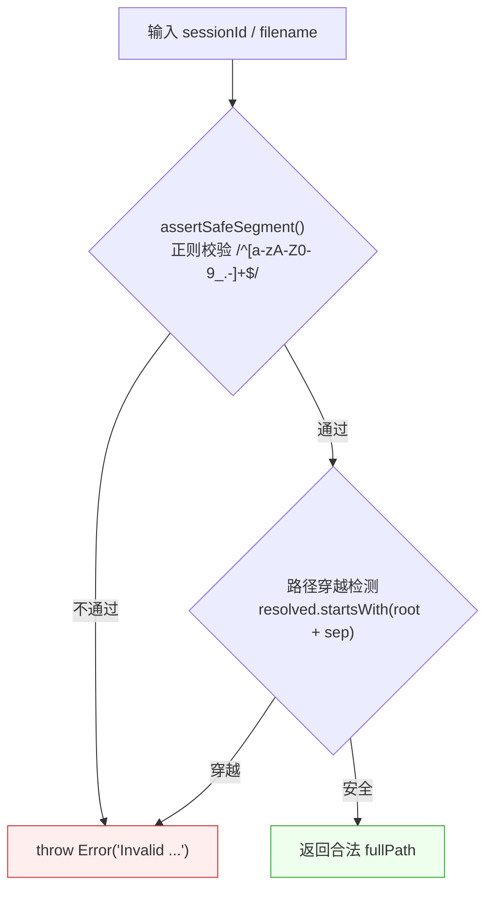
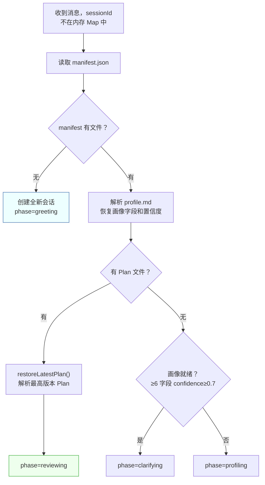
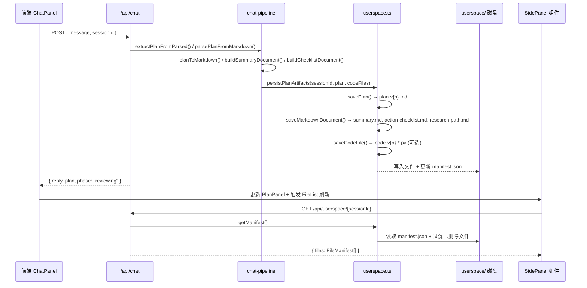

Userspace 是科研课题分诊台的**磁盘级产物持久化层**——以 `userspace/{sessionId}/` 目录为容器，将对话过程中产生的用户画像、科研计划、配套文档和代码产物以 Markdown 文件的形式落盘存储。它承担三个核心职责：**路径安全隔离**（防止目录穿越攻击）、**Manifest 索引管理**（文件元数据注册与去脏）、**会话恢复**（服务重启后从磁盘重建内存状态）。本文将深入解析其存储架构、安全模型、版本策略以及与前后端的集成方式。

Sources: [ARCHITECTURE.md](Research-Triage/ARCHITECTURE.md#L171-L192)

## 存储架构：文件系统即数据库

Userspace 采用"文件系统 + JSON 索引"的极简存储方案。每个会话在 `userspace/` 目录下拥有独立子目录，通过 `sessionId` 隔离。目录内文件布局如下：

```text
userspace/{sessionId}/
  manifest.json            ← 文件索引清单
  profile.md               ← 用户画像（实时覆盖）
  plan-v1.md               ← Plan 第一版（持久保留）
  plan-v2.md               ← Plan 第二版（持久保留）
  summary.md               ← 科研探索摘要（随 Plan 刷新）
  action-checklist.md      ← 行动检查清单（随 Plan 刷新）
  research-path.md         ← 科研路径说明（随 Plan 刷新）
  code-v2-demo.py          ← 代码产物（可选，按版本递增）
```

这种设计的关键决策在于：**Plan 版本文件永不删除**，而 `summary.md`、`action-checklist.md`、`research-path.md` 这三类配套文档始终随最新 Plan 覆盖刷新。这保证了用户可以在 [Plan 历史对比与版本切换面板](20-plan-li-shi-dui-bi-yu-ban-ben-qie-huan-mian-ban) 中回溯任意版本的 Plan 全文。

Sources: [ARCHITECTURE.md](Research-Triage/ARCHITECTURE.md#L171-L192), [userspace.ts](Research-Triage/src/lib/userspace.ts#L1-L7)

### Manifest 索引机制

`manifest.json` 是 Userspace 的"数据库索引"，记录了目录中每个产物的结构化元数据。其类型定义为 `FileManifest[]`，每条记录包含以下字段：

| 字段 | 类型 | 说明 |
|------|------|------|
| `filename` | `string` | 文件名（含扩展名） |
| `title` | `string` | 展示用标题（如"科研探索计划 v1"） |
| `type` | `"profile" \| "plan" \| "checklist" \| "path" \| "summary" \| "image" \| "code"` | 产物类型枚举 |
| `version` | `number` | 版本号（Plan 递增，其他随 Plan） |
| `createdAt` | `string` | ISO 时间戳 |
| `language` | `string?` | 仅 `code` 类型时出现，编程语言标识 |

Sources: [triage-types.ts](Research-Triage/src/lib/triage-types.ts#L158-L166)

Manifest 的读写遵循 **upsert 语义**：`upsertManifest()` 函数查找 `filename` 匹配的现有条目，若存在则原地替换，不存在则追加。这意味着 `summary.md` 等覆盖式文档的元数据会随着每次 Plan 生成而更新其 `version` 和 `createdAt`，但不会产生重复条目。

Sources: [userspace.ts](Research-Triage/src/lib/userspace.ts#L131-L145)

**去脏策略**是 Manifest 的一个关键防御机制。`getManifest()` 在读取时会对每条记录执行文件存在性校验——如果 `manifest.json` 中登记的文件在磁盘上已不存在（例如被外部手动删除），该条目会被自动过滤掉。这避免了前端 [FileList](Research-Triage/src/components/file-list.tsx) 组件展示"幽灵文件"。

Sources: [userspace.ts](Research-Triage/src/lib/userspace.ts#L113-L128)

## 安全模型：双层路径校验

Userspace 直接操作文件系统，因此路径安全是首要考量。安全校验分为两层：



**第一层：正则白名单**。`assertSafeSegment()` 要求 `sessionId` 和 `filename` 仅包含 `[a-zA-Z0-9_.-]` 字符，且显式排除 `..` 子串。这直接阻断了 `../escape`、`semi;colon.md`、`nested/escape.md` 等常见注入向量。

**第二层：路径解析校验**。即使通过了正则白名单，`filePath()` 还会将拼接后的路径 `path.resolve()` 后与目录根路径比对，确保解析后的绝对路径以 `{BASE}/{sessionId}/` 为前缀。这是防范符号链接攻击和边界情况的最后防线。

Sources: [userspace.ts](Research-Triage/src/lib/userspace.ts#L8-L30), [userspace.test.ts](Research-Triage/src/lib/userspace.test.ts#L24-L29)

## 产物写入：四类高层写入函数

Userspace 暴露了四个面向业务的高层写入函数，封装了"写文件 + 更新 Manifest"的原子操作：

| 函数 | 写入文件 | Manifest type | 版本策略 |
|------|----------|---------------|----------|
| `saveProfile()` | `profile.md` | `"profile"` | 固定 version=1 |
| `savePlan()` | `plan-v{n}.md` | `"plan"` | version 参数递增 |
| `saveMarkdownDocument()` | 自定义 filename | `"checklist" \| "path" \| "summary"` | 随 Plan version |
| `saveCodeFile()` | 自定义 filename | `"code"` | 随 Plan version |

### 画像写入

`saveProfile()` 在每次画像字段有更新时被调用。它将 `UserProfileMemory` 转换为 Markdown 格式（包含置信度图标：✅/🔍/❓），写入 `profile.md` 并更新 Manifest。画像文件始终只有一份，采用覆盖策略。

Sources: [userspace.ts](Research-Triage/src/lib/userspace.ts#L156-L168), [memory.ts](Research-Triage/src/lib/memory.ts#L73-L93)

### Plan 与配套文档写入

`persistPlanArtifacts()` 是 Plan 产物写入的编排入口，每次 Plan 生成或调整时被 [Chat Pipeline](12-chat-pipeline-ai-json-shu-chu-jie-xi-plan-gui-hua-yu-chan-wu-sheng-cheng) 调用。它会一次性写入 **五个文件**：

1. **`plan-v{version}.md`**：完整的 Plan Markdown，包含用户画像、问题判断、系统逻辑、推荐路径、步骤、风险和下一步选项七个标准章节
2. **`summary.md`**：当前科研探索摘要，浓缩 Plan 的核心判断和路线
3. **`action-checklist.md`**：行动检查清单，将步骤和风险转换为 `- [ ]` 复选框格式
4. **`research-path.md`**：科研路径说明，以阶段化视角组织步骤
5. **`code-v{version}-{filename}`**（可选）：AI 生成的代码/Demo 文件，文件名经过清洗（空格转连字符、特殊字符过滤、扩展名补全）

Sources: [chat-pipeline.ts](Research-Triage/src/lib/chat-pipeline.ts#L472-L484), [chat-pipeline.ts](Research-Triage/src/lib/chat-pipeline.ts#L399-L470)

## 版本管理：追加式 Plan 历史

Plan 的版本管理采用**追加写入、永不删除**的策略。每次 `savePlan()` 调用时，`version` 参数由 Chat Pipeline 计算：`newVersion = (currentPlan?.version ?? 0) + 1`。这意味着磁盘上可能存在 `plan-v1.md`、`plan-v2.md`、`plan-v3.md` 等多个文件，所有版本的元数据都保留在 Manifest 中。

版本递增发生在两种场景：

| 场景 | 触发阶段 | `modifiedReason` |
|------|----------|------------------|
| 首次生成 Plan | `planning` 或 `clarifying→planning` 自动跳转 | 无 |
| 用户反馈调整 Plan | `reviewing` | 记录用户原始消息 |

在 `reviewing` 阶段，用户通过对话反馈（如"更简单"、"更专业"、"拆开讲"）触发 Plan 调整时，`persistPlanArtifacts()` 会将用户的原始消息写入 `plan.modifiedReason`，作为版本变更的审计记录。

Sources: [chat-pipeline.ts](Research-Triage/src/lib/chat-pipeline.ts#L472-L484), [route.ts](Research-Triage/src/app/api/chat/route.ts#L278-L294)

### Plan Markdown 格式规范

每个 Plan 版本文件遵循统一的结构化 Markdown 模板，确保 `parsePlanFromMarkdown()` 可以从磁盘文件中逆向解析出 `PlanState` 对象：

```markdown
# 科研探索计划 v{version}

## 用户画像
{userProfile}

## 问题判断
{problemJudgment}

## 系统逻辑
{systemLogic}

## 推荐路径
{recommendedPath}

## 步骤
1. {actionStep1}
2. {actionStep2}
...

## 风险
- {riskWarning1}
- {riskWarning2}
...

## 下一步选项
- {nextOption1}
- {nextOption2}
...
```

这种"写时结构化、读时正则解析"的双向约定，使得 Plan 数据在 `PlanState` 内存对象和 Markdown 文本之间可互逆转换。

Sources: [chat-pipeline.ts](Research-Triage/src/lib/chat-pipeline.ts#L179-L237), [chat-pipeline.ts](Research-Triage/src/lib/chat-pipeline.ts#L399-L423)

## 会话恢复：从磁盘重建内存状态

Userspace 最关键的价值在于**跨服务重启的会话恢复**。当 `/api/chat` 收到一个不在内存 Map 中的 `sessionId` 时，会尝试从磁盘恢复：



恢复逻辑的精妙之处在于**画像重建**：`profile.md` 的 Markdown 格式中嵌入了置信度图标（✅ 表示 confidence=1.0，🔍 表示 confidence=0.7），恢复代码通过正则匹配这些图标和字段值，将磁盘文本逆向还原为 `UserProfileMemory` 结构。这种"格式即协议"的设计避免了引入额外的序列化格式。

Sources: [route.ts](Research-Triage/src/app/api/chat/route.ts#L83-L155)

## API 层：RESTful 文件访问接口

Userspace 通过 Next.js Catch-All Route 暴露四个 API 端点，前端的 [FileList](Research-Triage/src/components/file-list.tsx)、[DocPanel](Research-Triage/src/components/doc-panel.tsx) 和 [PlanHistoryPanel](Research-Triage/src/components/plan-history-panel.tsx) 组件通过这些端点实现文件浏览和预览：

| 端点 | 方法 | 功能 | 响应格式 |
|------|------|------|----------|
| `/api/userspace/{sessionId}` | GET | 获取文件清单 | `{ files: FileManifest[] }` |
| `/api/userspace/{sessionId}/{filename}` | GET | 获取文件内容（JSON） | `{ filename, title, content, type, version, language?, createdAt }` |
| `/api/userspace/{sessionId}/{filename}?raw=1` | GET | 获取原始文本 | `text/markdown` 或 `text/plain` |
| `/api/userspace/{sessionId}/{filename}?action=open` | POST | 系统默认应用打开 | `{ ok: true, message }` |

**系统打开功能**是本地开发环境的便利特性。`openFileWithSystemDefault()` 根据操作系统平台（macOS 用 `open`、Windows 用 `cmd.exe /c start`、Linux 用 `xdg-open`、WSL 用 `wslpath` 转换后调用 Windows 命令）以 detached 子进程方式打开文件。该操作是 best-effort 的——失败时仅影响用户体验，不阻断主流程。

Sources: [route.ts](Research-Triage/src/app/api/userspace/[sessionId]/[[...filename]]/route.ts#L1-L85), [userspace.ts](Research-Triage/src/lib/userspace.ts#L61-L110)

### 文件名清洗与代码产物命名

AI 返回的代码文件名是不可信输入。`sanitizeCodeFilename()` 执行以下清洗：空格转连字符 → 非安全字符替换为连字符 → 连续连字符合并 → 去除前导点和连字符 → 补全扩展名 → 统一添加 `code-v{version}-` 前缀。这确保了文件名同时满足 Userspace 的路径安全约束和跨平台兼容性。

Sources: [chat-pipeline.ts](Research-Triage/src/lib/chat-pipeline.ts#L335-L348)

## 数据流全景：从对话到产物落盘

下面展示一次完整的 Plan 生成周期中，Userspace 各组件的协作关系：



Sources: [route.ts](Research-Triage/src/app/api/chat/route.ts#L270-L294), [chat-pipeline.ts](Research-Triage/src/lib/chat-pipeline.ts#L472-L506)

## 与根项目旧存储层的对比

根项目的 `src/lib/storage.ts` 是一个纯前端 `sessionStorage` 封装，仅支持 `saveJson()` / `loadJson()` 两个函数，标签页关闭即丢失。Research-Triage 的 Userspace 则是**服务端文件系统级持久化**，具备版本管理、会话恢复和 RESTful API 访问能力。两者定位完全不同：前者是旧管线表单式交互的临时缓存，后者是新版对话管线的核心产物持久化层。

Sources: [storage.ts](src/lib/storage.ts#L1-L31)

## 设计权衡与演进方向

当前 Userspace 选择了"文件系统 + 内存 Map"的极简方案，这在 MVP 阶段有明确优势：零外部依赖、调试直观（直接 `cat` 文件）、Git 友好。但也存在已知局限：

| 维度 | 当前状态 | 潜在演进 |
|------|----------|----------|
| 存储后端 | 本地文件系统 | SQLite / Object Storage |
| 会话状态 | 内存 Map + 磁盘恢复 | Redis / DB |
| 并发安全 | 单进程同步写入 | 文件锁或事务 |
| 清理策略 | 无（文件永久保留） | TTL 过期 + 容量上限 |
| 文件大小 | 无上限约束 | 写入前校验 |

Sources: [ARCHITECTURE.md](Research-Triage/ARCHITECTURE.md#L22-L29)

## 延伸阅读

- 了解 Userspace 的调用者——[Chat Pipeline：AI JSON 输出解析、Plan 归一化与产物生成](12-chat-pipeline-ai-json-shu-chu-jie-xi-plan-gui-yu-chan-wu-sheng-cheng)
- 了解前端如何消费 Userspace 产物——[SidePanel：画像展示、Plan 面板与文件预览的右侧工作区](19-sidepanel-hua-xiang-zhan-shi-plan-mian-ban-yu-wen-jian-yu-lan-de-you-ce-gong-zuo-qu) 和 [Plan 历史对比与版本切换面板](20-plan-li-shi-dui-bi-yu-ban-ben-qie-huan-mian-ban)
- 了解画像如何被持久化到 `profile.md`——[用户画像记忆系统：置信度驱动的博弈式画像确立机制](11-yong-hu-hua-xiang-ji-yi-xi-tong-zhi-xin-du-qu-dong-de-bo-yi-shi-hua-xiang-que-li-ji-zhi)
- 了解测试覆盖策略——[测试策略：Vitest 契约测试、Pipeline 解析测试与 Userspace 测试](26-ce-shi-ce-lue-vitest-qi-yue-ce-shi-pipeline-jie-xi-ce-shi-yu-userspace-ce-shi)