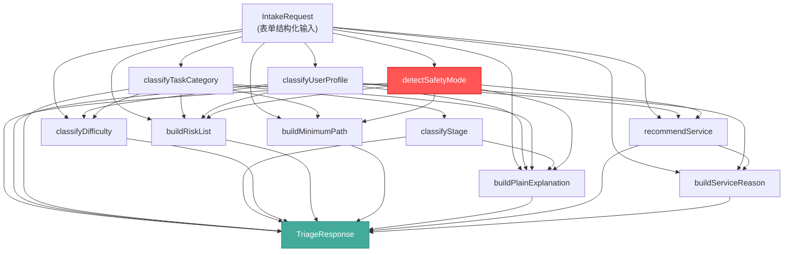
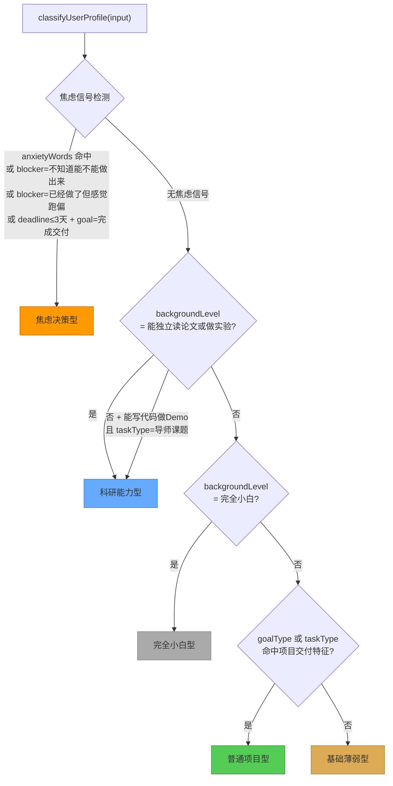
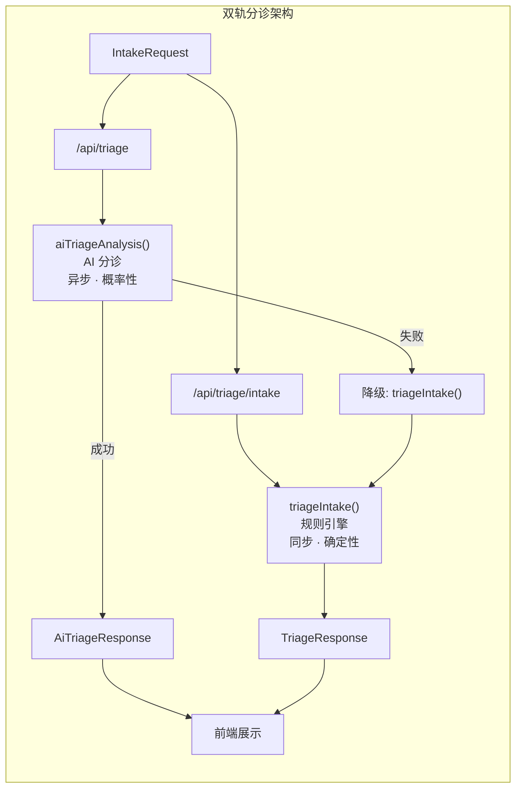

`triage.ts` 是科研课题分诊台中一个**纯规则驱动、零 AI 依赖**的分诊引擎。它接收前端表单提交的结构化 `IntakeRequest`，经过一条 9 步串行决策管线，产出包含用户画像、任务分类、难度评分、风险清单、最小可行路径和服务推荐的完整 `TriageResponse`。由于不调用任何外部大模型，它在 ~470 行代码内实现了确定性的分类逻辑，既作为 `/api/triage/intake` 的独立端点使用，也在 `/api/triage` 中充当 AI 分诊失败时的**同步降级兜底**。

Sources: [triage.ts](src/lib/triage.ts#L1-L65), [triage-types.ts](src/lib/triage-types.ts#L97-L108), [intake/route.ts](src/app/api/triage/intake/route.ts#L1-L30)

## 分诊管线的整体架构

引擎的核心入口 `triageIntake()` 是一个无副作用的纯函数：输入 `IntakeRequest` → 输出 `TriageResponse`。内部按顺序执行 9 个分类/构建步骤，每一步的输出都作为后续步骤的决策输入，形成一条**瀑布式依赖链**。

这张依赖图揭示了三个关键架构特征：**safetyMode 是最高优先级**——它独立于所有分类逻辑先行检测，一旦命中则直接覆盖 minimumPath、plainExplanation 和 recommendService 的输出；**userProfile 和 taskCategory 是双轴分类**——用户画像和任务分类并行推导但互不依赖，然后共同汇入难度评分和风险评估；**所有函数均为纯函数**——无状态、无 IO，可安全并发调用且天然可测试。

Sources: [triage.ts](src/lib/triage.ts#L30-L65)

## 安全模式检测：第一道防线

安全检测在管线中拥有最高优先级，在所有分类逻辑之前执行。`detectSafetyMode()` 对用户填写的 `topicText` 字段执行 12 个敏感关键词的**精确子串匹配**：

| 关键词类别 | 模式列表 | 触发后果 |
|-----------|---------|---------|
| 代写类 | `代写`、`替我写`、`帮我完成论文`、`替做` | 强制 `safetyMode=true` |
| 数据伪造类 | `伪造数据`、`捏造数据`、`假数据`、`伪造实验`、`捏造实验` | 强制 `safetyMode=true` |
| 学术规避类 | `规避学术审查`、`绕过查重`、`包过答辩` | 强制 `safetyMode=true` |

一旦 `safetyMode=true`，管线的多个下游函数会切换到合规模式：`buildMinimumPath()` 返回聚焦于"真实可验证交付"的 4 步路径；`buildPlainExplanation()` 输出合规辅导说明；`recommendService()` 强制返回 `"免费继续问"`；`buildRiskList()` 的首条风险固定为学术诚信警告。这确保了即使用户尝试绕过，系统也绝不会推荐付费服务来助长学术不端行为。

Sources: [triage.ts](src/lib/triage.ts#L13-L69)

## 用户画像分类：五型人格模型

`classifyUserProfile()` 将用户归入五种画像之一，分类逻辑按**优先级瀑布**执行——先检测焦虑信号，再判断科研能力，最后落入兜底分类：

焦虑检测的触发条件有四条分支，其中最值得关注的是**语义级检测**：`anxietyWords` 数组定义了 7 个焦虑关键词（`"来不及"`、`"怕"`、`"焦虑"`、`"完不成"`、`"不敢"`、`"老师会不会"`、`"会不会挂"`），只要 `topicText` 中包含任一词汇且 `deadline` 不是 `"更久"`，即判定为焦虑决策型。这种设计体现了产品团队的核心洞察：**焦虑 ≠ 不懂**，焦虑用户需要的是兜底方案而非知识灌输。

五种画像的完整枚举定义在 `triage-types.ts` 的 `userProfiles` 常量数组中，对应的 AI Pipeline 五分类（A-E）通过 `userTypeMap` 映射到相同的中文标签，确保规则引擎和 AI 分诊使用统一的分类体系。

Sources: [triage.ts](src/lib/triage.ts#L28-L103), [triage-types.ts](src/lib/triage-types.ts#L43-L49), [triage-types.ts](src/lib/triage-types.ts#L150-L164)

## 任务分类与阶段判定：六类任务 + 三段周期

### 任务分类（TaskCategory）

`classifyTaskCategory()` 按优先级将用户需求归入六种任务类别：

| 优先级 | 任务类别 | 触发条件 | 典型场景 |
|-------|---------|---------|---------|
| 1 | 课题理解 | blocker ∈ {`看不懂题目`, `老师要求不清楚`} 或 goal ∈ {`先看懂课题`, `确定能不能做`} | 完全不知道课题在说什么 |
| 2 | 文献入门 | blocker = `不知道查什么` | 知道课题但不知道从哪篇论文入手 |
| 3 | 汇报答辩 | blocker ∈ {`不知道怎么汇报`, `不知道怎么写文档`} 或 goal = `准备汇报或答辩` 或 taskType = `组会汇报` | 东西做完了但讲不清楚 |
| 4 | 风险审查 | blocker ∈ {`已经做了但感觉跑偏`, `不知道能不能做出来`} | 做到一半发现方向偏了 |
| 5 | 项目Demo | goal ∈ {`做出 MVP`, `完成交付材料`} | 需要一个可演示的成果 |
| 6 | 技术路线 | 以上均不命中（兜底） | 需要方法论指导 |

### 阶段判定（CurrentStage）

`classifyStage()` 将任务类别映射到三个宏观阶段，逻辑简洁而精确：

| 阶段 | 映射条件 |
|-----|---------|
| 课题理解期 | taskCategory ∈ {`课题理解`, `文献入门`} |
| 交付准备期 | taskCategory = `汇报答辩` 或 blocker 涉及汇报/文档 |
| 路线规划期 | 其余所有情况（兜底） |

值得注意的是，`classifyStage()` 同时接收 `taskCategory` 和原始的 `currentBlocker` 作为参数，这意味着即使在任务类别没精确匹配到汇报答辩时，blocker 中关于汇报的信号仍然能将阶段推入交付准备期——这是一种**双重保险**的设计模式。

Sources: [triage.ts](src/lib/triage.ts#L105-L159), [triage-types.ts](src/lib/triage-types.ts#L51-L60)

## 难度评分：加权累加模型

`classifyDifficulty()` 采用一个简洁的**加权累加模型**，将多维输入映射到四级难度：

$$\text{score} = \text{taskWeight}[\text{taskType}] + \text{backgroundWeight}[\text{backgroundLevel}] + \text{deadlineBonus} + \text{categoryBonus} + \text{anxietyBonus}$$

各维度的权重定义如下：

| 维度 | 条件 | 分值 |
|-----|------|-----|
| 任务类型权重 | 课程项目/论文阅读/组会汇报 → 1；毕设/大创/竞赛/个人科研探索 → 2；导师课题 → 3 | +1 ~ +3 |
| 背景权重 | 完全小白 → +2；有一点基础/能看懂基础材料 → +1；能写代码做 Demo → 0；能独立读论文 → -1 | -1 ~ +2 |
| 截止时间加成 | 3 天内 → +2；1 周内 → +1 | 0 ~ +2 |
| 任务类别加成 | 风险审查/项目Demo → +1 | 0 ~ +1 |
| 焦虑加成 | 画像 = 焦虑决策型 → +1 | 0 ~ +1 |

累加后通过阈值映射到四级难度：

| 得分范围 | 难度等级 |
|---------|---------|
| ≤ 1 | 低 |
| 2 ~ 3 | 中 |
| 4 ~ 5 | 中高 |
| ≥ 6 | 高 |

这套模型的**理论得分范围是 -1 到 9**（导师课题 3 + 完全小白 2 + 3天内 2 + 风险审查 1 + 焦虑 1 = 9），实际测试中最高风险场景（竞赛 + 完全小白 + 3天内）的得分为 2+2+2+0+1 = 7，映射为"高"难度。

Sources: [triage.ts](src/lib/triage.ts#L161-L217)

## 风险清单构建：信号驱动的去重裁剪

`buildRiskList()` 是引擎中最复杂的构建函数。它维护一个去重数组，按顺序检查 10 条风险信号，每条信号对应一段**具体到场景**的风险描述（而非泛泛而谈的通用警告）：

| 信号检测 | 风险描述（摘要） |
|---------|---------------|
| safetyMode=true | 学术诚信风险，必须改为真实可验证路径 |
| blocker=看不懂题目 / category=课题理解 | 研究对象/数据/结果未说清，后续判断会漂移 |
| blocker=不知道查什么 / category=文献入门 | 关键词未收敛，容易被资料量淹没 |
| goal=做出MVP / category=项目Demo | 一上来追求完整模型，Demo 容易做不出来 |
| taskType=导师课题/毕设 | 老师预期与可交付物未对齐，返工成本高 |
| deadline≤1周内 | 截止时间偏紧，需压缩目标 |
| profile=焦虑决策型 | 最大阻碍不是资料不够，而是没有可执行的兜底方案 |
| blocker=已经做了但感觉跑偏 | 现有方案可能偏离交付目标，继续堆功能增加沉没成本 |
| blocker=汇报相关 / goal=准备汇报 | 能做出来但讲不清楚 |
| background≤有一点基础 | 技术路线如果直接上复杂方法，超出上手速度 |

如果所有信号检查后风险不足 3 条，还会补充一条兜底风险。最终通过 `risks.slice(0, 3)` 硬性截断为最多 3 条，保证用户不会被过长的风险列表吓到——这是一个产品层面的克制设计。

Sources: [triage.ts](src/lib/triage.ts#L219-L282)

## 最小可行路径：场景化的四步行动指南

`buildMinimumPath()` 为每种场景生成恰好 4 条可执行步骤，每条步骤都以 `"今天先"` 开头，强调**即时可行动性**。以下是各任务类别路径的对比：

| 任务类别 | 第一步 | 核心策略 |
|---------|-------|---------|
| safetyMode | 列出 3 项真实提交成果，删掉代写/伪造预期 | 合规重建 |
| 课题理解 | 用一句话写清研究什么、输入什么、产出什么 | 降维翻译 |
| 文献入门 | 确定 3 个检索关键词，禁止泛搜整个题目 | 收敛搜索 |
| 汇报答辩 | 列出评委最可能追问的 3 个问题 | 逆向准备 |
| 风险审查 | 写出 5 行当前方案：目标/输入/方法/输出/截止 | 暴露卡点 |
| 项目Demo | 画出最小流程：输入→处理→展示结果 | 链路优先 |
| 技术路线(兜底) | 确定最低交付物到底是什么 | 定义边界 |

测试用例验证了两个关键不变量：每条路径恰好 4 步（`toHaveLength(4)`），且第一步必须包含 `"今天先"` 而不能包含模糊指令如 `"多查资料"`。

Sources: [triage.ts](src/lib/triage.ts#L284-L349), [triage.test.ts](src/lib/triage.test.ts#L31-L35)

## 通俗解释与服务推荐：用户可理解的输出

### 通俗解释（plainExplanation）

`buildPlainExplanation()` 拼接一段面向用户的中文解释，格式为：`"{画像引导语} 你目前处在{阶段}，更接近"{任务类别}"问题。{类别引导语}"`。五种画像各有独立的引导语，例如焦虑决策型的引导语是"你现在最难的部分不是继续搜信息，而是尽快得到一个不会失控的判断和兜底方案"。安全模式下则完全替换为合规辅导说明。

### 服务推荐（recommendService）

`recommendService()` 按优先级瀑布推荐四种服务之一：

| 优先级 | 推荐服务 | 触发条件 |
|-------|---------|---------|
| 0 | 免费继续问 | safetyMode=true（强制降级） |
| 1 | 陪跑/审查包 | 焦虑决策型 + (截止≤1周 或 goal=完成交付材料)；或 科研能力型 + blocker 跑偏 |
| 2 | 免费继续问 | 科研能力型 + blocker=不知道查什么（有能力自行推进） |
| 3 | 项目路线包 | 普通项目型 / goal∈{MVP,交付材料} / blocker=不知道怎么做 / 基础薄弱型 |
| 4 | 课题理解包 | 完全小白型 / goal=先看懂课题 / blocker∈{看不懂题目,老师要求不清楚} |
| 5 | 课题理解包 | 兜底默认 |

`buildServiceReason()` 为每项推荐生成对应的推荐理由文案，确保用户理解"为什么推荐这个而不是那个"。

Sources: [triage.ts](src/lib/triage.ts#L351-L472), [triage.test.ts](src/lib/triage.test.ts#L37-L46)

## 规则引擎 vs AI 分诊：双轨并行与降级机制

系统中存在两套分诊管线，它们共享相同的类型定义但执行路径截然不同：

| 对比维度 | 规则引擎 `triage.ts` | AI 分诊 `ai-triage.ts` |
|---------|---------------------|----------------------|
| 执行方式 | 同步纯函数，零延迟 | 异步 HTTP 调用 DeepSeek API |
| 输入利用 | 仅表单枚举字段 + topicText 子串匹配 | 全量语义理解 topicText |
| 分类精度 | 离散规则，边界清晰 | 概率性分类，支持 secondaryType |
| 输出丰富度 | 固定结构 TriageResponse | 额外包含 normalized、route、clarification |
| 故障模式 | 无外部依赖，不会失败 | JSON 解析失败、网络超时、模型拒绝 |

`/api/triage` 端点采用"AI 优先 + 规则降级"策略：先尝试 `aiTriageAnalysis()`，若抛出异常（JSON 解析失败、网络错误等），则回退到 `triageIntake()` 并在响应中附加 `_fallback: true` 标记。前端可根据此标记调整展示策略。

Sources: [ai-triage.ts](src/lib/ai-triage.ts#L1-L151), [route.ts (api/triage)](src/app/api/triage/route.ts#L1-L39), [intake/route.ts](src/app/api/triage/intake/route.ts#L1-L30)

## 测试覆盖：关键不变量验证

`triage.test.ts` 包含 11 个测试用例，覆盖了管线的核心决策路径和关键不变量：

| 测试场景 | 验证的不变量 |
|---------|-----------|
| 背景变化改变画像 | 完全小白 → 完全小白型/项目路线包；能独立读论文+跑偏 → 焦虑决策型/陪跑审查包 |
| 第一步可执行性 | minimumPath[0] 包含 `"今天先"`，不包含 `"多查资料"` |
| 安全模式触发 | 代写关键词 → safetyMode=true + 免费继续问 + riskList 含学术诚信风险 |
| 焦虑路由 | 3天内+完成交付+焦虑词汇 → 焦虑决策型 + 路线规划期 + 陪跑/审查包 |
| minimumPath 长度 | 所有任务类别均返回恰好 4 步 |
| riskList 长度 | 始终 ≥ 1 且 ≤ 3 |
| 竞赛+紧截止 | 难度 ∈ {中高, 高} |

Sources: [triage.test.ts](src/lib/triage.test.ts#L1-L191)

## 延伸阅读

- 规则引擎产出的 `TriageResponse` 类型定义详见 [核心类型定义 triage-types.ts](22-he-xin-lei-xing-ding-yi-triage-types-ts-biao-dan-mei-ju-hua-xiang-zhuang-tai-plan-jie-gou-yu-api-xiang-ying)
- AI 分诊的降级机制与冗余设计详见 [AI 调用失败的降级与冗余机制](17-ai-diao-yong-shi-bai-de-jiang-ji-yu-rong-yu-ji-zhi)
- 安全模式触发的后续处理详见 [安全边界检测：代写/伪造识别与合规降级路径](16-an-quan-bian-jie-jian-ce-dai-xie-wei-zao-shi-bie-yu-he-gui-jiang-ji-lu-jing)
- 分诊后的 AI Prompt 模板详见 [阶段 Prompt 工程与 chat-prompts 阶段指令设计](13-jie-duan-prompt-gong-cheng-yu-chat-prompts-jie-duan-zhi-ling-she-ji)