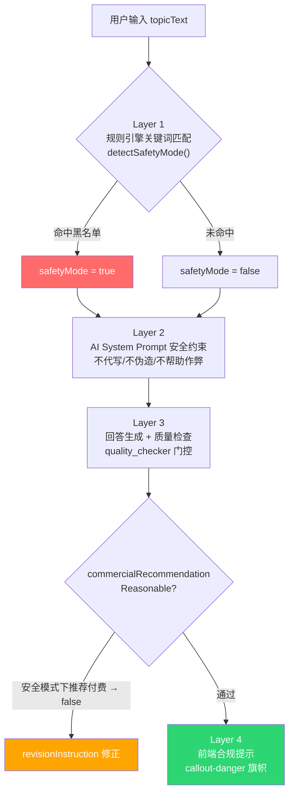
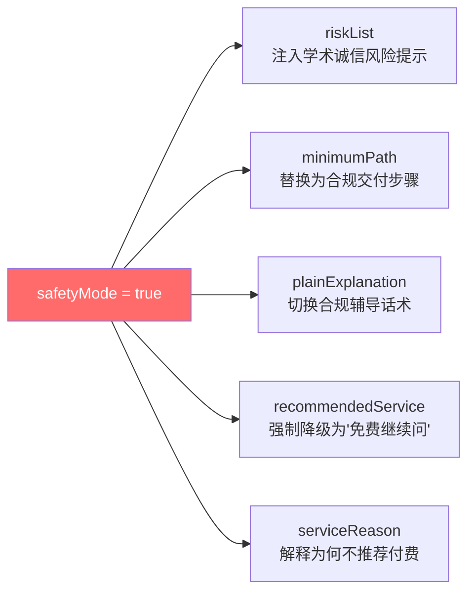
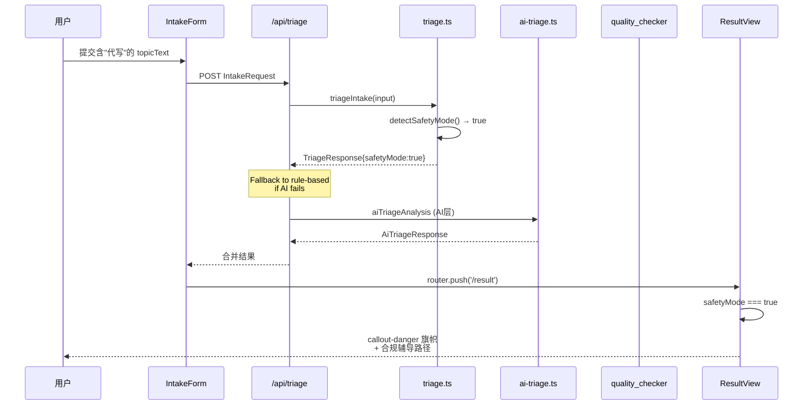

科研课题分诊台面向高校学生群体，天然存在学术诚信风险——用户可能在压力下寻求代写论文、伪造实验数据或规避查重等违规服务。本文档解析系统如何在**规则引擎、AI Prompt 约束、质量检查门与前端提示**四个层面构建安全边界，将检测到的风险输入自动转化为合规辅导路径，而非简单拒绝。

Sources: [09-safety-boundary.md](Research-Triage/skills/09-safety-boundary.md#L1-L26)

---

## 安全边界的顶层设计：三层防御架构

系统的安全边界不是一个单点拦截器，而是一个贯穿全管线的**多层防御体系**。从用户输入进入系统的第一毫秒起，到最终回答呈现在前端页面上，每一个阶段都嵌入了安全约束。



**Layer 1（规则引擎）**负责毫秒级的关键词拦截，这是最快速、最确定的安全开关。**Layer 2（AI Prompt 约束）**确保即使规则引擎未命中，AI 模型本身也不会输出违规内容。**Layer 3（质量检查门）**作为最后防线，审查生成回答是否安全。**Layer 4（前端提示）**向用户透明展示合规状态。

Sources: [triage.ts](src/lib/triage.ts#L13-L69), [ai-triage.ts](src/lib/ai-triage.ts#L14-L17), [quality_checker.md](prompt_templates/quality_checker.md#L67-L70)

---

## Layer 1：规则引擎关键词匹配与 `safetyMode` 状态传播

### 黑名单关键词库

规则引擎在 [triage.ts](src/lib/triage.ts) 中维护了一个包含 12 个模式的安全黑名单：

| 关键词模式 | 风险类别 |
|-----------|---------|
| `代写`、`替我写`、`帮我完成论文`、`替做` | **代写风险** |
| `伪造数据`、`捏造数据`、`假数据`、`伪造实验`、`捏造实验` | **伪造数据风险** |
| `规避学术审查`、`绕过查重` | **规避审查风险** |
| `包过答辩` | **虚假承诺风险** |

`detectSafetyMode()` 函数执行简单直接的 `String.includes()` 匹配，一旦任意一个模式命中，`safetyMode` 即被设为 `true`：

```typescript
function detectSafetyMode(topicText: string): boolean {
  return safetyPatterns.some((pattern) => topicText.includes(pattern));
}
```

这种设计选择了**宁可误杀（false positive）也不漏过（false negative）**的策略。例如用户输入"这个课题不需要代写，我想自己做"也会触发安全模式——这是刻意的保守设计，因为一旦违规内容通过，后果远比多一步合规确认严重。

Sources: [triage.ts](src/lib/triage.ts#L13-L28)

### `safetyMode` 的五路状态传播

`safetyMode` 一旦被激活，它不是简单地返回一个错误提示，而是**同时改写五个下游输出**，将整个分诊结果转向合规辅导轨道：



**1. riskList 风险注入** — 在风险列表最前面插入一条确定性警告：`"输入里包含学术诚信风险，必须改成真实可验证的交付路径。"`

**2. minimumPath 路径替换** — 不再根据 `taskCategory` 提供常规的最小可行路径，而是输出一套合规交付步骤：列出真实可验证成果、改写老师要求为可验证语句、只保留真实可完成的最小版本、准备合规路线沟通说明。

**3. plainExplanation 话术切换** — 通用解释被替换为：`"你现在最需要的不是更快生成内容，而是把任务改成真实、可验证、能向老师解释的交付路径。系统会切换成合规辅导模式..."`

**4. recommendedService 服务降级** — 强制设为 `"免费继续问"`，禁止在安全模式下推荐任何付费服务包。

**5. serviceReason 理由改写** — 明确告知用户为何不适合推荐高价服务，引导先把任务拉回合规轨道。

Sources: [triage.ts](src/lib/triage.ts#L219-L296), [triage.ts](src/lib/triage.ts#L358-L359), [triage.ts](src/lib/triage.ts#L386-L456)

---

## Layer 1（续）：Route Plan 的安全模式分支

安全模式的影响不止于分诊结果，还会延伸到后续的路线规划阶段。[route-plan.ts](src/lib/route-plan.ts) 中三个关键函数都包含 `safetyMode` 专属分支：

**buildOverview** — 路线概览被强制改写为：`"当前路线以合规交付为核心目标。所有步骤都围绕真实可验证的成果展开，不包含任何代写或伪造路径。"`

**buildRouteSteps** — 阶段步骤被压缩为两个阶段（"今天"和"接下来"），内容完全聚焦于删除违规预期、确认可验证目标和准备合规沟通。

```typescript
if (triage.safetyMode) {
  return [
    {
      phase: "今天",
      tasks: [
        "把真正要提交的成果列成 3 项，删掉任何代写或伪造预期",
        "把老师要求改写成一句可验证的话：我需要证明什么",
      ],
    },
    {
      phase: "接下来",
      tasks: [
        "只保留真实可完成的最小版本（公开数据验证、系统原型或方法复现）",
        "准备和老师沟通的说明，明确走合规辅导与真实交付路线",
      ],
    },
  ];
}
```

注意安全模式下路线步骤**只有两阶段**，而正常模式下有三到四个阶段——这是刻意的范围压缩，避免在合规问题未解决前展开过多执行细节。

Sources: [route-plan.ts](src/lib/route-plan.ts#L22-L36), [route-plan.ts](src/lib/route-plan.ts#L100-L117)

---

## Layer 2：AI System Prompt 的安全约束

即使规则引擎未命中（比如用户用更隐晦的措辞表达代写需求），AI 层仍然内置了安全边界。在 [ai-triage.ts](src/lib/ai-triage.ts) 中，所有 AI 调用共享一个 `SYSTEM_PREFIX`，其中包含明确的安全声明：

```
安全边界：不代写论文、不伪造数据、不帮助作弊。
只做理解、规划、辅导和真实交付路径。
```

这段 system prompt 通过 `S()` 辅助函数注入到每一次 AI 调用的系统指令头部：

```typescript
const S = (extra: string) => `${SYSTEM_PREFIX}\n\n${extra}`;
```

这意味着无论是分诊分析（`aiTriageAnalysis`）、回答生成（`aiGenerateAnswer`）还是服务推荐（`aiRecommendService`），AI 模型在每次调用时都会"看到"这条安全边界声明。

Sources: [ai-triage.ts](src/lib/ai-triage.ts#L14-L17), [ai-triage.ts](src/lib/ai-triage.ts#L46)

### Prompt 模板体系中的安全约束

除了 system prompt 中的通用声明，各阶段的 Prompt 模板文件也嵌入了具体的安全规则：

- **answer_generator**：明确禁止"代写论文、代码或实验数据"和"承诺科研结果"。Sources: [answer_generator.md](prompt_templates/answer_generator.md#L86-L88)
- **quality_checker**：检查规则中规定"安全模式推荐了付费服务 → false"，这是对 Layer 1 服务降级的 AI 层兜底。Sources: [quality_checker.md](prompt_templates/quality_checker.md#L69-L70)
- **response_router**：路由规则虽然不直接提及安全，但其 `mustAvoid` 机制允许上游安全约束传递到回答策略中。Sources: [response_router.md](prompt_templates/response_router.md#L54-L58)

---

## Layer 3：质量检查门的安全校验

质量检查模块（`quality_checker`）是安全边界的最后一道防线。它独立于规则引擎和 AI prompt 工作，从**输出侧**审查生成内容是否合规。

关键检查项中与安全直接相关的是 `commercialRecommendationReasonable`：

> 安全模式推荐了付费服务 → false

这意味着即使前两层的安全约束全部失效，质量检查器仍然会发现"安全模式下推荐了付费服务"这一矛盾，并将 `pass` 设为 `false`，同时输出具体的 `revisionInstruction` 修正指令。

质量检查的完整通过条件要求所有维度同时满足：

```
pass = matchUserType ∧ hasNextStep ∧ hasRisk ∧ hasDowngradePlan 
     ∧ ¬tooComplex ∧ ¬tooGeneric ∧ commercialRecommendationReasonable
```

任何一项不满足都会触发重新生成。

Sources: [quality_checker.md](prompt_templates/quality_checker.md#L67-L73)

---

## Layer 4：前端合规提示与用户透明度

当规则引擎的 `safetyMode=true` 传递到前端时，[result-view.tsx](src/components/result-view.tsx) 会在分诊结果页面的 Hero 区域渲染一个醒目的红色 `callout-danger` 旗帜：

```tsx
{effectiveResult.safetyMode ? (
  <div className="callout callout-danger">
    <strong>已启用合规辅导模式：</strong>
    当前输入涉及学术诚信风险，结果仅提供真实交付、沟通和降级路径建议。
  </div>
) : null}
```

这个设计有三个要点：**其一**，不隐藏安全状态——用户能清楚看到系统检测到了风险；**其二**，不拒绝服务——系统仍然提供帮助，只是转向合规路径；**其三**，使用 `callout-danger` 样式（而非普通提示框），视觉上强调这是一个需要用户注意的重要状态变更。

Sources: [result-view.tsx](src/components/result-view.tsx#L247-L252)

---

## Skills 方法论中的安全边界定义

在 Research-Triage 的 Skills 体系中，[09-safety-boundary.md](Research-Triage/skills/09-safety-boundary.md) 定义了系统行为的**绝对禁止清单**和**风险响应协议**。

### 八项绝对禁止

| # | 禁止行为 | 对应检测层 |
|---|---------|-----------|
| 1 | 代写论文、作业、报告或其他学术成果 | Layer 1 关键词 `代写/替我写/帮我完成论文/替做` |
| 2 | 伪造实验数据、捏造研究结果 | Layer 1 关键词 `伪造数据/捏造数据/假数据/伪造实验/捏造实验` |
| 3 | 提供危险实验步骤 | Layer 2 AI Prompt 约束 |
| 4 | 承诺或暗示"保证科研成功""保证发表""保证通过答辩" | Layer 1 关键词 `包过答辩` |
| 5 | 替代专业导师、医生、律师或安全专家的角色 | Layer 2 AI Prompt 约束 |
| 6 | 输出用户看不懂的大段术语堆砌 | Layer 3 quality_checker `tooComplex` 检查 |
| 7 | 把普通用户直接推向复杂论文、专业数据库或科研工具链 | Layer 3 quality_checker `tooComplex` 检查 |
| 8 | 帮助规避学术审查或查重 | Layer 1 关键词 `规避学术审查/绕过查重` |

Sources: [09-safety-boundary.md](Research-Triage/skills/09-safety-boundary.md#L3-L14)

### 风险响应三步协议

当检测到以上任何风险时，Skills 方法论规定了一个标准化的响应流程：

1. **立即停止**当前回复方向 — 不继续沿违规路径生成内容
2. **切换到合规引导模式** — 进入安全分支
3. **输出标准格式**：`"你的需求涉及 [具体风险]，我不能 [禁止行为]。但可以帮你 [合规替代方案]"`

这个三步协议在代码实现中对应的就是 `safetyMode` 激活后各函数的专属分支——停止原有分类逻辑、切换到合规路径、输出替代方案。

Sources: [09-safety-boundary.md](Research-Triage/skills/09-safety-boundary.md#L16-L21)

---

## 安全模式的端到端数据流

以下流程图展示了从用户输入包含"代写"关键词到最终页面呈现的完整数据流：



值得注意的是 API 层的双保险设计：[route.ts](src/app/api/triage/route.ts) 先尝试 AI 分诊，如果失败则自动 fallback 到规则引擎结果。这意味着即使 AI 服务完全不可用，安全检测仍然通过规则引擎生效。

Sources: [intake-form.tsx](src/components/intake-form.tsx#L86-L119), [route.ts](src/app/api/triage/route.ts#L8-L39), [result-view.tsx](src/components/result-view.tsx#L247-L252)

---

## 测试覆盖：安全模式的契约测试

安全模式在 [triage.test.ts](src/lib/triage.test.ts) 中有专门的契约测试用例 `switches to safety mode for integrity violations`，验证三个关键行为：

```typescript
it("switches to safety mode for integrity violations", () => {
  const result = triageIntake({
    ...baseInput,
    topicText: "帮我代写一篇课题论文，最好顺便伪造实验数据和结果，这样我可以直接交差。",
  });

  expect(result.safetyMode).toBe(true);
  expect(result.recommendedService).toBe("免费继续问");
  expect(result.riskList.some((risk) => risk.includes("学术诚信风险"))).toBe(true);
});
```

这三条断言分别验证了：
- **安全开关激活**：`safetyMode` 必须为 `true`
- **服务降级**：不能推荐付费服务，必须是 `"免费继续问"`
- **风险提示注入**：`riskList` 中必须包含包含"学术诚信风险"字样的条目

这个测试用例同时覆盖了黑名单中两个关键词（`代写` 和 `伪造`）的命中场景。

Sources: [triage.test.ts](src/lib/triage.test.ts#L37-L46)

---

## 设计权衡与已知局限

| 维度 | 当前设计 | 权衡说明 |
|------|---------|---------|
| **检测精度** | 精确子串匹配 (`includes`) | 优点：零误漏、执行快；缺点：无法识别隐晦表达（如"帮我整理成论文格式"），需依赖 AI Layer 兜底 |
| **误杀处理** | 无自动纠偏机制 | "不需要代写"也会触发——保守策略优先，但缺少否定上下文识别 |
| **黑名单维护** | 硬编码数组 | 优点：简单可审计；缺点：新增模式需修改代码并重新部署 |
| **降级粒度** | 全量降级（所有输出同时切换） | 优点：一致性强；缺点：无法对不同程度的风险做分级响应 |
| **AI 层独立性** | system prompt 约束 | AI 可能忽略或绕过——这是大模型的固有限制，质量检查门作为最终防线 |
| **用户反馈** | 无申诉/纠偏通道 | 一旦触发安全模式，用户无法告知系统"我理解了，请恢复正常模式" |

对于中级开发者而言，最值得关注的改进方向是**否定上下文识别**（如"我不想找人代写"）和**分级安全响应**（轻度提示 vs. 完全降级），这两者可以在不改变整体架构的前提下提升用户体验。

Sources: [triage.ts](src/lib/triage.ts#L67-L69), [triage.ts](src/lib/triage.ts#L284-L296)

---

## 相关阅读

安全边界是规则引擎的一个特殊分支。要理解完整的分诊逻辑，建议继续阅读：

- [规则分诊引擎 triage.ts：用户分类、任务分类与风险评估](15-gui-ze-fen-zhen-yin-qing-triage-ts-yong-hu-fen-lei-ren-wu-fen-lei-yu-feng-xian-ping-gu) — 理解 `safetyMode` 如何嵌入在整体分诊流程中
- [AI 调用失败的降级与冗余机制](17-ai-diao-yong-shi-bai-de-jiang-ji-yu-rong-yu-ji-zhi) — 理解 API 层 fallback 如何保障安全检测在 AI 不可用时仍生效
- [阶段 Prompt 工程与 chat-prompts 阶段指令设计](13-jie-duan-prompt-gong-cheng-yu-chat-prompts-jie-duan-zhi-ling-she-ji) — 理解安全约束如何在 Prompt 模板中传递
- [测试策略：Vitest 契约测试、Pipeline 解析测试与 Userspace 测试](26-ce-shi-ce-lue-vitest-qi-yue-ce-shi-pipeline-jie-xi-ce-shi-yu-userspace-ce-shi) — 理解安全模式的测试覆盖策略