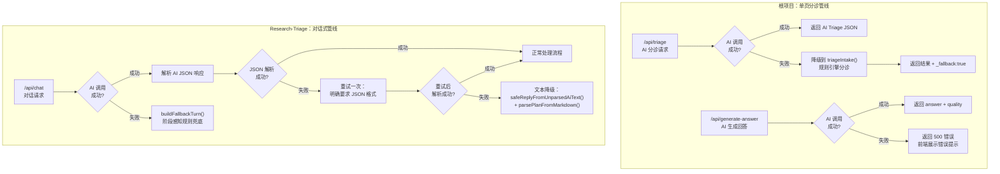
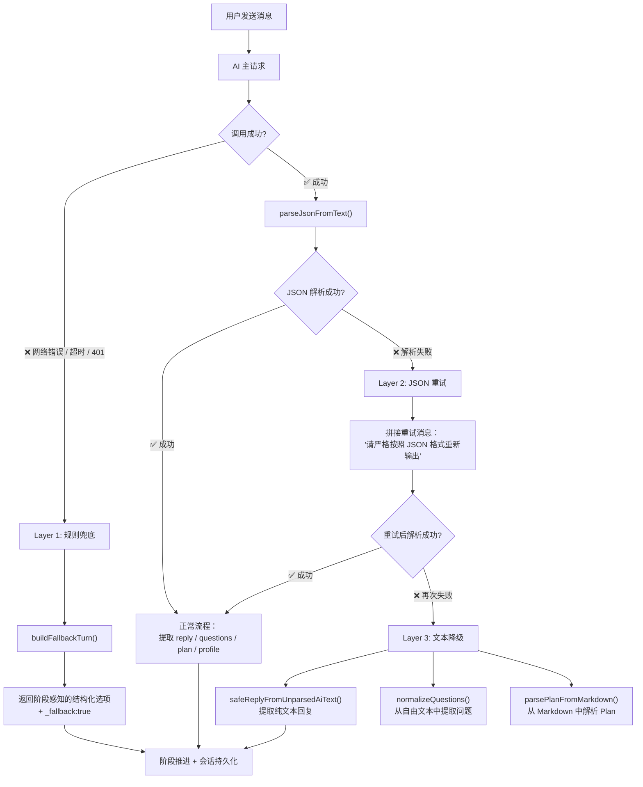

本系统作为面向学生用户的科研分诊平台，对 AI 外部服务依赖具有天然脆弱性——DeepSeek API 可能因配额、网络、模型过载等原因不可用。为此，项目在**根管线（单页分诊）** 和 **Research-Triage（对话式管线）** 中分别构建了多层降级与冗余策略，确保用户在任何 AI 不可用场景下都能获得有意义的结果。本文将逐一拆解这些机制的设计逻辑、实现位置与实际降级行为。

Sources: [ai-provider.ts](src/lib/ai-provider.ts#L1-L56), [ai-provider.ts](Research-Triage/src/lib/ai-provider.ts#L1-L117)

## 全局降级架构概览

系统的降级设计遵循一个核心原则：**AI 是增强而非必需**。无论是根项目的单次分诊流程，还是 Research-Triage 的多轮对话管线，都存在一条完全不依赖 AI 的"地面路径"（ground path），确保即使 API Key 缺失或服务宕机，用户仍然能获得规则分诊结果、路线规划和基本交互。



上图的横向层级关系非常明确：**根项目**的降级是一次性的（AI 成功或规则引擎兜底），而 **Research-Triage** 构建了四层递进式降级（AI JSON → AI 重试 → AI 文本提取 → 规则兜底），因为对话式场景对连续性有更高要求。

Sources: [route.ts](src/app/api/triage/route.ts#L1-L39), [route.ts](Research-Triage/src/app/api/chat/route.ts#L1-L495)

## 第一层：环境变量冗余链——多 Provider 热切换

AI Provider 层本身没有代码级别的重试或切换逻辑，但通过**环境变量优先级链**实现了部署层面的多 Provider 热切换能力。两个版本的 Provider 都设计了回退式环境变量读取。

### 环境变量优先级对比

| 配置项 | 根项目 `ai-provider.ts` | Research-Triage `ai-provider.ts` |
|--------|------------------------|----------------------------------|
| **Base URL** | `DEEPSEEK_BASE_URL` → 硬编码 `https://api.deepseek.com/v1` | `AI_BASE_URL` → `DEEPSEEK_BASE_URL` → `OPENAI_BASE_URL` → 硬编码默认值 |
| **API Key** | `DEEPSEEK_API_KEY` → `OPENAI_API_KEY` → 空字符串 | `AI_API_KEY` → `DEEPSEEK_API_KEY` → `OPENAI_API_KEY` → 空字符串 |
| **默认模型** | 硬编码 `deepseek-v4-flash` | `AI_MODEL` 环境变量 → `deepseek-v4-flash` |
| **Key 缺失行为** | 静默发送空 Key（API 层报错） | **主动抛出异常**并给出明确提示 |

Research-Triage 版本的 Provider 明显更成熟——它在调用前检查 `API_KEY` 是否存在，如果缺失直接抛出带有操作指引的异常（`"No API key found. Set AI_API_KEY in .env..."`），而非让请求在网络层静默失败。这意味着运维人员只需要修改 `.env` 文件就能将整个系统切换到备用 Provider（如 OpenAI、Moonshot、Zhipu GLM），**无需改动任何代码**。

```typescript
// Research-Triage 的三重环境变量回退
const BASE =
  process.env.AI_BASE_URL ||      // 优先：通用配置
  process.env.DEEPSEEK_BASE_URL || // 兼容：DeepSeek 专用
  process.env.OPENAI_BASE_URL ||   // 兼容：OpenAI 专用
  "https://api.deepseek.com/v1";   // 最终默认值
```

Sources: [ai-provider.ts](src/lib/ai-provider.ts#L5-L8), [ai-provider.ts](Research-Triage/src/lib/ai-provider.ts#L19-L31)

## 第二层：API 调用失败的即时降级——根项目的双轨分诊

根项目的 `/api/triage` 端点是整个降级设计最核心的落地场景。它的策略是**先尝试 AI，失败后无缝切换到规则引擎**，并在响应中标记 `_fallback: true` 以便前端感知降级状态。

### 降级流程详解

```typescript
// src/app/api/triage/route.ts — 核心降级逻辑
try {
  const result = await aiTriageAnalysis(intake);  // ① 尝试 AI 分诊
  return NextResponse.json(result);
} catch (err) {
  // ② AI 失败 → 降级到规则引擎
  if (intake) {
    try {
      return NextResponse.json({ ...ruleTriage(intake), _fallback: true });
    } catch { /* 规则引擎也失败则返回 500 */ }
  }
  return NextResponse.json({ error: `${msg}` }, { status: 500 });
}
```

这段代码的关键设计点在于：`intake` 变量在 `try` 块的外层声明（`let intake: IntakeRequest | null = null`），在 JSON 解析成功后才被赋值。这保证了只有**输入校验通过**的数据才会进入规则引擎降级路径，避免了规则引擎处理无效数据的风险。`_fallback: true` 标记虽然当前前端未做特殊展示，但为后续区分 AI/规则结果预留了接口。

值得注意的是，并非所有端点都有降级路径：

| 端点 | AI 依赖 | 降级策略 | 前端行为 |
|------|---------|---------|---------|
| `/api/triage` | `aiTriageAnalysis()` | ✅ 规则引擎 `triageIntake()` | 正常展示结果 |
| `/api/triage/intake` | 无 | 纯规则引擎，无降级需求 | 正常展示结果 |
| `/api/triage/route-plan` | 无 | 纯规则引擎 `buildRoutePlan()` | 正常展示结果 |
| `/api/generate-answer` | `aiGenerateAnswer()` + `aiRecommendService()` | ❌ 无降级 | 显示错误提示 |
| `/api/recommend-service` | `aiRecommendService()` | ❌ 无降级 | 显示错误提示 |

`/api/generate-answer` 和 `/api/recommend-service` 是"AI-only"端点——它们的功能（个性化回答生成、质量检查、服务推荐）无法被规则引擎替代，因此失败时直接返回 500 错误，由前端展示"系统暂时没能生成回答，请稍后再试"。

Sources: [route.ts](src/app/api/triage/route.ts#L8-L39), [route.ts](src/app/api/generate-answer/route.ts#L26-L43), [route.ts](src/app/api/triage/intake/route.ts#L6-L30)

## 第三层：四层递进式降级——Research-Triage 的对话管线

Research-Triage 的 `/api/chat` 端点承担了最复杂的降级逻辑。与根项目的一次性降级不同，对话场景要求**即使 AI 部分失败，会话也不能中断**。为此，系统设计了四层递进式降级策略。



### Layer 1：规则兜底——`buildFallbackTurn()`

当 AI 调用本身失败（网络错误、认证失败、服务器过载等），系统调用 `buildFallbackTurn()` 根据当前对话阶段返回**阶段感知的结构化选项**。这个函数的设计非常精妙——它不是返回一个泛泛的"系统繁忙"消息，而是根据 `phase`、画像是否就绪（`ready`）、Plan 是否已存在（`hasPlan`）三个维度生成不同的降级响应：

| 对话阶段 | 画像状态 | Plan 状态 | 降级响应策略 |
|---------|---------|----------|------------|
| `greeting` | — | — | 引导用户选择兴趣方向（4 个选项），完成首次交互 |
| `profiling` | 未就绪 | — | 提供基础水平确认选项，继续填充画像 |
| `profiling`/`clarifying` | 已就绪 | 无 Plan | 引导用户确认目标范围，为 Plan 生成做准备 |
| 任意阶段 | — | 已有 Plan | 告知 Plan 已保留，等待服务恢复后调整 |

这种设计保证了**用户体验的连续性**——即使 AI 完全不可用，用户仍然能看到结构化选项并继续交互，而非面对一个空白或报错页面。

### Layer 2：JSON 重试——一次格式纠正机会

当 AI 调用成功但返回的内容不是合法 JSON 时（这在 DeepSeek 等模型中时有发生），系统不是立即放弃，而是**拼接一条带有历史上下文的重试消息**，明确要求模型以 JSON 格式重新输出：

```typescript
const retryMsgs: ChatMsg[] = [
  ...aiMessages,
  { role: "assistant", content: aiResult.content },  // 附上失败的原回复
  { role: "user", content: "上一轮回复不是JSON。请严格按照JSON格式重新输出，以{开头以}结尾。" },
];
aiResult = await chat({ messages: retryMsgs, temperature: 0.3, maxTokens: 4096, ... });
```

重试消息中包含了**原始请求 + AI 的失败回复 + 纠正指令**，让模型能够看到自己的错误并修正。`temperature` 从 0.4 降低到 0.3 以提高格式遵从度，`maxTokens` 设为 4096 防止因截断导致 JSON 不完整。

### Layer 3：文本降级——`safeReplyFromUnparsedAiText()` + Markdown Plan 解析

如果 JSON 重试仍然失败，系统进入"尽力而为"模式：

- **回复提取**：`safeReplyFromUnparsedAiText()` 从 AI 的原始文本中提取可展示的纯文本内容。它会智能检测：如果是 plan 产出阶段且文本看起来像协议 JSON，返回"模型返回了计划数据，但格式解析失败"的提示；否则直接截取文本中非问题列表的部分作为回复。
- **问题提取**：`normalizeQuestions()` 通过正则从自由格式文本中提取编号列表或项目符号列表中的问题。
- **Plan 解析**：`parsePlanFromMarkdown()` 是一个强大的 Markdown 降级解析器——即使 AI 没有返回 JSON，只要它返回了带有"画像"、"问题判断"、"推荐路径"、"步骤"等 Markdown 标题的结构化文本，系统仍能从中提取 Plan 数据。

Sources: [route.ts](Research-Triage/src/app/api/chat/route.ts#L179-L260), [chat-pipeline.ts](Research-Triage/src/lib/chat-pipeline.ts#L518-L568), [chat-pipeline.ts](Research-Triage/src/lib/chat-pipeline.ts#L170-L177)

## JSON 解析韧性——`parseJsonFromText()` 的多策略提取

AI 模型返回 JSON 的方式千变万化——可能是纯 JSON、包裹在 Markdown 代码块中、前后带有解释文字、甚至是不完整的 JSON。系统在两个项目中都实现了多策略 JSON 提取函数 `parseJsonFromText()`，但 Research-Triage 版本更为健壮。

### 解析策略对比

| 策略 | 根项目 `ai-triage.ts` | Research-Triage `chat-pipeline.ts` | 匹配场景 |
|------|----------------------|------------------------------------|---------|
| 直接 `JSON.parse` | ✅ | ✅ | 模型完美输出 JSON |
| Markdown 代码块提取 `` ```json ... ``` `` | ✅ | ✅ | 模型用代码块包裹 JSON |
| 首尾花括号截取 | ✅ | ✅ | JSON 前后有说明文字 |
| 平衡花括号候选提取 | — | ✅ | 文本中存在多个 `{...}` 片段 |
| 缺失闭合花括号补全 | — | ✅ | JSON 被截断（maxTokens 不足） |
| 协议字段验证 `isProtocolJson()` | — | ✅ | 过滤掉非协议 JSON 对象 |

Research-Triage 新增了**平衡花括号候选提取**和**缺失闭合花括号补全**两个策略。前者通过逐字符扫描找到所有语法完整的 `{...}` 片段并逐一尝试解析；后者检测到开括号多于闭括号时，自动补全缺失的 `}` 再尝试解析。这两个策略专门应对模型输出被 `maxTokens` 截断的边缘场景。

```typescript
// 缺失闭合花括号补全 — chat-pipeline.ts L25-36
if (first >= 0) {
  const excerpt = text.slice(first);
  let depth = 0;
  for (const ch of excerpt) {
    if (ch === "{") depth++;
    if (ch === "}") depth--;
  }
  if (depth > 0) {
    try { return JSON.parse(excerpt + "}".repeat(depth)); } catch { /* */ }
  }
}
```

Sources: [ai-triage.ts](src/lib/ai-triage.ts#L21-L42), [chat-pipeline.ts](Research-Triage/src/lib/chat-pipeline.ts#L6-L86)

## 前端错误处理与用户感知

前端在降级机制中承担**最后一道防线**的角色——无论后端返回的是 AI 结果、规则结果还是错误信息，前端都需要以用户友好的方式展示。

### 错误状态机

`IntakeForm` 组件维护了一个 `PendingState` 类型和 `networkError` 字符串，共同驱动 UI 状态：

| `pendingState` | 用户看到的 UI | 触发条件 |
|----------------|-------------|---------|
| `idle` | 正常表单 | 初始状态 |
| `submitting` | 加载遮罩："正在理解你的课题状态" | 分诊请求中 |
| `clarifying` | 追问表单 | AI 判断信息不足 |
| `generating` | 加载遮罩："正在为你生成个性化回答" | 回答生成中 |
| `error` | 红色错误横幅 + 表单可重新提交 | 任何网络/AI 错误 |

关键设计：`error` 状态下表单**不会消失**——用户看到错误提示后可以直接修改输入或重试，无需刷新页面。错误消息被设计为"系统暂时没能完成分诊，请稍后再试"这类非技术性表述，避免向学生用户暴露 API 错误码等内部细节。

```typescript
// intake-form.tsx — 前端错误兜底
} catch (error) {
  setPendingState("error");
  setNetworkError(
    error instanceof Error ? error.message : "系统暂时没能完成分诊，请稍后再试。",
  );
}
```

Sources: [intake-form.tsx](src/components/intake-form.tsx#L120-L126), [intake-form.tsx](src/components/intake-form.tsx#L409)

## 会话恢复——Research-Triage 的磁盘级冗余

Research-Triage 的对话管线面临一个额外挑战：**服务端重启或内存回收导致会话丢失**。为此，系统实现了基于 Userspace 文件系统的磁盘级会话恢复：

当内存中找不到 session 时，系统会检查该 `sessionId` 对应的 Userspace 目录是否有文件存在。如果有，则从磁盘重建会话状态：从 `profile.md` 恢复用户画像、从最新 Plan 文件恢复 Plan、并根据恢复的数据推断当前对话阶段（`profiling` → `clarifying` → `reviewing`）。这确保了即使服务端重启，用户刷新页面后仍能无缝继续对话。

| 恢复数据 | 磁盘文件 | 恢复逻辑 |
|---------|---------|---------|
| 用户画像 | `profile.md` | 正则匹配 Markdown 列表中的字段和值 |
| Plan | 最新版本 Plan 文件 | `restoreLatestPlan()` |
| 对话阶段 | 推断自画像和 Plan 状态 | 有 Plan → `reviewing`；画像完整 → `clarifying`；否则 → `profiling` |

Sources: [route.ts](Research-Triage/src/app/api/chat/route.ts#L83-L155)

## 规则引擎作为"地面真相"——`triage.ts`

整个降级体系的基石是 `triage.ts` 中的纯函数规则引擎 `triageIntake()`。这个函数不依赖任何外部服务，通过纯逻辑实现了完整的用户分类、任务分类、风险评估、最短路径推荐和服务匹配。它包含以下核心能力：

- **安全模式检测**：通过 13 个关键词模式（`代写`、`伪造数据`、`绕过查重`等）识别学术诚信风险，触发合规降级路径
- **用户画像分类**：5 种用户类型（完全小白型 / 基础薄弱型 / 普通项目型 / 科研能力型 / 焦虑决策型）
- **任务分类**：6 种任务类别，每种都有独立的最短路径和建议
- **难度评分**：加权计分模型，综合考虑任务类型权重、基础水平权重、截止时间加成
- **风险清单**：最多 3 条风险，按优先级从 9 种风险模式中选择
- **最短路径**：每个任务类别 4 步可执行操作，以"今天先…"开头确保可执行性

规则引擎和 AI 管线使用不同的类型系统（规则引擎输出 `TriageResponse`，AI 管线输出 `AiTriageResponse`），`/api/triage/route-plan` 端点中的 `answerToCategory` 映射表负责在两种格式之间转换。

Sources: [triage.ts](src/lib/triage.ts#L1-L65), [route.ts](src/app/api/triage/route-plan/route.ts#L7-L13)

## 降级机制的局限与演进方向

当前降级设计存在几个已知的结构性局限，值得开发者在扩展时注意：

**1. `generate-answer` 端点无降级路径**。分诊阶段可以通过规则引擎兜底，但个性化回答生成（300-600 字的针对性建议 + 质量检查 + 服务推荐）无法用规则替代。当 AI 不可用时，用户只能得到分诊结果而无法获得回答内容。潜在改进方向是预设一组按用户类型和任务类别索引的模板回答作为降级。

**2. 无自动重试机制**。根项目的 AI Provider 没有对瞬时网络错误实现指数退避重试。Research-Triage 的 JSON 重试只针对格式问题，不针对网络层面的瞬态失败（如 429 Rate Limit）。这意味着一个短暂的 API 限流就会触发完整降级路径。

**3. 降级响应的质量不可知**。规则引擎的结果虽然功能完整，但缺少 AI 管线中 `confidence` 字段和 `needClarification` 判断。前端目前也没有利用 `_fallback: true` 标记向用户展示"当前使用简化版分析"的提示。

**4. 单 Provider 架构**。虽然环境变量支持切换 Provider，但运行时不支持多 Provider 并行或热备。系统在同一时刻只能使用一个 API 端点，无法实现"A Provider 超时自动切换到 B Provider"的冗余策略。

Sources: [route.ts](src/app/api/generate-answer/route.ts#L39-L43), [ai-provider.ts](Research-Triage/src/lib/ai-provider.ts#L52-L116)

## 相关阅读

- 了解规则引擎的完整实现细节：[规则分诊引擎 triage.ts：用户分类、任务分类与风险评估](15-gui-ze-fen-zhen-yin-qing-triage-ts-yong-hu-fen-lei-ren-wu-fen-lei-yu-feng-xian-ping-gu)
- 了解 AI Provider 适配层的设计考量：[AI Provider 适配层：裸 fetch 调用 DeepSeek API 的设计考量](10-ai-provider-gua-pei-ceng-luo-fetch-diao-yong-deepseek-api-de-she-ji-kao-liang)
- 了解 AI JSON 输出的解析策略：[Chat Pipeline：AI JSON 输出解析、Plan 归一化与产物生成](12-chat-pipeline-ai-json-shu-chu-jie-xi-plan-gui-hua-yu-chan-wu-sheng-cheng)
- 了解会话持久化机制：[Userspace 文件系统：会话产物持久化与版本管理](14-userspace-wen-jian-xi-tong-hui-hua-chan-wu-chi-jiu-hua-yu-ban-ben-guan-li)
- 了解前端错误状态展示：[前端会话持久化：sessionStorage 状态恢复与快照机制](21-qian-duan-hui-hua-chi-jiu-hua-sessionstorage-zhuang-tai-hui-fu-yu-kuai-zhao-ji-zhi)