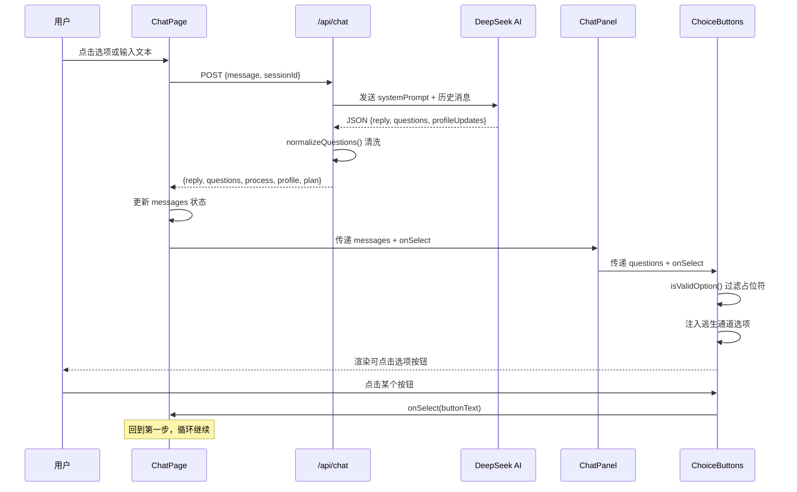
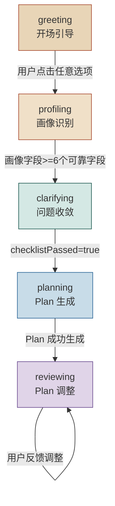

「人人都能做科研」分诊台的前端对话区并非传统开放式聊天框，而是一套 **结构化选项驱动** 的交互体系。`ChatPanel` 负责渲染消息流与内嵌控件，`ChoiceButtons` 对 AI 返回的选项数组做客户端级清洗与逃生通道注入，二者与 `InlineInput` 协同构成一个"按钮优先、自由输入兜底"的双通道交互模型。本文将深入解析这套组件体系的架构设计、数据流向与关键实现细节。

Sources: [chat-panel.tsx](Research-Triage/src/components/chat-panel.tsx#L1-L98), [choice-buttons.tsx](Research-Triage/src/components/choice-buttons.tsx#L1-L49)

## 组件层级与职责边界

整个对话交互区由三层组件嵌套完成，每一层有明确的职责边界：

```
ChatPage (page.tsx)          ← 状态管理层：持有 messages, profile, plan
├── ChatPanel                ← 消息渲染层：遍历 messages，分发子组件
│   ├── ProcessPanel         ← 可折叠处理摘要（仅 assistant 消息）
│   ├── ChoiceButtons        ← 结构化选项按钮组（仅含 questions 的消息）
│   └── InlineInput          ← 自由输入框（仅含 questions 的消息）
└── ChatInput                ← 底部常驻输入栏（全局独立）
```

Sources: [page.tsx](Research-Triage/src/app/page.tsx#L177-L216), [chat-panel.tsx](Research-Triage/src/components/chat-panel.tsx#L46-L97)

**职责分配原则**：`ChatPanel` 不持有任何业务状态——它通过 Props 接收 `messages` 数组和 `onSelect` 回调，是一个纯粹的渲染组件。所有状态（消息列表、画像、Plan）都由父组件 `ChatPage` 通过 `useState` 集中管理。`ChoiceButtons` 更纯粹，它接收 `questions` 字符串数组，执行客户端过滤后渲染按钮。这种"状态上提、渲染下沉"的设计使得组件可测试且无副作用。

Sources: [chat-panel.tsx](Research-Triage/src/components/chat-panel.tsx#L9-L13), [choice-buttons.tsx](Research-Triage/src/components/choice-buttons.tsx#L3-L7)

## 数据流全景：从 API 响应到按钮渲染

理解这两个组件的关键在于把握 **questions 字段从后端到前端的完整生命周期**。以下流程图展示了一条典型的交互回路：



Sources: [page.tsx](Research-Triage/src/app/page.tsx#L69-L147), [route.ts](Research-Triage/src/app/api/chat/route.ts#L262-L278), [chat-pipeline.ts](Research-Triage/src/lib/chat-pipeline.ts#L140-L162)

### questions 的双重来源

questions 有两个完全不同的产生路径：

| 来源 | 触发条件 | 生成逻辑 | 选项质量 |
|------|---------|---------|---------|
| **AI JSON 响应** | 正常 AI 调用成功 | Prompt 指令要求 AI 输出 `questions` 数组，经 `normalizeQuestions()` 清洗 | 上下文相关、高度个性化 |
| **规则兜底** | AI 调用失败或超时 | `buildFallbackTurn()` 根据当前阶段返回硬编码选项 | 静态但保证可用性 |

当 AI 服务正常时，每个阶段的 Prompt 都会明确要求模型输出 `questions` 字段，例如 `PROFILING_INSTRUCTION` 要求 "2-4个完整、确定的选项"。当 AI 调用失败时，`buildFallbackTurn()` 提供阶段相关的预设选项作为降级方案，确保用户始终有可交互的按钮。

Sources: [chat-prompts.ts](Research-Triage/src/lib/chat-prompts.ts#L42-L64), [chat-pipeline.ts](Research-Triage/src/lib/chat-pipeline.ts#L518-L568)

## ChatPanel 深度解析

### Props 接口设计

```typescript
type Props = {
  messages: ChatMessage[];   // 完整消息列表
  onSelect: (text: string) => void;  // 统一的选择回调
  loading?: boolean;         // 是否正在等待 AI 响应
};
```

`onSelect` 是整个交互体系的 **统一入口**——无论用户点击 ChoiceButtons 的某个选项、在 InlineInput 中输入自由文本，还是在底部 ChatInput 中提交消息，最终都通过同一个回调函数 `handleSelect` → `sendMessage` 进入 API 调用链路。这种设计消除了多种输入方式的处理分歧。

Sources: [chat-panel.tsx](Research-Triage/src/components/chat-panel.tsx#L9-L13), [page.tsx](Research-Triage/src/app/page.tsx#L142-L147)

### 消息渲染逻辑

ChatPanel 的核心渲染逻辑分为三个区域：

**空状态区**：当 `messages` 为空时，显示欢迎文案 "欢迎来到「人人都能做科研」"，引导用户开始对话。

**消息列表区**：遍历每条消息，根据 `role` 字段应用不同样式：
- `user` 消息：右对齐、主题色背景
- `assistant` 消息：左对齐、浅色背景 + 边框，且可能附加 ProcessPanel、ChoiceButtons 和 InlineInput
- `system` 消息：居中、辅助色背景

**加载指示区**：当 `loading` 为 `true` 时，在消息列表末尾追加一个带脉冲动画的 "思考中…" 气泡。

Sources: [chat-panel.tsx](Research-Triage/src/components/chat-panel.tsx#L53-L96)

### assistant 消息的复合渲染

assistant 角色的消息是最复杂的渲染单元，它的结构如下：

```
chat-bubble--assistant
├── ProcessPanel (条件: m.process 存在)
│   └── 可折叠的 Markdown 处理摘要
├── chat-bubble-text (必选)
│   └── marked.parse(m.content) → HTML
├── ChoiceButtons (条件: m.questions 非空)
│   └── 过滤后的选项按钮列表
└── InlineInput (条件: m.questions 非空)
    └── 自由文本输入框
```

关键设计点：**ProcessPanel、ChoiceButtons、InlineInput 三者都只绑定在拥有 `questions` 的 assistant 消息上**。这意味着 ProcessPanel 展示的是"这轮 AI 做了什么"，ChoiceButtons 展示的是"这轮 AI 建议你做什么"，InlineInput 提供的是"这些建议都不合适时的逃生口"。

Sources: [chat-panel.tsx](Research-Triage/src/components/chat-panel.tsx#L66-L86)

### 自动滚动机制

```typescript
const bottomRef = useRef<HTMLDivElement>(null);

useEffect(() => {
  bottomRef.current?.scrollIntoView({ behavior: "smooth" });
}, [messages.length]);
```

ChatPanel 使用 `useRef` + `useEffect` 实现消息自动滚动。依赖数组为 `[messages.length]`，意味着只有消息数量变化时才触发滚动，内容更新（如编辑消息）不会导致视图跳动。`smooth` 行为保证视觉流畅性。

Sources: [chat-panel.tsx](Research-Triage/src/components/chat-panel.tsx#L47-L51)

## ChoiceButtons 深度解析

### 两层过滤机制

ChoiceButtons 是整个选项体系中最精巧的组件，它实现了 **服务端过滤 + 客户端过滤** 的双层清洗：

**第一层：服务端 `normalizeQuestions()`**

在 `chat-pipeline.ts` 中，AI 返回的原始 questions 数组经过以下处理：

1. **子选项拆分** `splitInlineSubOptions()`：将 "你的方向：A.xxx B.xxx C.xxx" 这类复合选项拆分为独立选项
2. **去重**：防止 AI 返回重复选项
3. **茎干去重** `isQuestionStemOnly()`：如果某个选项只是另一个选项的"题目部分"（以问号结尾且不包含句号），则移除它
4. **截断**：最多保留 6 个选项

**第二层：客户端 `isValidOption()`**

```typescript
function isValidOption(q: string): boolean {
  if (q.length < 3) return false;                    // 过短
  if (/^选项\s*[a-dA-D]$/.test(q.trim())) return false;  // "选项A"占位符
  if (/^[a-dA-D][).、]/.test(q.trim())) return false;    // "A."格式占位符
  if (q.trim() === "其他" || q.trim() === "其它") return false;  // 无意义兜底
  if (/[：:].*[A-D][.)].*[A-D][.)]/.test(q)) return false;      // 复合选项
  return true;
}
```

尽管 Prompt 中明确要求 AI "禁止占位符文本"，但模型输出并非 100% 可靠。`isValidOption()` 是一道客户端防线，拦截 "选项A"、"其他" 等无意义的占位选项，确保渲染出的每一个按钮都是用户可理解、可点击的有意义文本。

Sources: [choice-buttons.tsx](Research-Triage/src/components/choice-buttons.tsx#L10-L17), [chat-pipeline.ts](Research-Triage/src/lib/chat-pipeline.ts#L140-L162)

### 逃生通道注入

```typescript
const hasEscape = valid.some(
  (q) =>
    q.includes("帮我找方向") ||
    q.includes("自己描述") ||
    q.includes("自定义"),
);

const display = hasEscape ? valid : [...valid, "我不太理解这些，帮我找方向"];
```

ChoiceButtons 实现了一个 **逃生通道自动注入** 机制：如果经过过滤的有效选项中不包含任何已知的"逃生型"关键词（如"帮我找方向"），组件会自动在末尾追加 "我不太理解这些，帮我找方向"。这保证了即便 AI 忘记在 Prompt 要求中包含该选项，用户始终有一个"不知道选什么"的出口。

被自动注入的逃生按钮在视觉上有区别——它使用 `button-choice-escape` CSS 类，边框为虚线（`border-style: dashed`）、背景透明，与实线边的正常选项形成视觉层级差异。

Sources: [choice-buttons.tsx](Research-Triage/src/components/choice-buttons.tsx#L19-L31), [globals.css](Research-Triage/src/app/globals.css#L403-L406)

### 渲染决策表

| 输入 questions | isValidOption 过滤后 | hasEscape | 最终 display | 渲染结果 |
|---------------|---------------------|-----------|-------------|---------|
| `["选项A", "选项B"]` | `[]` | false | `["我不太理解这些，帮我找方向"]` | 仅逃生按钮 |
| `["我对AI感兴趣", "选项C"]` | `["我对AI感兴趣"]` | false | `["我对AI感兴趣", "我不太理解这些，帮我找方向"]` | 1 个有效 + 逃生 |
| `["从零开始", "帮我找方向"]` | `["从零开始", "帮我找方向"]` | true | `["从零开始", "帮我找方向"]` | 原样渲染 |
| `[]` | `[]` | false | `[]` | `return null`（不渲染） |

Sources: [choice-buttons.tsx](Research-Triage/src/components/choice-buttons.tsx#L19-L32)

## InlineInput：自由输入兜底

每个包含 questions 的 assistant 消息下方都会渲染一个 `InlineInput`，提供"选项都不合适？直接写你的想法…"的自由输入入口。它与底部常驻的 `ChatInput` 有以下差异：

| 特性 | InlineInput | ChatInput |
|------|------------|-----------|
| 位置 | 嵌入在 assistant 消息气泡内 | 固定在对话区底部 |
| 作用域 | 仅当该消息有 questions 时出现 | 始终可见 |
| 样式 | 紧凑型（小号 input + 按钮） | 标准尺寸（大号 input + 主色按钮） |
| 触发方式 | Enter 键或点击发送 | Enter 键或点击发送 |
| 使用场景 | 快速反驳或补充当前轮次的选项 | 主动发起全新的话题或输入 |

Sources: [chat-panel.tsx](Research-Triage/src/components/chat-panel.tsx#L20-L44), [chat-input.tsx](Research-Triage/src/components/chat-input.tsx#L10-L36)

这种"每个选项组下方都有一个输入框"的设计并非冗余——它解决了 **选项上下文锁定问题**。当用户在第三轮对话的选项组中看到不适用的选项时，InlineInput 允许用户直接在那个上下文中输入自己的想法，而不需要滚动到底部寻找全局输入框。

## 阶段感知的选项策略

questions 的内容随对话阶段 (`Phase`) 变化而具有不同的策略目标。`chat-prompts.ts` 中每个阶段的 Prompt 指令对 questions 的格式和内容有明确约束：



各阶段 questions 的策略差异：

| 阶段 | 选项数量 | 选项性质 | 典型内容 |
|------|---------|---------|---------|
| **greeting** | 3-4 个 | 兴趣方向分类 | "我对AI和机器学习感兴趣"、"我想研究社会现象或人类行为" |
| **profiling** | 2-4 个 | 画像字段追问 | "我完全没接触过，从零开始"、"我有一定实践经验" |
| **clarifying** | 2-3 个 | 假设确认与范围收窄 | "我想先把问题收窄到一个最小研究问题"、"我想先确认最后要交付什么" |
| **planning** | 0 个 | Plan 生成后不提供追问 | 空数组（Plan 在右侧面板展示） |
| **reviewing** | 0 个 | Plan 调整由右侧面板驱动 | 空数组（用户通过 Plan 面板的 nextOptions 交互） |

一个值得注意的细节：当 Plan 成功生成后，`route.ts` 中会将 `questions` 强制设为空数组（`questions = []`），因为此时交互重心转移到右侧的 PlanPanel。这是对话流与面板流的 **控制权交接点**。

Sources: [chat-prompts.ts](Research-Triage/src/lib/chat-prompts.ts#L42-L201), [route.ts](Research-Triage/src/app/api/chat/route.ts#L418-L424), [chat-pipeline.ts](Research-Triage/src/lib/chat-pipeline.ts#L629-L647)

## 视觉设计系统

对话区采用暖色调设计语言，CSS 变量体系定义了完整的色彩和间距规范：

### 气泡样式对比

| 元素 | CSS 变量/值 | 视觉效果 |
|------|-----------|---------|
| 用户气泡 | `--accent` (#a84a2f) + 白色文字 | 右对齐、暖色实心 |
| 助手气泡 | `--surface-strong` (#fff8f0) + `--line` 边框 | 左对齐、米白卡片感 |
| 系统气泡 | `--secondary-soft` + `--secondary` | 居中、青绿色调 |
| 选项按钮 | `--accent-soft` 背景 + `--accent` 边框 | 胶囊形、主题色调 |
| 逃生按钮 | 透明背景 + `dashed` 边框 | 视觉弱化，暗示"最后选项" |
| 加载动画 | `pulse` 关键帧 + opacity 渐变 | 呼吸灯效果 |

### 关键布局参数

- 对话区采用 Flex 纵向布局，`flex: 1` 占满剩余空间，`overflow-y: auto` 保证长对话可滚动
- 消息列表最大宽度 `1120px` 居中显示，单条气泡最大宽度 `min(92%, 980px)`
- 选项按钮使用 `flex-wrap: wrap` 自动换行，间距 `8px`
- 全局 `overscroll-behavior: contain` 防止滚动穿透

Sources: [globals.css](Research-Triage/src/app/globals.css#L193-L406)

## ChatMessage 类型契约

ChatPanel 和 ChoiceButtons 的协作基础是 `ChatMessage` 类型定义：

```typescript
export type ChatMessage = {
  role: "user" | "assistant" | "system";
  content: string;
  questions?: string[];   // ← ChoiceButtons 的数据来源
  process?: string;       // ← ProcessPanel 的数据来源
  timestamp: number;
};
```

`questions` 和 `process` 都是可选字段，只有 assistant 角色的消息才可能携带它们。在 `route.ts` 中，只有当 `questions.length > 0` 时才会将其写入响应 JSON：

```typescript
if (questions.length > 0) {
  response.questions = questions;
}
```

这意味着前端收到的 assistant 消息中，`questions` 要么是包含至少一个元素的数组，要么不存在。ChoiceButtons 在收到空数组时直接返回 `null` 不渲染任何内容，从而自然地处理了"无选项"的场景。

Sources: [triage-types.ts](Research-Triage/src/lib/triage-types.ts#L112-L119), [route.ts](Research-Triage/src/app/api/chat/route.ts#L476-L478)

## 交互状态与禁用逻辑

整个对话区在 AI 请求进行中时进入 **全局禁用状态**。`loading` 状态从 `ChatPage` 向下传递：

- `ChatPanel` 接收 `loading`，传递给 `ChoiceButtons`（`disabled` prop）和 `InlineInput`（`disabled` prop）
- `ChatInput` 也接收同一个 `loading`，实现底部输入栏的禁用
- `ChatPage` 的 `sendMessage` 在入口处检查 `if (!sessionId || loading) return`，防止重复发送

这种"状态单向流动 + 入口双重守卫"的模式确保了在 AI 响应到达之前，用户无法通过任何输入通道发起下一轮请求，避免了消息乱序问题。

Sources: [page.tsx](Research-Triage/src/app/page.tsx#L69-L72), [choice-buttons.tsx](Research-Triage/src/components/choice-buttons.tsx#L41), [chat-panel.tsx](Research-Triage/src/components/chat-panel.tsx#L39)

## 延伸阅读

- [SidePanel：画像展示、Plan 面板与文件预览的右侧工作区](19-sidepanel-hua-xiang-zhan-shi-plan-mian-ban-yu-wen-jian-yu-lan-de-you-ce-gong-zuo-qu) — 当 ChatPanel 不再提供选项时，交互重心如何转移到右侧面板
- [Chat Pipeline：AI JSON 输出解析、Plan 归一化与产物生成](12-chat-pipeline-ai-json-shu-chu-jie-xi-plan-gui-hua-yu-chan-wu-sheng-cheng) — questions 从 AI 原始文本到规范化数组的完整解析链路
- [对话阶段状态机：greeting → profiling → clarifying → planning → reviewing](7-dui-hua-jie-duan-zhuang-tai-ji-greeting-profiling-clarifying-planning-reviewing) — 阶段转换如何影响选项策略
- [核心类型定义 triage-types.ts：表单枚举、画像状态、Plan 结构与 API 响应](22-he-xin-lei-xing-ding-yi-triage-types-ts-biao-dan-mei-ju-hua-xiang-zhuang-tai-plan-jie-gou-yu-api-xiang-ying) — ChatMessage 类型的完整上下文