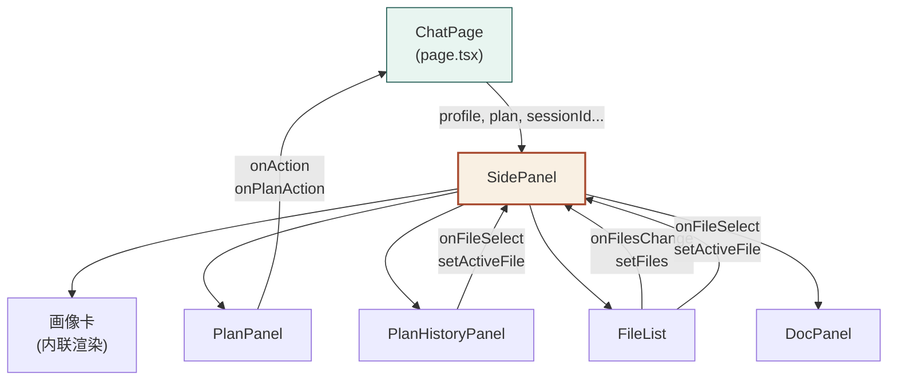
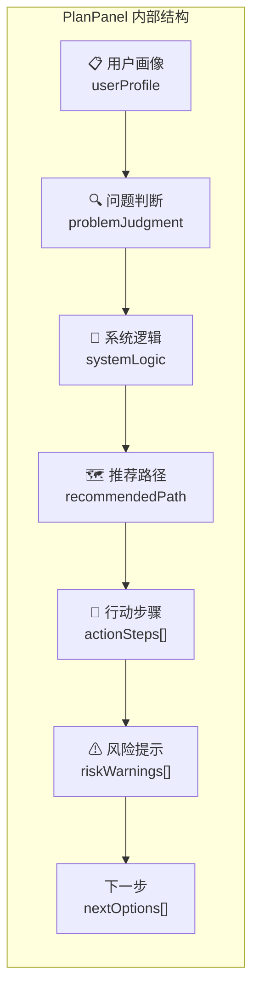
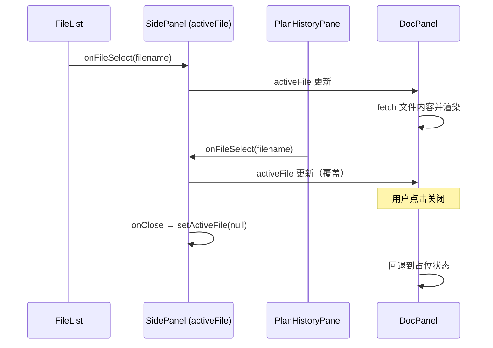

SidePanel 是科研课题分诊台右侧工作区的 **聚合容器组件**，在单页工作台的 CSS Grid 三区布局中占据右列。它本身不持有业务逻辑，而是通过条件渲染和 Props 传递，将 **用户画像卡、科研探索计划面板、Plan 历史对比、文件列表、文档预览** 五个子面板按纵向堆叠组织为一个连贯的信息工作区。用户在左侧 ChatPanel 完成的每一轮对话，其结构化产物（画像更新、Plan 生成、文件产出）都会实时反映到 SidePanel 的对应区域，形成「左对话、右产物」的双栏协同工作流。

Sources: [side-panel.tsx](Research-Triage/src/components/side-panel.tsx#L1-L128), [page.tsx](Research-Triage/src/app/page.tsx#L207-L215)

## 布局定位与响应式策略

SidePanel 的布局由父级 `.chat-layout` 的 CSS Grid 定义。桌面端采用 `grid-template-columns: minmax(0, 1fr) clamp(420px, 34vw, 560px)`，右侧列宽度在 420px 至 560px 之间弹性伸缩。SidePanel 容器本身设置 `overflow-y: auto` 和 `overscroll-behavior: contain`，使其内容在面板内独立滚动而不影响左侧对话区域。当视口宽度降至 900px 以下时，Grid 切换为单列布局（`grid-template-columns: 1fr`），SidePanel 被折叠到页面下方，以 `minmax(220px, 36vh)` 高度限制的横向面板形式呈现，同时移除左侧 `border-left` 并改用 `border-top` 分隔。这种断点设计保证了移动端的基本可用性。

Sources: [globals.css](Research-Triage/src/app/globals.css#L132-L139), [globals.css](Research-Triage/src/app/globals.css#L445-L453), [globals.css](Research-Triage/src/app/globals.css#L831-L850)

## Props 接口与数据流

SidePanel 的 Props 接口定义了它与父组件 `ChatPage` 之间的完整数据契约：

| Prop | 类型 | 用途 |
|------|------|------|
| `profile` | `UserProfileState \| null` | 用户画像状态，10 字段扁平结构 |
| `profileConfidence` | `Record<string, number>` | 每个画像字段的置信度（0~1） |
| `plan` | `PlanState \| null` | 当前科研探索计划 |
| `sessionId` | `string` | 会话 ID，用于文件 API 路由 |
| `fileRefresh` | `number` | 递增触发器，驱动 FileList 重新拉取 |
| `onPlanAction` | `(message: string) => void` | Plan 操作回调，桥接到 ChatInput 发送 |
| `disabled` | `boolean` | 禁用交互按钮（请求进行中） |

父组件 `ChatPage` 在每次 `/api/chat` 响应返回后，解析 `data.profile`、`data.profileConfidence`、`data.plan` 并通过 `useState` 更新，触发 SidePanel 重渲染。当 profile 或 plan 发生变化时，`fileRefresh` 计数器递增（`setFileRefresh(n => n + 1)`），通知 FileList 重新请求 userspace 文件清单。`onPlanAction` 直接指向 `handleSelect`，最终调用 `sendMessage` 将用户的 Plan 调整指令发送到后端。

Sources: [side-panel.tsx](Research-Triage/src/components/side-panel.tsx#L11-L19), [page.tsx](Research-Triage/src/app/page.tsx#L112-L127), [page.tsx](Research-Triage/src/app/page.tsx#L207-L215)

## 内部组件架构

SidePanel 内部管理两个本地状态：`activeFile`（当前选中的文件名）和 `files`（从 FileList 回传的文件清单数组），用于协调文件选择与预览之间的联动。下面是组件的静态结构关系：

**画像卡**（Profile Card）直接在 SidePanel 内联渲染，不抽取为独立组件。**PlanPanel**、**PlanHistoryPanel**、**FileList**、**DocPanel** 是独立组件文件，各自持有自己的 UI 逻辑与状态。

Sources: [side-panel.tsx](Research-Triage/src/components/side-panel.tsx#L50-L53), [side-panel.tsx](Research-Triage/src/components/side-panel.tsx#L54-L128)

## 用户画像卡：置信度驱动的可视化

画像卡根据 `UserProfileState` 的 10 个字段（`ageOrGeneration`、`educationLevel`、`toolAbility`、`aiFamiliarity`、`researchFamiliarity`、`interestArea`、`currentBlocker`、`deviceAvailable`、`timeAvailable`、`explanationPreference`）渲染为键值对列表。每个字段有一个对应的中文标签，通过 `labels` 映射表定义。渲染逻辑仅显示有值的字段（`if (!value) return null`），未填写的字段自动隐藏。

每个字段右侧附带一个 **置信度徽章**，由 `confidenceBadge()` 函数根据传入的置信度数值决定显示样式：

| 置信度范围 | 图标 | 标签 | CSS 类 | 含义 |
|-----------|------|------|--------|------|
| `≥ 1.0` | ● | 已确认 | `conf-confirmed` | 用户直接确认或系统 100% 确定 |
| `≥ 0.7` | ◉ | 推断中 | `conf-deduced` | 基于对话上下文高置信推断 |
| `≥ 0.3` | ○ | 猜测中 | `conf-inferred` | 初步推测，待后续对话验证 |
| `< 0.3` | — | 不显示 | — | 信息不足，不展示徽章 |

列表底部渲染图例行（`profile-legend`），用三种颜色分别标注三种置信度状态，帮助用户理解每个画像条目的可靠性。当画像尚无任何字段有值时，显示占位文案「对话几轮后，系统会在这里展示对你的理解」。

Sources: [side-panel.tsx](Research-Triage/src/components/side-panel.tsx#L21-L94), [globals.css](Research-Triage/src/app/globals.css#L463-L526), [triage-types.ts](Research-Triage/src/lib/triage-types.ts#L122-L133)

## PlanPanel：可折叠的科研探索计划面板

PlanPanel 是 SidePanel 中最复杂的子组件，负责渲染 `PlanState` 结构的完整内容。它采用 **Section 折叠模式**：6 个可折叠区块 + 1 个固定的「下一步」操作区，每个 Section 由内部的 `Section` 无状态组件封装，通过 `collapsed` Set 状态管理展开/折叠。

各区块的渲染策略如下：

| 区块 | 数据源 | 渲染方式 | 特殊交互 |
|------|--------|---------|---------|
| 用户画像 | `plan.userProfile` | Markdown → HTML | 无 |
| 问题判断 | `plan.problemJudgment` | Markdown → HTML | 无 |
| 系统逻辑 | `plan.systemLogic` | Markdown → HTML（muted 样式） | 无 |
| 推荐路径 | `plan.recommendedPath` | Markdown → HTML | 无 |
| 行动步骤 | `plan.actionSteps[]` | 有序列表 | 每步 4 个微调按钮 |
| 风险提示 | `plan.riskWarnings[]` | 无序列表 | 无 |
| 下一步 | `plan.nextOptions[]` | 按钮组 | 点击触发 `onPlanAction` |

**行动步骤微调机制**是 PlanPanel 的核心交互。每个步骤右侧渲染「更简单」「更专业」「拆开讲」「换方向」四个按钮，点击后通过 `sendStepAction()` 构造一条包含版本号、步骤序号和调整意图的结构化消息，经由 `onAction` → `onPlanAction` → `handleSelect` → `sendMessage` 发送至后端。同样，「下一步」区的按钮通过 `sendPlanAction()` 构造整 Plan 级别的调整指令。Header 区域显示当前版本号 `v{plan.version}`，若存在 `modifiedReason` 则以斜体灰色文字展示修改原因。

PlanPanel 在 SidePanel 中的显示遵循条件优先级：有 Plan → 渲染 PlanPanel；无 Plan 但有画像 → 显示「继续对话完成问题收敛后，系统将自动生成你的科研探索计划」的提示；两者皆无 → 不渲染任何内容。

Sources: [plan-panel.tsx](Research-Triage/src/components/plan-panel.tsx#L1-L163), [globals.css](Research-Triage/src/app/globals.css#L528-L627)

## PlanHistoryPanel：Plan 版本对比面板

当 userspace 中存在两个及以上 `type === "plan"` 的文件时，PlanHistoryPanel 自动出现，提供版本选择与差异摘要功能。它从 FileList 通过 `onFilesChange` 回传的 `files` 数组中过滤出所有 plan 类型文件，按 `version` 降序排列。

面板提供两个 `<select>` 下拉框，分别选择「左版」和「右版」，默认选中倒数第二新和最新版本。两个选中文件各自通过 `/api/userspace/{sessionId}/{filename}` 加载完整内容。核心函数 `firstChangedSection()` 逐个对比预定义的 7 个 Section（用户画像、问题判断、系统逻辑、推荐路径、步骤、风险、下一步选项），返回第一个发生变化的 Section 名称作为摘要显示。用户可点击「打开左版」「打开右版」按钮，触发 `onFileSelect` → `setActiveFile`，将选中版本在 DocPanel 中预览。

Sources: [plan-history-panel.tsx](Research-Triage/src/components/plan-history-panel.tsx#L1-L125)

## FileList：文件清单与刷新机制

FileList 是一个自管理的数据获取组件，负责从 `/api/userspace/{sessionId}` 端点拉取文件清单并渲染可点击列表。它的刷新由两种机制驱动：**初始挂载** 时自动执行 `loadFiles()`，以及父组件通过 `refreshTrigger` prop 递增时重新执行（`useEffect` 依赖 `[loadFiles, refreshTrigger]`）。

每种文件类型有对应的 Emoji 图标映射（`profile → 👤`、`plan → 📋`、`checklist → ✅`、`path → 🗺`、`summary → 📄`、`image → 🖼`、`code → 💻`），plan 类型文件额外显示版本号标签（`v{version}`），code 类型显示语言标签。文件为空时显示占位文案「AI 生成的文档将出现在这里」。点击文件项触发 `onFileSelect` 回调，将文件名传递到 SidePanel 的 `activeFile` 状态。

Sources: [file-list.tsx](Research-Triage/src/components/file-list.tsx#L1-L76), [globals.css](Research-Triage/src/app/globals.css#L687-L731)

## DocPanel：文档预览与操作

DocPanel 是 SidePanel 的终端展示组件，根据 `activeFile` 状态决定渲染模式。当 `activeFile` 为 `null` 时显示占位提示；当有值时，通过 `/api/userspace/{sessionId}/{filename}` 获取文件完整内容，支持两种渲染路径：

| 文件类型 | 渲染方式 | 样式 |
|---------|---------|------|
| `type === "code"` | `<pre><code>` 原文展示 | `.doc-code-block`，等宽字体 |
| 其他 | `marked.parse()` Markdown → HTML | `.doc-body`，富文本排版 |

Header 区域提供三种文件操作：「系统打开」（POST 请求 `?action=open`，调用服务端 `openFileWithSystemDefault`）、「打开」（新标签页打开 `?raw=1` 原始内容）、「下载」（`?raw=1` + `download` 属性触发浏览器下载），以及关闭按钮。DocPanel 容器设置了 `max-height: 400px` 和 `overflow-y: auto`，限制预览区域高度，长文档在面板内滚动。

Sources: [doc-panel.tsx](Research-Triage/src/components/doc-panel.tsx#L1-L135), [globals.css](Research-Triage/src/app/globals.css#L733-L829)

## 文件选择的状态联动模型

SidePanel 内部的 `activeFile` 状态是 FileList、PlanHistoryPanel 和 DocPanel 三者的协调枢纽。这个单向数据流确保同一时刻只有一个文件处于预览状态：

`files` 状态则由 FileList 通过 `onFilesChange` 回调上行传递给 SidePanel，再由 SidePanel 下行传递给 PlanHistoryPanel，形成「FileList 产生数据 → SidePanel 中转 → PlanHistoryPanel 消费」的数据管道。

Sources: [side-panel.tsx](Research-Triage/src/components/side-panel.tsx#L51-L52), [side-panel.tsx](Research-Triage/src/components/side-panel.tsx#L106-L125)

## 后端 API 依赖

SidePanel 的文件相关子组件依赖统一的 Userspace API 路由 `GET /api/userspace/{sessionId}[/{filename}]`。无文件名参数时返回文件清单（`{ files: FileManifest[] }`），带文件名时返回文件详情（包含 `filename`、`title`、`content`、`type`、`version`、`createdAt` 等字段）。`?raw=1` 查询参数将响应切换为原始文本（`text/markdown` 或 `text/plain`），用于浏览器直接打开或下载。POST 方法仅支持 `?action=open` 操作，调用服务端的系统默认应用打开文件。

Sources: [route.ts](Research-Triage/src/app/api/userspace/[sessionId]/[[...filename]]/route.ts#L1-L85)

## 延伸阅读

- **画像数据的来源与博弈式确立机制**：SidePanel 展示的 `profile` 和 `profileConfidence` 由后端 Chat Pipeline 生成，详见 [用户画像记忆系统：置信度驱动的博弈式画像确立机制](11-yong-hua-xiang-ji-yi-xi-tong-zhi-xin-du-qu-dong-de-bo-yi-shi-hua-xiang-que-li-ji-zhi)
- **PlanPanel 的版本管理与历史对比细节**：详见 [Plan 历史对比与版本切换面板](20-plan-li-shi-dui-bi-yu-ban-ben-qie-huan-mian-ban)
- **左侧对话区如何与 SidePanel 协同**：详见 [ChatPanel 与 ChoiceButtons：结构化选项驱动的对话交互](18-chatpanel-yu-choicebuttons-jie-gou-hua-xuan-xiang-qu-dong-de-dui-hua-jiao-hu)
- **文件持久化的后端实现**：详见 [Userspace 文件系统：会话产物持久化与版本管理](14-userspace-wen-jian-xi-tong-hui-hua-chan-wu-chi-jiu-hua-yu-ban-ben-guan-li)
- **整体三区布局与数据流**：详见 [整体架构：单页工作台三区布局与数据流](6-zheng-ti-jia-gou-dan-ye-gong-zuo-tai-san-qu-bu-ju-yu-shu-ju-liu)