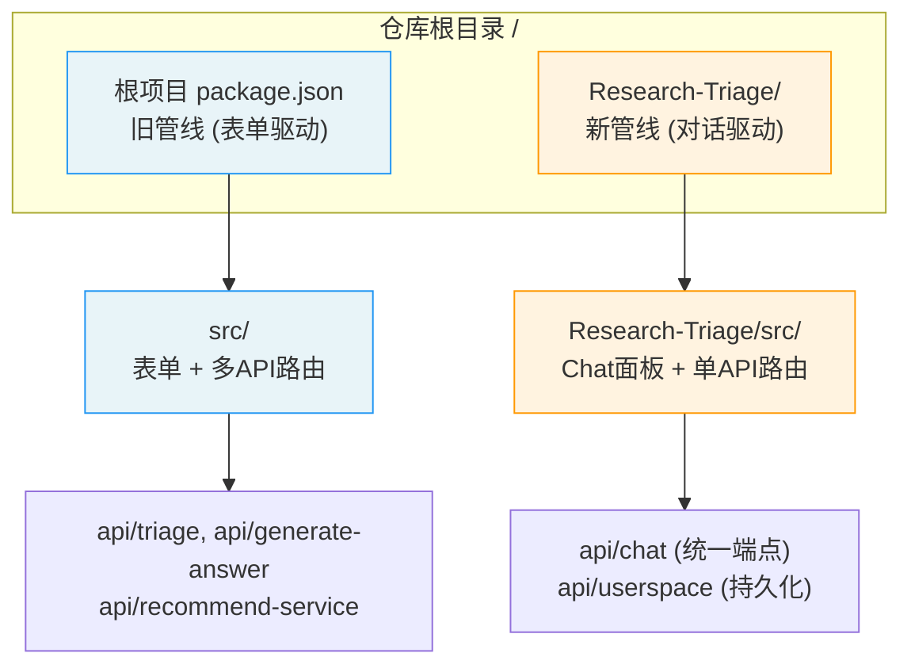
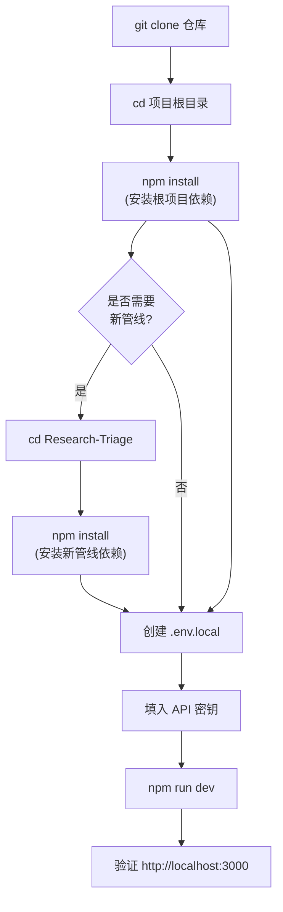
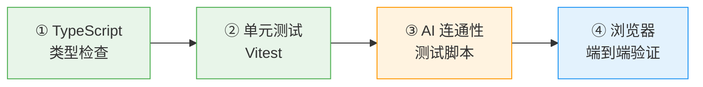

本文档的目标是帮助你从零开始，在本地把「科研课题分诊台」跑起来。内容覆盖：系统前置要求、两套子项目的依赖安装、环境变量配置、开发服务器启动、以及一组可执行的验证步骤。阅读本文后，你将获得一个在 `http://localhost:3000` 上响应的完整本地开发环境，并能够通过自动化测试和连通性脚本确认各层工作正常。

Sources: [README.md](README.md#L66-L93)

---

## 前置要求：系统与工具版本

项目基于 **Next.js App Router + TypeScript**，运行时依赖 Node.js 生态。以下是经过验证的最低版本要求：

| 工具 | 最低版本 | 用途 | 验证命令 |
|------|---------|------|---------|
| Node.js | 18.x+ | 运行时与构建环境 | `node -v` |
| npm | 9.x+ | 包管理器（项目使用 npm） | `npm -v` |
| Git | 2.x+ | 版本控制 | `git --version` |

> **版本说明**：项目根 `package.json` 中 Next.js 版本为 `^16.0.1`、React 为 `^19.2.0`、TypeScript 为 `^5.9.3`，这些是运行 `npm install` 后自动解析的版本，无需手动指定。

Sources: [package.json](package.json#L12-L18), [README.md](README.md#L68-L72)

---

## 项目结构：两套独立子项目

本仓库包含两套可独立运行的 Next.js 应用。它们共享相同的「科研课题分诊」产品定位，但处于不同的演进阶段：



| 维度 | 根项目（旧管线） | Research-Triage（新管线） |
|------|----------------|------------------------|
| **交互模式** | 表单填写 → 多页面跳转 | 对话面板 → 单页工作台 |
| **AI 调用方式** | `@ai-sdk/openai` + `ai` SDK 包装 | 裸 `fetch` 直调 OpenAI 兼容 API |
| **环境变量** | `DEEPSEEK_API_KEY`（主）/ `OPENAI_API_KEY`（备） | `AI_API_KEY`（主）/ `DEEPSEEK_API_KEY` / `OPENAI_API_KEY`（备） |
| **状态持久化** | `sessionStorage`（前端） | Userspace 文件系统（服务端磁盘） |
| **启动方式** | 根目录执行 `npm run dev` | 进入 `Research-Triage/` 后执行 `npm run dev` |

> **初学者建议**：先在根目录把旧管线跑通，理解表单驱动的分诊流程；再进入 `Research-Triage/` 体验对话驱动的新管线。两套项目互不干扰，各自拥有独立的 `node_modules`。

Sources: [package.json](package.json#L1-L27), [Research-Triage/package.json](Research-Triage/package.json#L1-L26), [src/lib/ai-provider.ts](src/lib/ai-provider.ts#L5-L6), [Research-Triage/src/lib/ai-provider.ts](Research-Triage/src/lib/ai-provider.ts#L19-L31)

---

## 安装步骤：从克隆到就绪

整个安装过程可以用以下流程图概括：



### 第一步：克隆仓库并安装根项目依赖

```bash
# 进入工作目录后克隆（如果你已有仓库则跳过）
git clone <仓库地址>
cd NanJingHackson

# 安装根项目（旧管线）依赖
npm install
```

根项目的核心依赖包括：`next`（框架）、`react` / `react-dom`（UI）、`@ai-sdk/openai` + `ai`（AI SDK）、`zod`（Schema 校验）。开发依赖则提供 TypeScript 编译器与 Vitest 测试框架。

Sources: [package.json](package.json#L12-L26)

### 第二步：安装 Research-Triage（新管线）依赖

```bash
# 进入新管线子目录
cd Research-Triage

# 安装依赖
npm install

# 回到根目录
cd ..
```

新管线的依赖略有不同：用 `marked`（Markdown 渲染）替代了 `@ai-sdk/openai` + `ai`（因为新管线使用裸 `fetch` 直调 API），其余框架依赖一致。

Sources: [Research-Triage/package.json](Research-Triage/package.json#L12-L25)

---

## 环境变量配置

项目通过 `.env.local` 文件读取 AI Provider 的连接信息。根项目和新管线的环境变量优先级略有不同，但核心都是提供 **API Base URL** 和 **API Key**。

### 根项目（旧管线）环境变量

在项目根目录创建 `.env.local`：

```bash
# .env.local（根项目）
DEEPSEEK_API_KEY=sk-xxxxxxxxxxxxxxxx
# 可选：自定义 API 地址（默认 https://api.deepseek.com/v1）
# DEEPSEEK_BASE_URL=https://api.deepseek.com/v1
```

根项目的 `ai-provider.ts` 按以下优先级查找密钥：`DEEPSEEK_API_KEY` → `OPENAI_API_KEY`，默认 Base URL 为 `https://api.deepseek.com/v1`。

Sources: [src/lib/ai-provider.ts](src/lib/ai-provider.ts#L5-L6)

### Research-Triage（新管线）环境变量

在 `Research-Triage/` 目录下创建 `.env.local`：

```bash
# .env.local（Research-Triage）
AI_API_KEY=sk-xxxxxxxxxxxxxxxx
# 可选：自定义配置
# AI_BASE_URL=https://api.deepseek.com/v1
# AI_MODEL=deepseek-v4-flash
```

新管线的 `ai-provider.ts` 支持更灵活的多 Provider 切换，按以下优先级查找：

| 变量 | 优先级 | 说明 |
|------|-------|------|
| `AI_API_KEY` | 最高（推荐） | 通用密钥，适配任何 OpenAI 兼容 API |
| `DEEPSEEK_API_KEY` | 次高 | DeepSeek 专用回退 |
| `OPENAI_API_KEY` | 最低 | OpenAI 专用回退 |
| `AI_BASE_URL` | 最高 | 自定义 API 地址 |
| `AI_MODEL` | 唯一 | 模型 ID，默认 `deepseek-v4-flash` |

> **关键提示**：`.env.local` 已被 `.gitignore` 排除，不会被提交到版本库。切勿将密钥写入 `.env`（无后缀）文件，因为部分 `.gitignore` 配置未排除该文件。

Sources: [Research-Triage/src/lib/ai-provider.ts](Research-Triage/src/lib/ai-provider.ts#L1-L31), [.gitignore](.gitignore#L28-L31), [Research-Triage/.gitignore](Research-Triage/.gitignore#L29-L33)

如果你需要更详细的环境变量说明（包括如何切换到其他 AI Provider），请参阅 [环境变量配置：AI Provider 密钥与模型选择](4-huan-jing-bian-liang-pei-zhi-ai-provider-mi-yao-yu-mo-xing-xuan-ze)。

---

## 启动开发服务器

### 根项目（旧管线）

```bash
# 确保在项目根目录
npm run dev
```

启动后终端将显示 Next.js 开发服务器信息，默认监听 **http://localhost:3000**。打开浏览器访问该地址，你将看到分诊台首页，包含「立即诊断课题」和「让 AI 引导我」两个入口。

### Research-Triage（新管线）

```bash
# 进入新管线目录
cd Research-Triage
npm run dev
```

同样监听 **http://localhost:3000**（如果你同时需要运行两套项目，可以给其中一个指定端口：`npm run dev -- -p 3001`）。新管线首页直接展示对话面板与侧边工作区。

### 可用的 npm scripts

两套项目的 scripts 完全一致：

| 命令 | 用途 | 说明 |
|------|------|------|
| `npm run dev` | 启动开发服务器 | 热更新，适合日常开发 |
| `npm run build` | 生产构建 | 输出优化后的产物到 `.next/` |
| `npm run start` | 启动生产服务器 | 需先执行 `npm run build` |
| `npm run typecheck` | TypeScript 类型检查 | 等效于 `tsc --noEmit` |
| `npm run test` | 运行测试套件 | 使用 Vitest 执行 |

Sources: [package.json](package.json#L5-L11), [README.md](README.md#L79-L93)

---

## 验证安装：四步检查清单

安装完成后，建议按以下顺序验证各层是否正常工作。每一步通过后再进入下一步。



### ① TypeScript 类型检查

```bash
npm run typecheck
```

无错误输出即表示类型系统完整。如果看到报错，通常是依赖安装不完整，尝试删除 `node_modules` 后重新 `npm install`。

### ② 运行单元测试

```bash
npm run test
```

根项目包含 `src/lib/triage.test.ts`，验证规则分诊引擎的分类逻辑（共 10+ 测试用例，覆盖用户分类、安全模式检测、难度评级等场景）。这些测试**不依赖 AI API**，纯本地执行，应全部通过。

Sources: [src/lib/triage.test.ts](src/lib/triage.test.ts#L1-L190)

### ③ AI 连通性测试

此步骤验证你的 API 密钥配置是否正确。详见 [验证与调试脚本：DeepSeek 连通性测试](5-yan-zheng-yu-diao-shi-jiao-ben-deepseek-lian-tong-xing-ce-shi)。

**根项目**提供了两个脚本：

```bash
# 方式一：TypeScript 版（需要环境变量，推荐用 --env-file 加载）
npx tsx --env-file=.env.local scripts/test-deepseek.ts

# 方式二：纯 Node.js 版
node -r dotenv/config scripts/test-deepseek-simple.js
```

成功输出示例：`✅ DeepSeek 连接成功！ 回复: 科研课题分诊是...`

**Research-Triage** 提供了更简洁的裸 `fetch` 版本：

```bash
cd Research-Triage
node --env-file=.env.local scripts/test-deepseek-simple.js
```

该脚本会依次尝试 `AI_API_KEY`、`DEEPSEEK_API_KEY`、`OPENAI_API_KEY` 三个环境变量，输出当前使用的 base URL、model 和连接结果。

Sources: [scripts/test-deepseek.ts](scripts/test-deepseek.ts#L1-L31), [scripts/test-deepseek-simple.js](scripts/test-deepseek-simple.js#L1-L28), [Research-Triage/scripts/test-deepseek-simple.js](Research-Triage/scripts/test-deepseek-simple.js#L1-L48)

### ④ 浏览器端到端验证

启动开发服务器后，按以下路径逐一验证：

| 路径 | 预期行为 | 所属管线 |
|------|---------|---------|
| `http://localhost:3000` | 首页展示「科研课题分诊台」标题与两个入口按钮 | 旧管线 |
| `http://localhost:3000/intake` | 显示分诊信息录入表单 | 旧管线 |
| `http://localhost:3000` | 直接展示 Chat 对话面板与右侧工作区 | 新管线 |

对于旧管线，在 `/intake` 页面填写表单并提交后，应跳转到 `/result` 页面展示分诊结果。如果 AI 调用失败，页面仍会显示基于规则的本地分诊结果（由 `triage.ts` 生成），这意味着即使没有配置 API 密钥，旧管线的基础分诊流程也能工作。

Sources: [src/app/page.tsx](src/app/page.tsx#L1-L49), [src/lib/triage.ts](src/lib/triage.ts#L30-L65)

---

## 常见问题排查

| 问题 | 可能原因 | 解决方案 |
|------|---------|---------|
| `npm install` 报错 `ERESOLVE` | npm 版本过低或依赖冲突 | 升级 npm 至 9+，或执行 `npm install --legacy-peer-deps` |
| `npm run dev` 端口被占用 | 另一个 Next.js 实例正在运行 | 执行 `lsof -ti:3000` 查找进程，或使用 `npm run dev -- -p 3001` |
| AI 连通性测试返回 `401` | API 密钥无效或未配置 | 检查 `.env.local` 中密钥是否正确，确认文件在正确目录下 |
| AI 连通性测试返回 `API returned empty content` | 模型 ID 不正确 | 检查 `AI_MODEL` 或 `DEFAULT_MODEL` 是否与你的 Provider 支持的模型匹配 |
| `npm run typecheck` 报类型错误 | `next-env.d.ts` 未生成 | 先执行一次 `npm run dev`，Next.js 会自动生成该文件 |
| 新管线 Chat 无响应 | `.env.local` 中缺少 `AI_API_KEY` | 新管线会在缺少密钥时抛出明确错误，检查终端日志中的 `[chat]` 前缀输出 |

> **调试技巧**：新管线在每次 AI 调用时都会打印结构化日志（以 `[chat]` 和 `[api/chat]` 为前缀），包含模型名、消息数、延迟等信息。遇到问题时优先查看终端输出。

Sources: [Research-Triage/src/lib/ai-provider.ts](Research-Triage/src/lib/ai-provider.ts#L53-L57), [Research-Triage/src/app/api/chat/route.ts](Research-Triage/src/app/api/chat/route.ts#L56-L66)

---

## 下一步阅读

环境搭建完成后，建议按以下顺序深入理解项目：

1. **[项目结构总览：根目录旧管线与 Research-Triage 演进关系](3-xiang-mu-jie-gou-zong-lan-gen-mu-lu-jiu-guan-xian-yu-research-triage-yan-jin-guan-xi)** — 理解两套管线的目录布局与演进逻辑
2. **[环境变量配置：AI Provider 密钥与模型选择](4-huan-jing-bian-liang-pei-zhi-ai-provider-mi-yao-yu-mo-xing-xuan-ze)** — 深入了解多 Provider 适配与环境变量优先级
3. **[整体架构：单页工作台三区布局与数据流](6-zheng-ti-jia-gou-dan-ye-gong-zuo-tai-san-qu-bu-ju-yu-shu-ju-liu)** — 从宏观视角理解新管线的架构设计