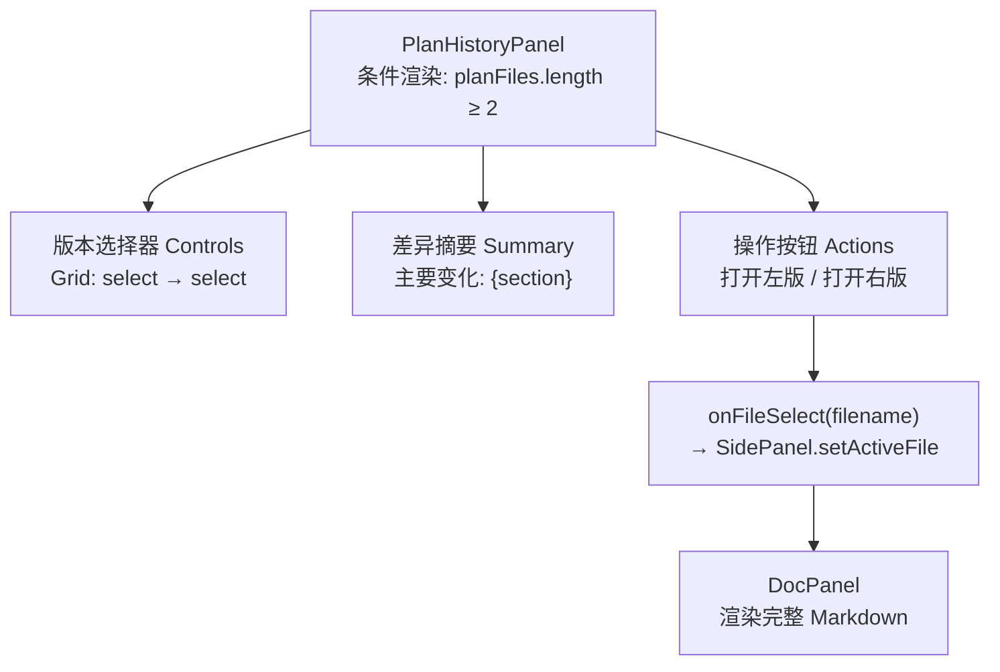

`PlanHistoryPanel` 是右侧工作区中负责 **Plan 多版本可视化对比与快速切换** 的独立面板。它从 Userspace 文件系统的 manifest 中筛选所有 `type === "plan"` 的文件条目，允许用户选择任意两个版本进行差异定位，并通过 DocPanel 打开完整文档。该面板仅在系统中存在 **两份及以上** Plan 文件时才会渲染——单一版本的历史对比没有意义，组件直接返回 `null`。

Sources: [plan-history-panel.tsx](src/components/plan-history-panel.tsx#L84-L86), [side-panel.tsx](src/components/side-panel.tsx#L106-L110)

## 数据来源：从 manifest 筛选到版本排序

面板的输入是 `FileManifest[]`，由父组件 `SidePanel` 从 `FileList` 的 `onFilesChange` 回调获得。`PlanHistoryPanel` 内部通过 `useMemo` 对这些文件条目做两步处理：首先过滤出 `type === "plan"` 的条目，然后按 `version` **降序排列**——最新的版本排在最前面，作为下拉选择的默认值。

```typescript
const planFiles = useMemo(
  () => files
    .filter((f) => f.type === "plan")
    .sort((a, b) => b.version - a.version),
  [files],
);
```

每个 Plan 文件在 Userspace 中的命名规则为 `plan-v{version}.md`，由后端 `savePlan()` 函数在每次 AI 生成或更新 Plan 时写入磁盘。版本号 `version` 的递增逻辑位于 `/api/chat` 路由中：`const version = (session.plan?.version ?? 0) + 1`，即每次成功提取到新 Plan 后版本号自动 +1，旧版本文件**不会被覆盖**而是作为历史快照保留。

Sources: [plan-history-panel.tsx](src/components/plan-history-panel.tsx#L36-L41), [userspace.ts](src/lib/userspace.ts#L170-L186), [route.ts](src/app/api/chat/route.ts#L278-L280)

## 双版本选择器与默认值策略

面板暴露两个独立的 `<select>` 下拉框，分别对应 **左版（left）** 和 **右版（right）** 的文件选择。两者的默认值通过 `useEffect` 在 `planFiles` 变化时初始化：

- **右版**默认选中 `planFiles[0]`，即版本号最大的最新 Plan
- **左版**默认选中 `planFiles[1]`（次新版本），若不存在则回退到 `planFiles[0]`

这个设计确保用户首次看到面板时，呈现的是「**次新 → 最新**」的版本对比方向，与 `→` 箭头的语义（从旧到新）一致。选择器的值以 `filename` 为标识，每个 `<option>` 显示的是 `v{version}` 的简短标签。

Sources: [plan-history-panel.tsx](src/components/plan-history-panel.tsx#L43-L56), [plan-history-panel.tsx](src/components/plan-history-panel.tsx#L93-L109)

## 异步文档加载与竞态保护

选中版本后，组件通过 `useEffect` 并行发起两个 `fetch` 请求，从 `/api/userspace/{sessionId}/{filename}` 端点获取完整的 Plan 文档内容。API 返回的 JSON 结构包含 `filename`、`title`、`content`、`version` 等字段，组件将其映射为内部 `PlanDoc` 类型。

加载逻辑采用 **`cancelled` 标志位** 的竞态保护模式：`useEffect` 的清理函数将 `cancelled` 置为 `true`，确保在 `leftName` 或 `rightName` 快速切换时，过时的异步响应不会覆盖当前状态。这是 React 异步数据获取的经典模式，避免了在 Strict Mode 或快速用户操作下的状态混乱。

```typescript
useEffect(() => {
  let cancelled = false;
  async function load(filename: string, setter: (doc: PlanDoc | null) => void) {
    // ... fetch logic ...
    if (!cancelled) setter(data);
  }
  load(leftName, setLeftDoc);
  load(rightName, setRightDoc);
  return () => { cancelled = true; };
}, [leftName, rightName, sessionId]);
```

Sources: [plan-history-panel.tsx](src/components/plan-history-panel.tsx#L58-L82), [route.ts](src/app/api/userspace/[sessionId]/[[...filename]]/route.ts#L42-L50)

## 章节级差异检测：firstChangedSection

面板的核心差异分析逻辑不是逐行 diff，而是 **章节级比较**。`firstChangedSection()` 函数按照预定义的七个章节顺序逐一对比两个版本的 Markdown 内容：

| 对比顺序 | 章节名称 | Plan 文档中的 Markdown 标题 |
|:---:|:---|:---|
| 1 | 用户画像 | `## 用户画像` |
| 2 | 问题判断 | `## 问题判断` |
| 3 | 系统逻辑 | `## 系统逻辑` |
| 4 | 推荐路径 | `## 推荐路径` |
| 5 | 步骤 | `## 步骤` |
| 6 | 风险 | `## 风险` |
| 7 | 下一步选项 | `## 下一步选项` |

`extractSection()` 辅助函数使用正则 `## {title}\n+([\s\S]*?)(?=\n## |$)` 提取两个 `## ` 标题之间的内容，然后做字符串严格相等比较。函数返回**第一个**内容不同的章节名称；如果所有章节完全一致则返回 `"内容"`；如果任一文档尚未加载完成则返回空字符串。

这个设计有意选择了「**最先变化**」而非「**所有变化**」的展示策略——在摘要区只显示一句 `主要变化：{sectionName}`，引导用户关注最显著的改动点，避免信息过载。

Sources: [plan-history-panel.tsx](src/components/plan-history-panel.tsx#L19-L33), [plan-history-panel.tsx](src/components/plan-history-panel.tsx#L88), [chat-pipeline.ts](src/lib/chat-pipeline.ts#L399-L422)

## 面板 UI 布局与交互流

面板的 DOM 结构分为四个层次，每个层次承担明确的交互职责：



**版本选择器**采用 CSS Grid 三列布局（`1fr auto 1fr`），两个 `<select>` 各占一列，中间放置 `→` 箭头符号。**差异摘要**使用 `accent-soft` 背景色和 `muted` 前景色，字号 `0.82rem`，以轻量的提示框形式呈现。**操作按钮**各占 `flex: 1` 的等宽空间，hover 时背景切换为 `accent-soft`、文字变为 `accent` 色，提供视觉反馈。

点击「打开左版」或「打开右版」按钮时，组件调用 `onFileSelect(filename)` 回调，该回调在 `SidePanel` 中被绑定为 `setActiveFile`，进而触发 `DocPanel` 加载并渲染该版本的完整 Markdown 内容。这意味着 Plan 历史面板与 [文档预览系统](21-qian-duan-hui-hua-chi-jiu-hua-sessionstorage-zhuang-tai-hui-fu-yu-kuai-zhao-ji-zhi) 之间通过 **文件名** 这一松耦合的字符串标识实现联动。

Sources: [plan-history-panel.tsx](src/components/plan-history-panel.tsx#L90-L124), [globals.css](src/app/globals.css#L659-L715), [side-panel.tsx](src/components/side-panel.tsx#L106-L125)

## 组件集成关系：在 SidePanel 中的位置

`PlanHistoryPanel` 在 `SidePanel` 的渲染顺序中位于 **PlanPanel 之后、FileList 之前**。它不依赖 `PlanState` prop（当前活跃的 Plan），而是独立地从 `files` manifest 中筛选历史版本。这使得面板在以下场景下也能正常工作：

- 当前会话的 `plan` prop 为 `null`（如会话恢复后尚未进入 planning 阶段），但磁盘上已存在多个 Plan 文件
- 用户正在 reviewing 阶段修改 Plan，产生了 v2、v3 等多个版本

`FileList` 组件通过 `onFilesChange` 回调将完整的 manifest 传递给 `SidePanel`，`SidePanel` 再将同一份 `files` 数组传给 `PlanHistoryPanel`。这种 **单向数据流** 设计确保了 manifest 的一致性——文件列表和历史面板始终基于相同的数据源。

Sources: [side-panel.tsx](src/components/side-panel.tsx#L96-L118), [file-list.tsx](src/components/file-list.tsx#L36-L37)

## Plan 文档的 Markdown 结构与章节映射

`planToMarkdown()` 函数生成的 Plan 文档严格遵循七段式结构，每个章节以 `## ` 二级标题开头。`extractSection()` 的正则匹配正是基于此结构设计的——它捕获 `## {title}` 到下一个 `## ` 之间的所有内容（`[\s\S]*?` 非贪婪匹配），最终以 `|$` 处理最后一个章节（其后没有 `## ` 标记）。

| PlanState 字段 | Markdown 章节 | 对比优先级 |
|:---|:---|:---:|
| `userProfile` | `## 用户画像` | 1 |
| `problemJudgment` | `## 问题判断` | 2 |
| `systemLogic` | `## 系统逻辑` | 3 |
| `recommendedPath` | `## 推荐路径` | 4 |
| `actionSteps` | `## 步骤` | 5 |
| `riskWarnings` | `## 风险` | 6 |
| `nextOptions` | `## 下一步选项` | 7 |

章节标题中的特殊字符（如正则元字符）通过 `escaped = title.replace(/[.*+?^${}()|[\]\\]/g, "\\$&")` 进行转义，确保正则匹配的鲁棒性。由于当前七个章节标题均不包含特殊字符，这层防护属于防御性编程，为未来可能的标题变更预留了安全余量。

Sources: [plan-history-panel.tsx](src/components/plan-history-panel.tsx#L19-L23), [chat-pipeline.ts](src/lib/chat-pipeline.ts#L399-L422)

## 设计边界与当前局限

当前实现有几个明确的设计边界值得注意。**第一**，差异检测是章节级而非行级或字级——如果同一章节内只有一行文本发生变化，面板仍只会报告该章节名称（如「主要变化：步骤」），不会指出具体哪一步改动了。**第二**，左版和右版的选择完全自由，用户可以选择同一版本作为左右对比，此时摘要区将显示「主要变化：内容」（所有章节一致时的默认值）。**第三**，面板不具备「回滚到某版本」的能力——「打开左版/右版」按钮仅将对应文件送入 DocPanel 预览，不会修改当前会话的活跃 Plan 状态。

这些局限是有意的 MVP 范围控制：面板的定位是**查看与对比**，而非版本管理系统。真正的版本切换（如回滚到旧版 Plan）需要通过对话区的消息触发 AI 重新生成，参见 [Chat Pipeline：AI JSON 输出解析、Plan 归一化与产物生成](12-chat-pipeline-ai-json-shu-chu-jie-xi-plan-gui-yi-hua-yu-chan-wu-sheng-cheng)。

Sources: [plan-history-panel.tsx](src/components/plan-history-panel.tsx#L25-L33), [plan-history-panel.tsx](src/components/plan-history-panel.tsx#L115-L122)

## 延伸阅读

- [SidePanel：画像展示、Plan 面板与文件预览的右侧工作区](19-sidepanel-hua-xiang-zhan-shi-plan-mian-ban-yu-wen-jian-yu-lan-de-you-ce-gong-zuo-qu) — 了解 PlanHistoryPanel 在右侧工作区中的整体布局上下文
- [Userspace 文件系统：会话产物持久化与版本管理](14-userspace-wen-jian-xi-tong-hui-hua-chan-wu-chi-jiu-hua-yu-ban-ben-guan-li) — 深入了解 `savePlan()`、`manifest.json` 与文件存储机制
- [Chat Pipeline：AI JSON 输出解析、Plan 归一化与产物生成](12-chat-pipeline-ai-json-shu-chu-jie-xi-plan-gui-yi-hua-yu-chan-wu-sheng-cheng) — 了解 Plan 版本递增与 `planToMarkdown()` 的完整生成管线
- [核心类型定义 triage-types.ts](22-he-xin-lei-xing-ding-yi-triage-types-ts-biao-dan-mei-ju-hua-xiang-zhuang-tai-plan-jie-gou-yu-api-xiang-ying) — 查看 `PlanState`、`FileManifest` 等核心类型定义