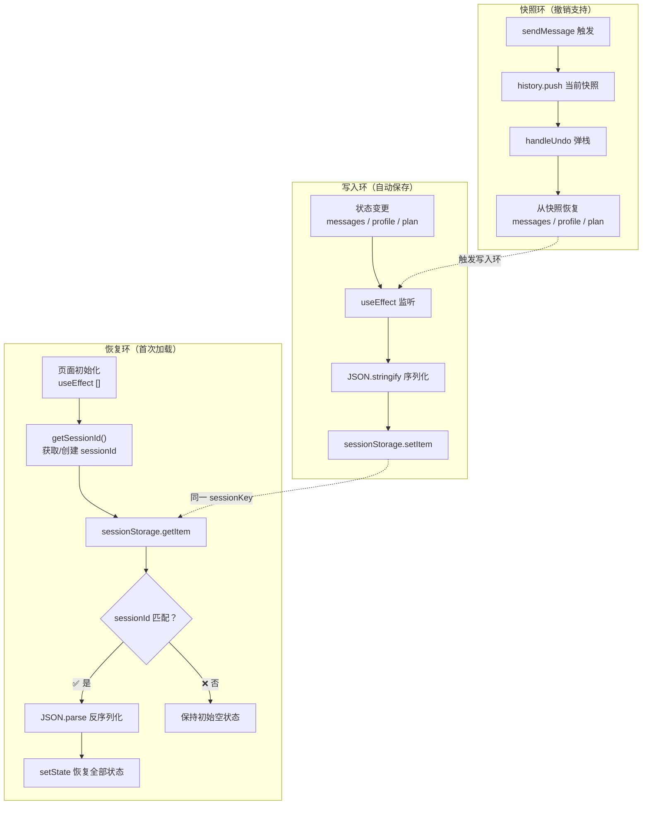
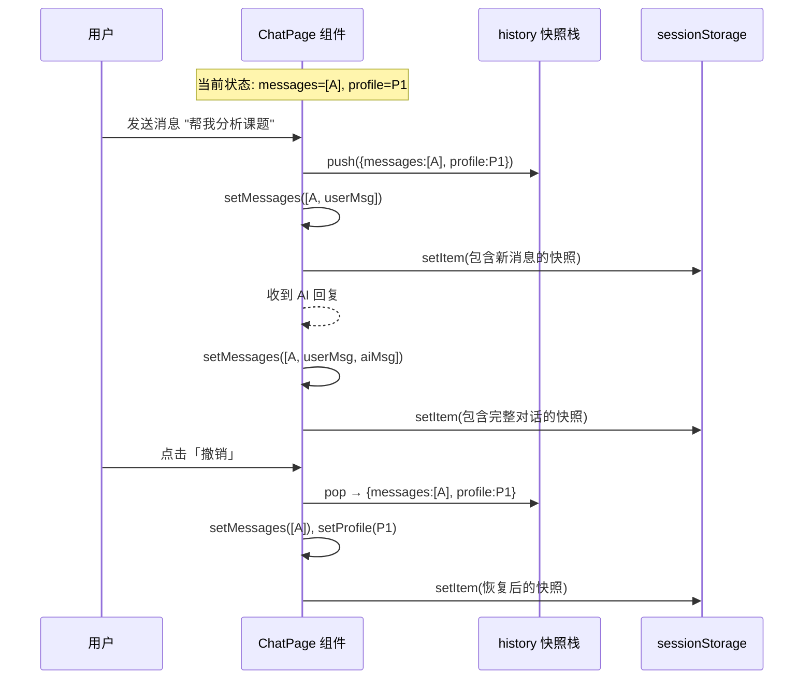
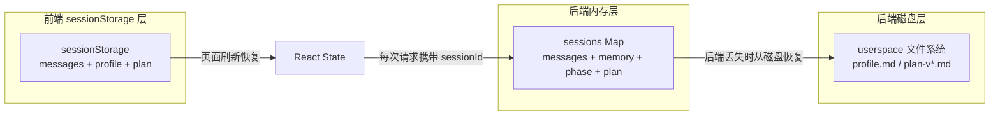

本文深入解析「人人都能做科研」分诊台前端的会话持久化方案——基于 **sessionStorage** 的状态快照保存、页面刷新恢复与撤销重做机制。你将理解数据在浏览器中如何被序列化写入、在组件初始化时如何被安全恢复、以及快照栈如何支撑「撤销上一轮对话」的交互体验。

Sources: [page.tsx](src/app/page.tsx#L1-L219)

---

## 为什么选择 sessionStorage

在讨论具体实现之前，先理解为什么这个项目选择了 `sessionStorage` 而非其他持久化方案。以下表格对比了三种常见的浏览器端存储策略：

| 存储方式 | 生命周期 | 容量限制 | 跨标签页 | 适用场景 |
|---------|---------|---------|---------|---------|
| **sessionStorage** | 标签页关闭即清除 | ~5MB | ❌ 不共享 | 单次会话、临时状态 |
| localStorage | 永久（需手动清除） | ~5MB | ✅ 同源共享 | 用户偏好、长期配置 |
| IndexedDB | 永久 | 数百 MB+ | ✅ 同源共享 | 大量结构化数据 |

对于分诊台这种**单次对话窗口**场景，`sessionStorage` 恰好满足需求：用户刷新页面时能恢复对话上下文，关闭标签页后数据自动清理、不会泄露到下一次访问。同时，分诊台的序列化数据量（对话消息 + 用户画像 + Plan）远未触及 5MB 上限，性能无虞。

Sources: [page.tsx](src/app/page.tsx#L9-L27)

---

## 整体架构：写入—恢复—快照三环模型

分诊台的持久化体系可以概括为三个核心环节，以下 Mermaid 图展示了它们之间的协作关系：



三个环节形成一个闭环：**写入环**在每次状态变更后自动持久化；**恢复环**在页面首次加载时从 `sessionStorage` 中读回数据；**快照环**在每次发送新消息前保存一份历史副本，支撑撤销操作。下文逐一展开每个环节的实现细节。

Sources: [page.tsx](src/app/page.tsx#L9-L67)

---

## Session ID：会话身份的唯一标识

整个持久化机制的核心锚点是 **sessionId**——一个由 `crypto.randomUUID()` 生成的 UUID 字符串。它在系统中扮演两个关键角色：

1. **前端持久化的匹配令牌**：恢复快照时，只有当快照中的 `sessionId` 与当前标签页的 `sessionId` 一致，才会执行恢复。这防止了跨标签页的数据串扰。
2. **后端会话的关联键**：每次 `/api/chat` 请求都会携带 `sessionId`，后端用它从内存 `Map` 或磁盘 userspace 中找回对应的对话状态。

`getSessionId()` 函数的实现逻辑非常简洁：

```
getSessionId()
├── SSR 环境？→ 返回临时 UUID（不写入存储）
├── sessionStorage 中已有？→ 直接返回
└── 没有？→ 生成新 UUID → 写入 sessionStorage → 返回
```

值得注意的是第 21 行的 `typeof window === "undefined"` 检查——这是 Next.js **SSR/SSG 水合安全**的经典守卫。在服务端渲染时 `sessionStorage` 不存在，必须跳过存储操作，避免运行时报错。

Sources: [page.tsx](src/app/page.tsx#L20-L27), [route.ts](src/app/api/chat/route.ts#L38-L46)

---

## SavedSession 类型：被序列化的状态快照

`SavedSession` 类型定义了写入 `sessionStorage` 的完整数据结构：

| 字段 | 类型 | 含义 |
|------|------|------|
| `messages` | `ChatMessage[]` | 全部对话消息（用户 + 助手） |
| `profile` | `UserProfileState \| null` | 用户画像（10 个维度） |
| `profileConfidence` | `Record<string, number>` | 每个画像字段的置信度（0~1） |
| `plan` | `PlanState \| null` | 当前 Plan 状态（步骤、风险、版本等） |
| `sessionId` | `string` | 会话唯一标识，用于恢复校验 |

这个结构覆盖了分诊台工作台的**全部核心状态**。换言之，只要能成功恢复这五个字段，页面就能完整还原到刷新前的精确状态——包括对话历史、右侧面板的画像卡片、Plan 面板的步骤列表，全部一模一样。

Sources: [page.tsx](src/app/page.tsx#L12-L18), [triage-types.ts](src/lib/triage-types.ts#L113-L148)

---

## 恢复环：从 sessionStorage 安全读取状态

恢复发生在组件首次挂载时，通过一个空依赖数组的 `useEffect` 实现：

```typescript
useEffect(() => {
  const id = getSessionId();          // ① 获取 sessionId
  setSessionId(id);                   // ② 写入 React state

  const raw = sessionStorage.getItem(SESSION_KEY);  // ③ 读取序列化数据
  if (raw) {
    try {
      const saved = JSON.parse(raw) as SavedSession;
      if (saved.sessionId === id) {   // ④ 校验 sessionId 一致性
        setMessages(saved.messages);           // ⑤ 恢复对话
        setProfile(saved.profile);             // ⑥ 恢复画像
        setProfileConfidence(saved.profileConfidence ?? {});  // ⑦ 恢复置信度
        setPlan(saved.plan ?? null);           // ⑧ 恢复 Plan
      }
    } catch { /* ignore */ }          // ⑨ 静默吞掉解析错误
  }
}, []);
```

这个恢复流程有几个精巧的设计细节值得初学者注意：

**第 ④ 步的 sessionId 校验**是一个防御性编程的经典案例。假设用户在标签页 A 进行了对话，然后在标签页 B 打开同一页面——标签页 B 的 `sessionStorage` 是空的，不会产生冲突。但如果浏览器在某些边缘情况下复用了 `sessionStorage`，校验能确保只有匹配的会话数据才会被恢复。

**第 ⑨ 步的静默 catch** 看似忽略了错误，但实际上是合理的：如果 `sessionStorage` 中的数据因浏览器存储满了、编码异常等原因损坏，最安全的策略是从空状态开始，而非向用户暴露技术错误。

**`profileConfidence ?? {}` 和 `plan ?? null`** 使用了空值合并运算符，确保旧版本快照（可能缺少这些字段）也能被安全恢复，体现了**向前兼容**的考虑。

Sources: [page.tsx](src/app/page.tsx#L42-L58)

---

## 写入环：响应式自动保存

写入环的核心是一个监听五个依赖项的 `useEffect`：

```typescript
useEffect(() => {
  if (!sessionId) return;   // 守卫：首帧尚未拿到 sessionId 时跳过
  sessionStorage.setItem(
    SESSION_KEY,
    JSON.stringify({ messages, profile, profileConfidence, plan, sessionId }),
  );
}, [messages, profile, profileConfidence, plan, sessionId]);
```

这意味着**任何一个状态字段的变更都会触发自动保存**。结合分诊台的交互流程，保存时机分布如下：

| 用户操作 | 触发的状态变更 | 保存时机 |
|---------|--------------|---------|
| 发送消息 | `messages` 增加 userMsg | 立即 |
| 收到 AI 回复 | `messages` 增加 assistantMsg + 可能更新 `profile`/`plan` | 立即（可能连续触发 2-3 次） |
| 选择结构化选项 | 同「发送消息」 | 立即 |
| 撤销操作 | `messages`/`profile`/`plan` 回退到快照值 | 立即 |

第 62 行的 `if (!sessionId) return` 守卫至关重要。组件初始化时，React 会先用默认值（`sessionId = ""`）渲染一次，此时如果执行写入，会将一个空快照覆盖掉 `sessionStorage` 中已有的有效数据。这个守卫确保只有在 `getSessionId()` 完成并设置了 `sessionId` 之后，写入操作才会生效——**先恢复，再写入**。

Sources: [page.tsx](src/app/page.tsx#L61-L67)

---

## 快照环：撤销操作的实现原理

分诊台提供了一个「撤销」按钮，允许用户回退到上一轮对话前的状态。这通过一个**快照栈**（history 数组）实现。

### 快照的保存时机

每次调用 `sendMessage` 发送新消息时，在消息实际发送之前，系统会先保存一份当前状态的浅拷贝：

```typescript
setHistory((prev) => [
  ...prev,
  { messages: [...messages], profile, profileConfidence, plan }
]);
```

注意 `[...messages]` 创建了消息数组的浅拷贝，而 `profile`、`profileConfidence`、`plan` 直接引用当前值——因为它们在下一步会被全新的对象替换（来自 AI 响应），所以不担心引用污染。

### 撤销的执行逻辑

```typescript
const handleUndo = useCallback(() => {
  setHistory((prev) => {
    if (prev.length === 0) return prev;      // 栈空则不操作
    const restored = prev[prev.length - 1];  // 取栈顶快照
    setMessages(restored.messages);           // 恢复对话
    setProfile(restored.profile);             // 恢复画像
    setProfileConfidence(restored.profileConfidence ?? {});  // 恢复置信度
    setPlan(restored.plan);                   // 恢复 Plan
    return prev.slice(0, -1);                 // 弹栈
  });
}, []);
```

撤销操作将所有核心状态回退到快照值，而快照栈本身通过 `prev.slice(0, -1)` 弹出栈顶。由于状态变更会触发写入环，`sessionStorage` 中的数据也会同步更新为撤销后的状态——实现了**持久化与撤销的一致性**。

### 快照与 sessionStorage 的关系

下面的时序图展示了快照栈和 sessionStorage 在一轮完整「发送→撤销」流程中的协作：



Sources: [page.tsx](src/app/page.tsx#L73-L74), [page.tsx](src/app/page.tsx#L165-L175)

---

## 重置：彻底清除会话数据

「新对话」按钮触发 `handleReset`，它会执行一次彻底的数据清除：

```typescript
const handleReset = useCallback(() => {
  sessionStorage.removeItem(SESSION_KEY);      // 清除快照数据
  sessionStorage.removeItem(SESSION_ID_KEY);    // 清除 sessionId
  setMessages([]);                              // 重置对话
  setProfile(null);                             // 重置画像
  setProfileConfidence({});                     // 重置置信度
  setPlan(null);                                // 重置 Plan
  setHistory([]);                               // 清空快照栈
  setSessionId("");                             // 临时清空
  setTimeout(() => {                            // 下一帧生成新 sessionId
    const id = crypto.randomUUID();
    sessionStorage.setItem(SESSION_ID_KEY, id);
    setSessionId(id);
  }, 0);
}, []);
```

这里的 `setTimeout(..., 0)` 是一个微妙但重要的设计。如果直接在同步代码中先 `setSessionId("")` 再 `setSessionId(newId)`，React 的批量更新机制可能会合并这两次调用，导致写入环的守卫 `if (!sessionId) return` 在空串和新 ID 之间产生竞态。通过将新 ID 的生成推迟到下一个事件循环，确保了：

1. 当前渲染周期内 `sessionId` 为空 → 写入环守卫拦截，不会用空数据覆盖
2. 下一帧 `sessionId` 被设置为新值 → 写入环开始正常工作，保存干净的初始状态

Sources: [page.tsx](src/app/page.tsx#L149-L163)

---

## 前后端协同：双层的会话恢复

分诊台的会话恢复是**前后端双层**的。本文主要讲解前端 `sessionStorage` 层，但理解它与后端的协作关系同样重要：



**前端层**（本文主题）：解决**页面刷新**问题。用户按 F5 或意外刷新页面时，前端从 `sessionStorage` 中恢复对话消息、画像和 Plan，UI 立即还原。

**后端层**：解决**服务重启**问题。后端的 `sessions` Map 存储在进程内存中，服务重启后丢失。后端会从磁盘 userspace 中读取 `profile.md` 和 `plan-v*.md` 来重建会话状态。前端不需要关心这一层——只要请求携带正确的 `sessionId`，后端会自动处理。

**关键差异**：前端 `sessionStorage` 保存的是**面向展示的状态**（`ChatMessage[]`、`UserProfileState`、`PlanState`），而后端磁盘保存的是**面向推理的数据**（`UserProfileMemory`，包含置信度和来源标签）。两者数据格式不同，但通过 API 响应桥接。

Sources: [page.tsx](src/app/page.tsx#L84-L89), [route.ts](src/app/api/chat/route.ts#L83-L155)

---

## 设计决策总结与权衡

| 设计决策 | 收益 | 代价/局限 |
|---------|------|----------|
| 使用 sessionStorage 而非 localStorage | 标签页关闭自动清理，无隐私残留 | 跨标签页无法共享会话 |
| 全量 JSON 序列化而非增量 Diff | 实现简单，恢复逻辑直接 | 数据量大时可能有性能开销（本项目规模可忽略） |
| 快照栈仅保存一轮 | 内存占用恒定，逻辑清晰 | 不支持多步撤销（只能撤销最近一轮） |
| sessionId 校验 | 防止跨标签页数据串扰 | 极端情况下可能阻止合法恢复 |
| setTimeout 生成新 sessionId | 避免重置时的写入竞态 | 有一帧的 sessionId 为空（用户无感知） |

Sources: [page.tsx](src/app/page.tsx#L9-L219)

---

## 延伸阅读

- 如果你想了解后端如何用内存 Map 和磁盘文件管理会话状态，请阅读 [/api/chat 核心端点：请求编排、会话恢复与阶段推进](9-api-chat-he-xin-duan-dian-qing-qiu-bian-pai-hui-hua-hui-fu-yu-jie-duan-tui-jin)。
- 如果你想了解持久化数据中 `UserProfileState` 和 `PlanState` 的完整字段定义，请阅读 [核心类型定义 triage-types.ts：表单枚举、画像状态、Plan 结构与 API 响应](22-he-xin-lei-xing-ding-yi-triage-types-ts-biao-dan-mei-ju-hua-xiang-zhuang-tai-plan-jie-gou-yu-api-xiang-ying)。
- 如果你想了解磁盘层的文件持久化机制，请阅读 [Userspace 文件系统：会话产物持久化与版本管理](14-userspace-wen-jian-xi-tong-hui-hua-chan-wu-chi-jiu-hua-yu-ban-ben-guan-li)。
- 如果你想了解恢复后的状态如何驱动 SidePanel 的画像展示和 Plan 面板渲染，请阅读 [SidePanel：画像展示、Plan 面板与文件预览的右侧工作区](19-sidepanel-hua-xiang-zhan-shi-plan-mian-ban-yu-wen-jian-yu-lan-de-you-ce-gong-zuo-qu)。