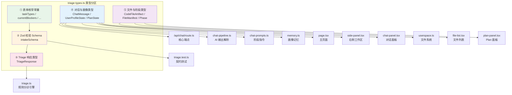

`triage-types.ts` 是整个科研分诊台的**中央类型契约文件**——它不包含任何运行时逻辑，却定义了从前端表单枚举、AI 对话消息、用户画像状态，到 Plan 结构和文件清单的全部数据形状。该文件以 170 行代码支撑了 15 个下游模块的类型依赖，是系统"数据骨架"的唯一定义源。本文将按类型层次逐层拆解，揭示每类数据的设计意图、在管线中的流转路径以及跨模块引用关系。

Sources: [triage-types.ts](src/lib/triage-types.ts#L1-L170)

## 整体架构：类型分区与依赖拓扑

文件内部可以分为五个清晰的类型分区，每个分区服务于系统中的一组特定功能模块。下图展示了这些分区与下游消费者之间的关系：



**分区①** 提供表单选项的**编译期封闭集合**（`as const` 元组），**分区②** 基于①构建 Zod 运行时校验，**分区③** 定义旧管线分诊引擎的输出结构，**分区④** 是新管线对话工作流的核心数据模型，**分区⑤** 覆盖文件产物与会话阶段的类型需求。这种分区使得文件在 170 行内保持了高度的**内聚性**——每个分区都是自包含的，但通过类型派生形成了逻辑链路。

Sources: [triage-types.ts](src/lib/triage-types.ts#L1-L170)

## ① 表单枚举常量：`as const` 元组模式

文件的前 70 行定义了 9 个 `as const` 常量数组，每个数组对应 Intake 表单中的一个选择题字段。这些数组同时服务于两个目标：**作为前端下拉选项的数据源**，以及**作为 TypeScript 联合类型的底层定义**。

| 常量名 | 选项数 | 语义 | 典型值示例 |
|---|---|---|---|
| `taskTypes` | 8 | 任务类型 | "课程项目"、"毕设"、"大创"、"竞赛"、"导师课题"、"论文阅读"、"组会汇报"、"个人科研探索" |
| `currentBlockers` | 8 | 当前卡点 | "看不懂题目"、"不知道查什么"、"不知道怎么做"、"已经做了但感觉跑偏" |
| `backgroundLevels` | 5 | 背景水平 | "完全小白" → "能独立读论文或做实验"（递进关系） |
| `deadlines` | 4 | 截止时间 | "3 天内"、"1 周内"、"1 个月内"、"更久" |
| `goalTypes` | 5 | 目标类型 | "先看懂课题"、"确定能不能做"、"做出 MVP"、"完成交付材料"、"准备汇报或答辩" |
| `userProfiles` | 5 | 用户画像分类 | "完全小白型"、"基础薄弱型"、"普通项目型"、"科研能力型"、"焦虑决策型" |
| `taskCategories` | 6 | 任务分类 | "课题理解"、"文献入门"、"技术路线"、"项目Demo"、"汇报答辩"、"风险审查" |
| `currentStages` | 3 | 当前阶段 | "课题理解期"、"路线规划期"、"交付准备期" |
| `difficultyLevels` | 4 | 难度等级 | "低"、"中"、"中高"、"高" |

`recommendedServices`（4 项）也采用同样的模式，但它是**分诊输出**的枚举而非表单输入。所有数组使用 `as const` 断言，使 TypeScript 将其推断为**只读字面量元组**而非 `string[]`，从而支持通过 `(typeof array)[number]` 语法派生出精确的联合类型。

Sources: [triage-types.ts](src/lib/triage-types.ts#L3-L69)

## ② Zod 校验 Schema 与请求类型

`intakeSchema` 是文件中唯一的运行时构造——一个 Zod 对象 Schema，它将五个表单枚举字段与一个自由文本字段组合为完整的表单提交校验规则：

```typescript
export const intakeSchema = z.object({
  taskType: z.enum(taskTypes),
  currentBlocker: z.enum(currentBlockers),
  backgroundLevel: z.enum(backgroundLevels),
  deadline: z.enum(deadlines),
  goalType: z.enum(goalTypes),
  topicText: z.string().trim()
    .min(30, "请至少输入 30 个字，方便系统判断真实课题状态。")
    .max(2000, "请输入 2000 字以内的课题描述。"),
});
```

这里有一个关键的设计细节：`z.enum()` 直接接受 `as const` 元组作为参数，不需要额外的类型断言。这意味着**表单枚举的选项集合只定义一次**（在 `as const` 数组中），Zod Schema 自动从中派生出运行时校验逻辑和 TypeScript 类型。通过 `z.infer<typeof intakeSchema>` 导出的 `IntakeRequest` 类型，确保了从表单提交到分诊引擎的全链路类型一致性。`topicText` 的 30–2000 字限制则体现了产品层面的一种权衡：过短的描述无法支撑有效的课题判断，过长则会稀释关键信息。

Sources: [triage-types.ts](src/lib/triage-types.ts#L71-L95)

## ③ TriageResponse：旧管线分诊引擎的输出契约

`TriageResponse` 是旧管线（`triage.ts` 中 `triageIntake` 函数）的返回类型，它将表单输入的六个字段综合归纳为九个维度的分诊结论：

| 字段 | 类型 | 语义说明 |
|---|---|---|
| `userProfile` | `UserProfile` | 五类用户画像之一，由 `classifyUserProfile` 推导 |
| `taskCategory` | `TaskCategory` | 六类任务分类之一，由 `classifyTaskCategory` 推导 |
| `currentStage` | `CurrentStage` | 三个宏观阶段之一，标定用户当前所处的科研进度 |
| `difficulty` | `DifficultyLevel` | 四级难度评估，由加权评分公式计算 |
| `riskList` | `string[]` | 最多 3 条风险提示，由规则匹配生成 |
| `plainExplanation` | `string` | 一段面向用户的白话总结，组合画像+阶段+分类 |
| `minimumPath` | `string[]` | 最短可行路径的 4 步行动计划 |
| `recommendedService` | `RecommendedService` | 四类推荐服务之一 |
| `serviceReason` | `string` | 推荐服务的理由文本 |
| `safetyMode` | `boolean` | 是否检测到学术诚信风险（代写/伪造等） |

这个类型的设计体现了**"单次分诊，多维输出"**的理念：用户提交一次表单，系统同时产出画像、分类、风险评估和服务推荐。`safetyMode` 字段是一个特殊的安全开关——当 `topicText` 中出现"代写"、"伪造数据"等关键词时，整个响应会切换到合规降级路径。在新管线中，`TriageResponse` 不再被直接使用（新管线通过 `PlanState` 展示结论），但它定义的分类维度（`UserProfile`、`TaskCategory` 等）仍然贯穿整个对话系统的 Prompt 构建和阶段判定。

Sources: [triage-types.ts](src/lib/triage-types.ts#L97-L108), [triage.ts](src/lib/triage.ts#L30-L65)

## ④ ChatMessage、UserProfileState 与 PlanState：新管线对话工作流的核心模型

这一组类型是新管线对话工作流的数据骨架，支撑了从 `/api/chat` 端点到前端 UI 组件的全链路数据传递。

### ChatMessage：对话消息

```typescript
type ChatMessage = {
  role: "user" | "assistant" | "system";
  content: string;
  questions?: string[];   // AI 提出的结构化选项
  process?: string;       // 可展示的流程摘要
  timestamp: number;
};
```

`ChatMessage` 在标准的三角色（user/assistant/system）基础上增加了两个可选字段。`questions` 承载 AI 返回的结构化选项（由 [ChoiceButtons](src/components/choice-buttons.tsx) 渲染为可点击按钮），`process` 提供一个面向用户的流程摘要（而非模型内部推理链），确保用户看到的是"系统正在做什么"而非"COT 思考过程"。

### UserProfileState：用户画像的扁平化 API 视图

```typescript
type UserProfileState = {
  ageOrGeneration: string;       // 年龄段/时代背景
  educationLevel: string;        // 教育水平
  toolAbility: string;           // 工具使用能力
  aiFamiliarity: string;         // AI 熟悉程度
  researchFamiliarity: string;   // 科研理解程度
  interestArea: string;          // 兴趣方向
  currentBlocker: string;        // 当前卡点
  deviceAvailable: string;       // 可投入设备
  timeAvailable: string;         // 可投入时间
  explanationPreference: string; // 偏好解释风格
};
```

10 个字段，全部为 `string` 类型——这是**有意为之的扁平化设计**。在内部存储层（[memory.ts](src/lib/memory.ts)），每个字段被包装为带置信度、来源和时间戳的 `ProfileField`；但对外传递时（API 响应、前端展示），只暴露最终值。`UserProfileState` 同时充当两个角色：**AI Prompt 的上下文输入**（在 `chat-prompts.ts` 中被序列化为系统指令的一部分）和**前端画像面板的渲染数据源**（在 [side-panel.tsx](src/components/side-panel.tsx#L21-L32) 中通过 `labels` 映射为中文标签展示）。字段键名的设计兼顾了可读性（`ageOrGeneration` 比 `a1` 更易于 Prompt 中的语义理解）和前端友好性（与 `Record<keyof UserProfileState, string>` 模式的天然适配）。

### PlanState：科研探索计划的核心展示结构

```typescript
type PlanState = {
  userProfile: string;           // 用户画像摘要（Markdown）
  problemJudgment: string;       // 当前问题判断（Markdown）
  systemLogic: string;           // 系统判断逻辑（Markdown）
  recommendedPath: string;       // 推荐路径（Markdown）
  actionSteps: string[];         // 可执行步骤列表
  riskWarnings: string[];        // 风险提示列表
  nextOptions: string[];         // 下一步选择按钮
  version: number;               // 当前版本号
  modifiedReason?: string;       // 修改原因
  userFeedback?: string;         // 用户反馈摘要
  isCurrent: boolean;            // 是否当前采用版本
};
```

`PlanState` 是系统最有表现力的类型——它同时承载了**面向用户的内容**（前四个 Markdown 字段由 [PlanPanel](src/components/plan-panel.tsx) 通过 `marked.parse()` 渲染为富文本）和**版本管理元数据**（`version`、`modifiedReason`、`isCurrent`）。`actionSteps` 的每一项都附带四个操作按钮（"更简单"、"更专业"、"拆开讲"、"换方向"），体现了"Plan 是可交互的活文档"的产品理念。`nextOptions` 是结构化按钮，用户点击后直接作为消息发送到对话管线，触发 Plan 的下一轮迭代。

Sources: [triage-types.ts](src/lib/triage-types.ts#L112-L169), [plan-panel.tsx](src/components/plan-panel.tsx#L7-L11), [side-panel.tsx](src/components/side-panel.tsx#L21-L32)

## ⑤ CodeFileArtifact、FileManifest 与 Phase：文件产物与会话阶段

### CodeFileArtifact：AI 生成的代码文件

```typescript
type CodeFileArtifact = {
  filename: string;
  title: string;
  language: string;
  content: string;
  version: number;
};
```

当 AI 在 planning 阶段生成代码片段时，`chat-pipeline.ts` 会从 AI 的 JSON 输出中提取出 `CodeFileArtifact` 数组，然后通过 `userspace.saveCodeFile()` 持久化到磁盘。这个类型的存在表明系统不仅生成文本建议，还能产出**可直接使用的代码模板**。

### FileManifest：文件清单条目

```typescript
type FileManifest = {
  filename: string;
  title: string;
  type: "profile" | "plan" | "checklist" | "path" | "summary" | "image" | "code";
  version: number;
  createdAt: string;
  language?: string;
};
```

`FileManifest` 是 Userspace 文件系统的目录项——每条记录对应磁盘上的一个实际文件。`type` 联合类型定义了七种产物类别，对应产品中的七种内容形态。前端 [FileList](src/components/file-list.tsx#L13-L21) 组件通过 `typeIcons` 映射为表情图标（👤📋✅🗺📄🖼💻），提供直观的文件类型视觉区分。`language` 仅在 `type: "code"` 时有意义，用于标识代码语言。

### Phase：对话阶段枚举

```typescript
type Phase = "greeting" | "profiling" | "clarifying" | "planning" | "reviewing";
```

五个阶段的定义驱动了整个状态机的运转。`Phase` 在 `/api/chat/route.ts` 中作为 session 存储的核心状态字段，在 `chat-prompts.ts` 中用于选择当前阶段的系统指令，在 `chat-pipeline.ts` 中用于判定阶段推进条件。详细的状态机行为分析请参见 [对话阶段状态机](7-dui-hua-jie-duan-zhuang-tai-ji-greeting-profiling-clarifying-planning-reviewing)。

Sources: [triage-types.ts](src/lib/triage-types.ts#L150-L169), [file-list.tsx](src/components/file-list.tsx#L13-L21)

## 类型导出模式：联合类型派生的技术细节

文件中第 84–95 行的十行代码展示了一种精炼的类型派生模式：

```typescript
export type TaskType = (typeof taskTypes)[number];
export type CurrentBlocker = (typeof currentBlockers)[number];
// ... 以此类推
export type IntakeRequest = z.infer<typeof intakeSchema>;
```

`(typeof taskTypes)[number]` 利用了 TypeScript 的**索引访问类型**——对一个只读元组使用 `[number]` 索引时，TypeScript 会将其展开为所有元素字面量的联合类型。例如 `(typeof taskTypes)[number]` 等价于 `"课程项目" | "毕设" | "大创" | "竞赛" | "导师课题" | "论文阅读" | "组会汇报" | "个人科研探索"`。这种模式的优势在于**单一数据源**：枚举值只在 `as const` 数组中定义一次，类型和运行时值自动同步，不存在枚举值更新后类型未跟随变更的风险。

`IntakeRequest` 使用 `z.infer` 从 Schema 反向推导类型，与手动定义 `type IntakeRequest = { taskType: TaskType; ... }` 相比，**保证类型定义与校验规则严格一致**——如果 Schema 中增加了新字段或修改了校验规则，`IntakeRequest` 类型会自动更新。

Sources: [triage-types.ts](src/lib/triage-types.ts#L84-L95)

## 跨模块引用统计与依赖分析

`triage-types.ts` 被 15 个文件直接导入，是整个项目中**被依赖最广泛**的单一模块。下表按消费者角色分类汇总：

| 消费者角色 | 文件 | 导入的类型 |
|---|---|---|
| **API 端点** | [route.ts](src/app/api/chat/route.ts#L34) | `ChatMessage`, `Phase`, `PlanState`, `UserProfileState` |
| **核心管线** | [chat-pipeline.ts](src/lib/chat-pipeline.ts#L3) | `ChatMessage`, `CodeFileArtifact`, `FileManifest`, `Phase`, `PlanState` |
| **Prompt 工程** | [chat-prompts.ts](src/lib/chat-pipeline.ts#L3) | `Phase`, `PlanState`, `UserProfileState` |
| **画像记忆** | [memory.ts](src/lib/memory.ts#L1) | `UserProfileState` |
| **文件系统** | [userspace.ts](src/lib/userspace.ts#L4) | `FileManifest` |
| **分诊引擎** | [triage.ts](src/lib/triage.ts#L1-L11) | 7 个枚举类型 + `IntakeRequest` + `TriageResponse` |
| **前端页面** | [page.tsx](src/app/page.tsx#L7) | `ChatMessage`, `PlanState`, `UserProfileState` |
| **对话面板** | [chat-panel.tsx](src/components/chat-panel.tsx#L7) | `ChatMessage` |
| **侧边栏** | [side-panel.tsx](src/components/side-panel.tsx#L4-L9) | `PlanState`, `UserProfileState`, `FileManifest` |
| **Plan 面板** | [plan-panel.tsx](src/components/plan-panel.tsx#L5) | `PlanState` |
| **文件列表** | [file-list.tsx](src/components/file-list.tsx#L4) | `FileManifest` |
| **测试文件** | [triage.test.ts](src/lib/triage.test.ts#L4), [chat-pipeline.test.ts](src/lib/chat-pipeline.test.ts#L12) | `IntakeRequest`, `PlanState` |

这一依赖分布揭示了一个重要的架构特征：**`triage-types.ts` 没有被其他 lib 模块反向依赖任何运行时导入**（纯 `import type`），这意味着它不会触发循环依赖问题，是理想的类型层"叶子节点"。

Sources: [triage-types.ts](src/lib/triage-types.ts#L1-L170)

## 设计决策总结与扩展指引

`triage-types.ts` 的设计遵循了三个核心原则：

1. **单一数据源**：表单枚举值只在 `as const` 数组中定义一次，Zod Schema 和 TypeScript 类型自动派生，消除了值/类型不一致的风险。
2. **纯类型导出**（除 `intakeSchema` 外）：文件不导入任何其他项目模块，不产生循环依赖，可以安全地在任何层级被引用。
3. **分层渐进**：从表单枚举 → 校验 Schema → 旧管线响应 → 新管线对话模型 → 文件产物，类型复杂度随分区递增，每层都有明确的功能边界。

当需要扩展系统时，**添加新的表单字段**只需在①区新增 `as const` 数组并更新 `intakeSchema`；**扩展画像维度**只需在 `UserProfileState` 中新增字段（同步更新 [memory.ts](src/lib/memory.ts#L14-L25) 的 `KEYS` 数组）；**添加新的 Plan 字段**只需修改 `PlanState` 并更新 [PlanPanel](src/components/plan-panel.tsx) 的渲染逻辑。所有扩展路径都遵循"修改类型定义 → 类型错误驱动下游更新"的工作流。

Sources: [triage-types.ts](src/lib/triage-types.ts#L1-L170), [memory.ts](src/lib/memory.ts#L14-L25)

---

**延伸阅读**：

- 如需了解 `TriageResponse` 各字段的推导规则，参见 [规则分诊引擎 triage.ts](15-gui-ze-fen-zhen-yin-qing-triage-ts-yong-hu-fen-lei-ren-wu-fen-lei-yu-feng-xian-ping-gu)
- 如需了解 `UserProfileState` 的置信度存储机制，参见 [用户画像记忆系统](11-yong-hu-hua-xiang-ji-yi-xi-tong-zhi-xin-du-qu-dong-de-bo-yi-shi-hua-xiang-que-li-ji-zhi)
- 如需了解 `Phase` 如何驱动状态机转换，参见 [对话阶段状态机](7-dui-hua-jie-duan-zhuang-tai-ji-greeting-profiling-clarifying-planning-reviewing)
- 如需了解 `intakeSchema` 的 Zod 校验扩展，参见 [API 请求/响应契约与 Zod 校验 Schema](23-api-qing-qiu-xiang-ying-qi-yue-yu-zod-xiao-yan-schema)
- 如需了解 `PlanState` 如何从 AI JSON 输出中解析，参见 [Chat Pipeline](12-chat-pipeline-ai-json-shu-chu-jie-xi-plan-gui-hua-yu-chan-wu-sheng-cheng)