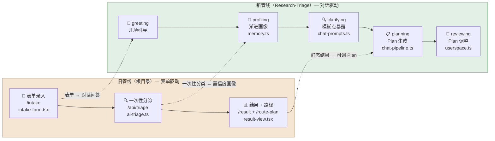

本文将帮助你理解整个仓库中 **两套代码体系** 的共存关系——根目录下的 **旧表单管线** 和 `Research-Triage/` 目录下的 **新对话管线**。如果你刚接触这个项目，理解这两者的演进脉络是阅读后续所有深度文档的前提。我们会从宏观目录对比入手，逐步深入到架构差异和迁移路径，让你对"为什么要重构"和"重构改了什么"有清晰的第一印象。

Sources: [ARCHITECTURE.md](ARCHITECTURE.md#L1-L20), [Research-Triage/ARCHITECTURE.md](Research-Triage/ARCHITECTURE.md#L1-L32)

## 仓库全局结构：两套并存的独立应用

这个仓库本质上包含了 **同一个产品的两个版本**。根目录是旧版（Phase 0），`Research-Triage/` 是新版（Phase 1-4 整合）。它们各自拥有独立的 `package.json`、`next.config.mjs`、`src/` 源码目录和独立的依赖安装——可以理解为同一个 Git 仓库中存放了两个独立的 Next.js 应用。两个版本的运行方式完全一致：进入对应目录执行 `npm install && npm run dev` 即可启动。

```text
NanJingHackson/                         ← 仓库根目录
├── package.json                        ← 旧管线依赖（含 @ai-sdk/openai, ai SDK）
├── next.config.mjs                     ← 旧管线 Next.js 配置
├── prompt_templates/                   ← 旧管线 7 个独立 Prompt 模板文件
├── src/                                ← 旧管线完整源码
│   ├── app/api/triage/                 ← 旧管线：多端点表单式 API
│   ├── components/intake-form.tsx      ← 旧管线：表单组件
│   └── lib/ai-triage.ts               ← 旧管线：AI 编排逻辑
│
└── Research-Triage/                    ← 新管线（当前主开发分支）
    ├── package.json                    ← 新管线依赖（含 marked，移除了 ai SDK）
    ├── next.config.mjs                 ← 新管线 Next.js 配置
    ├── skills/                         ← 新管线：10 个科学方法论 Skill 文件
    ├── src/                            ← 新管线完整源码
    │   ├── app/api/chat/               ← 新管线：单端点对话 API
    │   ├── components/chat-panel.tsx   ← 新管线：对话组件
    │   └── lib/chat-pipeline.ts        ← 新管线：Chat 编排与产物生成
    └── ARCHITECTURE.md                 ← 新管线架构文档
```

> **实用提示**：如果你要运行项目，应该优先进入 `Research-Triage/` 目录。根目录的旧管线代码目前仅作为历史参考保留在仓库中。

Sources: [package.json](package.json#L1-L27), [Research-Triage/package.json](Research-Triage/package.json#L1-L27)

## 旧管线（根目录）：表单驱动的多端点分诊

旧管线的设计思路是 **"先填表，再分诊，最后出结果"**——用户在前端填写结构化表单，后端根据表单内容调用 AI 进行一次性分类和路由。这种架构的核心特征可以概括为三个关键词：**表单输入、多端点分离、一次性判定**。

### 前端：多页面表单流程

旧管线的前端是一个 **多页面导航** 结构，用户需要经过三个独立页面才能完成完整流程：

| 页面路由 | 组件 | 职责 |
|----------|------|------|
| `/intake` | `intake-form.tsx` | 表单录入页：用户填写任务类型、卡点、基础水平、截止时间等 |
| `/result` | `result-view.tsx` | 分诊结果页：展示用户类型、风险列表、最短路径 |
| `/route-plan` | `route-plan-view.tsx` | 路径规划页：展示科研执行路线和交付物 |
| `/` | `page.tsx` | 首页：纯静态展示页（hero card），引导用户点击进入 `/intake` |

Sources: [src/app/page.tsx](src/app/page.tsx#L1-L49), [src/components/intake-form.tsx](src/components/intake-form.tsx#L1)

### 后端：五个独立 API 端点

旧管线的后端按 **功能职责拆分为五个独立的 API 端点**，每个端点负责管线中的一个环节：

```text
POST /api/triage              ← 主分诊入口：接收表单 → 调用 AI → 返回分类+路由
POST /api/triage/intake       ← Intake 子流程处理
POST /api/triage/route-plan   ← 路径规划子流程
POST /api/generate-answer     ← 生成面向用户的答案文本
POST /api/recommend-service   ← 推荐下一步服务
```

这些端点在 [src/lib/ai-triage.ts](src/lib/ai-triage.ts#L1-L151) 中各自对应独立的 AI 调用函数（`aiTriageAnalysis`、`aiGenerateAnswer`、`aiRecommendService`），每个函数构造不同的 system prompt 并解析不同格式的 JSON 输出。

Sources: [src/app/api/triage/route.ts](src/app/api/triage/route.ts#L1-L39), [src/lib/ai-triage.ts](src/lib/ai-triage.ts#L50-L101)

### Prompt 模板体系

旧管线使用 `prompt_templates/` 目录下的 **7 个独立 Markdown 模板** 来管理 Prompt：

| 模板文件 | 职责 |
|----------|------|
| `input_normalizer.md` | 输入归一化 |
| `triage_classifier.md` | 用户五分类（A-E） |
| `response_router.md` | 输出路由决策 |
| `need_clarifier.md` | 补充追问 |
| `service_recommender.md` | 服务推荐 |
| `answer_generator.md` | 答案生成 |
| `quality_checker.md` | 质量检查 |

这些模板与后端 AI 函数 **一对一对应**，每个模板定义了独立的输入输出 schema。但需要注意的是，旧管线的实际代码（[ai-triage.ts](src/lib/ai-triage.ts#L14-L17)）中 **内联了 system prompt**，模板文件更多是 Prompt 工程的设计文档而非运行时加载的资源。

Sources: [prompt_templates/triage_classifier.md](prompt_templates/triage_classifier.md#L1-L79), [src/lib/ai-triage.ts](src/lib/ai-triage.ts#L12-L17)

## 新管线（Research-Triage）：对话驱动的单端点工作台

新管线彻底重构了交互范式：从"填表出报告"变成了 **"对话式工作台"**。用户进入系统后面对的是一个类似 ChatGPT 的聊天界面，左侧是对话区，右侧是 Plan 面板和文档预览区。系统通过多轮对话渐进地识别用户画像、暴露模糊点、生成可调整的科研 Plan，并将所有产物持久化到文件系统。

### 前端：单页三区工作台

新管线将旧的多页面流程压缩为 **单一页面**，采用左中右三区布局：

| 区域 | 核心组件 | 职责 |
|------|----------|------|
| 左侧对话区 | `chat-panel.tsx` + `chat-input.tsx` | 消息列表、结构化选项按钮、自由输入 |
| 右侧工作区 | `side-panel.tsx` | 画像卡片、Plan 步骤、风险提示、文档预览 |
| Plan 管理 | `plan-panel.tsx` + `plan-history-panel.tsx` | Plan 展示、版本对比、调整操作 |

旧管线的 `/intake`、`/result`、`/route-plan` 三个页面在新管线中变成了 **兼容跳转**（redirect 到 `/`），不再承载业务流程。

Sources: [Research-Triage/ARCHITECTURE.md](Research-Triage/ARCHITECTURE.md#L33-L60), [Research-Triage/src/app/page.tsx](Research-Triage/src/app/page.tsx#L1-L19)

### 后端：单一 `/api/chat` 端点 + userspace 文件系统

新管线的后端架构可以用一个公式概括：**一个对话端点 + 一个文件服务**。

```text
POST /api/chat                                          ← 唯一对话入口（阶段机 + AI 编排 + 产物生成）
GET  /api/userspace/{sessionId}                         ← 文件清单
GET  /api/userspace/{sessionId}/{filename}              ← 文件预览
POST /api/userspace/{sessionId}/{filename}?action=open  ← 系统默认应用打开
```

`/api/chat` 是整个系统的 **大脑**，它内部维护了一个五阶段状态机（greeting → profiling → clarifying → planning → reviewing），每次请求根据当前阶段注入不同的 Prompt 指令，调用 AI 后解析 JSON 输出，更新用户画像，生成或调整 Plan，并将产物写入 userspace。

Sources: [Research-Triage/ARCHITECTURE.md](Research-Triage/ARCHITECTURE.md#L62-L114), [Research-Triage/src/app/api/chat/route.ts](Research-Triage/src/app/api/chat/route.ts#L1-L50)

### Skills 方法论注入体系

新管线用 `skills/` 目录下的 **10 个 Markdown 文件** 替代了旧的 `prompt_templates/`，但两者的定位完全不同：旧模板是 **阶段任务指令**，而 Skills 是 **方法论约束**——它们通过 [skills.ts](Research-Triage/src/lib/skills.ts#L1-L50) 在运行时统一加载并注入到每次 AI 调用的 system prompt 中，强制 AI 遵循科学方法论五步（提问→分解→假设→验证→迭代）进行输出。

Sources: [Research-Triage/skills/00-core-methodology.md](Research-Triage/skills/00-core-methodology.md#L1-L18), [Research-Triage/src/lib/skills.ts](Research-Triage/src/lib/skills.ts#L9-L50)

## 架构演进对比：六个核心转变

下表从六个维度对比两套管线的架构差异，帮助你快速定位"改了什么"和"为什么改"：

| 维度 | 旧管线（根目录） | 新管线（Research-Triage） | 演进动机 |
|------|------------------|---------------------------|----------|
| **交互范式** | 多页面表单（`/intake` → `/result` → `/route-plan`） | 单页对话工作台（ChatPanel + SidePanel） | 表单要求用户一次性完整描述问题，门槛高；对话可渐进式引导 |
| **API 架构** | 5 个独立端点（triage/intake/route-plan/generate-answer/recommend-service） | 1 个对话端点 `/api/chat` + userspace 文件服务 | 多端点状态同步复杂；单端点内聚状态机更易维护 |
| **用户建模** | 一次性 AI 分类（userType: A-E），静态标签 | 10 字段渐进画像 + 置信度驱动（confidence: 0.0-1.0） | 静态标签无法捕捉用户复杂性；置信度机制允许"不确定"状态存在 |
| **Prompt 管理** | 7 个阶段模板（`prompt_templates/*.md`） | 阶段指令（`chat-prompts.ts`） + 方法论 Skills（`skills/*.md`） | 分离"做什么"和"怎么做"：Skills 提供方法论约束，指令定义阶段任务 |
| **产物持久化** | 无持久化（纯 API 响应） | userspace 文件系统（Plan 版本、摘要、代码文件、清单） | 对话式系统需要跨会话记忆；Plan 版本对比是核心交互 |
| **容错机制** | AI 失败 → 500 错误或简单 fallback | 多层 JSON 解析 + 规则 fallback + 协议泄漏防护 | AI 输出不稳定是常态；多层防护保证主流程不崩溃 |

Sources: [src/lib/ai-triage.ts](src/lib/ai-triage.ts#L1-L151), [Research-Triage/src/lib/chat-pipeline.ts](Research-Triage/src/lib/chat-pipeline.ts#L1-L50), [Research-Triage/src/lib/memory.ts](Research-Triage/src/lib/memory.ts#L1-L35)

下面的 Mermaid 图展示了旧管线到新管线的架构演进关系。阅读时请先关注左侧旧管线的 **三步表单流程**，然后跟随箭头看每一步如何被新管线的 **对话阶段** 吸收和替代：



Sources: [src/app/api/triage/route.ts](src/app/api/triage/route.ts#L1-L39), [Research-Triage/src/app/api/chat/route.ts](Research-Triage/src/app/api/chat/route.ts#L70-L200)

## 模块级文件映射：旧模块去了哪里

对于需要从旧代码迁移或对照的开发者，下面这张表精确列出了每个旧模块在新管线中的对应位置。理解这些映射是阅读后续深度文档的基础：

| 旧模块（根目录） | 状态 | 新模块（Research-Triage） | 说明 |
|------------------|------|---------------------------|------|
| `src/app/api/triage/route.ts` | ❌ 已删除 | `src/app/api/chat/route.ts` | 从"表单→分类"变为"对话→阶段机" |
| `src/app/api/generate-answer/route.ts` | ❌ 已删除 | `src/app/api/chat/route.ts`（planning 阶段） | 答案生成融入 Plan 生成环节 |
| `src/app/api/recommend-service/route.ts` | ❌ 已删除 | `src/app/api/chat/route.ts`（reviewing 阶段） | 服务推荐融入 Plan 调整环节 |
| `src/lib/ai-triage.ts` | ❌ 已删除 | `src/lib/chat-prompts.ts` + `src/lib/chat-pipeline.ts` | AI 编排拆分为"Prompt 构造"和"产物处理" |
| `src/lib/route-plan.ts` | ❌ 已删除 | `src/lib/chat-pipeline.ts` | 路径规划逻辑融入 Plan 归一化流程 |
| `src/lib/storage.ts` | ❌ 已删除 | `src/lib/userspace.ts` | 会话存储从内存/简单对象升级为文件系统 |
| `src/components/intake-form.tsx` | ❌ 已删除 | `src/components/chat-panel.tsx` + `chat-input.tsx` | 表单 → 对话输入框 |
| `src/components/result-view.tsx` | ❌ 已删除 | `src/components/plan-panel.tsx` + `doc-panel.tsx` | 结果页 → 右侧面板 |
| `src/components/route-plan-view.tsx` | ❌ 已删除 | `src/components/plan-panel.tsx` | 路径规划页 → Plan 面板 |
| `src/components/plan-card.tsx` | ❌ 已删除 | `src/components/plan-history-panel.tsx` | Plan 卡片 → Plan 版本历史对比 |
| `prompt_templates/*.md` | 📦 保留（参考） | `src/lib/chat-prompts.ts` + `skills/*.md` | 模板拆分为"阶段指令代码"和"方法论 Skill 文件" |
| `src/lib/triage.ts` | ✅ 保留 | `src/lib/triage.ts`（相同） | 规则分诊引擎，作为 AI 失败时的 fallback |
| `src/lib/triage-types.ts` | 🔄 扩展 | `src/lib/triage-types.ts` | 保留旧类型，新增 ChatMessage、UserProfileState、PlanState、Phase 等 |
| `src/lib/ai-provider.ts` | 🔄 重写 | `src/lib/ai-provider.ts` | 从 SDK 封装改为裸 fetch 调用 |
| — | 🆕 新增 | `src/lib/memory.ts` | 用户画像置信度管理系统 |
| — | 🆕 新增 | `src/lib/skills.ts` | Skills 方法论加载器 |

Sources: [Research-Triage/ARCHITECTURE.md](Research-Triage/ARCHITECTURE.md#L208-L232), [Research-Triage/DEVELOPMENT_PLAN.md](Research-Triage/DEVELOPMENT_PLAN.md#L90-L114)

## 类型系统演进：从静态标签到动态状态机

旧管线的类型系统围绕 **"一次性分类"** 设计：核心类型是 `IntakeRequest`（表单输入）、`TriageResponse`（分诊结果）、`AiTriageResponse`（AI 输出）等扁平结构。用户被分为 A-E 五种类型，每条 AI 输出都是独立的 JSON 块。

新管线在此基础上 **大幅扩展** 了类型系统，新增了对话和状态管理所需的核心类型：

| 新增类型 | 定义位置 | 职责 |
|----------|----------|------|
| `Phase` | `triage-types.ts` | 对话阶段枚举：greeting / profiling / clarifying / planning / reviewing |
| `ChatMessage` | `triage-types.ts` | 聊天消息（含 role、content、questions、process、timestamp） |
| `UserProfileState` | `triage-types.ts` | 用户画像 10 字段（ageOrGeneration、toolAbility 等） |
| `PlanState` | `triage-types.ts` | Plan 结构（步骤、风险、版本号、修改原因等） |
| `CodeFileArtifact` | `triage-types.ts` | 代码文件产物（文件名、语言、内容、版本） |
| `FileManifest` | `triage-types.ts` | userspace 文件清单条目（类型、版本、创建时间） |
| `UserProfileMemory` | `memory.ts` | 内部画像表示（每字段含 value、confidence、source、updatedAt） |
| `ProfileField` | `memory.ts` | 单个画像字段（含置信度和来源标记） |

Sources: [Research-Triage/src/lib/triage-types.ts](Research-Triage/src/lib/triage-types.ts#L110-L170), [Research-Triage/src/lib/memory.ts](Research-Triage/src/lib/memory.ts#L1-L12)

## 依赖差异：从 AI SDK 到裸 fetch

两个版本在 `package.json` 中有一个关键差异：旧管线依赖 `@ai-sdk/openai` 和 `ai` 这两个 Vercel AI SDK 包，而新管线 **移除了它们**，改用裸 `fetch` 直接调用 OpenAI-compatible API（即 DeepSeek）。新管线新增了 `marked` 用于 Markdown 渲染。

| 依赖 | 旧管线 | 新管线 | 原因 |
|------|--------|--------|------|
| `@ai-sdk/openai` | ✅ | ❌ | SDK 兼容性问题，裸 fetch 更稳定 |
| `ai` | ✅ | ❌ | 同上 |
| `marked` | ❌ | ✅ | DocPanel 需要 Markdown → HTML 渲染 |
| `next` / `react` / `zod` / `vitest` | ✅ | ✅ | 基础框架，两版一致 |

Sources: [package.json](package.json#L12-L19), [Research-Triage/package.json](Research-Triage/package.json#L13-L18), [ARCHITECTURE.md](ARCHITECTURE.md#L12-L14)

## 新管线的开发阶段历程

新管线的开发经历了四个阶段的迭代，每阶段都有明确交付物。了解这个历程有助于你理解为什么代码中存在某些看似"过度设计"的模块：

| 阶段 | 核心交付 | 关键模块 |
|------|----------|----------|
| **Phase 1：骨架搭建** | 类型扩展 + Skills 加载器 + userspace + Memory + 前端三区 | `triage-types.ts`, `skills.ts`, `userspace.ts`, `memory.ts` |
| **Phase 2：对话闭环** | `/api/chat` 端点 + ChatPanel + 会话持久化 + ProfileCard | `chat/route.ts`, `chat-panel.tsx`, `sessionStorage` |
| **Phase 3：核心产出** | Plan 生成 + PlanPanel + FileList + 文件预览 API + 代码产物 | `plan-panel.tsx`, `file-list.tsx`, `codeFiles` 协议 |
| **Phase 4：架构拆分** | Prompt 拆分 + Pipeline 拆分 + 配套文档 + Plan 历史对比 + 契约测试 | `chat-prompts.ts`, `chat-pipeline.ts`, `chat-pipeline.test.ts` |

Sources: [Research-Triage/DEVELOPMENT_PLAN.md](Research-Triage/DEVELOPMENT_PLAN.md#L22-L88)

## 建议阅读路径

理解了两套管线的演进关系后，建议按照以下顺序继续深入：

1. **[环境变量配置：AI Provider 密钥与模型选择](4-huan-jing-bian-liang-pei-zhi-ai-provider-mi-yao-yu-mo-xing-xuan-ze)** — 了解如何配置新管线的 AI 连接
2. **[整体架构：单页工作台三区布局与数据流](6-zheng-ti-jia-gou-dan-ye-gong-zuo-tai-san-qu-bu-ju-yu-shu-ju-liu)** — 深入新管线的完整数据流
3. **[根项目旧管线与新管线的对比与迁移路径](8-gen-xiang-mu-jiu-guan-xian-yu-xin-guan-xian-de-dui-bi-yu-qian-yi-lu-jing)** — 更细致的模块级迁移对照
4. **[对话阶段状态机：greeting → profiling → clarifying → planning → reviewing](7-dui-hua-jie-duan-zhuang-tai-ji-greeting-profiling-clarifying-planning-reviewing)** — 理解新管线的核心驱动机制