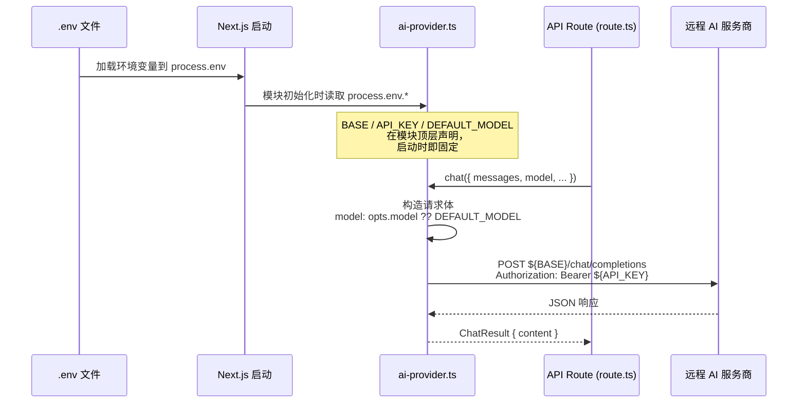

本文是「科研课题分诊台」项目环境变量配置的完整指南。你将了解：项目依赖哪些环境变量、两套管线（根目录旧管线与 Research-Triage 新管线）各自如何读取密钥与模型配置、如何切换到不同的 AI 服务商，以及常见错误的排查方法。读完本文后，你将能独立完成本地开发的 AI 连通性配置。

## 项目中的两套管线与环境变量架构

项目目前存在两套并行的管线架构——根目录旧管线（`src/`）与 Research-Triage 新管线（`Research-Triage/`）。两套管线在环境变量的命名约定和回退策略上有显著差异。旧管线使用 `DEEPSEEK_*` 前缀的变量名，仅支持单一回退到 `OPENAI_API_KEY`；新管线引入了统一的 `AI_*` 前缀变量，并提供三级回退链，可在不修改代码的前提下切换至任意 OpenAI 兼容服务商。

Sources: [ai-provider.ts](src/lib/ai-provider.ts#L1-L8), [ai-provider.ts](Research-Triage/src/lib/ai-provider.ts#L1-L31)

下面的流程图展示了新管线中环境变量的解析优先级——当高优先级变量存在时，低优先级的同名变量将被跳过：

```mermaid
flowchart TD
    subgraph BASE_URL 解析链
        A1["AI_BASE_URL"] -->|未设置| A2["DEEPSEEK_BASE_URL"]
        A2 -->|未设置| A3["OPENAI_BASE_URL"]
        A3 -->|未设置| A4["默认值: https://api.deepseek.com/v1"]
    end

    subgraph API_KEY 解析链
        B1["AI_API_KEY"] -->|未设置| B2["DEEPSEEK_API_KEY"]
        B2 -->|未设置| B3["OPENAI_API_KEY"]
        B3 -->|未设置| B4["空字符串（运行时报错）"]
    end

    subgraph MODEL 解析链
        C1["AI_MODEL"] -->|未设置| C2["默认值: deepseek-v4-flash"]
    end

    style A1 fill:#4CAF50,color:#fff
    style B1 fill:#4CAF50,color:#fff
    style C1 fill:#4CAF50,color:#fff
    style A4 fill:#FF9800,color:#fff
    style B4 fill:#f44336,color:#fff
    style C2 fill:#FF9800,color:#fff
```



## 环境变量完整参考

下面两张表分别列出了两套管线所需的全部环境变量。**如果你只使用新管线（Research-Triage），只需关注第一张表中的 `AI_*` 变量即可。**

### 新管线环境变量（Research-Triage）

| 变量名 | 是否必须 | 默认值 | 说明 |
|--------|---------|--------|------|
| `AI_BASE_URL` | 否 | `https://api.deepseek.com/v1` | API 基础地址，需兼容 OpenAI `/chat/completions` 接口规范 |
| `AI_API_KEY` | 否（但有回退） | 空 | Bearer Token，缺失时依次回退到 `DEEPSEEK_API_KEY`、`OPENAI_API_KEY` |
| `AI_MODEL` | 否 | `deepseek-v4-flash` | 模型标识符，由服务商定义，如 `gpt-4o-mini`、`moonshot-v1-8k` |

Sources: [ai-provider.ts](Research-Triage/src/lib/ai-provider.ts#L19-L31), [.env.example](Research-Triage/.env.example#L1-L35)

### 旧管线环境变量（根目录）

| 变量名 | 是否必须 | 默认值 | 说明 |
|--------|---------|--------|------|
| `DEEPSEEK_API_KEY` | 否（有回退） | 空 | DeepSeek API 密钥，缺失时回退到 `OPENAI_API_KEY` |
| `DEEPSEEK_BASE_URL` | 否 | `https://api.deepseek.com/v1` | DeepSeek API 基础地址 |
| `OPENAI_API_KEY` | 否 | 空 | 作为 `DEEPSEEK_API_KEY` 的兜底 |

Sources: [ai-provider.ts](src/lib/ai-provider.ts#L5-L9)

**关键差异提醒**：旧管线的模型标识是硬编码在代码中的常量（`DEFAULT_MODEL = "deepseek-v4-flash"`），不支持通过环境变量切换模型；新管线则将模型选择暴露为 `AI_MODEL` 环境变量，切换模型无需改代码。

Sources: [ai-provider.ts](src/lib/ai-provider.ts#L8-L9), [ai-provider.ts](Research-Triage/src/lib/ai-provider.ts#L31)

## 创建 .env 文件：逐步操作

### 步骤 1：定位你需要的 .env 文件位置

项目中有两个独立的 Next.js 应用，各自需要自己的 `.env` 文件：

```
NanJingHackson/
├── .env                          ← 旧管线环境变量
└── Research-Triage/
    ├── .env                      ← 新管线环境变量
    └── .env.example              ← 新管线模板（已提交到 Git）
```

Sources: [.gitignore](.gitignore#L3-L4), [.gitignore](Research-Triage/.gitignore#L30-L33)

**安全说明**：两个 `.gitignore` 都已将 `.env` 排除在版本控制之外，你的 API 密钥不会被提交到 Git 仓库。新管线额外使用 `!.env.example` 规则确保模板文件被纳入版本控制，方便新成员参考。

### 步骤 2：为新管线创建 .env 文件

新管线提供了完善的 `.env.example` 模板，推荐直接复制后修改：

```bash
# 在项目根目录执行
cp Research-Triage/.env.example Research-Triage/.env
```

然后编辑 `Research-Triage/.env`，将 `sk-your-key-here` 替换为你的真实 API 密钥：

```env
AI_BASE_URL=https://api.deepseek.com/v1
AI_API_KEY=sk-your-actual-key-here
AI_MODEL=deepseek-v4-flash
```

Sources: [.env.example](Research-Triage/.env.example#L6-L8), [.env](Research-Triage/.env#L1-L4)

### 步骤 3：为旧管线创建 .env 文件（如需使用）

旧管线没有提供 `.env.example` 模板，需手动创建。在项目根目录下新建 `.env` 文件：

```env
DEEPSEEK_API_KEY=sk-your-actual-key-here
# DEEPSEEK_BASE_URL=https://api.deepseek.com   # 可选，有默认值
```

Sources: [.env](.env#L1-L3)

### 步骤 4：验证配置生效

完成 `.env` 文件创建后，按照 [验证与调试脚本：DeepSeek 连通性测试](5-yan-zheng-yu-diao-shi-jiao-ben-deepseek-lian-tong-xing-ce-shi) 页面的指引，运行测试脚本确认 API 连通性。

## 切换 AI 服务商

新管线的设计目标之一是**零代码改动切换服务商**。所有 OpenAI 兼容的 API 服务都可以通过修改 `.env` 中的三个变量来接入。以下是经过项目 `.env.example` 验证的常见服务商配置：

| 服务商 | `AI_BASE_URL` | `AI_MODEL` 示例 | `AI_API_KEY` |
|--------|--------------|-----------------|--------------|
| **DeepSeek**（默认） | `https://api.deepseek.com/v1` | `deepseek-v4-flash`、`deepseek-v4-pro` | DeepSeek 平台密钥 |
| **OpenAI** | `https://api.openai.com/v1` | `gpt-4o-mini` | OpenAI API Key |
| **Moonshot / Kimi** | `https://api.moonshot.cn/v1` | `moonshot-v1-8k` | Moonshot 平台密钥 |
| **智谱 GLM** | `https://open.bigmodel.cn/api/paas/v4` | `glm-4-flash` | 智谱平台密钥 |
| **OpenRouter**（多模型网关） | `https://openrouter.ai/api/v1` | `anthropic/claude-3.5-sonnet` | OpenRouter Key |
| **本地 ollama** | `http://localhost:11434/v1` | `qwen2.5:7b` | `ollama`（任意值） |

Sources: [.env.example](Research-Triage/.env.example#L10-L35)

**切换示例**——从 DeepSeek 切换到 Moonshot，只需修改 `.env` 中的三个值：

```env
# 修改前（DeepSeek）
AI_BASE_URL=https://api.deepseek.com/v1
AI_API_KEY=sk-c2dff935c6c74f80912b421d8b452006
AI_MODEL=deepseek-v4-flash

# 修改后（Moonshot）
AI_BASE_URL=https://api.moonshot.cn/v1
AI_API_KEY=sk-your-moonshot-key
AI_MODEL=moonshot-v1-8k
```

修改后重启开发服务器（`npm run dev`）即可生效——Next.js 在服务启动时读取 `.env` 文件，运行中修改需要重启。

## 环境变量在代码中的消费路径

了解环境变量如何被代码消费，有助于你在调试时快速定位问题。下面的流程图展示了从 `.env` 文件到 API 请求的完整数据流：



**要点说明**：环境变量在 `ai-provider.ts` 模块的顶层通过 `const` 声明被读取，这意味着它们在 Next.js 服务器启动时就被固化。修改 `.env` 后必须重启服务才能生效，热更新不会重新加载环境变量。

Sources: [ai-provider.ts](Research-Triage/src/lib/ai-provider.ts#L19-L31), [route.ts](Research-Triage/src/app/api/chat/route.ts#L186-L191)

## 模型选择策略

新管线在 `ai-provider.ts` 中导出了 `DEFAULT_MODEL` 常量，而各业务模块通过 `chat()` 函数的 `model` 参数可以覆盖默认模型：

Sources: [ai-provider.ts](Research-Triage/src/lib/ai-provider.ts#L31)

| 配置方式 | 优先级 | 使用场景 |
|---------|--------|---------|
| `chat({ model: "specific-model" })` | **最高** | 特定任务需要指定模型（如高质量任务用 pro 模型） |
| `AI_MODEL` 环境变量 | 中 | 全局默认模型，适用于大多数调用 |
| 代码默认值 `deepseek-v4-flash` | 最低 | 环境变量未设置时的兜底 |

在实际调用中，`/api/chat` 路由未显式指定 `model` 参数，因此所有 AI 调用都使用 `DEFAULT_MODEL`（即 `AI_MODEL` 环境变量或其默认值）。如果你希望某些阶段使用更强的模型（如规划阶段用 `deepseek-v4-pro`），需要修改对应的 `chat()` 调用。

Sources: [route.ts](Research-Triage/src/app/api/chat/route.ts#L186-L191)

## 常见问题排查

| 症状 | 可能原因 | 解决方案 |
|------|---------|---------|
| `No API key found` 报错 | 所有三个 API_KEY 变量均未设置 | 在 `.env` 中设置 `AI_API_KEY`（或 `DEEPSEEK_API_KEY`） |
| `API 401 Unauthorized` | API Key 无效或已过期 | 检查密钥是否正确，是否在对应平台有效 |
| `API 429 Too Many Requests` | 触发服务商速率限制 | 降低请求频率，或检查账户余额/配额 |
| 修改 `.env` 后配置未生效 | 未重启开发服务器 | 停止 `npm run dev` 后重新启动 |
| 连接超时 / 网络错误 | `AI_BASE_URL` 不正确或网络不通 | 检查 URL 末尾是否有多余斜杠，尝试 `curl` 测试连通性 |
| 本地 ollama 连接失败 | ollama 服务未启动 | 执行 `ollama serve` 启动本地服务 |

Sources: [ai-provider.ts](Research-Triage/src/lib/ai-provider.ts#L53-L57), [ai-provider.ts](Research-Triage/src/lib/ai-provider.ts#L89-L97)

## 下一步

配置完环境变量并验证连通性后，建议继续阅读以下页面以深入了解项目：

- [验证与调试脚本：DeepSeek 连通性测试](5-yan-zheng-yu-diao-shi-jiao-ben-deepseek-lian-tong-xing-ce-shi) —— 使用测试脚本确认你的配置是否正确
- [AI Provider 适配层：裸 fetch 调用 DeepSeek API 的设计考量](10-ai-provider-gua-pei-ceng-luo-fetch-diao-yong-deepseek-api-de-she-ji-kao-liang) —— 深入理解为什么项目选择裸 `fetch` 而非 SDK
- [项目结构总览：根目录旧管线与 Research-Triage 演进关系](3-xiang-mu-jie-gou-zong-lan-gen-mu-lu-jiu-guan-xian-yu-research-triage-yan-jin-guan-xi) —— 理解两套管线的关系与迁移路径