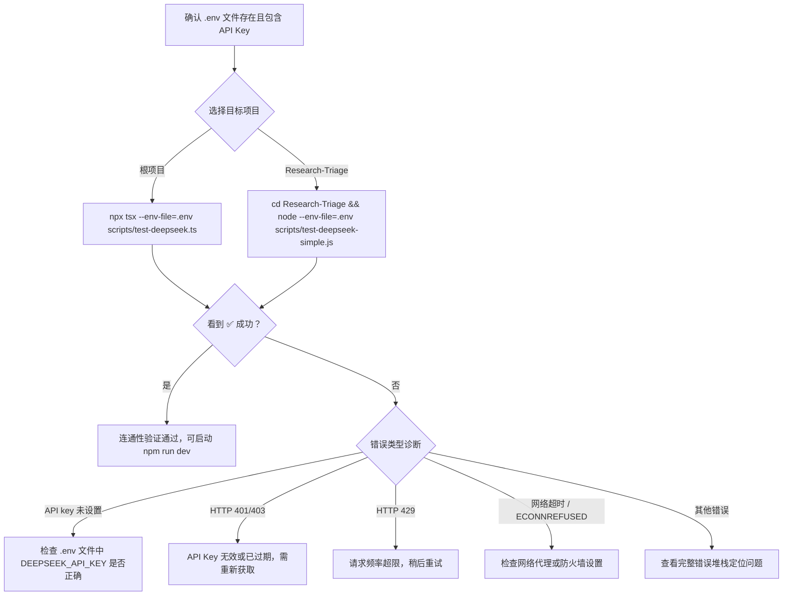
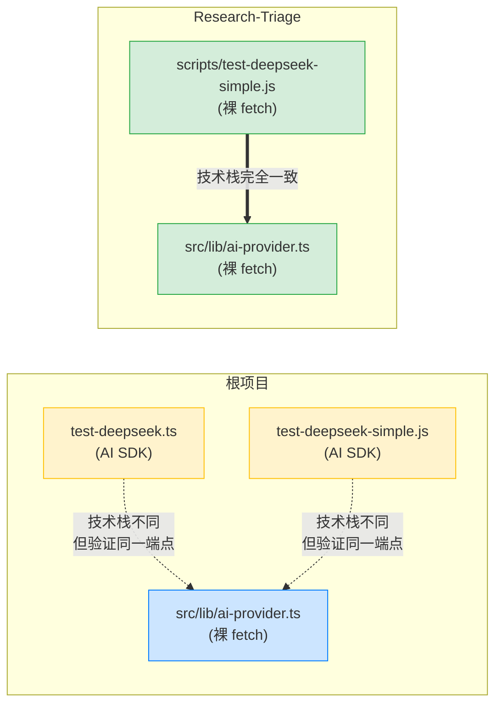

在完成[环境变量配置](4-huan-jing-bian-liang-pei-zhi-ai-provider-mi-yao-yu-mo-xing-xuan-ze)之后，你的 `.env` 文件里已经有了 API Key，但如何确认这个密钥是有效的？如何验证你的开发环境确实能够与 DeepSeek 服务器建立通信？本页将介绍项目中三个专用的**连通性验证脚本**——它们是你在启动完整应用之前的第一道诊断工具，能帮你快速定位"连不上 AI"的问题根源。

三个脚本分别位于不同目录、采用不同技术栈，对应项目演进中的不同阶段：从 Vercel AI SDK 方案到裸 fetch 方案，覆盖了根项目与 Research-Triage 子项目两套管线。

Sources: [test-deepseek-simple.js](scripts/test-deepseek-simple.js#L1-L29), [test-deepseek.ts](scripts/test-deepseek.ts#L1-L32), [test-deepseek-simple.js](Research-Triage/scripts/test-deepseek-simple.js#L1-L49)

## 脚本总览与定位

三个脚本的设计目标完全一致——**用最简短的方式向 AI 发送一条消息并验证能否收到回复**——但实现路径不同。下表对比了它们的核心差异：

| 维度 | `scripts/test-deepseek.ts` | `scripts/test-deepseek-simple.js` | `Research-Triage/.../test-deepseek-simple.js` |
|------|---------------------------|-----------------------------------|------------------------------------------------|
| **语言** | TypeScript | CommonJS JavaScript | CommonJS JavaScript |
| **HTTP 方式** | Vercel AI SDK (`ai` + `@ai-sdk/openai`) | Vercel AI SDK (`ai` + `@ai-sdk/openai`) | **裸 `fetch`，零第三方依赖** |
| **读取环境变量** | `DEEPSEEK_API_KEY` / `OPENAI_API_KEY` | `DEEPSEEK_API_KEY` | `AI_API_KEY` / `DEEPSEEK_API_KEY` / `OPENAI_API_KEY` |
| **baseURL 配置** | `DEEPSEEK_BASE_URL`，硬编码 fallback | 硬编码 `https://api.deepseek.com/v1` | `AI_BASE_URL` / `DEEPSEEK_BASE_URL` / `OPENAI_BASE_URL` |
| **模型名** | `deepseek-chat` | `deepseek-chat` | `AI_MODEL` 环境变量，默认 `deepseek-v4-flash` |
| **目标项目** | 根项目 | 根项目 | Research-Triage 子项目 |
| **运行命令** | `npx tsx --env-file=.env scripts/test-deepseek.ts` | `node --env-file=.env scripts/test-deepseek-simple.js` | `node --env-file=.env Research-Triage/scripts/test-deepseek-simple.js` |

**如何选择**：如果你正在调试根项目的 AI 连通性，推荐优先使用 TypeScript 版本 `test-deepseek.ts`（诊断信息最完善）；如果你在 Research-Triage 子项目下工作，使用 `Research-Triage/scripts/test-deepseek-simple.js`（与该项目的生产代码技术栈一致）。

Sources: [test-deepseek.ts](scripts/test-deepseek.ts#L1-L32), [test-deepseek-simple.js](scripts/test-deepseek-simple.js#L1-L29), [test-deepseek-simple.js](Research-Triage/scripts/test-deepseek-simple.js#L1-L49)

## 快速上手：运行测试脚本

以下流程图展示了从检查环境变量到确认连通性的完整操作流程：



### 前置条件：确认环境变量

脚本通过 Node.js 的 `--env-file=.env` 参数加载环境变量。在运行之前，确保你的 `.env` 文件至少包含以下内容：

```bash
# 根项目最低要求
DEEPSEEK_API_KEY=sk-your-actual-key-here

# Research-Triage 最低要求（支持更多 fallback）
AI_API_KEY=sk-your-actual-key-here
```

> **注意**：`.env` 文件已被 `.gitignore` 排除，不会被提交到版本库中。切勿将 API Key 硬编码在代码里。

Sources: [.gitignore](.gitignore#L3-L4), [.env.example](Research-Triage/.env.example#L1-L9)

### 运行根项目测试脚本

根项目提供两个脚本。TypeScript 版本诊断信息更丰富，是推荐的首选：

```bash
# 方式一：TypeScript 版本（推荐）
npx tsx --env-file=.env scripts/test-deepseek.ts

# 方式二：CommonJS 版本
node --env-file=.env scripts/test-deepseek-simple.js
```

**成功输出示例**：

```
🔧 测试 DeepSeek 连接...
   baseURL: https://api.deepseek.com/v1
   apiKey 已设置: true
✅ DeepSeek 连接成功！
   回复: 科研课题分诊是指……
```

**失败输出示例**：

```
🔧 API key: 未设置!!
❌ 失败:
   消息: API key is required
```

Sources: [test-deepseek.ts](scripts/test-deepseek.ts#L14-L28), [test-deepseek-simple.js](scripts/test-deepseek-simple.js#L10-L25)

### 运行 Research-Triage 测试脚本

Research-Triage 子项目的脚本使用裸 `fetch`，不依赖任何 AI SDK：

```bash
# 在项目根目录运行
node --env-file=Research-Triage/.env Research-Triage/scripts/test-deepseek-simple.js

# 或先 cd 进入子项目
cd Research-Triage
node --env-file=.env scripts/test-deepseek-simple.js
```

**成功输出示例**：

```
API base: https://api.deepseek.com/v1
API model: deepseek-v4-flash
API key: set (length=34)
success: 成功
```

Sources: [test-deepseek-simple.js](Research-Triage/scripts/test-deepseek-simple.js#L13-L41)

## 脚本逐行解析

理解脚本的内部逻辑，有助于你在遇到问题时快速定位原因。

### TypeScript 版本：`test-deepseek.ts`

这是根项目最完善的测试脚本，使用 Vercel AI SDK 的 `createOpenAI` + `generateText` 封装来调用 DeepSeek API：

```typescript
// 1. 创建适配器：将 DeepSeek 兼容端点包装为 OpenAI 格式
const deepseek = createOpenAI({
  apiKey: process.env.DEEPSEEK_API_KEY ?? process.env.OPENAI_API_KEY,
  baseURL: process.env.DEEPSEEK_BASE_URL ?? "https://api.deepseek.com/v1",
});

// 2. 发送测试请求
const { text } = await generateText({
  model: deepseek("deepseek-chat"),
  prompt: "用一句话回答：什么是科研课题分诊？",
  temperature: 0,
});
```

**关键设计要点**：

- **双环境变量 fallback**：先尝试 `DEEPSEEK_API_KEY`，没有则降级到 `OPENAI_API_KEY`，兼容拥有多个 AI 平台密钥的开发者。
- **`temperature: 0`**：将随机性降到最低，使每次测试的输出尽可能一致，便于判断是"功能正常"还是"偶然成功"。
- **领域相关 prompt**：测试 prompt 是"什么是科研课题分诊？"而非随意的 `hello`——即使连通性测试，也用业务语义做验证，确保 AI 服务理解中文场景。

Sources: [test-deepseek.ts](scripts/test-deepseek.ts#L8-L26)

### 裸 fetch 版本：`Research-Triage/scripts/test-deepseek-simple.js`

Research-Triage 子项目的测试脚本完全不依赖 AI SDK，直接使用 Node.js 内置的 `fetch` 发起 HTTP 请求：

```javascript
// 1. 三级环境变量回退链
const apiKey =
  process.env.AI_API_KEY ||
  process.env.DEEPSEEK_API_KEY ||
  process.env.OPENAI_API_KEY;

// 2. 手动构造 OpenAI 兼容请求体
const response = await fetch(`${baseURL.replace(/\/$/, "")}/chat/completions`, {
  method: "POST",
  headers: {
    "Content-Type": "application/json",
    Authorization: `Bearer ${apiKey}`,
  },
  body: JSON.stringify({
    model,
    temperature: 0,
    messages: [{ role: "user", content: "回复一个词：成功" }],
  }),
});

// 3. 手动解析响应 JSON
const json = JSON.parse(text);
console.log("success:", json.choices?.[0]?.message?.content ?? text);
```

**关键设计要点**：

- **零依赖**：仅使用 Node.js 18+ 内置的 `fetch`，不需要安装任何 npm 包，即使 `node_modules` 不存在也能运行。
- **三级环境变量链**：`AI_API_KEY` → `DEEPSEEK_API_KEY` → `OPENAI_API_KEY`，这与 Research-Triage 生产代码 [ai-provider.ts](Research-Triage/src/lib/ai-provider.ts) 中的回退逻辑完全一致。
- **`baseURL.replace(/\/$/, "")`**：去掉末尾斜杠，防止拼接出 `https://api.deepseek.com/v1//chat/completions` 这样的双斜杠 URL。
- **极简 prompt**：`"回复一个词：成功"`——追求最短响应时间，快速验证连通性。

Sources: [test-deepseek-simple.js](Research-Triage/scripts/test-deepseek-simple.js#L1-L48), [ai-provider.ts](Research-Triage/src/lib/ai-provider.ts#L19-L29)

## 脚本与生产代码的关系

理解测试脚本和生产代码的对应关系非常重要——当应用中的 AI 调用出现问题时，你需要知道该参考哪个脚本来排查。下图展示了三套代码路径的映射：



**重要发现**：根项目的两个测试脚本使用 Vercel AI SDK，但根项目的生产代码 [ai-provider.ts](src/lib/ai-provider.ts) 已经迁移到裸 `fetch` 方案。这意味着根项目的测试脚本在**网络层**（`fetch` vs SDK 内部的 `fetch`）与生产代码并不完全等价——如果测试脚本通过但生产代码报错，问题可能出在 SDK 的请求封装差异上。相比之下，Research-Triage 的测试脚本与生产代码完全同构，诊断结果更可靠。

| 诊断场景 | 根项目脚本结果 | 根项目生产代码可能 | 原因分析 |
|----------|--------------|-------------------|----------|
| ✅ 脚本通过 | ✅ 生产通过 | SDK 与裸 fetch 验证同一端点，均正常 |
| ✅ 脚本通过 | ❌ 生产失败 | SDK 请求封装与裸 fetch 行为差异，检查生产代码的 `model` 名称、请求体格式 |
| ❌ 脚本失败 | ❌ 生产失败 | 基础连通性问题：API Key、网络、端点 URL |

Sources: [ai-provider.ts](src/lib/ai-provider.ts#L1-L55), [ai-provider.ts](Research-Triage/src/lib/ai-provider.ts#L52-L116)

## 环境变量配置差异速查

三个脚本读取的环境变量名称各不相同，下表帮助你快速确认 `.env` 文件中需要设置哪些变量：

| 环境变量 | `test-deepseek.ts` | `test-deepseek-simple.js` (根) | `test-deepseek-simple.js` (RT) | 生产代码 (根) | 生产代码 (RT) |
|---------|:---:|:---:|:---:|:---:|:---:|
| `DEEPSEEK_API_KEY` | ✅ 首选 | ✅ 唯一 | ⬜ fallback | ✅ 首选 | ⬜ fallback |
| `OPENAI_API_KEY` | ⬜ fallback | ❌ | ⬜ fallback | ⬜ fallback | ⬜ fallback |
| `AI_API_KEY` | ❌ | ❌ | ✅ **首选** | ❌ | ✅ **首选** |
| `DEEPSEEK_BASE_URL` | ✅ 可选 | ❌ (硬编码) | ⬜ fallback | ✅ 可选 | ⬜ fallback |
| `AI_BASE_URL` | ❌ | ❌ | ✅ **首选** | ❌ | ✅ **首选** |
| `OPENAI_BASE_URL` | ❌ | ❌ | ⬜ fallback | ❌ | ⬜ fallback |
| `AI_MODEL` | ❌ | ❌ | ✅ 可选 | ❌ | ✅ 可选 |

> **提示**：Research-Triage 子项目采用统一的 `AI_*` 前缀变量体系，更灵活——只需改三个变量就能切换到任何 OpenAI 兼容的 AI 服务商（OpenAI、Moonshot、智谱 GLM、OpenRouter、本地 Ollama 等）。详见 [Research-Triage/.env.example](Research-Triage/.env.example#L10-L35) 中的示例。

Sources: [test-deepseek.ts](scripts/test-deepseek.ts#L9-L11), [test-deepseek-simple.js](scripts/test-deepseek-simple.js#L6-L7), [test-deepseek-simple.js](Research-Triage/scripts/test-deepseek-simple.js#L2-L11), [ai-provider.ts](src/lib/ai-provider.ts#L5-L6), [ai-provider.ts](Research-Triage/src/lib/ai-provider.ts#L19-L31)

## 常见故障排查指南

以下是运行测试脚本时可能遇到的典型问题及其解决方案：

| 错误现象 | 可能原因 | 解决方法 |
|---------|---------|---------|
| `🔧 API key: 未设置!!` | `.env` 文件不存在或路径错误 | 确认 `.env` 在项目根目录，运行时加 `--env-file=.env` 参数 |
| `API key: missing` | 环境变量名称不匹配 | 对照上方速查表确认变量名，注意 Research-Triage 用 `AI_API_KEY` |
| `HTTP 401` / `HTTP 403` | API Key 无效或已过期 | 登录 DeepSeek 平台重新生成密钥 |
| `HTTP 429` | 请求频率超限 | 等待数分钟后重试，或检查是否有其他进程在并发调用 |
| `HTTP 404` | 模型名不存在 | 根项目用 `deepseek-chat`，Research-Triage 用 `deepseek-v4-flash`，确认模型名拼写 |
| `ECONNREFUSED` / 超时 | 网络不通或代理问题 | 检查是否需要配置 HTTP 代理，尝试 `curl https://api.deepseek.com/v1/models` 验证网络 |
| `API返回无内容` | AI 服务端异常 | 稍后重试；若持续出现，检查 DeepSeek 服务状态页 |

Sources: [test-deepseek.ts](scripts/test-deepseek.ts#L26-L28), [test-deepseek-simple.js](scripts/test-deepseek-simple.js#L19-L25), [test-deepseek-simple.js](Research-Triage/scripts/test-deepseek-simple.js#L36-L44), [ai-provider.ts](src/lib/ai-provider.ts#L40-L52)

## 下一步

连通性测试通过后，你可以继续以下路径深入项目：

- 如果想了解 AI Provider 如何在完整应用中被调用，阅读 [AI Provider 适配层：裸 fetch 调用 DeepSeek API 的设计考量](10-ai-provider-gua-pei-ceng-luo-fetch-diao-yong-deepseek-api-de-she-ji-kao-liang)
- 如果想理解整体架构中 AI 调用的位置，阅读 [整体架构：单页工作台三区布局与数据流](6-zheng-ti-jia-gou-dan-ye-gong-zuo-tai-san-qu-bu-ju-yu-shu-ju-liu)
- 如果遇到 AI 调用失败的复杂场景，阅读 [AI 调用失败的降级与冗余机制](17-ai-diao-yong-shi-bai-de-jiang-ji-yu-rong-yu-ji-zhi)