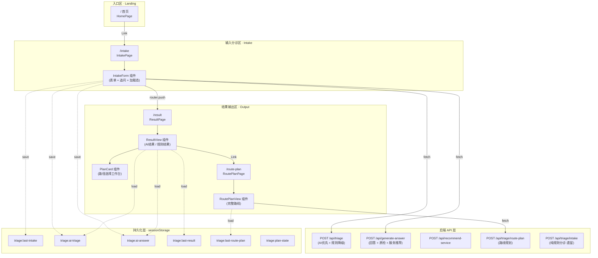
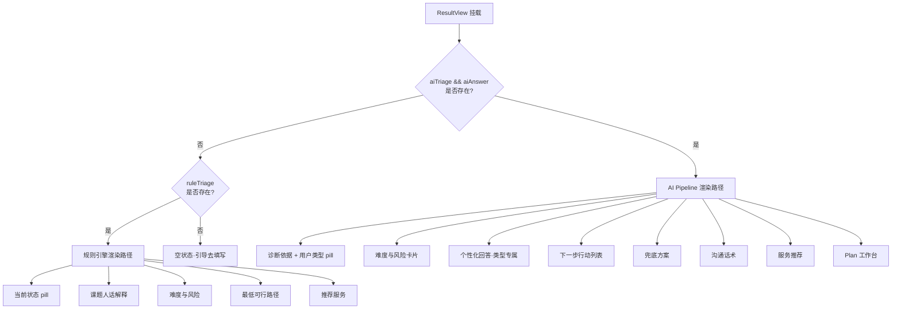
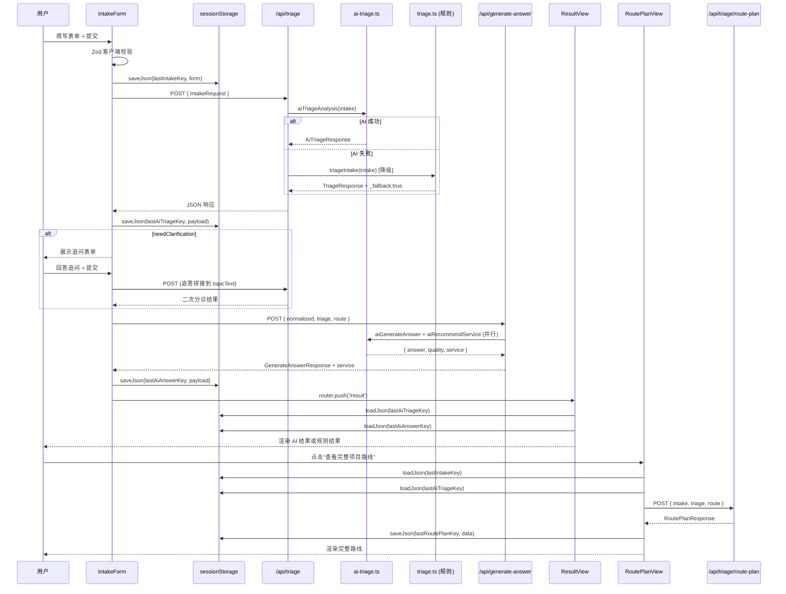
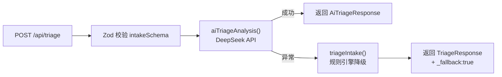

本文档从宏观视角解析科研课题分诊台的**页面分区设计**与**端到端数据流转机制**。项目采用 Next.js App Router 架构，将用户的核心操作路径组织为三个功能区域——**入口区**、**输入分诊区**和**结果输出区**——形成一条从"课题描述"到"可执行方案"的完整工作流管线。你将在这里理解页面如何分区、数据如何在前端组件与后端 API 之间流转、以及双管线（AI / 规则引擎）的降级策略如何在架构层面实现。
Sources: [page.tsx](src/app/page.tsx#L1-L49), [layout.tsx](src/app/layout.tsx#L1-L24)

## 架构全景图

在深入细节之前，先用一张全局视图建立整体认知。下图展示了三个功能区域的页面组成、组件嵌套关系以及后端 API 端点：



## 三区布局详解

项目将用户工作流拆分为三个在功能上解耦、在数据上串联的区域。每个区域对应一个或多个 Next.js 页面路由，由 `app-shell` 容器统一包裹，最大宽度限制为 `1160px`，居中展示。
Sources: [globals.css](src/app/globals.css#L61-L67)

### 区域一：入口区（Landing）

**对应路由**：`/`（根路径）

入口区是一个**纯展示型页面**，不涉及任何 API 调用或状态管理。它的职责是完成**用户心智建设**——告诉用户"这个工具做什么"以及"你能看到什么"。页面采用 CSS Grid 实现双栏布局（`hero-layout`），左侧 `.hero-card` 承载主标题和行动按钮，右侧 `.hero-side` 以两个 `.insight-card` 分别展示预期产出和安全边界说明。

布局关键参数：左栏 `1.3fr`、右栏 `0.7fr`（最小宽度 `300px`），最小高度撑满视口减去 `120px` 上下间距。两个 CTA 按钮均指向 `/intake`，引导用户进入分诊区。

| 元素 | 作用 | 文件位置 |
|------|------|----------|
| `.hero-card` | 主标题 + 描述 + pill 标签 + CTA 按钮 | [page.tsx](src/app/page.tsx#L6-L27) |
| `.hero-side > .insight-card` | 预期产出说明 + 安全边界声明 | [page.tsx](src/app/page.tsx#L29-L46) |
| `.pill-row` | 产品定位标签（中文学生用户/文本优先/先分诊再回答） | [page.tsx](src/app/page.tsx#L13-L17) |

Sources: [page.tsx](src/app/page.tsx#L1-L49), [globals.css](src/app/globals.css#L77-L83)

### 区域二：输入分诊区（Intake）

**对应路由**：`/intake`

输入分诊区是整个工作流中**唯一的用户交互入口**，由 `IntakeForm` 组件独占渲染。该组件管理三种 UI 状态，通过 `PendingState` 联合类型控制渲染分支：

| PendingState | UI 表现 | 用户操作 |
|---|---|---|
| `idle` | 表单主体（5 个 select + 1 个 textarea） | 填写并提交 |
| `submitting` | 全屏加载遮罩 + 5 步分析进度动画 | 等待 |
| `clarifying` | 追问表单（动态 textarea 列表） | 回答追问或跳过 |
| `generating` | 全屏加载遮罩 + 回答生成提示 | 等待 |
| `error` | 表单主体 + 红色错误横幅 | 修正后重试 |

表单结构采用 `.form-grid` 双栏网格排列 5 个枚举字段（任务类型、卡点、基础、截止时间、目标），课题文本区域独占整行。前端使用 Zod schema（`intakeSchema`）在提交前执行**客户端校验**，字段级错误通过 `TriageFieldErrors` 类型映射到对应控件下方展示。
Sources: [intake-form.tsx](src/components/intake-form.tsx#L21-L126), [intake-form.tsx](src/components/intake-form.tsx#L280-L419)

**表单提交后的核心数据流**：

1. **Zod 校验**通过后，将 `IntakeRequest` 序列化存入 `sessionStorage`（key: `triage:last-intake`）
2. 发起 `POST /api/triage`，后端优先走 AI 管线，失败时自动降级到规则引擎
3. 若返回 `clarification.needClarification === true`，切换到追问状态
4. 追问回答被拼接到 `topicText` 后重新调用 `/api/triage`
5. 分诊成功后，自动调用 `POST /api/generate-answer` 生成回答、质检、服务推荐
6. 所有中间产物写入 `sessionStorage`，然后 `router.push('/result')` 跳转到结果区

Sources: [intake-form.tsx](src/components/intake-form.tsx#L73-L126), [intake-form.tsx](src/components/intake-form.tsx#L170-L204)

### 区域三：结果输出区（Output）

**对应路由**：`/result`、`/route-plan`

结果输出区由两个页面组成，共享同一套从 `sessionStorage` 加载的数据源。`ResultView` 组件在挂载时通过 `useEffect` 读取四组缓存数据（AI 分诊结果、AI 回答、规则引擎结果、Plan 选择状态），并根据数据是否存在切换**两条渲染路径**：



两种渲染路径均包含 `PlanCard` 工作台组件。`PlanCard` 提供 A/B/C/D 四条预设路径供用户选择，支持"简单解释"与"收敛推荐"两种模式切换，选中路径以有序列表形式记录在 `selectedPath` 数组中并持久化到 `sessionStorage`。

`RoutePlanView` 组件则从 `sessionStorage` 读取分诊数据，调用 `POST /api/triage/route-plan` 生成完整的四段式项目路线（交付物清单、阶段计划、风险兜底、汇报口径），同样有缓存优先策略。
Sources: [result-view.tsx](src/components/result-view.tsx#L55-L88), [result-view.tsx](src/components/result-view.tsx#L119-L236), [route-plan-view.tsx](src/components/route-plan-view.tsx#L9-L49), [plan-card.tsx](src/components/plan-card.tsx#L20-L87)

## 端到端数据流

将三个区域的数据流串联起来，形成一条完整的用户旅程管线。以下按请求时序排列每一个数据交互节点：



### sessionStorage 键值映射

整个前端状态持久化依赖 `sessionStorage` 的 6 个固定键，由 [storage.ts](src/lib/storage.ts) 统一管理。所有写入均为 JSON 序列化，读取时带 `try-catch` 容错：

| 键名 | 写入时机 | 读取组件 | 数据类型 |
|------|----------|----------|----------|
| `triage:last-intake` | 表单提交时 | `RoutePlanView` | `IntakeRequest` |
| `triage:ai-triage` | 分诊 API 返回时 | `ResultView`、`RoutePlanView` | `AiTriageResponse` |
| `triage:ai-answer` | 回答生成 API 返回时 | `ResultView` | `{ answer, quality, service }` |
| `triage:last-result` | 规则引擎返回时 | `ResultView` | `TriageResponse` |
| `triage:last-route-plan` | 路线 API 返回时 | `RoutePlanView`（缓存优先） | `RoutePlanResponse` |
| `triage:plan-state` | 用户选择 Plan 路径时 | `ResultView`（PlanCard） | `string[]` |

Sources: [storage.ts](src/lib/storage.ts#L1-L31)

## 双管线架构：AI 优先与规则引擎降级

后端 API 层采用**AI 优先、规则兜底**的双管线设计。这一策略在 `/api/triage` 端点中体现得最为清晰：

[route.ts](src/app/api/triage/route.ts) 的 `POST` 处理函数首先尝试调用 `aiTriageAnalysis`（走 DeepSeek API），如果抛出异常，则在 `catch` 块中调用 `ruleTriage`（纯函数，零网络依赖）作为降级路径。降级结果会附加 `_fallback: true` 标记，前端可通过此标记感知到降级发生。



两条管线的输出类型不同：AI 管线返回 `AiTriageResponse`（包含 `normalized`、`triage`、`clarification`、`route` 四个结构化字段），规则引擎返回 `TriageResponse`（包含 `userProfile`、`taskCategory`、`minimumPath` 等字段）。`ResultView` 组件通过检测 `aiTriage && aiAnswer` 是否同时存在来决定走哪条渲染路径。

Sources: [route.ts](src/app/api/triage/route.ts#L1-L39), [ai-triage.ts](src/lib/ai-triage.ts#L50-L101), [triage.ts](src/lib/triage.ts#L30-L65)

## API 端点总览

| 端点 | 方法 | 核心职责 | 依赖管线 |
|------|------|----------|----------|
| `/api/triage` | POST | 主分诊：AI 分析 → 输入归一化 + 用户分类 + 澄清判断 + 回答路由 | AI 优先，规则降级 |
| `/api/triage/intake` | POST | 纯规则分诊（遗留端点） | 仅规则引擎 |
| `/api/generate-answer` | POST | 回答生成 + 质量检查 + 服务推荐（并行） | 仅 AI |
| `/api/recommend-service` | POST | 独立服务推荐 | 仅 AI |
| `/api/triage/route-plan` | POST | 完整项目路线生成 | 规则引擎（`buildRoutePlan`） |

Sources: [route.ts](src/app/api/triage/route.ts#L1-L39), [intake/route.ts](src/app/api/triage/intake/route.ts#L1-L30), [generate-answer/route.ts](src/app/api/generate-answer/route.ts#L1-L43), [recommend-service/route.ts](src/app/api/recommend-service/route.ts#L1-L35), [route-plan/route.ts](src/app/api/triage/route-plan/route.ts#L1-L51)

## CSS 架构与响应式策略

整个项目使用**零依赖的纯 CSS 方案**（无 Tailwind、无 CSS Modules），通过 CSS 自定义属性（Custom Properties）构建设计令牌系统。核心设计变量定义在 `:root` 中，涵盖颜色、阴影、圆角等 14 个令牌值。

布局系统的层级关系为：

```
.app-shell (max-width: 1160px, 居中)
  └── .hero-layout / .form-shell / .result-shell (各区域容器)
       └── .panel (通用卡片样式：磨砂玻璃 + 圆角 + 阴影)
            └── .form-grid / .result-grid (双栏网格)
```

响应式断点设在 `900px`，在该阈值以下所有 Grid 布局折叠为单栏（`grid-template-columns: 1fr`），按钮和表单元素宽度拉满。`.panel` 的 `backdrop-filter: blur(16px)` 配合半透明背景色实现磨砂玻璃效果。
Sources: [globals.css](src/app/globals.css#L1-L17), [globals.css](src/app/globals.css#L69-L75), [globals.css](src/app/globals.css#L226-L236), [globals.css](src/app/globals.css#L324-L333), [globals.css](src/app/globals.css#L441-L475)

## 架构特征总结

| 维度 | 设计决策 | 收益 |
|------|----------|------|
| 页面组织 | 三区独立路由，非 SPA 单页 | 各区可独立刷新、URL 可分享 |
| 状态管理 | sessionStorage + 组件内 useState | 零框架依赖、会话级自动清理 |
| API 策略 | AI 优先 + 规则引擎同步降级 | 保证任何情况下都有可用结果 |
| 类型安全 | Zod schema 前后端共享 | 前端校验与后端校验使用同一份定义 |
| CSS 方案 | 纯 CSS + Custom Properties | 零构建开销、设计令牌全局一致 |
| 并发优化 | generate-answer 中 answer + quality + service 三路并行 | 减少用户等待时间 |

## 延伸阅读

- 要理解分诊 API 内部的 AI JSON 解析、Plan 归一化等细节，参阅 [Chat Pipeline：AI JSON 输出解析、Plan 归一化与产物生成](12-chat-pipeline-ai-json-shu-chu-jie-xi-plan-gui-yua-yu-chan-wu-sheng-cheng)
- 要了解规则引擎的分类逻辑与安全边界检测，参阅 [规则分诊引擎 triage.ts：用户分类、任务分类与风险评估](15-gui-ze-fen-zhen-yin-qing-triage-ts-yong-hu-fen-lei-ren-wu-fen-lei-yu-feng-xian-ping-gu)
- 要深入前端组件的交互设计，参阅 [ChatPanel 与 ChoiceButtons：结构化选项驱动的对话交互](18-chatpanel-yu-choicebuttons-jie-gou-hua-xuan-xiang-qu-dong-de-dui-hua-jiao-hu) 和 [SidePanel：画像展示、Plan 面板与文件预览的右侧工作区](19-sidepanel-hua-xiang-zhan-shi-plan-mian-ban-yu-wen-jian-yu-lan-de-you-ce-gong-zuo-qu)
- 要理解完整的类型系统契约，参阅 [核心类型定义 triage-types.ts：表单枚举、画像状态、Plan 结构与 API 响应](22-he-xin-lei-xing-ding-yi-triage-types-ts-biao-dan-mei-ju-hua-xiang-zhuang-tai-plan-jie-gou-yu-api-xiang-ying)
- 要了解 Research-Triage 子项目（新管线）与根项目（旧管线）的关系，参阅 [根项目旧管线与新管线的对比与迁移路径](8-gen-xiang-mu-jiu-guan-xian-yu-xin-guan-xian-de-dui-bi-yu-qian-yi-lu-jing)