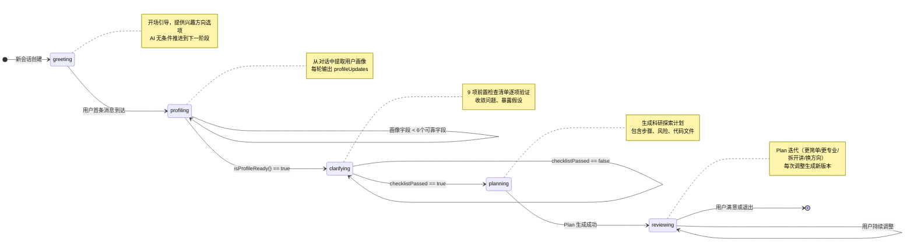
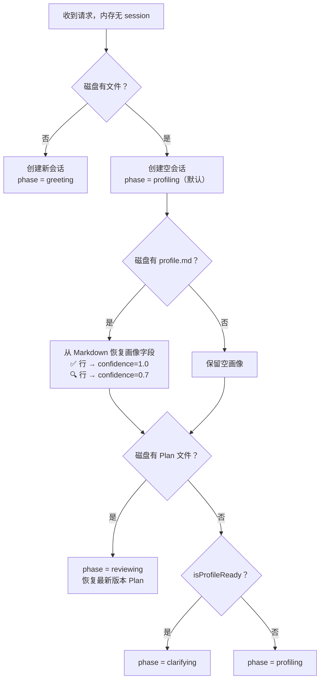

本文档深入解析 Research-Triage 项目中最核心的对话控制机制——**五阶段有限状态机**。这套状态机驱动了从"用户初次进入"到"科研探索计划交付"的完整会话生命周期，是整个分诊系统的骨架。理解它，就理解了系统如何将自由对话逐步收敛为可执行的科研计划。

Sources: [triage-types.ts](Research-Triage/src/lib/triage-types.ts#L169-L169), [chat-pipeline.ts](Research-Triage/src/lib/chat-pipeline.ts#L629-L647)

## 阶段总览与状态流转图

系统定义了五个对话阶段，类型声明为 `Phase` 联合类型。每个阶段有独立的 AI 指令模板、输出格式约束和推进条件，形成一个**严格单向流转但有终态循环**的有限状态机。



**关键设计原则**：状态机不允许回退。一旦进入 `profiling` 就不会回到 `greeting`，一旦进入 `reviewing` 就永远停留在 `reviewing`（通过生成 Plan 新版本来响应用户反馈）。这种单向推进确保对话始终朝交付方向收敛。

Sources: [triage-types.ts](Research-Triage/src/lib/triage-types.ts#L168-L169), [chat-pipeline.ts](Research-Triage/src/lib/chat-pipeline.ts#L629-L647), [route.ts](Research-Triage/src/app/api/chat/route.ts#L458-L459)

## getNextPhase：状态转换的纯函数引擎

阶段推进的核心逻辑封装在 `getNextPhase` 纯函数中，它接收四个参数，返回下一个阶段：

| 参数 | 类型 | 含义 |
|------|------|------|
| `currentPhase` | `Phase` | 当前所处阶段 |
| `memory` | `UserProfileMemory` | 用户画像记忆（含 10 个置信度标记字段） |
| `planState` | `PlanState \| null` | 本轮是否成功生成/提取了 Plan |
| `checklistPassed` | `boolean` | clarifying 阶段的 9 项检查是否全部通过 |

转换规则表：

| 当前阶段 | 推进条件 | 目标阶段 |
|----------|----------|----------|
| `greeting` | 无条件 | `profiling` |
| `profiling` | `isProfileReady(memory)` → true | `clarifying` |
| `profiling` | 画像未就绪 | `profiling`（停留） |
| `clarifying` | `checklistPassed` && `planState` 已存在 | `reviewing` |
| `clarifying` | `checklistPassed` && 无 planState | `planning` |
| `clarifying` | 检查未通过 | `clarifying`（停留） |
| `planning` | `planState` 成功生成 | `reviewing` |
| `planning` | Plan 解析失败 | `planning`（停留） |
| `reviewing` | 无条件 | `reviewing`（终态循环） |

值得注意的是 `clarifying → reviewing` 的双路径设计：当 `checklistPassed` 为 true 时，如果 AI 在同一轮已经输出了 Plan（`planState` 非空），直接跳入 `reviewing`；否则先进入 `planning` 阶段触发一次额外的 AI 调用来生成 Plan。这解释了 `/api/chat` 路由中 `clarifying` 阶段那段特殊的二次 AI 调用逻辑。

Sources: [chat-pipeline.ts](Research-Triage/src/lib/chat-pipeline.ts#L629-L647), [route.ts](Research-Triage/src/app/api/chat/route.ts#L334-L378), [route.ts](Research-Triage/src/app/api/chat/route.ts#L426-L431)

## 各阶段职责与 AI 输出契约

每个阶段拥有独立的 Prompt 指令（通过 `getInstructionForPhase` 分发），对应不同的 JSON 输出格式。下面逐一解析。

### greeting：开场引导

**职责**：系统首次与用户接触，输出欢迎语并提供 3-4 个兴趣方向的结构化选项。

**输出格式**：
```json
{
  "reply": "陈述句开场白（禁止问号）",
  "questions": ["选项A", "选项B", "选项C", "我不太理解这些，帮我找方向"]
}
```

**设计约束**：`reply` 必须是纯陈述句，所有追问必须放入 `questions` 数组。最后一个选项固定为"我不太理解这些，帮我找方向"——这是贯穿所有阶段的**逃生通道**机制，确保不知道如何选择的用户始终有路可走。

**推进机制**：`greeting` 阶段在用户发送首条消息后无条件推进到 `profiling`。即使在 AI 调用失败的降级路径中，系统也强制执行 `session.phase = "profiling"`。

Sources: [chat-prompts.ts](Research-Triage/src/lib/chat-prompts.ts#L42-L64), [chat-prompts.ts](Research-Triage/src/lib/chat-prompts.ts#L196-L200), [route.ts](Research-Triage/src/app/api/chat/route.ts#L202-L204)

### profiling：画像识别

**职责**：通过多轮对话逐步提取用户画像，同时维持自然对话流。

**输出格式**：
```json
{
  "reply": "回应 + 引导语",
  "questions": ["选项A", "选项B", "我不太理解这些，帮我找方向"],
  "profileUpdates": [
    {"field": "interestArea", "value": "机器学习", "confidence": 0.7}
  ]
}
```

**画像字段**（共 10 个）：`ageOrGeneration`、`educationLevel`、`toolAbility`、`aiFamiliarity`、`researchFamiliarity`、`interestArea`、`currentBlocker`、`deviceAvailable`、`timeAvailable`、`explanationPreference`。

**推进条件**：`isProfileReady(memory)` 返回 true——即 10 个字段中至少有 **6 个**字段的 `confidence >= 0.7`。这个阈值设计使得系统不需要穷尽所有字段就能推进，允许在不完整画像的基础上继续工作。

**置信度体系**：

| confidence 值 | 含义 | 对应 source |
|---------------|------|-------------|
| 0.3 | 猜测 | `inferred` |
| 0.5 | AI 推断 | `inferred` |
| 0.7 | 用户暗示 | `deduced` |
| 1.0 | 用户明确说了 | `user_confirmed` |

Sources: [chat-prompts.ts](Research-Triage/src/lib/chat-prompts.ts#L66-L112), [memory.ts](Research-Triage/src/lib/memory.ts#L50-L63), [triage-types.ts](Research-Triage/src/lib/triage-types.ts#L122-L133)

### clarifying：问题收敛

**职责**：画像确立后，在生成 Plan 之前执行 9 项前置检查，确保问题边界清晰。

**9 项前置检查清单**：
1. 用户身份已确认？
2. 用户目标已收敛为一个明确问题？
3. 用户工具能力已确认？
4. 用户时间约束已明确？
5. 用户期望的交付物已明确？
6. 存在任何隐含假设？（必须在 reply 中列出）
7. 用户问题是否过大？
8. 用户想法在当前约束下是否可执行？
9. 用户是否要求跨越过多阶段？

**输出格式**：
```json
{
  "reply": "列出待确认的假设，或说明所有项已通过",
  "questions": ["追问选项A", "追问选项B", "我不太理解这些，帮我找方向"],
  "checklistPassed": false
}
```

**推进条件**：`checklistPassed === true`。当检查通过但本轮未生成 Plan 时，API 路由会自动发起第二次 AI 调用（使用 `PLANNING_INSTRUCTION`），在同一轮请求中完成 Plan 生成，用户感知上是无缝过渡。

Sources: [chat-prompts.ts](Research-Triage/src/lib/chat-prompts.ts#L114-L143), [route.ts](Research-Triage/src/app/api/chat/route.ts#L330-L378)

### planning：Plan 生成

**职责**：基于确认的画像和收敛的问题，生成完整的科研探索计划。

**输出格式**：
```json
{
  "reply": "简短提示（不重复 Plan 内容）",
  "plan": {
    "userProfile": "用户画像摘要",
    "problemJudgment": "当前问题判断",
    "systemLogic": "系统判断逻辑（含关键假设和证据边界）",
    "recommendedPath": "推荐路径",
    "actionSteps": ["步骤1：动作、时限、验证方式", "..."],
    "riskWarnings": ["风险1", "风险2"],
    "nextOptions": ["更简单", "更专业", "拆开讲", "换方向"]
  },
  "codeFiles": [{"filename": "...", "title": "...", "language": "...", "content": "..."}]
}
```

**关键设计**：`actionSteps` 要求 3-7 个具体可执行步骤，每步必须包含动作、时限和验证方法。`systemLogic` 必须说明关键假设和证据边界，体现"以假设形式呈现建议"的方法论要求。当任务需要代码时，`codeFiles` 输出最小可运行版本的完整代码。

**推进条件**：`planState` 非空（Plan JSON 解析成功或 Markdown 回退解析成功）。

Sources: [chat-prompts.ts](Research-Triage/src/lib/chat-prompts.ts#L145-L180), [chat-pipeline.ts](Research-Triage/src/lib/chat-pipeline.ts#L266-L305)

### reviewing：Plan 调整（终态循环）

**职责**：用户对已生成的 Plan 提出调整需求，系统生成新版本。

**调整维度**（由 `nextOptions` 驱动）：
- **更简单**：降低复杂度，缩短步骤
- **更专业**：增加深度和技术细节
- **拆开讲**：将某一步骤展开为子步骤
- **换方向**：基于相同画像探索不同路线

**版本管理**：每次调整生成新版本的 Plan，`version` 号递增，`modifiedReason` 记录用户反馈摘要。所有历史版本通过 `persistPlanArtifacts` 持久化到 Userspace 文件系统。

**推进条件**：无。`reviewing → reviewing` 是终态循环，用户可以无限次调整直到满意。

Sources: [chat-prompts.ts](Research-Triage/src/lib/chat-prompts.ts#L182-L193), [chat-pipeline.ts](Research-Triage/src/lib/chat-pipeline.ts#L645-L645)

## 会话恢复与阶段重建

系统支持从 Userspace 磁盘文件恢复会话状态。当内存中的 session 不存在但磁盘上有文件记录时，API 路由执行以下恢复逻辑：



**恢复策略的设计考量**：已度过 `greeting` 的回访用户不应再看到开场白，因此恢复默认从 `profiling` 开始。如果磁盘上已有 Plan 文件，直接跳到 `reviewing`——这是最安全的假设，因为 Plan 的存在意味着用户已经完成了所有前置阶段。

Sources: [route.ts](Research-Triage/src/app/api/chat/route.ts#L83-L155), [chat-pipeline.ts](Research-Triage/src/lib/chat-pipeline.ts#L486-L506)

## Prompt 构建与 Skills 注入

每个阶段的 AI 调用共享同一个 Prompt 构建流程 `buildChatSystemPrompt`，它将三个层次的信息叠加：

1. **Skills 方法论层**：通过 `buildSystemPrompt("")` 注入科学方法论五步约束，这是所有阶段共享的基础认知框架
2. **状态上下文层**：`buildStateContext` 注入当前对话阶段、画像就绪状态、已确认字段、研究方向、当前卡点以及 Plan 摘要
3. **阶段指令层**：`getInstructionForPhase` 返回的阶段专属指令（上文分析的五套 INSTRUCTION）

这三层叠加确保 AI 在每个阶段都能感知全局状态，同时遵守阶段特定的输出格式约束。

Sources: [chat-prompts.ts](Research-Triage/src/lib/chat-prompts.ts#L23-L40), [chat-prompts.ts](Research-Triage/src/lib/chat-prompts.ts#L5-L21)

## 降级路径中的状态机行为

当 AI 调用失败时，`buildFallbackTurn` 函数根据当前阶段和状态提供规则驱动的兜底回复。降级路径中的阶段推进遵循简化规则：

- **greeting 降级**：提供固定兴趣选项，强制推进到 `profiling`
- **画像未就绪降级**：提供经验/紧急度相关选项，停留在 `profiling`
- **画像就绪但无 Plan 降级**：提供目标收敛选项，停留在当前阶段
- **已有 Plan 降级**：提供调整选项，停留在 `reviewing`

降级路径的核心原则是**不阻塞状态机推进**——即使在 AI 完全不可用的情况下，greeting 阶段仍然会推进到 profiling，确保用户不会卡在开场。

Sources: [chat-pipeline.ts](Research-Triage/src/lib/chat-pipeline.ts#L518-L568), [route.ts](Research-Triage/src/app/api/chat/route.ts#L192-L236)

## 前端与状态机的协作

前端并不直接控制状态机——阶段推进完全由后端 `/api/chat` 路由在服务端执行。前端通过以下机制间接参与：

- **结构化选项驱动**：`ChoiceButtons` 组件渲染 AI 返回的 `questions` 数组，每个选项都是完整句子，用户点击即发送。前端还内置了占位符过滤（`isValidOption`）和逃生通道补充逻辑（确保"帮我找方向"始终存在）
- **处理摘要展示**：`ProcessPanel` 组件以可折叠面板形式展示 `process` 字段，其中包含 `buildProcessSummary` 生成的阶段流转信息、画像进度和处理模式
- **快照与撤销**：前端在每轮对话前保存完整状态快照（messages + profile + plan），支持通过 `handleUndo` 回退到上一轮状态

Sources: [choice-buttons.tsx](Research-Triage/src/components/choice-buttons.tsx#L10-L31), [process-panel.tsx](Research-Triage/src/components/process-panel.tsx#L10-L33), [page.tsx](Research-Triage/src/app/page.tsx#L165-L175), [chat-pipeline.ts](Research-Triage/src/lib/chat-pipeline.ts#L581-L627)

## 延伸阅读

- 阶段推进的具体 API 编排逻辑详见 [/api/chat 核心端点：请求编排、会话恢复与阶段推进](9-api-chat-he-xin-duan-dian-qing-qiu-bian-pai-hui-hua-hui-fu-yu-jie-duan-tui-jin)
- 画像字段提取与置信度机制的完整分析见 [用户画像记忆系统：置信度驱动的博弈式画像确立机制](11-yong-hu-hua-xiang-ji-yi-xi-tong-zhi-xin-du-qu-dong-de-bo-yi-shi-hua-xiang-que-li-ji-zhi)
- Plan JSON 解析与 Markdown 回退的健壮性设计见 [Chat Pipeline：AI JSON 输出解析、Plan 归一化与产物生成](12-chat-pipeline-ai-json-shu-chu-jie-xi-plan-gui-yi-hua-yu-chan-wu-sheng-cheng)
- 五套阶段指令的详细设计见 [阶段 Prompt 工程与 chat-prompts 阶段指令设计](13-jie-duan-prompt-gong-cheng-yu-chat-prompts-jie-duan-zhi-ling-she-ji)