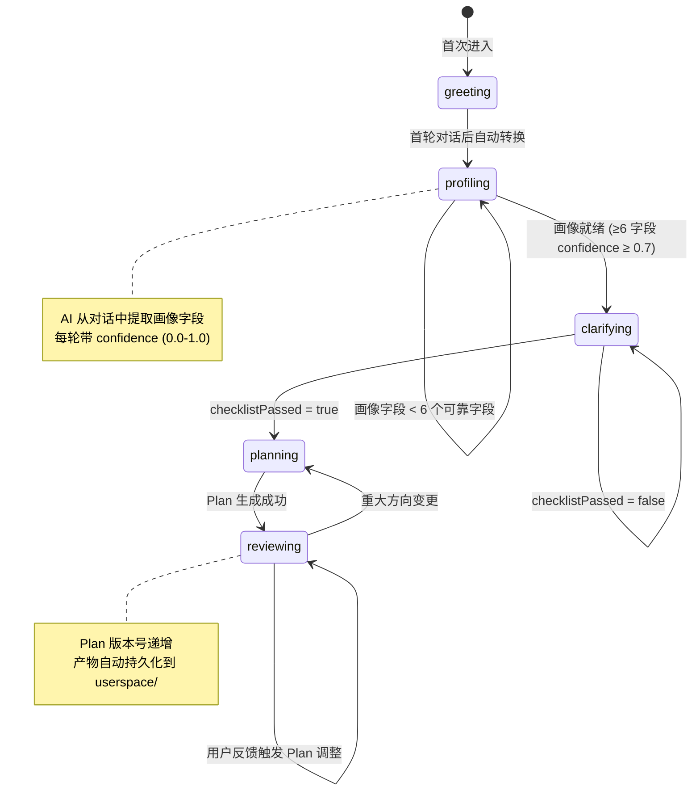

本文档对根项目 `src/` 下的**旧管线**（表单驱动的多页分诊流程）与 `Research-Triage/src/` 下的**新管线**（对话驱动的单页工作台）进行系统性的架构对比，并给出从旧管线向新管线迁移的完整路径。阅读本文需要先了解 [项目结构总览：根目录旧管线与 Research-Triage 演进关系](3-xiang-mu-jie-gou-zong-lan-gen-mu-lu-jiu-guan-xian-yu-research-triage-yan-jin-guan-xi) 中两套代码的物理布局。

Sources: [page.tsx](src/app/page.tsx#L1-L50), [page.tsx](Research-Triage/src/app/page.tsx#L1-L219)

## 架构范式：表单驱动 vs 对话驱动

旧管线和新管线的根本差异在于**用户交互范式**。旧管线采用经典的 Web 表单提交模式：用户在 `/intake` 页面填写结构化表单，系统在后端完成分诊后跳转到 `/result` 展示静态结果。新管线采用 Chat 工作台模式：用户进入首页即开始对话，AI 通过多轮对话逐步构建用户画像、收敛问题、生成 Plan，全程无页面跳转。

```
旧管线数据流：
  用户 → 表单 POST /api/triage → AI 分析 → POST /api/generate-answer → 结果页

新管线数据流：
  用户 → Chat POST /api/chat → 阶段状态机推进 → AI 对话+画像+Plan → 前端实时更新
```

旧管线的用户入口是一个包含 5 个下拉选择和 1 个文本域的静态表单，所有输入在提交前必须完整——这意味着用户必须在"不清楚课题"的状态下就做出精确选择（如 `backgroundLevel` 选"完全小白"还是"有一点基础"）。新管线将信息采集过程分散到多轮对话中，由 AI 根据用户的自然语言回复自动推断画像字段，并通过置信度机制渐进式建立认知。

Sources: [intake-form.tsx](src/components/intake-form.tsx#L39-L126), [route.ts](src/app/api/triage/route.ts#L8-L39), [route.ts](Research-Triage/src/app/api/chat/route.ts#L70-L155)

## 核心模块对比

下表从 8 个维度对比两套管线的架构差异：

| 维度 | 旧管线（根项目 `src/`） | 新管线（`Research-Triage/src/`） |
|------|--------------------------|----------------------------------|
| **交互模式** | 多页表单，`/intake` → `/result` → `/route-plan` | 单页 Chat 工作台，三区布局 |
| **API 端点** | 4 个独立端点：`/api/triage`、`/api/generate-answer`、`/api/recommend-service`、`/api/triage/route-plan` | 1 个统一端点：`/api/chat` + 1 个文件端点：`/api/userspace` |
| **分诊引擎** | 规则引擎 `triage.ts` + AI 引擎 `ai-triage.ts`（双轨降级） | 阶段 Prompt + AI 对话（含 JSON 解析失败兜底） |
| **用户画像** | 静态枚举分类：5 种 Profile（完全小白型/基础薄弱型/普通项目型/科研能力型/焦虑决策型） | 置信度驱动 10 字段画像系统，博弈式渐进确立 |
| **状态管理** | 客户端 `sessionStorage`，无服务端会话 | 服务端 `Map<sessionId, Session>` + 磁盘 `userspace/` |
| **Plan 生成** | 规则模板 `route-plan.ts`，硬编码步骤 | AI 实时生成 JSON Plan，支持版本迭代和用户调整 |
| **Prompt 体系** | 7 个外部 `.md` 模板（`prompt_templates/`，未被代码直接加载） | 阶段指令 `chat-prompts.ts` + Skills 方法论注入 |
| **产物管理** | 无持久化，纯前端 sessionStorage | `userspace/` 文件系统：profile.md、plan-v{n}.md、code files |

Sources: [triage.ts](src/lib/triage.ts#L30-L65), [ai-triage.ts](src/lib/ai-triage.ts#L50-L101), [chat-pipeline.ts](Research-Triage/src/lib/chat-pipeline.ts#L6-L37), [chat-prompts.ts](Research-Triage/src/lib/chat-prompts.ts#L195-L201), [memory.ts](Research-Triage/src/lib/memory.ts#L27-L63), [userspace.ts](Research-Triage/src/lib/userspace.ts#L33-L186)

## 旧管线架构详解

### 表单提交与多端点编排

旧管线的数据流经过 4 个独立 API 端点，每个端点承担单一职责。`/api/triage/intake` 是纯规则分诊入口，`/api/triage` 是 AI 增强分诊入口（失败时降级为规则引擎），`/api/generate-answer` 并行调用回答生成和质量检查两个 AI 任务，`/api/triage/route-plan` 将 AI 管线产出的 `TriageResult` 转换为旧格式 `TriageResponse` 后再调用规则模板生成路线。

```
┌──────────┐    POST /api/triage     ┌──────────────┐
│ IntakeForm├────────────────────────►│ AI Triage     │──┐ (fallback)
│ (表单)    │                         │ ai-triage.ts  │  │
└──────────┘                         └──────────────┘  ▼
                                              规则 triage.ts 降级
       │                                          │
       │         POST /api/generate-answer         ▼
       ├────────────────────────────────►┌──────────────┐
       │                                  │ 答案+质量检查   │ (并行)
       │                                  └──────────────┘
       │         POST /api/triage/route-plan  │
       ├────────────────────────────────►┌──────────────┐
       │                                  │ 规则路线模板    │
       │                                  │ route-plan.ts │
       ▼                                  └──────────────┘
  /result 页 (静态展示)
```

这种设计的核心问题是**信息采集与决策割裂**：用户必须在不知道分诊结果的情况下完成所有输入，系统无法根据用户已提供的信息动态追问。`/api/triage/route/route.ts` 中的 `answerToCategory` 映射表揭示了 AI 管线产出与旧格式之间的阻抗不匹配——需要手动将 `answerMode`（如 `plain_explain`）反向映射为 `taskCategory`（如 `课题理解`）。

Sources: [route.ts](src/app/api/triage/route.ts#L1-L39), [route.ts](src/app/api/triage/route-plan/route.ts#L7-L51), [generate-answer route.ts](src/app/api/generate-answer/route.ts#L26-L43)

### 规则分诊引擎的核心逻辑

旧管线的 `triage.ts` 是一个纯函数式规则引擎，`triageIntake(input)` 函数通过 7 个顺序执行的分类函数产出完整的 `TriageResponse`：安全模式检测 → 用户画像分类 → 任务分类 → 阶段分类 → 难度评分 → 风险列表 → 最小路径。用户画像分类 (`classifyUserProfile`) 的判断逻辑是硬编码的 if-else 链：先检测焦虑词、再匹配背景等级、最后用任务类型兜底。难度评分 (`classifyDifficulty`) 采用加权计分模型：任务类型权重 1-3、背景等级反向权重 -1 到 2、截止时间加成 1-2 分，最终通过阈值切分为四档。

Sources: [triage.ts](src/lib/triage.ts#L30-L217), [triage.ts](src/lib/triage.ts#L219-L282)

### AI 管线的外部 Prompt 模板

`prompt_templates/` 目录包含 7 个 Markdown 模板（`triage_classifier.md`、`response_router.md`、`answer_generator.md` 等），定义了完整的七阶段分诊工作流。然而这些模板在代码中**并未被直接加载**——`ai-triage.ts` 中的 AI 调用直接在代码中内联了 JSON schema 和约束指令。这意味着模板文件是设计文档而非运行时配置，存在文档与实现的漂移风险。

Sources: [triage_classifier.md](prompt_templates/triage_classifier.md#L1-L79), [response_router.md](prompt_templates/response_router.md#L1-L82), [ai-triage.ts](src/lib/ai-triage.ts#L50-L101)

## 新管线架构详解

### 阶段状态机

新管线的核心架构特征是 **五阶段状态机**，驱动整个对话流程的推进。每个会话（`sessionId`）在服务端维护当前阶段（`Phase`），阶段转换由 `getNextPhase()` 函数根据画像就绪状态、Plan 产出和检查清单通过情况自动决策：



这个状态机的设计确保了**信息充分性前置约束**：在 `profiling` 阶段，系统不会在画像不完整时盲目推进；在 `clarifying` 阶段，9 项前置检查清单全部通过后才允许生成 Plan。`getNextPhase()` 的实现极其简洁——仅 8 行代码的条件链——但它编码了整个业务流程的推进逻辑。

Sources: [chat-pipeline.ts](Research-Triage/src/lib/chat-pipeline.ts#L629-L647), [route.ts](Research-Triage/src/app/api/chat/route.ts#L426-L431)

### 统一 API 端点与请求编排

新管线的 `/api/chat` 端点是一个**请求编排器**，单次 POST 请求内部完成以下全部操作：会话恢复（含磁盘数据重建） → 用户消息追加 → 阶段指令构建 → AI 调用 → JSON 解析（含重试） → 画像更新 → Plan 提取与持久化 → 检查清单判定 → 阶段转换。当 `clarifying` 阶段的 `checklistPassed=true` 且未产出 Plan 时，编排器会在**同一请求内**自动追加一次 `planning` 阶段的 AI 调用——这意味着一次用户消息可能触发两次 AI 请求，但对前端透明。

```
/api/chat POST 请求内部时序：
  1. 会话查找 or 磁盘恢复
  2. 构建阶段 systemPrompt (skills + stateContext + phaseInstruction)
  3. AI 调用 (primary)
  4. JSON 解析 → 失败则重试 (json_retry)
  5. 画像字段更新 (profileUpdates)
  6. Plan 提取 + 代码文件提取
  7. [条件] clarifying→planning 自动追加 AI 调用
  8. 产物持久化到 userspace/
  9. 阶段转换决策 (getNextPhase)
  10. 返回聚合响应 (reply + questions + profile + plan + process)
```

Sources: [route.ts](Research-Triage/src/app/api/chat/route.ts#L70-L494), [route.ts](Research-Triage/src/app/api/chat/route.ts#L334-L378)

### 置信度驱动的画像记忆系统

新管线用 10 字段的 `UserProfileMemory` 替代了旧管线的 5 类枚举 `UserProfile`。每个字段携带独立的三元组 `{ value, confidence, source }`——`confidence` 从 0.0（纯猜测）到 1.0（用户明确确认），`source` 标记信息来源（`inferred`/`deduced`/`user_confirmed`）。系统通过两个阈值定义"已识别"和"可靠"：`confidence >= 0.3` 为已识别信号，`confidence >= 0.7` 为可靠字段。画像就绪条件是 **≥6 个可靠字段**。

AI 在每轮对话中通过 `profileUpdates` 数组返回推断结果，例如 `{ field: "interestArea", value: "AI与机器学习", confidence: 0.7 }`。系统根据置信度自动映射 `source`：`1.0` → `user_confirmed`，`≥0.7` → `deduced`，`<0.7` → `inferred`。这种设计允许 AI 在不确定时"不填"——不确定的字段被留到下一轮通过 `questions` 追问，而非像旧管线那样必须在提交时就强制选择。

Sources: [memory.ts](Research-Triage/src/lib/memory.ts#L1-L93), [route.ts](Research-Triage/src/app/api/chat/route.ts#L298-L327)

### Plan 产物持久化与版本管理

新管线引入了 `userspace/` 文件系统，为每个 `sessionId` 维护独立的目录结构。每次 Plan 生成或更新时，`persistPlanArtifacts()` 同步写入 5 类文件：`plan-v{n}.md`（完整 Plan Markdown）、`summary.md`（一句话摘要）、`action-checklist.md`（行动检查清单）、`research-path.md`（科研路径说明），以及零或多个 `code-v{n}-{filename}` 代码文件。每个文件通过 `manifest.json` 注册，形成可查询的文件清单。

```
userspace/{sessionId}/
├── manifest.json          # 文件清单注册表
├── profile.md             # 用户画像（含 confidence 图标标记）
├── plan-v1.md             # 首版 Plan
├── plan-v2.md             # 调整后 Plan
├── summary.md             # 当前科研探索摘要
├── action-checklist.md    # 行动检查清单
├── research-path.md       # 科研路径说明
└── code-v2-forward.m      # 代码产物示例
```

版本管理通过 `plan.version` 字段实现——每次 Plan 变更时版本号递增，旧版本文件保留不删除。`restoreLatestPlan()` 从 `manifest.json` 中筛选 `type="plan"` 的最新版本进行磁盘恢复，确保服务重启后会话可重建。

Sources: [userspace.ts](Research-Triage/src/lib/userspace.ts#L33-L186), [chat-pipeline.ts](Research-Triage/src/lib/chat-pipeline.ts#L399-L506)

## AI Provider 层的演进

两套管线的 AI Provider 都基于裸 `fetch` 调用 OpenAI 兼容的 `/chat/completions` 端点，但新管线做了三个关键改进：

**多 Provider 支持**：旧管线硬编码 DeepSeek 环境变量（`DEEPSEEK_BASE_URL`、`DEEPSEEK_API_KEY`）；新管线通过优先级链 `AI_BASE_URL → DEEPSEEK_BASE_URL → OPENAI_BASE_URL` 支持任意 OpenAI 兼容 Provider，只需修改 `.env` 即可切换。

**多轮对话支持**：旧管线的 `chat()` 函数仅支持单轮调用（`prompt` + `system`）；新管线新增 `messages` 参数，允许传入完整的消息数组，支持上下文延续。同时新增 `maxTokens` 参数防止长输出被截断。

**结构化返回**：旧管线返回裸字符串 `Promise<string>`；新管线返回 `{ content: string }` 对象，为未来扩展（如 token 使用量）预留了空间。

Sources: [ai-provider.ts](src/lib/ai-provider.ts#L1-L56), [ai-provider.ts](Research-Triage/src/lib/ai-provider.ts#L1-L117)

## JSON 解析容错的演进

旧管线的 `parseJsonFromText()` 采用三级降级策略：直接解析 → 提取 Markdown 代码块 → 查找首尾花括号。新管线的同名函数增加了**平衡括号候选提取**（`extractBalancedJsonCandidates`）和**协议 JSON 识别**（`isProtocolJson`），从文本中所有 `{` 位置出发，跟踪字符串内外状态和括号深度，提取所有合法的平衡 JSON 候选，并验证是否包含已知协议字段（`reply`、`questions`、`profileUpdates`、`plan` 等）。此外还有**不完整 JSON 修复**：当检测到深度 > 0（括号未闭合）时，自动补齐缺失的 `}`。

这些改进直接应对了 AI 输出不稳定的核心挑战——在 `planning`/`reviewing` 等高复杂度阶段，AI 经常输出包含 Plan JSON 的超长文本，新管线的容错能力显著高于旧管线。

Sources: [ai-triage.ts](src/lib/ai-triage.ts#L21-L42), [chat-pipeline.ts](Research-Triage/src/lib/chat-pipeline.ts#L6-L86)

## 迁移路径

### 迁移策略：增量替换而非大爆炸

推荐采用**功能逐项迁移**策略，而非一次性切换。新管线已独立运行在 `Research-Triage/` 子目录中，两个管线共享根目录的 `package.json` 和 `next.config.mjs`，但拥有独立的 `src/` 目录——这意味着迁移可以在不影响旧管线的前提下逐步推进。

### 迁移阶段规划

**阶段一：基础层对齐（AI Provider + 类型系统）**

将 `Research-Triage/src/lib/ai-provider.ts` 的多 Provider 版本替换根项目的旧版本。这涉及两处变更：环境变量命名（`DEEPSEEK_*` → `AI_*`）和返回类型（`string` → `ChatResult`）。旧管线中 `ai-triage.ts` 的所有 `chat()` 调用需要适配新的返回类型，从 `const text = await chat({...})` 改为 `const { content } = await chat({...})`。

同时需要将 `Research-Triage/src/lib/triage-types.ts` 中的新类型（`ChatMessage`、`UserProfileState`、`PlanState`、`Phase`、`CodeFileArtifact`、`FileManifest`）合并到根项目的类型文件中。旧类型的枚举定义（`taskTypes`、`currentBlockers` 等）应保留向后兼容。

Sources: [ai-provider.ts](Research-Triage/src/lib/ai-provider.ts#L18-L31), [ai-provider.ts](src/lib/ai-provider.ts#L1-L56)

**阶段二：核心模块引入（memory + chat-pipeline + chat-prompts + userspace + skills）**

将新管线的 5 个核心模块复制到根项目 `src/lib/` 目录：`memory.ts`（画像记忆系统）、`chat-pipeline.ts`（JSON 解析 + Plan 产物管理）、`chat-prompts.ts`（阶段指令）、`userspace.ts`（文件系统持久化）、`skills.ts`（方法论注入）。同时将 `Research-Triage/skills/` 目录复制到根项目。这一步不需要修改任何现有代码，仅为引入新模块。

Sources: [memory.ts](Research-Triage/src/lib/memory.ts#L1-L93), [chat-pipeline.ts](Research-Triage/src/lib/chat-pipeline.ts#L1-L86), [userspace.ts](Research-Triage/src/lib/userspace.ts#L1-L186)

**阶段三：API 路由层整合**

将 `Research-Triage/src/app/api/chat/route.ts` 引入根项目的 API 路由。此阶段需要同步引入 `Research-Triage/src/app/api/userspace/[sessionId]/[[...filename]]/` 文件服务端点。整合后的根项目将同时支持旧的 `/api/triage` 系列端点和新的 `/api/chat` 端点，前端可以选择性迁移。

**阶段四：前端迁移**

将 `Research-Triage/src/components/` 下的 9 个新组件（`chat-panel.tsx`、`chat-input.tsx`、`choice-buttons.tsx`、`side-panel.tsx`、`plan-panel.tsx`、`plan-history-panel.tsx`、`process-panel.tsx`、`doc-panel.tsx`、`file-list.tsx`）迁移到根项目的 `src/components/` 目录。将 `Research-Triage/src/app/page.tsx` 的 Chat 工作台页面设为默认首页，旧的表单页面保留为 `/intake` 路由的备选入口。

Sources: [page.tsx](Research-Triage/src/app/page.tsx#L1-L219)

### 迁移风险与缓解

| 风险 | 影响 | 缓解措施 |
|------|------|----------|
| AI Provider 返回类型不兼容 | 旧管线所有 AI 调用编译失败 | 先适配返回类型，再统一替换 |
| `userspace/` 目录权限 | 文件写入失败 | 部署前确认 Node.js 进程对 `userspace/` 有写权限 |
| 新管线内存会话丢失 | 服务重启后所有活跃会话状态清空 | 已有磁盘恢复机制，但仅恢复画像和 Plan，对话历史不可恢复 |
| 旧管线 `prompt_templates/` 与实现漂移 | 迁移后 Prompt 模板文件变成死代码 | 迁移完成后清理 `prompt_templates/` 目录 |

Sources: [route.ts](Research-Triage/src/app/api/chat/route.ts#L38-L46), [userspace.ts](Research-Triage/src/lib/userspace.ts#L8-L30)

## 迁移后架构展望

完成迁移后的统一架构将呈现以下形态：`/api/chat` 作为唯一的业务端点，承担完整的对话编排职责；旧管线的规则引擎 `triage.ts` 和路线模板 `route-plan.ts` 作为**降级后备**保留，在 AI 调用失败时由 `buildFallbackTurn()` 提供结构化兜底；`prompt_templates/` 中的设计文档被 `chat-prompts.ts` 的阶段指令和 `skills/` 的方法论注入完全替代；前端统一为 Chat 工作台三区布局，右侧面板实时展示画像、Plan 和文件产物。

下一阶段的技术深入建议按以下顺序阅读：[/api/chat 核心端点：请求编排、会话恢复与阶段推进](9-api-chat-he-xin-duan-dian-qing-qiu-bian-pai-hui-hua-hui-fu-yu-jie-duan-tui-jin) → [用户画像记忆系统：置信度驱动的博弈式画像确立机制](11-yong-hu-hua-xiang-ji-yi-xi-tong-zhi-xin-du-qu-dong-de-bo-yi-shi-hua-xiang-que-li-ji-zhi) → [Chat Pipeline：AI JSON 输出解析、Plan 归一化与产物生成](12-chat-pipeline-ai-json-shu-chu-jie-xi-plan-gui-yu-chan-wu-sheng-cheng)。