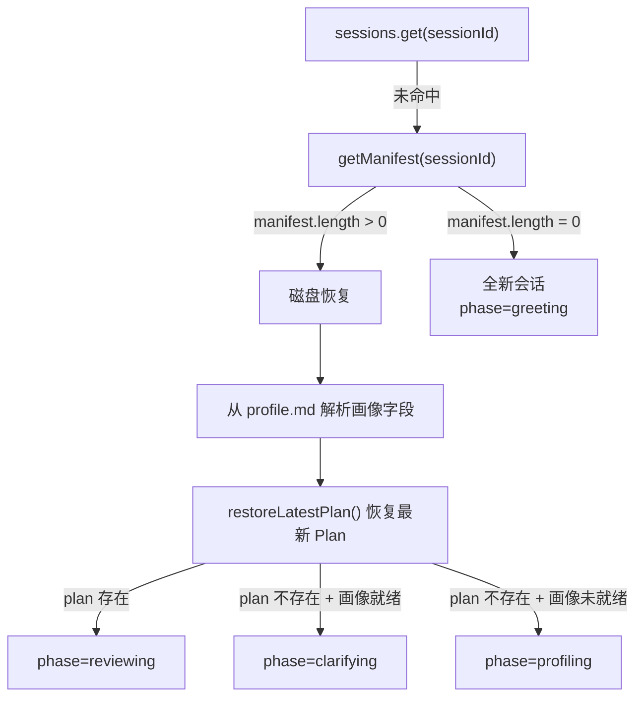
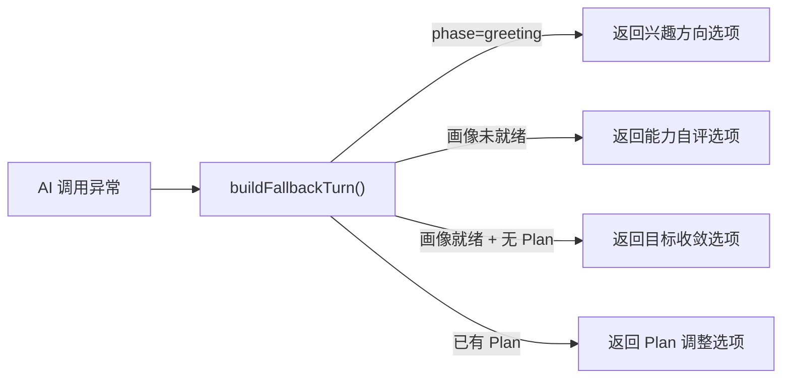
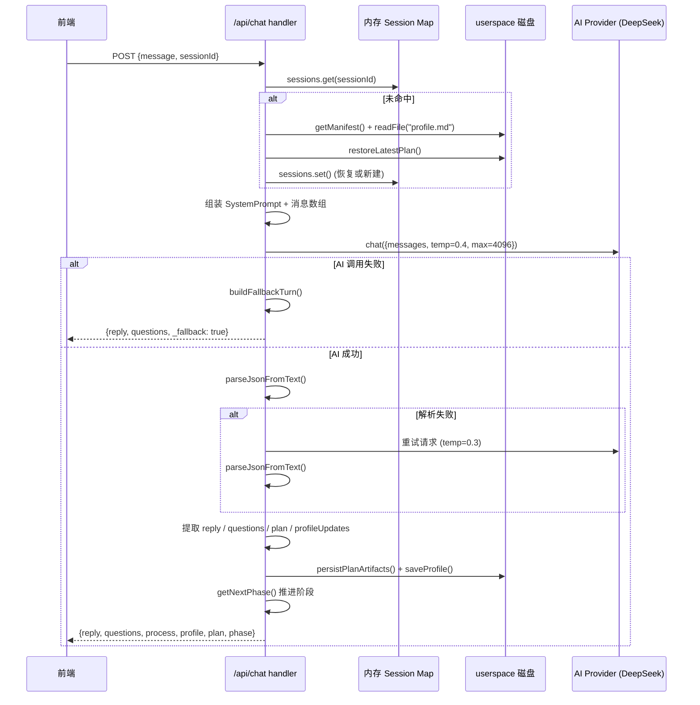

`/api/chat` 是 Research-Triage 新管线的**唯一对话入口**，承担了从请求校验、会话恢复、AI 调用编排、JSON 解析与 Plan 归一化，到阶段状态机推进的全部职责。它是一个典型的"胖 handler"——单次 POST 请求内部串联了**会话生命周期管理**和**AI Pipeline 编排**两条核心数据流，最终将 `reply`、`questions`、`profile`、`plan`、`process` 五类结构化产物一次性返回给前端。本文将逐层拆解其内部机制。

Sources: [route.ts](Research-Triage/src/app/api/chat/route.ts#L1-L495)

## 请求入口与入参校验

端点仅接受 `POST` 方法。请求体必须包含两个字段：

| 参数 | 类型 | 必填 | 说明 |
|------|------|------|------|
| `message` | `string` | ✅ | 用户当前输入的消息文本 |
| `sessionId` | `string` | ✅ | 前端生成的会话唯一标识，用于内存会话查找和磁盘恢复 |

缺失任一参数时，handler 立即返回 `400` 错误响应 `{ error: "缺少 message 或 sessionId" }`。这是一个**无鉴权设计**——MVP 阶段所有会话通过 `sessionId` 进行隔离，未引入用户认证体系。

Sources: [route.ts](Research-Triage/src/app/api/chat/route.ts#L70-L80)

## 内存会话存储与会话恢复

### 内存 Session Store

端点在模块顶层维护了一个进程内 `Map<string, Session>` 作为会话存储。每个 session 对象包含四个字段：

```typescript
{
  messages: ChatMessage[];       // 完整对话历史
  memory: UserProfileMemory;     // 用户画像（置信度驱动）
  phase: Phase;                  // 当前阶段
  plan?: PlanState;              // 最新的科研探索计划
}
```

这是**无过期策略的内存缓存**——服务重启后全部丢失，但通过磁盘恢复机制弥补了这一缺陷。

Sources: [route.ts](Research-Triage/src/app/api/chat/route.ts#L38-L46)

### 三级会话恢复策略

当 `sessions.get(sessionId)` 返回 `undefined` 时，handler 并非简单地创建空会话，而是执行三级恢复逻辑：



**磁盘恢复**的核心流程是：先通过 `getManifest()` 检查 userspace 目录是否存在该 sessionId 的文件；若存在，则从 `profile.md` 中用正则匹配提取已确认的画像字段（通过 `✅`/`🔍`/`❓` 图标区分置信度），并通过 `restoreLatestPlan()` 从 manifest 中找到版本号最大的 plan 文件进行反序列化。恢复完成后，根据画像就绪状态和 Plan 是否存在，自动推算当前阶段——这使得**服务重启不会中断用户的工作流**。

Sources: [route.ts](Research-Triage/src/app/api/chat/route.ts#L82-L155), [chat-pipeline.ts](Research-Triage/src/lib/chat-pipeline.ts#L486-L506)

## AI 调用编排：主请求与 JSON 重试

### System Prompt 组装

每次 AI 调用前，handler 通过两步组装 system prompt：

1. **阶段指令获取**：`getInstructionForPhase(session.phase)` 根据 `greeting` / `profiling` / `clarifying` / `planning` / `reviewing` 返回对应的 JSON 输出格式规范和角色行为约束
2. **完整 Prompt 构建**：`buildChatSystemPrompt()` 将 skills 方法论注入、当前状态上下文（画像字段、Plan 版本、对话阶段）和阶段指令三者拼接，末尾附加严格的 JSON 输出格式要求

对话历史通过 `buildConversationMessages()` 截取最近 30 轮，以 `{role, content}` 格式注入消息数组。

Sources: [chat-prompts.ts](Research-Triage/src/lib/chat-prompts.ts#L23-L40), [chat-pipeline.ts](Research-Triage/src/lib/chat-pipeline.ts#L508-L516)

### JSON 解析与单次重试

AI 返回内容经过 `parseJsonFromText()` 的**五级容错解析**：

| 优先级 | 策略 | 适用场景 |
|--------|------|----------|
| 1 | 直接 `JSON.parse` | AI 理想输出：纯 JSON |
| 2 | 提取 ` ```json ``` ` 代码块 | AI 包裹了 markdown 代码围栏 |
| 3 | `extractBalancedJsonCandidates` 花括号平衡提取 | JSON 嵌入在文本中 |
| 4 | `{` 到 `}` 切片解析 | 部分混合输出 |
| 5 | 缺失右花括号补齐 | AI 输出被截断 |

若首次解析全部失败，handler 会发起**一次重试请求**——在原消息数组后追加 assistant 的错误输出和一条明确的用户追问（"上一轮回复不是JSON。请严格按照JSON格式重新输出"），并将 temperature 从 0.4 降至 0.3 以获取更确定性的输出。

Sources: [chat-pipeline.ts](Research-Triage/src/lib/chat-pipeline.ts#L6-L37), [route.ts](Research-Triage/src/app/api/chat/route.ts#L238-L260)

## 产物提取：从 AI 输出到结构化数据

当 JSON 解析成功后，handler 依次执行四类产物提取：

### Reply 与 Questions

`reply` 字段支持容错提取——优先取 `parsed.reply`，其次取 `parsed.summary`，最后兜底为空字符串。`questions` 数组经过 `normalizeQuestions()` 处理，完成子选项拆分（如 `A.xxx B.yyy` 自动拆为两个选项）和去重过滤，最终截取最多 6 个选项。

Sources: [chat-pipeline.ts](Research-Triage/src/lib/chat-pipeline.ts#L140-L162)

### Plan 提取与持久化

`extractPlanFromParsed()` 从 JSON 中提取 `plan` 对象（兼容 `plan` / `plan.actionSteps` / `plan.steps` 等多种命名规范），生成版本号递增的 `PlanState`。若处于 `reviewing` 阶段，还会将用户消息记录为 `modifiedReason`。随后 `persistPlanArtifacts()` 一次性向 userspace 写入 **plan-v{n}.md**、**summary.md**、**action-checklist.md**、**research-path.md** 四份文档，并处理 `codeFiles` 数组中的代码产物文件。

Sources: [chat-pipeline.ts](Research-Triage/src/lib/chat-pipeline.ts#L266-L305), [chat-pipeline.ts](Research-Triage/src/lib/chat-pipeline.ts#L472-L484)

### 画像字段更新

若 AI 输出中包含 `profileUpdates` 数组，handler 会遍历每个 `{field, value, confidence}` 条目，通过 `updateField()` 更新内存中的画像。置信度自动映射为来源类型：`≥1.0` → `user_confirmed`、`≥0.7` → `deduced`、其余 → `inferred`。每次更新后，完整的画像 markdown 同步写入 `profile.md`。

Sources: [route.ts](Research-Triage/src/app/api/chat/route.ts#L298-L327), [memory.ts](Research-Triage/src/lib/memory.ts#L37-L48)

### Clarifying → Planning 自动衔接

一个值得注意的**双次调用机制**：当处于 `clarifying` 阶段且 `checklistPassed=true`，但 AI 的首次回复未包含 plan 时，handler 会**自动发起第二次 AI 调用**——切换到 `PLANNING_INSTRUCTION` 的 system prompt，强制生成 Plan。这确保了"前置检查通过 → 立即生成 Plan"的无缝衔接，用户无需额外操作。

Sources: [route.ts](Research-Triage/src/app/api/chat/route.ts#L334-L378)

## 阶段状态机推进

### getNextPhase 决策表

阶段转换通过纯函数 `getNextPhase()` 实现，其决策逻辑如下：

| 当前阶段 | 转换条件 | 下一阶段 |
|----------|----------|----------|
| `greeting` | 无条件 | `profiling` |
| `profiling` | `isProfileReady()` = true（≥6 字段 ≥0.7 置信度） | `clarifying` |
| `clarifying` | 本轮生成了 plan | `reviewing` |
| `clarifying` | `checklistPassed` = true 但未生成 plan | `planning` |
| `planning` | 本轮生成了 plan | `reviewing` |
| `reviewing` | 无条件（终态） | `reviewing` |
| 其他 | 不满足转换条件 | 保持当前阶段 |

`reviewing` 是一个**吸收态（absorbing state）**——一旦进入，用户可持续通过对话调整 Plan 版本，但不会回退到更早阶段。

Sources: [chat-pipeline.ts](Research-Triage/src/lib/chat-pipeline.ts#L629-L647)

## 降级与容错路径

### AI 调用失败的规则兜底

当 `chat()` 抛出异常时（网络超时、API Key 缺失、模型返回空内容等），handler 并不会返回 500 错误，而是通过 `buildFallbackTurn()` 根据当前阶段生成一套**规则驱动的兜底回复**：



每个分支都提供 3-4 个**结构化选项**，确保即使在 AI 完全不可用时，用户仍然能通过点击选项推进对话流程。

Sources: [chat-pipeline.ts](Research-Triage/src/lib/chat-pipeline.ts#L518-L568), [route.ts](Research-Triage/src/app/api/chat/route.ts#L192-L237)

### 非 JSON 输出的文本兜底

当 AI 返回了内容但 `parseJsonFromText()` 完全无法解析时，handler 退化为**纯文本模式**：通过 `safeReplyFromUnparsedAiText()` 提取文本前段作为 reply，通过 `extractQuestionsFromText()` 用正则从文本中提取编号/列表格式的追问项。在 `planning`/`clarifying`/`reviewing` 阶段还会尝试 `parsePlanFromMarkdown()` 从 markdown 结构中提取 Plan 信息。

Sources: [route.ts](Research-Triage/src/app/api/chat/route.ts#L379-L416), [chat-pipeline.ts](Research-Triage/src/lib/chat-pipeline.ts#L170-L177)

## 响应结构与流程摘要

### 最终响应体

handler 在返回前组装一个统一的 JSON 响应体：

| 字段 | 类型 | 条件 | 说明 |
|------|------|------|------|
| `reply` | `string` | 始终存在 | 助手回复文本（Plan 生成时被替换为简短提示） |
| `questions` | `string[]` | 选项 > 0 时 | 结构化选项列表，前端渲染为 ChoiceButtons |
| `process` | `string` | 始终存在 | 人类可读的流程摘要，包含阶段转换、画像进度、产物状态 |
| `profile` | `UserProfileState` | 画像有数据时 | 10 字段平铺的用户画像状态 |
| `profileConfidence` | `Record<string, number>` | 画像有数据时 | 每个字段的置信度数值 |
| `phase` | `Phase` | 始终存在 | 转换后的当前阶段 |
| `plan` | `PlanState` | Plan 存在时 | 最新版本的科研探索计划 |
| `_fallback` | `boolean` | 降级时 | 标识本次响应来自规则兜底 |

### 完整请求生命周期



Sources: [route.ts](Research-Triage/src/app/api/chat/route.ts#L426-L487)

## 日志追踪

handler 通过 `logChatEvent()` 在每个关键节点输出结构化日志，格式为 `[api/chat] sid=<8字符> phase=<阶段> event=<事件> [k=v ...]`。关键事件节点包括：

| 事件 | 触发时机 | 关键参数 |
|------|----------|----------|
| `turn_start` | 用户消息入队后 | `msgChars`, `history`, `hasPlan` |
| `ai_request` | AI 调用前 | `step` (primary/json_retry/clarifying_to_planning), `msgs` |
| `ai_parse_retry` | 首次 JSON 解析失败 | `firstChars` |
| `plan_persisted` | Plan 写入磁盘 | `version`, `steps`, `codeFiles` |
| `fallback` | AI 调用失败 | `reason` |
| `turn_complete` | 响应返回前 | `replyChars`, `questions`, `planVersion`, `profileSignals` |

Sources: [route.ts](Research-Triage/src/app/api/chat/route.ts#L52-L66)

## 关联阅读

- 端点的阶段状态机设计详见 [对话阶段状态机：greeting → profiling → clarifying → planning → reviewing](7-dui-hua-jie-duan-zhuang-tai-ji-greeting-profiling-clarifying-planning-reviewing)
- AI 调用层的裸 fetch 实现与 Provider 适配详见 [AI Provider 适配层：裸 fetch 调用 DeepSeek API 的设计考量](10-ai-provider-gua-pei-ceng-luo-fetch-diao-yong-deepseek-api-de-she-ji-kao-liang)
- 画像置信度驱动的字段管理机制详见 [用户画像记忆系统：置信度驱动的博弈式画像确立机制](11-yong-hua-xiang-ji-yi-xi-tong-zhi-xin-du-qu-dong-de-bo-yi-shi-hua-xiang-que-li-ji-zhi)
- JSON 解析、Plan 归一化与产物持久化的完整 Pipeline 详见 [Chat Pipeline：AI JSON 输出解析、Plan 归一化与产物生成](12-chat-pipeline-ai-json-shu-chu-jie-xi-plan-gui-yu-chan-wu-sheng-cheng)
- 阶段指令的 Prompt 模板设计详见 [阶段 Prompt 工程与 chat-prompts 阶段指令设计](13-jie-duan-prompt-gong-cheng-yu-chat-prompts-jie-duan-zhi-ling-she-ji)
- userspace 文件系统的持久化策略详见 [Userspace 文件系统：会话产物持久化与版本管理](14-userspace-wen-jian-xi-tong-hui-hua-chan-wu-chi-jiu-hua-yu-ban-ben-guan-li)