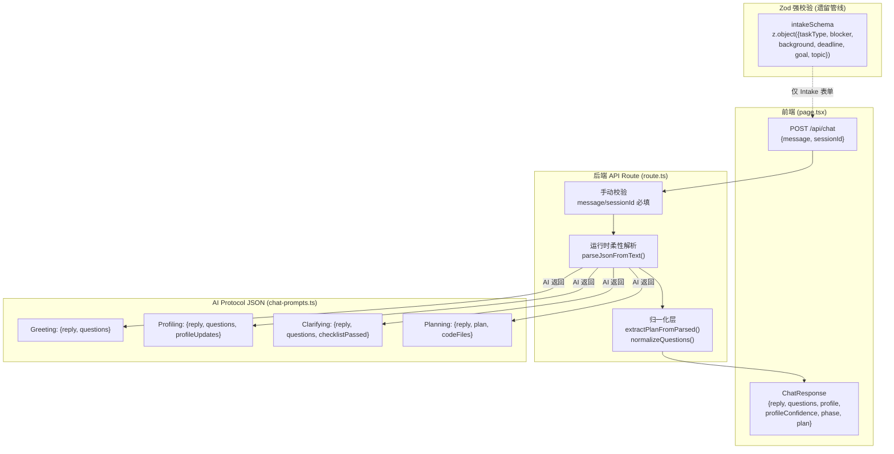
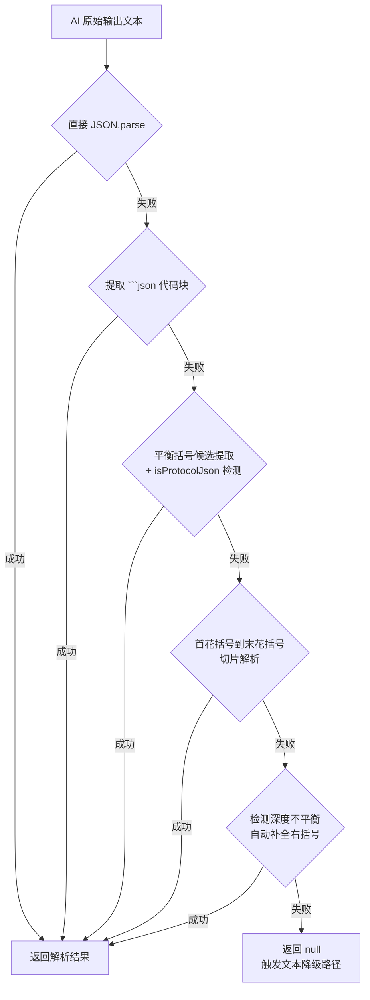

本文档系统性梳理项目中所有 API 端点的请求/响应契约、Zod 校验 Schema 的使用范围，以及运行时 JSON 解析与归一化策略。项目存在两条并行的数据通路——**遗留 Intake 表单管线**（基于 Zod 强校验）与**Chat 对话管线**（基于运行时柔性解析），两者的校验哲学截然不同，理解这一差异是阅读本文档的关键前提。

Sources: [triage-types.ts](src/lib/triage-types.ts#L1-L170), [route.ts](src/app/api/chat/route.ts#L1-L495), [chat-pipeline.ts](src/lib/chat-pipeline.ts#L1-L648)

## 契约架构总览

整个系统的数据契约分布在三个层面：**前端 → 后端** 的 HTTP 请求/响应、**后端 → AI** 的 Prompt 约束输出、以及**后端内部**的类型流转。下图展示了各层契约的边界关系：



Sources: [triage-types.ts](src/lib/triage-types.ts#L71-L82), [route.ts](src/app/api/chat/route.ts#L70-L80), [chat-pipeline.ts](src/lib/chat-pipeline.ts#L6-L48), [chat-prompts.ts](src/lib/chat-prompts.ts#L39-L200)

## Zod Schema：IntakeRequest 强校验

项目中唯一正式使用 Zod 进行运行时校验的场景是 **Intake 表单提交**。`intakeSchema` 定义在 [triage-types.ts](src/lib/triage-types.ts#L71-L82) 中，对六个字段施加严格的枚举约束和文本长度验证：

```typescript
export const intakeSchema = z.object({
  taskType: z.enum(taskTypes),           // 8 种任务类型
  currentBlocker: z.enum(currentBlockers), // 8 种卡点
  backgroundLevel: z.enum(backgroundLevels), // 5 种背景等级
  deadline: z.enum(deadlines),           // 4 种截止时间
  goalType: z.enum(goalTypes),           // 5 种目标类型
  topicText: z.string().trim()
    .min(30, "请至少输入 30 个字，方便系统判断真实课题状态。")
    .max(2000, "请输入 2000 字以内的课题描述。"),
});
```

该 Schema 的设计意图是确保旧版分诊表单提交的数据严格落在预定义枚举范围内。所有枚举值均通过 `as const` 元组推导类型，实现枚举定义与 TypeScript 类型同步，无需额外维护类型映射表。`IntakeRequest` 类型通过 `z.infer<typeof intakeSchema>` 从 Schema 自动推导，确保类型定义与校验规则始终一致。

值得注意的是，当前 MVP 版本中 Intake 表单页面已重定向至首页（[intake/page.tsx](src/app/intake/page.tsx#L1-L6)），Intake 表单管线不再作为主入口，但 `intakeSchema` 及其关联的 `triageIntake()` 函数仍在测试中被完整覆盖（[triage.test.ts](src/lib/triage.test.ts#L1-L191)），为未来可能的表单恢复或 API 集成保留了校验能力。

Sources: [triage-types.ts](src/lib/triage-types.ts#L3-L95), [triage.test.ts](src/lib/triage.test.ts#L1-L191), [intake/page.tsx](src/app/intake/page.tsx#L1-L6)

## /api/chat 请求契约

Chat 端点是当前 MVP 的唯一活跃 API。其请求体结构极为简洁：

| 字段 | 类型 | 必填 | 说明 |
|------|------|------|------|
| `message` | `string` | ✅ | 用户当前轮的文本输入 |
| `sessionId` | `string` | ✅ | UUID 格式的会话标识符 |

校验方式采用**手动空值检查**（非 Zod），在 [route.ts](src/app/api/chat/route.ts#L73-L80) 中直接断言两个字段的真值性：

```typescript
const { message, sessionId } = body as { message?: string; sessionId?: string };
if (!message || !sessionId) {
  return NextResponse.json(
    { error: "缺少 message 或 sessionId" },
    { status: 400 },
  );
}
```

前端发送端（[page.tsx](src/app/page.tsx#L85-L89)）以标准 `fetch` + `JSON.stringify` 构造请求体，`sessionId` 由客户端 `crypto.randomUUID()` 生成并缓存在 `sessionStorage` 中。

Sources: [route.ts](src/app/api/chat/route.ts#L70-L80), [page.tsx](src/app/page.tsx#L69-L89)

## /api/chat 响应契约

响应体的完整类型定义内联在 [route.ts](src/app/api/chat/route.ts#L462-L487) 中，字段根据运行时条件动态组装：

```typescript
const response: {
  reply: string;                          // 必有：AI 回复文本
  questions?: string[];                   // 条件有：结构化选项（<=6个）
  process?: string;                       // 条件有：流程摘要
  profile?: UserProfileState;             // 条件有：已识别画像字段
  profileConfidence?: Record<string, number>; // 条件有：画像置信度
  phase: Phase;                           // 必有：当前阶段枚举
  plan?: PlanState;                       // 条件有：生成的 Plan
} = { reply, process, phase: session.phase };
```

各字段的出现条件如下表所示：

| 字段 | 触发条件 | 数据来源 |
|------|----------|----------|
| `reply` | **始终存在** | AI JSON 的 `reply` 或 `summary` 字段，或 markdown 降级提取 |
| `questions` | `questions.length > 0` | AI JSON 的 `questions` 数组，经 `normalizeQuestions()` 归一化 |
| `process` | **始终存在** | `buildProcessSummary()` 生成的阶段流程摘要文本 |
| `profile` | `getDetectedFields(memory).length > 0` | `toAPIState(memory)` 将置信度内存展平为 10 字段平面对象 |
| `profileConfidence` | `profile` 存在时 | 从内存中提取各字段的 `confidence` 数值映射 |
| `phase` | **始终存在** | `getNextPhase()` 计算的下一阶段枚举值 |
| `plan` | `planState !== null` | `extractPlanFromParsed()` 或 `parsePlanFromMarkdown()` 的归一化输出 |
| `_fallback` | AI 调用失败时 | 仅在降级路径中出现，布尔标记 |

前端消费端（[page.tsx](src/app/page.tsx#L91-L127）直接以 `await resp.json()` 解析响应，通过字段存在性检测逐项更新本地状态：

```typescript
if (data.profile)  setProfile(data.profile);
if (data.profileConfidence) setProfileConfidence(data.profileConfidence);
if (data.plan) setPlan(data.plan);
```

错误响应遵循 `{ error: string }` 格式，HTTP 状态码 400（参数缺失）或 500（内部异常）。

Sources: [route.ts](src/app/api/chat/route.ts#L462-L494), [page.tsx](src/app/page.tsx#L91-L137)

## AI Protocol JSON 契约

后端与 AI 模型之间的协议 JSON 是整个系统最复杂的契约层。它在 [chat-prompts.ts](src/lib/chat-prompts.ts#L39-L200) 中通过 Prompt 指令约束 AI 输出格式，**而非**通过 Zod 或 TypeScript 类型强制执行。这是一种「Prompt 作为 Schema」的设计模式——校验发生在后端解析层，而非 AI 输出端。

### 阶段化 JSON 结构

五个对话阶段各自定义了不同的 JSON 输出格式：

| 阶段 | Prompt 指令常量 | JSON 必需字段 | 可选字段 |
|------|----------------|---------------|----------|
| `greeting` | `GREETING_INSTRUCTION` | `reply`, `questions` | — |
| `profiling` | `PROFILING_INSTRUCTION` | `reply`, `questions`, `profileUpdates` | — |
| `clarifying` | `CLARIFYING_INSTRUCTION` | `reply`, `questions`, `checklistPassed` | — |
| `planning` | `PLANNING_INSTRUCTION` | `reply`, `plan`, `codeFiles` | — |
| `reviewing` | `REVIEWING_INSTRUCTION` | `reply`, `plan`, `codeFiles` | — |

### profileUpdates 结构

在 `profiling` 阶段，AI 输出的 `profileUpdates` 数组承载画像字段增量更新：

```typescript
// AI 输出格式（Prompt 约束）
"profileUpdates": [
  { "field": "interestArea", "value": "AI和机器学习", "confidence": 0.7 },
  { "field": "backgroundLevel", "value": "有一点基础", "confidence": 0.5 }
]
```

`field` 必须是 `UserProfileState` 的 10 个合法键名之一，`confidence` 取值范围 0.3–1.0（0.3=猜测, 0.5=AI推断, 0.7=用户暗示, 1.0=用户确认）。后端在 [route.ts](src/app/api/chat/route.ts#L298-L317) 中以 `Array.isArray` + 属性存在性进行宽松校验，并将 `confidence` 映射为 `source` 枚举（`inferred` / `deduced` / `user_confirmed`）。

### Plan 结构

`plan` 对象在 `planning` 和 `reviewing` 阶段输出，其 Prompt 定义（[chat-prompts.ts](src/lib/chat-prompts.ts#L145-L164)）如下：

```json
{
  "userProfile": "用户画像摘要",
  "problemJudgment": "当前问题判断",
  "systemLogic": "系统判断逻辑",
  "recommendedPath": "推荐路径",
  "actionSteps": ["步骤1：具体动作、时限、验证方式"],
  "riskWarnings": ["风险1"],
  "nextOptions": ["更简单", "更专业", "拆开讲", "换方向"]
}
```

`actionSteps` 中的元素既可以是 `string` 也可以是 `{ step: string, time?: string }` 对象，后端通过 `normalizeSteps()` 统一处理为字符串。

### codeFiles 结构

代码产物附属于 Plan JSON，每个文件项的 Prompt 约束格式为：

```json
{
  "filename": "planar_2r_forward.m",
  "title": "代码文件标题",
  "language": "matlab",
  "content": "完整代码内容"
}
```

后端 `extractCodeFilesFromParsed()`（[chat-pipeline.ts](src/lib/chat-pipeline.ts#L350-L397)）对键名采用**多候选映射**策略——`content` / `code` / `source` 均可映射为代码内容，`language` / `lang` 均可映射为语言类型，`filename` / `name` 均可映射为文件名。文件名经 `sanitizeCodeFilename()` 清洗（去除路径遍历、特殊字符、空格），自动添加版本前缀 `code-v{n}-`。

Sources: [chat-prompts.ts](src/lib/chat-prompts.ts#L42-L200), [route.ts](src/app/api/chat/route.ts#L270-L333), [chat-pipeline.ts](src/lib/chat-pipeline.ts#L239-L397)

## 运行时 JSON 解析与柔性校验

AI 模型输出是不可控的外部数据源——它可能返回标准 JSON、被 markdown 代码块包裹的 JSON、前缀带说明文字的 JSON、截断的 JSON，甚至完全不是 JSON。`parseJsonFromText()`（[chat-pipeline.ts](src/lib/chat-pipeline.ts#L6-L37)）实现了一个**五级降级解析链**来应对这些情况：



其中 `isProtocolJson()` 充当协议 JSON 的**启发式过滤器**——它检查解析结果是否包含 `reply`、`questions`、`profileUpdates`、`checklistPassed`、`plan` 或 `codeFiles` 中的至少一个键名，用于在多个 JSON 候选中区分「协议 JSON」和「内容中的随机 JSON 片段」。

当五级解析链全部失败后，系统不会崩溃，而是进入**文本降级路径**（[route.ts](src/app/api/chat/route.ts#L379-L416)）：`safeReplyFromUnparsedAiText()` 提取 AI 输出的可读部分作为回复文本，`extractQuestionsFromText()` 通过正则匹配编号/列表格式的追问项。对于 `planning`/`reviewing` 等关键阶段，还会尝试 `parsePlanFromMarkdown()` 从 markdown 结构中提取 Plan 各节。

Sources: [chat-pipeline.ts](src/lib/chat-pipeline.ts#L6-L177), [route.ts](src/app/api/chat/route.ts#L238-L416)

## Plan 归一化：多命名映射策略

AI 模型对 JSON 键名的遵从度无法保证。`extractPlanFromParsed()`（[chat-pipeline.ts](src/lib/chat-pipeline.ts#L266-L305)）通过**多候选键名映射**实现柔性归一化：

| 目标字段 | 接受的 AI 输出键名 |
|----------|-------------------|
| `userProfile` | `userProfile`, `user_profile`, `summary`, `用户画像` |
| `problemJudgment` | `problemJudgment`, `problem_judgment`, `problem`, `问题判断` |
| `systemLogic` | `systemLogic`, `system_logic`, `logic`, `系统逻辑`, `判断逻辑` |
| `recommendedPath` | `recommendedPath`, `recommended_path`, `path`, `推荐路径`, `路径` |
| `actionSteps` | `actionSteps`, `action_steps`, `steps`, `行动步骤`, `步骤` |
| `riskWarnings` | `riskWarnings`, `risk_warnings`, `risks`, `风险提示`, `风险` |
| `nextOptions` | `nextOptions`, `next_options`, `options`, `下一步` |

`normalizeSteps()` 进一步处理步骤数组中的异构元素——`string` 直接使用，`{ step, time }` 对象拼接为 `"步骤（时间）"` 格式，`{ description }` / `{ title }` / `{ name }` 等变体均有兜底映射。`normalizeRisks()` 同理处理 `{ risk }` / `{ description }` 等对象形式。

最终输出严格符合 `PlanState` 类型定义（[triage-types.ts](src/lib/triage-types.ts#L136-L148)），确保下游组件（`PlanPanel`、`PlanHistoryPanel`）始终获得结构一致的 Plan 对象。

Sources: [chat-pipeline.ts](src/lib/chat-pipeline.ts#L239-L305), [triage-types.ts](src/lib/triage-types.ts#L136-L148)

## 契约测试策略

项目的契约测试集中在两个测试文件中，分别覆盖不同层面的校验逻辑：

**Pipeline 契约测试**（[chat-pipeline.test.ts](src/lib/chat-pipeline.test.ts)）验证的是 AI 输出 → 归一化产物的完整数据通路，核心测试用例包括：

| 测试用例 | 验证的契约行为 |
|----------|---------------|
| `extracts JSON from fenced or wrapped model output` | `parseJsonFromText()` 对代码块包裹和前后缀文本的容错能力 |
| `extracts protocol JSON after a leaked process preface` | 流程摘要泄露到 AI 输出前缀时的协议 JSON 提取 |
| `does not expose protocol JSON as a plan-phase chat reply` | `safeReplyFromUnparsedAiText()` 阻止协议 JSON 暴露给用户 |
| `splits one question containing A/B/C sub-options` | `normalizeQuestions()` 将内联子选项拆分为独立可点击项 |
| `normalizes plan fields and object-form steps` | `extractPlanFromParsed()` 的多键名映射和对象步骤归一化 |
| `persists plan plus Phase 4 document artifacts` | `persistPlanArtifacts()` 的文件产物完整性（Plan + Summary + Checklist + Path） |
| `extracts code file artifacts from planning protocol JSON` | `extractCodeFilesFromParsed()` 的文件名清洗和语言扩展名推断 |

**Triage 契约测试**（[triage.test.ts](src/lib/triage.test.ts)）验证的是 `intakeSchema` 校验后的 `IntakeRequest` → `TriageResponse` 映射正确性，覆盖六种用户画像分类、四种任务分类、安全模式触发、难度评分边界等场景。

Sources: [chat-pipeline.test.ts](src/lib/chat-pipeline.test.ts#L1-L195), [triage.test.ts](src/lib/triage.test.ts#L1-L191)

## 设计权衡与校验空白分析

当前项目的契约校验存在一个明确的**不对称设计**：

- **Intake 管线**：Zod 强校验 → TypeScript 类型推导 → 测试覆盖，形成完整的类型安全闭环
- **Chat 管线**：手动空值检查 → 运行时柔性解析 → 归一化层兜底，无 Zod 参与

这一不对称并非疏漏，而是有意识的架构选择。Chat 管线面对的是 AI 模型的**非确定性输出**——使用 Zod 的 `parse()` 或 `safeParse()` 在这里只有两种结果：要么频繁抛出校验错误（因为 AI 输出不可预测），要么放宽 Schema 到几乎不提供任何保证。项目选择了第三条路：**多层降级解析 + 归一化映射 + 类型断言**，在保持运行时鲁棒性的同时，通过 `isProtocolJson()` 启发式过滤和 `extractPlanFromParsed()` 的空值兜底确保输出结构的安全。

潜在的改进方向包括：为 `/api/chat` 的响应体引入 Zod Schema 用于**出站校验**（确保 API 返回的数据始终符合前端期望的形状），以及为 `profileUpdates` 数组元素引入字段级 Schema（限制 `field` 为 `keyof UserProfileState` 的联合类型）。但这些改进的前提是 AI 输出的稳定性经过充分验证。

Sources: [triage-types.ts](src/lib/triage-types.ts#L71-L95), [route.ts](src/app/api/chat/route.ts#L70-L80), [chat-pipeline.ts](src/lib/chat-pipeline.ts#L39-L48)

---

**延伸阅读**：理解本文档中的 Plan 归一化产物如何持久化，参见 [Userspace 文件系统：会话产物持久化与版本管理](14-userspace-wen-jian-xi-tong-hui-hua-chan-wu-chi-jiu-hua-yu-ban-ben-guan-li)；了解 AI Protocol JSON 各阶段的 Prompt 指令细节，参见 [阶段 Prompt 工程与 chat-prompts 阶段指令设计](13-jie-duan-prompt-gong-cheng-yu-chat-prompts-jie-duan-zhi-ling-she-ji)；理解 Plan 归一化的类型基础，参见 [核心类型定义 triage-types.ts](22-he-xin-lei-xing-ding-yi-triage-types-ts-biao-dan-mei-ju-hua-xiang-zhuang-tai-plan-jie-gou-yu-api-xiang-ying)。