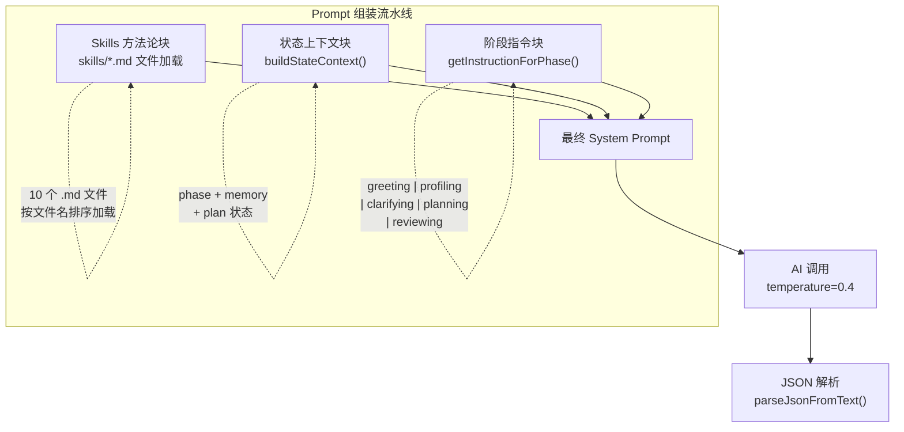
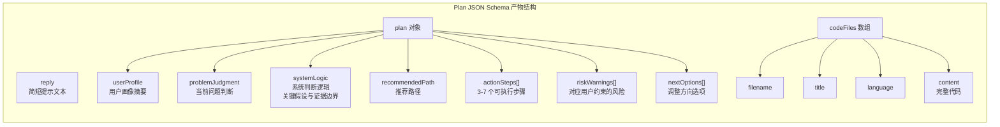

本文档深入剖析「科研课题分诊台」的 Prompt 模板体系——它不是简单的字符串拼接，而是一个**分层组装、状态驱动、强制 JSON 输出**的指令工程架构。我们将从整体组装公式出发，逐层拆解每个阶段的指令模板设计，理解状态上下文注入机制，并厘清 Skills 方法论与阶段指令的协作边界。

## 整体架构：三层组装公式

系统的最终 System Prompt 由三个独立层次拼接而成，其组装公式为：

```
最终 System Prompt = Skills 方法论块 + 状态上下文块 + 阶段指令块 + 输出格式强制
```

这三个层次的职责划分极为清晰：**Skills 块**提供跨阶段的科学方法论约束，**状态上下文块**将当前会话状态注入 AI 的认知框架，**阶段指令块**定义当前阶段的具体行为规则和 JSON 输出契约。



Sources: [chat-prompts.ts](src/lib/chat-prompts.ts#L23-L40), [skills.ts](src/lib/skills.ts#L40-L44)

## Skills 方法论块：全局行为约束的注入

在阶段指令生效之前，系统会通过 `buildSystemPrompt("")` 从 `skills/` 目录加载全部 10 个 Markdown 文件，按文件名前缀数字排序拼接。每个文件被包装为 `## Skill: <名称>` 的格式，形成一份完整的方法论手册，作为 System Prompt 的**第一层**注入 AI 上下文。

这套 Skills 体系覆盖了科学方法论五步强制流程（提问→分解→假设→验证→迭代），以及问题拆解、知识缺口分析、假设验证、证据评估、迭代精化、模糊点暴露、同行评审模拟、沟通规范和安全边界共 10 个维度。其中最关键的设计决策是：**Skills 块与阶段指令是正交的**——Skills 提供全局约束，阶段指令提供局部行为，两者互不耦合。

| Skill 文件 | 核心约束 | 对阶段指令的影响 |
|:---|:---|:---|
| `00-core-methodology` | 五步强制流程，禁止跳步 | 所有阶段的 Plan 必须可追溯到假设 |
| `01-question-decomposition` | 四项拆解（研究对象/已知/未知/约束） | clarifying 阶段的前置检查清单 |
| `06-ambiguity-surfacing` | 模糊点必须追问，禁止 AI 自行填充 | profiling 阶段的 questions 设计 |
| `08-communication-protocol` | 先结论后展开，语言匹配画像 | 所有阶段 reply 的结构 |
| `09-safety-boundary` | 禁止代写、伪造、危险实验 | 所有阶段的硬性红线 |

Sources: [skills.ts](src/lib/skills.ts#L9-L37), [00-core-methodology.md](skills/00-core-methodology.md#L1-L18)

## 状态上下文块：会话状态的实时注入

`buildStateContext()` 函数将当前会话的**画像状态、对话阶段、已有 Plan** 序列化为结构化文本，作为 System Prompt 的第二层。这使得 AI 在每一轮都能准确感知「当前在哪里、已有什么、下一步该做什么」。

注入的状态信息包括：当前对话阶段（Phase）、画像是否就绪（可靠字段数 ≥ 6）、已确认的画像字段及值、研究方向、当前卡点，以及已有 Plan 的版本号、步骤摘要和风险提示。这些信息使 AI 无需依赖对话历史即可重建上下文认知。

Sources: [chat-prompts.ts](src/lib/chat-prompts.ts#L5-L21)

## 阶段指令分发：getInstructionForPhase 路由机制

系统定义了五个对话阶段（`Phase` 类型），但阶段指令只有**四个独立模板**——因为 `profiling` 阶段作为默认回退，承载了最大的行为复杂度。分发函数 `getInstructionForPhase()` 的路由逻辑如下：

```
greeting    → GREETING_INSTRUCTION
planning    → PLANNING_INSTRUCTION
reviewing   → REVIEWING_INSTRUCTION
clarifying  → CLARIFYING_INSTRUCTION
其他（含 profiling）→ PROFILING_INSTRUCTION
```

这个设计体现了分诊工作流的核心节奏：**greeting 是一次性开场，profiling 是长期画像构建（默认停留），clarifying 是过渡性检查，planning/reviewing 是产出性阶段**。其中 profiling 的停留时间最长，因为它需要持续提取画像字段直到可靠字段达到 6 个阈值。

Sources: [chat-prompts.ts](src/lib/chat-prompts.ts#L195-L201)

## Greeting 阶段指令：结构化开场白

Greeting 阶段的指令是最简洁的——它只有一个目标：**用陈述句开场，用结构化选项引导用户进入画像构建**。指令的核心约束体现在三个层面：

**reply 规则**要求 AI 输出纯陈述句（1-2 句），**禁止出现问号和任何追问语句**。这是一个精心设计的反模式——防止 AI 在开场就陷入开放式对话，而是将所有交互收敛到可点击的结构化选项。

**questions 规则**要求每个选项是用户可以直接点击的完整句子，禁止占位符文本（如"选项A""其他""请选择"）。最后一项固定为"我不太理解这些，帮我找方向"——这是系统的**逃生通道**，确保不知道如何选择的用户不会被卡住。

**输出格式**强制 AI 返回严格 JSON，包含 `reply` 和 `questions` 两个字段。系统在指令末尾反复强调"回复的第一个字符必须是 `{`，最后一个字符必须是 `}`"——这是应对大语言模型输出非 JSON 文本的多重防御策略。

Sources: [chat-prompts.ts](src/lib/chat-prompts.ts#L42-L64)

## Profiling 阶段指令：画像字段提取引擎

Profiling 是系统停留时间最长的阶段，其指令也最为复杂。它在 Greeting 的基础上增加了一个核心机制：**`profileUpdates` 数组——AI 在对话中实时提取用户画像字段**。

可提取的 10 个字段覆盖了从静态属性（年龄段、教育水平）到动态能力（工具能力、AI 熟悉度）再到研究状态（兴趣方向、当前卡点、可用设备/时间）的完整画像维度。每个字段提取时必须携带 **confidence 置信度**（0.3=猜测, 0.5=AI 推断, 0.7=用户暗示, 1.0=用户明确说了），不确定的字段留到下一轮通过 questions 追问。

这种设计实现了**渐进式画像构建**——AI 不需要一次提取所有字段，而是每轮提取有把握的字段，同时通过结构化选项继续收集缺失信息。当 `getReliableFields()` 统计到置信度 ≥ 0.7 的字段达到 6 个时，系统自动将阶段推进到 clarifying。

Sources: [chat-prompts.ts](src/lib/chat-prompts.ts#L66-L112), [memory.ts](src/lib/memory.ts#L55-L63)

## Clarifying 阶段指令：九项前置检查清单

Clarifying 阶段是 profiling 到 planning 之间的**质量关卡**。它的指令不是要求 AI 直接生成内容，而是要求 AI **逐项检查一份九项清单**，任一项未通过都不得生成 Plan：

| 序号 | 检查项 | 对应画像字段/逻辑 |
|:--:|:---|:---|
| 1 | 用户身份已确认？ | `ageOrGeneration`, `educationLevel` |
| 2 | 用户目标已收敛为一个明确问题？ | `interestArea` 收敛判断 |
| 3 | 用户工具能力已确认？ | `toolAbility` |
| 4 | 用户时间约束已明确？ | `timeAvailable` |
| 5 | 用户期望的交付物已明确？ | 对话历史推断 |
| 6 | 存在隐含假设？必须在 reply 中列出 | 反省性检查 |
| 7 | 问题是否过大？ | 约束 vs 目标匹配度 |
| 8 | 想法在约束下是否可执行？ | 可行性评估 |
| 9 | 是否要求跨越过多阶段？ | 范围收敛判断 |

AI 必须返回 `checklistPassed` 布尔值。当 `checklistPassed=true` 时，questions 可为空数组，系统会在同一次 API 调用中**自动追加一次 planning 阶段的 AI 请求**，实现从 clarifying 到 planning 的无缝衔接。当 `checklistPassed=false` 时，AI 必须在 reply 中列出未通过的假设，并给出具体的追问选项。

Sources: [chat-prompts.ts](src/lib/chat-prompts.ts#L114-L143), [route.ts](src/app/api/chat/route.ts#L334-L378)

## Planning 与 Reviewing 阶段指令：Plan 产物生成

Planning 和 Reviewing 共享同一个 **Plan JSON Schema**（`PLAN_JSON_SCHEMA`），区别仅在于行为策略。这个 Schema 是整个 Prompt 体系中最复杂的输出契约：



**Planning 阶段**的核心规则是：所有建议以假设形式呈现（"如果按 X 路线走，预期 Y，验证方法是 Z"），根据用户画像调整语言复杂度，actionSteps 必须是 3-7 个可执行步骤且每步包含动作、时限、验证方法。当任务明确需要代码时，必须输出 `codeFiles`，其中每个文件都是最小可运行或最小可验证版本。

**Reviewing 阶段**在 Planning 的基础上增加了三个约束：先判断用户意图（更简单/更专业/拆开讲/换方向），只调整必要部分但返回完整 Plan，`systemLogic` 必须说明本次修改相对于上一版改变了什么。这确保了版本间的**变更可追溯性**。

Sources: [chat-prompts.ts](src/lib/chat-prompts.ts#L145-L193)

## 输出格式强制：JSON 契约的多层防御

所有阶段指令的末尾都包含一致的**输出格式强制声明**：AI 必须且只能输出一行合法 JSON，不以 markdown、表格或文字说明开头，回复的第一个字符是 `{`，最后一个字符是 `}`。这不是建议，而是**系统功能依赖的硬性约束**。

在 `buildChatSystemPrompt()` 的最后一行，系统再次追加格式强制指令，与阶段指令内部的格式要求形成**双重防御**。当 AI 仍然输出非 JSON 文本时，`chat-pipeline.ts` 中的 `parseJsonFromText()` 会启动五层解析策略：直接 JSON.parse → markdown 代码块提取 → 平衡花括号候选提取 → 首 `{` 到末 `}` 截取 → 深度补偿（自动补全缺失的 `}`）。

Sources: [chat-prompts.ts](src/lib/chat-prompts.ts#L37-L40), [chat-pipeline.ts](src/lib/chat-pipeline.ts#L6-L37)

## 阶段 Prompt 在 API 调用链中的完整生命周期

了解每个阶段指令的设计之后，我们需要审视它们在整个 API 调用链中的完整生命周期。以下是 `/api/chat` 端点处理一次请求时的 Prompt 组装与使用流程：

1. **路由层获取阶段指令**：`getInstructionForPhase(session.phase)` 根据 Phase 类型返回对应指令字符串。
2. **组装 System Prompt**：`buildChatSystemPrompt(memory, phase, instruction, plan)` 拼接 Skills 块 + 状态上下文 + 阶段指令 + 格式强制。
3. **构建多轮消息**：`buildConversationMessages(systemPrompt, session.messages)` 将 System Prompt 作为首条 system 消息，附加最近 30 轮对话历史。
4. **调用 AI**：以 `temperature=0.4`、`maxTokens=4096` 调用 DeepSeek API。
5. **解析与重试**：如果首次解析失败，系统会追加一条"上一轮回复不是 JSON"的用户消息重新请求（temperature 降至 0.3）。
6. **特殊：clarifying→planning 自动衔接**：当 clarifying 阶段返回 `checklistPassed=true` 但无 Plan 时，系统会**在同一个请求内**重新组装 planning 阶段的 System Prompt 并发起第二次 AI 调用。

这个生命周期中最值得关注的设计是**双次调用**机制——clarifying 阶段通过后不等待下一轮用户输入，而是立即在同一 HTTP 请求内生成 Plan。这确保了用户在收到"所有检查已通过"的反馈时，右侧面板已经展示了一份可操作的科研计划。

Sources: [route.ts](src/app/api/chat/route.ts#L172-L378)

## 七阶段指令对比总结

| 维度 | Greeting | Profiling | Clarifying | Planning | Reviewing |
|:---|:---|:---|:---|:---|:---|
| **停留时长** | 1 轮 | 多轮（直到可靠字段≥6） | 多轮（直到 checklistPassed） | 1 轮（或 0 轮自动衔接） | 无限轮 |
| **核心任务** | 开场引导 | 提取画像 + 继续对话 | 前置检查 + 假设暴露 | 生成 Plan + codeFiles | 调整 Plan |
| **输出字段** | `reply`, `questions` | `reply`, `questions`, `profileUpdates` | `reply`, `questions`, `checklistPassed` | `reply`, `plan`, `codeFiles` | `reply`, `plan`, `codeFiles` |
| **questions 数量** | 4 项（含逃生通道） | 2-4 项（含逃生通道） | 2-3 项（含逃生通道） | 空 | 空 |
| **reply 约束** | 纯陈述句 | 1-3 句回应 | 列出假设/检查状态 | 一句话提示查看面板 | 一句话说明更新 |
| **Plan 参与** | 否 | 否 | 否（仅检查前置条件） | 是（首次生成） | 是（增量修改） |

Sources: [chat-prompts.ts](src/lib/chat-prompts.ts#L42-L201)

## 相关阅读

- **上游**：[Skills 方法论注入机制：科学方法论五步强制约束与加载策略](25-skills-fang-fa-lun-zhu-ru-ji-zhi-ke-xue-fang-fa-lun-wu-bu-qiang-zhi-yue-shu-yu-jia-zai-ce-lue)——详解 skills/ 目录的加载、缓存与热重载机制
- **上游**：[对话阶段状态机：greeting → profiling → clarifying → planning → reviewing](7-dui-hua-jie-duan-zhuang-tai-ji-greeting-profiling-clarifying-planning-reviewing)——详解 Phase 状态机的阶段推进与回退逻辑
- **下游**：[Chat Pipeline：AI JSON 输出解析、Plan 归一化与产物生成](12-chat-pipeline-ai-json-shu-chu-jie-xi-plan-gui-hua-yu-chan-wu-sheng-cheng)——详解 Prompt 输出的解析与归一化管线
- **下游**：[/api/chat 核心端点：请求编排、会话恢复与阶段推进](9-api-chat-he-xin-duan-dian-qing-qiu-bian-pai-hui-hua-hui-fu-yu-jie-duan-tui-jin)——详解 API 层如何调度 Prompt 模板与阶段转换