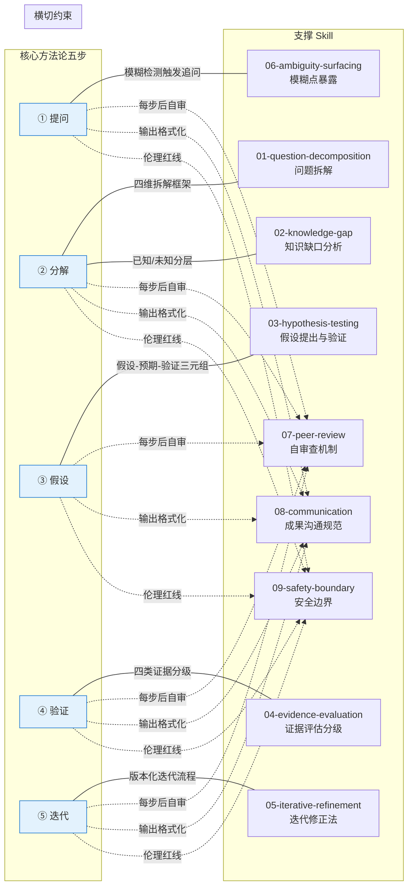
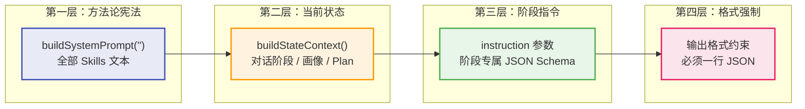

本页深度解析「科研课题分诊台」中 **Skills 体系**的架构设计——一套由 10 个 Markdown 文件组成的科学方法论约束层，如何在运行时被加载、拼装并注入到每一次 AI 对话的系统提示中，从而强制约束 LLM 的行为遵循"提问→分解→假设→验证→迭代"五步科学方法论。我们将从加载器实现、Prompt 拼装策略、方法论与技能的映射关系三个维度展开分析。

Sources: [skills.ts](src/lib/skills.ts#L1-L51), [00-core-methodology.md](skills/00-core-methodology.md#L1-L18)

## 架构总览：Skills 在 AI 对话链路中的位置

Skills 体系在整体对话链路中充当 **行为宪法** 的角色——它不是可选的辅助提示，而是每次 AI 调用前强制注入的系统级指令前缀。无论用户处于哪个对话阶段（greeting / profiling / clarifying / planning / reviewing），Skills 内容始终作为系统提示的第一段出现。

```mermaid
flowchart TD
    subgraph Skills_Loader["Skills 加载层 (skills.ts)"]
        A["skills/ 目录"] -->|"readdirSync + sort"| B["按前缀排序的 .md 文件列表"]
        B -->|"逐文件 readFileSync"| C["拼接：## Skill: name + 原始内容"]
        C -->|"join by \\n\\n---\\n\\n"| D["cachedSkills 字符串缓存"]
    end

    subgraph Prompt_Assembler["Prompt 拼装层 (chat-prompts.ts)"]
        D -->|"buildSystemPrompt(\"\")"| E["Skills 全文"]
        F["buildStateContext(memory, phase, plan)"] --> G["当前状态块：阶段 / 画像 / Plan"]
        H["getInstructionForPhase(phase)"] --> I["阶段专属指令"]
        E --> J["buildChatSystemPrompt()"]
        G --> J
        I --> J
    end

    subgraph AI_Call["AI 调用层 (route.ts)"]
        J -->|"systemPrompt"| K["buildConversationMessages()"]
        K --> L["chat(messages, ...)"]
        L --> M["DeepSeek API"]
    end

    style D fill:#f0f4ff,stroke:#4a6cf7,stroke-width:2px
    style J fill:#fff3e0,stroke:#ff9800,stroke-width:2px
    style M fill:#e8f5e9,stroke:#4caf50,stroke-width:2px
```

整个链路的核心设计原则是 **Skills 优先、任务指令在后**。`buildSystemPrompt` 函数将 Skills 全文拼在前面，再用分隔线 `---` 引出「当前任务指令」区块。这确保了 LLM 在解析任何具体的阶段指令之前，已经完整"阅读"了全部方法论约束。

Sources: [skills.ts](src/lib/skills.ts#L39-L44), [chat-prompts.ts](src/lib/chat-prompts.ts#L23-L40)

## 加载器实现：skills.ts 的懒加载与缓存策略

`skills.ts` 是一个仅 51 行的纯同步模块，但承载了整个方法论约束的加载逻辑。其核心设计可以用三个关键决策来概括：

**决策一：基于文件前缀的自然排序。** `readdirSync` 返回的文件列表通过 `.sort()` 排序后，确保 `00-core-methodology.md`（核心五步法）始终排在最前，`09-safety-boundary.md`（安全边界）始终在末尾。这意味着核心方法论在 Prompt 中拥有最高的位置优先级，LLM 会最先"看到"它。

**决策二：模块级单例缓存。** `cachedSkills` 变量在模块顶层声明为 `null`，首次调用 `loadSkills()` 后缓存拼接结果。此后的所有请求直接返回缓存字符串，避免了重复的磁盘 I/O 和字符串拼接开销。这对于每个用户消息都会触发一次 Skills 注入的高频场景至关重要。

**决策三：防御性降级。** 当 `skills/` 目录不存在或目录中无 `.md` 文件时，加载器将 `cachedSkills` 设为空字符串而非抛出异常。`buildSystemPrompt` 检测到空 Skills 时直接返回原始 `taskInstruction`，系统以无方法论约束的模式继续运行——这是一个有意的降级设计，确保 Skills 缺失不会阻断核心对话功能。

| 特性 | 实现方式 | 设计意图 |
|------|---------|---------|
| 文件发现 | `readdirSync` + `.filter(f => f.endsWith(".md"))` | 只加载 Markdown 格式的技能文件 |
| 排序策略 | `.sort()` 自然排序 | 通过数字前缀控制注入顺序 |
| 缓存机制 | 模块级 `let cachedSkills: string \| null` | 零 I/O 热路径 |
| 热重载 | `reloadSkills()` 清空缓存后重新加载 | 开发期间快速迭代 |
| 降级路径 | 目录缺失 → 空字符串 → 跳过 Skills 注入 | Skills 不是硬依赖 |

Sources: [skills.ts](src/lib/skills.ts#L1-L51)

## 技能文件结构：每个 Skill 的内部格式

加载器对每个 `.md` 文件执行两步变换：首先，用正则 `f.replace(/^\d+-/, "").replace(/\.md$/, "")` 剥离文件名中的数字前缀和扩展名，生成技能名称（如 `01-question-decomposition.md` → `question-decomposition`）；然后，以 `## Skill: <name>` 为标题，原始文件内容为正文，拼接成一个 Skill 块。多个 Skill 块之间用 `\n\n---\n\n` 分隔。

以 `01-question-decomposition.md` 为例，最终注入到系统提示中的格式为：

```markdown
## Skill: question-decomposition

# 问题拆解法

## 拆解框架

收到用户输入后，必须将模糊描述拆为以下四项：
1. **研究对象** — ...
2. **已知条件** — ...
3. **未知变量** — ...
4. **约束条件** — ...

## 规则
- 四项中任一项为空 → 必须追问
...
```

这种设计意味着每个 Skill 文件就是一个自包含的行为规则单元。Markdown 格式既是人类可读的文档，也是直接注入 LLM 上下文的指令文本——**文档即提示词**（Document-as-Prompt）模式。

Sources: [skills.ts](src/lib/skills.ts#L28-L36), [01-question-decomposition.md](skills/01-question-decomposition.md#L1-L17)

## 核心方法论：五步强制流程

`00-core-methodology.md` 定义了整个 Skills 体系的**宪法级约束**——科学方法论五步强制流程。这五步不是建议性的指导，而是以"不得""禁止"等强制性语言编写的硬规则：

| 步骤 | 名称 | 核心约束 | 硬性规则 |
|------|------|---------|---------|
| 1 | **提问** | 明确用户真正想解决的问题 | 模糊时必须追问，不得臆断 |
| 2 | **分解** | 拆为研究对象、已知条件、未知变量、约束条件 | 拆不完全不得进入下一步 |
| 3 | **假设** | 所有建议以假设形式呈现 | 格式强制："如果按X路线走，预期结果Y，验证方法是Z" |
| 4 | **验证** | 区分四类证据等级 | Plan 只能依赖直接证据和间接证据 |
| 5 | **迭代** | 每轮反馈后重新评估假设 | Plan 不是一次性输出 |

除了五步流程外，核心方法论还定义了三条**跨步骤约束**：遇到模糊点必须主动列出并让用户选择（禁止 AI 自行填充）；任何结论生成后必须模拟同级审查者质疑；输出必须遵循"画像匹配语言 → 先结论后展开 → 标注前提和不确定性"的格式。

这三条约束与五步流程共同构成一个**闭环行为模型**：五步法约束 AI 的推理路径，跨步骤约束则约束 AI 的输出行为和自我检查机制。

Sources: [00-core-methodology.md](skills/00-core-methodology.md#L1-L18)

## 九个支撑技能与方法论的映射关系

除核心方法论外，其余 9 个 Skill 文件各自对应五步法中的某个具体环节或横切关注点。以下映射表揭示了它们之间的精确对应关系：



**步骤专属技能（6 个）** 的映射关系清晰明确：

- **06-ambiguity-surfacing** 对应步骤①提问，定义了 7 种必须触发追问的具体条件（身份不清、目标不清、工具能力不清等），并规定了追问格式：每次 2-4 个选项 + "其他\_\_\_\_"自由输入逃生通道。
- **01-question-decomposition** 对应步骤②分解，提供四维拆解框架（研究对象 / 已知条件 / 未知变量 / 约束条件），并规定"四项中任一项为空必须追问"。
- **02-knowledge-gap-analysis** 对应步骤②③之间的过渡，将用户知识状态分为四个层级（已知 / 未知 / 可快速补足 / 需系统学习），并规定缺口分析写入画像的 `knowledgeGap` 字段。
- **03-hypothesis-testing** 对应步骤③假设，强制每条建议以"假设→预期结果→验证方法"三元组呈现，并规定假设的验证方法必须匹配用户的 `toolAbility` 画像字段。
- **04-evidence-evaluation** 对应步骤④验证，定义了四级证据分类体系（✅直接证据 / 📖间接证据 / ⚠推测 / 💬观点），规定 Plan 只能依赖前两类。
- **05-iterative-refinement** 对应步骤⑤迭代，定义了五步迭代流程（记录修正原因 → 重新评估假设 → 修正路径 → 版本+1 → 展示对比），并规定版本历史永久保留。

**横切约束技能（3 个）** 则贯穿所有步骤：

- **07-peer-review-simulation** 实现核心方法论中"模拟同级审查者质疑"的约束，提供包含 7 项检查的审查清单（语言匹配 / 可执行下一步 / 真实风险 / 兜底方案 / 复杂度 / 泛泛程度 / 服务推荐合理性），审查不通过必须修正后重新输出。
- **08-communication-protocol** 实现核心方法论中"输出结构"的约束，规定每次输出遵循"先结论→再展开→标前提→给选择"四段式结构，并根据画像的 `explanationPreference` 字段在三个语言层级间切换。
- **09-safety-boundary** 定义了 8 条绝对禁止行为（代写论文、伪造数据、提供危险步骤等），以及检测到风险时的三步合规降级路径（停止→切换模式→输出替代方案）。

Sources: [skills/00-core-methodology.md](skills/00-core-methodology.md#L1-L18), [skills/06-ambiguity-surfacing.md](skills/06-ambiguity-surfacing.md#L1-L25), [skills/01-question-decomposition.md](skills/01-question-decomposition.md#L1-L17), [skills/02-knowledge-gap-analysis.md](skills/02-knowledge-gap-analysis.md#L1-L17), [skills/03-hypothesis-testing.md](skills/03-hypothesis-testing.md#L1-L17), [skills/04-evidence-evaluation.md](skills/04-evidence-evaluation.md#L1-L19), [skills/05-iterative-refinement.md](skills/05-iterative-refinement.md#L1-L20), [skills/07-peer-review-simulation.md](skills/07-peer-review-simulation.md#L1-L29), [skills/08-communication-protocol.md](skills/08-communication-protocol.md#L1-L25), [skills/09-safety-boundary.md](skills/09-safety-boundary.md#L1-L26)

## Prompt 拼装策略：Skills → 状态上下文 → 阶段指令

`buildChatSystemPrompt` 函数是 Skills 注入的最终编排点。它将三个信息层按固定顺序拼接为完整的系统提示：



**第一层：Skills 全文**（约 3000+ 字符）作为系统提示的绝对头部。`buildChatSystemPrompt` 调用 `buildSystemPrompt("")` 时传入空字符串作为 `taskInstruction`，此时 `buildSystemPrompt` 检测到 Skills 非空，返回的格式为 `{skills}\n\n---\n\n## 当前任务指令\n\n`——注意这里以空任务指令调用，是因为真正的任务指令将由 `buildChatSystemPrompt` 在下一层注入。

**第二层：当前状态上下文**通过 `buildStateContext(memory, phase, plan)` 生成，包含对话阶段、画像就绪状态、已确认画像字段、研究方向、当前卡点，以及（如果存在 Plan 的）Plan 版本、步骤和风险。这一层让 LLM 感知到当前对话的完整状态快照。

**第三层：阶段专属指令**通过 `getInstructionForPhase(phase)` 获取，每个阶段有独立的 JSON Schema 要求和回复规则。例如 `profiling` 阶段要求 AI 提取画像字段并返回 `profileUpdates`，而 `planning` 阶段要求生成完整的 Plan 结构和可选的 `codeFiles`。

**第四层：格式强制**以固定文本追加在末尾，要求 AI 必须且只能输出一行合法 JSON，且第一个字符为 `{` 最后一个字符为 `}`。这是对 LLM 输出格式的硬性约束，确保下游 Pipeline 可以可靠解析。

Sources: [chat-prompts.ts](src/lib/chat-prompts.ts#L23-L40), [chat-prompts.ts](src/lib/chat-prompts.ts#L195-L202)

## 技能与阶段指令的交叉约束

Skills 体系的一个关键设计特征是：**它不区分阶段地全部注入**。无论用户处于 greeting、profiling、clarifying、planning 还是 reviewing 阶段，10 个 Skill 文件的全部内容都会出现在系统提示中。这意味着：

- 在 `greeting` 阶段，虽然 AI 的主要任务是输出开场白和兴趣选项，但它已经"知道"了完整的五步法、证据分级体系、安全边界等约束。这为后续阶段的平滑过渡奠定了基础。
- 在 `profiling` 阶段，AI 在提取画像字段的同时受 `06-ambiguity-surfacing` 约束，必须对模糊信息主动追问而非臆断——这直接影响了 `profileUpdates` 中 `confidence` 字段的赋值策略。
- 在 `planning` 阶段，`03-hypothesis-testing` 要求 Plan 中每条 `actionStep` 都必须追溯到至少一个假设，而 `04-evidence-evaluation` 要求 Plan 只依赖直接和间接证据。这两条约束直接塑造了 Plan 的结构质量。
- 在 `reviewing` 阶段，`05-iterative-refinement` 定义了版本递增和对比展示规则，与 Pipeline 中的 `plan-v1.md → plan-v2.md` 文件持久化机制形成闭环。

这种"全量注入、阶段筛选"的策略带来了一个显著的权衡：系统提示较长（Skills 全文 + 状态 + 指令），但 LLM 在所有阶段都具备完整的方法论上下文，能够理解当前操作在整个科研引导流程中的定位。

Sources: [chat-prompts.ts](src/lib/chat-prompts.ts#L23-L40), [skills.ts](src/lib/skills.ts#L39-L44)

## 热重载与可扩展性

`reloadSkills()` 函数通过清空 `cachedSkills` 缓存并重新调用 `loadSkills()` 实现热重载。这主要服务于开发场景：修改任意 Skill 文件后，无需重启服务器即可在下一轮对话中生效。

扩展 Skills 体系只需在 `skills/` 目录中新增 `.md` 文件。文件名遵循 `{序号}-{技能名}.md` 命名约定，序号决定了在系统提示中的出现顺序。加载器会自动发现新文件、按序拼接并更新缓存。唯一的限制是序号需要合理排列以确保语义优先级——核心方法论（00）必须在最前，安全边界（09）在最后，中间的顺序影响 LLM 对技能之间优先级的感知。

然而，当前架构也存在一个值得关注的设计特征：**缺乏条件加载机制**。所有 Skills 无差别注入意味着 Token 消耗是固定的。如果未来 Skill 数量增长到数十个，可能需要引入按阶段选择性地加载子集的策略——例如，greeting 阶段只注入核心方法论和安全边界，planning 阶段才加载假设检验和证据评估。目前 10 个 Skill 的总量尚在可控范围内，全量注入的简洁性优于选择性加载的复杂性。

Sources: [skills.ts](src/lib/skills.ts#L47-L50)

## 设计哲学总结

Skills 体系的核心设计哲学可以用三个关键词概括：

**文档即提示词（Document-as-Prompt）**：每个 Skill 文件既是开发团队可审查、可版本控制的需求文档，也是直接注入 LLM 的行为指令。不存在文档与实现的分离——Markdown 文本就是唯一的真相来源。

**宪法式约束（Constitutional Constraints）**：`00-core-methodology.md` 充当"宪法"，定义了不可违反的五步流程和跨步骤约束。其余 9 个 Skill 是"法律条文"，将宪法的抽象原则细化为可执行的具体规则。LLM 在推理时受宪法约束的整体方向，同时通过法律条文获得精确的行为边界。

**全量注入、阶段筛选（Inject All, Filter by Phase）**：系统不在加载层做条件判断，而是将完整的方法论知识库交给 LLM，由 LLM 根据阶段指令自行决定在当前上下文中应用哪些 Skill。这种设计将灵活性从代码层转移到了 Prompt 层，降低了系统的代码复杂度，同时依赖 LLM 的上下文理解能力做运行时决策。

这套机制使得「科研课题分诊台」的 AI 行为不是通过硬编码逻辑控制的，而是通过一组声明式的 Markdown 规则文件塑造的。修改 AI 行为不需要改代码，只需要编辑 Markdown——这为非工程背景的领域专家参与 AI 行为调优提供了可能性。

Sources: [skills.ts](src/lib/skills.ts#L1-L51), [00-core-methodology.md](skills/00-core-methodology.md#L1-L18)

## 延伸阅读

- **阶段指令如何消费 Skills 约束**：参见 [Prompt 模板体系：七阶段分诊工作流模板详解](24-prompt-mo-ban-ti-xi-qi-jie-duan-fen-zhen-gong-zuo-liu-mo-ban-xiang-jie)，了解每个阶段的 JSON Schema 如何与 Skills 约束交叉作用。
- **Plan 产物的迭代与版本管理**：参见 [Chat Pipeline：AI JSON 输出解析、Plan 归一化与产物生成](12-chat-pipeline-ai-json-shu-chu-jie-xi-plan-gui-hua-yu-chan-wu-sheng-cheng)，了解 `05-iterative-refinement` 定义的版本递增规则在 Pipeline 中的实现。
- **安全边界在 Triage 引擎中的联动**：参见 [安全边界检测：代写/伪造识别与合规降级路径](16-an-quan-bian-jie-jian-ce-dai-xie-wei-zao-shi-bi-e-yu-he-gui-jiang-ji-lu-jing)，了解 `09-safety-boundary` 的 Prompt 约束如何与代码层的规则引擎形成双重防线。
- **画像字段与 Skills 的数据契约**：参见 [用户画像记忆系统：置信度驱动的博弈式画像确立机制](11-yong-hu-hua-xiang-ji-yi-xi-tong-zhi-xin-du-qu-dong-de-bo-yi-shi-hua-xiang-que-li-ji-zhi)，了解 `02-knowledge-gap-analysis` 中提到的 `knowledgeGap` 等字段如何被画像系统消费。