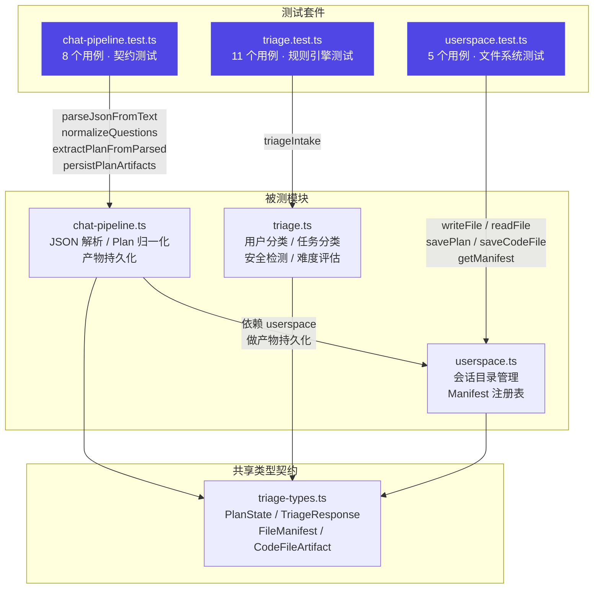
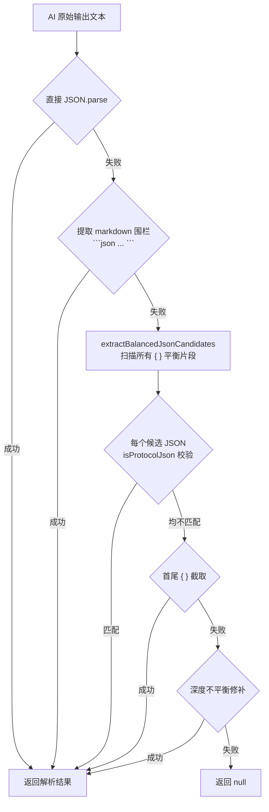
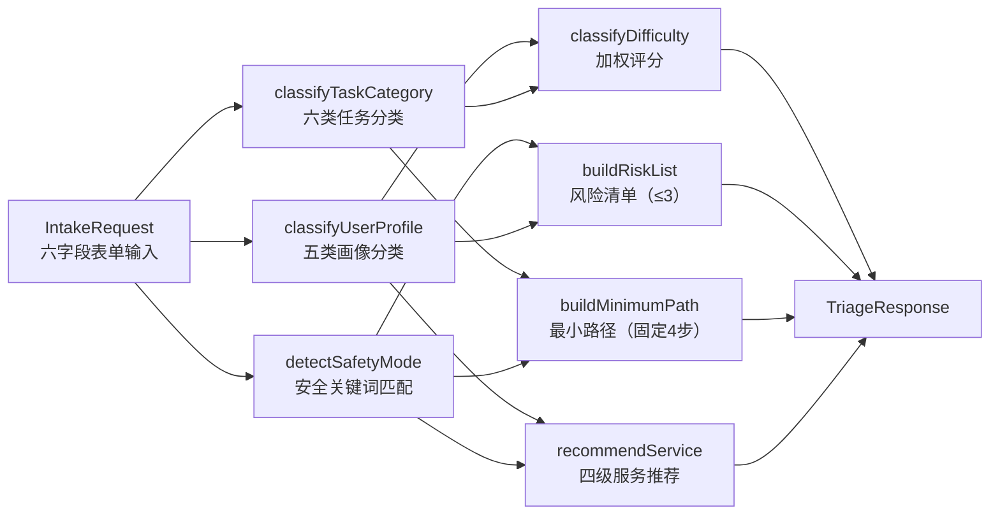

本项目采用 **Vitest** 作为测试框架，围绕三个核心后端模块构建了一套面向数据契约和纯函数行为的测试体系。三个测试文件（[chat-pipeline.test.ts](src/lib/chat-pipeline.test.ts)、[triage.test.ts](src/lib/triage.test.ts)、[userspace.test.ts](src/lib/userspace.test.ts)）分别覆盖 AI 输出解析、规则分诊引擎和会话文件系统三大子系统，总计 **22 个测试用例**。这套测试的核心理念是 **零外部依赖**——不启动 Next.js 服务、不调用 AI API、不依赖真实文件系统挂载，所有测试均在毫秒级完成。

Sources: [package.json](package.json#L10-L10), [chat-pipeline.test.ts](src/lib/chat-pipeline.test.ts#L1-L195), [triage.test.ts](src/lib/triage.test.ts#L1-L190), [userspace.test.ts](src/lib/userspace.test.ts#L1-L90)

## 测试架构总览

下图展示了三个测试套件与它们所验证的模块之间的关系。每个测试套件只验证 **纯函数逻辑**，将 AI 调用、文件 I/O 的副作用隔离在被测模块内部或通过 userspace 的本地文件系统抽象层进行。



测试配置极为轻量——项目没有独立的 `vitest.config.ts` 文件，完全依赖 Vitest 的零配置模式。`package.json` 中的 `"test": "vitest run"` 脚本执行一次性运行（非 watch 模式），配合 Vitest v4.0.7 的默认配置即可正确解析 TypeScript 测试文件。

Sources: [package.json](package.json#L9-L11)

## 契约测试：chat-pipeline.test.ts

**Chat Pipeline 契约测试**验证的是 AI 模型输出与系统内部数据结构之间的"翻译层"。在真实运行时，AI（如 DeepSeek）返回的是一段可能包含 markdown 围栏、前缀说明文字、甚至内部推理泄露的混合文本；[chat-pipeline.ts](src/lib/chat-pipeline.ts) 的职责是从这种不可靠输入中可靠地提取出结构化 JSON，再将其归一化为 [triage-types.ts](src/lib/triage-types.ts) 中定义的 `PlanState` 等类型。

### 测试用例全景

| 测试用例 | 验证的函数 | 核心契约 | 对应行号 |
|---------|-----------|---------|---------|
| extracts JSON from fenced or wrapped model output | `parseJsonFromText` | markdown 围栏 ` ```json ``` ` 和裸 JSON 均可提取 | [L15-L21](src/lib/chat-pipeline.test.ts#L15-L21) |
| extracts protocol JSON after a leaked process preface | `parseJsonFromText` | 泄露的内部阶段摘要不影响 JSON 提取 | [L23-L36](src/lib/chat-pipeline.test.ts#L23-L36) |
| does not expose protocol JSON as a plan-phase chat reply | `safeReplyFromUnparsedAiText` | planning/reviewing 阶段原始 JSON 不会被展示给用户 | [L38-L43](src/lib/chat-pipeline.test.ts#L38-L43) |
| splits one question containing A/B/C sub-options | `normalizeQuestions` | 含 A/B/C 内联子选项的问题被拆分为独立可选项 | [L45-L55](src/lib/chat-pipeline.test.ts#L45-L55) |
| removes a stem-only question when concrete options exist | `normalizeQuestions` | 抽象题干在存在具体问题时被去重 | [L57-L68](src/lib/chat-pipeline.test.ts#L57-L68) |
| normalizes plan fields and object-form steps | `extractPlanFromParsed` | snake_case 字段名、对象形式步骤被归一化 | [L70-L91](src/lib/chat-pipeline.test.ts#L70-L91) |
| persists plan plus Phase 4 document artifacts | `persistPlanArtifacts` | Plan + 摘要 + 检查清单 + 路径文档四件套持久化 | [L93-L121](src/lib/chat-pipeline.test.ts#L93-L121) |
| extracts code file artifacts from planning protocol JSON | `extractCodeFilesFromParsed` | 代码产物从协议 JSON 中提取并安全命名 | [L123-L156](src/lib/chat-pipeline.test.ts#L123-L156) |
| persists code artifacts beside plan documents | `persistPlanArtifacts` | 代码文件与 Plan 文档共存于同一会话目录 | [L158-L194](src/lib/chat-pipeline.test.ts#L158-L194) |

### 关键契约一：AI 输出的鲁棒解析

AI 模型的输出格式是不可控的。`parseJsonFromText` 函数（实现在 [chat-pipeline.ts#L6-L37](src/lib/chat-pipeline.ts#L6-L37)）采用 **多层降级策略** 来应对各种非标准输出：



测试用例 **"extracts protocol JSON after a leaked process preface"**（[L23-L36](src/lib/chat-pipeline.test.ts#L23-L36)）专门验证了这样一个真实场景：DeepSeek 模型在返回 JSON 之前，先输出了一段内部阶段摘要（`阶段：Plan 调整 -> Plan 调整`、`画像：已识别 7/10 个字段` 等），这些泄露的协议文本不应干扰 JSON 提取。`isProtocolJson` 函数（[chat-pipeline.ts#L39-L48](src/lib/chat-pipeline.ts#L39-L48)）通过检查 `reply`、`questions`、`plan`、`codeFiles` 等关键字段来识别合法的协议 JSON，避免将无关的 JSON 片段误认为模型输出。

### 关键契约二：Plan 字段归一化

AI 模型返回的 Plan JSON 字段名不固定——可能使用 `user_profile` 或 `userProfile`，步骤可能是字符串数组或 `{ step, time }` 对象数组。[extractPlanFromParsed](src/lib/chat-pipeline.ts#L266-L305) 通过 **多键探针** 和 **normalizeSteps** 实现了完全归一化：

```typescript
// 多键探针示例（chat-pipeline.ts L284-L289）
const userProfile = getString("userProfile", "user_profile", "summary", "用户画像");
const actionSteps = normalizeSteps(getArray("actionSteps", "action_steps", "steps", "行动步骤", "步骤"));
```

测试用例 **"normalizes plan fields and object-form steps"**（[L70-L91](src/lib/chat-pipeline.test.ts#L70-L91)）验证了以下归一化行为：`user_profile` → `userProfile`，`{ step: "确定最小问题", time: "今天" }` → `"确定最小问题（今天）"`，`{ risk: "范围过大" }` → `"范围过大"`。这保证了前端 [PlanPanel](src/components/plan-panel.tsx) 无论 AI 返回何种字段命名风格，都能拿到一致的 `PlanState` 结构。

### 关键契约三：产物持久化的完整性

`persistPlanArtifacts`（[chat-pipeline.ts#L472-L484](src/lib/chat-pipeline.ts#L472-L484)）在每次 Plan 生成或更新时，向 userspace 写入 **四种文档**：

| 文件名 | 类型标签 | 生成函数 | 内容特征 |
|--------|---------|---------|---------|
| `plan-v{n}.md` | `plan` | `planToMarkdown` | 完整科研探索计划，含画像/判断/步骤/风险 |
| `summary.md` | `summary` | `buildSummaryDocument` | 一页摘要：版本/判断/路线/下一步 |
| `action-checklist.md` | `checklist` | `buildChecklistDocument` | `- [ ]` 格式的行动检查清单 |
| `research-path.md` | `path` | `buildResearchPathDocument` | 路径说明：起点/路径/逻辑/分阶段 |

测试通过调用 `readFile` 回读文件内容并用 `getManifest` 验证注册表条目，确保写入内容与注册表元数据完全一致（[L93-L121](src/lib/chat-pipeline.test.ts#L93-L121)）。当存在代码产物（`CodeFileArtifact`）时，测试额外验证了代码文件的存储与 Manifest 注册（[L158-L194](src/lib/chat-pipeline.test.ts#L158-L194)）。

Sources: [chat-pipeline.ts](src/lib/chat-pipeline.ts#L6-L48), [chat-pipeline.ts](src/lib/chat-pipeline.ts#L266-L305), [chat-pipeline.ts](src/lib/chat-pipeline.ts#L472-L484), [chat-pipeline.ts](src/lib/chat-pipeline.ts#L399-L470), [chat-pipeline.test.ts](src/lib/chat-pipeline.test.ts#L15-L194)

## 规则引擎测试：triage.test.ts

**Triage 测试**验证的是纯规则驱动的分诊引擎 [triage.ts](src/lib/triage.ts)。与 Chat Pipeline 不同，分诊引擎不涉及 AI 调用，它接收一个 `IntakeRequest`（用户在 intake 表单中提交的六字段输入），经过一系列分类函数处理后返回 `TriageResponse`。测试的核心策略是 **输入空间穷举**——通过构造不同背景、不同卡点、不同目标的输入组合，验证每条分类规则是否按预期触发。

### 测试用例全景

| 测试用例 | 验证维度 | 输入构造策略 | 行号 |
|---------|---------|-------------|------|
| changes profile and recommendation when background changes | 画像分类 × 服务推荐 | 对比完全小白 vs 有能力用户 | [L16-L29](src/lib/triage.test.ts#L16-L29) |
| keeps the first action concrete and executable | minimumPath 质量 | 验证首步以"今天先"开头且不包含空泛建议 | [L31-L35](src/lib/triage.test.ts#L31-L35) |
| switches to safety mode for integrity violations | 安全模式触发 | topicText 包含"代写"+"伪造"关键词 | [L37-L46](src/lib/triage.test.ts#L37-L46) |
| routes anxious delivery users to a higher-touch recommendation | 焦虑型画像 × 时间压力 | 3天截止 + 交付材料目标 | [L48-L60](src/lib/triage.test.ts#L48-L60) |
| routes complete novice to topic understanding package | 完全小白型 → 课题理解包 | 完全小白 + 看不懂题目 + 先看懂课题 | [L63-L75](src/lib/triage.test.ts#L63-L75) |
| routes weak-background user to route package | 普通项目型 → 项目路线包 | 有一点基础 + 大创 + 做出 MVP | [L78-L90](src/lib/triage.test.ts#L78-L90) |
| routes capable researcher with literature blocker to free tier | 科研能力型 + 文献入门 → 免费 | 能读论文 + 不知道查什么 | [L93-L106](src/lib/triage.test.ts#L93-L106) |
| classifies presentation blocker as 汇报答辩 category | 任务分类：汇报答辩 | 不知道怎么汇报 + 准备汇报或答辩 | [L109-L120](src/lib/triage.test.ts#L109-L120) |
| maps unclear teacher requirement to topic understanding | 任务分类：课题理解 | 老师要求不清楚 | [L123-L132](src/lib/triage.test.ts#L123-L132) |
| classifies off-track project as 风险审查 | 任务分类：风险审查 | 已经做了但感觉跑偏 + 代码能力 | [L135-L145](src/lib/triage.test.ts#L135-L145) |
| always returns exactly 4 minimum path steps | minimumPath 长度不变量 | 5 种不同画像输入 | [L148-L161](src/lib/triage.test.ts#L148-L161) |
| returns at most 3 risks | riskList 长度上限 | 极端压力场景 | [L164-L176](src/lib/triage.test.ts#L164-L176) |
| rates difficulty high for competition with tight deadline | 难度评估：竞赛 × 紧截止 | 竞赛 + 3天内 + 完全小白 | [L179-L189](src/lib/triage.test.ts#L179-L189) |

### 分类决策树的测试覆盖

[triageIntake](src/lib/triage.ts#L30-L65) 函数内部按顺序调用了七个分类子函数，形成一条 **无分支副作用** 的纯函数管道：



测试用例的设计遵循了 **决策表测试**（Decision Table Testing）思想。以用户画像分类为例，[classifyUserProfile](src/lib/triage.ts#L71-L103) 的优先级链是：焦虑检测 → 科研能力 → 完全小白 → 普通项目 → 基础薄弱。测试用例通过精心构造的输入，逐一验证了每条优先级路径的正确触发：

- **焦虑型触发**（[L48-L60](src/lib/triage.test.ts#L48-L60)）：`currentBlocker = "不知道能不能做出来"` 直接匹配焦虑条件
- **科研能力型**（[L93-L106](src/lib/triage.test.ts#L93-L106)）：`backgroundLevel = "能独立读论文或做实验"` 命中第二优先级
- **完全小白型**（[L63-L75](src/lib/triage.test.ts#L63-L75)）：`backgroundLevel = "完全小白"` 在不焦虑时命中第三优先级
- **普通项目型**（[L78-L90](src/lib/triage.test.ts#L78-L90)）：`goalType = "做出 MVP"` + `taskType = "大创"` 命中第四优先级

### 安全模式测试

安全边界检测（[detectSafetyMode](src/lib/triage.ts#L67-L69)）维护了一个包含 12 个模式的黑名单（`代写`、`伪造数据`、`绕过查重` 等），测试用例 **"switches to safety mode for integrity violations"**（[L37-L46](src/lib/triage.test.ts#L37-L37)）在 `topicText` 中同时注入了"代写"和"伪造"两个关键词，验证了三个安全契约：`safetyMode` 标志为 `true`，服务推荐降级为 `"免费继续问"`，风险列表中出现学术诚信风险提示。这正是 [安全边界检测：代写/伪造识别与合规降级路径](16-an-quan-bian-jie-jian-ce-dai-xie-wei-zao-shi-bie-yu-he-gui-jiang-ji-lu-jing) 页面所描述的运行时行为在测试层面的落地。

Sources: [triage.ts](src/lib/triage.ts#L30-L69), [triage.ts](src/lib/triage.ts#L71-L103), [triage.ts](src/lib/triage.ts#L105-L140), [triage.test.ts](src/lib/triage.test.ts#L16-L189)

## Userspace 文件系统测试：userspace.test.ts

**Userspace 测试**验证的是会话级别的文件持久化层 [userspace.ts](src/lib/userspace.ts)。该模块在 `process.cwd()/userspace/{sessionId}/` 目录下为每个会话创建独立的文件空间，管理文档读写和 Manifest 注册表。测试覆盖了三个核心维度：**基础读写契约**、**路径安全校验**、**Manifest 元数据一致性**。

### 测试用例全景

| 测试用例 | 验证维度 | 核心断言 | 行号 |
|---------|---------|---------|------|
| writes, reads, and records plan files | 读写一致性 + Manifest 注册 | writeFile → readFile 内容一致；savePlan 注册 type: "plan" | [L6-L22](src/lib/userspace.test.ts#L6-L22) |
| rejects unsafe path segments | 路径穿越防护 | `../`、嵌套路径、分号被拒绝 | [L24-L29](src/lib/userspace.test.ts#L24-L29) |
| records Phase 4 document artifact types | 四种文档类型的 Manifest 记录 | summary/checklist/path 类型正确注册 | [L31-L45](src/lib/userspace.test.ts#L31-L45) |
| records code artifact metadata for preview | 代码产物元数据 | type: "code" + language 字段完整 | [L47-L63](src/lib/userspace.test.ts#L47-L63) |
| filters stale manifest entries whose files no longer exist | Manifest 与实际文件的一致性 | 缺失文件条目被自动过滤 | [L65-L89](src/lib/userspace.test.ts#L65-L89) |

### 路径安全校验机制

[assertSafeSegment](src/lib/userspace.ts#L8-L12) 是 Userspace 安全模型的核心防线。它通过正则表达式 `^[a-zA-Z0-9_.-]+$` 约束 sessionId 和 filename 只能包含安全字符，并额外检测 `..` 序列防止目录穿越。测试用例 **"rejects unsafe path segments"**（[L24-L29](src/lib/userspace.test.ts#L24-L29)）验证了四种攻击向量：

| 攻击向量 | 测试输入 | 预期异常 |
|---------|---------|---------|
| sessionId 穿越 | `../escape` | `Invalid sessionId` |
| filename 穿越 | `../escape.md` | `Invalid filename` |
| 嵌套路径 | `nested/escape.md` | `Invalid filename` |
| 注入字符 | `semi;colon.md` | `Invalid filename` |

[filePath](src/lib/userspace.ts#L21-L30) 函数在 `assertSafeSegment` 之后还做了二次校验——通过 `path.resolve` 解析绝对路径后，验证其仍然位于会话根目录之下，形成 **双重防护**。

### Manifest 过滤：防御幽灵条目

测试用例 **"filters stale manifest entries"**（[L65-L89](src/lib/userspace.test.ts#L65-L89)）验证了 [getManifest](src/lib/userspace.ts#L113-L128) 的自愈机制：当 manifest.json 中记录了某个文件但该文件实际不存在时，`getManifest` 会自动过滤掉该条目。这个设计防止了因外部删除或持久化失败导致的"幽灵条目"问题——前端 [FileList](src/components/file-list.tsx) 组件只会看到真实存在的文件。

Sources: [userspace.ts](src/lib/userspace.ts#L8-L30), [userspace.ts](src/lib/userspace.ts#L113-L128), [userspace.ts](src/lib/userspace.ts#L170-L224), [userspace.test.ts](src/lib/userspace.test.ts#L6-L89)

## 测试执行与工程配置

项目使用 **Vitest v4.0.7**，通过 `npm test`（即 `vitest run`）执行全部测试。由于没有独立的 `vitest.config.ts`，Vitest 自动发现 `src/lib/**/*.test.ts` 文件并使用默认 TypeScript 编译配置。测试的运行环境是 Node.js，利用了 [userspace.ts](src/lib/userspace.ts#L6-L6) 中 `process.cwd()` + `/userspace/` 的本地文件系统路径——测试用例通过 `Date.now()` 生成唯一 sessionId，确保每次运行不会互相干扰。

### 各套件的测试特征对比

| 维度 | chat-pipeline.test.ts | triage.test.ts | userspace.test.ts |
|------|----------------------|----------------|-------------------|
| **用例数** | 8（实际 describe 内 9 个 it） | 11 | 5 |
| **测试类型** | 契约测试 + 集成测试 | 决策表测试 + 不变量测试 | 读写契约 + 安全测试 |
| **外部依赖** | 依赖 userspace 做产物持久化 | 无（纯函数） | Node.js fs 模块 |
| **被测函数** | 6 个导出函数 | 1 个导出函数 | 7 个导出函数 |
| **副作用** | 文件写入（通过 userspace） | 无 | 文件写入 |
| **关键不变量** | Plan 四件套完整持久化 | minimumPath 长度恒为 4、riskList ≤ 3 | sessionId/filename 安全校验 |

### 测试与类型系统的协同

三个测试套件共享 [triage-types.ts](src/lib/triage-types.ts) 中定义的类型契约。`PlanState`（[L136-L148](src/lib/triage-types.ts#L136-L148)）、`FileManifest`（[L159-L166](src/lib/triage-types.ts#L159-L166)）、`TriageResponse`（[L97-L108](src/lib/triage-types.ts#L97-L108)）等类型定义既是 TypeScript 编译器的类型检查依据，也是测试断言的"活文档"。例如，chat-pipeline 测试中的 `expect.objectContaining({ filename: "plan-v2.md", type: "plan", version: 2 })` 直接对应了 `FileManifest` 类型的字段结构。而 [API 请求/响应契约与 Zod 校验 Schema](23-api-qing-qiu-xiang-ying-qi-yue-yu-zod-xiao-yan-schema) 页面所描述的 Zod Schema（如 `intakeSchema`）则进一步为 Intake 表单提供了运行时校验——triage 测试中构造的 `baseInput` 对象正是该 Schema 的合法实例。

Sources: [package.json](package.json#L19-L25), [triage-types.ts](src/lib/triage-types.ts#L97-L170), [userspace.ts](src/lib/userspace.ts#L6-L6)

## 扩展测试的策略建议

基于现有测试架构的三个分层，如果需要扩展测试覆盖面，建议遵循以下方向：

**Chat Pipeline 测试**的薄弱点在于 `extractQuestionsFromText`（[chat-pipeline.ts#L88-L104](src/lib/chat-pipeline.ts#L88-L104)）和 `parsePlanFromMarkdown`（[chat-pipeline.ts#L179-L237](src/lib/chat-pipeline.ts#L179-L237)）两个导出函数目前没有直接测试。前者负责从 AI 的自由文本输出中提取结构化问题列表（支持编号列表和 bullet 列表两种格式），后者负责从 Markdown 格式的 Plan 文档中反向解析出 `PlanState`。补充这两个函数的测试可以显著提高 AI 输出异常时的回归检测能力。

**Triage 测试**可以增加 **边界值测试**——例如 `difficulty` 评分恰好处于分界点（`score = 1`、`score = 3`、`score = 5`）时的分类结果。当前的测试只验证了"竞赛+3天+小白 → 中高/高"这一组合，但 `classifyDifficulty`（[triage.ts#L161-L217](src/lib/triage.ts#L161-L217)）的加权评分机制有四个分界点，值得逐一覆盖。

**Userspace 测试**可以考虑增加 **并发写入** 和 **大文件** 场景的测试。当前所有测试都是单线程顺序执行，但 [savePlan](src/lib/userspace.ts#L171-L186) 和 [upsertManifest](src/lib/userspace.ts#L131-L145) 的"读取-修改-写入"模式在高并发场景下可能产生竞态条件。

Sources: [chat-pipeline.ts](src/lib/chat-pipeline.ts#L88-L104), [chat-pipeline.ts](src/lib/chat-pipeline.ts#L179-L237), [triage.ts](src/lib/triage.ts#L161-L217), [userspace.ts](src/lib/userspace.ts#L131-L145)

## 延伸阅读

- 要理解 Chat Pipeline 在完整请求链路中的位置，参见 [/api/chat 核心端点：请求编排、会话恢复与阶段推进](9-api-chat-he-xin-duan-dian-qing-qiu-bian-pai-hui-hua-hui-fu-yu-jie-duan-tui-jin)
- 要了解 triage 引擎的分类规则详情，参见 [规则分诊引擎 triage.ts：用户分类、任务分类与风险评估](15-gui-ze-fen-zhen-yin-qing-triage-ts-yong-hu-fen-lei-ren-wu-fen-lei-yu-feng-xian-ping-gu)
- 要了解 Userspace 的完整持久化设计，参见 [Userspace 文件系统：会话产物持久化与版本管理](14-userspace-wen-jian-xi-tong-hui-hua-chan-wu-chi-jiu-hua-yu-ban-ben-guan-li)
- 要了解类型系统如何为测试提供契约基础，参见 [核心类型定义 triage-types.ts：表单枚举、画像状态、Plan 结构与 API 响应](22-he-xin-lei-xing-ding-yi-triage-types-ts-biao-dan-mei-ju-hua-xiang-zhuang-tai-plan-jie-gou-yu-api-xiang-ying)