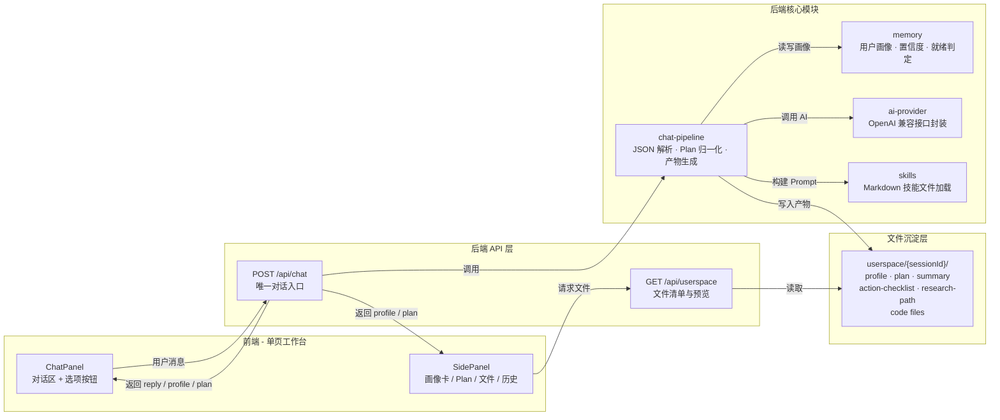
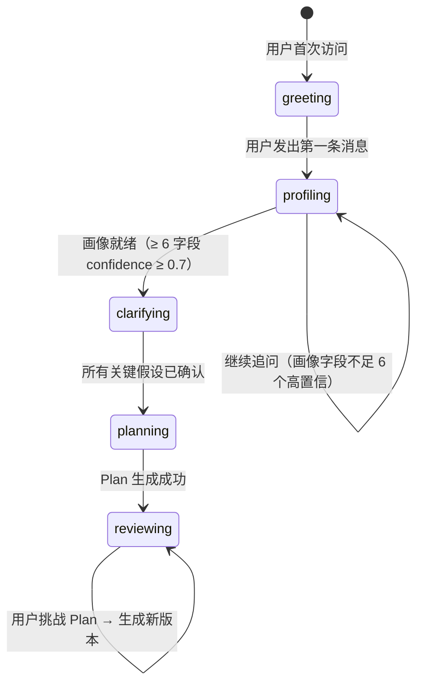

**Research-Triage（人人都能做科研）** 是一个 AI 科研启蒙与路径引导平台。它不做通用聊天，也不替用户写论文——它通过多轮对话帮助非专业用户从「我对科研感兴趣但不知道怎么开始」走到「我有一份适合自身基础的可执行探索 Plan」。本文档将带你快速理解这个项目的愿景、核心架构、技术选型与代码组织方式，为后续深入阅读各模块文档建立全局认知。

Sources: [README.md](README.md#L1-L15), [人人都能做科研_mvp_prd_审查版 V1.1.md](人人都能做科研_mvp_prd_审查版%20V1.1.md#L1-L13)

## 项目愿景与解决的问题

科研能力本质上是一种普遍能力：提出问题、搜集信息、验证假设、形成解释、记录过程、分享结果。然而，传统科研训练默认用户已在专业体系内（学校、实验室、导师制），导致大量普通人视科研为高门槛、远距离的事情。本项目的核心判断是：**用户不缺兴趣，缺的是一个足够低门槛、足够会引导、足够贴近个人状态的科研入口。**

产品外层使用用户熟悉的傻瓜式交互（打开页面、输入一句话、点击按钮、看文档），内层运行的是完整的科研分诊、画像识别、问题拆解、Plan 生成和路径引导流程。MVP 只验证一个核心闭环：

```text
用户输入模糊想法
  → 系统识别用户画像
  → 系统多轮追问与博弈
  → 系统生成科研探索 Plan
  → 用户审查、拆解、调整 Plan
  → 系统输出可读文档与行动清单
```

Sources: [人人都能做科研_mvp_prd_审查版 V1.1.md](人人都能做科研_mvp_prd_审查版%20V1.1.md#L200-L279)

## 核心架构总览

整个系统围绕「**单页工作台 + 单 API 入口 + userspace 文件沉淀**」三层架构构建。用户面对的始终是一个页面，所有对话都走同一个 API，所有 AI 生成的产物都沉淀为文件供右侧面板预览。



从架构图可以清晰地看到数据流方向：前端将用户消息发送到 `POST /api/chat`，后端依次经过 Skills 加载（构建系统 Prompt）→ AI 调用 → JSON 解析与 Plan 归一化 → 画像更新 → 产物写入 userspace，最后将结构化响应返回前端。前端同时更新左侧对话区和右侧面板。

Sources: [README.md](README.md#L33-L68), [ARCHITECTURE.md](ARCHITECTURE.md#L1-L32)

## 技术栈一览

项目选择了精简、现代的技术栈，以最小依赖完成核心闭环：

| 层级 | 技术 | 说明 |
|---|---|---|
| Web 框架 | **Next.js 16** App Router | 单页工作台 + Route Handlers |
| 语言 | **TypeScript** | 前后端共享类型，核心类型定义在 `triage-types.ts` |
| UI | **React 19** | 客户端状态使用 `useState` + `sessionStorage` 持久化 |
| AI 调用 | 裸 `fetch` 调 OpenAI-compatible API | 避免 SDK 兼容问题，支持 DeepSeek / OpenAI 等多 Provider |
| 校验 | **Zod** | 运行时类型校验 |
| Markdown | **marked** | Plan 与文档的渲染 |
| 测试 | **Vitest** | 契约测试覆盖管线、userspace 与分诊 |
| 存储 | 内存 Map + 磁盘文件 | MVP 阶段足够，后续可替换为 DB |

Sources: [package.json](package.json#L1-L26), [ARCHITECTURE.md](ARCHITECTURE.md#L22-L32)

## 项目目录结构

代码组织遵循清晰的职责分层。以下标注了每个关键文件/目录的核心职责：

```text
.
├── skills/                          # 🧠 十大科研方法论技能文件（Markdown）
│   ├── 00-core-methodology.md       #   强制五步流程 + 同级审查
│   ├── 01-question-decomposition.md #   问题拆解
│   ├── 02-knowledge-gap-analysis.md #   知识缺口分析
│   ├── 03-hypothesis-testing.md     #   假设验证
│   ├── 04-evidence-evaluation.md    #   证据分级
│   ├── 05-iterative-refinement.md   #   迭代修正
│   ├── 06-ambiguity-surfacing.md    #   模糊点暴露
│   ├── 07-peer-review-simulation.md #   同行评审模拟
│   ├── 08-communication-protocol.md #   沟通协议
│   └── 09-safety-boundary.md        #   安全边界
│
├── src/
│   ├── app/
│   │   ├── page.tsx                 # 🖥️ 唯一主工作台页面
│   │   ├── layout.tsx               #   根布局
│   │   ├── globals.css              #   全局样式
│   │   ├── intake/page.tsx          #   兼容跳转 → /
│   │   ├── result/page.tsx          #   兼容跳转 → /
│   │   ├── route-plan/page.tsx      #   兼容跳转 → /
│   │   └── api/
│   │       ├── chat/route.ts        # 🔌 唯一对话 API 入口
│   │       └── userspace/           # 📁 文件清单、预览、下载
│   │
│   ├── components/                  # 🎨 UI 组件
│   │   ├── chat-panel.tsx           #   对话气泡 + 选项按钮
│   │   ├── chat-input.tsx           #   输入框
│   │   ├── choice-buttons.tsx       #   结构化选项按钮
│   │   ├── side-panel.tsx           #   右侧面板容器
│   │   ├── plan-panel.tsx           #   Plan 展示 + 调整按钮
│   │   ├── plan-history-panel.tsx   #   Plan 历史版本对比
│   │   ├── file-list.tsx            #   文件列表
│   │   ├── doc-panel.tsx            #   文档预览
│   │   └── process-panel.tsx        #   流程摘要展示
│   │
│   └── lib/                         # ⚙️ 后端核心逻辑
│       ├── ai-provider.ts           #   AI 调用封装
│       ├── chat-pipeline.ts         #   JSON 解析 · Plan 归一化 · 产物生成
│       ├── chat-prompts.ts          #   阶段式 Prompt 模板
│       ├── memory.ts                #   用户画像记忆 + 置信度
│       ├── skills.ts                #   Skills 加载与注入
│       ├── userspace.ts             #   会话文件系统
│       ├── triage.ts                #   规则分诊引擎（AI 失败兜底）
│       └── triage-types.ts          #   共享类型定义
```

Sources: [README.md](README.md#L33-L67), [ARCHITECTURE.md](ARCHITECTURE.md#L35-L59)

## 对话阶段状态机

系统通过一个五阶段状态机驱动整个对话流程。每个阶段有明确的目标和允许的产物类型，阶段推进由画像就绪判定和 AI 输出共同决定：

| 阶段 | 目标 | 允许产物 | 推进条件 |
|---|---|---|---|
| **greeting** | 首次引导，获取初始信号 | `reply`, `questions` | 用户发出第一条消息后自动进入 |
| **profiling** | 提取用户画像的 10 个字段 | `profile`, `profileConfidence`, `questions` | 置信度 ≥ 0.7 的字段达到 6 个以上 |
| **clarifying** | Plan 前置检查，暴露模糊点 | 假设确认、追问选项 | 所有关键假设被用户确认 |
| **planning** | 生成科研探索 Plan | `plan-v{n}.md`, `summary.md`, `action-checklist.md`, `research-path.md`，必要时生成代码文件 | Plan 生成成功 |
| **reviewing** | 根据用户反馈调整 Plan | 新版本 Plan + 刷新配套文档 | 用户点击「更简单/更专业/拆开讲/换方向」 |



Sources: [ARCHITECTURE.md](ARCHITECTURE.md#L86-L104), [src/lib/triage-types.ts](src/lib/triage-types.ts#L168-L170)

## 产物文件系统

AI 生成的所有用户可见产物通过 **userspace 文件系统** 沉淀到磁盘，以 `sessionId` 为隔离单位：

| 文件 | 生成时机 | 说明 |
|---|---|---|
| `profile.md` | 画像字段有更新时 | 用户画像 Markdown 摘要，含 10 字段与置信度标记 |
| `plan-v{n}.md` | planning / reviewing 阶段 | 每次生成或调整都会写新版本，旧版不删除 |
| `summary.md` | 随当前 Plan 刷新 | Plan 的简明摘要 |
| `action-checklist.md` | 随当前 Plan 刷新 | 可执行的行动清单 |
| `research-path.md` | 随当前 Plan 刷新 | 推荐的科研路径 |
| `code-v{n}-*.py` 等 | Plan 包含代码产物时 | 独立代码文件，manifest 记录语言类型 |
| `manifest.json` | 每次写入产物时更新 | 文件清单元数据，记录文件类型、版本和创建时间 |

Sources: [ARCHITECTURE.md](ARCHITECTURE.md#L173-L192), [README.md](README.md#L156-L172)

## MVP 边界：明确不做的事

理解一个项目不仅要看它做了什么，也要看它刻意不做什么。当前 MVP 阶段明确不包含以下能力，以确保核心闭环不被稀释：

- ❌ 用户登录与多设备同步
- ❌ 文件上传
- ❌ 真实学生实验数据采集
- ❌ 自动生成完整论文
- ❌ 后台人工审核系统
- ❌ 图片/图示产物展示（后续可扩展）

这些能力都可以在 MVP 验证后以模块方式加入，但不得破坏 `POST /api/chat + userspace + 单页工作台` 的主链路架构。

Sources: [ARCHITECTURE.md](ARCHITECTURE.md#L251-L262)

## 推荐阅读路径

以下是根据文档目录结构推荐的渐进式阅读路线，帮助你从全局理解逐步深入到具体实现细节：

**第一阶段：环境搭建与核心流程**
1. 📖 [项目概览：让普通人走进科研思维](1-xiang-mu-gai-lan-rang-pu-tong-ren-zou-jin-ke-yan-si-wei)（当前页面）
2. 🚀 [快速开始：环境搭建与首次运行](2-kuai-su-kai-shi-huan-jing-da-jian-yu-shou-ci-yun-xing) — 跑起来再说
3. 🔄 [核心对话闭环：从模糊想法到可执行 Plan](3-he-xin-dui-hua-bi-huan-cong-mo-hu-xiang-fa-dao-ke-zhi-xing-plan) — 理解主流程

**第二阶段：界面与交互**
4. 💬 [左侧聊天面板：对话、选项与自由输入](4-zuo-ce-liao-tian-mian-ban-dui-hua-xuan-xiang-yu-zi-you-shu-ru)
5. 📋 [右侧面板：画像、Plan、文件与历史对比](5-you-ce-mian-ban-hua-xiang-plan-wen-jian-yu-li-shi-dui-bi)

**第三阶段：架构深入**
6. 🏗️ [系统架构总览](6-xi-tong-jia-gou-zong-lan-dan-ye-gong-zuo-tai-dan-api-ru-kou-userspace-wen-jian-chen-dian)
7. ⚙️ [对话阶段状态机](7-dui-hua-jie-duan-zhuang-tai-ji-greeting-profiling-clarifying-planning-reviewing)

根据你的角色，也可以选择性跳读：**前端开发者**建议重点看第二阶段 + [前端状态管理](8-qian-duan-zhuang-tai-guan-li-sessionstorage-chi-jiu-hua-yu-che-xiao-ji-zhi)；**后端开发者**建议重点看第三阶段 + [后端核心模块](9-ai-shu-chu-jie-xi-json-ti-qu-xie-yi-shi-bie-yu-markdown-dou-di) 各节；**Prompt 工程师**建议从 [阶段式 Prompt 设计](14-jie-duan-shi-prompt-she-ji-mei-ge-jie-duan-de-json-shu-chu-xie-yi) 开始阅读。