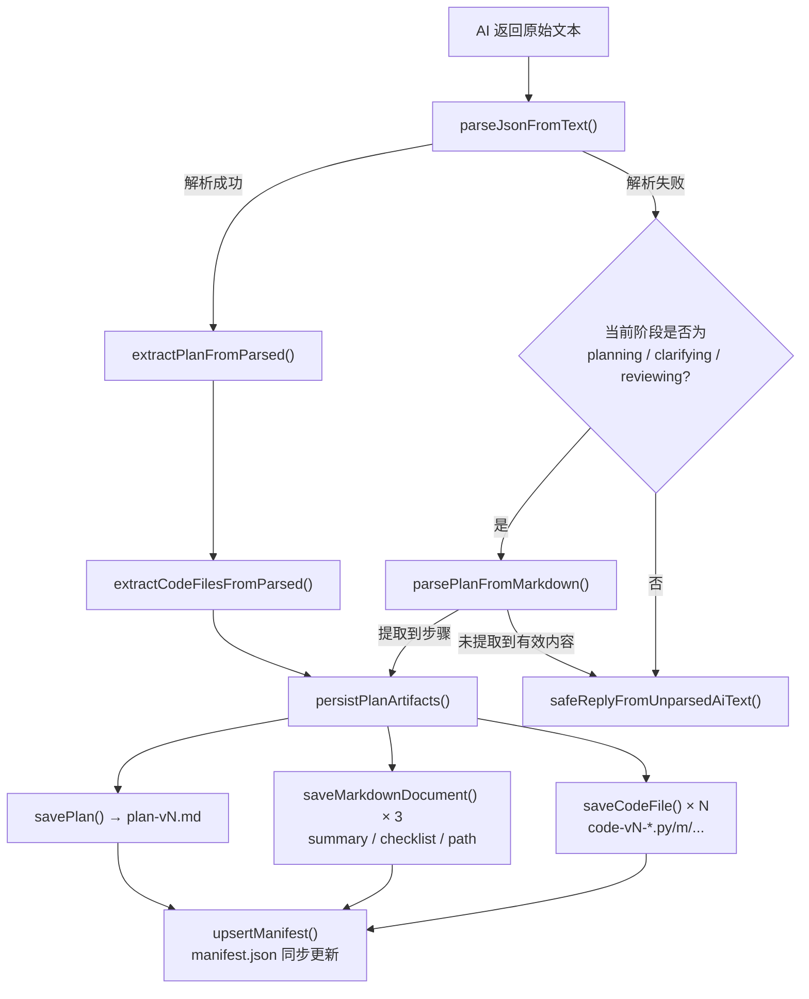

当对话状态机推进到 **planning** 或 **reviewing** 阶段时，系统触发 Plan 产物生成流程。AI 模型在一次调用中同时输出结构化 JSON（包含 `plan` + `codeFiles`），管线从中提取、归一化、持久化四类文档产物和若干代码文件，全部写入 userspace 文件系统。本文档聚焦于这一从 AI 输出到文件沉淀的完整数据流。

Sources: [chat-pipeline.ts](src/lib/chat-pipeline.ts#L1-L10), [triage-types.ts](src/lib/triage-types.ts#L135-L169)

## Plan 产物的七种类型与四类文件

系统在 `PlanState` 类型中定义了 Plan 的七个核心字段，每个字段在 Plan 面板中对应一个可折叠的区块。同时，`persistPlanArtifacts` 函数将这些字段重组为四类磁盘文件——plan、summary、checklist、research-path——加上可选的代码文件，统一写入 `userspace/{sessionId}/` 目录。

| 产物类型 | 磁盘文件名模式 | FileManifest.type | 内容来源 | 用途 |
|---|---|---|---|---|
| **Plan 文档** | `plan-v{n}.md` | `plan` | `planToMarkdown()` 全量序列化 | 版本化存档，支持历史对比和崩溃恢复 |
| **摘要文档** | `summary.md` | `summary` | `buildSummaryDocument()` 精简输出 | 快速回顾当前版本核心判断 |
| **行动清单** | `action-checklist.md` | `checklist` | `buildChecklistDocument()` 带 checkbox | 用户逐项勾选执行进度 |
| **科研路径** | `research-path.md` | `path` | `buildResearchPathDocument()` 分阶段编排 | 展示从画像到行动的完整路径推理 |
| **代码文件** | `code-v{n}-{name}.{ext}` | `code` | AI 原始 `codeFiles` 输出 | 最小可运行/可验证的脚本、配置、Demo 骨架 |

Sources: [triage-types.ts](src/lib/triage-types.ts#L136-L166), [chat-pipeline.ts](src/lib/chat-pipeline.ts#L399-L484)

## Plan 生成的端到端数据流

下面的流程图展示了从 AI 原始文本到磁盘文件沉淀的完整路径，包括 JSON 解析成功和失败两条分支：



**关键设计决策**：`persistPlanArtifacts` 是一个原子操作——无论代码文件是否存在，四类文档始终全量写入。这保证了文件列表中 plan/summary/checklist/path 四者的版本号始终一致。

Sources: [chat-pipeline.ts](src/lib/chat-pipeline.ts#L266-L484), [route.ts](src/app/api/chat/route.ts#L270-L295)

## PlanState 的字段归一化策略

AI 模型的输出并非总是精确遵循协议定义的字段名。`extractPlanFromParsed` 函数实现了**多候选键名查找**策略，对七个核心字段各自维护一组可接受的键名，按优先级逐一尝试：

| 规范字段名 | 可接受的 AI 输出键名 |
|---|---|
| `userProfile` | `userProfile`, `user_profile`, `summary`, `用户画像` |
| `problemJudgment` | `problemJudgment`, `problem_judgment`, `problem`, `问题判断` |
| `systemLogic` | `systemLogic`, `system_logic`, `logic`, `系统逻辑`, `判断逻辑` |
| `recommendedPath` | `recommendedPath`, `recommended_path`, `path`, `推荐路径`, `路径` |
| `actionSteps` | `actionSteps`, `action_steps`, `steps`, `行动步骤`, `步骤` |
| `riskWarnings` | `riskWarnings`, `risk_warnings`, `risks`, `风险提示`, `风险` |
| `nextOptions` | `nextOptions`, `next_options`, `options`, `下一步` |

对于 `actionSteps`，归一化还额外处理对象形式的步骤项——若 AI 返回 `{step, time}` 或 `{description}` 等结构化对象，系统会将其展平为 `"步骤内容（时间估算）"` 格式的字符串。类似地，`riskWarnings` 也会从 `{risk, description}` 等嵌套结构中提取纯文本。

Sources: [chat-pipeline.ts](src/lib/chat-pipeline.ts#L266-L305), [chat-pipeline.ts](src/lib/chat-pipeline.ts#L239-L264)

## 代码文件提取与安全清洗

代码文件是 Plan 产物中唯一由 AI 直接生成完整内容的文件类型。提取管线执行以下步骤：

1. **定位数据源**：在 JSON 的顶层和 `plan` 嵌套层中分别查找 `codeFiles`、`code_files` 三个候选键名。
2. **内容字段归一化**：每个文件对象的 `content`/`code`/`source` 三个键名均可接受，按优先级取第一个非空值。
3. **语言识别**：`language`/`lang` → 默认 `"text"`。
4. **文件名清洗**（`sanitizeCodeFilename`）：
   - 将空格替换为连字符
   - 剔除非 `a-zA-Z0-9_.-` 字符
   - 防止连续连字符和前导点号
   - 根据语言自动补充扩展名（如 `matlab` → `.m`、`python` → `.py`）
   - 强制添加 `code-v{version}-` 前缀，确保版本可追溯
5. **版本绑定**：每个 `CodeFileArtifact` 的 `version` 字段与当前 Plan 版本号一致。

以下展示了实际测试用例中的文件名转换效果：

| AI 输出文件名 | 语言 | 版本 | 洗后磁盘文件名 |
|---|---|---|---|
| `"planar 2r forward"` | `matlab` | v4 | `code-v4-planar-2r-forward.m` |
| `"../unsafe.py"` | `python` | v4 | `code-v4-unsafe.py` |
| (空) | `text` | v3 | `code-v3-code-1.txt` |

Sources: [chat-pipeline.ts](src/lib/chat-pipeline.ts#L307-L397), [chat-pipeline.test.ts](src/lib/chat-pipeline.test.ts#L123-L156)

## Markdown 兜底解析器

当 AI 输出完全无法解析为 JSON 时（常见于模型温度过高或协议泄漏），系统在 `planning`/`clarifying`/`reviewing` 三个阶段会启用 `parsePlanFromMarkdown` 兜底解析器。该函数使用一系列正则表达式从 Markdown 结构化文本中提取 Plan 字段：

- **画像/问题判断/系统逻辑/路径**：匹配 `## 标题\n+内容` 模式，在遇到下一个 `##`、`---` 或文本结尾时截断。
- **步骤列表**：先匹配 `## 步骤` 下的有序列表，若未找到则回退到全文最后 8 个有序列表项。
- **风险列表**：匹配 `## 风险` 下的无序列表，最多取 5 条。

只有当画像、问题判断、步骤三者全部为空时才返回 `null`，否则用默认值填充缺失字段并构造一个完整的 `PlanState`。这一兜底机制确保了即使在 AI 输出格式严重偏离协议时，用户仍能获得可用的 Plan 产物。

Sources: [chat-pipeline.ts](src/lib/chat-pipeline.ts#L179-L237)

## Clarifying → Planning 的自动推进

一个值得注意的特殊路径出现在 `clarifying` 阶段。当 AI 在 clarifying 回复中同时返回 `checklistPassed: true` 但没有附带 `plan` 对象时，路由处理器会**在同一请求内发起第二次 AI 调用**，直接跳入 planning 阶段：

```typescript
// clarifying 通过检查清单但未返回 plan → 立即追加 planning 调用
if (session.phase === "clarifying" && checklistPassed && !planState) {
  const planningSystemPrompt = buildChatSystemPrompt(session.memory, "planning", PLANNING_INSTRUCTION, session.plan);
  // ...第二次 AI 调用...
  persistPlanArtifacts(sessionId, planState, planningCodeFiles);
}
```

这意味着用户在一次对话轮次中可能触发两次 AI 调用——第一次完成前置检查，第二次立即生成 Plan。这是系统中唯一的「单轮双调用」模式，其设计目的是避免用户在 clarifying→planning 的边界上遭遇空回复。

Sources: [route.ts](src/app/api/chat/route.ts#L334-L378)

## Reviewing 阶段的版本迭代机制

在 `reviewing` 阶段，用户的每一次调整请求（"更简单"、"更专业"、"拆开讲"、"换方向" 或自由文本反馈）都会触发一个新版本的 Plan 生成。版本号由 `(session.plan?.version ?? 0) + 1` 递增计算，确保每次修订都产生一个独立的 `plan-v{N}.md` 文件：

```typescript
const version = (session.plan?.version ?? 0) + 1;
const extractedPlan = extractPlanFromParsed(parsed, version);
if (extractedPlan && extractedPlan.actionSteps.length > 0) {
  planState = extractedPlan;
  if (session.phase === "reviewing") {
    planState.modifiedReason = message; // 记录用户原始反馈
  }
  persistPlanArtifacts(sessionId, planState, extractedCodeFiles);
  session.plan = planState;
}
```

历史版本不会被删除——`plan-v1.md`、`plan-v2.md`、`plan-v3.md` 共存于同一 userspace 目录中。`restoreLatestPlan` 在服务重启时通过 `manifest.json` 中 `type === "plan"` 条目的最高版本号来恢复最新 Plan，同时保留全部历史文件供 [右侧面板：画像、Plan、文件与历史对比](5-you-ce-mian-ban-hua-xiang-plan-wen-jian-yu-li-shi-dui-bi) 页面使用。

Sources: [route.ts](src/app/api/chat/route.ts#L278-L295), [chat-pipeline.ts](src/lib/chat-pipeline.ts#L486-L506)

## 产物持久化的文件系统层

`persistPlanArtifacts` 调用的底层函数均来自 [userspace 文件系统](20-userspace-wen-jian-xi-tong-hui-hua-ge-chi-lu-jing-an-quan-xiao-yan-yu-wen-jian-qing-dan-guan-li) 模块。每次写入都同步更新 `manifest.json`，该文件是文件列表 UI 和服务重启恢复的唯一数据源：

| 持久化函数 | 写入文件 | manifest.type | 特殊处理 |
|---|---|---|---|
| `savePlan()` | `plan-v{version}.md` | `plan` | 文件名含版本号，每次新增不覆盖 |
| `saveMarkdownDocument()` | `summary.md` / `action-checklist.md` / `research-path.md` | `summary` / `checklist` / `path` | 固定文件名，每次覆盖更新 |
| `saveCodeFile()` | `code-v{version}-{name}.{ext}` | `code` | 携带 `language` 字段供前端语法高亮 |

所有文件写入都经过 `assertSafeSegment` 路径安全校验，防止目录遍历攻击。`upsertManifest` 采用文件名去重策略——同文件名覆盖更新，新文件名追加条目。

Sources: [userspace.ts](src/lib/userspace.ts#L155-L224), [chat-pipeline.ts](src/lib/chat-pipeline.ts#L472-L484)

## 前端展示：Plan 面板与文件列表的协作

Plan 生成后，前端通过两条路径展示产物：

**PlanPanel**（`plan-panel.tsx`）直接消费 `PlanState` 对象，将七个字段渲染为可折叠的 Section 区块。每个行动步骤行内嵌四个操作按钮（更简单/更专业/拆开讲/换方向），点击后向 API 发送调整请求。步骤按钮会携带步骤索引和原文，格式为 `请把科研探索计划 v{N} 的第 {i+1} 步调整为「{action}」。原步骤：{step}`。

**FileList**（`file-list.tsx`）通过 `GET /api/userspace/{sessionId}` 获取 `manifest.json`，用类型图标（📋 plan、✅ checklist、🗺 path、📄 summary、💻 code）展示文件列表。点击文件后由 **DocPanel**（`doc-panel.tsx`）加载内容——Markdown 文件使用 `marked` 渲染，代码文件以 `<pre><code>` 原样展示并标注语言标签。

Sources: [plan-panel.tsx](src/components/plan-panel.tsx#L36-L141), [file-list.tsx](src/components/file-list.tsx#L13-L76), [doc-panel.tsx](src/components/doc-panel.tsx#L85-L133)

## 相关页面

- 对 Plan 产物生成之前的阶段流程，参见 [对话阶段状态机：greeting → profiling → clarifying → planning → reviewing](7-dui-hua-jie-duan-zhuang-tai-ji-greeting-profiling-clarifying-planning-reviewing)
- 对 AI 输出 JSON 的解析容错机制，参见 [AI 输出解析：JSON 提取、协议识别与 Markdown 兜底](9-ai-shu-chu-jie-xi-json-ti-qu-xie-yi-shi-bie-yu-markdown-dou-di)
- 对 userspace 文件系统的路径安全和 manifest 管理，参见 [userspace 文件系统：会话隔离、路径安全校验与文件清单管理](20-userspace-wen-jian-xi-tong-hui-hua-ge-chi-lu-jing-an-quan-xiao-yan-yu-wen-jian-qing-dan-guan-li)
- 对 Plan 生成阶段的 Prompt 设计细节，参见 [阶段式 Prompt 设计：每个阶段的 JSON 输出协议](14-jie-duan-shi-prompt-she-ji-mei-ge-jie-duan-de-json-shu-chu-xie-yi)
- 对管线和文件持久化的测试覆盖，参见 [测试体系：Vitest 契约测试覆盖管线、userspace 与分诊](24-ce-shi-ti-xi-vitest-qi-yue-ce-shi-fu-gai-guan-xian-userspace-yu-fen-zhen)