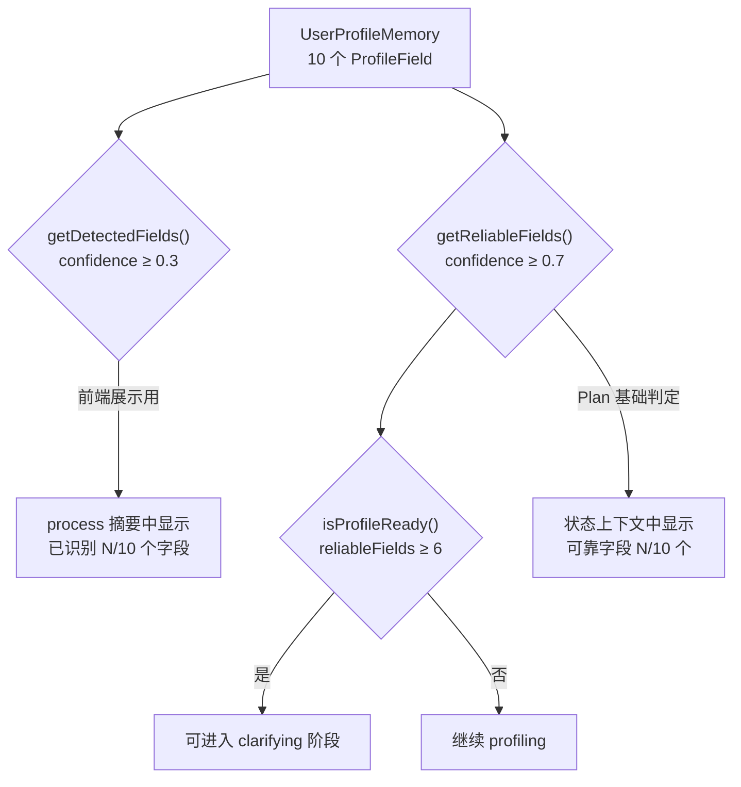
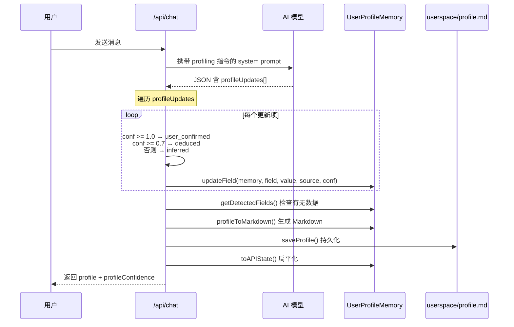

本文档深入解析「人人都能做科研」系统中**用户画像**的核心数据结构——10 个画像字段如何各自携带一个 0~1 的置信度值，以及这个置信度如何驱动阶段推进、前端展示与磁盘持久化。理解本模型是把握 [对话阶段状态机](7-dui-hua-jie-duan-zhuang-tai-ji-greeting-profiling-clarifying-planning-reviewing) 中 profiling → clarifying 转换的关键前提。

Sources: [memory.ts](src/lib/memory.ts#L1-L9), [triage-types.ts](src/lib/triage-types.ts#L122-L133)

## 十个画像字段：从「你是谁」到「你想要什么」

`UserProfileState` 类型定义了 10 个扁平字符串字段，覆盖用户身份、能力、约束与偏好四个维度。这些字段并非在 intake 表单中一次性收集，而是由 AI 在多轮对话中逐步提取和修正。每个字段的值均为自由文本——系统不对值域做硬性枚举约束，而是通过 Prompt 引导 AI 输出合理的自然语言值。

| 维度 | 字段名 | 中文标签 | 典型值示例 |
|------|--------|----------|------------|
| 身份 | `ageOrGeneration` | 年龄段 | "大三"、"90后" |
| 身份 | `educationLevel` | 教育水平 | "本科在读"、"硕士" |
| 能力 | `toolAbility` | 工具能力 | "会用 Python 基础语法" |
| 能力 | `aiFamiliarity` | AI 熟悉度 | "用过 ChatGPT 问答" |
| 能力 | `researchFamiliarity` | 科研理解度 | "完全没做过科研" |
| 方向 | `interestArea` | 兴趣方向 | "机器人运动学" |
| 约束 | `currentBlocker` | 当前卡点 | "不知道怎么做" |
| 约束 | `deviceAvailable` | 可用设备 | "只有一台笔记本" |
| 约束 | `timeAvailable` | 可用时间 | "一周内" |
| 偏好 | `explanationPreference` | 解释偏好 | "简单直白，不要术语" |

这 10 个字段在 [triage-types.ts](src/lib/triage-types.ts#L122-L133) 中定义为 `UserProfileState` 类型，在 [memory.ts](src/lib/memory.ts#L14-L25) 中通过 `KEYS` 常量以固定顺序声明，确保遍历和序列化时字段顺序一致。

Sources: [triage-types.ts](src/lib/triage-types.ts#L122-L133), [memory.ts](src/lib/memory.ts#L14-L25)

## ProfileField：每个字段携带置信度与来源

系统的核心设计决策是：**不做布尔式的「已填写/未填写」二分**，而是为每个字段赋予一个连续的置信度值。这一设计体现在 `ProfileField` 类型中：

```typescript
type ProfileField = {
  value: string;                                          // 字段值（自然语言）
  confidence: number;   // 0.0=guess, 0.5=AI-judged, 0.7=user-hinted, 1.0=confirmed
  source: "inferred" | "deduced" | "user_confirmed";     // 信息来源
  updatedAt: number;                                      // 最后更新时间戳
};
```

`UserProfileMemory` 就是 `Record<keyof UserProfileState, ProfileField>`——一个以 10 个字段名为 key、以 `ProfileField` 为 value 的字典。每个字段独立维护自己的置信度和来源。

Sources: [memory.ts](src/lib/memory.ts#L3-L12)

## 三级置信度模型：从猜测到确认

置信度并非简单的连续数值，而是在 Prompt 和后端逻辑中被锚定为**三个有明确语义的阈值档位**。AI 在 profiling 阶段通过 `profileUpdates` 数组返回每个字段的 confidence 值，后端根据该值自动映射为 `source` 标签：

| 置信度区间 | AI Prompt 语义 | source 映射 | 含义 |
|-----------|---------------|-------------|------|
| 0.3 | 猜测 | `inferred` | AI 从用户措辞中模糊推断，信息不确定 |
| 0.5 | AI 推断 | `inferred` | AI 有一定依据但用户未直接确认 |
| 0.7 | 用户暗示 | `deduced` | 用户在选择或表述中隐含透露了该信息 |
| 1.0 | 用户明确说了 | `user_confirmed` | 用户直接、明确地表述了该字段内容 |

这一映射逻辑在 API 路由处理中实现：

```typescript
const conf = typeof update.confidence === "number" ? update.confidence : 0.5;
const source = conf >= 1.0 ? "user_confirmed" as const :
               conf >= 0.7 ? "deduced" as const : "inferred" as const;
```

当 AI 未提供 confidence 值时，默认取 0.5（AI 推断）。这意味着任何来自 AI 的字段更新，至少被标记为 `inferred` 级别。

Sources: [chat-prompts.ts](src/lib/chat-prompts.ts#L106-L109), [route.ts](src/app/api/chat/route.ts#L298-L317)

## 置信度阈值与关键判定函数

三个核心函数基于不同置信度阈值对画像做出判定，直接驱动对话状态机的阶段转换：



具体函数行为如下：

- **`getDetectedFields()`**：返回 confidence ≥ 0.3 且 value 非空的字段列表。0.3 是「至少有一些信号」的最低门槛，低于此值的字段视为噪声而非有效信号。此函数用于前端 process 摘要中的「已识别 N/10 个字段」计数。
- **`getReliableFields()`**：返回 confidence ≥ 0.7 且 value 非空的字段列表。0.7 是「可靠到可以作为 Plan 基础」的阈值——只有达到此级别的字段才会被注入到后续阶段的系统 Prompt 上下文中。
- **`isProfileReady()`**：当 reliableFields ≥ 6 时返回 `true`，表示画像信息足够支撑问题收敛和 Plan 生成。这是 profiling → clarifying 阶段转换的核心判定条件。

Sources: [memory.ts](src/lib/memory.ts#L50-L63)

## 字段更新流程：从 AI 输出到内存到磁盘

整个字段更新流程可以用以下时序图表示：



关键实现细节：`updateField()` 函数是不可变更新——它返回一个全新的 `UserProfileMemory` 对象，而非原地修改。每次调用都会将 `updatedAt` 刷新为当前时间戳 `Date.now()`。这意味着同一字段可以在多轮对话中被反复更新，后一次更新会完全覆盖前一次的值和置信度。

Sources: [memory.ts](src/lib/memory.ts#L37-L48), [route.ts](src/app/api/chat/route.ts#L298-L327)

## 前端展示：置信度徽章与图例

前端 `SidePanel` 组件将每个字段的置信度渲染为三种视觉徽章，对应后端的三个语义档位：

| 置信度范围 | 图标 | 标签 | CSS 类 | 颜色 |
|-----------|------|------|--------|------|
| ≥ 1.0 | ● | 已确认 | `conf-confirmed` | 绿色 `#2d8a4e` |
| ≥ 0.7 | ◉ | 推断中 | `conf-deduced` | 暗金色 `#b8860b` |
| ≥ 0.3 | ○ | 猜测中 | `conf-inferred` | 灰色（`--muted`） |

`confidenceBadge()` 函数将数值映射为 `{ icon, label, cls }` 三元组。在画像列表下方，图例栏（`.profile-legend`）通过三个 `legend-item` span 展示图标含义。API 响应中的 `profileConfidence` 字段是一个 `Record<string, number>`，键为字段名、值为置信度数值，前端直接用字段名索引取值。

Sources: [side-panel.tsx](src/components/side-panel.tsx#L34-L39), [globals.css](src/app/globals.css#L523-L554)

## Markdown 持久化与磁盘恢复

当画像中有任何 detected 字段时，系统会调用 `profileToMarkdown()` 生成一份 Markdown 摘要并通过 `saveProfile()` 写入 `userspace/{sessionId}/profile.md`。这份文件不仅是落盘快照，更承担着**服务重启后的画像恢复**功能：

```markdown
# 用户画像

- ✅ **兴趣方向**: 机器人运动学
- 🔍 **工具能力**: 会用 Python 基础语法
- ❓ **科研理解度**: （未识别）
```

图标规则：confidence ≥ 1.0 用 ✅（已确认），≥ 0.5 用 🔍（推断中），其余用 ❓（猜测中）。注意此处的 Markdown 图标阈值（0.5）与前端徽章阈值（0.3 / 0.7 / 1.0）略有不同——Markdown 版本简化为两档。

服务重启时，API 路由的恢复逻辑会读取 `profile.md`，通过正则匹配解析每一行，将 ✅ 开头的字段恢复为 `user_confirmed`（confidence=1.0），🔍 开头的恢复为 `deduced`（confidence=0.7），从而在无状态环境中重建画像上下文。

Sources: [memory.ts](src/lib/memory.ts#L73-L93), [route.ts](src/app/api/chat/route.ts#L99-L132)

## System Prompt 中的画像上下文注入

在每轮对话中，`buildStateContext()` 函数会将当前画像状态注入系统 Prompt。它只使用**可靠字段**（confidence ≥ 0.7）来构建上下文，格式为 `字段名=字段值` 的管道分隔列表：

```
## 当前状态
- 对话阶段：profiling
- 画像就绪：否（可靠字段：3个，需>=6）
- 已确认画像：interestArea=机器人运动学 | currentBlocker=不知道怎么做 | educationLevel=大三
- 研究方向：机器人运动学
- 当前卡点：不知道怎么做
```

这种设计确保了 AI 只基于高置信度信息做决策——低置信度的猜测字段不会污染上下文。同时，`interestArea` 和 `currentBlocker` 被单独提取为显式行，因为它们对后续 Plan 生成的影响最大。

Sources: [chat-prompts.ts](src/lib/chat-prompts.ts#L5-L21)

## 设计总结与关键数字

整个画像置信度模型可以浓缩为以下关键数字：

| 概念 | 值 | 来源 |
|------|-----|------|
| 画像字段总数 | 10 | `KEYS` 数组长度 |
| 初始置信度 | 0 | `createEmptyProfile()` |
| 「有信号」阈值 | 0.3 | `getDetectedFields()` |
| 「可靠」阈值 | 0.7 | `getReliableFields()` |
| 就绪所需可靠字段数 | ≥ 6 | `isProfileReady()` |
| AI 默认置信度 | 0.5 | route.ts 中 fallback 值 |
| 字段更新语义 | 不可变覆盖 | `updateField()` 返回新对象 |

这一模型的设计哲学是**渐进收敛**——画像不是一次成型的表单，而是在多轮对话中通过 AI 推断和用户确认逐步累积可靠信息。每轮对话都可能提升某些字段的置信度，也可能通过追问填补空白字段。当足够多的字段达到可靠级别，系统便自动推进到问题收敛阶段。

Sources: [memory.ts](src/lib/memory.ts#L1-L93), [triage-types.ts](src/lib/triage-types.ts#L122-L133)

---

**下一步阅读**：画像就绪后系统如何判定阶段转换、以及服务重启后如何恢复画像状态，请参阅 [画像就绪判定与服务重启恢复](12-hua-xiang-jiu-xu-pan-ding-yu-fu-wu-zhong-qi-hui-fu)。要了解 AI 如何通过 Prompt 被引导输出这些字段，请参阅 [阶段式 Prompt 设计](14-jie-duan-shi-prompt-she-ji-mei-ge-jie-duan-de-json-shu-chu-xie-yi)。