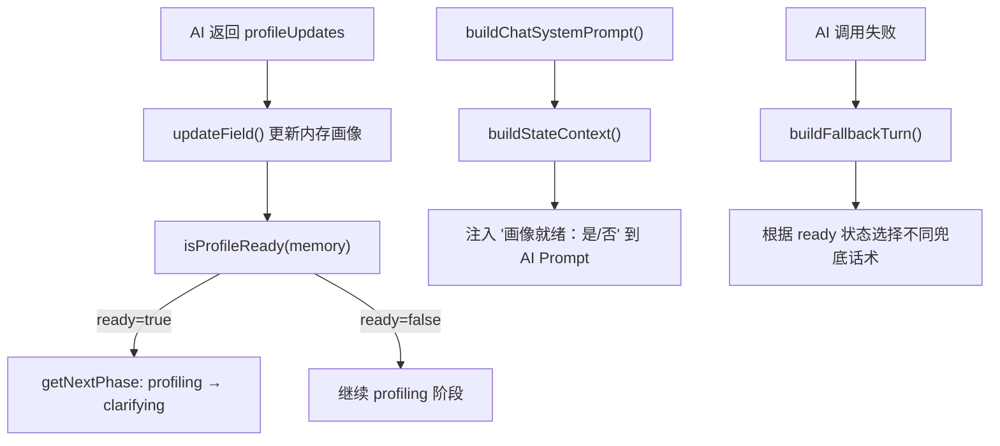
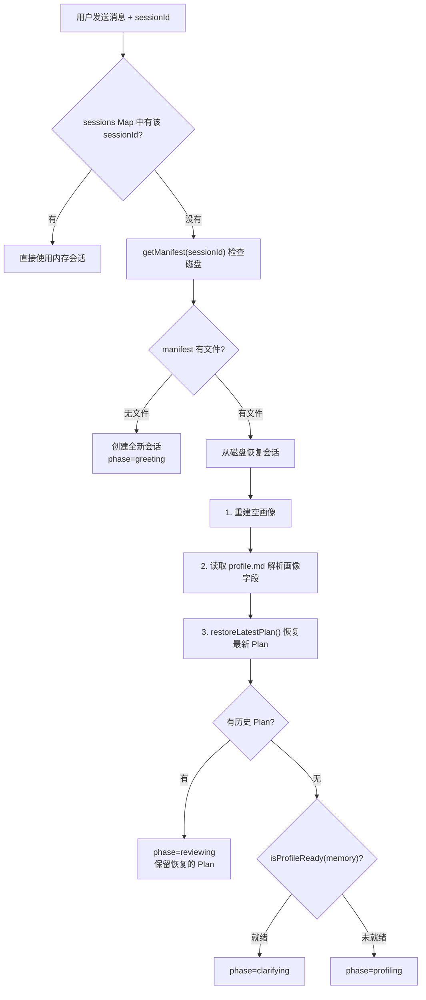

本文档聚焦于系统如何判定用户画像是否"就绪"（即足够可靠以支撑 Plan 生成），以及当服务进程重启后，如何从磁盘文件中恢复会话状态与画像数据。这两个能力共同保证了对话管线的**阶段推进可靠性**和**服务无状态恢复能力**。

## 核心问题：什么时候画像算"够了"？

系统定义了 10 个画像字段（见 [画像字段与置信度模型：10 字段 × 三级置信度](11-hua-xiang-zi-duan-yu-zhi-xin-du-mo-xing-10-zi-duan-x-san-ji-zhi-xin-du)），但并非所有字段都需要完美确认才能推进。`memory` 模块提供了**两级过滤函数**来衡量画像进度：

| 函数 | 置信度阈值 | 语义 | 用途 |
|---|---|---|---|
| `getDetectedFields()` | ≥ 0.3 | "至少有信号" | 向前端展示进度（已识别 N/10） |
| `getReliableFields()` | ≥ 0.7 | "足够可靠" | 判定是否可进入下一阶段 |
| `isProfileReady()` | ≥ 6 个可靠字段 | "画像就绪" | 触发 `profiling → clarifying` 阶段跃迁 |

`isProfileReady` 的判定逻辑极其简洁——只要 `getReliableFields` 返回的数组长度 ≥ 6，就认为画像就绪。这意味着系统容忍最多 4 个字段仍处于低置信度状态，只要核心信息（兴趣方向、卡点、工具能力、时间约束等）已经明确，就可以推进到问题收敛阶段。

Sources: [memory.ts](src/lib/memory.ts#L50-L63)

## 就绪判定的调用链路

画像就绪判定并非孤立存在，它嵌入在三个关键位置，形成一条完整的调用链路：

**第一处：阶段推进决策**（`getNextPhase`）。在 `chat-pipeline.ts` 的 `getNextPhase` 函数中，当 `currentPhase === "profiling"` 时，直接调用 `isProfileReady(memory)` 来决定是否跃迁到 `clarifying`。这是最核心的"门控"——画像未就绪时，系统永远不会进入问题收敛阶段。

Sources: [chat-pipeline.ts](src/lib/chat-pipeline.ts#L629-L647)

**第二处：AI Prompt 上下文注入**（`buildStateContext`）。在构建每一轮 AI 的系统 Prompt 时，`buildStateContext` 函数会将画像就绪状态和已确认字段列表注入到 Prompt 中。AI 可以据此判断应该继续追问画像信息还是开始收敛问题。Prompt 中的关键文本为 `画像就绪：是/否（可靠字段：N个，需>=6）`，让 AI 始终感知当前画像进度。

Sources: [chat-prompts.ts](src/lib/chat-prompts.ts#L5-L21)

**第三处：AI 失败兜底路由**（`buildFallbackTurn`）。当 AI 调用失败时，`buildFallbackTurn` 根据 `isProfileReady` 的结果选择不同的兜底策略。画像未就绪时，兜底选项聚焦于快速补齐关键画像字段；画像已就绪但无 Plan 时，兜底选项聚焦于确认目标范围。

Sources: [chat-pipeline.ts](src/lib/chat-pipeline.ts#L518-L568)

## 服务重启恢复：从磁盘重建会话

系统使用**内存会话存储**（`Map<string, Session>`）来维持会话状态。当服务进程重启后，内存中的 Map 被清空，所有会话丢失。但由于每轮对话都会将画像和 Plan 持久化到 `userspace` 文件系统，系统能够在用户下次发送消息时从磁盘恢复。

### 恢复流程

恢复逻辑位于 `POST /api/chat` 路由处理器中。当 `sessions.get(sessionId)` 返回 `undefined` 时，系统尝试从磁盘恢复。

Sources: [route.ts](src/app/api/chat/route.ts#L82-L155)

### 画像恢复：profile.md 反序列化

画像恢复的过程是一个**非对称序列化**的典型实现。序列化时，`profileToMarkdown` 将每个字段标记为 ✅（confidence ≥ 1）、🔍（confidence ≥ 0.5）或 ❓，并输出纯文本 Markdown。反序列化时，系统通过正则匹配 Markdown 行，将字段值和图标回填到 `UserProfileMemory` 结构中：

| 图标 | 反序列化行为 | source | confidence |
|---|---|---|---|
| ✅ / ● | 用户已确认 | `"user_confirmed"` | 1.0 |
| 🔍 / 其他 | AI 推断 | `"deduced"` | 0.7 |

这种设计使得反序列化后的画像字段**保持高置信度**（≥ 0.7），确保恢复后的会话不会被错误地推回到更早阶段。即使原始置信度可能更低（如 0.5 的 AI 推断），恢复时也会被提升到 0.7，因为系统认为"既然这些信息已经被持久化过，说明之前的对话已经验证过"。

Sources: [route.ts](src/app/api/chat/route.ts#L99-L131)

### Plan 恢复与阶段回填

Plan 恢复由 `restoreLatestPlan` 函数完成。它从 `manifest` 中筛选 `type === "plan"` 的条目，按版本号降序排列，取最新版本，然后用 `parsePlanFromMarkdown` 解析其内容。如果 Markdown 解析失败（格式不完整），系统会构造一个"最小恢复 Plan"，其中 `riskWarnings` 明确标注 `"服务重启后仅恢复计划文档摘要，完整对话历史不可用"`。

恢复完成后的**阶段判定**遵循一个优先级链：

1. **有历史 Plan** → `phase = "reviewing"`（用户可以继续调整已有的 Plan）
2. **无 Plan，但画像就绪** → `phase = "clarifying"`（需要重新收敛问题后生成 Plan）
3. **画像未就绪** → `phase = "profiling"`（需要继续收集画像信息）

这个优先级确保了恢复后的阶段不会"倒退"太远——如果之前已经生成了 Plan，直接进入 reviewing；如果画像已够但 Plan 尚未生成，进入 clarifying；只有画像本身就不完整时才回到 profiling。

Sources: [chat-pipeline.ts](src/lib/chat-pipeline.ts#L486-L506), [route.ts](src/app/api/chat/route.ts#L134-L142)

## 恢复的边界与局限

恢复机制有几个值得注意的设计权衡：

**对话历史不可恢复**。恢复时 `messages` 被设为空数组 `[]`。这意味着 AI 在恢复后的第一轮对话中没有上下文记忆，只能依赖 System Prompt 中的画像状态和 Plan 信息来理解用户。`restoreLatestPlan` 的 `riskWarnings` 中明确提示了这一点。

**画像恢复精度有损**。由于 Markdown 序列化只保留了三级图标（✅/🔍/❓），原始的 0.3、0.5、0.7 等细粒度置信度值在恢复时会统一提升为 0.7 或 1.0。这是一种**向上取整策略**，避免恢复后的画像被误判为"不够就绪"。

**manifest 作为恢复入口**。`getManifest` 是恢复流程的第一个调用点。它会校验 manifest 中列出的每个文件是否真实存在于磁盘上，过滤掉已丢失的条目。只有 `manifest.length > 0` 时才会进入恢复路径，否则视为全新会话。

Sources: [userspace.ts](src/lib/userspace.ts#L113-L128), [chat-pipeline.ts](src/lib/chat-pipeline.ts#L486-L506)

## 前端协同：sessionStorage 与磁盘恢复的配合

前端通过 `sessionStorage` 持久化 `messages`、`profile`、`profileConfidence` 和 `plan`（详见 [前端状态管理：sessionStorage 持久化与撤销机制](8-qian-duan-zhuang-tai-guan-li-sessionstorage-chi-jiu-hua-yu-che-xiao-ji-zhi)）。这意味着在**浏览器标签页不关闭**的情况下，前端状态始终可用。磁盘恢复主要服务于两种场景：

| 场景 | 前端状态 | 后端状态 | 恢复策略 |
|---|---|---|---|
| 浏览器刷新（同标签页） | sessionStorage 恢复 | 可能内存丢失 | 后端磁盘恢复 + 前端缓存覆盖 |
| 服务重启后新标签页 | sessionStorage 为空 | 内存清空 | 后端磁盘恢复 + 前端从 API 响应重建 |

前端在每次 API 响应后同步更新 `profile`、`profileConfidence` 和 `plan`，并通过 `fileRefresh` 计数器触发右侧面板的文件列表刷新。这种"API 响应驱动"的模式确保了前端状态始终与后端保持一致。

Sources: [page.tsx](src/app/page.tsx#L42-L67), [page.tsx](src/app/page.tsx#L112-L127)

## 延伸阅读

- **画像字段的完整定义与置信度来源**：[画像字段与置信度模型：10 字段 × 三级置信度](11-hua-xiang-zi-duan-yu-zhi-xin-du-mo-xing-10-zi-duan-x-san-ji-zhi-xin-du)
- **阶段跃迁的完整状态机**：[对话阶段状态机：greeting → profiling → clarifying → planning → reviewing](7-dui-hua-jie-duan-zhuang-tai-ji-greeting-profiling-clarifying-planning-reviewing)
- **userspace 文件系统的路径安全与文件管理**：[userspace 文件系统：会话隔离、路径安全校验与文件清单管理](20-userspace-wen-jian-xi-tong-hui-hua-ge-chi-lu-jing-an-quan-xiao-yan-yu-wen-jian-qing-dan-guan-li)
- **AI 失败时的兜底机制**：[AI 容错设计：JSON 重试、规则兜底与协议泄漏防护](25-ai-rong-cuo-she-ji-json-zhong-shi-gui-ze-dou-di-yu-xie-yi-xie-lou-fang-hu)