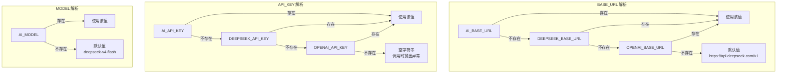
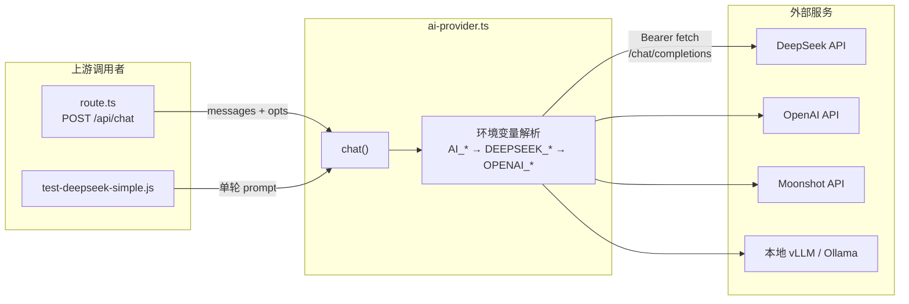

本文深入解析 `ai-provider.ts` 模块的设计意图、环境变量优先级链、以及它在整个对话管线中的调用模式。该模块是系统与 AI 大模型交互的唯一出入口，采用**零 SDK 依赖**的 bare fetch 实现，通过环境变量驱动即可在 DeepSeek、OpenAI、Moonshot、Zhipu GLM、OpenRouter、本地 vLLM/ollama 等任意兼容 OpenAI `/chat/completions` 规范的 Provider 之间切换——无需修改任何业务代码。

Sources: [ai-provider.ts](src/lib/ai-provider.ts#L1-L17)

## 设计哲学：为什么用裸 fetch 而非 SDK

项目刻意选择不引入 `openai` 等官方 SDK，而是用原生 `fetch` 直接构造 HTTP 请求。这一决策的核心考量有三点：**零额外依赖**——`package.json` 中没有任何 AI 相关的 npm 包，保持了极小的依赖树；**协议透明**——请求体、响应体的每一个字段都清晰可见，便于调试和适配非标准 Provider 的边缘行为；**学习成本最低**——任何熟悉 HTTP 的开发者都能在 30 秒内理解完整的调用链路。整个模块仅 117 行，导出了一个核心函数 `chat()` 和一个常量 `DEFAULT_MODEL`，做到了真正的"一文件一职责"。

Sources: [ai-provider.ts](src/lib/ai-provider.ts#L1-L117), [package.json](package.json#L12-L18)

## 环境变量优先级链：三层回退机制

系统定义了三组环境变量，按优先级从高到低排列为：**通用前缀 `AI_*`** → **历史兼容 `DEEPSEEK_*`** → **行业惯例 `OPENAI_*`**。下面通过一张流程图展示配置解析的完整决策路径：



完整的环境变量映射关系如下表所示：

| 配置维度 | 最高优先级 | 历史兼容 | 行业惯例 | 默认值 |
|----------|-----------|---------|---------|--------|
| API 基地址 | `AI_BASE_URL` | `DEEPSEEK_BASE_URL` | `OPENAI_BASE_URL` | `https://api.deepseek.com/v1` |
| 认证密钥 | `AI_API_KEY` | `DEEPSEEK_API_KEY` | `OPENAI_API_KEY` | *(空，调用时抛异常)* |
| 模型标识 | `AI_MODEL` | — | — | `deepseek-v4-flash` |

**注意**：`MODEL` 维度只有 `AI_MODEL` 一个入口，没有历史回退。这是因为模型标识与 Provider 强绑定，回退到默认值（DeepSeek 的模型名）是最安全的兜底策略。BASE_URL 和 API_KEY 存在跨 Provider 的通用性，因此设计了三层回退。

Sources: [ai-provider.ts](src/lib/ai-provider.ts#L19-L31)

## chat() 函数接口设计

`chat()` 函数的参数设计遵循"单轮便捷 + 多轮完整"双模式理念：

```typescript
interface ChatOptions {
  model?: string;          // 覆盖 DEFAULT_MODEL
  temperature?: number;    // 默认 0.3
  maxTokens?: number;      // 可选，对应 max_tokens
  traceLabel?: string;     // 日志追踪标签
  prompt?: string;         // 单轮模式：用户消息
  system?: string;         // 单轮模式：系统指令
  messages?: ChatMsg[];    // 多轮模式：完整消息数组（优先于 prompt/system）
}
```

当 `messages` 字段存在时，`prompt` 和 `system` 将被忽略；否则函数会自动将 `system`（如有）和 `prompt` 组装为标准消息数组。这种设计让管线中的不同调用场景可以用最简洁的方式传参，同时保持底层协议的一致性。

Sources: [ai-provider.ts](src/lib/ai-provider.ts#L36-L64)

## 请求构造与错误处理

函数内部将参数组装为标准 OpenAI `/chat/completions` 请求体，通过 `Bearer ${API_KEY}` 进行认证。错误处理分为两层：**HTTP 层错误**（`!resp.ok`）会捕获状态码和响应文本前 300 字符并抛出有意义的错误信息；**内容层错误**（`choices[0].message.content` 为空）则返回原始 JSON 前 300 字符供调试。每次调用还会打印结构化日志，包含模型名、消息数、延迟毫秒数等关键指标。

Sources: [ai-provider.ts](src/lib/ai-provider.ts#L66-L116)

## 在管线中的调用模式

`chat()` 在 [POST /api/chat](src/app/api/chat/route.ts) 路由中被调用三次，分别对应管线的三个关键时刻：

| 调用场景 | temperature | maxTokens | 目的 |
|----------|------------|-----------|------|
| **主调用** (primary) | 0.4 | 4096 | 执行当前阶段的对话推理 |
| **JSON 重试** (json_retry) | 0.3 | 4096 | 首次返回非 JSON 时，追加提示要求严格 JSON 输出 |
| **自动推进 planning** (clarifying→planning) | 0.4 | 4096 | clarifying 阶段 checklist 通过后，自动触发生成 Plan |

三次调用的 `traceLabel` 均包含 `sid`（会话 ID 前 8 位）、当前 `phase` 和 `step` 标识，使得日志可以通过结构化标签精确定位到具体的调用环节。主调用和自动推进使用稍高的 `temperature=0.4` 以保持对话的自然度，而 JSON 重试降低到 `0.3` 以提高格式遵从性。

Sources: [route.ts](src/app/api/chat/route.ts#L186-L191), [route.ts](src/app/api/chat/route.ts#L253-L258), [route.ts](src/app/api/chat/route.ts#L347-L352)

## 切换 Provider 的实操指南

切换 Provider 只需修改 `.env` 文件（该文件已被 `.gitignore` 排除，不会被提交到版本库）。以下是几种常见 Provider 的配置示例：

```bash
# ── 方式一：使用通用前缀 AI_*（推荐）──

# DeepSeek（默认）
AI_BASE_URL=https://api.deepseek.com/v1
AI_API_KEY=sk-your-deepseek-key
AI_MODEL=deepseek-v4-flash

# OpenAI
AI_BASE_URL=https://api.openai.com/v1
AI_API_KEY=sk-your-openai-key
AI_MODEL=gpt-4o-mini

# Moonshot（月之暗面）
AI_BASE_URL=https://api.moonshot.cn/v1
AI_API_KEY=sk-your-moonshot-key
AI_MODEL=moonshot-v1-8k

# 本地 vLLM / Ollama
AI_BASE_URL=http://localhost:8000/v1
AI_API_KEY=dummy
AI_MODEL=your-local-model-name
```

**关键约束**：目标 Provider 必须兼容 OpenAI 的 `/chat/completions` 端点格式——即接受 `model`、`temperature`、`messages`、`max_tokens` 等标准参数，并以 `choices[0].message.content` 结构返回结果。目前主流的国产大模型 API（DeepSeek、Moonshot、Zhipu GLM 等）均已支持这一协议。

Sources: [.gitignore](.gitignore#L30-L34), [ai-provider.ts](src/lib/ai-provider.ts#L4-L7)

## 连通性测试脚本

项目提供了 `scripts/test-deepseek-simple.js` 作为独立的连通性验证工具。该脚本复用了与 `ai-provider.ts` 完全相同的环境变量优先级逻辑，发送一条最简单的请求 `"回复一个词：成功"` 来验证端到端链路是否畅通。运行方式：

```bash
# 设置环境变量后直接执行
AI_API_KEY=sk-xxx node scripts/test-deepseek-simple.js
```

脚本的输出包含三行诊断信息：API 基地址、模型名称和密钥状态（已设置/缺失），加上最终的请求结果。若密钥缺失则直接抛出明确的错误提示。这比启动完整应用再排查问题要高效得多——建议在首次配置或切换 Provider 后先运行此脚本确认链路可用。

Sources: [test-deepseek-simple.js](scripts/test-deepseek-simple.js#L1-L48)

## 架构定位与上下游关系



`ai-provider.ts` 是系统的 **AI 调用层唯一入口**。它的上游是 [POST /api/chat：请求/响应协议与阶段推进逻辑](22-post-api-chat-qing-qiu-xiang-ying-xie-i-yu-jie-duan-tui-jin-luo-ji) 中的管线逻辑，管线通过 `chat()` 发送经过 [阶段式 Prompt 设计：每个阶段的 JSON 输出协议](14-jie-duan-shi-prompt-she-ji-mei-ge-jie-duan-de-json-shu-chu-xie-yi) 构造的多轮消息。它的下游则是任意 OpenAI 兼容的模型服务，通过环境变量的纯声明式切换实现 Provider 解耦。如果需要深入了解调用后返回内容的解析逻辑，请参阅 [AI 输出解析：JSON 提取、协议识别与 Markdown 兜底](9-ai-shu-chu-jie-xi-json-ti-qu-xie-yi-shi-bie-yu-markdown-dou-di) 和 [AI 容错设计：JSON 重试、规则兜底与协议泄漏防护](25-ai-rong-cuo-she-ji-json-zhong-shi-gui-ze-dou-di-yu-xie-yi-xie-lou-fang-hu)。