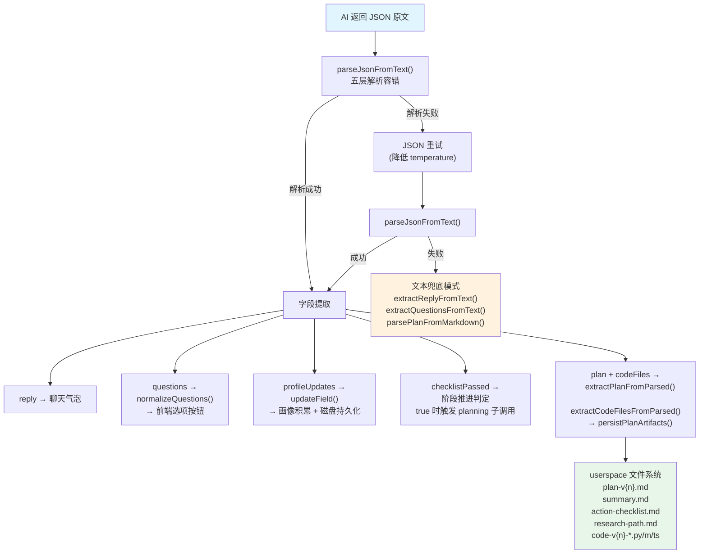

本页深入解析「人人都能做科研」系统中 **五个对话阶段各自的 Prompt 设计策略**以及**每个阶段要求 AI 返回的严格 JSON 输出协议**。系统采用「阶段指令 + 状态上下文 + 技能注入」三层 Prompt 构建方式，确保 AI 在每个阶段输出可被后端代码精确解析的结构化数据，从而驱动前端面板的选项渲染、画像积累和 Plan 产物生成。阅读本页前，建议先了解 [对话阶段状态机](7-dui-hua-jie-duan-zhuang-tai-ji-greeting-profiling-clarifying-planning-reviewing) 的整体流转逻辑；本页聚焦于每个阶段的 **JSON 协议定义、字段语义和 Prompt 约束规则**。

Sources: [chat-prompts.ts](src/lib/chat-prompts.ts#L1-L202), [triage-types.ts](src/lib/triage-types.ts#L168-L169)

## Prompt 三层构建架构

每个用户消息到达后端时，系统通过 `buildChatSystemPrompt()` 将三层内容拼接为完整的 System Prompt 发送给 AI。这三层分别是：**Skills 技能注入层**（来自 `skills/` 目录的 Markdown 文件）、**当前状态上下文层**（阶段、画像就绪情况、已有 Plan 信息）、**阶段指令层**（当前 Phase 对应的 JSON 输出要求和规则）。

```
┌──────────────────────────────────────────────────┐
│            完整 System Prompt                      │
├──────────────────────────────────────────────────┤
│  Layer 1: Skills 技能注入                          │
│  ┌──────────────────────────────────────────────┐│
│  │ 00-core-methodology / 01-question-decomp...  ││
│  │  (来自 skills/*.md, 缓存后整体注入)            ││
│  └──────────────────────────────────────────────┘│
│                         ↓                        │
│  Layer 2: 当前状态上下文                           │
│  ┌──────────────────────────────────────────────┐│
│  │ 对话阶段 / 画像就绪 / 可靠字段 / 研究方向       ││
│  │ 当前卡点 / 当前 Plan 版本与步骤                ││
│  └──────────────────────────────────────────────┘│
│                         ↓                        │
│  Layer 3: 阶段 JSON 指令                          │
│  ┌──────────────────────────────────────────────┐│
│  │ greeting / profiling / clarifying /           ││
│  │ planning / reviewing → 各自的 JSON Schema     ││
│  └──────────────────────────────────────────────┘│
│                         ↓                        │
│  尾部强制格式约束:                                 │
│  "必须且只能输出一行合法JSON，{开头}结尾"            │
└──────────────────────────────────────────────────┘
```

**Skills 层**通过 `buildSystemPrompt("")` 加载 `skills/` 目录下所有 `.md` 文件，按文件名前缀排序后以 `---` 分隔拼接，为 AI 注入科研方法论约束（如强制五步流程、假设验证、证据分级等）。**状态上下文层**由 `buildStateContext()` 函数动态生成，将当前画像的可靠字段数、研究方向、卡点信息以及已有 Plan 的版本号、步骤和风险以结构化列表形式注入，让 AI 了解「对话进行到哪了」。**阶段指令层**则通过 `getInstructionForPhase()` 路由到对应的 `GREETING_INSTRUCTION`、`PROFILING_INSTRUCTION` 等常量，每个常量定义了该阶段 AI 必须返回的 JSON Schema 和字段级规则。

Sources: [chat-prompts.ts](src/lib/chat-prompts.ts#L23-L40), [skills.ts](src/lib/skills.ts#L39-L44), [chat-prompts.ts](src/lib/chat-prompts.ts#L5-L21)

## 五阶段 JSON 协议一览

下表汇总了五个阶段各自的 JSON 输出结构、核心职责和阶段转换触发条件：

| 阶段 | 指令常量 | JSON 核心字段 | 阶段职责 | 转换条件 |
|------|---------|--------------|---------|---------|
| **greeting** | `GREETING_INSTRUCTION` | `reply` + `questions` | 开场白 + 兴趣方向选择 | 用户首次发言 → 自动转 profiling |
| **profiling** | `PROFILING_INSTRUCTION` | `reply` + `questions` + `profileUpdates` | 画像提取 + 持续引导对话 | 可靠字段 ≥ 6 → clarifying |
| **clarifying** | `CLARIFYING_INSTRUCTION` | `reply` + `questions` + `checklistPassed` | 前置检查清单 + 问题收敛 | `checklistPassed=true` → planning |
| **planning** | `PLANNING_INSTRUCTION` | `reply` + `plan` + `codeFiles` | 生成完整 Plan + 代码产物 | Plan 生成成功 → reviewing |
| **reviewing** | `REVIEWING_INSTRUCTION` | `reply` + `plan` + `codeFiles` | 根据用户反馈调整 Plan | 始终保持 reviewing |

每个阶段的 JSON 协议都经过精心设计，确保 **reply（文本回复）与 questions（选项按钮）严格分离**——reply 永远是陈述句，所有追问都放在 questions 数组中渲染为可点击按钮，避免用户困惑于「我该怎么回答」。

Sources: [chat-prompts.ts](src/lib/chat-prompts.ts#L42-L201), [triage-types.ts](src/lib/triage-types.ts#L168-L169)

## greeting 阶段：开场引导的 JSON 协议

`greeting` 是用户进入系统后的第一个阶段。Prompt 定义了严格的开场白规则和选项生成要求：

```json
{
  "reply": "你的开场白（1-2句，不许包含问号或疑问句）",
  "questions": [
    "完整选项文本A",
    "完整选项文本B",
    "完整选项文本C",
    "我不太理解这些，帮我找方向"
  ]
}
```

这个协议的设计有几个关键约束。**reply 规则**要求开场白必须是 1-2 句陈述句，**禁止出现问号、禁止出现「请告诉我」「你能说说是吗」等追问语句**。这一约束的目的是让用户感受到明确的引导方向，而非被一堆问题淹没。**questions 规则**要求每个选项是完整的、确定的句子（用户点击即选中），禁止使用占位符文本（如「选项A」「其他」「请选择」），且**最后一项必须是「我不太理解这些，帮我找方向」**作为用户不知道怎么选时的「逃生通道」。

正确的 questions 示例：`["我对AI和机器学习感兴趣", "我想研究社会现象或人类行为", "我对自然科学（物理/化学/生物）感兴趣", "我不太理解这些，帮我找方向"]`。错误的示例：`["选项A", "选项B", "其他"]`——这类占位符会直接导致前端按钮不可读。

Sources: [chat-prompts.ts](src/lib/chat-prompts.ts#L42-L64)

## profiling 阶段：画像提取的 JSON 协议

`profiling` 阶段是系统与用户多轮交互的核心阶段，AI 在此阶段同时完成两个任务：**从用户话语中提取画像字段**和**继续引导对话**。JSON 协议如下：

```json
{
  "reply": "你的回复文本",
  "questions": ["完整选项A", "完整选项B", "完整选项C", "我不太理解这些，帮我找方向"],
  "profileUpdates": [
    {"field": "字段名", "value": "值", "confidence": 0.7}
  ]
}
```

与前一个阶段相比，profiling 协议新增了 **`profileUpdates`** 字段。这是一个数组，AI 每轮从用户发言中提取有把握的画像字段，通过 `field`/`value`/`confidence` 三元组回传。**可提取的 10 个字段**定义在 Prompt 中，与 [画像字段与置信度模型](11-hua-xiang-zi-duan-yu-zhi-xin-du-mo-xing-10-zi-duan-x-san-ji-zhi-xin-du) 中 `UserProfileState` 类型完全对应：

| 字段名 | 语义 | 示例值 |
|--------|------|--------|
| `ageOrGeneration` | 年龄段/时代背景 | "大三学生" |
| `educationLevel` | 教育水平 | "本科在读" |
| `toolAbility` | 工具使用能力 | "会 Python 基础" |
| `aiFamiliarity` | AI 熟悉程度 | "用过 ChatGPT" |
| `researchFamiliarity` | 科研理解程度 | "完全没接触过" |
| `interestArea` | 兴趣方向 | "机器人控制" |
| `currentBlocker` | 当前卡点 | "不知道怎么做" |
| `deviceAvailable` | 可投入设备 | "只有笔记本" |
| `timeAvailable` | 可投入时间 | "一个月" |
| `explanationPreference` | 偏好解释风格 | "用类比帮我理解" |

**confidence** 的四级语义为：`0.3` = AI 猜测、`0.5` = AI 推断、`0.7` = 用户暗示、`1.0` = 用户明确说了。后端在处理 profileUpdates 时，将 confidence 映射为 `source` 字段：`≥ 1.0` → `user_confirmed`、`≥ 0.7` → `deduced`、`< 0.7` → `inferred`。当可靠字段（confidence ≥ 0.7）数量达到 6 个时，`isProfileReady()` 返回 `true`，阶段自动推进到 clarifying。

Sources: [chat-prompts.ts](src/lib/chat-prompts.ts#L66-L112), [memory.ts](src/lib/memory.ts#L50-L63), [route.ts](src/app/api/chat/route.ts#L298-L317)

## clarifying 阶段：前置检查清单的 JSON 协议

`clarifying` 阶段的定位是「问题收敛」——在生成 Plan 之前，AI 必须逐项检查一份 **9 项前置清单**，确认用户身份、目标、工具能力、时间约束、交付物预期全部明确，且不存在隐含假设或过大问题。JSON 协议如下：

```json
{
  "reply": "列出待确认的假设，或说明所有项已通过",
  "questions": ["追问选项A", "追问选项B", "我不太理解这些，帮我找方向"],
  "checklistPassed": false
}
```

关键新增字段是 **`checklistPassed`**（布尔值）。当 `checklistPassed` 为 `false` 时，AI 在 reply 中列出尚未通过的检查项或隐含假设，通过 questions 追问缺失信息。当所有检查项通过后，AI 将 `checklistPassed` 设为 `true`，此时 questions 可为空数组。

后端在路由层检测到 `checklistPassed === true` 后，会**自动发起一次额外的 AI 调用**——以 `PLANNING_INSTRUCTION` 替换当前的 `CLARIFYING_INSTRUCTION`，重新构建 System Prompt，让 AI 在同一次请求中完成「澄清 → 生成 Plan」的无缝衔接。这是一个精心设计的**阶段内自动推进**机制：用户在 clarifying 阶段的最后一次交互中，实际上触发了两次 AI 调用（第一次做检查，第二次做 Plan），但从前端视角只看到一个完整的响应。

9 项前置检查清单包括：①用户身份已确认 ②目标已收敛为明确问题 ③工具能力已确认 ④时间约束已明确 ⑤交付物已明确 ⑥隐含假设已列出 ⑦问题规模是否过大 ⑧想法是否可执行 ⑨是否跨越过多阶段。

Sources: [chat-prompts.ts](src/lib/chat-prompts.ts#L114-L143), [route.ts](src/app/api/chat/route.ts#L329-L378)

## planning 与 reviewing 阶段：Plan 产物的 JSON 协议

`planning` 和 `reviewing` 两个阶段共享同一套 JSON Schema（`PLAN_JSON_SCHEMA`），但行为语义不同——planning 是首次生成 Plan，reviewing 是根据用户反馈调整已有 Plan。协议结构如下：

```json
{
  "reply": "一句简短回复，提示用户查看右侧 Plan 面板",
  "plan": {
    "userProfile": "用户画像摘要",
    "problemJudgment": "当前问题判断",
    "systemLogic": "系统判断逻辑，必须说明关键假设和证据边界",
    "recommendedPath": "推荐路径",
    "actionSteps": ["步骤1：具体动作、时限、验证方式", "步骤2：..."],
    "riskWarnings": ["风险1", "风险2"],
    "nextOptions": ["更简单", "更专业", "拆开讲", "换方向"]
  },
  "codeFiles": [
    {
      "filename": "示例文件名",
      "title": "代码文件标题",
      "language": "matlab/python/typescript 等",
      "content": "文件完整内容"
    }
  ]
}
```

**plan 对象**的 7 个字段直接映射到前端 [PlanPanel](src/components/plan-panel.tsx) 的渲染区域。`actionSteps` 必须包含 3-7 个可执行步骤，每步包含**动作、时限、验证方法**三个维度。`riskWarnings` 必须直接对应用户当前约束（如「只有笔记本」对应「无法训练大模型」）。`nextOptions` 提供标准化的 Plan 调整选项，前端渲染为按钮组。

**codeFiles 数组**是代码产物通道。当任务明确需要代码、脚本或 Demo 骨架时，AI 必须输出 codeFiles，每个文件的 `content` 必须是**完整可运行的最小版本**。如果任务不需要代码，返回空数组 `[]`。后端对 codeFiles 做了严格的文件名清洗（去除特殊字符、空格转连字符、强制加扩展名）和版本号前缀（`code-v{version}-{name}`），确保写入 userspace 文件系统的安全性。

**reviewing 阶段的特殊规则**：AI 必须先判断用户反馈属于「更简单」「更专业」「拆开讲」还是「换方向」四类调整意图中的哪一种，然后只调整必要部分但返回完整 Plan。`systemLogic` 字段必须说明**本次修改相对上一版改变了什么**，形成可追溯的版本演进链。

Sources: [chat-prompts.ts](src/lib/chat-prompts.ts#L145-L193), [chat-pipeline.ts](src/lib/chat-pipeline.ts#L266-L397)

## 格式强制与解析容错

每个阶段指令的末尾都附有相同的格式强制约束：

> 你必须且只能输出一行合法JSON。不是markdown、不是表格、不是文字说明。回复的第一个字符必须是`{`，最后一个字符必须是`}`。任何其他格式都会导致系统无法工作。

这并非简单的 Prompt 约束——系统在代码层面构建了**多层解析容错机制**来应对 AI 不遵循格式的情况。`parseJsonFromText()` 函数按优先级依次尝试五种解析策略：

```
解析策略优先级
─────────────────────────────────────────────────
1. 直接 JSON.parse(text)           ← 理想路径
2. 提取 ```json ... ``` 代码块     ← AI 输出 markdown 包裹
3. 扫描所有平衡的 { } 候选体       ← 前缀文本污染
   + isProtocolJson() 协议特征验证
4. 定位首 { 到末 } 切片解析        ← 粗暴兜底
5. 补齐缺失闭合括号后解析          ← 截断场景
─────────────────────────────────────────────────
```

策略 3 中的 `isProtocolJson()` 是关键的**协议特征检测器**——它检查解析结果是否包含 `reply`、`questions`、`profileUpdates`、`checklistPassed`、`plan`、`codeFiles` 这六个协议字段中的至少一个。这确保了即使 AI 在 JSON 前输出了大段文字（如泄露了内部 process 摘要），系统仍能从文本中准确提取出协议 JSON，而非误解析其他无关的 JSON 结构。

当所有五层策略都失败时，系统**自动发起一次 JSON 重试**：将 AI 上一次的非 JSON 回复作为上下文，附加一条「上一轮回复不是JSON。请严格按照JSON格式重新输出」的用户消息，降低 temperature 后重新调用 AI。如果重试仍然失败，则回退到文本模式——从 Markdown 中提取 reply 和 questions，或对 planning/reviewing 阶段尝试用正则从 Markdown 结构中提取 Plan（`parsePlanFromMarkdown`）。

Sources: [chat-prompts.ts](src/lib/chat-prompts.ts#L38-L39), [chat-pipeline.ts](src/lib/chat-pipeline.ts#L6-L48), [route.ts](src/app/api/chat/route.ts#L238-L260), [chat-pipeline.ts](src/lib/chat-pipeline.ts#L179-L237)

## JSON 协议字段到后端处理的数据流

下图展示了 AI 返回的 JSON 协议字段在后端处理管线中的完整流转路径：



每个协议字段在提取后都有独立的后处理管线。`questions` 经过 `normalizeQuestions()` 处理——该函数负责**拆分内联子选项**（如将一个包含 A/B/C 的长选项拆分为三个独立可点击项）、**去重**、**过滤纯问题干**（当具体选项已存在时移除仅包含问句干的项目）。`profileUpdates` 经过 `updateField()` 写入 `UserProfileMemory`，同时根据 confidence 映射为 `source` 标签。`plan` 和 `codeFiles` 经过字段名兼容处理（支持 `user_profile`/`userProfile`、`steps`/`actionSteps` 等多种命名），最终通过 `persistPlanArtifacts()` 写入 4+ 份文档到 userspace 文件系统。

Sources: [chat-pipeline.ts](src/lib/chat-pipeline.ts#L88-L168), [chat-pipeline.ts](src/lib/chat-pipeline.ts#L266-L397), [chat-pipeline.ts](src/lib/chat-pipeline.ts#L472-L484), [route.ts](src/app/api/chat/route.ts#L270-L424)

## 延伸阅读

- [AI 输出解析：JSON 提取、协议识别与 Markdown 兜底](9-ai-shu-chu-jie-xi-json-ti-qu-xie-yi-shi-bie-yu-markdown-dou-di) — 详细拆解 `parseJsonFromText()` 的五层解析策略和 `isProtocolJson()` 协议特征检测机制
- [对话阶段状态机](7-dui-hua-jie-duan-zhuang-tai-ji-greeting-profiling-clarifying-planning-reviewing) — 理解 `getNextPhase()` 如何根据画像就绪、检查清单和 Plan 状态驱动阶段推进
- [Skills 加载机制](15-skills-jia-zai-ji-zhi-markdown-ji-neng-wen-jian-zhu-ru-xi-tong-prompt) — 了解 Layer 1 的 Markdown 技能文件如何被加载、缓存并注入到 System Prompt
- [画像字段与置信度模型](11-hua-xiang-zi-duan-yu-zhi-xin-du-mo-xing-10-zi-duan-x-san-ji-zhi-xin-du) — 深入 profiling 阶段 `profileUpdates` 对应的 10 字段 × 三级置信度模型
- [Plan 产物生成](10-plan-chan-wu-sheng-cheng-wen-dang-xing-dong-qing-dan-ke-yan-lu-jing-yu-dai-ma-wen-jian) — planning/reviewing 阶段的 `plan` + `codeFiles` 如何被持久化为 userspace 文档
- [AI 容错设计](25-ai-rong-cuo-she-ji-json-zhong-shi-gui-ze-dou-di-yu-xie-yi-xie-lou-fang-hu) — JSON 重试、规则兜底和协议泄漏防护的完整容错链路