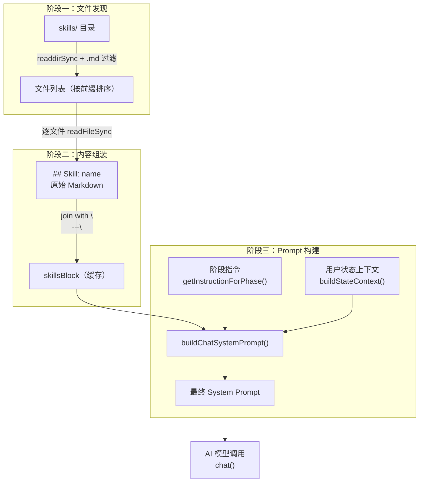

本页深入解析 `skills/` 目录下的 Markdown 技能文件如何被加载、组装并注入到每次 AI 对话的系统提示（System Prompt）中。这套机制将**方法论知识**与**对话阶段指令**解耦——技能文件定义"AI 应该怎么思考"，阶段指令定义"AI 当前该做什么"——从而在不修改代码的前提下，通过增删 Markdown 文件即可调整 AI 的行为准则。

Sources: [skills.ts](src/lib/skills.ts#L1-L51), [chat-prompts.ts](src/lib/chat-prompts.ts#L1-L40)

## 整体架构：从文件到 Prompt 的三阶段管线

Skills 注入并非简单的文件拼接，而是一个**文件发现 → 内容组装 → Prompt 构建**的三阶段管线。每个阶段各有明确的职责边界：



**阶段一**负责在 `skills/` 目录下发现所有 `.md` 文件，按文件名前缀数字排序。**阶段二**读取每个文件的完整内容，统一格式化为 `## Skill: <名称>` 后用分隔线拼接，结果被**单例缓存**——首次调用后的后续请求零 I/O 开销。**阶段三**在 `buildChatSystemPrompt()` 中将技能块作为 Prompt 前缀，后接当前对话状态与阶段指令，形成完整的系统提示。

Sources: [skills.ts](src/lib/skills.ts#L1-L51), [chat-prompts.ts](src/lib/chat-prompts.ts#L23-L40)

## 文件发现与命名约定

`loadSkills()` 通过 `readdirSync` 扫描 `process.cwd()/skills` 目录，筛选条件极为简洁：**后缀为 `.md`**。文件名采用 `NN-<技能名>.md` 的命名规范，其中 `NN` 是两位数字前缀，决定加载顺序：

| 文件名 | 排序权重 | 实际技能标题 |
|--------|----------|-------------|
| `00-core-methodology.md` | 最高 | 核心科学方法论 |
| `01-question-decomposition.md` | 2 | 问题拆解法 |
| `02-knowledge-gap-analysis.md` | 3 | 知识缺口分析 |
| `03-hypothesis-testing.md` | 4 | 假设提出与验证 |
| `04-evidence-evaluation.md` | 5 | 证据评估与分级 |
| `05-iterative-refinement.md` | 6 | 迭代修正法 |
| `06-ambiguity-surfacing.md` | 7 | 模糊点暴露与确认 |
| `07-peer-review-simulation.md` | 8 | 自审查机制 |
| `08-communication-protocol.md` | 9 | 成果沟通规范 |
| `09-safety-boundary.md` | 最低 | 安全边界与伦理 |

排序由 `.sort()` 对字符串自然排序实现——`00-` 开头的文件排在最前，确保**核心方法论**始终是 AI 读取的第一条行为准则。文件名中的数字前缀在组装时被正则剥离：`f.replace(/^\d+-/, "").replace(/\.md$/, "")` 提取出纯技能名称用于标题。

Sources: [skills.ts](src/lib/skills.ts#L4-L31)

## 内容组装：从散文件到统一文本块

每个 `.md` 文件被读取后，经过一道格式化处理：在原始内容前添加 `## Skill: <技能名>` 二级标题，然后所有技能块之间用 `\n\n---\n\n` 分隔线连接。以三个技能文件为例，组装结果的结构如下：

```markdown
## Skill: core-methodology

（00-core-methodology.md 的原始内容）

---

## Skill: question-decomposition

（01-question-decomposition.md 的原始内容）

---

## Skill: knowledge-gap-analysis

（02-knowledge-gap-analysis.md 的原始内容）

---

...（后续技能文件以此类推）
```

`---` 分隔线在 Markdown 语义中代表水平分割线，对 AI 模型而言是清晰的内容边界信号。整个拼接产物被赋值给模块级变量 `cachedSkills`，后续调用直接返回缓存值。

Sources: [skills.ts](src/lib/skills.ts#L28-L36)

## 单例缓存与优雅降级

缓存机制采用**惰性加载 + 模块变量**模式：

```typescript
let cachedSkills: string | null = null;

export function loadSkills(): string {
  if (cachedSkills) return cachedSkills;       // 命中缓存，零 I/O
  // ... 文件发现与组装 ...
  cachedSkills = result;                        // 写入缓存
  return cachedSkills;
}
```

首次调用时触发磁盘读取和字符串拼接，此后所有请求返回内存中的缓存结果。这意味着：**在整个 Node.js 进程生命周期内，技能内容不会热更新**。为开发环境提供了 `reloadSkills()` 函数，通过清空 `cachedSkills = null` 强制下次调用重新加载。

降级策略覆盖两种异常场景：

| 异常条件 | 处理方式 | 日志输出 |
|----------|---------|---------|
| `skills/` 目录不存在 | `cachedSkills = ""` | `[skills] skills/ directory not found, skills disabled` |
| 目录存在但无 `.md` 文件 | `cachedSkills = ""` | `[skills] no .md files in skills/, skills disabled` |

当技能块为空字符串时，`buildSystemPrompt()` 会跳过技能前缀，直接返回原始任务指令——**系统在无技能文件时仍可正常运行**，只是 AI 的行为不受方法论约束。

Sources: [skills.ts](src/lib/skills.ts#L6-L50)

## System Prompt 的完整组装结构

`buildChatSystemPrompt()` 是最终将所有内容合成为 AI 可理解提示的函数，其组装逻辑呈现**三层结构**：

```typescript
export function buildChatSystemPrompt(memory, phase, instruction, plan?): string {
  const stateBlock = buildStateContext(memory, phase, plan);
  const skillsBlock = buildSystemPrompt("");    // 获取技能文本块
  return `${skillsBlock}            // 第一层：技能方法论
## 当前任务                      // 第二层：任务上下文
${stateBlock}
${instruction}                   // 第三层：阶段指令

输出格式：你必须且只能输出一行合法JSON...`;
}
```

这三层的优先级从上到下递增——**技能方法论定义全局行为准则，任务上下文提供当前状态快照，阶段指令给出本轮具体的输出协议**。对 AI 模型而言，这是一种经典的"角色定义 → 场景信息 → 行动指令"的 Prompt 层次结构。

Sources: [chat-prompts.ts](src/lib/chat-prompts.ts#L23-L40)

## 注入时机：两个调用点

Skills 在系统中被注入到 AI 调用的时机有两个，均在 `POST /api/chat` 路由处理器中：

**主调用路径**——每次用户发送消息时的常规系统提示构建：

```
用户消息 → route.ts → getInstructionForPhase(phase) → buildChatSystemPrompt() → chat()
```

此时 System Prompt 包含技能块 + 当前阶段状态 + 对应阶段的指令模板。

**自动推进路径**——当用户在 `clarifying` 阶段的检查清单全部通过（`checklistPassed === true`）时，系统自动构建一个 `planning` 阶段的 System Prompt 并发起额外的 AI 调用，无缝推进到 Plan 生成：

```typescript
// clarifying 阶段 checklist 通过后，自动触发 planning
const planningSystemPrompt = buildChatSystemPrompt(
  session.memory,
  "planning",
  PLANNING_INSTRUCTION,
  session.plan,
);
```

这条路径意味着技能文件同样会被注入到自动推进的 AI 调用中，保证了行为准则的**全路径一致性**。

Sources: [route.ts](src/app/api/chat/route.ts#L172-L173), [route.ts](src/app/api/chat/route.ts#L334-L340)

## 扩展技能文件：操作指南

基于上述机制，新增一个技能文件只需遵循以下步骤：

1. **创建文件**：在 `skills/` 目录下新建 `NN-<技能名>.md`，`NN` 选择合适的排序位置
2. **编写内容**：以 Markdown 格式编写技能规则，通常包含标题、原则、规则三部分
3. **重启服务**：由于单例缓存的存在，需要重启 Next.js 进程使新文件生效（开发环境也可调用 `reloadSkills()`）

需要注意的约束：文件必须以 `.md` 为后缀；文件名前缀必须是两位数字以保证排序可预测；技能内容会作为 System Prompt 的最前部分发送给 AI，过长的技能文件会增加 token 消耗。

Sources: [skills.ts](src/lib/skills.ts#L1-L51)

## 相关页面

- **上游**：[阶段式 Prompt 设计：每个阶段的 JSON 输出协议](14-jie-duan-shi-prompt-she-ji-mei-ge-jie-duan-de-json-shu-chu-xie-i) —— 阶段指令如何与技能块共同组成 System Prompt
- **下游**：[核心科学方法论：强制五步流程与同级审查](16-he-xin-ke-xue-fang-fa-lun-qiang-zhi-wu-bu-liu-cheng-yu-tong-ji-shen-cha) —— 加载的十个技能文件的具体内容详解
- **基础设施**：[OpenAI 兼容接口与多 Provider 环境变量配置](13-openai-jian-rong-jie-kou-yu-duo-provider-huan-jing-bian-liang-pei-zhi) —— System Prompt 被注入后如何传递给 AI 模型