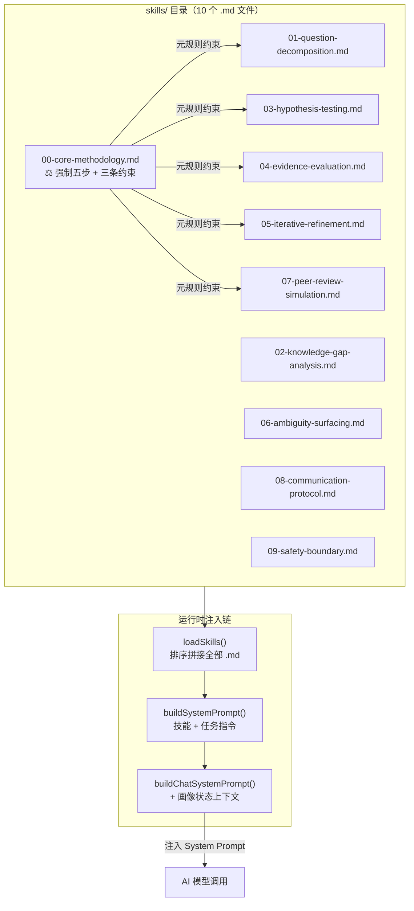
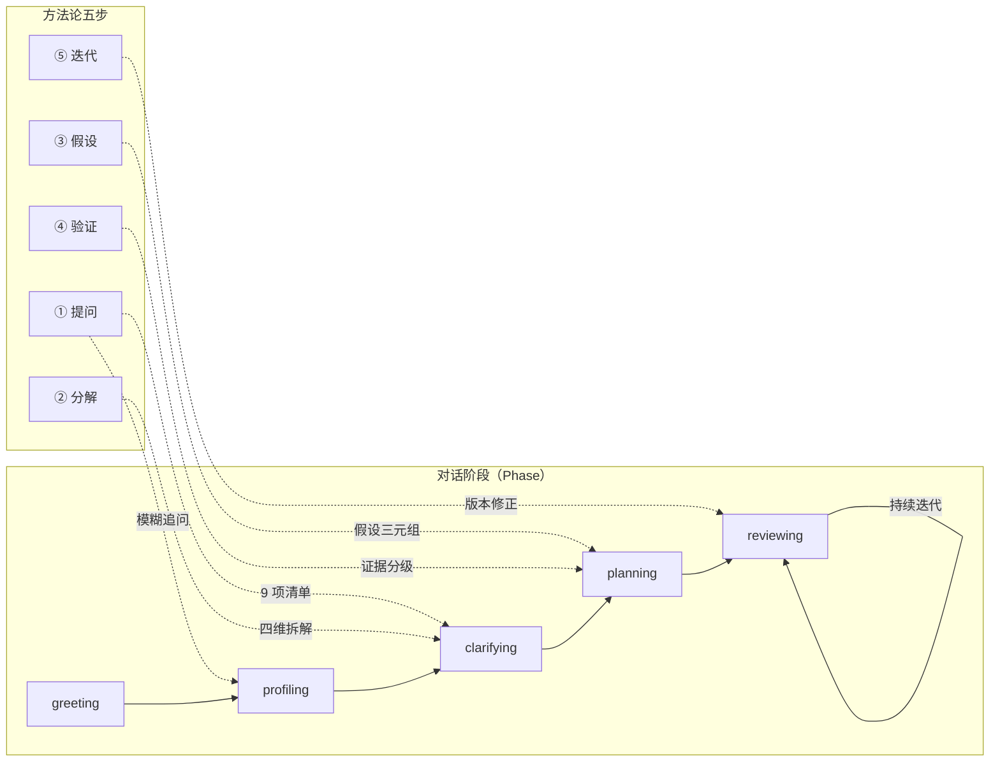

本页深入解析系统 Prompt 中注入的核心科学方法论——**强制五步流程**（提问 → 分解 → 假设 → 验证 → 迭代）以及**同级审查**（Peer Review Simulation）机制。这两套规则共同构成了 AI 引导者的"思维操作系统"，确保每一次对话都沿着严谨的科研推理路径推进，而非凭直觉跳跃。对于中级开发者而言，理解这套方法论不仅是阅读配置文件，更是洞悉系统为何能在模糊输入中持续产出可信计划的设计根源。

Sources: [00-core-methodology.md](skills/00-core-methodology.md#L1-L18)

## 方法论定位：Skills 体系中的"宪法"

在 `skills/` 目录下，10 个 Markdown 文件按编号排序后被整体注入到 System Prompt 中。`00-core-methodology.md` 排在首位，其内容定义了所有后续技能文件必须遵守的**元规则**——强制五步流程和模糊点暴露义务。后续的 01–09 号技能文件分别细化了五步流程中的每一个环节，但它们都不能违背 00 号文件确立的三条强制约束。

Sources: [skills.ts](src/lib/skills.ts#L18-L33), [00-core-methodology.md](skills/00-core-methodology.md#L13-L17)

**Skills 加载与注入链路**如下：`loadSkills()` 读取全部 `.md` 文件 → 按文件名排序拼接 → `buildSystemPrompt()` 将技能文本与阶段指令合并 → `buildChatSystemPrompt()` 追加用户画像状态上下文，形成最终的 System Prompt。这意味着五步流程在**每一次 AI 调用**中都会被完整注入，无一例外。

Sources: [skills.ts](src/lib/skills.ts#L8-L44), [chat-prompts.ts](src/lib/chat-prompts.ts#L23-L40)

## 强制五步流程详解

五步流程并非松散的建议，而是一组**带有门禁条件的顺序约束**——每一步必须完成其前置检查后才能进入下一步。在 `00-core-methodology.md` 的原文中，"任何阶段不得跳过分解步骤"和"拆不完全不得进入下一步"的措辞明确表达了这一强制性。

Sources: [00-core-methodology.md](skills/00-core-methodology.md#L1-L11)

### 第一步：提问——明确真问题

**规则**：明确用户真正想解决的问题是什么。模糊时必须追问，不得臆断。

这一步在系统中通过两个机制落地：

1. **对话阶段机**的 `profiling` 和 `clarifying` 两个阶段专门用于收窄问题。在 `profiling` 阶段，AI 从用户回复中提取画像字段（兴趣方向、当前卡点等），每次最多补充几个有把握的字段，不确定的留给下一轮追问。在 `clarifying` 阶段，AI 必须逐项检查一个 9 项前置清单（用户身份、目标、工具能力、时间约束等），任何一项未通过都不得生成 Plan。

2. **模糊点暴露技能**（`06-ambiguity-surfacing.md`）定义了 7 个触发条件，涵盖从"用户身份不清"到"AI 做出了隐含假设"的各类模糊场景。触发后必须以 2–4 个**选择题**追问，且每个追问必须包含"其他____"自由输入逃生通道。规则明确要求：**禁止 AI 自行填充模糊信息**。

Sources: [00-core-methodology.md](skills/00-core-methodology.md#L7), [06-ambiguity-surfacing.md](skills/06-ambiguity-surfacing.md#L1-L24), [chat-prompts.ts](src/lib/chat-prompts.ts#L114-L143)

### 第二步：分解——四维拆解框架

**规则**：把问题拆成研究对象、已知条件、未知变量、约束条件。拆不完全不得进入下一步。

`01-question-decomposition.md` 将这条规则操作化为一个严格的四项框架：

| 维度 | 含义 | 未完成时的处理 |
|------|------|----------------|
| **研究对象** | 用户在关心什么（人、现象、系统、数据、概念） | 必须追问 |
| **已知条件** | 用户已经知道什么 | 必须追问 |
| **未知变量** | 用户还不知道但需要知道的 | 必须追问 |
| **约束条件** | 时间、工具、能力、环境的限制 | 必须追问 |

四项中**任一项为空就必须追问**，追问时给 2–4 个选项让用户选择而非填空，且拆解结果必须先展示给用户确认后再推进。这种"先展示后推进"的模式与 `clarifying` 阶段的 `checklistPassed` 机制直接对应——只有清单全部通过，状态机才允许进入 `planning` 阶段。

Sources: [01-question-decomposition.md](skills/01-question-decomposition.md#L1-L17), [chat-pipeline.ts](src/lib/chat-pipeline.ts#L629-L647)

### 第三步：假设——假设-预期-验证三元组

**规则**：所有建议以假设形式呈现，格式为"如果按 X 路线走，预期结果 Y，验证方法是 Z"。

`03-hypothesis-testing.md` 在此基础上增加了三条硬约束：不可验证的假设等于无效假设，每条假设必须带验证方法；验证方法必须匹配用户画像中的 `toolAbility` 字段（不会给没有 Python 环境的用户推荐 Jupyter）；如果用户缺乏验证工具，必须给出替代方案或降级验证方法。Plan 中每条 `actionStep` 都必须能追溯到至少一个假设。

在 `PLANNING_INSTRUCTION` 中，这条规则被直接写入生成指令：`"所有建议以假设形式呈现：'如果按 X 路线走，预期 Y，验证方法是 Z'"`，确保 AI 在生成 Plan 时严格遵守假设格式。

Sources: [03-hypothesis-testing.md](skills/03-hypothesis-testing.md#L1-L17), [chat-prompts.ts](src/lib/chat-prompts.ts#L166-L180)

### 第四步：验证——四类证据分级

**规则**：区分四类证据——直接证据、间接证据、推测、观点。Plan 只依赖前两类。

`04-evidence-evaluation.md` 对四类证据的定义和系统处理策略如下：

| 证据级别 | 定义 | 标识 | Plan 中的地位 |
|----------|------|------|---------------|
| **直接证据** | 可重复的实验结果、可验证的数据、公开数据集 | ✅ | 可依赖 |
| **间接证据** | 文献中其他人验证过的结论、公认的理论 | 📖 | 可依赖 |
| **推测** | 合理但未经检验的推理 | ⚠ | 必须标注，建议优先验证 |
| **观点** | 个人看法、未经验证的经验 | 💬 | 不得作为 Plan 依据 |

当某个步骤依赖推测或观点时，AI 必须明确标注"此步骤基于推测，建议优先验证"。这一分级机制在 Plan 的 `systemLogic` 字段中体现——系统判断逻辑被要求"必须说明关键假设和证据边界"。

Sources: [04-evidence-evaluation.md](skills/04-evidence-evaluation.md#L1-L19), [chat-prompts.ts](src/lib/chat-prompts.ts#L147-L164)

### 第五步：迭代——版本化修正循环

**规则**：Plan 不是一次性输出。每轮用户反馈后重新评估假设，修正路径。

`05-iterative-refinement.md` 定义了完整的迭代流程：用户反馈 → 记录修正原因（写入 `PlanState.modifiedReason`）→ 重新评估假设 → 修正 `actionSteps` → 版本号 +1（plan-v1.md → plan-v2.md）→ 展示新旧对比。关键规则包括：一句话否定某假设则整个 Plan 必须重新评估；部分确认则只修正受影响部分；版本历史永久保留不删除。

在代码层面，这一机制通过 `reviewing` 阶段实现。`getNextPhase()` 函数中 `reviewing` 阶段始终返回 `"reviewing"`，意味着一旦进入审查调整，系统就保持在迭代循环中，直到用户主动结束。每次迭代都会通过 `persistPlanArtifacts()` 写入新版本的 Plan 文档、摘要、行动清单和科研路径文件。

Sources: [05-iterative-refinement.md](skills/05-iterative-refinement.md#L1-L20), [chat-pipeline.ts](src/lib/chat-pipeline.ts#L629-L647), [chat-pipeline.ts](src/lib/chat-pipeline.ts#L472-L484)

## 五步流程与对话阶段状态机的映射

五步流程作为方法论层面的抽象，需要与系统具体的对话阶段（`Phase`）对应才能落地执行。下图展示了这种映射关系：

**关键理解**：五步流程中的"提问"和"分解"跨越了 `profiling` 和 `clarifying` 两个阶段——在 `profiling` 阶段通过画像字段收集来明确问题边界，在 `clarifying` 阶段通过前置清单来完成最终的问题收窄和四维拆解。"假设"和"验证"集中在 `planning` 阶段一次性完成，而"迭代"则对应 `reviewing` 阶段的无限循环。

Sources: [triage-types.ts](src/lib/triage-types.ts#L168-L170), [chat-pipeline.ts](src/lib/chat-pipeline.ts#L629-L647), [chat-prompts.ts](src/lib/chat-prompts.ts#L195-L200)

## 同级审查：内建的自我质疑机制

同级审查（Peer Review Simulation）是 `00-core-methodology.md` 强制约束中的第二条：**"生成任何结论后，必须模拟'同级审查者'质疑"**。`07-peer-review-simulation.md` 将这条约束展开为一套完整的审查清单。

Sources: [00-core-methodology.md](skills/00-core-methodology.md#L16), [07-peer-review-simulation.md](skills/07-peer-review-simulation.md#L1-L29)

### 审查者的四个灵魂拷问

每次生成结论后，AI 必须从"同级审查者"的视角自我质问：

1. **这个结论站得住吗？** —— 逻辑链条是否完整，前提是否成立
2. **证据够吗？** —— 是否只依赖了推测或观点，而非直接/间接证据
3. **假设合理吗？** —— 假设是否与用户画像中的已知信息矛盾
4. **是否有其他可能的解释？** —— 是否存在被忽略的替代路径

### 七项审查清单

| 检查项 | 不通过时的处理 | 对应的系统机制 |
|--------|----------------|----------------|
| 回答是否匹配用户画像（语言风格/复杂度）？ | 调整语言 | `explanationPreference` 字段 + `08-communication-protocol.md` |
| 是否有具体可执行的下一步？ | 补充步骤 | `actionSteps` 字段要求 3–7 个可执行步骤 |
| 是否指出了真实风险？ | 补充风险 | `riskWarnings` 字段 |
| 是否给了兜底方案？ | 补充兜底 | `nextOptions` 中的"更简单"选项 |
| 是否过于复杂（小白用户不能用术语堆砌）？ | 降维翻译 | 语言匹配规则中的"简单人话"模式 |
| 是否过于泛泛（不能只说"查论文"）？ | 具体化 | `actionSteps` 要求每步包含动作、时限、验证方法 |
| 服务推荐是否合理？ | 修正推荐 | 分诊引擎的 `recommendedService` |

### 审查闭环：不通过则修正

审查机制的严格之处在于它是一个**闭环**：审查不通过 → 修正后重新输出 → 再次审查 → 直到通过。审查通过的指标写入 `QualityCheck`（Plan 产物中的 `systemLogic` 字段承载了这一信息）。更重要的是，**审查过程对用户透明**——如果 AI 在审查后修正了输出，必须在回复中说明"我重新审视后发现…"。

这一机制的实现依赖于 Skills 的全局注入：由于 `07-peer-review-simulation.md` 在每次 AI 调用时都被完整注入到 System Prompt 中，AI 模型在生成任何回复前都会"看到"这套审查规则，从而在内部完成自我质疑和修正。虽然当前的审查过程不产生独立的中间产物（审查是在模型推理中隐式完成的），但最终输出的 Plan 质量直接受其约束。

Sources: [07-peer-review-simulation.md](skills/07-peer-review-simulation.md#L12-L28)

## 三条强制约束的工程保障

`00-core-methodology.md` 在五步流程之外，还定义了三条贯穿始终的强制约束。这三条约束没有独立的执行阶段，而是通过多个系统层面的机制协同保障。

Sources: [00-core-methodology.md](skills/00-core-methodology.md#L13-L18)

| 强制约束 | 工程保障机制 | 相关代码位置 |
|----------|-------------|-------------|
| **遇到模糊点必须主动列出，禁止 AI 自行填充** | `clarifying` 阶段的 9 项前置清单；`06-ambiguity-surfacing.md` 的 7 个触发条件；追问必须给选择题而非填空 | [chat-prompts.ts](src/lib/chat-prompts.ts#L114-L143) |
| **生成结论后必须模拟同级审查者质疑** | `07-peer-review-simulation.md` 的 7 项审查清单；审查不通过则修正重输出 | [07-peer-review-simulation.md](skills/07-peer-review-simulation.md#L12-L28) |
| **输出遵循画像匹配语言 → 先结论后展开 → 标注前提和不确定性** | `08-communication-protocol.md` 的四段输出结构；`explanationPreference` 字段驱动三级语言适配 | [08-communication-protocol.md](skills/08-communication-protocol.md#L1-L25) |

这三条约束的共性是：它们**无法被单一阶段或单一函数强制执行**。系统的做法是将它们作为全局 System Prompt 的一部分注入，让 AI 模型在每一轮推理中都"看到"这些规则。这是 Prompt 工程层面的"软强制"——通过上下文持续提醒来约束模型行为，而非通过代码逻辑硬编码检查。

## 方法论在数据模型中的体现

五步流程和同级审查的产物最终沉淀到 `PlanState` 类型定义中。下表展示了方法论规则如何映射到具体的数据字段：

| 方法论规则 | PlanState 字段 | 说明 |
|-----------|----------------|------|
| 第二步"分解"的四个维度 | `problemJudgment` | 当前问题判断，承载四维拆解结果 |
| 第三步"假设三元组" | `systemLogic` | 系统判断逻辑，必须说明关键假设和证据边界 |
| 第四步"证据分级" | `riskWarnings` | 风险提示，包含基于推测的步骤警告 |
| 第三步"假设"对应的行动 | `actionSteps` | 可执行步骤，每步包含动作、时限、验证方法 |
| 第五步"迭代" | `version` + `modifiedReason` | 版本号递增 + 修改原因记录 |
| 同级审查 | `systemLogic` + `nextOptions` | 审查结论写入判断逻辑，兜底方案写入下一步选项 |

Sources: [triage-types.ts](src/lib/triage-types.ts#L135-L148)

## 延伸阅读

- 五步流程中"提问"与"分解"的追问机制细节，见 [问题拆解、假设验证与证据分级](17-wen-ti-chai-jie-jia-she-yan-zheng-yu-zheng-ju-fen-ji)
- 模糊点暴露的触发条件、迭代修正的版本管理策略以及安全边界，见 [模糊点暴露、迭代修正与安全边界](18-mo-hu-dian-bao-lu-die-dai-xiu-zheng-yu-an-quan-bian-jie)
- Skills 加载机制的技术实现，见 [Skills 加载机制：Markdown 技能文件注入系统 Prompt](15-skills-jia-zai-ji-zhi-markdown-ji-neng-wen-jian-zhu-ru-xi-tong-prompt)
- 对话阶段状态机如何驱动五步流程的阶段推进，见 [对话阶段状态机：greeting → profiling → clarifying → planning → reviewing](7-dui-hua-jie-duan-zhuang-tai-ji-greeting-profiling-clarifying-planning-reviewing)