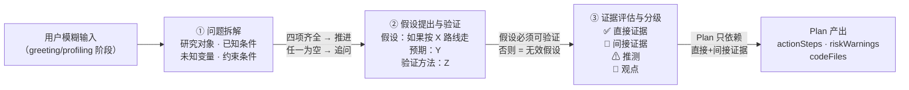
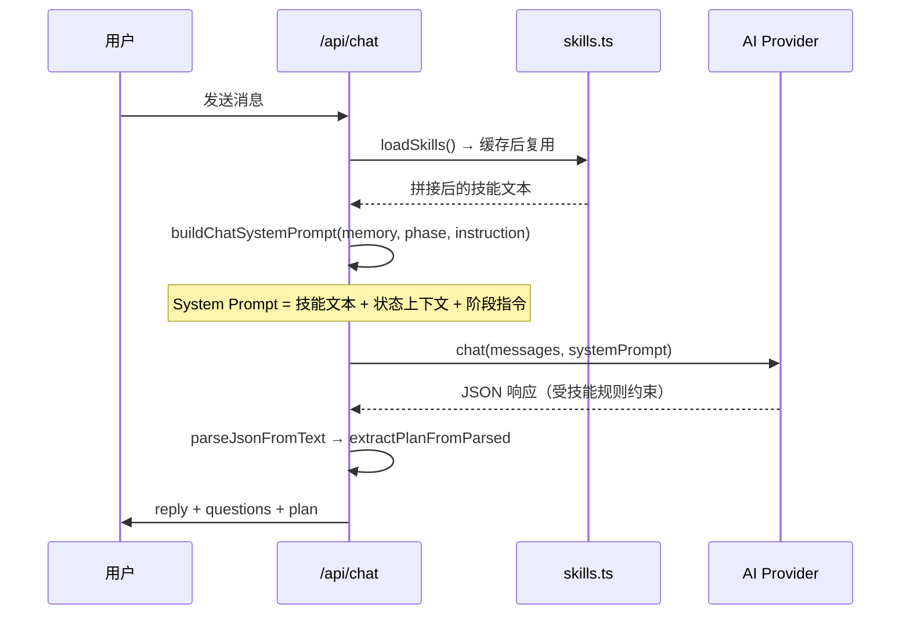

本文档解析系统中三个紧密关联的科研方法论技能——**问题拆解法**、**假设提出与验证**和**证据评估与分级**——它们共同构成了从「模糊用户输入」到「可执行 Plan」的核心推理链。这三个技能以 Markdown 文件形式存储在 `skills/` 目录中，在每轮对话时被完整注入 AI 的系统 Prompt，从而在所有阶段强制约束模型的推理行为。

Sources: [00-core-methodology.md](skills/00-core-methodology.md#L1-L18), [01-question-decomposition.md](skills/01-question-decomposition.md#L1-L17), [03-hypothesis-testing.md](skills/03-hypothesis-testing.md#L1-L17), [04-evidence-evaluation.md](skills/04-evidence-evaluation.md#L1-L19)

## 三技能的定位与协作关系

三个技能在核心方法论五步流程（提问 → 分解 → 假设 → 验证 → 迭代）中分别对应第 2、3、4 步，形成一条严格的线性推理链。每一步的输出是下一步的输入，任何一步不完整则不允许推进。



核心方法论在 [skills/00-core-methodology.md](skills/00-core-methodology.md) 中以强制约束的形式将这三步绑定在一起：**禁止跳过分解步骤**，**禁止 AI 自行填充模糊信息**，所有结论必须先经过同级审查者质疑。这意味着三个技能不是可选的"提示词优化"，而是系统行为的硬性门控。

Sources: [00-core-methodology.md](skills/00-core-methodology.md#L8-L11), [01-question-decomposition.md](skills/01-question-decomposition.md#L4-L10)

## 技能一：问题拆解法

问题拆解是整个推理链的起点，负责将用户的模糊描述（如"我想做一个机器人相关的东西"）转化为结构化的四元组：

| 拆解维度 | 含义 | 示例 |
|---------|------|------|
| **研究对象** | 用户在关心什么（人、现象、系统、数据、概念） | "2R 平面机械臂的正运动学建模" |
| **已知条件** | 用户已经知道什么 | "学过高中物理，了解三角函数" |
| **未知变量** | 用户还不知道但需要知道的 | "DH 参数法、雅可比矩阵" |
| **约束条件** | 时间、工具、能力、环境的限制 | "只有 1 周，没有 MATLAB 许可证" |

### 强制门控规则

拆解结果必须通过以下门控，否则系统必须追问：

1. **四项齐全检查**：四项中任一项为空 → 必须追问，不得自行填充
2. **选项化追问**：追问时给 2-4 个选项，让用户选择而非填空（降低认知负担）
3. **展示确认**：拆解结果在回复中先展示，让用户确认后再推进

这三条规则与对话管线中的 `clarifying` 阶段直接对应——该阶段有一份 9 项前置检查清单，确保问题已被充分拆解和收敛后才允许进入 `planning` 阶段。管线中的 `getNextPhase` 函数明确要求 `checklistPassed === true` 才能从 `clarifying` 推进到 `planning`。

Sources: [01-question-decomposition.md](skills/01-question-decomposition.md#L12-L17), [chat-pipeline.ts](src/lib/chat-pipeline.ts#L629-L647), [chat-prompts.ts](src/lib/chat-prompts.ts#L114-L143)

## 技能二：假设提出与验证

问题拆解完成后，系统进入假设构建阶段。该技能的核心规则是：**Plan 中的每一条建议必须以三元组形式呈现**。

### 假设三元组格式

```
假设：如果按 [X] 路线走
预期结果：[Y]
验证方法：[Z]
```

这不仅是格式要求，更是一条逻辑约束——不可验证的假设等同于无效假设。每条假设必须附带验证方法，而验证方法必须匹配用户的实际工具能力。

### 与用户画像的联动

假设验证技能直接引用画像中的 `toolAbility` 字段来校验验证方法的可行性。这意味着：

- 如果用户画像显示"只会用 Excel"，假设的验证方法不能是"用 Python 做蒙特卡洛模拟"
- 如果用户没有验证该假设的工具 → 必须给出替代表述或**降级验证方法**
- Plan 中每条 `actionStep` 都必须能追溯到至少一个假设

这一约束在 `PLANNING_INSTRUCTION` 中被再次强调——"所有建议以假设形式呈现"，"actionSteps 必须是 3-7 个可执行步骤，每步包含动作、时限、验证方法"。管线中的 `extractPlanFromParsed` 函数通过 `normalizeSteps` 处理步骤数据，确保每步都携带完整信息。

Sources: [03-hypothesis-testing.md](skills/03-hypothesis-testing.md#L1-L17), [chat-prompts.ts](src/lib/chat-prompts.ts#L166-L180), [chat-pipeline.ts](src/lib/chat-pipeline.ts#L239-L252)

## 技能三：证据评估与分级

假设建立后，支撑假设的证据必须经过分级审查。系统定义了四级证据体系：

| 证据级别 | 标识 | 定义 | 能否进入 Plan |
|---------|------|------|-------------|
| **直接证据** | ✅ | 可重复的实验结果、可验证的数据、公开数据集 | ✅ 可以 |
| **间接证据** | 📖 | 文献中其他人验证过的结论、公认的理论 | ✅ 可以 |
| **推测** | ⚠ | 合理但未经检验的推理 | ❌ 需标注 |
| **观点** | 💬 | 个人看法、未经验证的经验 | ❌ 需标注 |

### Plan 的证据准入门槛

系统执行严格的证据准入策略：**Plan 只能依赖前两类证据（直接 + 间接）**。当某个步骤不可避免地依赖推测或观点时，必须明确标注"此步骤基于推测，建议优先验证"。不同级别证据在文档输出中使用对应的 emoji 标识，使证据质量可视化。

### 证据分级在产物中的体现

证据分级的影响贯穿多个产物文件。`planToMarkdown` 函数生成的 `plan-v{N}.md` 中的 `systemLogic` 字段要求"说明关键假设和证据边界"；`buildSummaryDocument` 中的"关键边界"字段专门承载证据局限性的说明；`buildChecklistDocument` 将证据标注融入行动检查清单，确保用户在执行前了解每步的证据基础。

Sources: [04-evidence-evaluation.md](skills/04-evidence-evaluation.md#L1-L19), [chat-pipeline.ts](src/lib/chat-pipeline.ts#L399-L470)

## 技能加载与注入机制

三个技能文件存储在 `skills/` 目录下，通过前缀数字排序（`01-`、`03-`、`04-`）确保加载顺序与推理链一致。`loadSkills` 函数扫描目录中所有 `.md` 文件，按文件名排序后拼接为单一字符串：

```
## Skill: question-decomposition
[01-question-decomposition.md 内容]

---

## Skill: hypothesis-testing
[03-hypothesis-testing.md 内容]

---

## Skill: evidence-evaluation
[04-evidence-evaluation.md 内容]
```

拼接后的完整技能文本通过 `buildSystemPrompt` 函数注入到每轮对话的系统 Prompt 中，位于"当前任务指令"之前。这意味着 AI 在处理任何阶段指令时，都能"看到"这三个技能的完整规则。



`loadSkills` 采用**首次加载 + 永久缓存**策略（`cachedSkills` 变量），避免每次请求都读取磁盘。开发环境下可通过 `reloadSkills` 函数强制刷新缓存。完整的 10 个技能文件合计约数千字符，在单次 API 调用的上下文中占用比例很小，但对 AI 输出质量的约束效果显著。

Sources: [skills.ts](src/lib/skills.ts#L1-L50), [chat-prompts.ts](src/lib/chat-prompts.ts#L23-L40)

## 三技能在不同对话阶段的作用

三个技能并非在所有阶段都同等活跃。它们的影响力随对话状态机的推进而递增：

| 对话阶段 | 问题拆解 | 假设验证 | 证据分级 | 说明 |
|---------|---------|---------|---------|------|
| **greeting** | 🟡 被动参考 | ⚪ 未激活 | ⚪ 未激活 | 仅开场白，无结构化推理 |
| **profiling** | 🟢 主动执行 | 🟡 被动参考 | ⚪ 未激活 | 从用户回复中识别研究对象和已知条件 |
| **clarifying** | 🟢 强制门控 | 🟢 开始构建 | 🟡 被动参考 | 四元组必须齐全，开始形成假设 |
| **planning** | 🟢 输入完备 | 🟢 强制格式 | 🟢 强制分级 | Plan 产物必须满足全部三个技能规则 |
| **reviewing** | 🟢 重新评估 | 🟢 重新验证 | 🟢 重新分级 | 用户反馈可能推翻假设，触发全链重估 |

在 `clarifying` 阶段，9 项前置检查清单（参见 [chat-prompts.ts](src/lib/chat-prompts.ts#L118-L128)）中的第 6 项"存在任何你做出的隐含假设？必须在 reply 中列出"直接呼应问题拆解法的追问规则；第 7-9 项则对应假设验证中的可行性检查。当 `checklistPassed` 为 `true` 时，管线自动发起第二轮 AI 调用（以 `PLANNING_INSTRUCTION` 替换 `CLARIFYING_INSTRUCTION`），生成正式 Plan。

Sources: [chat-prompts.ts](src/lib/chat-prompts.ts#L114-L143), [chat-pipeline.ts](src/lib/chat-pipeline.ts#L334-L378), [route.ts](src/app/api/chat/route.ts#L334-L378)

## Plan 产物中的三技能痕迹

三技能的约束最终在 `PlanState` 类型定义的各个字段中留下可验证的痕迹。以下是技能规则到 Plan 字段的映射：

| Plan 字段 | 对应技能约束 | 验证方式 |
|-----------|------------|---------|
| `problemJudgment` | 问题拆解的四元组收敛结果 | 应包含研究对象+未知变量的明确表述 |
| `systemLogic` | 假设验证 + 证据分级 | "必须说明关键假设和证据边界" |
| `actionSteps[]` | 假设验证的三元组格式 | 每步应含动作+时限+验证方法 |
| `riskWarnings[]` | 证据分级中的推测/观点标注 | 应标注依赖推测的步骤 |
| `recommendedPath` | 三技能综合决策 | 路径应基于直接/间接证据 |

管线中的 `persistPlanArtifacts` 函数将 Plan 持久化为四个文档文件（plan-v{N}.md、summary.md、action-checklist.md、research-path.md），其中 `systemLogic` 字段在 `buildSummaryDocument` 中被标记为"关键边界"，在 `buildResearchPathDocument` 中被标记为"为什么这样走"——这些表述直接反映了假设与证据分级的推理痕迹。

Sources: [triage-types.ts](src/lib/triage-types.ts#L136-L148), [chat-pipeline.ts](src/lib/chat-pipeline.ts#L399-L470), [chat-prompts.ts](src/lib/chat-prompts.ts#L145-L164)

## 设计决策：为什么是规则而非隐式引导

三技能采用**显式规则注入**（Markdown 技能文件 → System Prompt）而非隐式引导（让模型自行判断推理深度），这一设计决策基于三个考量：

1. **可审计性**：每个技能的规则以文本形式存储在代码仓库中，修改有 Git 记录，团队可以 Code Review
2. **确定性门控**：`chat-pipeline.ts` 中的 `getNextPhase` 函数用硬编码逻辑（`checklistPassed`、`isProfileReady`）替代模型自判，确保阶段推进不依赖模型的"自觉性"
3. **降级兼容**：当 AI 调用失败时，`buildFallbackTurn` 提供规则兜底的选项，技能规则作为"最低标准"仍然在兜底逻辑中起作用

这种"规则在外、AI 在内"的架构使得即使模型偶尔偏离技能要求，管线代码中的 `parsePlanFromMarkdown` 和 `normalizeSteps` 仍然能从非标准输出中提取有效 Plan，保证系统的韧性。

Sources: [chat-pipeline.ts](src/lib/chat-pipeline.ts#L518-L568), [chat-pipeline.ts](src/lib/chat-pipeline.ts#L179-L237)

## 延伸阅读

- 上一节：[核心科学方法论：强制五步流程与同级审查](16-he-xin-ke-xue-fang-fa-lun-qiang-zhi-wu-bu-liu-cheng-yu-tong-ji-shen-cha)——了解三技能所属的五步总流程
- 下一节：[模糊点暴露、迭代修正与安全边界](18-mo-hu-dian-bao-lu-die-dai-xiu-zheng-yu-an-quan-bian-jie)——了解 Plan 生成后的迭代修正与安全机制
- 关联阅读：[阶段式 Prompt 设计：每个阶段的 JSON 输出协议](14-jie-duan-shi-prompt-she-ji-mei-ge-jie-duan-de-json-shu-chu-xie-yi)——三技能在不同阶段的 Prompt 注入细节
- 关联阅读：[Skills 加载机制：Markdown 技能文件注入系统 Prompt](15-skills-jia-zai-ji-zhi-markdown-ji-neng-wen-jian-zhu-ru-xi-tong-prompt)——技能文件的加载、缓存与拼接机制