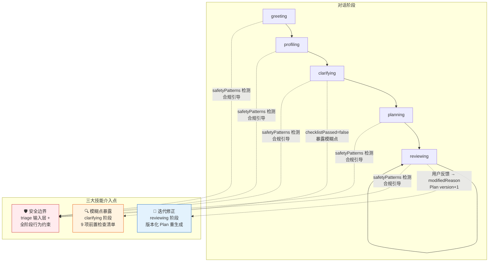
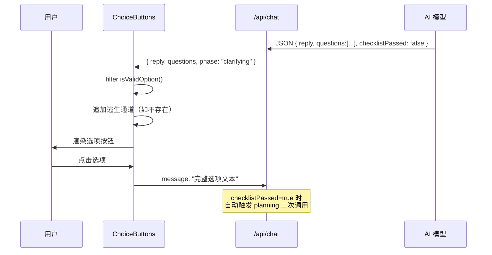
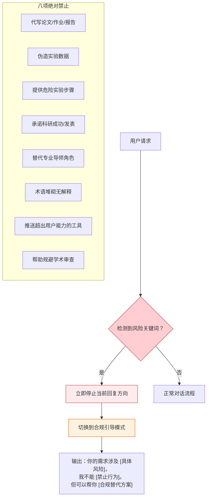
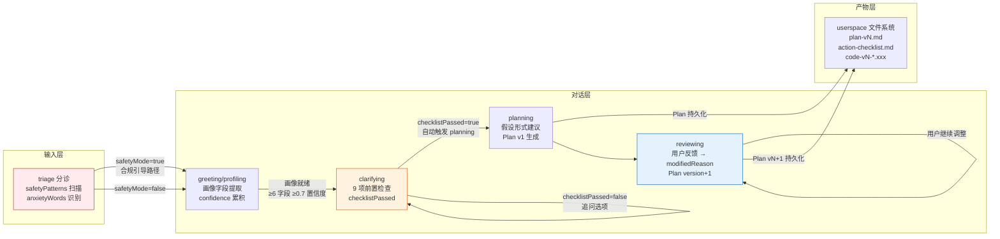

本文档解析系统中三大科研方法论技能的协同机制：**模糊点暴露**（`06-ambiguity-surfacing.md`）强制 AI 在信息不全时停下追问，**迭代修正**（`05-iterative-refinement.md`）通过版本化的 Plan 管理用户反馈驱动的路径调整，**安全边界**（`09-safety-boundary.md`）在输入层和行为层双重拦截学术诚信风险。三者共同构成了系统从"不确定"到"可信输出"的质量护栏。

Sources: [06-ambiguity-surfacing.md](skills/06-ambiguity-surfacing.md#L1-L25), [05-iterative-refinement.md](skills/05-iterative-refinement.md#L1-L20), [09-safety-boundary.md](skills/09-safety-boundary.md#L1-L26)

## 三大技能的定位与关系

这三大技能在对话状态机的不同阶段发挥作用，彼此形成一条"不确定 → 收敛 → 安全产出"的防护链：



**模糊点暴露**在 clarifying 阶段充当"守门员"——前置检查清单未通过时，系统拒绝生成 Plan；**迭代修正**在 reviewing 阶段实现"Plan 不是一次性输出"的核心理念，每轮用户反馈都会触发版本递增和受影响部分的重新评估；**安全边界**贯穿所有阶段，在 triage 输入层通过关键词匹配拦截风险请求，同时在 skills 注入的 Prompt 中约束 AI 行为。

Sources: [chat-pipeline.ts](src/lib/chat-pipeline.ts#L636-L648), [chat-prompts.ts](src/lib/chat-prompts.ts#L90-L125), [triage.ts](src/lib/triage.ts#L14-L25)

## 模糊点暴露：选择题而非填空题

### 设计原则

技能文件 `06-ambiguity-surfacing.md` 确立了一条硬性规则：**禁止 AI 自行填充模糊信息**。当系统遇到任何信息缺口时，必须主动列出模糊点，用结构化的选择题让用户确认，而非让 AI 隐式假设。

这一原则在代码层面通过 `CLARIFYING_INSTRUCTION` 实现了具体的 9 项前置检查清单：

| # | 检查项 | 对应画像/状态字段 | 未通过时的行为 |
|---|--------|-------------------|---------------|
| 1 | 用户身份已确认？ | `ageOrGeneration`, `educationLevel` | 在 `questions` 中追问身份相关选项 |
| 2 | 用户目标已收敛为一个明确问题？ | `interestArea`, `currentBlocker` | 追问目标范围 |
| 3 | 用户工具能力已确认？ | `toolAbility`, `deviceAvailable` | 追问可用工具 |
| 4 | 用户时间约束已明确？ | `timeAvailable` | 追问时间投入意愿 |
| 5 | 用户期望的交付物已明确？ | 隐含于 `interestArea` | 追问交付形态 |
| 6 | 存在 AI 做出的隐含假设？ | — | 在 `reply` 中列出每个假设 |
| 7 | 用户问题是否过大？ | — | 建议收窄范围 |
| 8 | 用户想法在当前约束下是否可执行？ | `toolAbility` + `timeAvailable` | 建议降级 |
| 9 | 用户是否要求跨越过多阶段？ | — | 拆解为分阶段目标 |

Sources: [06-ambiguity-surfacing.md](skills/06-ambiguity-surfacing.md#L10-L23), [chat-prompts.ts](src/lib/chat-prompts.ts#L90-L125)

### 追问格式与逃生通道

追问必须遵循严格的格式约束，在 Prompt 中以 JSON 协议强制执行。每条追问返回 2-4 个结构化选项（`questions` 数组），每个选项是一句**完整的、确定的话**，用户点击即选中。同时，`ChoiceButtons` 组件在前端做了双重保障：它会过滤掉类似"选项A"、"其他"等占位符文本，并始终追加一条逃生通道选项"我不太理解这些，帮我找方向"。



`isValidOption` 函数过滤逻辑覆盖五种无效模式：长度小于 3 个字符、匹配 `选项\s*[a-dA-D]` 的占位符、匹配 `[a-dA-D][).、]` 开头的简写、纯文本"其他"/"其它"、以及包含多个子选项标记 `：.*[A-D].*[A-D]` 的混合文本。

Sources: [choice-buttons.tsx](src/components/choice-buttons.tsx#L10-L22), [chat-prompts.ts](src/lib/chat-prompts.ts#L101-L125)

### 前置检查通过后的自动推进

当 AI 在 clarifying 阶段返回 `checklistPassed: true` 时，API 路由会**自动触发一次额外的 AI 调用**，将阶段切换到 `planning`，使用 `PLANNING_INSTRUCTION` 作为任务指令生成 Plan。这个过程对用户是透明的——用户点击确认所有假设后，系统直接返回 Plan 产物，无需额外操作。

核心代码逻辑在 `route.ts` 中体现为：检测到 `parsed.checklistPassed === true` 且当前无 `planState` 时，立即构建 planning 阶段的 systemPrompt 和 messages，发起二次 AI 调用，将生成的 Plan 持久化到 userspace 文件系统。

Sources: [route.ts](src/app/api/chat/route.ts#L318-L359)

## 迭代修正：Plan 不是一次性输出

### 版本化 Plan 管理机制

技能文件 `05-iterative-refinement.md` 的核心原则是"每轮用户反馈后重新评估"。系统通过 `PlanState` 的 `version` 字段实现版本递增——每次 reviewing 阶段收到用户反馈，版本号自动 +1（`plan-v1.md` → `plan-v2.md` → ...），旧版本永久保留。

版本管理的关键字段定义在 `PlanState` 类型中：

| 字段 | 类型 | 作用 |
|------|------|------|
| `version` | `number` | 当前版本号，每次修正自动递增 |
| `modifiedReason` | `string?` | 修正原因，reviewing 阶段自动赋值为用户消息原文 |
| `userFeedback` | `string?` | 用户反馈摘要 |
| `isCurrent` | `boolean` | 标记是否为当前采用版本 |

`persistPlanArtifacts` 函数在每次 Plan 变更时同步更新四类文件：Plan 文档（`plan-vN.md`）、摘要文档（`summary.md`）、行动清单（`action-checklist.md`）、科研路径说明（`research-path.md`），以及所有代码文件（`code-vN-*.xxx`）。

Sources: [05-iterative-refinement.md](skills/05-iterative-refinement.md#L7-L12), [triage-types.ts](src/lib/triage-types.ts#L128-L146), [chat-pipeline.ts](src/lib/chat-pipeline.ts#L399-L420)

### 修正粒度：全量重评估 vs 局部修正

系统区分两种修正场景。当用户的一句话**否定了某个核心假设**时，整个 Plan 必须重新评估——AI 收到的 `REVIEWING_INSTRUCTION` 要求返回完整的 Plan JSON，`systemLogic` 字段必须说明"本次修改相对上一版改变了什么"。当用户只是**部分确认或微调**时，AI 会仅调整受影响的部分，但仍然返回完整 Plan 以保持版本一致性。

这一逻辑在 Prompt 层面通过 `REVIEWING_INSTRUCTION` 的规则约束实现："先判断用户是在要求'更简单'、'更专业'、'拆开讲'还是'换方向'，只根据用户反馈调整必要部分，但返回完整 Plan"。

Sources: [chat-prompts.ts](src/lib/chat-prompts.ts#L161-L179)

### 前端 Plan 调整交互

`PlanPanel` 组件为每个行动步骤提供四个调整按钮——"更简单"、"更专业"、"拆开讲"、"换方向"。点击按钮时，组件构造一条包含版本号和原始步骤的完整消息发送给 API：

```typescript
// 点击步骤级调整按钮时构造的消息
`请把科研探索计划 v${plan.version} 的第 ${index + 1} 步调整为「${action}」。原步骤：${step}`
```

Plan 面板底部还有一个全局"下一步"区域，提供 `nextOptions` 中定义的选项（默认为"更简单"、"更专业"、"拆开讲"、"换方向"），点击后发送全局调整消息。修改原因通过 `plan.modifiedReason` 展示在 Plan 面板顶部。

Sources: [plan-panel.tsx](src/components/plan-panel.tsx#L79-L95), [plan-panel.tsx](src/components/plan-panel.tsx#L105-L122)

## 安全边界：双层防护机制

### 输入层拦截：规则分诊引擎

安全边界的第一道防线在 `triage.ts` 的 `detectSafetyMode` 函数中实现。系统维护一个 `safetyPatterns` 关键词列表，对用户输入进行精确匹配扫描：

| 类别 | 拦截关键词 | 触发后行为 |
|------|-----------|-----------|
| 代写类 | `代写`、`替我写`、`帮我完成论文`、`替做` | 切换安全模式 |
| 伪造类 | `伪造数据`、`捏造数据`、`假数据`、`伪造实验`、`捏造实验` | 切换安全模式 |
| 逃避类 | `规避学术审查`、`绕过查重` | 切换安全模式 |
| 承诺类 | `包过答辩` | 切换安全模式 |

当 `safetyMode` 为 `true` 时，分诊引擎会执行三项干预：

1. **风险列表注入**：添加"输入里包含学术诚信风险，必须改成真实可验证的交付路径"
2. **最小路径覆盖**：`buildMinimumPath` 在安全模式下返回合规引导路径，强调"删掉任何代写或伪造预期"
3. **服务推荐降级**：安全模式下固定推荐"免费继续问"，不推送付费服务，服务理由中明确"先把任务拉回合规轨道"

Sources: [triage.ts](src/lib/triage.ts#L14-L25), [triage.ts](src/lib/triage.ts#L60-L66), [triage.ts](src/lib/triage.ts#L182-L191)

### 行为层约束：Skills Prompt 注入

安全边界的第二道防线通过 `09-safety-boundary.md` 技能文件注入到所有 AI 调用的 systemPrompt 中。`loadSkills` 函数在系统启动时一次性加载全部技能文件，按文件名前缀排序拼接，通过 `buildSystemPrompt` 注入到每次对话的 system prompt 中。

行为层约束包括**八项绝对禁止**和**三级合规引导流程**：



`anxietyWords` 列表（`来不及`、`怕`、`焦虑`、`完不成`、`不敢`、`老师会不会`、`会不会挂`）则用于识别**焦虑决策型**用户，这类用户虽然不一定触发安全模式，但系统会为其分配更高的风险评分和更保守的最小路径。

Sources: [09-safety-boundary.md](skills/09-safety-boundary.md#L3-L20), [skills.ts](src/lib/skills.ts#L19-L37), [triage.ts](src/lib/triage.ts#L27-L29)

## 三技能协同的完整流程

下面的流程图展示了从用户输入到安全产出的完整数据流，标注了三大技能的具体介入点：



Sources: [route.ts](src/app/api/chat/route.ts#L118-L165), [chat-pipeline.ts](src/lib/chat-pipeline.ts#L636-L648), [chat-pipeline.ts](src/lib/chat-pipeline.ts#L559-L573)

## 延伸阅读

- **前置知识**：了解这三大技能如何被注入到 AI 对话中，参见 [Skills 加载机制：Markdown 技能文件注入系统 Prompt](15-skills-jia-zai-ji-zhi-markdown-ji-neng-wen-jian-zhu-ru-xi-tong-prompt)
- **假设与证据**：这三项技能与 [问题拆解、假设验证与证据分级](17-wen-ti-chai-jie-jia-she-yan-zheng-yu-zheng-ju-fen-ji) 中的假设验证机制紧密配合——模糊点暴露确保假设基于确认信息，迭代修正驱动假设随反馈演进
- **分诊引擎细节**：安全边界在 triage 中的完整实现参见 [规则分诊引擎（triage）：安全检测、用户分类与难度评估](21-gui-ze-fen-zhen-yin-qing-triage-an-quan-jian-ce-yong-hu-fen-lei-yu-nan-du-ping-gu)
- **类型系统**：`PlanState`、`UserProfileState` 等核心类型的字段定义参见 [类型系统：UserProfileState、PlanState、CodeFileArtifact 与 FileManifest](19-lei-xing-xi-tong-userprofilestate-planstate-codefileartifact-yu-filemanifest)