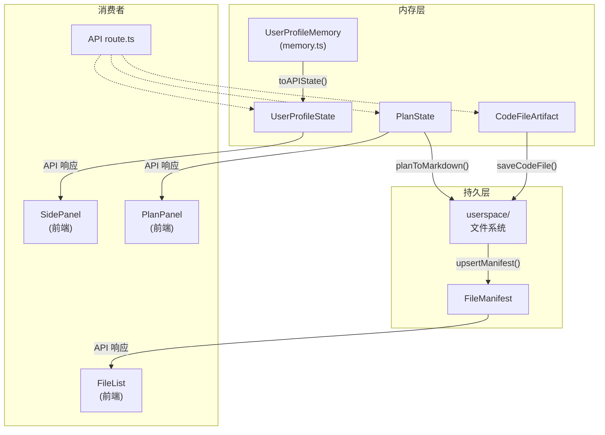
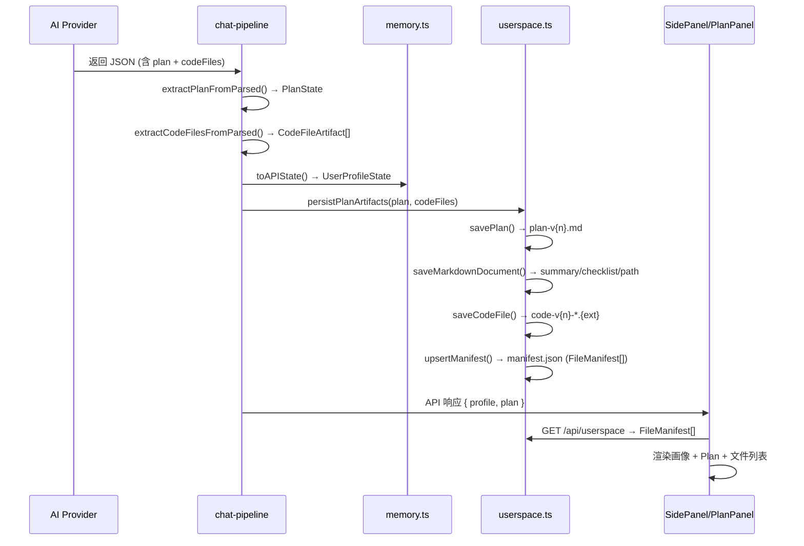

本页是整个项目的**数据模型字典**。四个核心类型全部定义于 [triage-types.ts](src/lib/triage-types.ts)，分别服务于用户画像传递、科研计划展示、代码产物承载和文件清单管理四大职责。理解它们的字段语义和相互关系，是阅读后端管线、前端组件和 API 协议的必要前提。

Sources: [triage-types.ts](src/lib/triage-types.ts#L110-L170)

## 类型全景图

四个类型并非孤立存在——它们在对话管线中依次出现，形成一条从「用户信息采集」到「结构化计划输出」再到「文件持久化」的数据流。下面的关系图展示了它们的协作关系以及各自的主要消费者模块。

Sources: [triage-types.ts](src/lib/triage-types.ts#L122-L167), [memory.ts](src/lib/memory.ts#L12-L13), [chat-pipeline.ts](src/lib/chat-pipeline.ts#L472-L484), [userspace.ts](src/lib/userspace.ts#L131-L145)

---

## UserProfileState：用户画像的扁平 API 投影

`UserProfileState` 是一个纯字符串的**扁平对象**，包含 10 个画像字段，直接对应 PRD §11.1 中定义的用户画像维度。它不携带置信度等内部元数据——这些元数据保留在 [memory.ts](src/lib/memory.ts) 的 `UserProfileMemory` 类型中，仅在需要传递给前端或序列化为 API 响应时，通过 `toAPIState()` 函数将 memory 展平为此类型。

Sources: [triage-types.ts](src/lib/triage-types.ts#L121-L133), [memory.ts](src/lib/memory.ts#L66-L70)

### 字段一览

| 字段名 | 中文标签 | 语义说明 |
|---|---|---|
| `ageOrGeneration` | 年龄段 | 用户年龄或时代背景，如「00 后」「研究生在读」 |
| `educationLevel` | 教育水平 | 最高学历或当前教育阶段 |
| `toolAbility` | 工具能力 | 编程、实验工具等操作能力 |
| `aiFamiliarity` | AI 熟悉度 | 对 AI 工具和概念的熟悉程度 |
| `researchFamiliarity` | 科研理解度 | 对科研流程、方法论的理解深度 |
| `interestArea` | 兴趣方向 | 感兴趣的学科或课题方向 |
| `currentBlocker` | 当前卡点 | 用户在科研推进中最核心的阻碍 |
| `deviceAvailable` | 可用设备 | 可投入的硬件环境（笔记本、GPU 服务器等） |
| `timeAvailable` | 可用时间 | 可投入的时间预算 |
| `explanationPreference` | 解释偏好 | 希望系统以何种风格提供解释（通俗/专业/步骤化） |

Sources: [triage-types.ts](src/lib/triage-types.ts#L122-L133), [side-panel.tsx](src/components/side-panel.tsx#L21-L32)

### 数据来源与流转

`UserProfileState` 是 `UserProfileMemory` 的**投影**。在 `memory.ts` 中，每个字段被包装为一个 `ProfileField`（含 `value`、`confidence`、`source`、`updatedAt`），而 `toAPIState()` 仅提取每个字段的 `value`，丢弃置信度和来源标记。前端 `SidePanel` 接收 `UserProfileState` 后，逐字段渲染到列表中，同时结合额外的 `profileConfidence` 映射来显示置信度徽章（● 已确认 / ◉ 推断中 / ○ 猜测中）。

Sources: [memory.ts](src/lib/memory.ts#L4-L13), [memory.ts](src/lib/memory.ts#L66-L70), [side-panel.tsx](src/components/side-panel.tsx#L34-L39), [side-panel.tsx](src/components/side-panel.tsx#L60-L82)

---

## PlanState：科研探索计划的核心承载

`PlanState` 是 Plan 面板的数据模型，承载 AI 生成的科研探索计划全部结构化内容。它在 `planning` 和 `reviewing` 阶段由 AI 输出解析而来，在右侧面板中渲染为可交互的计划卡片，并可被序列化为 Markdown 文件持久化到 userspace。

Sources: [triage-types.ts](src/lib/triage-types.ts#L135-L148)

### 字段一览

| 字段名 | 类型 | 语义说明 |
|---|---|---|
| `userProfile` | `string` | 用户画像摘要文本，AI 基于画像字段生成的概括描述 |
| `problemJudgment` | `string` | 当前问题判断，AI 对用户研究状态的诊断 |
| `systemLogic` | `string` | 系统判断逻辑，解释为何推荐此路径 |
| `recommendedPath` | `string` | 推荐的科研路径描述 |
| `actionSteps` | `string[]` | 有序的行动步骤列表，用户可逐条执行 |
| `riskWarnings` | `string[]` | 风险提示，每条对应一个潜在问题 |
| `nextOptions` | `string[]` | 下一步选择，如「更简单」「更专业」「拆开讲」「换方向」 |
| `version` | `number` | 当前版本号，每次更新递增 |
| `modifiedReason?` | `string` | 可选，本次修改的原因（用户反馈触发时记录） |
| `userFeedback?` | `string` | 可选，用户反馈摘要 |
| `isCurrent` | `boolean` | 标记是否为当前采用的版本 |

Sources: [triage-types.ts](src/lib/triage-types.ts#L136-L148)

### 两种构造路径

PlanState 有两条构造路径，分别对应 AI 返回 JSON 和 AI 返回纯 Markdown 两种场景：

**路径一：JSON 协议解析**——当 AI 返回包含 `plan` 字段的 JSON 时，`extractPlanFromParsed()` 会尝试多个候选键名（如 `userProfile` / `user_profile`、`actionSteps` / `steps` 等）兼容不同 AI 输出风格，对步骤和风险进行归一化处理，最终组装为 `PlanState`。

**路径二：Markdown 兜底解析**——当 JSON 解析失败时，`parsePlanFromMarkdown()` 通过正则匹配 Markdown 标题分区（`## 用户画像`、`## 步骤` 等）来提取各字段，作为降级策略。若提取结果为空（三个核心字段均为空），返回 `null` 表示解析失败。

Sources: [chat-pipeline.ts](src/lib/chat-pipeline.ts#L266-L305), [chat-pipeline.ts](src/lib/chat-pipeline.ts#L179-L237)

### 持久化与版本管理

`PlanState` 通过 `planToMarkdown()` 序列化为结构化 Markdown，以 `plan-v{version}.md` 的文件名保存到 userspace。每次更新版本号递增，旧版本文件保留，支持通过 `restoreLatestPlan()` 在服务重启时从磁盘恢复最新计划。

Sources: [chat-pipeline.ts](src/lib/chat-pipeline.ts#L399-L423), [chat-pipeline.ts](src/lib/chat-pipeline.ts#L486-L506), [userspace.ts](src/lib/userspace.ts#L170-L186)

---

## CodeFileArtifact：AI 生成的代码产物

`CodeFileArtifact` 描述由 AI 在 Plan 生成过程中产出的单个代码文件。它不仅包含代码内容本身，还携带文件元信息，使代码可以被独立保存、归类和展示。

Sources: [triage-types.ts](src/lib/triage-types.ts#L150-L156)

### 字段一览

| 字段名 | 类型 | 语义说明 |
|---|---|---|
| `filename` | `string` | 经过清洗的安全文件名，格式为 `code-v{version}-{sanitized}.{ext}` |
| `title` | `string` | 文件的人类可读标题，用于 UI 展示 |
| `language` | `string` | 编程语言标识，如 `python`、`matlab`、`javascript` |
| `content` | `string` | 代码全文内容 |
| `version` | `number` | 对应的 Plan 版本号 |

Sources: [triage-types.ts](src/lib/triage-types.ts#L150-L156)

### 从 AI 输出到安全文件的提取过程

`extractCodeFilesFromParsed()` 从 AI 返回的 JSON 中提取 `codeFiles` 数组（兼容 `codeFiles`、`code_files` 等多种键名），对每个元素进行多重兼容处理：

- **内容提取**：依次尝试 `content` → `code` → `source` 键名
- **语言识别**：依次尝试 `language` → `lang` 键名，默认为 `text`
- **文件名清洗**：`sanitizeCodeFilename()` 将文件名中的空格和特殊字符替换为连字符，移除 `..` 等路径穿越成分，自动添加版本前缀 `code-v{version}-` 和语言对应的扩展名

Sources: [chat-pipeline.ts](src/lib/chat-pipeline.ts#L307-L397)

### 持久化

`CodeFileArtifact` 通过 `saveCodeFile()` 写入 userspace，同时在 manifest 中注册一条 `type: "code"` 的 `FileManifest` 条目。文件名中的版本前缀保证了同一文件在不同 Plan 版本下的安全共存。

Sources: [userspace.ts](src/lib/userspace.ts#L207-L224), [chat-pipeline.ts](src/lib/chat-pipeline.ts#L472-L484)

---

## FileManifest：userspace 文件清单的元数据条目

`FileManifest` 是 userspace 文件系统的**目录卡片**。userspace 目录下的每一个持久化文件（profile、plan、checklist、path、summary、code）都会在 `manifest.json` 中对应一条 `FileManifest` 记录，用于前端文件列表的渲染和文件的版本追踪。

Sources: [triage-types.ts](src/lib/triage-types.ts#L158-L166), [userspace.ts](src/lib/userspace.ts#L112-L145)

### 字段一览

| 字段名 | 类型 | 语义说明 |
|---|---|---|
| `filename` | `string` | 文件名，如 `plan-v2.md`、`code-v4-demo.py` |
| `title` | `string` | 展示标题，如「科研探索计划 v2」 |
| `type` | 联合类型（见下表） | 文件分类，决定前端展示图标和行为 |
| `version` | `number` | 文件版本号，与 Plan 版本对齐 |
| `createdAt` | `string` | ISO 8601 格式的创建时间 |
| `language?` | `string` | 可选，代码文件的语言标识 |

Sources: [triage-types.ts](src/lib/triage-types.ts#L159-L166)

### 文件类型枚举

`type` 字段为字符串字面量联合类型，共 7 种取值：

| type 值 | 含义 | 来源 |
|---|---|---|
| `"profile"` | 用户画像文件 | `saveProfile()` |
| `"plan"` | 科研计划文件 | `savePlan()` |
| `"checklist"` | 行动检查清单 | `saveMarkdownDocument()` |
| `"path"` | 科研路径说明 | `saveMarkdownDocument()` |
| `"summary"` | 当前探索摘要 | `saveMarkdownDocument()` |
| `"image"` | 图片产物（预留） | 暂未实现 |
| `"code"` | 代码文件 | `saveCodeFile()` |

Sources: [triage-types.ts](src/lib/triage-types.ts#L162), [userspace.ts](src/lib/userspace.ts#L156-L205), [userspace.ts](src/lib/userspace.ts#L207-L224)

### CRUD 操作

`FileManifest` 的生命周期由 `userspace.ts` 中的三个函数管理：

- **`getManifest(sessionId)`**：读取 `manifest.json`，过滤掉文件系统中已不存在的条目，确保清单与实际文件一致
- **`upsertManifest(sessionId, entry)`**：按 `filename` 查找已有条目，存在则替换、不存在则追加，然后写回磁盘
- **`listFiles(sessionId)`**：列出目录下所有 `.md` 文件（排除 `manifest.json`），作为文件名的快速查询接口

Sources: [userspace.ts](src/lib/userspace.ts#L112-L153)

---

## 四类型的协作时序

下面通过一个典型的「Plan 生成 → 持久化 → 前端展示」完整流程，展示四个类型如何协同工作：

Sources: [chat-pipeline.ts](src/lib/chat-pipeline.ts#L266-L305), [chat-pipeline.ts](src/lib/chat-pipeline.ts#L350-L397), [chat-pipeline.ts](src/lib/chat-pipeline.ts#L472-L484), [memory.ts](src/lib/memory.ts#L66-L70), [route.ts](src/app/api/chat/route.ts#L460-L474)

---

## 类型定义索引与设计原则

所有四个类型集中定义在 [triage-types.ts](src/lib/triage-types.ts) 的第 110–170 行，遵循以下设计原则：

**纯数据、无方法**——类型均为 TypeScript `type` 别名（非 `class`），仅描述数据形状，行为逻辑分散在 `chat-pipeline.ts`、`memory.ts`、`userspace.ts` 等模块中。这种分离使类型可以被前后端无差别共享，不引入运行时依赖。

**宽入严出**——AI 输出解析层（如 `extractPlanFromParsed`）容忍多种键名和格式变体，但输出的类型实例严格符合 TypeScript 类型定义。这保证了下游消费者始终面对一致的接口。

**版本内嵌**——`PlanState.version`、`CodeFileArtifact.version`、`FileManifest.version` 三者共享同一版本号空间，由管线在每次 Plan 更新时统一递增，实现了计划、代码、文件清单之间的版本一致性。

Sources: [triage-types.ts](src/lib/triage-types.ts#L110-L170)

---

> **下一步阅读**：了解了数据模型后，可以继续探索 [userspace 文件系统：会话隔离、路径安全校验与文件清单管理](20-userspace-wen-jian-xi-tong-hui-hua-ge-chi-lu-jing-an-quan-xiao-yan-yu-wen-jian-qing-dan-guan-li) 了解 `FileManifest` 的持久化细节，或回到 [POST /api/chat：请求/响应协议与阶段推进逻辑](22-post-api-chat-qing-qiu-xiang-ying-xie-yi-yu-jie-duan-tui-jin-luo-ji) 查看这些类型在 API 协议中的完整序列化方式。