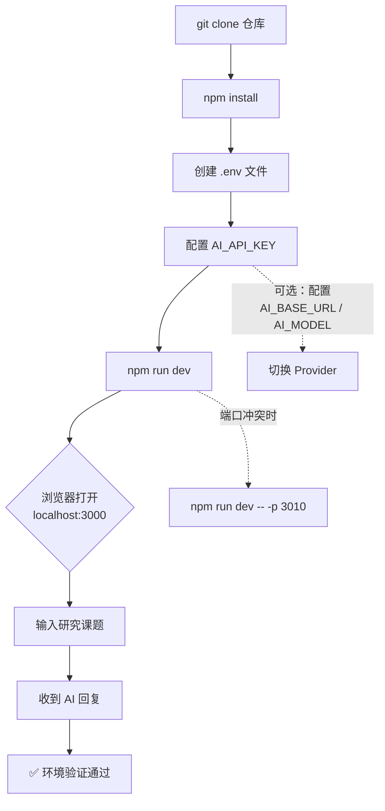

本文档是 Research-Triage（人人都能做科研）项目的**环境搭建与首次运行指南**，目标是在 10 分钟内完成从克隆代码到与 AI 对话的全链路验证。文档覆盖前置依赖检查、环境变量配置、开发服务器启动、功能验证和常见问题排查五个环节，确保你在进入核心业务逻辑阅读之前拥有一个可用的本地运行环境。

## 技术栈一览

项目采用 **Next.js 16 App Router** 作为全栈框架，前端使用 **React 19** + **TypeScript 5.9**（strict 模式），AI 调用层基于 OpenAI 兼容协议的裸 `fetch` 实现（不依赖任何 AI SDK），不使用数据库——所有会话状态存储于 Node.js 内存 Map，用户产物写入本地 `userspace/` 目录。下表汇总了关键依赖及其职责：

| 依赖 | 版本 | 职责 |
|---|---|---|
| **next** | ^16.0.1 | 全栈框架，App Router 驱动页面与 API |
| **react / react-dom** | ^19.2.0 | 前端 UI 渲染 |
| **marked** | ^18.0.3 | Markdown 渲染（Plan 文档、代码文件预览） |
| **zod** | ^4.1.12 | 运行时类型校验 |
| **typescript** | ^5.9.3 | 类型系统（strict, ES2022 target） |
| **vitest** | ^4.0.7 | 单元/契约测试 |

Sources: [package.json](package.json#L1-L26), [tsconfig.json](tsconfig.json#L1-L37)

## 前置条件

开始之前，请确认本地环境满足以下要求：

| 条件 | 最低要求 | 验证命令 |
|---|---|---|
| **Node.js** | ≥ 18.17（需支持 ES2022 + fetch API） | `node -v` |
| **npm** | ≥ 9（随 Node.js 自带） | `npm -v` |
| **AI API Key** | 至少一个有效的 API Key | 见下方环境变量配置 |
| **Git** | 任意版本 | `git --version` |

> **关于 Node.js 版本**：项目 `tsconfig.json` 指定 `target: "ES2022"`，且后端代码中直接使用全局 `fetch`（不引入 polyfill）。Node.js 18.17+ 是最低运行门槛，推荐使用 Node.js 20 LTS 以获得更好的稳定性。

Sources: [tsconfig.json](tsconfig.json#L3-L4)

## 环境搭建流程

以下是完整的搭建步骤，从克隆仓库到首次 AI 对话：



### 第一步：克隆与安装

```bash
git clone <repository-url>
cd NanJingHackson
npm install
```

`npm install` 会安装 `package.json` 中声明的全部依赖。项目不使用 `node_modules` 之外的二进制工具链（无 Prisma、无 Tailwind CLI、无 PostCSS），安装过程通常在 30 秒内完成。

Sources: [package.json](package.json#L12-L25)

### 第二步：配置环境变量

项目通过 `.env` 文件管理 AI Provider 的连接信息。在项目根目录创建 `.env` 文件：

```bash
# 最小必填配置
AI_API_KEY=sk-your-deepseek-api-key-here

# 可选：切换 Provider
AI_BASE_URL=https://api.deepseek.com/v1
AI_MODEL=deepseek-v4-flash
```

**环境变量优先级表**（从高到低）：

| 优先级 | Base URL | API Key | Model |
|---|---|---|---|
| **1（最高）** | `AI_BASE_URL` | `AI_API_KEY` | `AI_MODEL` |
| **2** | `DEEPSEEK_BASE_URL` | `DEEPSEEK_API_KEY` | — |
| **3** | `OPENAI_BASE_URL` | `OPENAI_API_KEY` | — |
| **默认值** | `https://api.deepseek.com/v1` | `""`（抛出错误） | `deepseek-v4-flash` |

> **安全提示**：`.env` 文件已在 `.gitignore` 中被排除，不会被提交到版本库。项目使用三级环境变量降级策略，目的是兼容不同的 AI Provider（DeepSeek、OpenAI、Moonshot、OpenRouter、本地 vLLM/Ollama 等），**无需修改任何代码**即可切换。

Sources: [src/lib/ai-provider.ts](src/lib/ai-provider.ts#L1-L31), [README.md](README.md#L86-L102), [.gitignore](.gitignore#L31-L34)

### 第三步：启动开发服务器

```bash
npm run dev
```

控制台会输出类似以下信息：

```
▲ Next.js 16.x.x
- Local:    http://localhost:3000
- Environments: .env
```

如果端口 3000 被占用，可以指定其他端口：

```bash
npm run dev -- -p 3010
```

Sources: [package.json](package.json#L6-L7), [README.md](README.md#L72-L84)

### 第四步：验证 AI 连通性

在浏览器打开 `http://localhost:3000` 后，你会看到「人人都能做科研」工作台界面。在输入框中输入任意研究课题（例如："我想研究AI怎么帮助中学生学习物理"），点击发送。

**首次成功的标志**：AI 返回一段个性化问候 + 结构化选项按钮（questions），同时控制台日志中会出现类似：

```
[chat] start model=deepseek-v4-flash msgs=... key=yes
[chat] success latencyMs=... contentChars=...
```

你也可以在服务运行期间，用命令行快速验证 API 连通性（无需启动浏览器）：

```bash
# 在另一个终端中执行
curl -X POST http://localhost:3000/api/chat \
  -H "Content-Type: application/json" \
  -d '{"message":"我想研究AI怎么帮助中学生学习物理","sessionId":"smoke-chat"}'
```

如果返回 JSON 中包含 `reply` 字段和非空的 `questions` 数组，说明 AI 调用链路完全通畅。

Sources: [README.md](README.md#L182-L188), [src/app/api/chat/route.ts](src/app/api/chat/route.ts#L70-L80)

## 项目结构速览

理解以下目录结构有助于你快速定位问题或阅读后续文档：

```text
NanJingHackson/
├── .env                          # ← 你创建的，AI API Key 在这里
├── package.json                  # 脚本与依赖声明
├── next.config.mjs               # Next.js 配置（当前为空配置）
├── tsconfig.json                 # TypeScript 编译配置
│
├── src/
│   ├── app/
│   │   ├── layout.tsx            # 根布局，中文语言标注
│   │   ├── page.tsx              # 唯一主工作台（单页应用入口）
│   │   └── api/
│   │       └── chat/route.ts     # 唯一 API 入口 POST /api/chat
│   ├── components/               # UI 组件（8 个）
│   └── lib/
│       ├── ai-provider.ts        # AI 调用层（fetch 封装）
│       ├── chat-pipeline.ts      # 对话管线（JSON 解析、Plan 归一化）
│       ├── chat-prompts.ts       # 阶段式 Prompt 构建
│       ├── memory.ts             # 用户画像记忆与置信度
│       ├── skills.ts             # skills/*.md 加载与注入
│       ├── triage.ts             # 规则分诊引擎
│       └── userspace.ts          # 会话文件存储
│
├── skills/                       # 十大科研方法论 Markdown 文件
└── userspace/                    # ← 运行时生成，已 .gitignore
    └── {sessionId}/
        ├── manifest.json
        ├── profile.md
        ├── plan-v1.md
        └── ...
```

**核心架构要点**：整个应用是一个**单页工作台 + 单 API 入口**的设计。前端 `page.tsx` 通过 `POST /api/chat` 与后端通信，后端在 `sessions` Map 中维护会话状态，AI 产物写入 `userspace/{sessionId}/` 目录供右侧文档面板预览。

Sources: [src/app/page.tsx](src/app/page.tsx#L1-L28), [src/app/api/chat/route.ts](src/app/api/chat/route.ts#L36-L46), [README.md](README.md#L35-L67)

## 可用脚本参考

项目定义了 5 个 npm 脚本，覆盖开发、构建和验证全流程：

| 脚本 | 命令 | 用途 |
|---|---|---|
| `dev` | `npm run dev` | 启动 Next.js 开发服务器（热重载） |
| `build` | `npm run build` | 生产构建，验证 TypeScript 编译与 SSR 无误 |
| `start` | `npm run start` | 启动生产模式服务器（需先 build） |
| `typecheck` | `npm run typecheck` | 仅类型检查（`tsc --noEmit`），快速验证类型安全 |
| `test` | `npm run test` | 运行 Vitest 契约测试（管线、userspace、分诊） |

> **推荐工作流**：开发时用 `npm run dev` 启动热重载；每次提交前运行 `npm run typecheck && npm run test` 确保不引入回归；里程碑节点执行 `npm run build` 验证完整构建。

Sources: [package.json](package.json#L5-L11), [README.md](README.md#L174-L179)

## AI 连通性诊断脚本

项目内置了一个独立的 AI 连通性诊断脚本，用于在**不启动 Next.js** 的情况下快速验证 API Key 和网络是否正常：

```bash
node scripts/test-deepseek-simple.js
```

成功输出示例：

```
API base: https://api.deepseek.com/v1
API model: deepseek-v4-flash
API key: set (length=32)
success: 成功
```

失败输出示例：

```
API key: missing
Error: Set AI_API_KEY, DEEPSEEK_API_KEY, or OPENAI_API_KEY first.
```

这个脚本读取与主应用**完全相同的环境变量优先级链**，是排查 AI 连通性问题的第一工具。

Sources: [scripts/test-deepseek-simple.js](scripts/test-deepseek-simple.js#L1-L48)

## 常见问题排查

| 症状 | 可能原因 | 解决方案 |
|---|---|---|
| `npm install` 失败 | Node.js 版本过低 | 升级至 Node.js ≥ 18.17 |
| `npm run dev` 报端口占用 | 3000 端口被其他进程占用 | 使用 `npm run dev -- -p 3010` 指定其他端口 |
| 浏览器报「网络异常」 | `.env` 中 API Key 未配置或无效 | 检查 `.env` 文件是否存在，`AI_API_KEY` 是否正确 |
| AI 回复 `_fallback: true` | AI API 调用失败（Key 无效/额度不足/网络超时） | 检查 API Key 额度，或用 `node scripts/test-deepseek-simple.js` 诊断 |
| 控制台报 `No API key found` | 三级环境变量均未设置 | 在 `.env` 中设置 `AI_API_KEY`（或 `DEEPSEEK_API_KEY`、`OPENAI_API_KEY`） |
| `npm run build` 失败 | TypeScript 类型错误 | 运行 `npm run typecheck` 查看具体错误位置 |
| `npm run test` 失败 | 测试用例回归 | 检查是否修改了管线解析逻辑或类型定义 |
| 页面空白无内容 | 浏览器 JS 被禁用或缓存问题 | 清除浏览器缓存，确认 JS 已启用 |

Sources: [src/lib/ai-provider.ts](src/lib/ai-provider.ts#L52-L57), [README.md](README.md#L72-L78)

## 下一步

环境搭建完成后，建议按照以下顺序阅读文档：

1. **[核心对话闭环：从模糊想法到可执行 Plan](3-he-xin-dui-hua-bi-huan-cong-mo-hu-xiang-fa-dao-ke-zhi-xing-plan)** — 理解系统的核心工作流程，了解用户从"模糊想法"到"可执行 Plan"的完整路径
2. **[左侧聊天面板：对话、选项与自由输入](4-zuo-ce-liao-tian-mian-ban-dui-hua-xuan-xiang-yu-zi-you-shu-ru)** 和 **[右侧面板：画像、Plan、文件与历史对比](5-you-ce-mian-ban-hua-xiang-plan-wen-jian-yu-li-shi-dui-bi)** — 熟悉界面的各个交互区域
3. **[系统架构总览：单页工作台 + 单 API 入口 + userspace 文件沉淀](6-xi-tong-jia-gou-zong-lan-dan-ye-gong-zuo-tai-dan-api-ru-kou-userspace-wen-jian-chen-dian)** — 深入理解整体架构设计