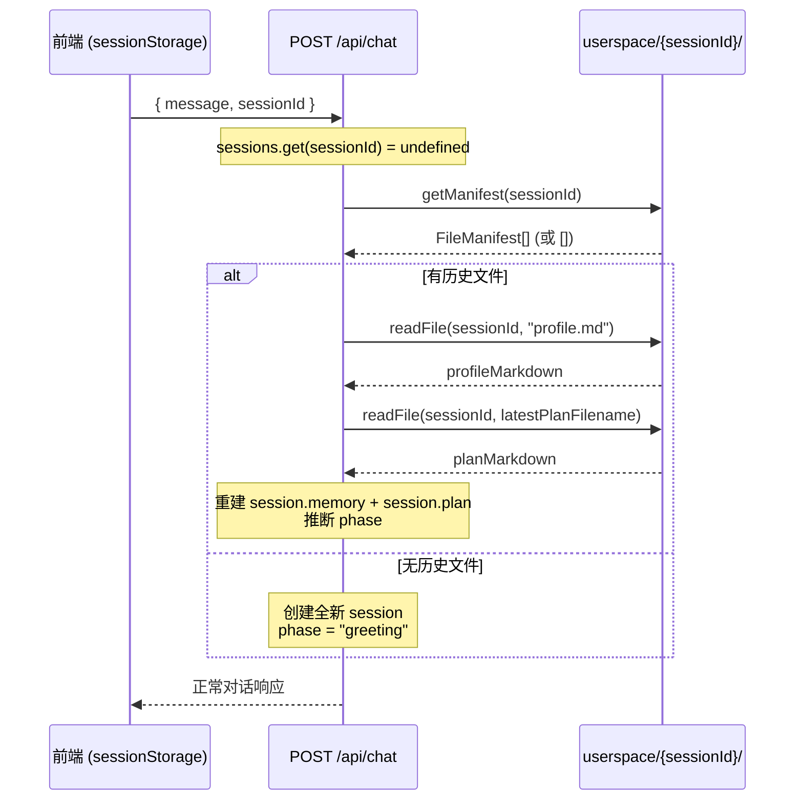
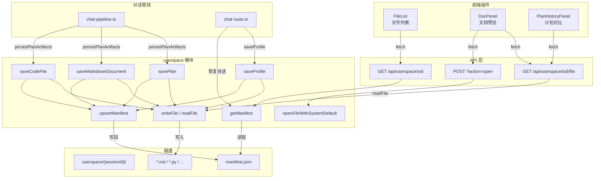

userspace 是本项目 MVP 阶段的**文件持久化核心模块**——它以 `sessionId` 为边界在服务器磁盘上隔离出独立的用户空间，为 AI 对话过程中产生的用户画像、科研计划、行动清单、科研路径及代码文件提供读写、校验与清单追踪能力。本文将从三个维度展开：**会话隔离机制**（目录结构与会话生命周期）、**路径安全校验**（注入防护的两层防线）、以及**文件清单管理**（manifest 的 CRUD 与陈旧条目过滤）。读完本文后，你将理解一个纯磁盘文件系统如何在没有数据库的场景下支撑完整的会话恢复与文件预览链路。

Sources: [userspace.ts](src/lib/userspace.ts#L1-L225), [userspace.test.ts](src/lib/userspace.test.ts#L1-L91), [triage-types.ts](src/lib/triage-types.ts#L158-L166)

## 目录结构与核心常量

所有用户文件都存放在项目根目录下的 `userspace/` 文件夹中，每个会话拥有一个以 `sessionId`（UUID 格式）命名的子目录。该基路径由模块顶层常量 `BASE` 定义：

```ts
const BASE = path.join(process.cwd(), "userspace");
```

这意味着一个典型的磁盘布局如下：

```
userspace/
├── a1b2c3d4-e5f6-7890-abcd-ef1234567890/
│   ├── manifest.json          ← 文件清单
│   ├── profile.md             ← 用户画像
│   ├── plan-v1.md             ← 科研计划 v1
│   ├── plan-v2.md             ← 科研计划 v2（如有修改）
│   ├── summary.md             ← 当前科研探索摘要
│   ├── action-checklist.md    ← 行动检查清单
│   ├── research-path.md       ← 科研路径说明
│   └── code-v1-demo.py        ← AI 生成的代码文件
├── f9e8d7c6-b5a4-3210-fedc-ba0987654321/
│   └── ...
```

`sessionId` 在前端通过 `crypto.randomUUID()` 生成并持久化于 `sessionStorage`，确保同一浏览器标签页内会话唯一性。每个会话目录在首次写入时自动创建（`mkdirSync` + `recursive: true`），无需显式初始化步骤。

Sources: [userspace.ts](src/lib/userspace.ts#L6), [page.tsx](src/app/page.tsx#L20-L27)

## 路径安全校验：两层防线

userspace 模块的安全模型围绕一个核心威胁模型构建：**防止通过文件名或会话 ID 注入实现目录穿越（directory traversal）**。为此设计了校验层——正则白名单与路径解析兜底。

### 第一层：正则白名单断言

`assertSafeSegment()` 函数是所有入口的守门员，它对 `sessionId` 和 `filename` 两个参数施加相同的约束：

```ts
function assertSafeSegment(value: string, label: string): void {
  if (!/^[a-zA-Z0-9_.-]+$/.test(value) || value.includes("..")) {
    throw new Error(`Invalid ${label}`);
  }
}
```

这条规则同时实现了两个安全属性：

| 校验规则 | 防御的攻击向量 | 示例 |
|---------|-------------|------|
| `^[a-zA-Z0-9_.-]+$` | 禁止路径分隔符 `/`、`\` | `../../etc/passwd` ❌ |
| 同上 | 禁止空字节、特殊字符 | `file\x00.md` ❌ |
| 同上 | 禁止分号、管道等 shell 元字符 | `file;rm -rf.md` ❌ |
| `value.includes("..")` 双重检查 | 禁止父目录穿越 | `..`、`a..b` ❌ |

该函数在 `dir()`（校验 sessionId）和 `filePath()`（校验 filename）中均被调用，确保任何路径参数在参与拼接之前都已通过白名单过滤。

Sources: [userspace.ts](src/lib/userspace.ts#L8-L12), [userspace.ts](src/lib/userspace.ts#L14-L19), [userspace.ts](src/lib/userspace.ts#L21-L30)

### 第二层：路径解析兜底

即便通过了正则白名单，`filePath()` 仍然执行一次运行时路径逃逸检测：

```ts
function filePath(sessionId: string, filename: string): string {
  assertSafeSegment(filename, "filename");
  const fullPath = path.join(dir(sessionId), filename);
  const resolved = path.resolve(fullPath);
  const root = path.resolve(dir(sessionId));
  if (!resolved.startsWith(`${root}${path.sep}`)) {
    throw new Error("Invalid filename");
  }
  return resolved;
}
```

逻辑是：先用 `path.resolve` 将拼接后的路径解析为绝对路径，再用 `path.resolve` 解析会话根目录，最后检查前者是否是后者的子路径。这种"拼接 → 解析 → 比对"的模式是防御符号链接或平台差异导致逃逸的标准做法。注意 `startsWith` 使用 `${root}${path.sep}` 确保精确匹配目录前缀（避免 `/userspace/abc` 匹配 `/userspace/abcd` 的误判场景）。

两层防线的关系是**互补而非冗余**：正则白名单拦截绝大多数恶意输入（快速失败），路径解析兜底捕获边界情况（如符号链接）。测试用例验证了以下场景：

```ts
// sessionId 穿越攻击
expect(() => writeFile("../escape", "hello.md", "x")).toThrow(/Invalid sessionId/);
// filename 穿越攻击
expect(() => writeFile("safe-session", "../escape.md", "x")).toThrow(/Invalid filename/);
// 嵌套路径
expect(() => readFile("safe-session", "nested/escape.md")).toThrow(/Invalid filename/);
// 特殊字符
expect(() => readFile("safe-session", "semi;colon.md")).toThrow(/Invalid filename/);
```

Sources: [userspace.ts](src/lib/userspace.ts#L21-L30), [userspace.test.ts](src/lib/userspace.test.ts#L24-L29)

## 会话隔离：目录级隔离模型

userspace 采用**目录级隔离**——不同 `sessionId` 对应不同的物理目录，不存在跨会话的文件共享或引用机制。核心文件操作函数 `writeFile()` 和 `readFile()` 的签名均以 `sessionId` 为第一参数：

```ts
export function writeFile(sessionId: string, filename: string, content: string): string
export function readFile(sessionId: string, filename: string): string | null
```

`writeFile` 返回实际写入的绝对路径，`readFile` 在文件不存在时返回 `null`（而非抛出异常），让调用方可以优雅降级。两个函数都经过 `filePath()` 的安全校验，因此调用方无需重复处理路径安全问题。

`listFiles()` 函数提供会话内文件枚举能力，仅返回 `.md` 文件（排除 `manifest.json`），用于简单场景下的文件列表展示。

Sources: [userspace.ts](src/lib/userspace.ts#L33-L51), [userspace.ts](src/lib/userspace.ts#L147-L153)

## 文件清单（Manifest）管理

每个会话目录下维护一个 `manifest.json` 文件，它是 userspace 的"数据库表"——记录所有文件的元信息，支持清单查询、条目更新和陈旧条目自动过滤。

### FileManifest 类型定义

清单中每条记录对应 [类型系统：UserProfileState、PlanState、CodeFileArtifact 与 FileManifest](19-lei-xing-xi-tong-userprofilestate-planstate-codefileartifact-yu-filemanifest) 中定义的 `FileManifest` 类型：

```ts
type FileManifest = {
  filename: string;                                    // 磁盘文件名
  title: string;                                       // 展示标题
  type: "profile" | "plan" | "checklist" | "path" | "summary" | "image" | "code";
  version: number;                                     // 版本号
  createdAt: string;                                   // ISO 时间戳
  language?: string;                                   // 仅 code 类型使用
};
```

`type` 字段枚举了系统生成的全部文件种类：用户画像（profile）、科研计划（plan）、行动清单（checklist）、科研路径（path）、探索摘要（summary）、图片（image，预留）和代码文件（code）。

Sources: [triage-types.ts](src/lib/triage-types.ts#L158-L166)

### 清单读取与陈旧过滤

`getManifest()` 函数负责读取并过滤清单：

```ts
export function getManifest(sessionId: string): FileManifest[] {
  const raw = readFile(sessionId, "manifest.json");
  if (!raw) return [];
  try {
    const parsed = JSON.parse(raw) as FileManifest[];
    return parsed.filter((entry) => {
      try {
        return existsSync(filePath(sessionId, entry.filename));
      } catch {
        return false;
      }
    });
  } catch {
    return [];
  }
}
```

这里有一个关键设计：**每次读取清单时都会交叉验证磁盘文件是否真实存在**。如果某个文件因外部操作被删除，其对应的清单条目会自动从返回结果中移除。这种"乐观存储 + 读取时修正"的策略确保前端始终获得与磁盘一致的文件列表，无需额外的垃圾回收机制。`catch` 分支吞掉所有异常（包括 JSON 解析失败和路径校验失败），保证清单读取不会因为单条损坏数据而中断整个流程。

Sources: [userspace.ts](src/lib/userspace.ts#L113-L128)

### 清单更新（Upsert）

`upsertManifest()` 实现了"存在则更新，不存在则追加"的 upsert 语义：

```ts
export function upsertManifest(sessionId: string, entry: FileManifest): FileManifest[] {
  const items = getManifest(sessionId);
  const idx = items.findIndex((f) => f.filename === entry.filename);
  if (idx >= 0) {
    items[idx] = entry;       // 整体替换
  } else {
    items.push(entry);        // 追加
  }
  const json = JSON.stringify(items, null, 2);
  writeFile(sessionId, "manifest.json", json);
  return items;
}
```

匹配键是 `filename`（唯一标识）。更新时采用整体替换策略，不做字段级合并——这简化了逻辑，也意味着调用方需要提供完整的条目数据。写回磁盘后返回最新的清单数组，方便调用方立即使用更新后的数据。

Sources: [userspace.ts](src/lib/userspace.ts#L131-L145)

## 高层保存函数：面向业务场景的封装

userspace 模块在底层 `writeFile` + `upsertManifest` 之上封装了四个面向业务场景的函数，分别对应用户画像、科研计划、业务文档和代码文件四种产物类型。这些函数确保"写文件"和"更新清单"始终作为原子操作一起完成。

### 函数一览

| 函数 | 文件名模式 | 清单 type | 典型调用场景 |
|------|-----------|----------|------------|
| `saveProfile()` | `profile.md` | `profile` | profiling 阶段画像确认后 |
| `savePlan()` | `plan-v{n}.md` | `plan` | planning 阶段生成/修改计划时 |
| `saveMarkdownDocument()` | 自定义 | `checklist` / `path` / `summary` | planning 阶段生成附属文档时 |
| `saveCodeFile()` | 自定义 | `code` | planning 阶段生成代码文件时 |

Sources: [userspace.ts](src/lib/userspace.ts#L156-L224)

### saveProfile

```ts
export function saveProfile(sessionId: string, profileMarkdown: string): void {
  writeFile(sessionId, "profile.md", profileMarkdown);
  upsertManifest(sessionId, {
    filename: "profile.md",
    title: "用户画像",
    type: "profile",
    version: 1,
    createdAt: new Date().toISOString(),
  });
}
```

画像文件名固定为 `profile.md`，version 恒为 1。在对话管线中，当 profiling 阶段确认画像信息后，chat API route 会调用 `saveProfile()` 将画像的 Markdown 表示写入磁盘，同时更新清单。

Sources: [userspace.ts](src/lib/userspace.ts#L156-L168)

### savePlan

```ts
export function savePlan(sessionId: string, version: number, content: string, modifiedReason?: string): void {
  const filename = `plan-v${version}.md`;
  writeFile(sessionId, filename, content);
  upsertManifest(sessionId, {
    filename,
    title: `科研探索计划 v${version}`,
    type: "plan",
    version,
    createdAt: new Date().toISOString(),
  });
}
```

计划文件通过版本号 `version` 区分迭代——每次修改都生成新的 `plan-v{n}.md`，旧版本保留。这使得 [右侧面板：画像、Plan、文件与历史对比](5-you-ce-mian-ban-hua-xiang-plan-wen-jian-yu-li-shi-dui-bi) 中的计划历史对比功能成为可能。

Sources: [userspace.ts](src/lib/userspace.ts#L171-L186)

### saveMarkdownDocument 与 saveCodeFile

这两个函数支持自定义文件名和标题，`saveMarkdownDocument` 的 `type` 参数被类型收窄为 `"checklist" | "path" | "summary"` 三种文档类型，`saveCodeFile` 则固定为 `"code"` 并额外记录 `language` 字段供前端代码高亮展示。

Sources: [userspace.ts](src/lib/userspace.ts#L189-L224)

## 对话管线中的调用链路

在对话管线的 planning 阶段，`persistPlanArtifacts()` 函数一次性持久化全部产物：

```ts
export function persistPlanArtifacts(
  sessionId: string, plan: PlanState, codeFiles: CodeFileArtifact[] = [],
): void {
  savePlan(sessionId, plan.version, planToMarkdown(plan), plan.modifiedReason);
  saveMarkdownDocument(sessionId, "summary.md", "当前科研探索摘要", "summary", buildSummaryDocument(plan), plan.version);
  saveMarkdownDocument(sessionId, "action-checklist.md", "行动检查清单", "checklist", buildChecklistDocument(plan), plan.version);
  saveMarkdownDocument(sessionId, "research-path.md", "科研路径说明", "path", buildResearchPathDocument(plan), plan.version);
  for (const file of codeFiles) {
    saveCodeFile(sessionId, file.filename, file.title, file.language, file.content, file.version);
  }
}
```

一次 Plan 生成的完整产物包括：计划文档、探索摘要、行动清单、科研路径说明以及零到多个代码文件。每个 `save*` 调用都独立完成"写文件 + 更新清单"，即使中间某个文件写入失败，已写入的文件和清单条目仍然有效。

Sources: [chat-pipeline.ts](src/lib/chat-pipeline.ts#L472-L484)

## 会话恢复：磁盘作为持久化真相源

MVP 阶段使用内存 Map 存储活跃会话，服务器重启后内存清空。userspace 的磁盘文件充当**持久化真相源（source of truth）**，支持完整的会话恢复链路。



恢复逻辑按以下优先级推断阶段：

1. 若存在 plan 类型文件 → 恢复计划内容，阶段设为 `reviewing`
2. 若画像已就绪（`isProfileReady()` 为 true）→ 阶段设为 `clarifying`
3. 否则 → 阶段设为 `profiling`

画像恢复通过解析 `profile.md` 中的 Markdown 列表提取字段值，对照中文标签映射回 `UserProfileState` 的英文字段名，并从 emoji 前缀推断置信度（`✅` → 1.0, `🔍` → 0.7）。

Sources: [chat/route.ts](src/app/api/chat/route.ts#L82-L155), [chat-pipeline.ts](src/lib/chat-pipeline.ts#L486-L506)

## API 路由：前端与 userspace 的桥梁

前端通过 Next.js 的 catch-all 动态路由 `/api/userspace/[sessionId]/[[...filename]]` 访问用户文件。该路由支持三种操作模式：

### GET `/api/userspace/{sessionId}` — 获取文件清单

返回 `getManifest(sessionId)` 的结果，前端 `FileList` 组件据此渲染文件列表。`FileList` 接收一个 `refreshTrigger` prop，每当对话产生新文件时通过递增该值触发重新加载。

### GET `/api/userspace/{sessionId}/{filename}` — 获取文件内容

支持两种响应格式：
- **默认（JSON）**：返回包含 `filename`、`title`、`content`、`type`、`version`、`language`、`createdAt` 的完整元信息对象，`DocPanel` 组件据此渲染预览（Markdown 文件经 `marked` 渲染，代码文件显示为 `<pre>` 块）
- **raw 模式**（`?raw=1`）：直接返回文件内容，Content-Type 根据文件类型设为 `text/markdown` 或 `text/plain`，用于浏览器标签页打开和下载

### POST `/api/userspace/{sessionId}/{filename}?action=open` — 系统默认应用打开

调用 `openFileWithSystemDefault()`，支持 macOS（`open`）、Windows（`cmd.exe /c start`）、WSL（`wslpath` 转换后调用 Windows `start`）和 Linux（`xdg-open`）四种平台。文件打开采用 detached spawn + unref 模式，不阻塞 HTTP 响应，打开失败时静默忽略（best-effort）。

Sources: [userspace route.ts](src/app/api/userspace/[sessionId]/[[...filename]]/route.ts#L1-L85), [file-list.tsx](src/components/file-list.tsx#L1-L77), [doc-panel.tsx](src/components/doc-panel.tsx#L1-L135), [userspace.ts](src/lib/userspace.ts#L61-L110)

## 架构关系总览



Sources: [userspace.ts](src/lib/userspace.ts#L1-L225), [userspace route.ts](src/app/api/userspace/[sessionId]/[[...filename]]/route.ts#L1-L85), [chat-pipeline.ts](src/lib/chat-pipeline.ts#L472-L506)

## 设计权衡与限制

| 设计决策 | 优势 | MVP 阶段限制 |
|---------|------|------------|
| 目录级隔离而非数据库 | 零依赖、可直接用系统工具查看文件 | 无并发控制，多请求同时写 manifest.json 可能丢失更新 |
| 清单内嵌于用户目录 | 自包含，迁移一个目录即可迁移全部数据 | 无全局索引，无法跨会话查询 |
| 读取时过滤陈旧条目 | 无需后台 GC，实现简单 | 清单文件本身可能积累无效 JSON（不触发清理） |
| sessionId 由前端生成 | 去中心化，无需服务端会话管理 | 客户端可伪造 sessionId 碰撞其他用户目录 |
| 纯磁盘文件存储 | 调试友好，可直接 `cat` 查看 | 无备份/快照机制，服务器磁盘故障即数据丢失 |

Sources: [userspace.ts](src/lib/userspace.ts#L1-L225)

## 延伸阅读

- [类型系统：UserProfileState、PlanState、CodeFileArtifact 与 FileManifest](19-lei-xing-xi-tong-userprofilestate-planstate-codefileartifact-yu-filemanifest) — FileManifest 类型的完整定义与字段语义
- [POST /api/chat：请求/响应协议与阶段推进逻辑](22-post-api-chat-qing-qiu-xiang-ying-xie-yi-yu-jie-duan-tui-jin-luo-ji) — 会话恢复的完整调用链路
- [GET /api/userspace：文件清单、文档预览与系统打开](23-get-api-userspace-wen-jian-qing-dan-wen-dang-yu-lan-yu-xi-tong-da-kai) — API 路由的详细接口文档
- [后续扩展方向：持久化存储、Plan 评分与图片产物](26-hou-xu-kuo-zhan-fang-xiang-chi-jiu-hua-cun-chu-plan-ping-fen-yu-tu-pian-chan-wu) — userspace 演进为数据库持久化的路线图