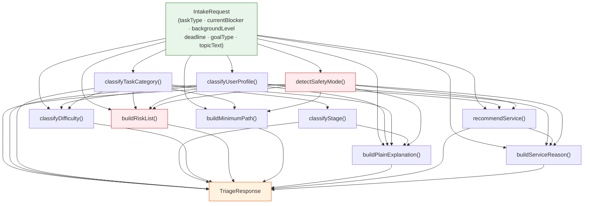
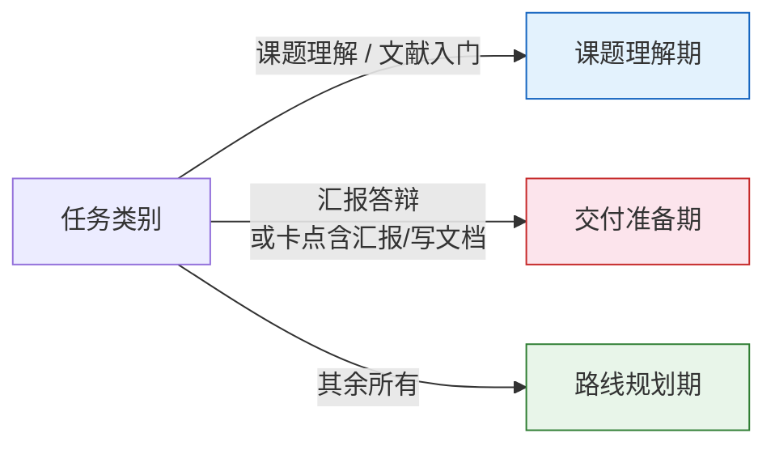
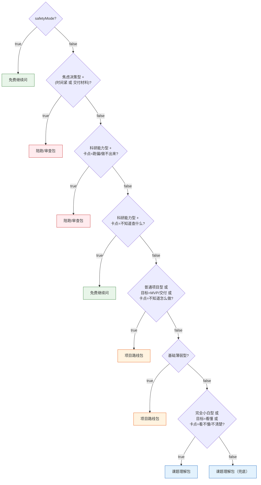

规则分诊引擎是系统中**唯一完全基于规则、不依赖 AI 调用**的核心决策模块。它接收用户在 Intake 表单中提交的结构化输入（任务类型、当前卡点、背景水平、截止时间和课题描述），通过 10 个纯函数依次执行安全检测、用户画像分类、任务类别判定、阶段定位、难度评分、风险构建、最小路径生成、白话解释生成、服务推荐及推荐理由组装，最终输出一个完整的 `TriageResponse` 对象。由于整个引擎无副作用的纯函数组成，它天然适合单元测试与契约覆盖——测试文件中 13 个用例构成了该引擎的行为契约。

Sources: [triage.ts](src/lib/triage.ts#L1-L65), [triage-types.ts](src/lib/triage-types.ts#L1-L108), [triage.test.ts](src/lib/triage.test.ts#L1-L191)

## 架构定位与数据流

分诊引擎在当前架构中是一个**独立模块**，尚未直接接入 `/api/chat` 对话管线。`triage-types.ts` 中定义的类型（`ChatMessage`、`Phase`、`PlanState`、`UserProfileState` 等）被 chat-pipeline、memory、userspace 以及前端页面广泛复用，但 `triageIntake()` 函数本身仅在测试中被调用。这意味着引擎已完成核心逻辑并具备完整测试覆盖，等待后续集成到 intake 入口流程或作为 chat 管线的预处理层。

下面的流程图展示了 `triageIntake()` 内部的 10 步管线结构——每一步都是纯函数，输入来自前序步骤的产出或原始 `IntakeRequest`：

Sources: [triage.ts](src/lib/triage.ts#L30-L65)

## 输入模型：IntakeRequest 与 Zod 校验

`IntakeRequest` 由 6 个字段组成，每个字段都是有限的枚举值集合——只有 `topicText` 是自由文本。类型系统通过 Zod schema 进行运行时校验，要求 `topicText` 至少 30 字、至多 2000 字，确保用户提供了足够的上下文用于判断真实课题状态。

| 字段 | 类型 | 枚举值 | 语义 |
|------|------|--------|------|
| `taskType` | 枚举 | 课程项目 / 毕设 / 大创 / 竞赛 / 导师课题 / 论文阅读 / 组会汇报 / 个人科研探索 | 8 种任务场景 |
| `currentBlocker` | 枚举 | 看不懂题目 / 不知道查什么 / 不知道怎么做 / 不知道能不能做出来 / 不知道怎么写文档 / 不知道怎么汇报 / 老师要求不清楚 / 已经做了但感觉跑偏 | 8 种卡点 |
| `backgroundLevel` | 枚举 | 完全小白 / 有一点基础 / 能看懂基础材料 / 能写代码做 Demo / 能独立读论文或做实验 | 5 级背景梯度 |
| `deadline` | 枚举 | 3 天内 / 1 周内 / 1 个月内 / 更久 | 4 档截止时间 |
| `goalType` | 枚举 | 先看懂课题 / 确定能不能做 / 做出 MVP / 完成交付材料 / 准备汇报或答辩 | 5 种目标 |
| `topicText` | string | 30–2000 字 | 自由文本课题描述 |

Sources: [triage-types.ts](src/lib/triage-types.ts#L1-L95)

## 安全检测：detectSafetyMode()

安全检测是管线的**第一道关卡**，对 `topicText` 执行关键词匹配。引擎维护了两个静态模式列表：

**学术诚信风险模式（`safetyPatterns`）** 包含 12 个关键词：`代写`、`替我写`、`帮我完成论文`、`替做`、`伪造数据`、`捏造数据`、`假数据`、`伪造实验`、`捏造实验`、`规避学术审查`、`绕过查重`、`包过答辩`。只要 `topicText` 包含其中任意一个，`safetyMode` 即被置为 `true`。

**焦虑情绪词汇（`anxietyWords`）** 包含 7 个关键词：`来不及`、`怕`、`焦虑`、`完不成`、`不敢`、`老师会不会`、`会不会挂`。这些词汇不直接触发安全模式，但会在用户画像分类中作为"焦虑决策型"的判定条件之一。

安全模式一旦激活，将产生三重级联效果：
1. **服务推荐降级**：`recommendService()` 直接返回 `"免费继续问"`，阻止向存在学术诚信风险的用户推送付费服务
2. **风险列表强制注入**：`buildRiskList()` 首条插入 `"输入里包含学术诚信风险，必须改成真实可验证的交付路径。"`
3. **最小路径重写**：`buildMinimumPath()` 完全跳过任务类别逻辑，返回一组以"合规交付"为核心的四步引导

Sources: [triage.ts](src/lib/triage.ts#L13-L69)

## 用户画像分类：classifyUserProfile()

用户画像分类器是一个**优先级决策树**，按以下顺序评估条件并返回 5 种画像之一：

| 优先级 | 画像 | 判定条件 |
|--------|------|----------|
| 1（最高） | **焦虑决策型** | 卡点为"不知道能不能做出来"或"已经做了但感觉跑偏"；或截止时间"3 天内"且目标"完成交付材料"；或截止时间非"更久"且 topicText 包含焦虑词汇 |
| 2 | **科研能力型** | 背景水平为"能独立读论文或做实验"；或背景水平为"能写代码做 Demo"且任务类型为"导师课题" |
| 3 | **完全小白型** | 背景水平为"完全小白" |
| 4 | **普通项目型** | 目标为"做出 MVP"/"完成交付材料"/"准备汇报或答辩"；或任务类型属于 {课程项目, 毕设, 大创, 竞赛} |
| 5（兜底） | **基础薄弱型** | 以上条件均不满足 |

关键设计决策在于**焦虑决策型的最高优先级**：一个背景水平为"能独立读论文或做实验"的资深用户，只要表达了跑偏焦虑（"已经做了但感觉跑偏"），系统会将其归类为"焦虑决策型"而非"科研能力型"。这体现了引擎的产品哲学——**情绪状态优先于能力评估**。

Sources: [triage.ts](src/lib/triage.ts#L71-L103)

## 任务分类与阶段定位

### 任务类别：classifyTaskCategory()

任务分类器将用户输入映射到 6 种任务类别，同样按优先级决策：

| 优先级 | 任务类别 | 判定条件 |
|--------|----------|----------|
| 1 | **课题理解** | 卡点为"看不懂题目"/"老师要求不清楚"；或目标为"先看懂课题"/"确定能不能做" |
| 2 | **文献入门** | 卡点为"不知道查什么" |
| 3 | **汇报答辩** | 卡点为"不知道怎么汇报"/"不知道怎么写文档"；或目标为"准备汇报或答辩"；或任务类型为"组会汇报" |
| 4 | **风险审查** | 卡点为"已经做了但感觉跑偏"/"不知道能不能做出来" |
| 5 | **项目Demo** | 目标为"做出 MVP"/"完成交付材料" |
| 6（兜底） | **技术路线** | 以上均不匹配 |

### 阶段定位：classifyStage()

阶段定位是一个简洁的二级映射，将任务类别和卡点映射到 3 个生命周期阶段：

Sources: [triage.ts](src/lib/triage.ts#L105-L159)

## 难度评分：classifyDifficulty()

难度评估采用**加权累加 + 阈值分段**的评分模型。引擎从 4 个维度分别计算贡献值，然后通过总分映射到 4 个难度等级：

| 评分维度 | 权重规则 |
|----------|----------|
| **任务类型权重** | 课程项目=1, 毕设=2, 大创=2, 竞赛=2, 导师课题=3, 论文阅读=1, 组会汇报=1, 个人科研探索=2 |
| **背景水平权重** | 完全小白=+2, 有一点基础=+1, 能看懂基础材料=+1, 能写代码做 Demo=0, 能独立读论文或做实验=**-1** |
| **截止时间加成** | 3 天内=+2, 1 周内=+1, 其他=0 |
| **任务类别加成** | 风险审查=+1, 项目Demo=+1, 其他=0 |
| **画像加成** | 焦虑决策型=+1, 其他=0 |

**阈值分段**：总分 ≤1 → "低"，≤3 → "中"，≤5 → "中高"，>5 → "高"。

一个极端场景的示例：**竞赛 + 完全小白 + 3 天内 + 项目Demo + 焦虑决策型** = 2 + 2 + 2 + 1 + 1 = **8 分 → 难度"高"**。相反，**论文阅读 + 能独立读论文或做实验 + 更久 + 课题理解 + 科研能力型** = 1 + (-1) + 0 + 0 + 0 = **0 分 → 难度"低"**。

Sources: [triage.ts](src/lib/triage.ts#L161-L217)

## 风险构建：buildRiskList()

风险构建器基于输入的多个维度匹配预定义风险模板，通过去重后截断为**最多 3 条**风险提示。这个上限确保用户不会被过载信息淹没。引擎定义了 10 条风险规则，按条件逐一匹配：

| 触发条件 | 风险描述 |
|----------|----------|
| `safetyMode = true` | 输入里包含学术诚信风险，必须改成真实可验证的交付路径 |
| 卡点"看不懂题目"或任务类别"课题理解" | 研究对象、输入数据和输出结果还没有被说清楚，后续所有判断都会漂移 |
| 卡点"不知道查什么"或任务类别"文献入门" | 关键词没有先收敛，容易一上来就被资料量淹没 |
| 目标"做出 MVP"或任务类别"项目Demo" | 一开始就追求完整科研或复杂模型，Demo 很容易做不出来 |
| 任务类型"导师课题"或"毕设" | 老师预期和你当前可交付物如果没对齐，返工成本会很高 |
| 截止时间"3 天内"或"1 周内" | 截止时间偏紧，需要优先压缩目标 |
| 画像"焦虑决策型" | 现在最大的阻碍不是资料不够，而是没有一个可执行的兜底方案 |
| 卡点"已经做了但感觉跑偏" | 现有方案可能已经偏离交付目标，继续堆功能只会增加沉没成本 |
| 卡点"不知道怎么汇报/写文档"或目标"准备汇报或答辩" | 如果没有提前整理成果口径，最后阶段会出现能做出来但讲不清楚的问题 |
| 背景"完全小白"或"有一点基础" | 当前技术路线如果直接上复杂方法，会明显超出你的上手速度 |
| 兜底（风险不足 3 条时补充） | 如果没有先定义最低可交付成果，项目范围会不断膨胀 |

`pushRisk()` 辅助函数确保每条风险唯一不重复，最终 `risks.slice(0, 3)` 硬性截断。

Sources: [triage.ts](src/lib/triage.ts#L219-L282)

## 最小路径与白话解释

### 最小路径：buildMinimumPath()

最小路径生成器始终返回**精确 4 步**可执行动作序列，每一步都以"今天先"开头——这个设计在测试中被显式验证。路径按 `safetyMode` 和 `taskCategory` 的组合分为 7 个分支：

| 分支 | 路径核心思路 |
|------|-------------|
| **安全模式** | 全部围绕"合规交付"：列出真实成果 → 改写为可验证目标 → 保留最小版本 → 准备合规沟通 |
| **课题理解** | 翻译课题 → 拆关键词 → 找基础材料 → 确认模糊要求 |
| **文献入门** | 确定 3 个检索关键词 → 各找 1 篇综述 → 记录高频术语 → 收缩范围 |
| **汇报答辩** | 列出追问 3 问 → 压缩成一页结构 → 补齐证据位 → 口头复述验证 |
| **风险审查** | 写出 5 行方案摘要 → 为每段打可做/存疑/做不了 → 降级为最小可交付 → 准备兜底说法 |
| **项目Demo** | 画最小流程 → 只保留核心场景 → 拆最少模块跑通主链路 → 最后补文档 |
| **技术路线（兜底）** | 确定最低交付物 → 拆三块结构 → 选择匹配基础的方法 → 写本周目标 |

### 白话解释：buildPlainExplanation()

白话解释拼接了两段预设文案——画像前导语（`profileLead`）+ 任务类别前导语（`categoryLead`）。每种画像和任务类别各有一条精心撰写的人话模板，最终格式为：`"{画像前导语} 你目前处在{阶段}，更接近"{任务类别}"问题。{类别前导语}"`。

Sources: [triage.ts](src/lib/triage.ts#L284-L379)

## 服务推荐：recommendService() 与推荐理由

服务推荐是分诊引擎的**商业决策输出点**，将用户路由到 4 种服务等级。推荐逻辑遵循严格的优先级链：

`buildServiceReason()` 为每种推荐生成一段自然语言解释，其逻辑与 [安全边界与伦理](18-mo-hu-dian-bao-lu-die-dai-xiu-zheng-yu-an-quan-bian-jie) 中定义的合规原则保持一致——安全模式下会明确说明"这次不适合直接推高价服务"，将用户引导回免费合规辅导。

Sources: [triage.ts](src/lib/triage.ts#L382-L471)

## 输出模型：TriageResponse

分诊引擎的最终输出 `TriageResponse` 包含 9 个字段，为下游消费方提供完整的决策上下文：

| 字段 | 类型 | 说明 |
|------|------|------|
| `userProfile` | UserProfile（5 种） | 用户画像分类 |
| `taskCategory` | TaskCategory（6 种） | 任务类别 |
| `currentStage` | CurrentStage（3 种） | 生命周期阶段 |
| `difficulty` | DifficultyLevel（4 种） | 难度等级 |
| `riskList` | string[]（最多 3 条） | 风险提示列表 |
| `plainExplanation` | string | 白话解释文本 |
| `minimumPath` | string[]（精确 4 步） | 最小可执行路径 |
| `recommendedService` | RecommendedService（4 种） | 推荐服务等级 |
| `serviceReason` | string | 服务推荐理由 |
| `safetyMode` | boolean | 安全模式开关 |

Sources: [triage-types.ts](src/lib/triage-types.ts#L97-L108)

## 测试契约：13 个用例的行为覆盖

[测试体系：Vitest 契约测试覆盖管线、userspace 与分诊](24-ce-shi-ti-xi-vitest-qi-yue-ce-shi-fu-gai-guan-xian-userspace-yu-fen-zhen) 中对分诊引擎的测试用例构成了该模块的行为契约。以下表格总结了每个测试用例验证的核心规则：

| 测试用例 | 验证的规则 | 关键断言 |
|----------|-----------|----------|
| `changes profile and recommendation when background changes` | 背景水平影响画像与服务推荐 | 完全小白→项目路线包；焦虑→陪跑/审查包 |
| `keeps the first action concrete and executable` | 最小路径首步以"今天先"开头且不含模糊指导 | `toContain("今天先")` + `not.toContain("多查资料")` |
| `switches to safety mode for integrity violations` | 安全模式触发降级 | safetyMode=true, 推荐=免费继续问, riskList 含"学术诚信风险" |
| `routes anxious delivery users to a higher-touch recommendation` | 焦虑+时间紧→高接触服务 | 画像=焦虑决策型, 推荐=陪跑/审查包 |
| `routes complete novice to topic understanding package` | 完全小白+课题理解→课题理解包 | 推荐=课题理解包 |
| `routes weak-background user to route package` | 基础薄弱+大创→项目路线包 | 推荐=项目路线包 |
| `routes capable researcher with literature blocker to free tier` | 科研能力型+文献→免费 | 推荐=免费继续问 |
| `classifies presentation blocker as 汇报答辩 category` | 汇报卡点→汇报答辩类别 | taskCategory=汇报答辩, stage=交付准备期 |
| `maps unclear teacher requirement to topic understanding` | 老师要求不清楚→课题理解 | taskCategory=课题理解 |
| `classifies off-track project as 风险审查` | 跑偏→风险审查 | taskCategory=风险审查, profile=焦虑决策型 |
| `always returns exactly 4 minimum path steps` | 最小路径长度恒为 4 | `toHaveLength(4)` |
| `returns at most 3 risks` | 风险列表上限 3 条 | `length ≤ 3` |
| `rates difficulty high for competition with tight deadline` | 竞赛+紧迫→高难度 | difficulty ∈ {中高, 高} |

Sources: [triage.test.ts](src/lib/triage.test.ts#L1-L191)

## 设计特征与扩展方向

分诊引擎的设计遵循三个核心原则：**纯函数无副作用**、**优先级决策树替代模糊匹配**、**硬性上限防止信息过载**。这些原则使得引擎的行为完全可预测、可测试、可解释。当前引擎作为独立模块存在，[类型系统：UserProfileState、PlanState、CodeFileArtifact 与 FileManifest](19-lei-xing-xi-tong-userprofilestate-planstate-codefileartifact-yu-filemanifest) 中定义的共享类型已经为后续集成铺平了道路。

后续扩展方向可能包括：将 `triageIntake()` 作为 `/api/chat` 路由的预处理步骤，在对话管线启动前先完成结构化分诊；将安全模式检测结果传递给 [阶段式 Prompt 设计：每个阶段的 JSON 输出协议](14-jie-duan-shi-prompt-she-ji-mei-ge-jie-duan-de-json-shu-chu-xie-yi) 中的系统 Prompt，让 AI 也在对话层面遵守合规约束；以及将难度评估结果用于动态调整 AI 的 temperature 和响应深度。