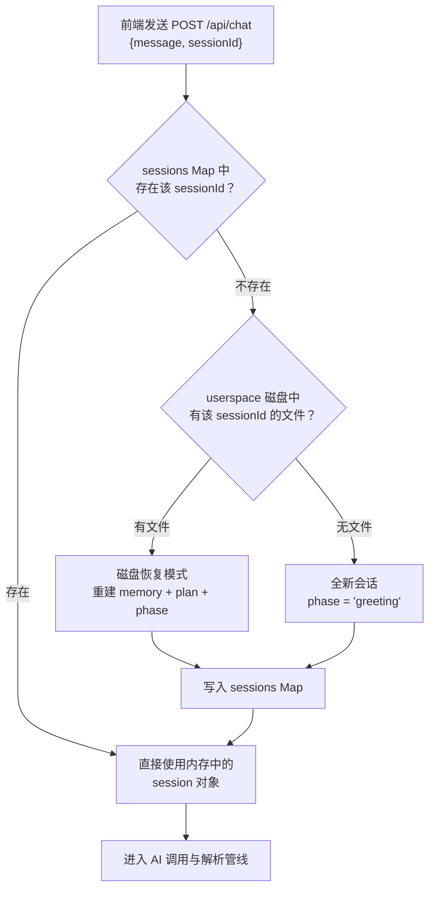
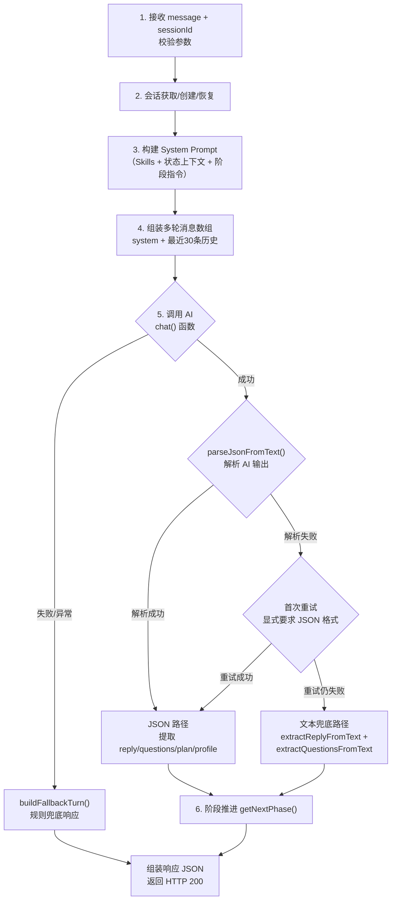

本文档详细解析 `POST /api/chat` 这个**唯一对话入口**的请求/响应协议规范、内部处理管线与阶段推进逻辑。该接口承担了从用户消息接收到 AI 响应返回的完整闭环，是前后端交互的核心枢纽。阅读本文需要先了解 [对话阶段状态机：greeting → profiling → clarifying → planning → reviewing](7-dui-hua-jie-duan-zhuang-tai-ji-greeting-profiling-clarifying-planning-reviewing) 中的阶段定义，以及 [类型系统：UserProfileState、PlanState、CodeFileArtifact 与 FileManifest](19-lei-xing-xi-tong-userprofilestate-planstate-codefileartifact-yu-filemanifest) 中的核心类型。

Sources: [route.ts](src/app/api/chat/route.ts#L70-L80), [triage-types.ts](src/lib/triage-types.ts#L168-L170)

## 请求协议（Request）

前端通过 `fetch("/api/chat", { method: "POST", ... })` 发起请求，请求体为 JSON 格式，包含两个必填字段：

| 字段 | 类型 | 必填 | 说明 |
|------|------|------|------|
| `message` | `string` | ✅ | 用户输入的文本内容，可以是自由文本或从选项按钮点选的文字 |
| `sessionId` | `string` | ✅ | 会话唯一标识（UUID），由前端通过 `crypto.randomUUID()` 生成并持久化在 `sessionStorage` 中 |

```json
{
  "message": "我对AI和机器学习感兴趣",
  "sessionId": "a1b2c3d4-e5f6-7890-abcd-ef1234567890"
}
```

服务端在收到请求后首先进行参数校验——若 `message` 或 `sessionId` 任一缺失，立即返回 HTTP 400 及错误信息 `{ "error": "缺少 message 或 sessionId" }`。`sessionId` 的核心作用有两个：**会话状态寻址**（从内存 `Map` 中定位历史对话、画像与阶段）和 **userspace 文件隔离**（所有 Plan、画像、代码产物均按 `sessionId` 分目录存储）。

Sources: [route.ts](src/app/api/chat/route.ts#L70-L80), [page.tsx](src/app/page.tsx#L85-L89)

## 响应协议（Response）

正常情况下，接口返回 HTTP 200 及如下 JSON 结构。各字段根据对话阶段**有条件出现**，而非每轮全部返回：

| 字段 | 类型 | 出现条件 | 说明 |
|------|------|----------|------|
| `reply` | `string` | **始终返回** | AI 回复文本（Markdown 格式），展示在聊天气泡中 |
| `questions` | `string[]` | AI 提供追问选项时 | 2-4 个可点击选项文本，每个选项是完整句子 |
| `process` | `string` | **始终返回** | 处理过程摘要，展示在气泡顶部的流程面板中 |
| `profile` | `UserProfileState` | 画像有已识别字段时 | 10 字段平铺对象，值为字符串 |
| `profileConfidence` | `Record<string, number>` | 同上 | 各字段的置信度（0.0-1.0），用于前端展示识别状态 |
| `phase` | `Phase` | **始终返回** | 当前阶段名，阶段转换后返回新阶段 |
| `plan` | `PlanState` | Plan 生成或更新时 | 完整 Plan 对象，含步骤、风险、选项等 |
| `_fallback` | `boolean` | AI 调用失败时 | 标识本轮为规则兜底响应（仅供前端调试） |

**典型响应示例（profiling 阶段）**：

```json
{
  "reply": "你对AI方向感兴趣，这很好。让我再了解一下你的基础情况。",
  "questions": [
    "我完全没接触过，从零开始",
    "我了解一些基础概念",
    "我有一定实践经验",
    "我不太理解这些，帮我找方向"
  ],
  "process": "- 阶段：画像识别 -> 画像识别\n- 画像：已识别 3/10 个字段，可靠字段 1/10 个\n- 模式：AI 生成\n- 处理：从用户回复中提取画像字段和当前卡点\n- 下一步：等待用户在 4 个选项中确认",
  "profile": { "interestArea": "AI和机器学习", "...": "..." },
  "profileConfidence": { "interestArea": 1.0, "...": "..." },
  "phase": "profiling"
}
```

**Plan 生成后的响应**则不包含 `questions`，而是携带完整 `plan` 对象，`reply` 被替换为简短的提示文本（如 `"✅ Plan 已生成，可在右侧面板查看详情。"`），避免在聊天气泡中重复展示 Plan 内容。

Sources: [route.ts](src/app/api/chat/route.ts#L462-L487), [route.ts](src/app/api/chat/route.ts#L419-L424)

## 会话生命周期：创建、恢复与状态结构

服务端使用内存 `Map` 管理所有活跃会话，每个会话维护三个核心状态：



**全新会话**初始化为 `{ messages: [], memory: createEmptyProfile(), phase: "greeting" }`，等待用户的第一条消息触发开场引导。**磁盘恢复模式**适用于服务重启后用户重新连接的场景——系统从 userspace 目录读取 `profile.md` 和最新 Plan 文件，通过正则解析 Markdown 重建 `memory` 字段与置信度，并根据恢复结果决定阶段：有 Plan 恢复则进入 `reviewing`，画像就绪无 Plan 则进入 `clarifying`，画像未齐则进入 `profiling`。

Sources: [route.ts](src/app/api/chat/route.ts#L83-L155), [chat-pipeline.ts](src/lib/chat-pipeline.ts#L486-L506)

## 内部处理管线：从消息接收到响应组装

单次 POST 请求的处理管线可拆解为六个步骤。以下流程图展示了正常路径与所有分支：



**步骤 3** 中 System Prompt 的构建逻辑为：`Skills 体系文本 + 当前状态上下文（阶段、画像字段、Plan 信息）+ 阶段专属指令 + JSON 输出格式约束`，四段拼接形成完整的系统提示词。**步骤 5** 的 AI 调用使用 `temperature=0.4`、`maxTokens=4096`，通过 [OpenAI 兼容接口与多 Provider 环境变量配置](13-openai-jian-rong-jie-kou-yu-duo-provider-huan-jing-bian-liang-pei-zhi) 中描述的通用客户端发出。

Sources: [route.ts](src/app/api/chat/route.ts#L172-L192), [chat-prompts.ts](src/lib/chat-prompts.ts#L23-L40), [ai-provider.ts](src/lib/ai-provider.ts#L52-L116)

## 阶段推进逻辑（getNextPhase）

阶段推进是本接口最核心的状态流转控制，由 `getNextPhase()` 函数实现。该函数接收四个输入——当前阶段、画像内存、本轮是否产生了 Plan、前置检查清单是否通过——返回下一个阶段：

| 当前阶段 | 推进条件 | 下一阶段 |
|----------|----------|----------|
| `greeting` | 无条件 | `profiling` |
| `profiling` | `isProfileReady(memory)` === true（≥6 字段置信度 ≥ 0.7） | `clarifying` |
| `profiling` | 画像未就绪 | `profiling`（停留） |
| `clarifying` | 本轮产生了 `planState` | `reviewing` |
| `clarifying` | `checklistPassed` === true 但未产生 Plan | `planning` |
| `clarifying` | 检查清单未通过 | `clarifying`（停留） |
| `planning` | 本轮产生了 `planState` | `reviewing` |
| `planning` | 未产生 Plan | `planning`（停留） |
| `reviewing` | 无条件 | `reviewing`（停留，循环调整） |

**关键设计**在于 `clarifying → planning` 的自动升级：当 clarifying 阶段的 AI 输出中 `checklistPassed=true` 但未直接包含 Plan 数据时，服务端会**自动发起第二次 AI 调用**，使用 `planning` 阶段的指令重新生成 Plan，实现无缝的阶段跨越。这意味着单次 HTTP 请求可能触发两次 AI 调用（clarifying 主调用 + planning 追加调用），这是性能与体验之间的有意识权衡。

Sources: [chat-pipeline.ts](src/lib/chat-pipeline.ts#L629-L647), [route.ts](src/app/api/chat/route.ts#L334-L378)

## AI 输出解析与双路径策略

AI 返回的文本需要经过解析才能转换为结构化响应。系统采用**JSON 优先 + 文本兜底**的双路径策略：

**JSON 路径**：`parseJsonFromText()` 依次尝试五种提取方式——直接 `JSON.parse` → 提取 Markdown 代码块 → 括号平衡候选提取 → 首尾花括号截取 → 深度补齐截取。只有通过 `isProtocolJson()` 校验（包含 `reply`/`questions`/`profileUpdates`/`checklistPassed`/`plan`/`codeFiles` 中至少一个键）的 JSON 才被接受。解析成功后从 JSON 中提取 `reply`、`questions`（经 `normalizeQuestions` 扁平化去重）、`profileUpdates`（逐条更新画像）、`plan`（经 `extractPlanFromParsed` 多命名兼容提取）、`codeFiles` 等字段。

**文本兜底路径**：当两次 AI 调用（首次 + JSON 重试）均无法解析出有效 JSON 时触发。`safeReplyFromUnparsedAiText()` 根据阶段判断是否为协议泄漏（planning/reviewing/clarifying 阶段检测到 JSON 痕迹则替换为安全提示），`extractQuestionsFromText()` 从 Markdown 格式的编号/项目符号列表中提取选项，`parsePlanFromMarkdown()` 在 Plan 相关阶段尝试从 Markdown 结构化标题中提取 Plan 数据。

Sources: [chat-pipeline.ts](src/lib/chat-pipeline.ts#L6-L48), [chat-pipeline.ts](src/lib/chat-pipeline.ts#L164-L177), [route.ts](src/app/api/chat/route.ts#L238-L416)

## 规则兜底（Fallback）机制

当 AI 调用本身失败（网络异常、API Key 缺失、模型服务不可用等）时，系统通过 `buildFallbackTurn()` 生成**纯规则驱动的兜底响应**，确保对话流程不中断。兜底逻辑根据当前阶段和状态选择不同的预设回复与选项：

| 场景 | 兜底 reply | 兜底 questions |
|------|-----------|----------------|
| greeting 阶段 | "当前 AI 服务暂时不可用，我先用规则模式帮你进入科研分诊流程。" | 4 个兴趣方向选项 |
| 画像未就绪 | "需要先补齐几个关键画像字段" | 4 个经验层级选项 |
| 画像就绪但无 Plan | "画像已基本明确，但生成 Plan 前还需要确认目标范围" | 4 个目标收敛选项 |
| 已有 Plan | "已有 Plan 已保留在右侧面板和文件列表中" | 4 个调整意图选项 |

兜底响应通过 `_fallback: true` 字段标记，前端可据此展示降级提示。在兜底路径中，greeting 阶段仍会推进到 profiling，保持状态机的向前运动。

Sources: [chat-pipeline.ts](src/lib/chat-pipeline.ts#L518-L568), [route.ts](src/app/api/chat/route.ts#L192-L237)

## 处理过程摘要（process 字段）

每个响应都包含 `process` 字段，由 `buildProcessSummary()` 生成，提供本轮处理的透明化摘要。其内容由多行键值对组成，包含以下信息维度：

- **阶段变迁**：`阶段：画像识别 -> 问题收敛`，标识推进方向
- **画像进度**：`画像：已识别 3/10 个字段，可靠字段 1/10 个`
- **处理模式**：`模式：AI 生成` 或 `模式：规则兜底`
- **本轮产物**：生成 Plan 时标注版本号和同步更新的文档类型
- **前置检查状态**：clarifying 阶段展示清单通过与否
- **下一步等待**：等待用户在 N 个选项中确认，或可在 Plan 面板继续调整

该摘要展示在聊天气泡顶部的 `ProcessPanel` 组件中，为用户提供系统行为的可观测性。

Sources: [chat-pipeline.ts](src/lib/chat-pipeline.ts#L581-L627), [chat-panel.tsx](src/components/chat-panel.tsx#L68-L70)

## Plan 产物的自动持久化

当 AI 输出中包含有效 Plan 数据时，`persistPlanArtifacts()` 会同步将 Plan 写入 userspace 文件系统，生成以下文件集：

| 文件 | 类型标记 | 内容 |
|------|----------|------|
| `plan-v{N}.md` | `plan` | 完整 Plan Markdown（画像、判断、逻辑、路径、步骤、风险、选项） |
| `summary.md` | `summary` | 一句话判断 + 推荐路线 + 关键边界 + 下一步 |
| `action-checklist.md` | `checklist` | 可勾选的行动步骤清单 + 风险复核清单 |
| `research-path.md` | `path` | 起点、路径、原因、分阶段执行说明 |
| `code-v{N}-{filename}` | `code` | 每个代码文件的完整源码 |

每次 Plan 更新（无论是首次生成还是 reviewing 阶段的修改）都会以**新版本号**写入，旧的 Plan 文件保留在 userspace 中供历史对比。代码文件的文件名经过 `sanitizeCodeFilename()` 处理，确保不含特殊字符和路径穿越风险。

Sources: [chat-pipeline.ts](src/lib/chat-pipeline.ts#L472-L484), [chat-pipeline.ts](src/lib/chat-pipeline.ts#L335-L348)

## 错误处理与 HTTP 状态码

| 状态码 | 触发条件 | 响应体 |
|--------|----------|--------|
| `200` | 正常处理（含 AI 调用成功和规则兜底） | 完整响应 JSON |
| `400` | `message` 或 `sessionId` 缺失 | `{ "error": "缺少 message 或 sessionId" }` |
| `500` | 请求体 JSON 解析失败或其他未捕获异常 | `{ "error": "错误描述" }` |

值得注意的是，**AI 调用失败不会导致 HTTP 5xx**——它会被捕获并降级为规则兜底的 200 响应，附带 `_fallback: true` 标记。这意味着前端只需处理 400 和 500 两种错误状态码，其余情况均可按正常响应解析。

Sources: [route.ts](src/app/api/chat/route.ts#L488-L494), [route.ts](src/app/api/chat/route.ts#L75-L80)

## 延伸阅读

- [对话阶段状态机：greeting → profiling → clarifying → planning → reviewing](7-dui-hua-jie-duan-zhuang-tai-ji-greeting-profiling-clarifying-planning-reviewing) — 五个阶段的完整定义与转换条件
- [AI 输出解析：JSON 提取、协议识别与 Markdown 兜底](9-ai-shu-chu-jie-xi-json-ti-qu-xie-yi-shi-bie-yu-markdown-dou-di) — `parseJsonFromText` 的详细解析算法
- [阶段式 Prompt 设计：每个阶段的 JSON 输出协议](14-jie-duan-shi-prompt-she-ji-mei-ge-jie-duan-de-json-shu-chu-xie-yi) — 各阶段 System Prompt 与 JSON Schema 定义
- [前端状态管理：sessionStorage 持久化与撤销机制](8-qian-duan-zhuang-tai-guan-li-sessionstorage-chi-jiu-hua-yu-che-xiao-ji-zhi) — 前端如何消费本接口的响应并管理会话状态
- [GET /api/userspace：文件清单、文档预览与系统打开](23-get-api-userspace-wen-jian-qing-dan-wen-dang-yu-lan-yu-xi-tong-da-kai) — Plan 产物持久化后的文件访问接口