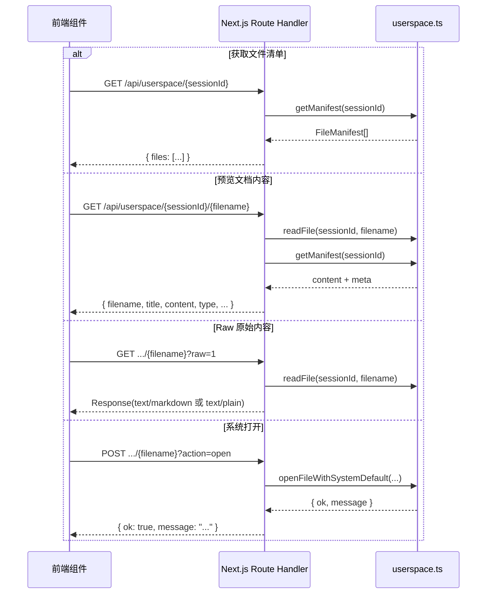
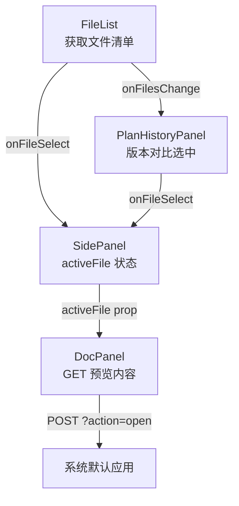

`/api/userspace` 是前端访问 **会话文件系统** 的唯一 HTTP 入口，承载三项职责：**列出文件清单**、**读取文档内容用于预览**、**触发系统默认应用打开文件**。它采用 Next.js 的 catch-all 动态路由 `[sessionId]/[[...filename]]` 设计，将三种语义映射到同一个路由文件中——GET 无文件名返回清单，GET 带文件名返回内容，POST 带文件名执行系统打开。这种"一个入口、多个动作"的模式，使前端只需要拼 URL 就能完成全部文件操作，无需额外的 action 参数区分。

Sources: [route.ts](src/app/api/userspace/[sessionId]/[[...filename]]/route.ts#L1-L86)

## 路由结构与 URL 规约

路由文件位于 `src/app/api/userspace/[sessionId]/[[...filename]]/route.ts`，利用了 Next.js App Router 的 **可选 catch-all 参数** `[[...filename]]`，使得 `filename` 部分可以缺失也可以是单层路径。下表列出了三种 URL 模式及其对应的语义：

| URL 模式 | HTTP 方法 | 语义 | 关键参数 |
|---|---|---|---|
| `/api/userspace/{sessionId}` | GET | 返回该会话的完整文件清单 | — |
| `/api/userspace/{sessionId}/{filename}` | GET | 返回文件元数据 + 内容（JSON） | `?raw=1` 跳过 JSON 包装 |
| `/api/userspace/{sessionId}/{filename}?action=open` | POST | 调用系统默认应用打开文件 | — |

**参数解析流程**如下——Next.js 将 URL 中的动态片段通过 `params` 传入 handler，`sessionId` 为必选段，`filename` 为可选的路径数组（通过 `join("/")` 拼接为单层文件名）：



Sources: [route.ts](src/app/api/userspace/[sessionId]/[[...filename]]/route.ts#L8-L55)

## GET 模式一：文件清单

当请求 URL 中不包含 `filename` 时，路由直接调用 `getManifest(sessionId)` 并以 `{ files: FileManifest[] }` 返回。**FileManifest** 是整个文件系统的元数据核心，其类型定义如下：

```typescript
type FileManifest = {
  filename: string;       // 如 "plan-v1.md"、"code-v1-demo.py"
  title: string;          // 展示标题，如 "科研探索计划 v1"
  type: "profile" | "plan" | "checklist" | "path" | "summary" | "image" | "code";
  version: number;        // 版本号
  createdAt: string;      // ISO 8601 时间戳
  language?: string;      // 仅 code 类型携带，如 "python"
};
```

`getManifest` 在读取磁盘上的 `manifest.json` 后会执行一道 **失效过滤**——逐一检查清单中每个条目的文件是否真实存在，将已丢失的条目移除。这意味着即使上一次会话异常退出导致文件残缺，前端拿到的清单永远只包含可访问的文件。前端 `FileList` 组件在挂载或 `refreshTrigger` 变更时调用此接口，拿到清单后渲染为带图标的文件列表（`👤` 画像、`📋` Plan、`✅` 行动清单、`🗺` 科研路径、`📄` 摘要、`💻` 代码）。

Sources: [userspace.ts (getManifest)](src/lib/userspace.ts#L113-L128), [triage-types.ts (FileManifest)](src/lib/triage-types.ts#L159-L166), [file-list.tsx](src/components/file-list.tsx#L27-L44)

## GET 模式二：文档预览

当 URL 中包含 `filename` 时，路由同时调用 `readFile` 和 `getManifest`，将文件内容和元数据合并为一个完整的 JSON 对象返回：

```json
{
  "filename": "plan-v2.md",
  "title": "科研探索计划 v2",
  "content": "# 科研探索计划\n...",
  "type": "plan",
  "version": 2,
  "language": null,
  "createdAt": "2025-01-15T10:30:00.000Z"
}
```

这里有一个关键的 **内容类型双模**：当请求携带 `?raw=1` 查询参数时，路由跳过 JSON 包装，直接返回原始文本内容，并根据 manifest 中的 `type` 字段选择 Content-Type——`code` 类型使用 `text/plain`，其余使用 `text/markdown`。前端 `DocPanel` 组件在预览模式下使用 JSON 模式（将 markdown 通过 `marked.parse()` 渲染为 HTML），在"打开"和"下载"操作中使用 `?raw=1` 的 URL：

| 操作 | URL 用法 | 行为 |
|---|---|---|
| 站内预览 | `GET .../{filename}` | JSON → `marked.parse()` 渲染 Markdown |
| 新标签页打开 | `GET .../{filename}?raw=1`（target=_blank） | 浏览器原生渲染 Markdown 纯文本 |
| 下载文件 | `GET .../{filename}?raw=1`（download 属性） | 浏览器触发下载 |
| 系统默认应用 | `POST .../{filename}?action=open` | 服务端 `spawn` 调用系统命令 |

对于代码类文件，`DocPanel` 会切换到 `<pre><code>` 原样展示模式，不再走 Markdown 渲染路径，并在标题下方显示语言标签。

Sources: [route.ts (GET with filename)](src/app/api/userspace/[sessionId]/[[...filename]]/route.ts#L21-L54), [doc-panel.tsx](src/components/doc-panel.tsx#L26-L135)

## POST 模式：系统默认应用打开

`POST /api/userspace/{sessionId}/{filename}?action=open` 是本接口中**唯一涉及操作系统级调用**的动作。它委托给 `openFileWithSystemDefault` 函数，该函数根据运行平台选择不同的打开命令：

| 平台 | 执行命令 | 说明 |
|---|---|---|
| Windows (`win32`) | `cmd.exe /c start "" {fullPath}` | 使用 Windows 文件关联机制 |
| macOS (`darwin`) | `open {fullPath}` | macOS 原生 `open` 命令 |
| WSL (Linux + WSL_DISTRO_NAME) | `wslpath -w` → `cmd.exe /c start` | 先转换为 Windows 路径再打开 |
| 其他 Linux | `xdg-open {fullPath}` | XDG 桌面标准 |

所有平台调用均使用 `spawn` + `detached: true` + `unref()`，确保子进程与 Node.js 进程完全解耦——即使文件编辑器持续运行，也不会阻塞 Next.js 请求处理。打开操作被设计为 **best-effort**：`child.on("error", () => {})` 静默吞掉启动错误，服务端仅返回 `{ ok: true, message: "Opened with system default app" }` 或 `{ ok: false, message: "..." }`。前端在请求失败时弹窗提示用户改用"打开"或"下载"按钮。

Sources: [userspace.ts (openFileWithSystemDefault)](src/lib/userspace.ts#L74-L110), [route.ts (POST handler)](src/app/api/userspace/[sessionId]/[[...filename]]/route.ts#L57-L85), [doc-panel.tsx (openWithSystemDefault)](src/components/doc-panel.tsx#L87-L97)

## 安全校验机制

所有文件操作在抵达磁盘 I/O 之前，都必须经过 `assertSafeSegment` 校验。该校验使用正则 `/^[a-zA-Z0-9_.-]+$/` 拒绝任何包含特殊字符的路径段，并额外拦截 `..` 防止路径遍历。随后 `filePath` 函数还会执行 **resolved path 前缀校验**——将拼接后的路径 `path.resolve()` 后检查是否以会话根目录开头，形成双重防护：

```
sessionId 校验 → filename 正则校验 → path.resolve 前缀校验 → 磁盘 I/O
```

测试用例验证了以下非法输入均被拒绝：`../escape`（目录穿越 sessionId）、`../escape.md`（目录穿越 filename）、`nested/escape.md`（子路径，正则拒绝 `/`）、`semi;colon.md`（分号等特殊字符）。

Sources: [userspace.ts (assertSafeSegment + filePath)](src/lib/userspace.ts#L8-L30), [userspace.test.ts](src/lib/userspace.test.ts#L24-L29)

## 前端组件协作

前端侧的三个组件围绕此 API 构成了 **清单 → 选中 → 预览** 的单向数据流：



`SidePanel` 维护 `activeFile` 状态作为桥梁——`FileList` 和 `PlanHistoryPanel` 都通过 `onFileSelect` 回调设置 `activeFile`，而 `DocPanel` 接收 `activeFile` 作为 prop 触发内容加载。`FileList` 还通过 `onFilesChange` 将清单数据向上传递，使 `PlanHistoryPanel` 无需重复请求清单即可过滤出 plan 类型文件进行版本对比。

Sources: [side-panel.tsx](src/components/side-panel.tsx#L106-L126), [file-list.tsx](src/components/file-list.tsx#L23-L76), [doc-panel.tsx](src/components/doc-panel.tsx#L21-L135), [plan-history-panel.tsx](src/components/plan-history-panel.tsx#L58-L74)

## 错误处理与边界情况

| 场景 | HTTP 状态码 | 响应体 |
|---|---|---|
| `sessionId` 缺失 | 400 | `{ error: "Missing sessionId" }` |
| 文件不存在 | 404 | `{ error: "File not found" }` |
| 路径段含非法字符 | 400 | `{ error: "Invalid sessionId" 或 "Invalid filename" }` |
| 系统打开失败 | 404 或 500 | `{ error: 具体错误信息 }` |
| POST 缺少 filename | 400 | `{ error: "Missing sessionId or filename" }` |
| POST action 非 open | 400 | `{ error: "Unsupported action" }` |
| 清单为空或 manifest.json 解析失败 | 200 | `{ files: [] }`（静默返回空清单） |

值得注意的设计细节：**清单接口永远不会报错**。`getManifest` 在 `manifest.json` 不存在或 JSON 解析失败时均返回空数组，前端只需处理空状态展示即可。这保证了首次进入会话时 `FileList` 组件能正常渲染"AI 生成的文档将出现在这里"的提示文案。

Sources: [route.ts (error handling)](src/app/api/userspace/[sessionId]/[[...filename]]/route.ts#L16-L54), [userspace.ts (getManifest fallback)](src/lib/userspace.ts#L113-L128), [file-list.tsx (empty state)](src/components/file-list.tsx#L46-L53)

## 与其他模块的关系

此接口的"读端"与 **对话管线** 的"写端"形成闭环。`chat-pipeline` 在推进到 planning / reviewing 阶段时，通过 `savePlan`、`saveMarkdownDocument`、`saveCodeFile`、`saveProfile` 等函数将 AI 产物写入 userspace 文件系统并更新 `manifest.json`，而本接口负责将这些产物以清单和内容两种形式呈现给前端。更底层的路径安全校验和文件 I/O 机制详见 [userspace 文件系统：会话隔离、路径安全校验与文件清单管理](20-userspace-wen-jian-xi-tong-hui-hua-ge-chi-lu-jing-an-quan-xiao-yan-yu-wen-jian-qing-dan-guan-li)；文件产物的类型体系和版本策略详见 [类型系统：UserProfileState、PlanState、CodeFileArtifact 与 FileManifest](19-lei-xing-xi-tong-userprofilestate-planstate-codefileartifact-yu-filemanifest)；此接口的契约测试覆盖详见 [测试体系：Vitest 契约测试覆盖管线、userspace 与分诊](24-ce-shi-ti-xi-vitest-qi-yue-ce-shi-fu-gai-guan-xian-userspace-yu-fen-zhen)。