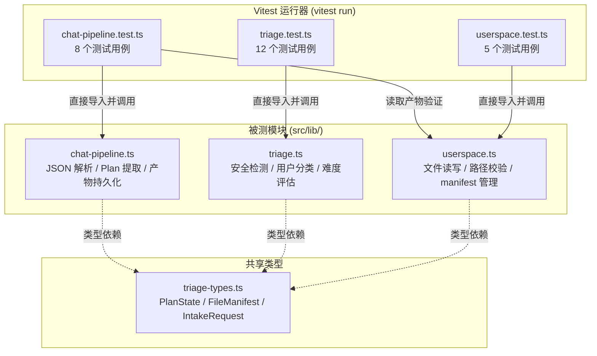
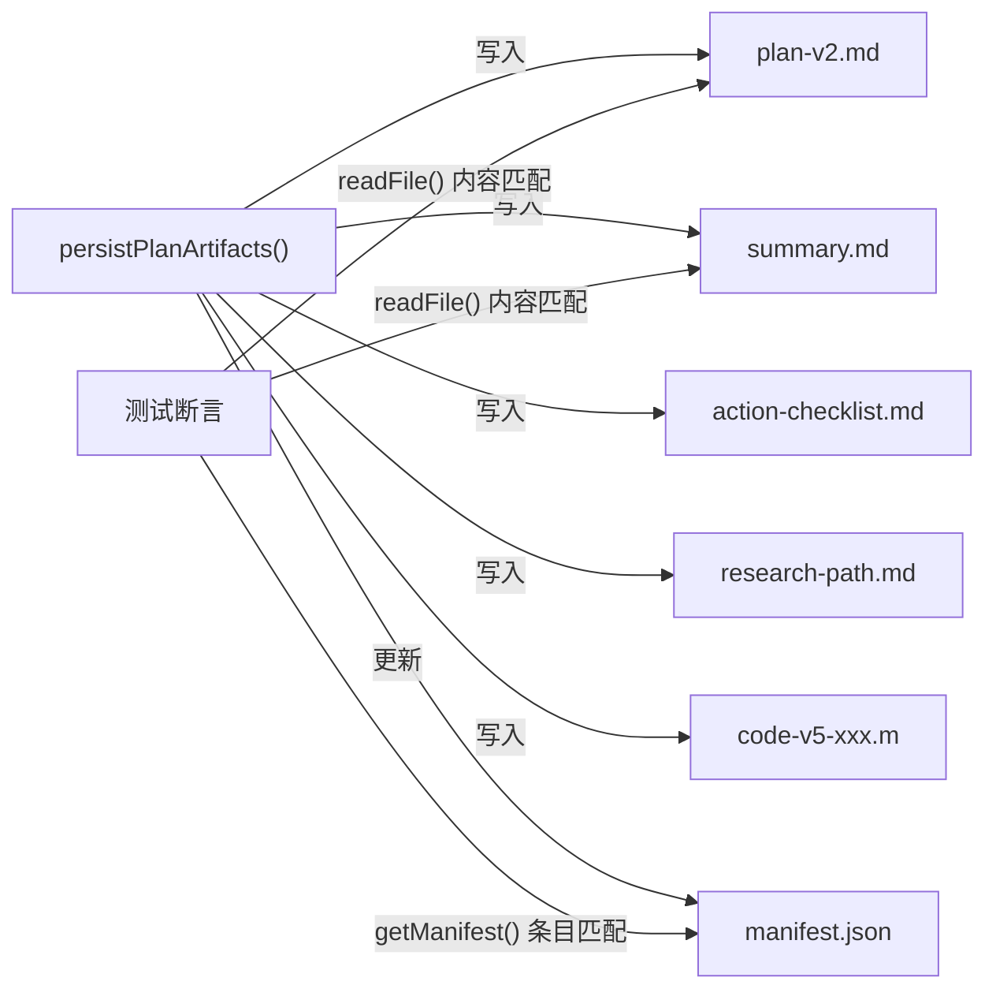
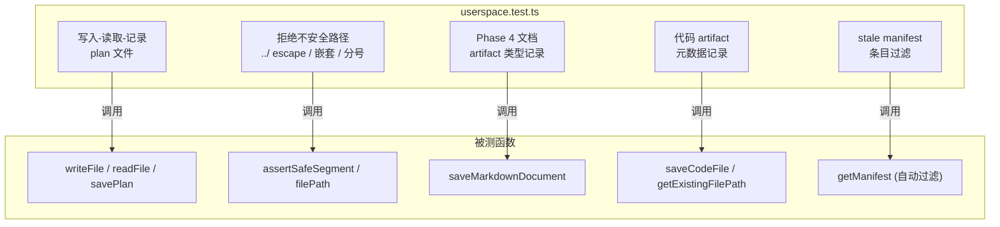

本项目采用 **Vitest 4.x** 作为测试运行器，以"契约测试"为核心策略，对三个关键后端模块实施纯函数级别的输入-输出断言。整个测试套件 **零外部依赖、零 AI 调用、零 mock 注入**——每个测试用例都直接构造已知输入、断言确定性输出，确保核心业务规则在任何环境下都能被一致地验证。当前共包含 **3 个测试文件、25 个测试用例**，覆盖对话管线解析、规则分诊引擎和用户文件系统三大子系统。

Sources: [package.json](package.json#L10-L10), [chat-pipeline.test.ts](src/lib/chat-pipeline.test.ts#L1-L195), [triage.test.ts](src/lib/triage.test.ts#L1-L190), [userspace.test.ts](src/lib/userspace.test.ts#L1-L90)

## 测试架构总览



**运行方式**：`npm test` 即触发 `vitest run`，单次执行、CI 友好，无需启动 Next.js 开发服务器。项目未单独配置 `vitest.config.ts`，Vitest 自动发现 `src/lib/` 下所有 `.test.ts` 文件。测试中不依赖任何数据库、网络请求或 AI 服务——全部基于内存文件系统（通过 `process.cwd()/userspace/` 临时目录）完成端到端验证。

Sources: [package.json](package.json#L9-L10), [tsconfig.json](tsconfig.json#L26-L31)

## 契约测试设计理念

本项目的测试策略选择了 **"契约测试"（Contract Testing）** 而非单元测试或集成测试。这里的"契约"指的是：**模块导出函数对特定输入形状必须产出特定输出形状的承诺**。每个测试用例本质上是一份输入-输出契约文档，当实现代码发生重构时，只要契约仍然满足，测试就不会中断。

这套策略的设计动机来自三个工程约束：

| 约束 | 契约测试的应对方式 |
|------|-------------------|
| AI 输出不可预测 | 测试只覆盖解析层，验证对"已知畸形输出"的鲁棒处理，不测 AI 本身 |
| 文件系统状态不确定 | 每个用例用 `Date.now()` 生成隔离的 sessionId，确保测试间无状态污染 |
| 业务规则频繁迭代 | 分诊规则以纯函数表达，测试直接断言分类结果，规则变更时同步更新断言 |

**核心原则**：被测函数必须是 **纯函数或具有可预测副作用**（如文件写入后可立即读回验证），测试不使用 `vi.mock()`、`vi.fn()` 或任何模拟机制。

Sources: [chat-pipeline.test.ts](src/lib/chat-pipeline.test.ts#L1-L11), [triage.test.ts](src/lib/triage.test.ts#L1-L5), [userspace.test.ts](src/lib/userspace.test.ts#L1-L4)

## 对话管线测试（chat-pipeline）

对话管线测试套件 `chat-pipeline.test.ts` 是三个测试文件中覆盖面最广的，它验证了 AI 原始文本到结构化数据之间的所有解析契约。测试分为六个逻辑分组，覆盖了从 JSON 提取到产物持久化的完整链路。

### JSON 解析契约

AI 模型的原始输出可能包裹在 Markdown 代码围栏、前后缀说明文本、甚至"协议泄漏"的前导文本中。`parseJsonFromText` 函数需要在这些场景下可靠地提取出结构化 JSON。测试断言了三种典型场景：

```mermaid
flowchart LR
    subgraph "AI 原始输出"
        A1["```json\n{...}\n```"]
        A2["说明文本 {...} 后缀"]
        A3["协议泄漏前导\n{...}"]
    end

    subgraph "解析契约"
        B["parseJsonFromText()"]
    end

    subgraph "断言"
        C1["匹配 {reply:'ok'}"]
        C2["匹配完整对象"]
        C3["匹配含 plan 的对象"]
    end

    A1 -- "代码围栏" --> B
    A2 -- "混合文本" --> B
    A3 -- "协议泄漏" --> B
    B --> C1
    B --> C2
    B --> C3
```

- **代码围栏提取**：`parseJsonFromText('```json\n{"reply":"ok"}\n```')` 必须返回 `{reply: "ok"}`
- **混合文本提取**：前缀说明 + JSON + 后缀说明的场景也能正确提取
- **协议泄漏容错**：当 AI 输出包含"阶段：Plan 调整 → Plan 调整"等内部处理过程前导文本时，仍能从后部正确提取包含 `plan` 字段的 JSON 对象

Sources: [chat-pipeline.test.ts](src/lib/chat-pipeline.test.ts#L15-L36), [chat-pipeline.ts](src/lib/chat-pipeline.ts#L6-L37)

### 安全回复契约

当 AI 在计划阶段返回了原始协议 JSON（而非用户可读的对话文本），`safeReplyFromUnparsedAiText` 必须拦截这类"协议泄漏"，返回一条兜底的中文提示，而非将原始 JSON 暴露给用户。测试断言了两个条件：返回文本 **不含 `{` 字符** 且 **包含"格式解析失败"关键词**。

Sources: [chat-pipeline.test.ts](src/lib/chat-pipeline.test.ts#L38-L43), [chat-pipeline.ts](src/lib/chat-pipeline.ts#L170-L177)

### 问题标准化契约

AI 生成的问题列表可能包含内嵌的 A/B/C 选项（如"你对 MATLAB 的熟悉程度：A.熟练；B.了解；C.未用过"）。`normalizeQuestions` 函数负责将这类"一问多答"拆分成独立可点击的事实选项，并去除只有问题主干但没有具体内容的冗余条目。测试覆盖两个场景：

| 输入模式 | 标准化行为 | 断言 |
|----------|-----------|------|
| 单条含 A/B/C 子选项的问题 | 拆分为 3 条独立选项，每条保留问题主干 | 返回数组长度 = 3，每条以问题主干开头 |
| 主干问题 + 具体子问题并存 | 去除纯主干问题，只保留具体子问题 | 返回数组不含"接下来你想要明确的问题？" |

Sources: [chat-pipeline.test.ts](src/lib/chat-pipeline.test.ts#L45-L68), [chat-pipeline.ts](src/lib/chat-pipeline.ts#L106-L162)

### Plan 字段映射契约

AI 返回的 JSON 可能使用下划线命名（`user_profile`、`problem_judgment`）或混合的对象形式步骤（`{step: "...", time: "..."}`）。`extractPlanFromParsed` 需要将这些异构输入统一映射为 camelCase 的 `PlanState` 结构。测试断言了：

- `user_profile` → `userProfile`、`problem_judgment` → `problemJudgment` 等字段映射
- 对象形式步骤 `{step: "确定最小问题", time: "今天"}` 被展平为字符串 `"确定最小问题（今天）"`
- 风险对象 `{risk: "范围过大"}` 被提取为纯字符串 `"范围过大"`
- 版本号正确传递到 `PlanState.version`

Sources: [chat-pipeline.test.ts](src/lib/chat-pipeline.test.ts#L70-L91), [chat-pipeline.ts](src/lib/chat-pipeline.ts#L266-L305)

### 代码文件提取契约

在 planning 阶段，AI 可能在 JSON 中附带 `codeFiles` 数组。`extractCodeFilesFromParsed` 需要处理文件名清理（空格转连字符、移除 `..` 等危险路径段）和语言到扩展名的映射。测试覆盖了：

- 正常文件名 `"planar 2r forward"` + `"matlab"` → `"code-v4-planar-2r-forward.m"`
- 恶意路径 `"../unsafe.py"` 被清理为 `"code-v4-unsafe.py"`（去除路径遍历）
- 支持 `code` 和 `content` 两种字段名获取代码内容
- `version` 正确附加到 `CodeFileArtifact` 对象

Sources: [chat-pipeline.test.ts](src/lib/chat-pipeline.test.ts#L123-L156), [chat-pipeline.ts](src/lib/chat-pipeline.ts#L307-L397)

### 产物持久化端到端契约

`persistPlanArtifacts` 是管线中唯一产生文件系统副作用的函数。测试通过"写入 → 读回 → 验证 manifest"的三步模式，断言以下契约：

1. **四份文档全部生成**：`plan-v{n}.md`、`summary.md`、`action-checklist.md`、`research-path.md`
2. **内容模板正确**：`plan-v2.md` 包含 `"# 科研探索计划 v2"` 标题，`action-checklist.md` 包含 `- [ ] 1.` 格式的待办项
3. **Manifest 条目完整**：每份文件都有对应的 `FileManifest` 条目，包含正确的 `type`、`version`、`filename`
4. **代码产物共存**：传入 `CodeFileArtifact[]` 时，代码文件与 Plan 文档一起持久化到同一 session 目录



Sources: [chat-pipeline.test.ts](src/lib/chat-pipeline.test.ts#L93-L194), [chat-pipeline.ts](src/lib/chat-pipeline.ts#L399-L484)

## 规则分诊引擎测试（triage）

分诊引擎 `triage.ts` 是一个纯规则驱动的分类器——不涉及 AI 调用，完全基于输入字段的枚举组合来决定用户画像、任务类别、推荐服务等。这使得它成为契约测试的理想候选：每个测试用例代表一条明确的"输入组合 → 分类结果"业务规则。

### 测试用例与业务规则对照表

| 测试用例 | 输入组合 | 断言的分类结果 |
|---------|---------|---------------|
| 背景不同→画像不同 | 小白 vs 能读论文 | `完全小白型` → `项目路线包`；`焦虑决策型` → `陪跑/审查包` |
| 第一步可执行 | 小白 + "不知道怎么做" | `minimumPath[0]` 包含"今天先"，不含"多查资料" |
| 安全模式拦截 | topicText 含"代写""伪造数据" | `safetyMode=true`，`推荐=免费继续问`，riskList 含"学术诚信风险" |
| 焦虑交付路由 | 3 天截止 + 完成交付材料 | `焦虑决策型` + `路线规划期` + `陪跑/审查包` |
| 小白→课题理解包 | 完全小白 + 看不懂题目 | `完全小白型` + `课题理解` + `课题理解包` |
| 大创→项目路线包 | 有一点基础 + 大创 + MVP | `普通项目型` + `项目路线包` |
| 科研型+文献→免费 | 能读论文 + 不知道查什么 | `科研能力型` + `文献入门` + `免费继续问` |
| 汇报答辩分类 | 不知道怎么汇报 + 准备答辩 | `汇报答辩` + `交付准备期` |
| 老师要求不清 | 老师要求不清楚 + 先看懂课题 | `课题理解` |
| 跑偏→风险审查 | 已经做了但感觉跑偏 | `风险审查` + `焦虑决策型` |
| minimumPath 固定长度 | 5 种不同输入组合 | `minimumPath` 长度恒为 4 |
| riskList 上限 | 高风险输入组合 | `riskList` 长度在 1~3 之间 |
| 竞赛+紧迫→高难度 | 竞赛 + 3 天内 + 完全小白 | `difficulty` 为"中高"或"高" |

这 12 个用例覆盖了 `triageIntake` 函数的全部子分类器：`classifyUserProfile`、`classifyTaskCategory`、`classifyStage`、`classifyDifficulty`、`recommendService` 以及 `detectSafetyMode`。它们共同构成了一份"分诊规则说明书"——当业务规则需要调整时（例如新增用户画像类型或修改服务推荐逻辑），必须同步修改对应的断言。

Sources: [triage.test.ts](src/lib/triage.test.ts#L6-L190), [triage.ts](src/lib/triage.ts#L30-L65)

### 分诊测试的边界约束

测试中有两个用例专门验证分诊输出的结构性约束，而非分类正确性：

- **minimumPath 固定为 4 步**：无论用户属于哪种画像/类别，`buildMinimumPath` 总是返回恰好 4 条可执行步骤。测试通过 5 种不同输入的循环断言来确保这一点。[triage.test.ts](src/lib/triage.test.ts#L148-L161)
- **riskList 上限为 3 条**：`buildRiskList` 函数内部使用 `pushRisk` 去重并最终 `slice(0, 3)` 截断。测试构造了高风险场景（小白 + 3 天 + 导师课题），验证 `riskList.length` 在 `[1, 3]` 区间内。[triage.test.ts](src/lib/triage.test.ts#L164-L176), [triage.ts](src/lib/triage.ts#L219-L282)

Sources: [triage.test.ts](src/lib/triage.test.ts#L147-L189)

## 用户文件系统测试（userspace）

userspace 测试套件验证了会话级文件系统的读写可靠性、路径安全校验和 manifest 一致性。这是三个测试套件中唯一直接触碰文件系统 I/O 的，其余两个管线测试虽然也间接调用了 `userspace`（通过 `persistPlanArtifacts`），但这里直接测试的是底层原语。

### 五个核心契约



| 测试用例 | 验证的契约 | 关键断言 |
|---------|-----------|---------|
| 写入-读取-plan 记录 | `writeFile` → `readFile` 往返一致性 + `savePlan` 自动生成 manifest | `readFile` 返回原始内容，`getManifest` 包含 `{filename: "plan-v1.md", type: "plan", version: 1}` |
| 拒绝不安全路径 | `assertSafeSegment` 的四种攻击向量 | `../escape` sessionId 抛出 `Invalid sessionId`；`../escape.md` 文件名抛出 `Invalid filename`；`nested/escape.md` 和 `semi;colon.md` 同样被拒绝 |
| Phase 4 文档类型 | `saveMarkdownDocument` 的 summary/checklist/path 三种类型 | manifest 条目的 `type` 字段正确区分三种文档类型，`version` 正确传递 |
| 代码 artifact 元数据 | `saveCodeFile` 的完整生命周期 | `readFile` 内容匹配、`getExistingFilePath` 返回有效路径、manifest 包含 `type: "code"` + `language: "python"` |
| stale 条目过滤 | `getManifest` 的自动清理机制 | 手动写入引用不存在的 `missing.md` 的 manifest，`getManifest` 只返回文件确实存在的条目 |

Sources: [userspace.test.ts](src/lib/userspace.test.ts#L6-L89)

### 路径安全校验机制

路径安全是 userspace 测试的重点之一。`assertSafeSegment` 函数通过正则表达式 `^[a-zA-Z0-9_.-]+$` 加上 `..` 子串检测，确保 sessionId 和 filename 中不含目录遍历、路径分隔符或特殊字符。此外 `filePath` 函数还有第二层防护：用 `path.resolve` 解析后的完整路径必须以 session 根目录为前缀，防止符号链接或编码绕过。

Sources: [userspace.ts](src/lib/userspace.ts#L8-L30)

### 测试隔离策略

所有 userspace 测试使用 `Date.now()` 生成唯一 sessionId（如 `"unit-${Date.now()}"`、`"code-${Date.now()}"`），确保每个测试用例在独立的子目录中操作，互不干扰。manifest 过滤测试用例则直接写入 `manifest.json` 来构造"脏"状态，验证 `getManifest` 的自动清理能力。

Sources: [userspace.test.ts](src/lib/userspace.test.ts#L7), [userspace.test.ts](src/lib/userspace.test.ts#L49), [userspace.test.ts](src/lib/userspace.test.ts#L65)

## 测试覆盖度分析

以下表格展示了三个测试套件与被测函数的覆盖关系：

| 模块 | 被测导出函数 | 已覆盖 | 未覆盖（需集成测试或 AI 调用） |
|------|------------|--------|------|
| chat-pipeline | `parseJsonFromText`, `normalizeQuestions`, `safeReplyFromUnparsedAiText`, `extractPlanFromParsed`, `extractCodeFilesFromParsed`, `persistPlanArtifacts` | 6/6 核心解析与持久化函数 | `buildConversationMessages`, `buildFallbackTurn`, `restoreLatestPlan`（依赖 API 路由上下文） |
| triage | `triageIntake`（唯一入口） | 1/1（内部 6 个子函数通过组合覆盖） | — |
| userspace | `writeFile`, `readFile`, `getManifest`, `savePlan`, `saveMarkdownDocument`, `saveCodeFile`, `getExistingFilePath` | 7/7 核心 I/O 函数 | `openFileWithSystemDefault`（依赖平台 `spawn`），`listFiles`, `saveProfile`, `upsertManifest` |

**关键未覆盖区域**说明：
- `openFileWithSystemDefault` 涉及 `child_process.spawn` 的平台检测，属于系统级副作用，不适合纯函数契约测试
- `buildFallbackTurn` 是 AI 不可用时的兜底逻辑，其输出是静态文本模板，属于展示层而非业务逻辑
- API 路由层（`/api/chat`、`/api/userspace`）属于 Next.js 集成层，需要 HTTP 请求级别的集成测试

Sources: [chat-pipeline.ts](src/lib/chat-pipeline.ts#L508-L568), [userspace.ts](src/lib/userspace.ts#L61-L110)

## 运行与扩展指南

**运行全部测试**：
```bash
npm test
# 等价于 vitest run — 单次执行后退出，适合 CI
```

**扩展测试时的设计约束**：

1. **保持纯函数契约**：新测试用例应继续使用"构造输入 → 调用函数 → 断言输出"的模式，避免引入 mock
2. **会话隔离**：所有涉及文件写入的测试必须使用唯一 sessionId（推荐 `Date.now()` 模式）
3. **断言语义化**：使用 `toContain`、`toContainEqual`、`toMatchObject` 等语义断言，而非精确 `toBe` 匹配，提高测试对非关键字段变化的容忍度
4. **分诊规则变更**：修改 `triage.ts` 中的分类逻辑时，必须同步在 `triage.test.ts` 中添加或修改对应的"输入组合 → 分类结果"用例，维护契约完整性

当后续需要为 [POST /api/chat](22-post-api-chat-qing-qiu-xiang-ying-xie-yi-yu-jie-duan-tui-jin-luo-ji) 的路由层添加集成测试时，建议创建独立的 `api-chat.test.ts` 文件，使用 Vitest 的 `vi.mock` 模拟 `ai-provider` 层的 AI 调用，聚焦验证请求-响应协议而非 AI 输出质量。

Sources: [package.json](package.json#L9-L10)

## 延伸阅读

- [AI 容错设计：JSON 重试、规则兜底与协议泄漏防护](25-ai-rong-cuo-she-ji-json-zhong-shi-gui-ze-dou-di-yu-xie-yi-xie-lou-fang-hu) — 契约测试所验证的容错策略在管线中的完整设计
- [userspace 文件系统：会话隔离、路径安全校验与文件清单管理](20-userspace-wen-jing-xi-tong-hui-hua-ge-chi-lu-jing-an-quan-xiao-yan-yu-wen-jian-qing-dan-guan-li) — 文件系统实现与测试所验证的安全机制
- [规则分诊引擎（triage）：安全检测、用户分类与难度评估](21-gui-ze-fen-zhen-yin-qing-triage-an-quan-jian-ce-yong-hu-fen-lei-yu-nan-du-ping-gu) — 分诊引擎的完整规则体系与测试覆盖的业务决策
- [AI 输出解析：JSON 提取、协议识别与 Markdown 兜底](9-ai-shu-chu-jie-xi-json-ti-qu-xie-yi-shi-bie-yu-markdown-dou-di) — 对话管线解析层的实现细节