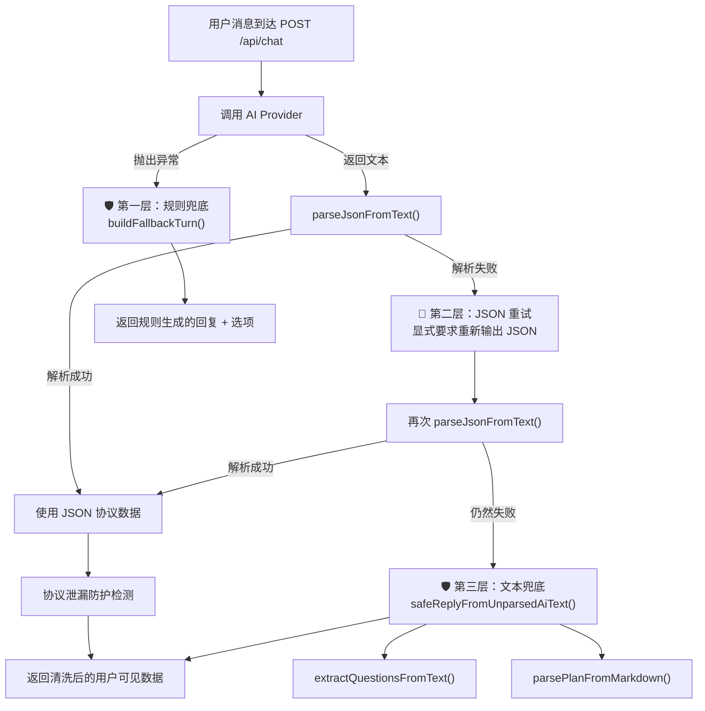
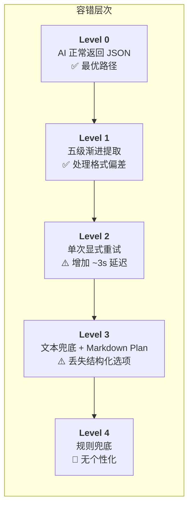

本页深入剖析系统在面对 LLM 输出不确定性时的**三层防御体系**：JSON 解析重试、规则兜底回复、以及协议泄漏防护。这是一个纯前端不感知的后端韧性层——无论 AI 输出多么不可预测，用户始终能收到可理解的回复、可点击的选项、或至少一条告知系统状态的提示。我们将逐层展开每一道防线的实现原理、触发条件与降级策略。

Sources: [chat-pipeline.ts](src/lib/chat-pipeline.ts#L1-L648), [route.ts](src/app/api/chat/route.ts#L1-L495)

## 整体架构：三层递进降级

系统的容错策略遵循**渐进降级**原则——优先使用 AI 生成的结构化数据，逐层回退到更粗糙但更可靠的提取方式，最终在 AI 完全不可用时切换为纯规则响应。下面的流程图展示了一次完整请求经过的全部容错路径：



**关键设计决策**：每一层降级都是**有损但可用**的。规则兜底损失个性化，文本兜底损失结构化选项，但用户永远不会看到一段裸 JSON 或收到空白响应。

Sources: [route.ts](src/app/api/chat/route.ts#L179-L416)

## 第一层：规则兜底——AI 完全不可用时的确定性响应

当 AI Provider 调用本身抛出异常（网络超时、API Key 缺失、模型服务宕机等），系统不会返回错误页面，而是立即切换到 `buildFallbackTurn()` 生成的**纯规则响应**。这个函数根据当前对话阶段、画像就绪状态、以及是否已有 Plan，返回四组不同的预设回复：

| 场景 | 回复内容 | 选项策略 |
|------|----------|----------|
| `greeting` 阶段 | "当前 AI 服务暂时不可用，我先用规则模式帮你进入科研分诊流程。" | 三个固定兴趣方向 + "帮我找方向" |
| 画像未就绪 | "需要先补齐几个关键画像字段" | 新手/有基础/时间紧 + "帮我找方向" |
| 画像就绪但无 Plan | "生成 Plan 前还需要确认目标范围" | 收窄问题/一周计划/确认交付物 + "帮我找方向" |
| 已有 Plan | "已有 Plan 已保留在右侧面板和文件列表中" | 等恢复后调整选项 + "帮我找方向" |

规则的精妙之处在于：每条选项都**保持与 AI 正常模式下相同的交互语义**——用户点击的选项文本会被作为 `message` 发送到下一轮对话，因此当 AI 恢复后，系统能无缝接续之前的对话流。

```typescript
// route.ts L192-L237 — AI 调用失败时的完整兜底逻辑
try {
  aiResult = await chat({ messages: aiMessages, ... });
} catch (err) {
  const fallback = buildFallbackTurn(session.phase, isProfileReady(session.memory), !!session.plan);
  // ... 直接返回 fallback 数据，不继续执行任何 AI 相关逻辑
  return NextResponse.json({ reply: fallback.reply, questions: fallback.questions, _fallback: true });
}
```

**阶段推进不中断**：即使在规则兜底模式下，`greeting` 阶段仍会自动推进到 `profiling`，保证对话状态机持续运转。

Sources: [chat-pipeline.ts](src/lib/chat-pipeline.ts#L518-L568), [route.ts](src/app/api/chat/route.ts#L179-L237)

## 第二层：JSON 解析——五级渐进提取与单次重试

AI 模型被要求输出严格的 JSON 协议（参见 [阶段式 Prompt 设计：每个阶段的 JSON 输出协议](14-jie-duan-shi-prompt-she-ji-mei-ge-jie-duan-de-json-shu-chu-xie-yi)），但 LLM 的实际输出往往带有各种"装饰"——markdown 代码块包裹、前置解释文字、甚至是系统 process 摘要的泄漏。`parseJsonFromText()` 采用**五级渐进提取**策略，每一级都比上一级更激进：

### 五级提取策略详解

```mermaid
flowchart LR
    S["原始文本"] --> L1["Level 1: 直接 JSON.parse"]
    L1 -->|失败| L2["Level 2: 提取 ```json 代码块"]
    L2 -->|失败| L3["Level 3: 平衡括号候选提取<br/>+ isProtocolJson 校验"]
    L3 -->|失败| L4["Level 4: 首尾大括号截取"]
    L4 -->|失败| L5["Level 5: 括号深度修复<br/>(自动补全缺失的 }")]
```

**Level 1 — 直接解析**：假设 AI 完美遵循了 JSON 输出指令，直接 `JSON.parse`。这是最快路径。

**Level 2 — Markdown 代码块提取**：匹配 ` ```json ... ``` ` 模式，提取代码块内容再解析。这覆盖了 AI 用 markdown 格式包裹 JSON 的常见行为。

**Level 3 — 平衡括号候选 + 协议校验**：这是最复杂的一级。`extractBalancedJsonCandidates()` 从文本中每个 `{` 开始，逐字符跟踪字符串状态和括号深度，提取所有语法完整的 JSON 候选片段。然后对每个候选调用 `isProtocolJson()` 进行**语义校验**——只有包含 `reply`、`questions`、`profileUpdates`、`checklistPassed`、`plan`、`codeFiles` 中至少一个已知协议字段的候选才会被采纳。

```typescript
// chat-pipeline.ts L39-L48 — 协议语义校验
function isProtocolJson(value: unknown): value is Record<string, unknown> {
  if (!value || typeof value !== "object" || Array.isArray(value)) return false;
  const obj = value as Record<string, unknown>;
  return "reply" in obj
    || "questions" in obj
    || "profileUpdates" in obj
    || "checklistPassed" in obj
    || "plan" in obj
    || "codeFiles" in obj;
}
```

这一设计避免了将文本中偶然出现的合法 JSON（如嵌入的数字对象）误识别为协议数据。

**Level 4 — 首尾大括号截取**：找到文本中第一个 `{` 和最后一个 `}`，截取中间内容再解析。这是"暴力但有效"的兜底策略。

**Level 5 — 括号深度修复**：如果 Level 4 失败但找到了起始 `{`，计算从起始位置到文本末尾的括号深度差，自动补全缺失的 `}`。这专门处理 AI 输出被 `maxTokens` 截断导致 JSON 不完整的场景。

### 单次显式重试

如果五级提取全部失败，系统会触发**一次显式重试**：将 AI 的原始失败输出作为 assistant 消息，附加一条 user 消息 `"上一轮回复不是JSON。请严格按照JSON格式重新输出，以{开头以}结尾。"`，再次调用 AI。

```typescript
// route.ts L242-L260 — JSON 解析失败后的单次重试
if (!parsed) {
  const retryMsgs: ChatMsg[] = [
    ...aiMessages,
    { role: "assistant", content: aiResult.content },
    { role: "user", content: "上一轮回复不是JSON。请严格按照JSON格式重新输出，以{开头以}结尾。" },
  ];
  aiResult = await chat({ messages: retryMsgs, temperature: 0.3, maxTokens: 4096, ... });
  parsed = parseJsonFromText(aiResult.content);
}
```

**设计权衡**：只重试一次，而非多次。原因有三：一是重试增加延迟（每次 API 调用需要数秒）；二是如果第一次失败是因为 Prompt 不兼容，第二次大概率也会失败；三是后续还有文本兜底层可以接住。temperature 从 0.4 降到 0.3，让模型更倾向于遵循格式指令。

Sources: [chat-pipeline.ts](src/lib/chat-pipeline.ts#L6-L86), [route.ts](src/app/api/chat/route.ts#L238-L260)

## 第三层：协议泄漏防护——不让用户看到内部 JSON

即使所有解析尝试都失败，AI 的原始文本仍可能包含**协议 JSON 片段**或**系统指令泄漏**。如果这些内容直接展示在聊天气泡中，用户会看到一段难以理解的 JSON 或是内部状态信息，严重影响体验。`safeReplyFromUnparsedAiText()` 就是最后一道清洗屏障：

```typescript
// chat-pipeline.ts L170-L177 — 协议泄漏检测与防护
export function safeReplyFromUnparsedAiText(text: string, phase: Phase): string {
  const isPlanPhase = phase === "planning" || phase === "reviewing" || phase === "clarifying";
  const looksLikeProtocol = /"reply"\s*:|"plan"\s*:|^\s*\{/.test(text);
  if (isPlanPhase && looksLikeProtocol) {
    return "模型返回了计划数据，但格式解析失败。请再点一次调整，或换一种更短的反馈。";
  }
  return extractReplyFromText(text);
}
```

**触发条件**：仅当同时满足两个条件时才替换为安全提示——(1) 当前处于 `planning`/`reviewing`/`clarifying` 阶段，(2) 文本匹配到 `"reply":`、`"plan":` 或以 `{` 开头。这两个条件缺一不可，因为 `profiling` 阶段的 AI 回复可能自然包含大括号（如描述数学公式），不应被误拦截。

**Plan 阶段的强制回复替换**：更进一步，当 Plan 被成功生成（无论来自 JSON 还是 Markdown 提取），系统会**强制覆盖** `reply` 字段为标准提示语：

```typescript
// route.ts L419-L424 — Plan 生成后的回复清洗
if (planState) {
  reply = codeFilesCount > 0
    ? "✅ Plan 和 ${codeFilesCount} 个代码文件已生成，可在右侧面板查看详情。"
    : "✅ Plan 已生成，可在右侧面板查看详情。你可以继续对话来调整计划。";
  questions = []; // 展示 Plan 时不需要追问选项
}
```

这确保了 Plan 的详细内容只出现在专用的 Plan 面板中（参见 [右侧面板：画像、Plan、文件与历史对比](5-you-ce-mian-ban-hua-xiang-plan-wen-jian-yu-li-shi-dui-bi)），而不会泄漏到聊天气泡。

**Process 摘要的安全设计**：`buildProcessSummary()` 生成的流程摘要文本通过 `m.process` 字段传递给前端，内容完全由服务端规则构建（阶段名称、字段计数、模式标记），不包含任何 AI 原始输出。即使 AI 返回了 `process` 字段，它也会被服务端重新生成的值覆盖，不会被透传给用户。

Sources: [chat-pipeline.ts](src/lib/chat-pipeline.ts#L164-L177), [route.ts](src/app/api/chat/route.ts#L419-L424), [chat-pipeline.ts](src/lib/chat-pipeline.ts#L581-L627)

## Markdown Plan 兜底——结构化数据的最后抢救

当 AI 返回的文本完全无法解析为 JSON，但内容实质上是一个 Markdown 格式的 Plan 时，`parsePlanFromMarkdown()` 试图从 Markdown 结构中提取关键信息。它通过一系列正则表达式匹配 Plan 的各个字段：

| 字段 | 匹配模式 | 兜底值 |
|------|----------|--------|
| `userProfile` | `画像` 或 `用户画像` 标题下的内容 | 正则提取的第一个标题 |
| `problemJudgment` | `问题判断/分解` 或 `当前状态` 标题下的内容 | "基于对话历史生成" |
| `systemLogic` | `系统...逻辑` 或 `判断逻辑` 或 `核心假设` 标题下的内容 | "参阅上方详细分析" |
| `recommendedPath` | `路径` 或 `推荐...路径` 标题下的内容 | "参阅步骤列表" |
| `actionSteps` | `步骤` 标题下的编号列表（`1. ...`） | 全文最后的编号列表（最多 8 条） |
| `riskWarnings` | `风险` 标题下的无序列表（`- ...`，最多 5 条） | 空数组 |

```typescript
// chat-pipeline.ts L179-L237 — Markdown Plan 提取的关键逻辑
const userProfile = extract(/画像[^\n]*\n+(.+?)(?=\n##|\n---|\n  |$)/s)
  || extract(/用户画像[^\n]*\n+(.+?)(?=\n##|\n---|\n  |$)/s)
  || "";
// ... 其余字段类似
if (!userProfile && !problemJudgment && steps.length === 0) return null;
// 至少要有一个非空字段才返回 Plan
```

**判定门槛**：只有当 `userProfile`、`problemJudgment` 和 `actionSteps` 三者全部为空时才返回 `null`，放弃提取。只要有一个字段有内容，就会构建一个带兜底值的 Plan 对象——宁可给用户一个不完整的 Plan，也不让用户的整轮对话"打水漂"。

Sources: [chat-pipeline.ts](src/lib/chat-pipeline.ts#L179-L237), [route.ts](src/app/api/chat/route.ts#L384-L402)

## 字段名兼容与多态归一化

AI 模型经常不严格遵守指定的 JSON 字段名——`actionSteps` 可能变成 `action_steps`、`steps`、`行动步骤` 甚至 `步骤`。`extractPlanFromParsed()` 通过**多候选键名查找**解决这一问题：

```typescript
// chat-pipeline.ts L284-L289 — 字段名的多候选查找
const userProfile = getString("userProfile", "user_profile", "summary", "用户画像");
const problemJudgment = getString("problemJudgment", "problem_judgment", "problem", "问题判断");
const actionSteps = normalizeSteps(getArray("actionSteps", "action_steps", "steps", "行动步骤", "步骤"));
```

类似地，步骤（`steps`）的每个元素可能是 `string`，也可能是 `{step: "...", time: "..."}` 这样的对象。`normalizeSteps()` 对两者都做了处理，将 `time` 字段以括号形式追加到步骤文本后。风险项（`risks`）也支持 `risk`、`description`、`title`、`content` 等多种键名。

代码文件（`codeFiles`）的提取同样支持 `code_files`、嵌套在 `plan` 内或外层的多种位置，内容字段支持 `content`、`code`、`source` 三种命名。

Sources: [chat-pipeline.ts](src/lib/chat-pipeline.ts#L266-L305), [chat-pipeline.ts](src/lib/chat-pipeline.ts#L350-L397)

## 测试覆盖：契约测试验证每层降级

测试文件 [chat-pipeline.test.ts](src/lib/chat-pipeline.test.ts) 用契约测试的方式验证了容错机制的关键路径：

| 测试用例 | 验证的容错层 | 核心断言 |
|----------|-------------|----------|
| `extracts JSON from fenced or wrapped model output` | Level 2 + Level 4 | ```json 代码块和前后缀包裹均可提取 |
| `extracts protocol JSON after a leaked process preface` | Level 3 | 泄漏的 process 摘要前缀不干扰 JSON 提取 |
| `does not expose protocol JSON as a plan-phase chat reply` | 协议泄漏防护 | `reviewing` 阶段返回"格式解析失败"而非原始 JSON |
| `normalizes plan fields and object-form steps` | 字段名兼容 | `user_profile`/`steps`/`{step,time}` 均正确归一化 |
| `persists plan plus Phase 4 document artifacts` | Plan 持久化 | 4 个文件产物全部生成且内容正确 |
| `extracts code file artifacts` | 代码文件提取 | 多语言、文件名清洗、路径安全处理 |

其中**协议泄漏防护测试**是容错体系的关键安全网——它确保了在任何解析失败的 Plan 阶段，用户看到的永远是一条人类可读的提示，而不是一段 JSON 碎片。

Sources: [chat-pipeline.test.ts](src/lib/chat-pipeline.test.ts#L1-L195)

## 容错策略总结



| 降级层级 | 触发条件 | 用户感知 | 数据完整性 |
|----------|----------|----------|-----------|
| 正常 JSON | AI 首次返回可解析的 JSON | 完全正常 | 100% |
| 渐进提取 | JSON 带包裹/前缀/截断 | 完全正常 | 100%（提取成功时） |
| 单次重试 | 五级提取全部失败 | 约 3s 额外等待 | 100%（重试成功时） |
| 文本兜底 | 重试后仍无法解析 | 可能缺少选项按钮 | reply + questions 部分恢复 |
| Markdown Plan | Plan 阶段的文本兜底 | Plan 面板部分填充 | 核心字段恢复，代码文件丢失 |
| 规则兜底 | AI 调用抛出异常 | 明确提示"服务暂时不可用" | 仅保留预设选项 |

**延伸阅读**：容错体系与 [AI 输出解析：JSON 提取、协议识别与 Markdown 兜底](9-ai-shu-chu-jie-xi-json-ti-qu-xie-yi-shi-bie-yu-markdown-dou-di) 形成互补——前者聚焦解析算法本身，本页则侧重**当解析失败时的系统级行为**。上游的 [阶段式 Prompt 设计](14-jie-duan-shi-prompt-she-ji-mei-ge-jie-duan-de-json-shu-chu-xie-yi) 是预防性措施（尽可能让 AI 输出正确格式），而本页描述的是**假设预防失败后的全部补救方案**。