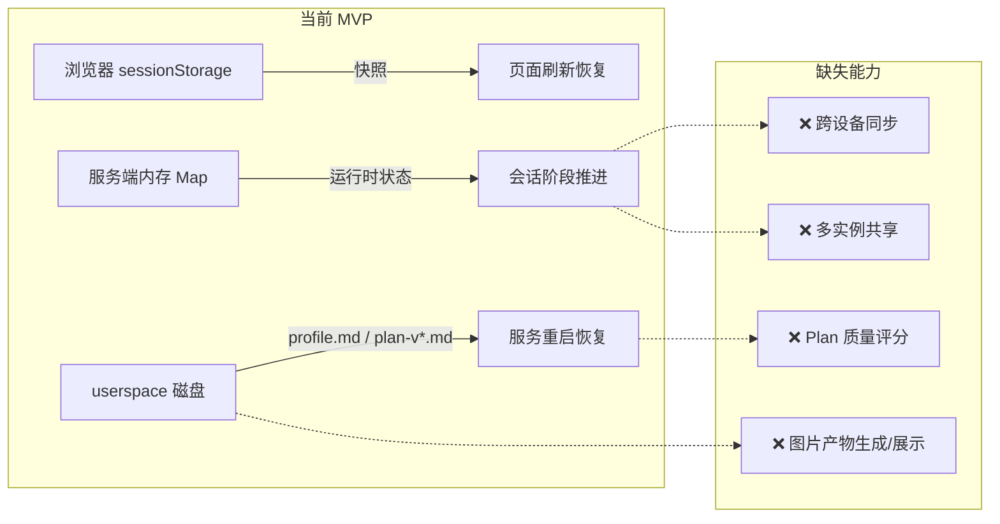
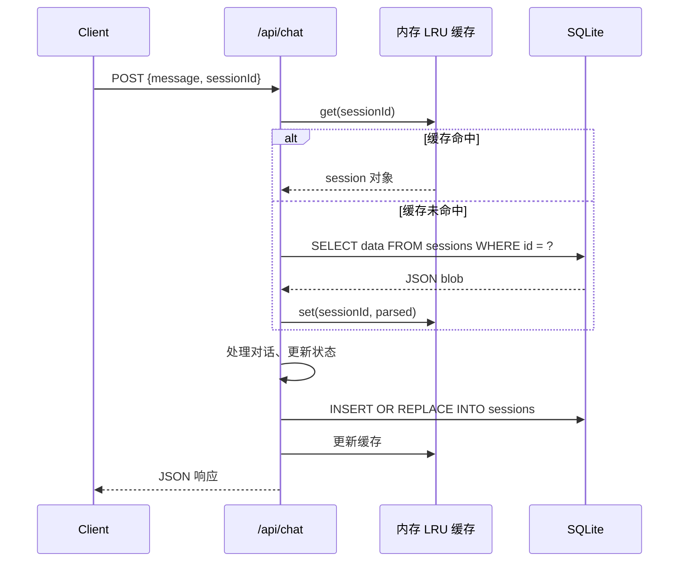
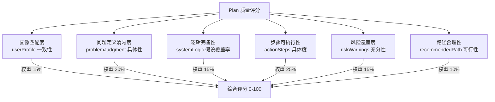
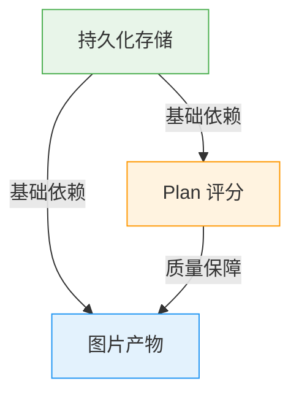

本文档从当前 MVP 的三个核心短板出发——**会话易丢失**、**Plan 缺乏质量度量**、**产物仅限文本与代码**——逐一展开扩展方向的技术分析与实施路径。每个方向均基于代码库中已有的扩展预留点和架构约束，不偏离 `单 API 入口 + userspace 文件沉淀 + 单页工作台` 的主链路设计原则。

Sources: [ARCHITECTURE.md](ARCHITECTURE.md#L9-L14), [DEVELOPMENT_PLAN.md](DEVELOPMENT_PLAN.md#L120-L146)

---

## 当前 MVP 的存储与产物边界

在展开扩展方案之前，需要精确理解当前系统"能保存什么"和"不能保存什么"。

### 前端：sessionStorage 快照

前端通过 `sessionStorage` 保存一份完整快照（`SavedSession`），包含 `messages`、`profile`、`profileConfidence`、`plan` 和 `sessionId`。每次状态变更后自动序列化写入，页面刷新后从 `sessionStorage` 恢复。但 sessionStorage 是浏览器标签页级别的存储——关闭标签页即丢失，且无法跨设备同步。

Sources: [page.tsx](src/app/page.tsx#L15-L21), [page.tsx](src/app/page.tsx#L76-L82)

### 后端：内存 Map + userspace 磁盘

服务端使用 `const sessions = new Map()` 维护所有活跃会话的状态（messages、memory、phase、plan）。服务重启后 Map 清空，但会从 `userspace/{sessionId}/` 目录的磁盘文件（`profile.md`、`plan-v{n}.md`）重建基础画像和最新 Plan。这种"内存为主、磁盘恢复为辅"的模式在单实例开发环境下足够，但无法支持多实例部署或 Vercel serverless 环境。

Sources: [route.ts](src/app/api/chat/route.ts#L28-L34), [route.ts](src/app/api/chat/route.ts#L88-L145)

### 产物：Markdown + 代码文件

当前 userspace 沉淀的产物类型由 `FileManifest.type` 枚举定义，包括 `profile`、`plan`、`checklist`、`path`、`summary`、`code`——以及一个**已预留但未实现的 `image` 类型**。这意味着类型系统已经为图片产物做好了准备，只是缺少实际的上传、生成和展示管线。

Sources: [triage-types.ts](src/lib/triage-types.ts#L155-L163)

### 边界总览



Sources: [ARCHITECTURE.md](ARCHITECTURE.md#L2-L14)

---

## 扩展方向一：持久化会话存储

### 问题定义

当前 `sessions` Map 存在三个致命缺陷：服务重启丢失全部会话状态（仅能从磁盘恢复 profile 和 plan 的降级版本）；不支持多实例部署，每个实例持有独立的内存 Map 导致会话漂移；Vercel 等 serverless 环境下每次冷启动都是全新 Map。

Sources: [route.ts](src/app/api/chat/route.ts#L28-L34)

### 方案对比

| 维度 | SQLite (better-sqlite3) | Supabase / PostgreSQL | Redis + JSON |
|---|---|---|---|
| 部署复杂度 | 零，单文件嵌入 | 需外部服务 + 连接池 | 需外部服务 |
| 多实例支持 | ❌ 单机锁定 | ✅ 原生支持 | ✅ 原生支持 |
| 事务保证 | ✅ 完整 ACID | ✅ 完整 ACID | ⚠️ 仅单 key 原子 |
| 查询能力 | ✅ 全 SQL | ✅ 全 SQL | ❌ 仅 key-value |
| MVP 适配度 | ⭐⭐⭐ 本地开发首选 | ⭐⭐⭐ 生产环境首选 | ⭐⭐ 简单但受限 |
| 成本 | 免费 | 免费额度有限 | 免费额度有限 |

### 推荐路径：SQLite 过渡 → Supabase 生产

**Phase 1（本地开发增强）**：引入 `better-sqlite3`，在 `userspace/` 同级创建 `sessions.db`。将 `sessions` Map 的每个 entry 序列化为 JSON blob 存入 `sessions` 表。修改 `/api/chat` 的 session 获取逻辑，优先从 DB 读取，Map 退化为 LRU 缓存。



**Phase 2（生产部署）**：将 SQLite 替换为 Supabase PostgreSQL。核心改造仅涉及数据访问层——抽象出一个 `SessionStore` 接口，API route 仅依赖接口不依赖实现。

Sources: [DEVELOPMENT_PLAN.md](DEVELOPMENT_PLAN.md#L120-L124)

### 存储模型设计

当前内存 Map 中的 session 结构包含四个核心字段，可直接映射为持久化模型：

```text
Session {
  id: string (sessionId, PK)
  data: JSON {
    messages: ChatMessage[]        // 完整对话历史
    memory: UserProfileMemory      // 10 字段画像 + 置信度
    phase: Phase                    // 当前阶段
    plan: PlanState | undefined     // 当前 Plan（可选）
  }
  created_at: timestamp
  updated_at: timestamp
}
```

注意 `userspace/` 磁盘文件系统不应被数据库取代——它承担的是**文件产物沉淀**（Plan、代码、摘要），而非**运行时状态**。两者的生命周期不同：session 状态可能在数小时后过期清理，而 Plan 文件应长期保留。

Sources: [route.ts](src/app/api/chat/route.ts#L88-L145), [userspace.ts](src/lib/userspace.ts#L183-L225)

### 实施检查清单

| 步骤 | 改动范围 | 影响评估 |
|---|---|---|
| 定义 `SessionStore` 接口 | 新增 `src/lib/session-store.ts` | 无破坏性 |
| 实现 `SqliteSessionStore` | 新增依赖 `better-sqlite3` | 仅后端 |
| 修改 `/api/chat` 的 session 获取/写入 | [route.ts](src/app/api/chat/route.ts#L82-L87) | 核心路径，需回归测试 |
| 前端增加"恢复上次会话"入口 | [page.tsx](src/app/page.tsx#L76-L82) | 前端改动 |
| 旧 userspace 恢复逻辑保留为降级路径 | [route.ts](src/app/api/chat/route.ts#L88-L145) | 兼容性保障 |

Sources: [route.ts](src/app/api/chat/route.ts#L82-L145)

---

## 扩展方向二：Plan 质量评分

### 问题定义

当前 Plan 的生成完全依赖 AI 单次输出，没有任何机制量化 Plan 质量。用户收到的 Plan 可能存在步骤不可执行、风险遗漏、画像不匹配等问题，但系统无法自动检测和提示。PRD 中将"Plan 质量不稳定"列为五大风险之一。

Sources: [人人都能做科研_mvp_prd_审查版 V1.1.md](人人都能做科研_mvp_prd_审查版 V1.1.md#L1381-L1385)

### 评分维度设计

基于当前 `PlanState` 的八个必填字段，可以构建一个多维度评分模型：



### 评分实施策略

**策略 A：规则评分（可立即实现）**——基于 `triage.ts` 已有的分类引擎模式，用纯规则检查 Plan 各字段的完整性。例如：`actionSteps` 是否包含时限关键词、`riskWarnings` 是否为空、`recommendedPath` 是否引用了画像中的约束条件。

**策略 B：AI 自评分（中等复杂度）**——在 `PLANNING_INSTRUCTION` 和 `REVIEWING_INSTRUCTION` 的 JSON 协议中新增 `qualityScore` 字段，要求 AI 在生成 Plan 的同时自评质量。这是最轻量的 AI 评分方案，但存在"自己给自己打分"的偏差风险。

**策略 C：独立评审 Agent（高复杂度，V2.0 范畴）**——生成 Plan 后，发起第二轮 AI 调用，以"同行审查者"角色评审 Plan 质量。PRD 的 Skills 体系中已包含 `07-peer-review-simulation.md`（同级审查），可作为 Prompt 基础。

Sources: [chat-prompts.ts](src/lib/chat-prompts.ts#L136-L175), [triage.ts](src/lib/triage.ts#L122-L175)

### 推荐实施路径：规则评分 + AI 自评分

**Phase 1**：在 `chat-pipeline.ts` 中新增 `scorePlan(plan: PlanState, memory: UserProfileMemory): PlanScore` 函数，执行以下规则检查：

| 检查项 | 规则 | 分值 |
|---|---|---|
| 步骤数量 | `actionSteps.length >= 3 && <= 7` | +10 |
| 步骤具体度 | 每个步骤是否包含动词+名词+时限 | +15 |
| 风险非空 | `riskWarnings.length >= 1` | +10 |
| 画像引用 | `userProfile` 是否包含画像中的关键字段值 | +10 |
| 问题收敛 | `problemJudgment` 长度 > 20 字符且不含"不确定" | +15 |

**Phase 2**：在 Plan JSON 协议中新增可选的 `qualityScore` 字段，与规则评分取加权平均后存入 `PlanState`。

Sources: [chat-pipeline.ts](src/lib/chat-pipeline.ts#L267-L327), [triage-types.ts](src/lib/triage-types.ts#L128-L143)

### PlanState 类型扩展

```typescript
// 在 PlanState 中新增评分字段
type PlanScore = {
  overall: number;           // 综合分 0-100
  dimensions: {
    profileMatch: number;     // 画像匹配度
    problemClarity: number;   // 问题清晰度
    logicCompleteness: number;// 逻辑完备性
    stepActionability: number;// 步骤可执行性
    riskCoverage: number;     // 风险覆盖度
    pathFeasibility: number;  // 路径合理性
  };
  issues: string[];           // 发现的具体问题
  suggestions: string[];      // 改进建议
};

// PlanState 扩展
type PlanState = {
  // ...现有字段
  score?: PlanScore;          // 可选，评分后填入
};
```

Sources: [triage-types.ts](src/lib/triage-types.ts#L128-L143)

### 评分结果展示

评分结果可通过两种途径传递给前端：一是在 `/api/chat` 的 JSON 响应中随 `plan` 字段一起返回，由 `PlanPanel` 在头部展示评分徽章；二是将评分写入 userspace 的 `plan-v{n}.md` 文件，作为 Plan 文档的一部分长期存档。

Sources: [plan-panel.tsx](src/components/plan-panel.tsx#L42-L46), [route.ts](src/app/api/chat/route.ts#L430-L465)

---

## 扩展方向三：图片产物生成与展示

### 问题定义

当前产物仅限于 Markdown 文档和代码文件。PRD 第 8.7 节和第 17.3 节明确要求支持图片预览能力——Markdown 中的图片应渲染为可见图片而非原始语法；外部检索到的图片应可直接展示；系统应能生成对理解内容有帮助的图片。`FileManifest.type` 已预留 `"image"` 类型，但整个管线中没有图片生成、存储或展示的代码。

Sources: [triage-types.ts](src/lib/triage-types.ts#L155), [人人都能做科研_mvp_prd_审查版 V1.1.md](人人都能做科研_mvp_prd_审查版 V1.1.md#L1628-L1682)

### 图片产物的三种来源

```mermaid
graph TB
    subgraph "图片来源"
        A[AI 生成图示<br/>Mermaid/PlantUML → SVG/PNG]
        B[外部检索图片<br/>URL 引用 + 代理缓存]
        C[用户上传图片<br/>文件上传 API + 缩略图]
    end
    
    subgraph "存储层"
        D[userspace/{sessionId}/<br/>images/ 目录]
        E[manifest.json<br/>type: 'image']
    end
    
    subgraph "展示层"
        F[DocPanel 图片渲染]
        G[Markdown 内嵌图片]
        H[对话气泡图片卡片]
    end
    
    A --> D
    B --> D
    C --> D
    D --> E
    E --> F
    E --> G
    E --> H
```

### Phase 1：Mermaid 图表自动渲染（最小可行）

当前 `DocPanel` 使用 `marked` 库渲染 Markdown，但未配置 Mermaid 插件。最轻量的图片产物方案是：在 Plan 的 Markdown 中允许 AI 输出 Mermaid 代码块（如流程图、思维导图），前端增加 `mermaid` 库将其渲染为 SVG。

实施步骤：
1. 在 `PLANNING_INSTRUCTION` 中允许 AI 在 `recommendedPath` 或 `systemLogic` 中输出 ` ```mermaid ` 代码块
2. 在 `DocPanel` 中引入 `mermaid` 库，对 `.mermaid` 代码块执行客户端渲染
3. 将渲染后的 SVG 作为图片产物写入 userspace

这个方案的优势在于：不需要任何图片存储基础设施，生成的"图片"本质上是文本（Mermaid DSL），完全复用现有 userspace 文件系统。

Sources: [doc-panel.tsx](src/components/doc-panel.tsx#L120-L135), [chat-prompts.ts](src/lib/chat-prompts.ts#L136-L152)

### Phase 2：AI 图片生成 + 本地存储

当需要生成非图表类图片（如实验装置示意图、概念对比图）时，需要引入图片生成能力。推荐路径：

1. **生成**：在 Plan JSON 协议中新增 `imageFiles` 字段，结构与 `codeFiles` 类似但 content 为图片描述（Prompt）；调用 DALL-E / Stable Diffusion API 生成图片
2. **存储**：在 `userspace/{sessionId}/` 下新增 `images/` 子目录，图片保存为 PNG/WebP 格式；`manifest.json` 中 type 为 `"image"`
3. **展示**：`DocPanel` 增加 `` 渲染分支；Markdown 中的图片引用（``）由前端重写为正确的 API 路径

Sources: [userspace.ts](src/lib/userspace.ts#L210-L225), [triage-types.ts](src/lib/triage-types.ts#L155-L163)

### Phase 3：外部图片代理与缓存

PRD 要求"当系统检索到对理解内容有帮助的外部图片时，应能直接展示图片"。这涉及：

1. **URL 安全代理**：在 `/api/userspace` 路由中新增 `?url=` 参数，服务端代理获取外部图片并缓存到 userspace，避免前端直接加载不可信外部资源
2. **Markdown 图片重写**：AI 输出的 Markdown 中若包含外部图片 URL，前端渲染前通过正则替换为代理 URL
3. **失败兜底**：图片加载失败时显示占位图和提示文字，符合 PRD 第 17.3 节的"图片失败兜底"要求

Sources: [人人都能做科研_mvp_prd_审查版 V1.1.md](人人都能做科研_mvp_prd_审查版 V1.1.md#L1675-L1676)

### userspace 模块扩展

当前 `userspace.ts` 的路径校验函数 `assertSafeSegment` 仅允许 `a-zA-Z0-9_.-` 字符。图片文件（`.png`、`.svg`、`.webp`）的扩展名合法，但需要新增二进制文件写入支持（当前 `writeFile` 仅处理 UTF-8 文本）：

```typescript
// 需新增的二进制写入函数
export function writeBinaryFile(
  sessionId: string,
  filename: string,
  buffer: Buffer,
): string {
  // 复用现有的 filePath 路径校验
  // 使用 writeFileSync(buffer) 替代 writeFileSync(content, "utf-8")
}
```

同时 `GET /api/userspace/{sessionId}/{filename}` 的 `raw` 模式需要根据文件扩展名返回正确的 Content-Type（如 `image/png`），而非当前的固定 `text/markdown`。

Sources: [userspace.ts](src/lib/userspace.ts#L10-L37), [route.ts](src/app/api/userspace/[sessionId]/[[...filename]]/route.ts#L44-L52)

---

## 三大扩展的依赖关系与优先级

三大扩展方向并非完全独立——它们之间存在技术依赖和优先级排序：



**持久化存储**应作为最高优先级，因为它是后两项扩展的基础——Plan 评分结果需要持久保存，图片产物需要可靠的文件存储。同时它直接解决了当前 MVP 的最大运维痛点（服务重启丢失会话）。

**Plan 质量评分**作为第二优先级，可以在持久化存储完成后立即实施。规则评分部分不依赖 AI，实施成本低，且能立即提升 Plan 的可信度。

**图片产物**作为第三优先级，技术复杂度最高，但用户体验提升最显著。Phase 1 的 Mermaid 渲染可以独立于前两项扩展先行实施。

Sources: [DEVELOPMENT_PLAN.md](DEVELOPMENT_PLAN.md#L120-L133)

### 扩展不影响的主链路

所有扩展必须遵循的核心约束是：**不破坏 `/api/chat + userspace + 单页工作台` 主链路**。这意味着：

- 持久化存储替换的是 `sessions` Map 的**实现**，不改变 `/api/chat` 的请求/响应协议
- Plan 评分新增的是 `PlanState` 的**可选字段**，不影响现有字段的解析逻辑
- 图片产物新增的是 `FileManifest` 的**type 分支**，不影响现有 type 的处理路径

Sources: [ARCHITECTURE.md](ARCHITECTURE.md#L243-L263)

---

## 与 PRD 版本规划的映射

PRD 第 15 节定义了清晰的版本路线图。三大扩展方向与版本规划的对应关系如下：

| PRD 版本 | 版本目标 | 对应扩展方向 |
|---|---|---|
| V1.1 交互增强 | 多级选择、Plan 模板 | Plan 评分（规则部分） |
| V1.5 画像扩展 | 多画像验证 | Plan 评分（画像匹配度增强） |
| V2.0 完整平台 | Multi-Agent、MCP、文献检索、图片识别 | 持久化存储 + 图片产物 |

PRD 中"当前评分"为 8/10，扣分项主要集中在"MVP 能力不够完整"和"缺少质量度量"。Plan 评分系统的引入将直接提升这一维度的得分。

Sources: [人人都能做科研_mvp_prd_审查版 V1.1.md](人人都能做科研_mvp_prd_审查版 V1.1.md#L1400-L1450)

---

## 相关页面导航

- 持久化存储的前端现状详见 [前端状态管理：sessionStorage 持久化与撤销机制](8-qian-duan-zhuang-tai-guan-li-sessionstorage-chi-jiu-hua-yu-che-xiao-ji-zhi)
- 会话恢复的磁盘读取逻辑详见 [画像就绪判定与服务重启恢复](12-hua-xiang-jiu-xu-pan-ding-yu-fu-wu-zhong-qi-hui-fu)
- Plan 产物的当前生成逻辑详见 [Plan 产物生成：文档、行动清单、科研路径与代码文件](10-plan-chan-wu-sheng-cheng-wen-dang-xing-dong-qing-dan-ke-yan-lu-jing-yu-dai-ma-wen-jian)
- 文件系统扩展的约束详见 [userspace 文件系统：会话隔离、路径安全校验与文件清单管理](20-userspace-wen-jian-xi-tong-hui-hua-ge-chi-lu-jing-an-quan-xiao-yan-yu-wen-jian-qing-dan-guan-li)
- 容错机制如何适配扩展详见 [AI 容错设计：JSON 重试、规则兜底与协议泄漏防护](25-ai-rong-cuo-she-ji-json-zhong-shi-gui-ze-dou-di-yu-xie-yi-xie-lou-fang-hu)