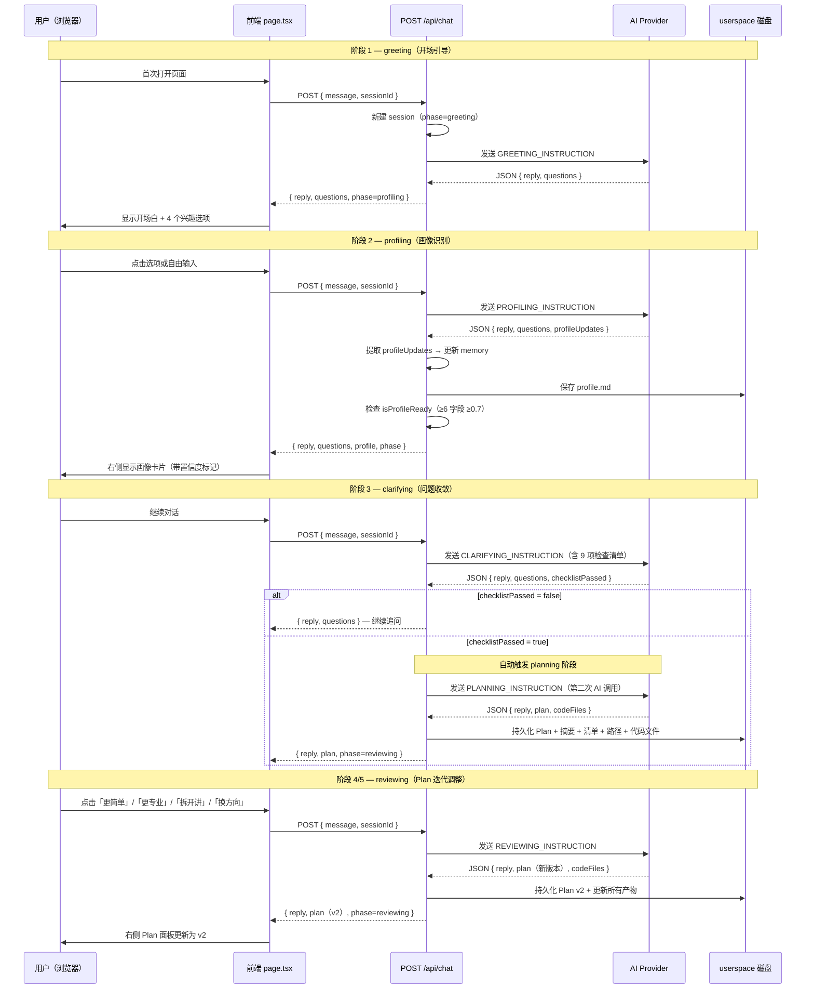

「人人都能做科研」系统的核心价值，在于通过一个**五阶段对话闭环**，将用户模糊的科研想法逐步收敛为一份结构化、可执行的科研探索计划（Plan）。用户只需在左侧聊天面板中自然对话——点击选项或自由输入文字——系统就在后台自动完成画像识别、问题收敛、Plan 生成与迭代调整。右侧面板实时展示画像进度、Plan 详情和文件产物，形成「对话驱动 → 产物沉淀」的完整闭环。本文将从用户体验视角出发，拆解这一闭环的完整流程、数据流转与关键决策点。

Sources: [triage-types.ts](src/lib/triage-types.ts#L168-L169), [page.tsx](src/app/page.tsx#L29-L36)

## 闭环全景：五阶段状态机

整个对话过程由一个严格的状态机驱动，包含 **greeting → profiling → clarifying → planning → reviewing** 五个阶段。每个阶段有独立的 Prompt 指令、JSON 输出协议和推进条件。阶段之间的转换由后端根据画像就绪度、检查清单通过状态和 Plan 是否已生成来自动判定。

Sources: [chat-pipeline.ts](src/lib/chat-pipeline.ts#L629-L647), [chat-prompts.ts](src/lib/chat-prompts.ts#L195-L200)

下面的时序图展示了用户从进入系统到获得可执行 Plan 的完整数据流：



Sources: [route.ts](src/app/api/chat/route.ts#L70-L155), [chat-prompts.ts](src/lib/chat-prompts.ts#L42-L200)

## 阶段 1：greeting — 开场引导

**目标**：用一句简短的开场白让用户知道系统能做什么，并通过 3-4 个兴趣方向选项引导用户迈出第一步。

系统为 greeting 阶段设定了极为严格的 JSON 输出协议：`reply` 必须是纯陈述句（禁止问号），所有追问必须放在 `questions` 数组中。每个选项是一句完整的、确定的话——用户点击即选中，无需补充说明。最后一个选项固定为「我不太理解这些，帮我找方向」，作为不知道怎么选时的**逃生通道**。

当 AI 成功返回开场 JSON 后，后端自动将 session 的 phase 从 `greeting` 推进到 `profiling`。如果 AI 调用失败，系统会回退到规则兜底模式，提供预设的四个兴趣方向选项，确保用户始终能继续对话。

Sources: [chat-prompts.ts](src/lib/chat-prompts.ts#L42-L64), [chat-pipeline.ts](src/lib/chat-pipeline.ts#L523-L533)

## 阶段 2：profiling — 画像识别

**目标**：通过多轮对话，逐步填充用户的 **10 维画像**，每维字段带有独立的置信度分数。

系统维护一个 `UserProfileMemory` 数据结构，包含 10 个画像字段，每个字段附带 `value`（值）、`confidence`（置信度 0-1）、`source`（来源：inferred / deduced / user_confirmed）和 `updatedAt`（更新时间戳）。AI 在每轮对话中返回 `profileUpdates` 数组，后端逐字段合并更新。

Sources: [memory.ts](src/lib/memory.ts#L4-L48)

### 画像字段与置信度阈值

| 字段名 | 中文名 | 说明 |
|--------|--------|------|
| `ageOrGeneration` | 年龄段 | 如"大二""00 后" |
| `educationLevel` | 教育水平 | 如"本科在读" |
| `toolAbility` | 工具能力 | 如"会用 Python" |
| `aiFamiliarity` | AI 熟悉度 | 如"用过 ChatGPT" |
| `researchFamiliarity` | 科研理解度 | 如"完全没接触过" |
| `interestArea` | 兴趣方向 | 如"机器学习""社会现象" |
| `currentBlocker` | 当前卡点 | 如"看不懂题目""不知道怎么做" |
| `deviceAvailable` | 可用设备 | 如"只有笔记本" |
| `timeAvailable` | 可用时间 | 如"1 周内" |
| `explanationPreference` | 解释偏好 | 如"从零开始""直接给步骤" |

AI 对每个提取的字段赋以 confidence 值，遵循以下语义：

| confidence | 含义 | source |
|------------|------|--------|
| 1.0 | 用户明确说了 | `user_confirmed` |
| 0.7 | 用户暗示或语境推断 | `deduced` |
| 0.5 | AI 从上下文推断 | `inferred` |
| 0.3 | 低置信度猜测 | `inferred` |

**阶段推进条件**：当 `getReliableFields(memory)` 返回 **≥6 个** confidence ≥ 0.7 的字段时，`isProfileReady` 返回 `true`，系统自动从 `profiling` 推进到 `clarifying`。

Sources: [memory.ts](src/lib/memory.ts#L50-L63), [chat-prompts.ts](src/lib/chat-prompts.ts#L66-L112)

### 前端画像展示

右侧面板实时显示画像卡片，每个字段旁带有置信度标记：● 已确认（confidence ≥ 1.0）、◉ 推断中（≥ 0.7）、○ 猜测中（≥ 0.3）。这让用户能直观感受到「系统在逐步理解我」，也增加了交互的透明度。

Sources: [side-panel.tsx](src/components/side-panel.tsx#L34-L39), [side-panel.tsx](src/components/side-panel.tsx#L57-L94)

## 阶段 3：clarifying — 问题收敛

**目标**：在生成 Plan 之前，确保关键假设已被显式检验——这是系统的**质量门控**。

AI 在此阶段收到一份包含 9 项的前置检查清单，必须逐项确认：

| 序号 | 检查项 |
|------|--------|
| 1 | 用户身份已确认？ |
| 2 | 用户目标已收敛为一个明确问题？ |
| 3 | 用户工具能力已确认？ |
| 4 | 用户时间约束已明确？ |
| 5 | 用户期望的交付物已明确？ |
| 6 | 是否存在任何隐含假设？（必须在 reply 中列出） |
| 7 | 用户问题是否过大？ |
| 8 | 用户想法在当前约束下是否可执行？ |
| 9 | 用户是否要求跨越过多阶段？ |

AI 每轮返回 `checklistPassed` 布尔值。如果为 `false`，系统继续通过 `questions` 追问用户，补齐缺失信息。一旦 `checklistPassed` 为 `true`，**后端在同一请求中自动发起第二次 AI 调用**，切换到 `PLANNING_INSTRUCTION`，直接生成 Plan——用户无需额外操作。

Sources: [chat-prompts.ts](src/lib/chat-prompts.ts#L114-L143), [route.ts](src/app/api/chat/route.ts#L334-L378)

## 阶段 4：planning — Plan 生成

**目标**：生成一份完整的科研探索计划，包含结构化的判断、步骤、风险和可选代码文件。

Plan 的 JSON 结构包含以下核心字段：

| 字段 | 说明 |
|------|------|
| `userProfile` | 用户画像摘要 |
| `problemJudgment` | 当前问题判断 |
| `systemLogic` | 系统判断逻辑（必须说明关键假设和证据边界） |
| `recommendedPath` | 推荐路径 |
| `actionSteps` | 3-7 个可执行步骤（每步包含动作、时限、验证方法） |
| `riskWarnings` | 直接对应用户当前约束的风险提示 |
| `nextOptions` | 下一步选择（默认：更简单 / 更专业 / 拆开讲 / 换方向） |
| `codeFiles` | 可选的代码文件产物数组 |

当 Plan 生成成功后，后端调用 `persistPlanArtifacts` 一次性写入多个文件到 userspace：Plan 主文档（Markdown）、当前摘要（summary.md）、行动检查清单（action-checklist.md）、科研路径说明（research-path.md），以及每个代码文件。这些文件可在右侧面板的文件列表中直接查看。

Sources: [chat-prompts.ts](src/lib/chat-prompts.ts#L145-L180), [chat-pipeline.ts](src/lib/chat-pipeline.ts#L399-L484)

## 阶段 5：reviewing — Plan 迭代调整

**目标**：用户可以反复调整 Plan，每次调整生成一个新版本，完整保留历史。

进入 reviewing 阶段后，用户有两种途径调整 Plan：

1. **从 Plan 面板操作**：每个步骤旁有「更简单」「更专业」「拆开讲」「换方向」按钮，点击后自动构造一条调整指令发送给 AI。Plan 面板底部也有全局调整按钮。
2. **从聊天面板对话**：用户可以用自然语言描述调整需求，系统会识别意图并调整 Plan。

Sources: [plan-panel.tsx](src/components/plan-panel.tsx#L28-L34), [plan-panel.tsx](src/components/plan-panel.tsx#L122-L138)

AI 收到 `REVIEWING_INSTRUCTION` 后，必须返回完整的 Plan JSON（而非增量修改），`systemLogic` 字段必须说明本次修改相对上一版改变了什么。后端将新版本号 +1，重新持久化所有产物文件。每次调整都会记录 `modifiedReason`，记录用户的调整请求原文。

Sources: [chat-prompts.ts](src/lib/chat-prompts.ts#L182-L193), [route.ts](src/app/api/chat/route.ts#L282-L285)

## AI 容错与 JSON 解析管线

AI 的输出并不总是可靠的。系统设计了一套**多层级 JSON 解析管线**来确保鲁棒性：

1. **直接解析**：尝试 `JSON.parse` 整段文本
2. **代码块提取**：尝试从 ` ```json ... ``` ` 围栏中提取
3. **平衡括号扫描**：从文本中找到所有平衡的 `{...}` 候选，逐个尝试解析，并通过 `isProtocolJson` 校验是否包含协议字段
4. **暴力截取**：取第一个 `{` 到最后一个 `}` 的子串尝试解析
5. **深度修复**：如果括号深度不平衡，尝试补全缺失的 `}`
6. **一次重试**：如果全部失败，向 AI 发送一条明确的重试指令："上一轮回复不是 JSON。请严格按照 JSON 格式重新输出"，再走一遍上述流程
7. **Markdown 兜底**：如果 JSON 重试仍然失败，尝试用正则从 Markdown 格式中提取 Plan 结构
8. **纯文本兜底**：最终回退到从纯文本中提取 reply 和 questions

这套管线确保即使 AI 返回格式不完全规范，系统也能尽量提取有效信息，而不是直接报错。

Sources: [chat-pipeline.ts](src/lib/chat-pipeline.ts#L6-L37), [chat-pipeline.ts](src/lib/chat-pipeline.ts#L170-L177), [route.ts](src/app/api/chat/route.ts#L238-L260)

## 会话恢复与断点续聊

后端使用内存 `Map` 存储会话状态，但当服务重启导致内存丢失时，系统会从 userspace 磁盘文件中恢复会话：读取 `profile.md` 重建画像字段，读取最新 Plan 文件恢复 Plan 状态，并根据恢复的数据确定当前阶段（有 Plan 则进入 reviewing，画像就绪则进入 clarifying，否则回到 profiling）。

前端通过 `sessionStorage` 持久化完整的对话历史、画像、Plan 和 sessionId，确保页面刷新后状态不丢失。同时实现了撤销机制：每轮对话前保存一个快照到 history 栈，点击「撤销」按钮可回退到上一轮的完整状态。

Sources: [route.ts](src/app/api/chat/route.ts#L82-L155), [page.tsx](src/app/page.tsx#L42-L67), [page.tsx](src/app/page.tsx#L149-L175)

## 完整闭环总结

| 阶段 | 用户行为 | 系统输出 | 推进条件 |
|------|---------|---------|---------|
| **greeting** | 首次进入 | 开场白 + 兴趣方向选项 | 自动推进到 profiling |
| **profiling** | 选择选项 / 自由输入 | 回复 + 追问选项 + 画像字段更新 | ≥6 个字段 confidence ≥ 0.7 |
| **clarifying** | 确认假设 / 补充信息 | 待确认假设列表 + 追问 | 9 项检查清单全部通过 |
| **planning** | 无需操作（自动触发） | 完整 Plan + 产物文件 | Plan 生成成功 |
| **reviewing** | 点击调整按钮 / 自然语言 | Plan 新版本 + 更新的产物文件 | 无终止条件，持续迭代 |

## 下一步阅读

- 了解左侧聊天面板的交互细节：[左侧聊天面板：对话、选项与自由输入](4-zuo-ce-liao-tian-mian-ban-dui-hua-xuan-xiang-yu-zi-you-shu-ru)
- 了解右侧面板的 Plan 展示与文件管理：[右侧面板：画像、Plan、文件与历史对比](5-you-ce-mian-ban-hua-xiang-plan-wen-jian-yu-li-shi-dui-bi)
- 深入理解阶段状态机的推进逻辑：[对话阶段状态机：greeting → profiling → clarifying → planning → reviewing](7-dui-hua-jie-duan-zhuang-tai-ji-greeting-profiling-clarifying-planning-reviewing)
- 了解 AI 输出的 JSON 解析与容错机制：[AI 输出解析：JSON 提取、协议识别与 Markdown 兜底](9-ai-shu-chu-jie-xi-json-ti-qu-xie-yi-shi-bie-yu-markdown-dou-di)