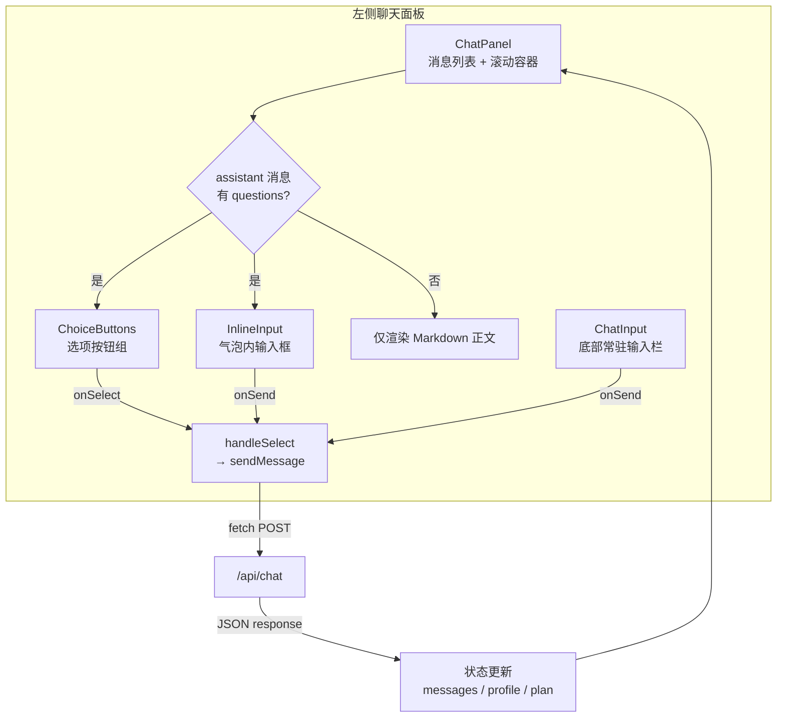

左侧聊天面板是用户与「人人都能做科研」系统交互的**主界面**。它负责呈现完整的对话流——从空状态的欢迎语、到每轮 AI 回复后的可点击选项、到底部始终可用的自由输入框。对于刚接触本项目的开发者来说，理解这一面板的组件结构和数据流，是读懂整个前端工作台的关键第一步。

Sources: [page.tsx](src/app/page.tsx#L177-L216), [chat-panel.tsx](src/components/chat-panel.tsx#L1-L98)

## 整体布局：三段式垂直结构

左侧面板在页面中占据 CSS Grid 的左列，内部是一个三段式的 Flex 布局——**头部工具栏**、**消息滚动区**、**底部输入栏**。这三部分始终可见，用户可以一边浏览历史消息，一边输入新内容。

```
┌─────────────────────────────────────────┐
│  chat-header（标题 + 撤销/新对话按钮）      │  ← flex-shrink: 0
├─────────────────────────────────────────┤
│                                         │
│  chat-panel（消息滚动区，flex: 1）         │  ← overflow-y: auto
│    ┌─────────────────────────────────┐  │
│    │ assistant bubble                │  │
│    │   [ProcessPanel ▶ 处理摘要]     │  │
│    │   消息正文 (Markdown 渲染)       │  │
│    │   [选项A] [选项B] [选项C]        │  │
│    │   [自由输入框] [发送]            │  │
│    └─────────────────────────────────┘  │
│    ┌─────────────────────────────────┐  │
│    │ user bubble (右对齐，深色背景)    │  │
│    └─────────────────────────────────┘  │
│                                         │
├─────────────────────────────────────────┤
│  chat-input-bar（底部常驻输入框 + 发送）    │  ← flex-shrink: 0
└─────────────────────────────────────────┘
```

Grid 布局定义在 `.chat-layout` 中：左列使用 `minmax(0, 1fr)` 自动撑满剩余空间，右列固定 `clamp(430px, 35vw, 580px)` 给侧边面板。`chat-main` 作为左列容器，以 `flex-direction: column` 纵向排列三个区域，其中 `chat-panel` 设置 `flex: 1` 占满所有可用高度并允许纵向滚动。

Sources: [globals.css](src/app/globals.css#L135-L161), [globals.css](src/app/globals.css#L200-L215)

## 四个核心组件及其职责

左侧面板由四个 React 组件协同构成，每个组件职责单一、接口清晰：

| 组件 | 文件 | 职责 | 何时渲染 |
|------|------|------|---------|
| **ChatPanel** | [chat-panel.tsx](src/components/chat-panel.tsx) | 消息列表容器，渲染气泡、选项、内联输入 | 始终渲染 |
| **ChoiceButtons** | [choice-buttons.tsx](src/components/choice-buttons.tsx) | 可点击选项按钮组，含过滤与兜底逻辑 | assistant 消息携带 `questions` 时 |
| **InlineInput** | [chat-panel.tsx](src/components/chat-panel.tsx#L20-L44) | 气泡内嵌的轻量文本输入框 | 与 ChoiceButtons 同时出现 |
| **ChatInput** | [chat-input.tsx](src/components/chat-input.tsx) | 底部常驻的完整输入栏 | 始终渲染 |

组件间的数据流可以用下面的关系图来理解——所有用户输入，无论来自按钮点击还是文本输入，最终都汇入同一个 `sendMessage` 回调：



Sources: [chat-panel.tsx](src/components/chat-panel.tsx#L46-L97), [chat-input.tsx](src/components/chat-input.tsx#L10-L36), [choice-buttons.tsx](src/components/choice-buttons.tsx#L19-L49), [page.tsx](src/app/page.tsx#L142-L147)

## ChatPanel：消息渲染与自动滚动

`ChatPanel` 是消息列表的核心容器，接收三个 Props：

| Prop | 类型 | 说明 |
|------|------|------|
| `messages` | `ChatMessage[]` | 完整对话历史 |
| `onSelect` | `(text: string) => void` | 用户选择/输入后的回调 |
| `loading` | `boolean` | 是否正在等待 AI 响应 |

它的工作逻辑分为三个分支：**空状态**、**消息渲染**、**加载指示器**。

**空状态**：当 `messages` 数组为空时，显示居中的欢迎语「欢迎来到『人人都能做科研』」，引导用户开始对话。欢迎语使用大号字体（`clamp(2.9rem, 7vw, 6.4rem)`）和 `min-height: 56vh` 的网格居中布局，视觉冲击感强。

**消息渲染**：每条消息以 `chat-bubble` 气泡渲染，根据 `role` 字段区分三种样式——用户消息右对齐深色背景（`chat-bubble--user`）、助手消息左对齐白色卡片（`chat-bubble--assistant`）、系统消息居中浅蓝（`chat-bubble--system`）。消息正文通过 `marked.parse()` 将 Markdown 转为 HTML 后以 `dangerouslySetInnerHTML` 渲染。

**助手消息的附加区域**：当 `role === "assistant"` 时，气泡内会按顺序渲染三个可选区域——可折叠的 **ProcessPanel**（如果携带 `process` 字段）、正文文本、以及**选项按钮 + 内联输入框**（如果携带 `questions` 字段）。

**自动滚动**：组件使用 `useRef` 持有底部一个空 `div` 的引用，通过 `useEffect` 监听 `messages.length` 变化，每次新消息到来时调用 `scrollIntoView({ behavior: "smooth" })` 平滑滚动到底部。

**加载指示器**：当 `loading === true` 时，在消息列表末尾追加一个带脉冲动画的「思考中…」气泡。

Sources: [chat-panel.tsx](src/components/chat-panel.tsx#L46-L97), [globals.css](src/app/globals.css#L217-L339), [triage-types.ts](src/lib/triage-types.ts#L113-L119)

## ChoiceButtons：智能选项过滤与兜底

`ChoiceButtons` 组件接收 AI 返回的 `questions` 数组，将其渲染为一组可点击按钮。但它的关键价值在于**过滤**和**兜底**两层保护逻辑。

**过滤机制**——`isValidOption` 函数会剔除以下无效占位符：

| 过滤规则 | 正则 / 条件 | 过滤目标 |
|---------|------------|---------|
| 过短选项 | `q.length < 3` | 像 "A"、"好" 这样无意义的文本 |
| 占位选项 A-D | `/^选项\s*[a-dA-D]$/` | "选项A"、"选项 B" |
| 列表前缀 | `/^[a-dA-D][).、]/` | "A)"、"b." 开头的无内容文本 |
| 泛指词 | `=== "其他" \|\| === "其它"` | 无实际含义的"其他" |
| 多选项拼合 | `/[：:].*[A-D][.)].*[A-D][.)]/` | "如下：A)xxx B)xxx" 格式的描述文本 |

**兜底机制**——经过过滤后，组件检查剩余选项中是否包含「帮我找方向」「自己描述」「自定义」等逃生关键词。如果没有，则自动追加一个虚线样式的兜底按钮「我不太理解这些，帮我找方向」，确保用户在任何时候都不会陷入「没有合适选项」的困境。这个兜底按钮通过 CSS 类 `button-choice-escape` 呈现虚线边框和透明背景，在视觉上与正常选项区分。

Sources: [choice-buttons.tsx](src/components/choice-buttons.tsx#L1-L49), [globals.css](src/app/globals.css#L406-L432)

## InlineInput 与 ChatInput：两级输入入口

系统设计了两个层级的文本输入入口，分别服务于不同的交互场景：

**InlineInput（气泡内嵌输入框）**——定义在 `ChatPanel` 内部的私有组件，紧跟在 ChoiceButtons 之后渲染。它的占位符文本是「选项都不合适？直接写你的想法…」，明确告诉用户这是选项之外的补充通道。输入框样式较轻量（`padding: 8px 12px`，`font-size: 0.9rem`），不会喧宾夺主。

**ChatInput（底部常驻输入栏）**——位于消息滚动区下方，始终可见。它是一个标准的 `<form>` 表单，包含一个全宽输入框（`placeholder: "输入你想研究的方向、问题或想法…"`）和一个「发送」按钮。表单提交通过 `onSubmit` 拦截，调用 `e.preventDefault()` 阻止页面刷新。

两者的对比：

| 特性 | InlineInput | ChatInput |
|------|------------|-----------|
| 位置 | 气泡内部，仅在 assistant 有 questions 时出现 | 底部常驻，始终可见 |
| 视觉权重 | 轻量，辅助角色 | 主输入区，醒目 |
| 提交方式 | `onKeyDown` Enter + 发送按钮 | `<form>` 的 `onSubmit` + 发送按钮 |
| 禁用条件 | `loading === true` | `loading === true` 或输入为空 |
| 共同回调 | 均调用 `onSelect` / `onSend`，最终汇入 `sendMessage` | 同左 |

这种「选项 + 轻量输入 + 底部输入」的三通道设计，确保了不同使用习惯的用户都能顺畅对话——喜欢引导的用户点按钮，有明确想法的用户直接打字。

Sources: [chat-panel.tsx](src/components/chat-panel.tsx#L20-L44), [chat-input.tsx](src/components/chat-input.tsx#L10-L36), [globals.css](src/app/globals.css#L341-L404)

## ProcessPanel：可折叠的处理摘要

每条 assistant 消息可以选择性携带一个 `process` 字段——一段可展示的流程摘要文本。`ProcessPanel` 将其渲染为一个默认折叠的区块，用户点击「▶ 处理摘要」按钮后展开查看。

折叠状态的切换通过 `useState(open)` 控制。展开后，内容同样通过 `marked.parse()` 渲染为 Markdown。CSS 样式上，展开内容带有左侧深色边框（`border-left: 2px solid var(--accent)`）和浅灰背景，视觉上形成引用块效果，与主消息正文清晰区分。

Sources: [process-panel.tsx](src/components/process-panel.tsx#L1-L33), [globals.css](src/app/globals.css#L434-L470)

## 消息的数据结构

每条消息由 `ChatMessage` 类型定义，包含以下字段：

```typescript
type ChatMessage = {
  role: "user" | "assistant" | "system";  // 发送者角色
  content: string;                         // 消息正文（Markdown）
  questions?: string[];                    // AI 提供的选项列表（仅 assistant）
  process?: string;                        // 处理摘要（仅 assistant）
  timestamp: number;                       // Unix 时间戳
};
```

其中 `questions` 和 `process` 是可选字段，只在后端管线返回时才会出现。前端通过条件渲染（`m.questions && m.questions.length > 0`）来决定是否展示选项按钮和内联输入框。

Sources: [triage-types.ts](src/lib/triage-types.ts#L113-L119), [chat-panel.tsx](src/components/chat-panel.tsx#L75-L83)

## 响应式适配

左侧面板在两个断点下有自适应行为：

- **≤ 900px**：Grid 从双列变为单列堆叠，侧边面板移到下方（`grid-template-rows: minmax(0, 1fr) minmax(220px, 36vh)`），聊天区 padding 缩小至 16px。
- **≤ 560px**：聊天气泡宽度扩展到 96%，底部输入栏从水平排列变为垂直堆叠（`flex-direction: column`），发送按钮撑满宽度。

Sources: [globals.css](src/app/globals.css#L864-L903)

## 下一步阅读

现在你已经了解了左侧聊天面板的组件结构与交互逻辑，接下来可以继续探索：

- [右侧面板：画像、Plan、文件与历史对比](5-you-ce-mian-ban-hua-xiang-plan-wen-jian-yu-li-shi-dui-bi)——了解对话的产物如何在右侧展示
- [核心对话闭环：从模糊想法到可执行 Plan](3-he-xin-dui-hua-bi-huan-cong-mo-hu-xiang-fa-dao-ke-zhi-xing-plan)——理解消息在前后端之间的完整流转
- [对话阶段状态机：greeting → profiling → clarifying → planning → reviewing](7-dui-hua-jie-duan-zhuang-tai-ji-greeting-profiling-clarifying-planning-reviewing)——了解 messages 如何随阶段推进而演变