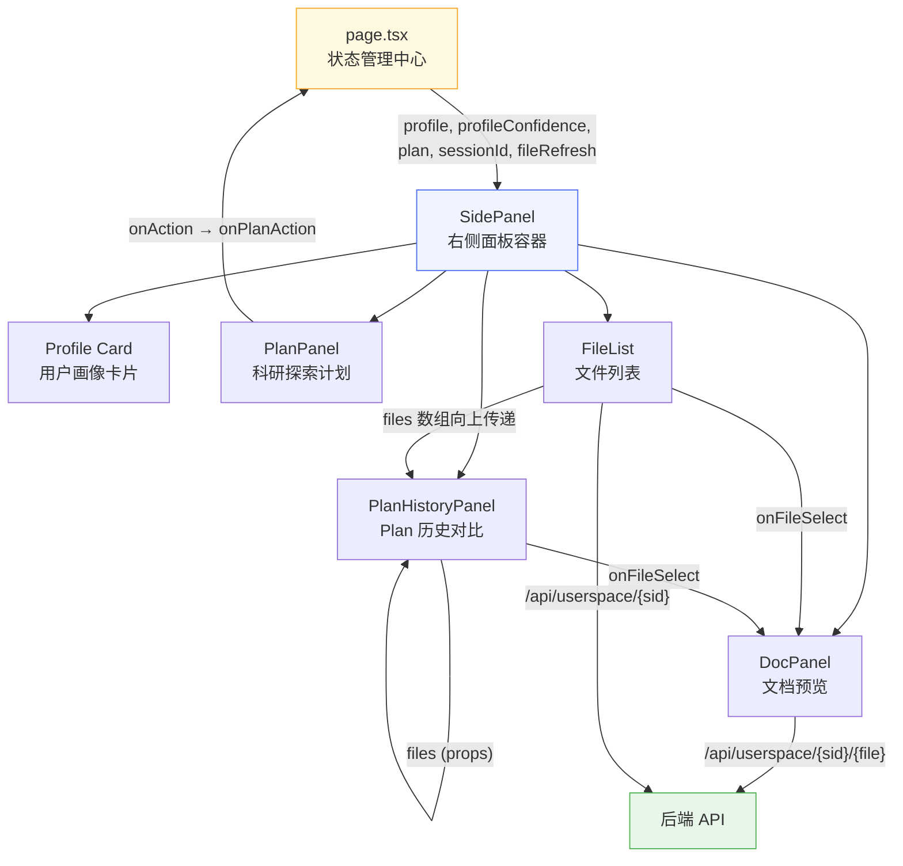
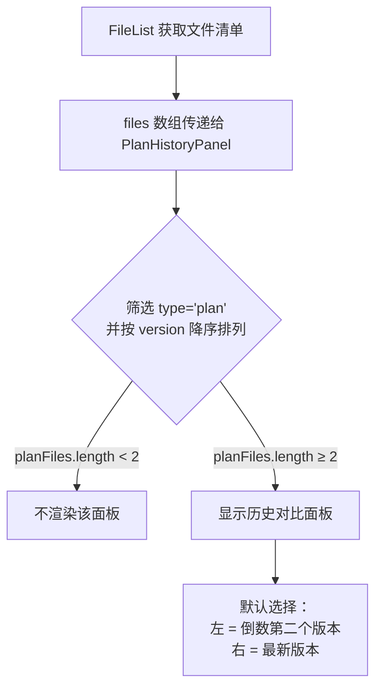
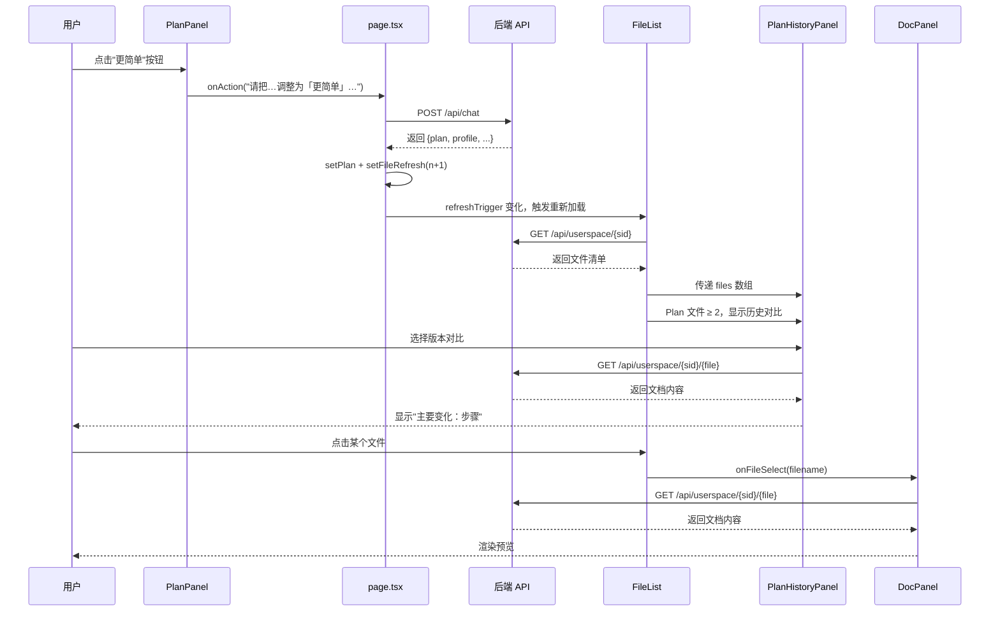

右侧面板是「人人都能做科研」工作台的**信息沉淀与可视化区域**。当用户在左侧聊天面板中不断对话时，系统会在后台逐步构建用户画像、生成科研探索 Plan、产出文档与代码文件。右侧面板将这些**不可见的 AI 推理结果**转化为可视、可交互的信息卡片，让用户随时掌握"系统对我的理解"和"下一步该做什么"。

整个右侧面板由 `SidePanel` 组件统一编排，内含五个功能子区域，从上到下依次为：**用户画像**、**Plan 面板**、**Plan 历史对比**、**文件列表**、**文档预览**。

Sources: [side-panel.tsx](src/components/side-panel.tsx#L1-L129)

## 面板整体结构

右侧面板的所有子区域都被包裹在 `SidePanel` 组件中。主页面 `page.tsx` 通过 props 向 `SidePanel` 传入核心数据源——`profile`（用户画像）、`profileConfidence`（置信度映射）、`plan`（科研计划）、`sessionId`（会话标识），以及两个回调——`onPlanAction`（用户在 Plan 面板操作时触发对话）和 `disabled`（加载状态锁）。

下图展示了右侧面板的组件层级与数据流向：

Sources: [side-panel.tsx](src/components/side-panel.tsx#L41-L128), [page.tsx](src/app/page.tsx#L207-L215)

## 用户画像卡片

用户画像是右侧面板的**第一个可见区域**。它展示系统对用户的理解程度，包含 10 个字段（年龄段、教育水平、工具能力、AI 熟悉度、科研理解度、兴趣方向、当前卡点、可用设备、可用时间、解释偏好），每个字段旁标注**置信度徽章**，直观反映信息的可靠程度。

### 10 字段与中文标签映射

| 内部字段名 | 显示标签 | 说明 |
|---|---|---|
| `ageOrGeneration` | 年龄段 | 用户年龄或代际背景 |
| `educationLevel` | 教育水平 | 学历或所处教育阶段 |
| `toolAbility` | 工具能力 | 编程、数据分析等工具使用能力 |
| `aiFamiliarity` | AI 熟悉度 | 对 AI 工具的了解和使用经验 |
| `researchFamiliarity` | 科研理解度 | 对科研方法、流程的认知程度 |
| `interestArea` | 兴趣方向 | 用户感兴趣的研究领域 |
| `currentBlocker` | 当前卡点 | 用户目前面临的最大障碍 |
| `deviceAvailable` | 可用设备 | 可投入的硬件设备 |
| `timeAvailable` | 可用时间 | 用户可投入科研的时间 |
| `explanationPreference` | 解释偏好 | 希望系统用何种方式解释内容 |

Sources: [side-panel.tsx](src/components/side-panel.tsx#L21-L32)

### 三级置信度模型

每个画像字段都有一个 0~1 的置信度值（由 `profileConfidence` prop 提供），系统根据阈值将其映射为三个视觉等级：

| 置信度范围 | 图标 | 标签 | CSS 类名 | 含义 |
|---|---|---|---|---|
| ≥ 1.0 | ● | 已确认 | `conf-confirmed` | 用户亲口确认或系统直接观察到的信息 |
| ≥ 0.7 | ◉ | 推断中 | `conf-deduced` | 基于对话内容合理推断，尚未确认 |
| ≥ 0.3 | ○ | 猜测中 | `conf-inferred` | 仅根据少量线索猜测，可能不准确 |
| < 0.3 | （不显示） | — | — | 置信度过低，不展示徽章 |

画像卡片底部始终显示图例说明，帮助用户理解三个图标的含义。**当画像尚无任何有效数据时**（即所有字段为空），卡片会显示一条引导文案："对话几轮后，系统会在这里展示对你的理解。"

Sources: [side-panel.tsx](src/components/side-panel.tsx#L34-L94), [triage-types.ts](src/lib/triage-types.ts#L122-L133)

## Plan 面板

`PlanPanel` 是右侧面板中**交互最丰富的组件**。它将后端生成的 `PlanState` 渲染为一个结构化的科研计划视图，用户可以逐节展开/折叠，还能通过快捷按钮对每一步骤发出调整指令。

### Plan 的六大分区

每个 Plan 由以下六个可折叠的分区（Section）组成，初始状态全部展开：

| 分区 | 标题 | 数据字段 | 展示方式 |
|---|---|---|---|
| 用户画像 | 📋 用户画像 | `plan.userProfile` | Markdown 渲染 |
| 问题判断 | 🔍 问题判断 | `plan.problemJudgment` | Markdown 渲染 |
| 系统逻辑 | 🧠 系统逻辑 | `plan.systemLogic` | Markdown 渲染（带 muted 样式） |
| 推荐路径 | 🗺 推荐路径 | `plan.recommendedPath` | Markdown 渲染 |
| 行动步骤 | 📝 行动步骤（N步） | `plan.actionSteps` | 有序列表 + 操作按钮 |
| 风险提示 | ⚠ 风险提示（N条） | `plan.riskWarnings` | 无序列表 |

**版本追踪**：Plan 面板顶部标题栏显示当前版本号 `v{plan.version}`。如果 Plan 经过修改，还会在标题下方标注 `修改原因：{plan.modifiedReason}`。

Sources: [plan-panel.tsx](src/components/plan-panel.tsx#L13-L141)

### 行动步骤的快捷操作按钮

每一条行动步骤右侧都有四个快捷按钮，用户无需手动打字，一键即可向 AI 发出调整指令：

| 按钮文本 | 发送的对话内容模板 |
|---|---|
| 更简单 | `请把科研探索计划 v{version} 的第 {i+1} 步调整为「更简单」。原步骤：{step}` |
| 更专业 | `请把科研探索计划 v{version} 的第 {i+1} 步调整为「更专业」。原步骤：{step}` |
| 拆开讲 | `请把科研探索计划 v{version} 的第 {i+1} 步调整为「拆开讲」。原步骤：{step}` |
| 换方向 | `请把科研探索计划 v{version} 的第 {i+1} 步调整为「换方向」。原步骤：{step}` |

这些按钮触发 `onAction` 回调，最终调用主页面的 `sendMessage`，将调整请求作为用户消息发送给后端。按钮在 `disabled`（AI 正在响应）状态下会被禁用，防止重复提交。

Sources: [plan-panel.tsx](src/components/plan-panel.tsx#L28-L106)

### "下一步"选项区

Plan 面板底部还有一个不可折叠的"下一步"区域，渲染 `plan.nextOptions` 数组中的选项按钮。点击后同样通过 `onAction` 回调发送对话消息：`请根据当前科研探索计划 v{version} 做调整：{option}`。

Sources: [plan-panel.tsx](src/components/plan-panel.tsx#L122-L138)

### 折叠机制

Section 组件使用 `useState` 管理一个 `Set<SectionKey>` 来跟踪哪些分区被折叠。点击分区标题栏触发 toggle 逻辑：如果当前已折叠则移出集合，否则加入集合。箭头图标随折叠状态切换（展开 ▼ / 折叠 ▶）。

Sources: [plan-panel.tsx](src/components/plan-panel.tsx#L15-L27), [plan-panel.tsx](src/components/plan-panel.tsx#L143-L163)

## Plan 历史对比

`PlanHistoryPanel` 在 **Plan 文件数量 ≥ 2** 时自动出现，允许用户选择任意两个版本进行对比。这是整个右侧面板中**唯一的跨版本分析功能**。

### 触发条件

Sources: [plan-history-panel.tsx](src/components/plan-history-panel.tsx#L35-L86)

### 变化检测算法

面板会自动对比左右两个版本的 Plan 文档内容，找出**第一个发生变化的章节**。算法按固定顺序逐节比对：

1. 用户画像 → 2. 问题判断 → 3. 系统逻辑 → 4. 推荐路径 → 5. 步骤 → 6. 风险 → 7. 下一步选项

对每个章节，通过正则表达式 `## {章节名}\n+([\s\S]*?)(?=\n## |$)` 提取该章节的纯文本内容，然后比较左右版本是否一致。一旦发现差异，立即返回该章节名；如果所有章节都相同，则返回"内容"。比对结果以 `主要变化：{章节名}` 的形式展示在面板中部。

Sources: [plan-history-panel.tsx](src/components/plan-history-panel.tsx#L19-L33), [plan-history-panel.tsx](src/components/plan-history-panel.tsx#L88-L113)

### 文档加载流程

当用户通过下拉选择器切换版本时，面板通过 `GET /api/userspace/{sessionId}/{filename}` 接口异步加载对应文件的完整内容。加载过程使用 `cancelled` 标志位处理竞态条件——如果用户在加载完成前再次切换版本，旧的请求结果会被丢弃。

Sources: [plan-history-panel.tsx](src/components/plan-history-panel.tsx#L58-L82)

## 文件列表

`FileList` 组件展示当前会话下所有由 AI 生成的文件。它通过 `GET /api/userspace/{sessionId}` 接口获取文件清单，并以带类型图标的列表形式呈现。

### 文件类型与图标映射

| 文件类型 (type) | 图标 | 典型内容 |
|---|---|---|
| `profile` | 👤 | 用户画像文档 |
| `plan` | 📋 | 科研探索计划 |
| `checklist` | ✅ | 行动清单 |
| `path` | 🗺 | 科研路径 |
| `summary` | 📄 | 总结文档 |
| `image` | 🖼 | 图片产物 |
| `code` | 💻 | 代码文件 |

对于 `plan` 类型文件，额外显示版本号标签（如 `v1`、`v2`）；对于 `code` 类型文件，显示编程语言标签（如 `python`、`javascript`）。

Sources: [file-list.tsx](src/components/file-list.tsx#L13-L21), [file-list.tsx](src/components/file-list.tsx#L55-L76)

### 自动刷新机制

文件列表通过 `refreshTrigger` prop 实现按需刷新。主页面在每次收到 AI 响应且其中包含 `profile` 或 `plan` 更新时，将 `fileRefresh` 计数器 +1，触发 `FileList` 内部的 `useEffect` 重新拉取文件清单。此外，`FileList` 还通过 `onFilesChange` 回调将获取到的文件数组向上传递给 `SidePanel`，供 `PlanHistoryPanel` 使用。

Sources: [file-list.tsx](src/components/file-list.tsx#L27-L44), [page.tsx](src/app/page.tsx#L112-L127)

## 文档预览

`DocPanel` 是右侧面板的**终端展示组件**。当用户点击文件列表或 Plan 历史对比中的某个文件时，`SidePanel` 将该文件名设置为 `activeFile` 状态，`DocPanel` 随即通过 API 加载并渲染文档内容。

### 预览模式与操作按钮

| 按钮 | 功能 | 实现方式 |
|---|---|---|
| **系统打开** | 用操作系统默认应用打开文件 | `POST /api/userspace/{sid}/{file}?action=open` |
| **打开** | 在浏览器新标签页打开原始内容 | `<a href="...?raw=1" target="_blank">` |
| **下载** | 将文件下载到本地 | `<a href="...?raw=1" download={filename}>` |
| **✕** | 关闭预览，回到占位提示 | 调用 `onClose` 清空 `activeFile` |

### 渲染策略

文档预览根据文件类型采取不同的渲染策略：

- **Markdown 文件**（非 code 类型）：使用 `marked` 库将 Markdown 内容解析为 HTML，通过 `dangerouslySetInnerHTML` 注入 DOM
- **代码文件**（`type === "code"`）：使用 `<pre><code>` 标签包裹原始代码文本，并显示编程语言标签

Sources: [doc-panel.tsx](src/components/doc-panel.tsx#L21-L135)

## 组件间协作关系总结

右侧面板的五个子区域并非孤立运作，而是通过 `SidePanel` 容器形成一个**数据闭环**。下表总结了关键的协作关系：

| 协作关系 | 数据流向 | 说明 |
|---|---|---|
| FileList → PlanHistoryPanel | `files` 数组 | 文件列表将获取的文件清单传递给历史对比面板，用于筛选 Plan 文件 |
| FileList / PlanHistoryPanel → DocPanel | `activeFile` 字符串 | 点击文件时设置当前预览的文件名 |
| PlanPanel → 主页面 → 后端 | `onAction` 回调 | 用户操作按钮触发的消息经主页面发送给 AI |
| 主页面 → FileList | `fileRefresh` 计数器 | AI 响应包含产物时触发文件列表刷新 |

Sources: [side-panel.tsx](src/components/side-panel.tsx#L41-L128), [page.tsx](src/app/page.tsx#L69-L139)

## 继续阅读

至此，你已了解右侧面板的五个功能区域及其协作方式。建议接下来阅读以下页面，深入理解背后的数据模型与状态管理：

- **[系统架构总览](6-xi-tong-jia-gou-zong-lan-dan-ye-gong-zuo-tai-dan-api-ru-kou-userspace-wen-jian-chen-dian)**：了解整个应用的单页工作台架构与数据流
- **[画像字段与置信度模型](11-hua-xiang-zi-duan-yu-zhi-xin-du-mo-xing-10-zi-duan-x-san-ji-zhi-xin-du)**：深入了解 10 字段画像的构建逻辑与置信度计算方式
- **[Plan 产物生成](10-plan-chan-wu-sheng-cheng-wen-dang-xing-dong-qing-dan-ke-yan-lu-jing-yu-dai-ma-wen-jian)**：了解后端如何生成 Plan 的六大分区内容
- **[userspace 文件系统](20-userspace-wen-jian-xi-tong-hui-hua-ge-chi-lu-jing-an-quan-xiao-yan-yu-wen-jian-qing-dan-guan-li)**：了解文件存储的路径安全校验与清单管理机制