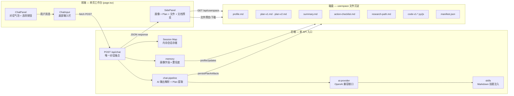
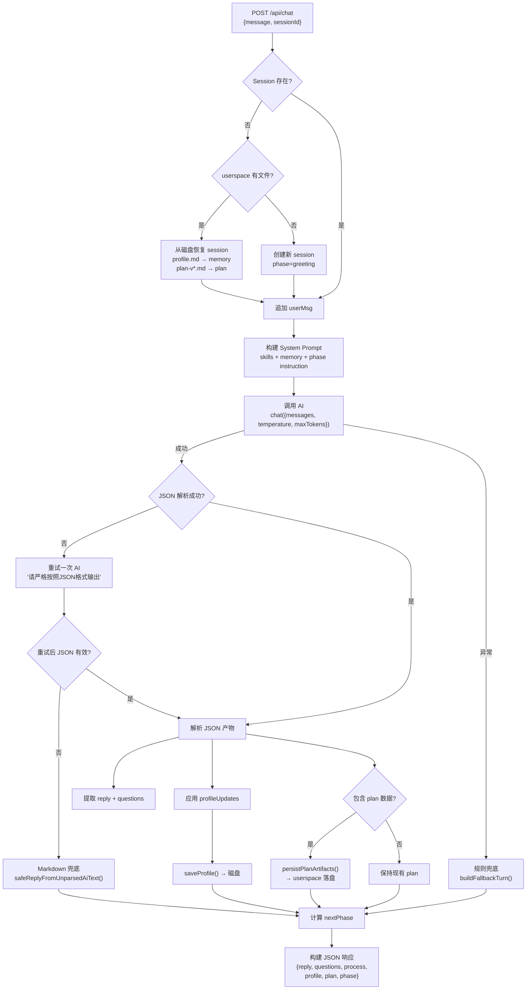
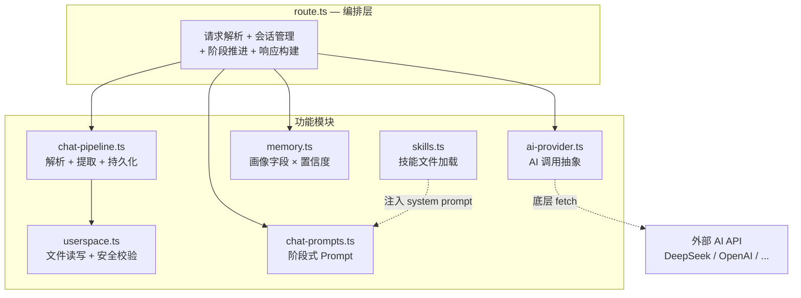

本文是「人人都能做科研」平台的架构全景图，面向需要理解系统整体运作方式的中级开发者。我们将从**三个核心架构决策**出发——单页工作台、单 API 入口、userspace 文件沉淀——逐一拆解它们如何协同工作，形成一条从用户输入到 AI 对话再到文件沉淀的完整数据流。

如果你希望先了解项目定位和核心对话闭环，建议阅读 [项目概览：让普通人走进科研思维](1-xiang-mu-gai-lan-rang-pu-tong-ren-zou-jin-ke-yan-si-wei) 和 [核心对话闭环：从模糊想法到可执行 Plan](3-he-xin-dui-hua-bi-huan-cong-mo-hu-xiang-fa-dao-ke-zhi-xing-plan)。

## 架构总览图

下面的 Mermaid 图展示了系统从浏览器到磁盘的完整数据流。阅读顺序：从左到右，先看前端组件布局，再看后端处理管线，最后看文件沉淀路径。



Sources: [page.tsx](src/app/page.tsx#L1-L219), [route.ts](src/app/api/chat/route.ts#L1-L495), [userspace.ts](src/lib/userspace.ts#L1-L225)

## 三大架构决策一览

| 架构决策 | 核心理念 | 关键实现文件 | 优势 | 代价 |
|---------|---------|------------|------|------|
| **单页工作台** | 前端零路由，一个 page.tsx 承载全部 UI | [page.tsx](src/app/page.tsx) | 状态集中、无页面切换延迟、撤销机制简单 | 组件数量增加时需注意渲染性能 |
| **单 API 入口** | `POST /api/chat` 是唯一写入端点 | [route.ts](src/app/api/chat/route.ts) | 状态机逻辑收敛、前后端契约清晰 | 单文件复杂度较高（495 行） |
| **userspace 文件沉淀** | 每个 session 对应一个磁盘目录，AI 产物自动落盘 | [userspace.ts](src/lib/userspace.ts), [chat-pipeline.ts](src/lib/chat-pipeline.ts#L472-L484) | 服务重启可恢复、用户可下载/系统打开 | 纯文件系统，无数据库事务保证 |

Sources: [page.tsx](src/app/page.tsx#L1-L219), [route.ts](src/app/api/chat/route.ts#L1-L70), [userspace.ts](src/lib/userspace.ts#L1-L30)

## 单页工作台：前端布局与状态模型

整个前端是一个 Next.js App Router 页面，由 `src/app/layout.tsx` 提供 HTML 外壳（`<html lang="zh-CN">`），核心页面 `src/app/page.tsx` 负责所有交互逻辑。页面分为两大区域：左侧 **chat-main** 包含对话面板（ChatPanel）和输入栏（ChatInput）；右侧 **side-panel** 包含用户画像卡片、Plan 面板、Plan 历史对比、文件列表和文档预览。

```
┌──────────────────────────────────────────────────────────┐
│  "人人都能做科研"                              [撤销] [新对话]  │
├────────────────────────────┬─────────────────────────────┤
│                            │  你的画像                     │
│   ChatPanel                │  ┌─ 10 个字段 × 置信度徽章 ─┐  │
│   ┌─ AI 对话气泡 ────────┐ │  │  ● 已确认  ◉ 推断中     │  │
│   │  ProcessPanel        │ │  │  ○ 猜测中              │  │
│   │  选择按钮 + 自由输入  │ │  └───────────────────────┘  │
│   └──────────────────────┘ │                             │
│                            │  PlanPanel                   │
│   ChatInput                │  ┌─ 行动步骤 + 风险提示 ───┐  │
│   ┌─ 输入框    [发送] ────┐ │  │  + "更简单/更专业/..."  │  │
│   └──────────────────────┘ │  └───────────────────────┘  │
│                            │  PlanHistoryPanel            │
│                            │  FileList (manifest 驱动)     │
│                            │  DocPanel (markdown/code 预览)│
└────────────────────────────┴─────────────────────────────┘
```

### 状态模型：useState + sessionStorage

前端状态由 7 个 `useState` 变量驱动，每次变更后自动序列化到 `sessionStorage`（键名 `triage:chat-session`），实现页面刷新不丢失对话数据。同时维护一个 `history` 栈，在每次发送消息前快照当前状态，用于实现「撤销上一轮对话」功能。

| 状态变量 | 类型 | 来源 | 作用 |
|---------|------|------|------|
| `messages` | `ChatMessage[]` | 用户输入 + API 响应 | 对话气泡渲染 |
| `profile` | `UserProfileState \| null` | API 响应 `profile` 字段 | 右侧画像卡片 |
| `profileConfidence` | `Record<string, number>` | API 响应 `profileConfidence` 字段 | 置信度徽章 |
| `plan` | `PlanState \| null` | API 响应 `plan` 字段 | Plan 面板 + 历史对比 |
| `sessionId` | `string` | 客户端 `crypto.randomUUID()` | 会话标识 |
| `loading` | `boolean` | 本地 | 禁用输入 / 显示"思考中" |
| `history` | 快照数组 | 发送前 push | 撤销机制 |

Sources: [page.tsx](src/app/page.tsx#L29-L67), [layout.tsx](src/app/layout.tsx#L1-L24), [side-panel.tsx](src/components/side-panel.tsx#L41-L128)

## 单 API 入口：POST /api/chat 的全生命周期

`POST /api/chat` 是整个系统唯一的写入端点。它承担了会话恢复、System Prompt 构建、AI 调用、JSON 解析、画像更新、Plan 提取与持久化、阶段推进等全部逻辑。下面是单次请求的完整处理流程：



### 请求/响应契约

**请求体**固定为两个字段：`message`（用户文本）和 `sessionId`（客户端生成的 UUID）。**响应体**的结构则根据对话阶段动态变化：

| 响应字段 | 类型 | 出现条件 | 说明 |
|---------|------|---------|------|
| `reply` | `string` | 始终 | AI 回复文本（或兜底文本） |
| `questions` | `string[]` | AI 返回了选项 | 结构化选项，前端渲染为按钮 |
| `process` | `string` | 始终 | 流程摘要，前端展示在 ProcessPanel |
| `profile` | `UserProfileState` | 画像有数据时 | 10 字段平铺对象 |
| `profileConfidence` | `Record<string, number>` | 画像有数据时 | 每个字段的置信度 |
| `plan` | `PlanState` | Plan 生成/更新时 | 完整 Plan 对象 |
| `phase` | `Phase` | 始终 | 当前阶段标识 |

### 内存会话存储与磁盘恢复

服务端使用 `Map<sessionId, session>` 存储活跃会话。当内存中没有对应 session 时，会检查 `userspace/{sessionId}/` 目录是否存在文件——如果存在，则从 `profile.md` 和 `plan-v*.md` 重建 session 状态（phase 设为 `profiling` 或 `reviewing`）。这意味着**服务重启不会丢失用户画像和 Plan 产物**，虽然对话历史会丢失。

Sources: [route.ts](src/app/api/chat/route.ts#L70-L155), [route.ts](src/app/api/chat/route.ts#L238-L260), [route.ts](src/app/api/chat/route.ts#L426-L487)

## userspace 文件沉淀：从 AI 产物到可交付文档

userspace 是系统的「文件沉淀层」——每次 Plan 生成或画像更新时，相关文档会被自动写入磁盘。每个 session 在 `userspace/` 目录下拥有一个独立子目录（以 sessionId 命名），内部文件通过 `manifest.json` 统一管理。

### 文件类型与生成时机

| 文件名模式 | 类型 | 内容 | 生成时机 |
|-----------|------|------|---------|
| `profile.md` | profile | 10 字段画像 Markdown（含置信度图标） | 每次画像字段变更时覆盖 |
| `plan-v{n}.md` | plan | 完整科研探索计划（画像 + 判断 + 步骤 + 风险） | 每次 Plan 生成/修改时新增版本 |
| `summary.md` | summary | 一页纸摘要（判断 + 路线 + 关键边界 + 下一步） | 与 Plan 同步更新 |
| `action-checklist.md` | checklist | 可勾选的行动检查清单 + 风险复核 | 与 Plan 同步更新 |
| `research-path.md` | path | 科研路径说明（起点 + 路径 + 为什么 + 分阶段） | 与 Plan 同步更新 |
| `code-v{n}-{name}.{ext}` | code | AI 生成的代码示例文件 | Plan 中包含 codeFiles 时 |
| `manifest.json` | — | 所有文件的元数据清单 | 每次文件写入时更新 |

### 路径安全校验

userspace 模块通过 `assertSafeSegment()` 函数对 sessionId 和 filename 进行严格校验：只允许 `[a-zA-Z0-9_.-]` 字符，禁止 `..` 路径遍历。此外，`filePath()` 函数在拼接路径后会验证 `path.resolve()` 结果是否以 session 根目录为前缀，形成**双重防护**。

### 前端文件交互：预览、下载与系统打开

右侧 SidePanel 中的 FileList 组件通过 `GET /api/userspace/{sessionId}` 获取文件清单（返回 `FileManifest[]`），点击文件后 DocPanel 组件通过 `GET /api/userspace/{sessionId}/{filename}` 获取内容并在页内预览（Markdown 渲染或代码块展示）。用户还可以通过「系统打开」（调用系统默认应用）、「打开」（浏览器新标签）、「下载」三种方式处理文件。

Sources: [userspace.ts](src/lib/userspace.ts#L1-L30), [userspace.ts](src/lib/userspace.ts#L112-L168), [chat-pipeline.ts](src/lib/chat-pipeline.ts#L472-L484), [file-list.tsx](src/components/file-list.tsx#L23-L76), [doc-panel.tsx](src/components/doc-panel.tsx#L21-L135), [userspace route.ts](src/app/api/userspace/[sessionId]/[[...filename]]/route.ts#L1-L86)

## 后端模块职责划分

`POST /api/chat` 的处理逻辑分布在 6 个核心模块中，每个模块职责单一、边界清晰：



| 模块 | 文件 | 核心职责 | 被谁调用 |
|------|------|---------|---------|
| **ai-provider** | [ai-provider.ts](src/lib/ai-provider.ts) | 封装 OpenAI 兼容 `/chat/completions` 调用 | route.ts |
| **chat-pipeline** | [chat-pipeline.ts](src/lib/chat-pipeline.ts) | JSON 解析、Plan 提取、Markdown 兜底、文件持久化 | route.ts |
| **memory** | [memory.ts](src/lib/memory.ts) | 画像字段的置信度管理、就绪判定、序列化 | route.ts |
| **chat-prompts** | [chat-prompts.ts](src/lib/chat-prompts.ts) | 按阶段构建 System Prompt | route.ts |
| **userspace** | [userspace.ts](src/lib/userspace.ts) | 文件系统操作（读写、清单、安全校验） | route.ts + chat-pipeline.ts |
| **skills** | [skills.ts](src/lib/skills.ts) | 从 `skills/` 目录加载 Markdown 技能文件并注入 Prompt | chat-prompts.ts |
| **triage-types** | [triage-types.ts](src/lib/triage-types.ts) | 全局类型定义（Phase、ChatMessage、PlanState 等） | 所有模块 |

Sources: [ai-provider.ts](src/lib/ai-provider.ts#L1-L117), [chat-pipeline.ts](src/lib/chat-pipeline.ts#L1-L48), [memory.ts](src/lib/memory.ts#L1-L93), [skills.ts](src/lib/skills.ts#L1-L50), [triage-types.ts](src/lib/triage-types.ts#L110-L170)

## 前端组件树与数据流

前端组件树以 `page.tsx` 为根节点，通过 props 向下传递状态，通过回调函数向上传递用户动作。这是一个典型的**状态提升**模式——所有状态集中在 page.tsx，子组件仅负责渲染和触发回调。

| 组件 | 文件 | 接收的 Props | 触发的回调 |
|------|------|------------|----------|
| **ChatPanel** | [chat-panel.tsx](src/components/chat-panel.tsx) | `messages`, `loading` | `onSelect(text)` → 触发 sendMessage |
| **ChatInput** | [chat-input.tsx](src/components/chat-input.tsx) | `disabled` | `onSend(text)` → 触发 sendMessage |
| **SidePanel** | [side-panel.tsx](src/components/side-panel.tsx) | `profile`, `profileConfidence`, `plan`, `sessionId`, `fileRefresh` | `onPlanAction(message)` → 触发 sendMessage |
| **ChoiceButtons** | [choice-buttons.tsx](src/components/choice-buttons.tsx) | `questions`, `disabled` | `onSelect(text)` |
| **ProcessPanel** | [process-panel.tsx](src/components/process-panel.tsx) | `process` (字符串) | 无 |
| **FileList** | [file-list.tsx](src/components/file-list.tsx) | `sessionId`, `refreshTrigger` | `onFileSelect(filename)` → 打开预览 |
| **DocPanel** | [doc-panel.tsx](src/components/doc-panel.tsx) | `sessionId`, `activeFile` | `onClose()` → 关闭预览 |
| **PlanHistoryPanel** | [plan-history-panel.tsx](src/components/plan-history-panel.tsx) | `sessionId`, `files` | `onFileSelect(filename)` → 打开预览 |

关键数据流路径：用户点击选项按钮 → `handleSelect` → `sendMessage` → `fetch POST /api/chat` → 响应更新 `messages`/`profile`/`plan` → React 重渲染对应组件。当 `profile` 或 `plan` 发生变化时，`fileRefresh` 计数器递增，触发 FileList 重新请求 `/api/userspace` 获取最新文件清单。

Sources: [page.tsx](src/app/page.tsx#L69-L140), [page.tsx](src/app/page.tsx#L177-L218), [side-panel.tsx](src/components/side-panel.tsx#L41-L128)

## 设计取舍与边界条件

### 为什么选择单 API 入口而非 RESTful 多端点

本系统的核心交互模式是**对话驱动**——用户始终通过「发一条消息」触发所有副作用。将画像更新、Plan 生成、阶段推进等逻辑全部收敛到 `POST /api/chat` 中，避免了多端点间的状态同步问题。代价是 `route.ts` 文件较长（495 行），但通过将解析逻辑拆分到 `chat-pipeline.ts` 和 `memory.ts`，保持了单文件的可读性。

### 为什么选择文件系统而非数据库

MVP 阶段选择文件系统有三个考量：零外部依赖（无需数据库部署）、调试友好（直接 `cat userspace/{sessionId}/plan-v1.md` 查看产物）、天然支持版本化（plan-v1.md、plan-v2.md 并存）。代价是没有事务保证和并发控制，但在单用户本地运行场景下这是可接受的折衷。

### 服务重启后的恢复边界

服务重启后，内存中的 `Map<sessionId, session>` 会丢失。系统能从 userspace 磁盘文件恢复**画像和 Plan 产物**，但**对话历史不可恢复**——恢复后的 session 以空的 `messages` 数组开始。这意味着 AI 在重启后的首轮对话中无法参考之前的聊天上下文，只能基于已恢复的画像和 Plan 进行推断。

Sources: [route.ts](src/app/api/chat/route.ts#L82-L155), [chat-pipeline.ts](src/lib/chat-pipeline.ts#L486-L506)

## 延伸阅读

本文覆盖了系统的宏观架构。如果你想深入某个具体模块，以下是按学习路径推荐的后续阅读：

- **阶段状态机**：理解 `greeting → profiling → clarifying → planning → reviewing` 五阶段如何推进 → [对话阶段状态机：greeting → profiling → clarifying → planning → reviewing](7-dui-hua-jie-duan-zhuang-tai-ji-greeting-profiling-clarifying-planning-reviewing)
- **前端持久化细节**：sessionStorage 序列化策略与撤销栈实现 → [前端状态管理：sessionStorage 持久化与撤销机制](8-qian-duan-zhuang-tai-guan-li-sessionstorage-chi-jiu-hua-yu-che-xiao-ji-zhi)
- **AI 输出解析**：JSON 提取的多层容错策略 → [AI 输出解析：JSON 提取、协议识别与 Markdown 兜底](9-ai-shu-chu-jie-xi-json-ti-qu-xie-yi-shi-bie-yu-markdown-dou-di)
- **文件系统安全**：路径校验、清单管理与会话隔离 → [userspace 文件系统：会话隔离、路径安全校验与文件清单管理](20-userspace-wen-jian-xi-tong-hui-hua-ge-chi-lu-jing-an-quan-xiao-yan-yu-wen-jian-qing-dan-guan-li)
- **API 接口契约**：完整的请求/响应协议字段说明 → [POST /api/chat：请求/响应协议与阶段推进逻辑](22-post-api-chat-qing-qiu-xiang-ying-xie-yi-yu-jie-duan-tui-jin-luo-ji)