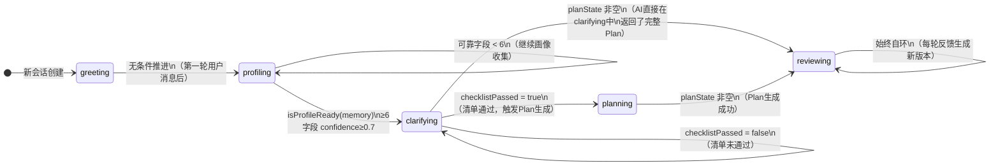
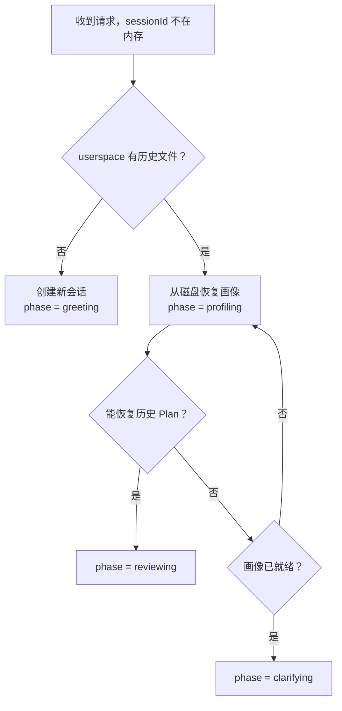

本文档深入剖析「人人都能做科研」系统的**五阶段对话状态机**——这是整个对话管线的控制中枢。状态机决定了系统在何时从闲聊转向画像收集、何时触发 Plan 生成、以及用户反馈如何驱动 Plan 迭代。理解这个状态机，就理解了系统从「用户的第一句模糊表述」到「可执行的科研探索计划」的完整推进逻辑。

Sources: [triage-types.ts](src/lib/triage-types.ts#L168-L170), [chat-pipeline.ts](src/lib/chat-pipeline.ts#L629-L647)

## 状态机总览：五个阶段的职责与推进条件

系统的对话生命周期由 `Phase` 类型精确定义，包含五个有序阶段：

```typescript
export type Phase = "greeting" | "profiling" | "clarifying" | "planning" | "reviewing";
```

每个阶段有**独立的 Prompt 指令**（通过 `getInstructionForPhase` 分发）和**明确的推进条件**（通过 `getNextPhase` 判定）。整个状态机遵循一个核心设计原则：**阶段只能单向前进，不可回退**——唯一的例外是 `reviewing` 阶段，它是一个自环终端状态，允许无限次 Plan 迭代。

Sources: [triage-types.ts](src/lib/triage-types.ts#L168-L170), [chat-prompts.ts](src/lib/chat-prompts.ts#L195-L201)

### 阶段职责对比表

| 阶段 | 中文名 | 核心职责 | AI 输出协议 | 推进条件 |
|------|--------|----------|-------------|----------|
| **greeting** | 开场引导 | 首次接触，展示方向选项 | `{ reply, questions }` | **无条件**→ profiling |
| **profiling** | 画像识别 | 多轮对话提取 10 字段画像 | `{ reply, questions, profileUpdates }` | 可靠字段 ≥ 6 → clarifying |
| **clarifying** | 问题收敛 | 9 项前置检查清单验证 | `{ reply, questions, checklistPassed }` | `checklistPassed=true` → planning |
| **planning** | Plan 生成 | 生成可执行科研计划 + 代码 | `{ reply, plan, codeFiles }` | planState 非空 → reviewing |
| **reviewing** | Plan 调整 | 按用户反馈迭代 Plan 版本 | `{ reply, plan, codeFiles }` | **自环**，始终停留在 reviewing |

Sources: [chat-pipeline.ts](src/lib/chat-pipeline.ts#L570-L579), [chat-prompts.ts](src/lib/chat-prompts.ts#L42-L194)

### 状态转换流程图

下图展示了从 `getNextPhase` 函数提取的完整状态转换逻辑。每个箭头标注了触发转换的条件：



Sources: [chat-pipeline.ts](src/lib/chat-pipeline.ts#L629-L647)

## 转换函数深度解析：getNextPhase

状态机的核心决策逻辑集中在 `getNextPhase` 函数中，这是一个**纯函数**——它接收当前状态快照，返回下一阶段，不产生任何副作用：

```typescript
export function getNextPhase({
  currentPhase,
  memory,
  planState,
  checklistPassed,
}: {
  currentPhase: Phase;
  memory: UserProfileMemory;
  planState?: PlanState | null;
  checklistPassed: boolean;
}): Phase {
  if (currentPhase === "greeting") return "profiling";
  if (currentPhase === "profiling" && isProfileReady(memory)) return "clarifying";
  if (currentPhase === "clarifying" && planState) return "reviewing";
  if (currentPhase === "clarifying" && checklistPassed) return "planning";
  if (currentPhase === "planning" && planState) return "reviewing";
  if (currentPhase === "reviewing") return "reviewing";
  return currentPhase;  // 默认：保持当前阶段
}
```

这段代码的设计有几个值得注意的决策点。首先，`greeting → profiling` 是**无条件推进**——系统在第一轮对话后立即进入画像收集，不依赖任何判定条件。其次，`profiling → clarifying` 的门槛是画像就绪判定（详见[画像就绪判定与服务重启恢复](12-hua-xiang-jiu-xu-pan-ding-yu-fu-wu-zhong-qi-hui-fu)），要求至少 6 个字段的置信度 ≥ 0.7。最精妙的是 `clarifying` 阶段的**双出口设计**：如果 AI 在 clarifying 阶段就直接返回了完整的 Plan（`planState` 非空），则跳过 planning 阶段直接进入 reviewing；否则等待 `checklistPassed=true` 后进入 planning 阶段正式生成 Plan。

Sources: [chat-pipeline.ts](src/lib/chat-pipeline.ts#L629-L647)

## 阶段一：greeting（开场引导）

**触发时机**：全新会话的第一轮用户消息。当 API 路由检测到 `sessions` Map 中不存在该 `sessionId`，且 userspace 磁盘上也没有历史文件时，会话以 `phase: "greeting"` 初始化。

**AI 指令特征**：`GREETING_INSTRUCTION` 严格要求 AI 返回包含 `reply`（陈述句开场白，**禁止问号**）和 `questions`（3-4 个方向性选项）的 JSON。一个关键约束是所有追问必须放在 `questions` 数组中，`reply` 中不得出现任何疑问句——这保证了前端渲染时，对话气泡呈现的是引导性陈述，而可点击的选项按钮承载了所有交互。

**推进逻辑**：第一轮完成后，`getNextPhase` 无条件返回 `"profiling"`。甚至在 AI 调用失败时，规则兜底函数 `buildFallbackTurn` 也会将 `greeting` 强制推进到 `profiling`：

```typescript
if (session.phase === "greeting") {
  session.phase = "profiling";
}
```

Sources: [chat-prompts.ts](src/lib/chat-prompts.ts#L42-L64), [chat-pipeline.ts](src/lib/chat-pipeline.ts#L640), [src/app/api/chat/route.ts](src/app/api/chat/route.ts#L146-L152), [src/app/api/chat/route.ts](src/app/api/chat/route.ts#L202-L204)

## 阶段二：profiling（画像识别）

**触发时机**：greeting 完成后自动进入。这是对话轮次最多的阶段——系统需要通过多轮结构化对话，从用户的自然语言回复中提取 10 个画像字段。

**AI 指令特征**：`PROFILING_INSTRUCTION` 要求 AI 在每轮返回中同时完成两件事：(1) 通过 `profileUpdates` 数组从用户话语中提取画像字段及其置信度；(2) 通过 `questions` 继续追问尚未确认的字段。这种「边提取边追问」的双轨设计使得画像构建可以在自然对话中渐进完成，而非一次性表单填写。

**推进条件**：当 `isProfileReady(memory)` 返回 `true` 时推进到 clarifying。就绪判定的具体逻辑是 10 个字段中至少有 6 个的置信度 ≥ 0.7（即达到「用户暗示」或「用户明确说了」级别）。关于画像字段的完整定义和置信度模型，详见[画像字段与置信度模型：10 字段 × 三级置信度](11-hua-xiang-zi-duan-yu-zhi-xin-du-mo-xing)。

Sources: [chat-prompts.ts](src/lib/chat-prompts.ts#L66-L112), [memory.ts](src/lib/memory.ts#L60-L63), [chat-pipeline.ts](src/lib/chat-pipeline.ts#L641)

## 阶段三：clarifying（问题收敛）

**触发时机**：画像就绪后自动进入。这是 Plan 生成前的**安全网**阶段。

**AI 指令特征**：`CLARIFYING_INSTRUCTION` 内嵌了一个 **9 项前置检查清单**，要求 AI 在生成 Plan 之前逐项验证：用户身份、目标收敛、工具能力、时间约束、交付物期望、隐含假设、问题范围、可执行性、阶段跳跃风险。AI 必须在响应中通过 `checklistPassed` 字段明确报告清单是否通过。

**双出口设计**：这是状态机中最复杂的转换节点。API 路由中的处理逻辑如下：

1. 如果 AI 在 clarifying 阶段的 JSON 响应中直接包含了完整的 `plan`（`planState` 非空），`getNextPhase` 返回 `"reviewing"`——跳过 planning 阶段。
2. 如果 `checklistPassed=true` 但没有 plan，API 路由会**自动追加一次 planning AI 调用**——将 `PLANNING_INSTRUCTION` 注入系统提示词，用相同的对话历史重新请求 AI 生成 Plan，然后推进到 reviewing。
3. 如果 `checklistPassed=false`，继续停留在 clarifying 阶段追问。

第二种情况的实现是一个**管线内二次调用**，在 API 路由中直接发起：

```typescript
if (session.phase === "clarifying" && checklistPassed && !planState) {
  const planningSystemPrompt = buildChatSystemPrompt(
    session.memory, "planning", PLANNING_INSTRUCTION, session.plan,
  );
  const planningMessages = buildConversationMessages(planningSystemPrompt, session.messages);
  aiResult = await chat({ messages: planningMessages, ... });
  // ... 解析并持久化 Plan
}
```

Sources: [chat-prompts.ts](src/lib/chat-prompts.ts#L114-L143), [chat-pipeline.ts](src/lib/chat-pipeline.ts#L642-L643), [src/app/api/chat/route.ts](src/app/api/chat/route.ts#L334-L378)

## 阶段四：planning（Plan 生成）

**触发时机**：正常路径下由 clarifying 阶段的管线内二次调用触发（见上文），或者由 `getNextPhase` 在 `checklistPassed=true` 时返回。

**AI 指令特征**：`PLANNING_INSTRUCTION` 要求 AI 返回包含 `plan` 对象和可选 `codeFiles` 数组的 JSON。Plan 对象必须包含 7 个字段：用户画像摘要、问题判断、系统逻辑、推荐路径、3-7 个可执行步骤（含动作、时限、验证方法）、风险提示、下一步选项。当任务明确需要代码时，`codeFiles` 中每个文件必须是**最小可运行版本**。

**推进条件**：当 `planState` 非空时推进到 reviewing。Plan 生成后会立即调用 `persistPlanArtifacts` 将 Plan Markdown、摘要文档、行动检查清单、科研路径说明以及代码文件全部写入 userspace 文件系统。

Sources: [chat-prompts.ts](src/lib/chat-prompts.ts#L145-L180), [chat-pipeline.ts](src/lib/chat-pipeline.ts#L644), [chat-pipeline.ts](src/lib/chat-pipeline.ts#L472-L484)

## 阶段五：reviewing（Plan 调整）

**触发时机**：planning 阶段成功生成 Plan 后进入，或 clarifying 阶段直接返回 Plan 时进入。

**AI 指令特征**：`REVIEWING_INSTRUCTION` 要求 AI 先判断用户的反馈意图（更简单/更专业/拆开讲/换方向），然后重新生成完整 Plan。关键规则是 `systemLogic` 字段必须说明本次修改相对上一版改变了什么，而 `reply` 只需一句话说明 Plan 已更新。

**自环设计**：`getNextPhase` 对 reviewing 阶段始终返回 `"reviewing"`——这意味着用户可以无限次反馈调整，每次都会生成新版本的 Plan（版本号递增），旧版本保留在 userspace 中供历史对比。关于 Plan 版本管理的前端展示，详见[右侧面板：画像、Plan、文件与历史对比](5-you-ce-mian-ban-hua-xiang-plan-wen-jian-yu-li-shi-dui-bi)。

Sources: [chat-prompts.ts](src/lib/chat-prompts.ts#L182-L193), [chat-pipeline.ts](src/lib/chat-pipeline.ts#L645-L646)

## 阶段与 Prompt 的绑定机制

每个阶段通过 `getInstructionForPhase` 函数获取专属的 Prompt 指令文本，然后通过 `buildChatSystemPrompt` 组装成完整的系统提示词。组装过程分三层：

1. **Skills 层**：`buildSystemPrompt("")` 加载 `skills/` 目录下所有 Markdown 技能文件（科研方法论等），作为系统提示词的前缀。
2. **状态上下文层**：`buildStateContext` 注入当前阶段、画像就绪状态、已确认字段、研究方向和当前 Plan 版本。
3. **阶段指令层**：阶段专属的 `INSTRUCTION` 文本，定义 JSON 输出协议和规则。

```typescript
export function buildChatSystemPrompt(memory, phase, instruction, plan?): string {
  const stateBlock = buildStateContext(memory, phase, plan);  // 状态上下文
  const skillsBlock = buildSystemPrompt("");                   // Skills 加载
  return `${skillsBlock}\n## 当前状态\n${stateBlock}\n${instruction}\n输出格式：...JSON...`;
}
```

这种分层设计意味着同一个 AI 模型在不同阶段接收到的系统提示词截然不同，而 Skills 层作为共享知识库始终存在。关于 Skills 加载机制的详细设计，参见 [Skills 加载机制：Markdown 技能文件注入系统 Prompt](15-skills-jia-zai-ji-zhi-markdown-ji-neng-wen-jian-zhu-ru-xi-tong-prompt)。

Sources: [chat-prompts.ts](src/lib/chat-prompts.ts#L23-L40), [chat-prompts.ts](src/lib/chat-prompts.ts#L5-L21), [skills.ts](src/lib/skills.ts#L39-L44)

## 服务重启恢复：从磁盘重建阶段

状态机的另一个关键设计是**会话恢复**。由于 `sessions` 存储在内存中的 `Map` 里，服务重启后所有会话丢失。API 路由通过 userspace 文件系统实现恢复：



恢复逻辑的优先级是：**有 Plan → reviewing** > **画像就绪但无 Plan → clarifying** > **画像不完整 → profiling**。这保证了服务重启后，用户不会丢失已完成的进度。详细实现参见[画像就绪判定与服务重启恢复](12-hua-xiang-jiu-xu-pan-ding-yu-fu-wu-zhong-qi-hui-fu)。

Sources: [src/app/api/chat/route.ts](src/app/api/chat/route.ts#L83-L155)

## 规则兜底：AI 不可用时的阶段处理

当 AI 调用失败（网络异常、接口超时等），`buildFallbackTurn` 函数根据当前阶段和画像状态生成**纯规则响应**：

| 条件 | 兜底 reply | 兜底 questions |
|------|-----------|----------------|
| `phase === "greeting"` | "当前 AI 服务暂时不可用，我先用规则模式帮你进入科研分诊流程。" | 4 个预设方向选项 |
| 画像未就绪 | "当前 AI 服务暂时不可用，我需要先补齐几个关键画像字段" | 基础水平/执行偏好/时间紧迫等选项 |
| 画像就绪但无 Plan | "画像已经基本明确，但生成 Plan 前还需要确认目标范围" | 收窄问题/一周计划/确认交付物等选项 |
| 已有 Plan | "已有 Plan 已保留在右侧面板和文件列表中" | 等恢复后调整的选项 |

注意：规则兜底时 `greeting` 阶段仍会强制推进到 `profiling`，确保状态机不会因 AI 不可用而卡死在初始阶段。

Sources: [chat-pipeline.ts](src/lib/chat-pipeline.ts#L518-L568), [src/app/api/chat/route.ts](src/app/api/chat/route.ts#L192-L237)

## 流程摘要：buildProcessSummary

每个 AI 回复都附带一个 `process` 字符串，通过 `buildProcessSummary` 生成，用于在前端 ProcessPanel 中展示当前管线状态。它记录了阶段转换、画像进度、AI/兜底模式、Plan 版本等诊断信息。这个摘要对于调试和理解系统行为非常有用——当阶段推进不如预期时，检查 `process` 输出是定位问题的第一步。

Sources: [chat-pipeline.ts](src/lib/chat-pipeline.ts#L581-L627)

## 延伸阅读

- **阶段 Prompt 的完整 JSON 协议定义**：参见[阶段式 Prompt 设计：每个阶段的 JSON 输出协议](14-jie-duan-shi-prompt-she-ji-mei-ge-jie-duan-de-json-shu-chu-xie-yi)
- **画像字段如何影响阶段推进**：参见[画像字段与置信度模型：10 字段 × 三级置信度](11-hua-xiang-zi-duan-yu-zhi-xin-du-mo-xing-10-zi-duan-x-san-ji-zhi-xin-du)
- **前端如何响应阶段变化**：参见[前端状态管理：sessionStorage 持久化与撤销机制](8-qian-duan-zhuang-tai-guan-li-sessionstorage-chi-jiu-hua-yu-che-xiao-ji-zhi)
- **AI 输出解析与容错**：参见[AI 输出解析：JSON 提取、协议识别与 Markdown 兜底](9-ai-shu-chu-jie-xi-json-ti-qu-xie-yi-shi-bie-yu-markdown-dou-di)